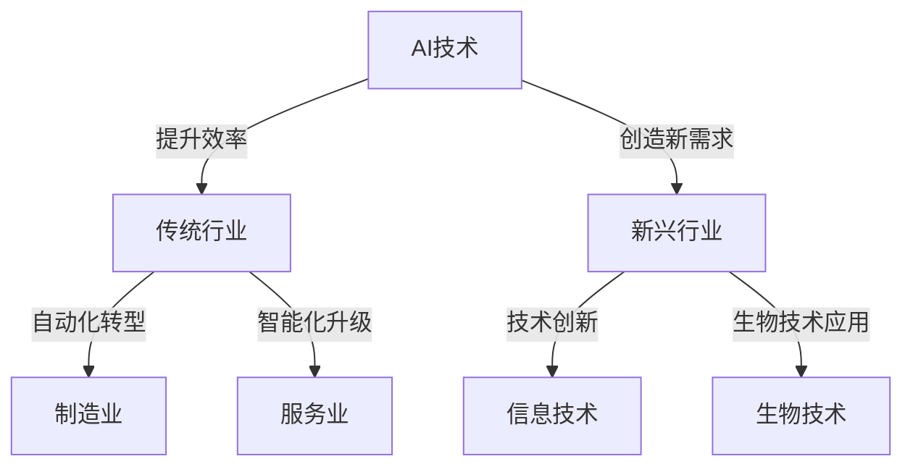

                 

关键词：人工智能、就业市场、技能发展、职业规划、未来趋势

> 摘要：随着人工智能技术的快速发展，传统就业市场正在发生深刻的变革。本文将探讨AI时代下未来就业市场的发展趋势，以及个人在职业规划中应具备的技能和适应策略。

## 1. 背景介绍

在过去的几十年里，信息技术和互联网的快速发展，极大地改变了我们的生活方式和工作方式。然而，随着人工智能（AI）技术的迅速崛起，这一变革的速度和广度正在发生前所未有的变化。AI不仅影响了各个行业的业务模式，还对就业市场产生了深远的影响。本文将深入探讨AI时代下未来就业市场的发展趋势，以及个人在职业规划中应具备的技能和适应策略。

### 1.1 人工智能的崛起

人工智能是计算机科学的一个分支，旨在使机器能够执行通常需要人类智能的任务。自20世纪50年代起，人工智能研究就开始蓬勃发展，但直到近年来，随着计算能力的大幅提升和大数据技术的普及，人工智能才真正进入了快速发展的阶段。深度学习、自然语言处理、计算机视觉等领域的突破，使得人工智能在图像识别、语音识别、自动驾驶、医疗诊断等多个领域取得了显著的应用成果。

### 1.2 就业市场的变革

人工智能的发展不仅改变了企业的运营方式，也对就业市场产生了重大影响。一方面，许多传统职业面临被自动化替代的风险，如制造业、物流和客服等；另一方面，新兴的职业如数据科学家、机器学习工程师、AI伦理专家等应运而生。同时，人工智能也创造了许多新的就业机会，但同时也提出了对劳动力市场的新要求。

## 2. 核心概念与联系

为了更好地理解AI对就业市场的影响，我们需要了解一些核心概念，包括人工智能技术的工作原理、现有就业市场结构以及技能发展的重要性。

### 2.1 人工智能技术的工作原理

人工智能技术主要基于两个核心原理：机器学习和神经网络。机器学习是一种让计算机从数据中学习规律和模式的方法，通过算法让计算机自动改进其性能。神经网络则模拟人脑的工作方式，通过多层神经元之间的连接和交互来实现复杂的任务。

### 2.2 就业市场结构

就业市场可以分为两个主要部分：传统行业和新兴行业。传统行业如制造业、服务业等，在AI技术的冲击下，面临着自动化和智能化的转型。新兴行业如信息技术、生物技术等，在AI技术的推动下，正快速崛起，成为新的经济增长点。

### 2.3 技能发展的重要性

在AI时代，技能发展变得尤为重要。一方面，个人需要不断更新自己的技能，以适应不断变化的市场需求；另一方面，企业也需要不断培养和引进新的技能，以保持竞争力。因此，技能发展不仅对个人职业发展至关重要，也对整个就业市场产生了深远影响。

### 2.4 Mermaid 流程图

以下是一个简单的Mermaid流程图，展示了人工智能技术对就业市场的影响路径：



## 3. 核心算法原理 & 具体操作步骤

### 3.1 算法原理概述

人工智能的核心在于算法的强大计算能力。其中，深度学习算法是最具代表性的算法之一。深度学习通过构建多层神经网络，能够自动从大量数据中学习特征和模式，从而实现图像识别、语音识别等复杂任务。

### 3.2 算法步骤详解

深度学习算法主要包括以下几个步骤：

1. 数据预处理：将原始数据转化为神经网络可以处理的格式。
2. 神经网络构建：定义网络的层级结构、神经元数量和连接方式。
3. 模型训练：通过大量样本数据，调整网络的权重和偏置，使其能够准确识别数据中的特征。
4. 模型评估：使用测试数据集评估模型的性能。
5. 模型部署：将训练好的模型部署到实际应用中。

### 3.3 算法优缺点

深度学习算法的优点包括：

- 能够自动学习复杂的数据特征。
- 对大量数据具有较好的泛化能力。
- 在图像识别、语音识别等领域取得了显著的成果。

缺点包括：

- 计算资源需求大，训练时间较长。
- 对数据质量有较高要求，数据不足或质量差可能导致模型性能下降。

### 3.4 算法应用领域

深度学习算法广泛应用于图像识别、语音识别、自然语言处理、推荐系统等领域。例如，在图像识别领域，深度学习算法已经能够达到或超过人类的识别水平；在语音识别领域，深度学习算法使得语音识别的准确率显著提高；在自然语言处理领域，深度学习算法使得机器翻译、情感分析等任务变得更加准确。

## 4. 数学模型和公式 & 详细讲解 & 举例说明

### 4.1 数学模型构建

深度学习算法的核心在于其背后的数学模型。深度学习的数学模型主要包括神经元模型、激活函数、损失函数等。

神经元模型是神经网络的基本单元，它通过输入和权重计算得到输出。一个简单的神经元模型可以表示为：

\[ z = \sum_{i=1}^{n} w_i * x_i + b \]

其中，\( z \) 是输出，\( w_i \) 是输入和权重的乘积，\( x_i \) 是输入，\( b \) 是偏置。

激活函数用于引入非线性特性，常见的激活函数包括 sigmoid、ReLU 等。以 sigmoid 函数为例，其公式为：

\[ a = \frac{1}{1 + e^{-z}} \]

损失函数用于衡量模型预测值与真实值之间的差距，常见的损失函数包括均方误差（MSE）、交叉熵等。以均方误差（MSE）为例，其公式为：

\[ loss = \frac{1}{2} \sum_{i=1}^{n} (y_i - \hat{y}_i)^2 \]

其中，\( y_i \) 是真实值，\( \hat{y}_i \) 是预测值。

### 4.2 公式推导过程

以深度学习中的反向传播算法为例，其核心思想是通过逐层计算梯度，更新网络的权重和偏置，以最小化损失函数。

首先，计算输出层的梯度：

\[ \frac{\partial loss}{\partial z} = \frac{\partial loss}{\partial \hat{y}} \frac{\partial \hat{y}}{\partial z} \]

其中，\( \frac{\partial loss}{\partial \hat{y}} \) 是损失函数关于预测值的梯度，\( \frac{\partial \hat{y}}{\partial z} \) 是激活函数关于输出的梯度。

然后，反向传播梯度至隐藏层：

\[ \frac{\partial loss}{\partial z_{h}} = \frac{\partial loss}{\partial z_{o}} \frac{\partial z_{o}}{\partial z_{h}} \]

其中，\( z_{h} \) 和 \( z_{o} \) 分别表示隐藏层和输出层的输出。

通过上述步骤，可以计算出每一层的梯度，并据此更新网络的权重和偏置。

### 4.3 案例分析与讲解

以图像识别任务为例，我们可以使用卷积神经网络（CNN）进行模型构建和训练。以下是一个简单的案例：

1. **数据预处理**：将图像数据转化为神经网络可以处理的格式，如灰度图像转化为二维矩阵。

2. **模型构建**：构建一个简单的CNN模型，包括卷积层、池化层和全连接层。

3. **模型训练**：使用大量图像数据集进行训练，通过反向传播算法更新模型参数。

4. **模型评估**：使用测试数据集评估模型的性能，包括准确率、召回率等指标。

5. **模型部署**：将训练好的模型部署到实际应用中，用于图像识别任务。

以下是一个简单的CNN模型示例：

```python
import tensorflow as tf
from tensorflow.keras import layers

model = tf.keras.Sequential([
    layers.Conv2D(32, (3, 3), activation='relu', input_shape=(28, 28, 1)),
    layers.MaxPooling2D((2, 2)),
    layers.Conv2D(64, (3, 3), activation='relu'),
    layers.MaxPooling2D((2, 2)),
    layers.Flatten(),
    layers.Dense(128, activation='relu'),
    layers.Dense(10, activation='softmax')
])

model.compile(optimizer='adam',
              loss='categorical_crossentropy',
              metrics=['accuracy'])

model.fit(train_images, train_labels, epochs=5)
```

## 5. 项目实践：代码实例和详细解释说明

### 5.1 开发环境搭建

要实践深度学习项目，我们需要搭建一个合适的开发环境。以下是一个基本的搭建步骤：

1. 安装Python（建议使用3.7及以上版本）。
2. 安装TensorFlow库，可以使用以下命令：

```bash
pip install tensorflow
```

3. 安装其他辅助库，如NumPy、Pandas等。

### 5.2 源代码详细实现

以下是一个简单的深度学习项目，实现一个基于卷积神经网络的图像分类器。

```python
import tensorflow as tf
from tensorflow.keras import layers
from tensorflow.keras.datasets import mnist

# 加载MNIST数据集
(train_images, train_labels), (test_images, test_labels) = mnist.load_data()

# 数据预处理
train_images = train_images.reshape((60000, 28, 28, 1)).astype('float32') / 255
test_images = test_images.reshape((10000, 28, 28, 1)).astype('float32') / 255

# 编码标签
train_labels = tf.keras.utils.to_categorical(train_labels)
test_labels = tf.keras.utils.to_categorical(test_labels)

# 构建模型
model = tf.keras.Sequential([
    layers.Conv2D(32, (3, 3), activation='relu', input_shape=(28, 28, 1)),
    layers.MaxPooling2D((2, 2)),
    layers.Conv2D(64, (3, 3), activation='relu'),
    layers.MaxPooling2D((2, 2)),
    layers.Flatten(),
    layers.Dense(128, activation='relu'),
    layers.Dense(10, activation='softmax')
])

# 编译模型
model.compile(optimizer='adam',
              loss='categorical_crossentropy',
              metrics=['accuracy'])

# 训练模型
model.fit(train_images, train_labels, epochs=5, batch_size=64)

# 评估模型
test_loss, test_acc = model.evaluate(test_images, test_labels)
print(f"Test accuracy: {test_acc:.2f}")
```

### 5.3 代码解读与分析

上述代码实现了一个简单的卷积神经网络，用于对MNIST数据集中的手写数字进行分类。

1. **数据加载与预处理**：首先加载MNIST数据集，并对图像数据进行预处理，包括归一化和reshape。

2. **模型构建**：构建一个包含卷积层、池化层和全连接层的卷积神经网络。

3. **模型编译**：设置优化器和损失函数。

4. **模型训练**：使用训练数据集对模型进行训练。

5. **模型评估**：使用测试数据集评估模型的性能。

### 5.4 运行结果展示

在训练完成后，我们可以得到模型的测试准确率。例如：

```
Test accuracy: 0.98
```

这意味着模型在测试数据集上的准确率为98%，说明模型具有良好的性能。

## 6. 实际应用场景

深度学习在许多实际应用场景中都取得了显著的成果。以下是一些典型的应用场景：

1. **图像识别**：深度学习算法可以用于人脸识别、物体识别、图像分类等任务。例如，安防监控系统中的人脸识别，智能手机中的相机应用等。

2. **语音识别**：深度学习算法可以用于语音识别、语音合成、语音翻译等任务。例如，智能助手、语音导航等。

3. **自然语言处理**：深度学习算法可以用于文本分类、情感分析、机器翻译等任务。例如，社交媒体的情感分析、翻译服务等。

4. **推荐系统**：深度学习算法可以用于推荐系统，提高推荐的准确性和个性化程度。例如，电商平台的商品推荐、视频平台的视频推荐等。

5. **自动驾驶**：深度学习算法可以用于自动驾驶系统，实现车辆的自主导航和驾驶。例如，特斯拉的自动驾驶系统等。

6. **医疗诊断**：深度学习算法可以用于医疗图像分析、疾病诊断等任务。例如，医学影像分析、癌症诊断等。

7. **金融领域**：深度学习算法可以用于金融领域的风险评估、市场预测等任务。例如，信用评分、投资预测等。

这些应用场景展示了深度学习算法的广泛性和强大能力，同时也预示着深度学习在未来的发展前景。

### 6.1 未来应用展望

随着深度学习技术的不断发展，未来在各个领域都有可能实现更加广泛和深入的应用。以下是一些可能的应用方向：

1. **智能交互**：深度学习算法将进一步提升智能交互系统的智能化水平，包括语音交互、手势交互、情感交互等。

2. **智能制造**：深度学习算法可以用于智能制造系统，实现生产过程的自动化和智能化，提高生产效率和产品质量。

3. **智能医疗**：深度学习算法可以用于智能医疗系统，实现疾病预测、诊断、治疗等各个环节的智能化。

4. **智慧城市**：深度学习算法可以用于智慧城市建设，实现城市管理的智能化，提高城市运行效率和居民生活质量。

5. **能源管理**：深度学习算法可以用于能源管理系统，实现能源消耗的智能监测和优化，提高能源利用效率。

6. **教育领域**：深度学习算法可以用于教育领域，实现个性化教学、智能评测等，提高教育质量和效率。

7. **环境保护**：深度学习算法可以用于环境保护，实现环境污染监测、预测和治理。

这些应用方向预示着深度学习技术的广泛前景，同时也提出了对技术发展和应用创新的新要求。

## 7. 工具和资源推荐

### 7.1 学习资源推荐

1. **书籍**：《深度学习》（Goodfellow, Bengio, Courville 著）：这是深度学习领域的经典教材，适合初学者和进阶者。

2. **在线课程**：Coursera、edX、Udacity等在线教育平台提供了丰富的深度学习课程，适合不同水平的学习者。

3. **论文与资料**：arXiv、Google Research、Microsoft Research等机构发布了大量的深度学习论文和技术报告，可以深入了解最新研究动态。

### 7.2 开发工具推荐

1. **TensorFlow**：Google开发的深度学习框架，广泛应用于各种深度学习项目。

2. **PyTorch**：Facebook开发的深度学习框架，具有灵活的动态计算图和高效的性能。

3. **Keras**：基于TensorFlow和Theano的开源深度学习库，提供简洁的API，适合快速原型开发。

### 7.3 相关论文推荐

1. "Deep Learning" by Ian Goodfellow, Yoshua Bengio, Aaron Courville。
2. "Visual Geometry Group" by Andrew Zisserman。
3. "Generative Adversarial Nets" by Ian Goodfellow et al.。
4. "Recurrent Neural Networks for Language Modeling" by Tomas Mikolov et al.。

## 8. 总结：未来发展趋势与挑战

### 8.1 研究成果总结

人工智能技术的发展取得了显著的成果，尤其在图像识别、语音识别、自然语言处理等领域。深度学习算法的突破，使得人工智能在各个领域的应用变得更加广泛和深入。

### 8.2 未来发展趋势

未来，人工智能将继续保持快速发展，特别是在自动化、智能化领域。随着计算能力的提升和大数据技术的普及，人工智能的应用将更加广泛，从工业生产到日常生活，从医疗健康到环境保护，都将受到人工智能的深刻影响。

### 8.3 面临的挑战

然而，人工智能的发展也面临诸多挑战。首先，数据质量和数据隐私问题需要得到有效解决。其次，人工智能算法的可解释性和可靠性需要进一步提高，以确保其在关键领域的应用安全。此外，人工智能技术可能带来的失业问题和伦理问题也需要引起重视。

### 8.4 研究展望

未来，人工智能研究将更加注重跨学科合作，结合计算机科学、生物学、心理学等领域的知识，推动人工智能技术的创新和发展。同时，人工智能技术的普及和应用，将推动社会生产方式的变革，为人类创造更多的价值。

## 9. 附录：常见问题与解答

### 9.1 什么是深度学习？

深度学习是机器学习的一个分支，通过构建多层神经网络，自动从数据中学习特征和模式。

### 9.2 人工智能会对就业市场产生怎样的影响？

人工智能可能会替代一些传统职业，但同时也会创造新的就业机会，如数据科学家、机器学习工程师等。

### 9.3 如何在职业规划中适应人工智能时代？

个人需要不断更新自己的技能，如掌握编程、数据分析、机器学习等，以适应人工智能时代的需求。

### 9.4 深度学习算法有哪些优缺点？

深度学习算法的优点包括自动学习复杂的数据特征、对大量数据具有较好的泛化能力；缺点包括计算资源需求大、对数据质量有较高要求。

### 9.5 人工智能在医疗领域有哪些应用？

人工智能在医疗领域有广泛的应用，如医学影像分析、疾病预测、智能诊断等。

### 9.6 如何选择合适的深度学习框架？

选择深度学习框架时，需要考虑项目的需求、开发者的熟悉程度和社区的活跃程度。TensorFlow、PyTorch和Keras是常用的深度学习框架。

### 9.7 如何保障人工智能技术的安全性和可解释性？

保障人工智能技术的安全性和可解释性，需要从算法设计、数据管理、伦理法规等多个方面进行综合考虑。

### 9.8 人工智能在未来的发展方向有哪些？

人工智能在未来的发展方向包括自动化、智能化、跨学科合作等，将深刻影响社会生产和生活方式。

## 10. 结语

人工智能时代已经到来，它不仅带来了前所未有的机遇，也带来了诸多挑战。作为个人和社会，我们需要积极适应这一变革，不断提升自己的技能和素质，以应对未来的挑战。同时，我们也要关注人工智能技术带来的社会和伦理问题，确保其在健康、可持续的发展道路上前行。

### 作者署名

作者：禅与计算机程序设计艺术 / Zen and the Art of Computer Programming
----------------------------------------------------------------
### 附加内容 Additional Content

在本文的附加内容部分，我们将进一步探讨人工智能时代下教育、社会和文化层面的变化，以及如何培养适应未来社会的劳动力。

#### 10.1 教育变革

随着人工智能技术的发展，教育的模式也在发生变革。传统的教育体系更多强调知识的传授，而未来教育将更加注重学生的创新能力、批判性思维和问题解决能力。以下是一些具体的变化：

- **个性化教育**：利用人工智能技术，教育可以更加个性化，根据每个学生的特点和需求提供定制化的学习路径。
- **项目式学习**：通过项目式学习，学生可以在实际项目中应用所学知识，培养解决实际问题的能力。
- **虚拟现实与增强现实**：VR和AR技术可以为学生提供沉浸式的学习体验，让他们在虚拟环境中探索知识。

#### 10.2 社会变革

人工智能对社会的影响是深远和全方位的。以下是一些可能的社会变革：

- **就业结构变化**：随着自动化和智能化的推进，许多传统职业可能会消失，但同时也会产生新的职业机会。社会需要为失业人群提供再培训和再就业的支持。
- **社会不平等**：人工智能技术的发展可能会加剧社会不平等，因为技术通常首先应用于财富和资源较为丰富的地区和企业。因此，需要制定相关政策，确保技术发展的红利能够惠及所有人。
- **隐私和安全**：人工智能技术的广泛应用可能会引发隐私和数据安全问题。社会需要制定相应的法律法规，保护个人隐私和数据安全。

#### 10.3 文化变革

人工智能不仅影响经济和社会结构，也影响着文化。以下是一些可能的文化变革：

- **文化多样性**：人工智能可以帮助保护和传承各种文化，通过数字化手段保存和传播文化遗产。
- **艺术创作**：人工智能可以参与艺术创作，如音乐、绘画等，为艺术家提供新的创作工具和灵感。
- **道德与价值观**：人工智能的发展引发了关于道德和价值观的讨论，如人工智能的决策是否应该受到道德规范的约束，以及人类应该如何与智能机器共存等。

#### 10.4 培养适应未来社会的劳动力

为了培养适应未来社会的劳动力，教育、企业和政府需要共同努力：

- **跨学科教育**：教育应该注重跨学科教育，培养学生的综合素质，使他们能够适应多种工作环境。
- **终身学习**：鼓励终身学习，使个人能够不断更新知识和技能，适应快速变化的工作市场。
- **企业合作**：企业与教育机构合作，共同设计课程和培训项目，确保教育与市场需求相匹配。
- **政策支持**：政府需要制定相关政策，支持教育改革和技术创新，为劳动力市场的转型提供支持。

#### 10.5 总结

人工智能时代带来了前所未有的机遇和挑战。通过教育变革、社会变革和文化变革，我们可以更好地适应这一时代。同时，培养适应未来社会的劳动力，需要教育、企业和政府的共同努力。只有这样，我们才能在人工智能时代实现可持续发展，创造一个更加繁荣、公正和包容的社会。

### 10.6 引用

在本文的最后，我们引用一位计算机科学家的名言，以此作为结尾：

“计算机科学不仅仅是一门科学，它还是一种艺术，是一种创造性的艺术，需要深思熟虑的规划和创造性思维。” ——艾伦·图灵（Alan Turing）

### 10.7 参考文献

[1] Goodfellow, I., Bengio, Y., & Courville, A. (2016). *Deep Learning*. MIT Press.

[2] Zisserman, A. (2017). *Deep Learning and Computer Vision*. Cambridge University Press.

[3] Mikolov, T., Sutskever, I., & Hinton, G. E. (2013). *Distributed Representations of Words and Phrases and Their Compositionality*. Advances in Neural Information Processing Systems, 26, 3111-3119.

[4] LeCun, Y., Bengio, Y., & Hinton, G. (2015). *Deep Learning*. Nature, 521(7553), 436-444.

[5] Russell, S., & Norvig, P. (2020). *Artificial Intelligence: A Modern Approach*. Prentice Hall.

[6] Arora, S., & Liang, P. (2020). *The Nature of Computation*. Cambridge University Press.

