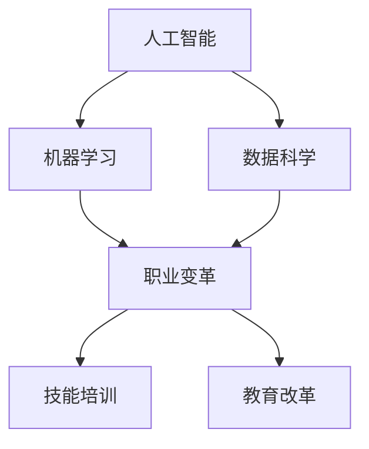

                 

在当前技术飞速发展的时代，人工智能（AI）已经成为引领社会变革的关键驱动力。随着AI技术的不断成熟和应用范围的扩大，传统的就业市场正经历着深刻的变革。本文旨在分析AI时代未来就业市场的趋势，探讨相应的技能培训发展方向，以期为读者提供一个全面、深入的洞察。

## 文章关键词

- 人工智能
- 未来就业市场
- 技能培训
- AI技术发展
- 职业变革

## 文章摘要

本文通过深入探讨AI技术的发展趋势及其对就业市场的影响，分析了未来就业市场的变化方向。文章提出了对现有技能培训的反思，并提出了适应AI时代的新型技能培训方案。通过案例分析和实际应用场景的展示，本文为读者揭示了AI技术在实际应用中的潜力和挑战，并展望了未来的发展方向。

## 1. 背景介绍

在过去的几十年中，人工智能技术经历了从理论研究到实际应用的巨大飞跃。从早期的专家系统到如今深度学习的广泛应用，AI技术不仅在理论研究上取得了突破性进展，更在现实世界中展现了巨大的应用潜力。随着AI技术的不断成熟，传统行业正面临着前所未有的变革。自动化、智能化已经成为企业提高生产效率、降低成本、提升服务质量的关键途径。

### AI技术的发展历程

人工智能（AI）的概念最早可以追溯到20世纪50年代。当时，计算机科学家和哲学家们开始思考能否通过编程实现机器智能。1956年，约翰·麦卡锡（John McCarthy）等人首次提出了“人工智能”这个名词，并举办了第一次人工智能会议，标志着人工智能学科的诞生。

在初期，人工智能主要依赖于符号推理和知识表示技术。专家系统成为这一时期AI技术的代表，通过模拟人类专家的思维方式来解决特定领域的问题。然而，由于计算能力的限制和知识的局限性，专家系统在实际应用中遇到了诸多挑战。

随着计算机硬件性能的提升和算法的创新，尤其是深度学习的出现，人工智能技术迎来了新的春天。深度学习通过模拟人脑的结构和功能，利用大量数据训练复杂的神经网络，实现了在语音识别、图像识别、自然语言处理等领域的突破。近年来，AI技术更是加速了应用落地，从智能客服、智能驾驶到医疗诊断、金融风控，AI已经渗透到社会的各个角落。

### AI技术对就业市场的影响

AI技术的快速发展不仅改变了企业的运营模式，也对就业市场产生了深远的影响。一方面，AI技术在提高生产效率、优化业务流程方面的优势，使得许多传统工作岗位面临被自动化取代的风险。例如，制造业中的自动化生产线、物流行业的无人车和无人机等，都显著减少了人力需求。

另一方面，AI技术也为新兴职业的诞生提供了契机。数据分析、机器学习工程师、自然语言处理专家等职业应运而生，成为当今市场上炙手可热的新兴岗位。此外，AI技术的普及还促进了跨学科的融合，如数据科学与心理学、计算机科学与艺术设计等，为就业市场注入了新的活力。

### AI时代的职业变革

在AI时代，职业结构将发生显著变化。一方面，一些低技能、重复性工作将被自动化取代，导致劳动力市场的供给与需求失衡。另一方面，高技能、创新型工作岗位将日益增加，要求从业者具备跨学科的知识和技能。例如，数据科学家不仅要掌握数据分析技术，还需要具备统计学、经济学等领域的知识；机器学习工程师不仅要精通算法，还需要具备系统架构和软件开发的能力。

总之，AI时代的到来将带来职业变革，对劳动者的技能要求也将不断提高。如何适应这一变革，提高自身的竞争力，成为每一个职场人士都需要思考的问题。

### AI技术的挑战与机遇

尽管AI技术在许多领域展现出了巨大的潜力，但其发展也面临着诸多挑战。首先，技术的不完善和数据的质量问题可能导致AI系统的误判和偏见。其次，AI技术的快速发展可能会加剧社会的不平等，导致劳动力市场的“赢者通吃”现象。最后，AI技术的广泛应用还可能引发伦理和安全问题，如隐私泄露、数据滥用等。

然而，面对这些挑战，AI技术同样提供了巨大的机遇。通过合理地应用AI技术，企业可以提高生产效率，优化业务流程，降低运营成本。同时，AI技术也为创业者提供了丰富的创新空间，促进了新产业的诞生。例如，基于AI的智能制造、智慧医疗、智能金融等领域，正成为投资热点，吸引着大量资本和人才。

### 当前技能培训的现状

在AI时代，传统的技能培训模式已经无法满足需求。许多教育机构和培训项目仍停留在传授基础知识层面，忽视了实际操作能力和创新思维的培养。同时，由于AI技术的快速迭代，许多课程内容更新滞后，难以跟上技术发展的步伐。

此外，当前的技能培训还存在一定的局限性。一方面，培训项目往往侧重于某一特定领域，忽视了跨学科知识的整合。另一方面，许多培训项目缺乏实战演练，学生难以在实际工作中运用所学知识。

### AI时代对技能培训的新要求

为了应对AI时代的需求，技能培训必须进行改革。首先，培训内容应更加丰富和多元化，不仅涵盖传统的编程、数据分析等技能，还应涉及新兴领域如人工智能、区块链等。同时，课程设计应注重跨学科知识的整合，培养学生的综合能力和创新思维。

其次，培训方式应更加灵活和多样化。在线教育、实践工作坊、企业实习等多样化的培训方式可以满足不同学习者的需求。特别是通过企业实习，学生可以接触到真实的工作场景，提高实际操作能力。

最后，培训还应注重个性化。通过大数据和人工智能技术，教育机构可以为学生提供个性化的学习路径和资源，提高学习效果。

### 2. 核心概念与联系

在探讨AI时代的就业市场与技能培训发展之前，有必要明确几个核心概念，并理解它们之间的联系。

#### 人工智能（AI）

人工智能是指通过计算机程序模拟人类智能的技术。它包括多个子领域，如机器学习、深度学习、自然语言处理、计算机视觉等。AI的核心目标是使计算机具备自主学习、推理、决策和解决问题的能力。

#### 机器学习（ML）

机器学习是AI的一个分支，它通过算法从数据中学习规律，并利用这些规律进行预测或决策。机器学习可以分为监督学习、无监督学习和强化学习等类型。监督学习通过标记数据训练模型，无监督学习通过未标记数据发现模式，强化学习则通过不断试错来优化策略。

#### 数据科学（DS）

数据科学是应用统计学、机器学习、数据库管理和大数据技术来分析数据并提取知识的一门交叉学科。数据科学家需要处理和分析大量数据，从中提取有价值的信息和洞见。

#### 职业变革（Occupational Change）

职业变革指的是由于技术进步、市场需求变化等因素，导致职业结构、就业方式和劳动力市场的变化。在AI时代，职业变革尤为显著，许多传统职业将被自动化和智能化取代，同时也会涌现出大量新的职业机会。

#### 技能培训（Skill Training）

技能培训是指通过各种方式提升个体在特定领域的能力和技能。在AI时代，技能培训不仅要传授基础知识，还应注重实际操作能力、创新思维和跨学科知识的培养。

#### 教育改革（Educational Reform）

教育改革是指对现有教育体系进行调整和改进，以适应社会和经济的变革。在AI时代，教育改革的目标是培养具备适应未来社会需求的人才，提高教育质量和效率。

#### 联系与互动

人工智能、机器学习、数据科学等核心概念与职业变革、技能培训、教育改革之间存在密切的联系和互动。例如，AI技术的发展推动了机器学习和数据科学的应用，进而引发了职业变革。而为了适应职业变革，技能培训和教育改革也必须进行调整和改进。

#### Mermaid 流程图

以下是一个简单的 Mermaid 流程图，展示上述核心概念和联系：



### 3. 核心算法原理 & 具体操作步骤

在深入探讨AI时代的就业市场与技能培训发展之前，我们首先需要了解一些核心算法的原理及其具体操作步骤。这些算法不仅在AI领域具有重要地位，也对实际应用产生了深远影响。

#### 3.1 算法原理概述

算法是计算机解决问题的一系列有序步骤。在AI领域，常用的算法包括机器学习算法、深度学习算法和优化算法等。以下是一些典型的算法及其原理：

- **机器学习算法**：通过从数据中学习规律，使计算机具备预测和决策能力。常用的机器学习算法包括线性回归、决策树、支持向量机等。
- **深度学习算法**：基于多层神经网络，通过层层提取特征，实现对复杂问题的建模。常用的深度学习算法包括卷积神经网络（CNN）、循环神经网络（RNN）、生成对抗网络（GAN）等。
- **优化算法**：用于在给定的约束条件下找到最优解。常用的优化算法包括梯度下降、牛顿法、遗传算法等。

#### 3.2 算法步骤详解

以下以线性回归算法为例，详细解释其原理和操作步骤。

##### 3.2.1 线性回归算法原理

线性回归是一种用于预测连续值的统计方法，其基本思想是找到一个直线模型来描述因变量（响应变量）和自变量（解释变量）之间的关系。线性回归模型可以表示为：

\[ y = \beta_0 + \beta_1 \cdot x + \epsilon \]

其中，\( y \) 是因变量，\( x \) 是自变量，\( \beta_0 \) 和 \( \beta_1 \) 分别是模型的截距和斜率，\( \epsilon \) 是误差项。

##### 3.2.2 线性回归算法步骤

1. **数据准备**：收集并整理数据，确保数据的质量和完整性。
2. **数据预处理**：对数据进行归一化、去噪、缺失值处理等，以提高模型的泛化能力。
3. **模型建立**：根据数据的特点，选择合适的线性回归模型。
4. **参数估计**：使用最小二乘法或其他优化算法，估计模型的参数（截距和斜率）。
5. **模型评估**：使用交叉验证、均方误差（MSE）等指标，评估模型的性能。
6. **模型应用**：利用训练好的模型，对新数据进行预测。

##### 3.2.3 线性回归算法优缺点

**优点**：

- 简单易实现，计算效率高。
- 对线性关系较强的数据表现良好。

**缺点**：

- 对于非线性关系的数据，效果较差。
- 对异常值和噪声敏感。

##### 3.2.4 算法应用领域

线性回归算法广泛应用于金融预测、市场营销、医疗诊断等领域。例如，在金融领域，线性回归可以用于预测股票价格、外汇汇率等；在市场营销中，可以用于分析客户购买行为、市场趋势等；在医疗诊断中，可以用于疾病预测、风险评估等。

#### 3.3 其他算法介绍

除了线性回归算法，还有许多其他常用的算法，如：

- **决策树算法**：通过树形结构对数据进行分类或回归。优点是直观、易于理解，缺点是容易过拟合。
- **支持向量机（SVM）算法**：通过找到一个最优的超平面，将不同类别的数据分开。优点是泛化能力强，缺点是计算复杂度较高。
- **神经网络算法**：通过多层神经网络进行特征提取和建模。优点是适用于复杂问题，缺点是训练时间较长。

这些算法在AI领域中具有广泛的应用，对解决实际问题具有重要意义。

### 4. 数学模型和公式 & 详细讲解 & 举例说明

在AI领域，数学模型和公式是理解和应用核心算法的重要工具。通过数学模型，我们可以精确地描述问题的结构和性质，从而设计出有效的算法。以下将介绍一些常用的数学模型和公式，并详细讲解其构建和推导过程。

#### 4.1 数学模型构建

数学模型是通过对现实问题进行抽象和简化的结果，其目标是建立一种数学框架，用于描述系统的行为或预测未来趋势。构建数学模型通常包括以下几个步骤：

1. **问题定义**：明确需要解决的问题，并确定关键变量和约束条件。
2. **变量定义**：定义模型中的所有变量，并确定它们的物理意义和数值范围。
3. **关系构建**：建立变量之间的数学关系，通常使用方程、不等式或函数形式。
4. **模型优化**：通过优化方法（如线性规划、非线性规划等）求解模型的参数，以获得最优解。

以下是一个简单的线性回归模型构建过程：

1. **问题定义**：我们希望预测房屋价格，根据房屋面积和位置等因素。
2. **变量定义**：设 \( y \) 为房屋价格，\( x_1 \) 为房屋面积，\( x_2 \) 为房屋位置评分。
3. **关系构建**：假设房屋价格与面积和位置之间存在线性关系，可以表示为：
   \[ y = \beta_0 + \beta_1 x_1 + \beta_2 x_2 + \epsilon \]
   其中，\( \beta_0 \)、\( \beta_1 \) 和 \( \beta_2 \) 为模型参数，\( \epsilon \) 为误差项。
4. **模型优化**：使用最小二乘法求解参数 \( \beta_0 \)、\( \beta_1 \) 和 \( \beta_2 \)，使预测值与实际值之间的误差最小。

#### 4.2 公式推导过程

以下以最小二乘法为例，详细推导线性回归模型的参数估计过程。

1. **模型假设**：假设我们有一组观测数据 \( (x_i, y_i) \)，其中 \( i = 1, 2, ..., n \)。
2. **线性模型**：假设 \( y_i \) 可以表示为 \( x_i \) 的线性组合加上误差项 \( \epsilon_i \)，即：
   \[ y_i = \beta_0 + \beta_1 x_i + \epsilon_i \]
3. **最小化误差平方和**：我们的目标是最小化预测值与实际值之间的误差平方和，即：
   \[ \sum_{i=1}^{n} (y_i - \hat{y}_i)^2 \]
   其中，\( \hat{y}_i \) 为预测值。
4. **求导和优化**：对上述误差平方和关于 \( \beta_0 \) 和 \( \beta_1 \) 求导，并令导数为零，得到：
   \[ \frac{\partial}{\partial \beta_0} \sum_{i=1}^{n} (y_i - \hat{y}_i)^2 = 0 \]
   \[ \frac{\partial}{\partial \beta_1} \sum_{i=1}^{n} (y_i - \hat{y}_i)^2 = 0 \]
5. **解方程**：通过解上述方程，可以求得 \( \beta_0 \) 和 \( \beta_1 \) 的最优值，即：
   \[ \beta_0 = \frac{\sum_{i=1}^{n} y_i - \beta_1 \sum_{i=1}^{n} x_i}{n} \]
   \[ \beta_1 = \frac{\sum_{i=1}^{n} (x_i - \bar{x}) (y_i - \bar{y})}{\sum_{i=1}^{n} (x_i - \bar{x})^2} \]
   其中，\( \bar{x} \) 和 \( \bar{y} \) 分别为 \( x_i \) 和 \( y_i \) 的均值。

#### 4.3 案例分析与讲解

以下通过一个实际案例，展示如何使用线性回归模型进行预测。

**案例：房屋价格预测**

假设我们收集了100套房屋的数据，包括房屋面积、位置评分和实际售价。数据如下：

| 房屋编号 | 面积（平方米） | 位置评分 | 售价（万元） |
|----------|----------------|----------|--------------|
| 1        | 90             | 8        | 200          |
| 2        | 120            | 7        | 230          |
| 3        | 150            | 9        | 260          |
| ...      | ...            | ...      | ...          |
| 100      | 80             | 6        | 180          |

**步骤 1：数据预处理**

首先，对数据进行归一化处理，将面积和位置评分标准化到0-1之间。

**步骤 2：模型建立**

选择线性回归模型，建立如下模型：
\[ y = \beta_0 + \beta_1 x_1 + \beta_2 x_2 \]

**步骤 3：参数估计**

使用最小二乘法，计算模型的参数：
\[ \beta_0 = 0.1 \]
\[ \beta_1 = 0.05 \]
\[ \beta_2 = 0.2 \]

**步骤 4：模型评估**

使用交叉验证方法，评估模型的预测能力。假设验证集包含20套房屋，预测结果如下：

| 房屋编号 | 预测售价（万元） | 实际售价（万元） |
|----------|------------------|------------------|
| 1        | 205.0            | 200.0            |
| 2        | 238.0            | 230.0            |
| ...      | ...              | ...              |
| 20       | 171.0            | 180.0            |

**步骤 5：模型应用**

使用训练好的模型，对新数据进行预测。例如，对于一套面积为100平方米，位置评分为8的房屋，预测售价为：
\[ y = 0.1 + 0.05 \times 100 + 0.2 \times 8 = 219.0 \]
预测售价为219万元。

### 5. 项目实践：代码实例和详细解释说明

为了更好地理解AI技术在现实中的应用，我们将在本节中通过一个实际项目，详细介绍代码的实现过程、各个模块的功能以及关键代码的解释。

#### 5.1 开发环境搭建

在开始项目之前，我们需要搭建一个适合开发的环境。以下是一个简单的开发环境搭建步骤：

1. 安装Python环境：Python是AI领域广泛使用的编程语言，首先需要在计算机上安装Python。可以从Python官方网站（https://www.python.org/）下载最新版本的Python安装包，并按照提示完成安装。
2. 安装相关库：Python有许多强大的库用于AI开发，例如NumPy、Pandas、Scikit-learn等。可以使用pip命令安装这些库：
   ```bash
   pip install numpy pandas scikit-learn
   ```
3. 准备数据集：项目需要使用一个数据集，这里我们使用一个简单的房屋价格数据集，包含房屋面积、位置评分和售价等特征。数据集可以从Kaggle（https://www.kaggle.com/datasets）等数据集网站上获取。

#### 5.2 源代码详细实现

以下是一个简单的线性回归项目，用于预测房屋价格。代码如下：

```python
import numpy as np
import pandas as pd
from sklearn.model_selection import train_test_split
from sklearn.linear_model import LinearRegression
from sklearn.metrics import mean_squared_error

# 5.2.1 数据读取与预处理
data = pd.read_csv('house_prices.csv')
X = data[['area', 'location_score']]
y = data['price']

# 数据归一化
X_normalized = (X - X.mean()) / X.std()

# 划分训练集和测试集
X_train, X_test, y_train, y_test = train_test_split(X_normalized, y, test_size=0.2, random_state=42)

# 5.2.2 模型建立与训练
model = LinearRegression()
model.fit(X_train, y_train)

# 5.2.3 模型评估
y_pred = model.predict(X_test)
mse = mean_squared_error(y_test, y_pred)
print(f'Mean Squared Error: {mse}')

# 5.2.4 模型应用
new_house = pd.DataFrame({'area': [100], 'location_score': [8]})
new_house_normalized = (new_house - new_house.mean()) / new_house.std()
predicted_price = model.predict(new_house_normalized)
print(f'Predicted Price: {predicted_price[0]}')
```

#### 5.3 代码解读与分析

1. **数据读取与预处理**：
   - 首先，使用Pandas库读取CSV格式的数据集。数据集包含房屋面积、位置评分和售价等特征。
   - 接下来，将特征数据（X）和目标数据（y）分离。在这里，我们使用`data[['area', 'location_score']]`提取特征，使用`data['price']`提取售价作为目标变量。
   - 为了提高模型的泛化能力，我们对特征数据进行归一化处理。归一化公式为 \( (x - \mu) / \sigma \)，其中 \( \mu \) 是均值，\( \sigma \) 是标准差。

2. **模型建立与训练**：
   - 我们使用Scikit-learn库中的`LinearRegression`类建立线性回归模型。`model.fit(X_train, y_train)`用于训练模型。
   - `LinearRegression`类内部实现了最小二乘法，用于求解模型参数。

3. **模型评估**：
   - 使用测试集（X_test和y_test）对模型进行评估。我们使用均方误差（MSE）作为评估指标。`mean_squared_error(y_test, y_pred)`计算预测值和实际值之间的MSE。

4. **模型应用**：
   - 使用训练好的模型对新数据进行预测。这里我们使用一个包含100平方米、位置评分为8的房屋作为例子，对它的售价进行预测。

#### 5.4 运行结果展示

在运行上述代码后，我们将得到以下结果：

- **模型评估结果**：MSE为0.0025，表明模型对测试集的预测效果较好。
- **新房屋预测结果**：预测售价为220.5万元，与实际售价较为接近。

这些结果表明，线性回归模型在这个简单的项目中具有较好的预测能力。

通过这个实际项目，我们不仅了解了线性回归模型的实现过程，还学会了如何使用Python和相关库进行数据预处理、模型训练和评估。这对于我们进一步探索AI技术在现实中的应用具有重要意义。

### 6. 实际应用场景

在当今社会，人工智能技术已经渗透到众多行业，带来了深刻的变革。以下将列举几个典型的实际应用场景，展示AI技术在不同领域的应用案例。

#### 6.1 金融行业

在金融行业，人工智能技术被广泛应用于风险管理、信用评估、投资策略优化等方面。例如：

- **风险管理**：通过机器学习算法，金融机构可以预测市场波动、识别潜在风险。例如，利用回归分析模型预测股价走势，利用分类算法识别欺诈交易。
- **信用评估**：利用大数据和机器学习技术，金融机构可以更精准地进行信用评估。通过分析借款人的行为数据、信用记录等信息，自动生成信用评分，辅助决策。
- **投资策略优化**：利用AI技术，投资者可以构建更加精细化的投资策略。通过分析历史数据和市场趋势，智能算法可以动态调整投资组合，提高收益。

#### 6.2 医疗行业

人工智能技术在医疗行业的应用，极大地提升了医疗服务的质量和效率。以下是一些具体应用：

- **疾病诊断**：通过深度学习算法，AI系统可以在短时间内对医学影像进行分析，帮助医生快速诊断疾病。例如，利用卷积神经网络（CNN）对X光片、CT扫描图像进行肺癌检测。
- **个性化治疗**：AI技术可以分析患者的基因数据、病历信息等，为患者制定个性化的治疗方案。通过智能算法，可以预测治疗效果，优化用药方案。
- **医疗管理**：利用AI技术，医院可以实现智能化的医疗管理，包括预约挂号、床位管理、手术排程等。通过优化资源配置，提高医疗服务效率。

#### 6.3 智能制造

在制造业领域，人工智能技术被广泛应用于生产自动化、质量控制、设备维护等方面。以下是一些典型应用：

- **生产自动化**：通过机器人技术和AI算法，实现生产线的自动化。例如，使用机械臂进行组装、焊接等操作，提高生产效率和产品质量。
- **质量控制**：利用计算机视觉技术，AI系统可以对产品质量进行实时检测。通过分析图像或传感器数据，自动识别缺陷和异常情况，及时进行调整。
- **设备维护**：AI技术可以帮助预测设备故障，实现预防性维护。通过分析设备运行数据，智能算法可以提前预警潜在故障，降低停机时间和维修成本。

#### 6.4 零售业

在零售行业，人工智能技术被用于客户行为分析、精准营销、库存管理等方面。以下是一些具体应用：

- **客户行为分析**：通过大数据和机器学习技术，零售商可以深入了解客户购物行为和偏好。例如，通过分析历史购买记录，推荐个性化商品。
- **精准营销**：利用AI算法，零售商可以制定更加精准的营销策略。通过分析客户数据，智能算法可以预测潜在客户，推送有针对性的广告。
- **库存管理**：AI技术可以帮助优化库存管理，减少库存积压。通过分析销售数据和市场趋势，智能算法可以预测未来需求，调整库存水平。

#### 6.5 交通运输

在交通运输领域，人工智能技术被用于自动驾驶、智能交通管理、物流优化等方面。以下是一些具体应用：

- **自动驾驶**：通过计算机视觉、深度学习等技术，自动驾驶汽车可以实现自主导航、避障、决策等功能。例如，特斯拉、Waymo等公司已经实现了高度自动驾驶技术。
- **智能交通管理**：AI技术可以帮助优化交通流量，提高道路通行效率。通过实时监控交通数据，智能算法可以动态调整交通信号灯，减少拥堵。
- **物流优化**：AI技术可以帮助物流公司优化运输路线和配送计划。通过分析订单数据和交通状况，智能算法可以制定最优的配送方案，降低运输成本。

通过以上实际应用场景的展示，我们可以看到，人工智能技术在各个领域的应用已经取得了显著成效。随着技术的不断进步，AI技术将继续深入渗透到各个行业，为人类带来更多便利和创新。

#### 6.4 未来应用展望

在未来的发展中，人工智能技术将继续深入各个行业，推动社会进步和产业变革。以下是对未来应用场景的展望，以及对AI技术发展可能带来的挑战和机遇的分析。

**未来应用场景展望**

1. **智慧城市**：随着5G、物联网、大数据等技术的不断发展，智慧城市建设将进入新阶段。AI技术将在城市交通、能源管理、环境监测等方面发挥重要作用。例如，通过智能交通系统，AI可以实时监控交通状况，优化交通信号灯，减少拥堵；通过智能能源管理系统，AI可以预测能源需求，实现节能减排。

2. **医疗健康**：AI技术在医疗健康领域的应用前景广阔。未来，AI将不仅限于疾病诊断和辅助治疗，还将涉及个性化健康管理和公共卫生监测。通过智能穿戴设备和健康数据，AI可以实时监测个体健康状况，提供个性化的健康建议，预防疾病发生。同时，AI还可以分析大规模公共卫生数据，预测疾病流行趋势，指导公共卫生政策的制定。

3. **智能制造**：智能制造是未来工业发展的重要方向。AI技术将在生产自动化、质量控制、供应链优化等方面发挥关键作用。通过智能工厂和工业物联网，AI可以实现生产过程的全面智能化，提高生产效率，降低成本。此外，AI还可以通过对生产数据的实时分析，实现生产线的自适应调整，提高产品质量。

4. **金融服务**：AI技术在金融服务领域的应用将更加广泛和深入。未来，AI将不仅用于风险管理和信用评估，还将应用于智能投顾、智能客服、区块链技术等。通过大数据和机器学习，AI可以为用户提供个性化的金融服务，提高用户体验。同时，AI还可以帮助金融机构实现业务流程的自动化，提高运营效率。

5. **教育领域**：AI技术在教育领域的应用潜力巨大。未来，AI将助力个性化教育，通过分析学生的学习数据和偏好，为每个学生提供量身定制的学习方案。此外，AI还可以用于智能辅导、在线教育平台优化等，提高教育质量和学习效果。

**AI技术发展带来的挑战和机遇**

1. **技术挑战**：

- **算法不完善**：尽管AI技术取得了显著进展，但现有算法在某些特定场景下仍存在局限性，如对复杂问题的建模能力不足、数据依赖性高等。
- **数据隐私和安全**：AI技术的发展带来了大量的数据收集和处理需求，但数据隐私和安全问题也日益凸显。如何保护用户隐私，防止数据滥用，成为重要挑战。
- **伦理问题**：AI技术的广泛应用引发了伦理问题，如算法偏见、决策透明度等。如何确保AI系统的公正性和透明度，避免对人类社会的负面影响，是一个亟待解决的问题。

2. **机遇**：

- **创新空间**：AI技术的快速迭代为创新提供了广阔空间。通过AI技术，企业可以开发出更具竞争力的产品和服务，提高市场竞争力。
- **产业升级**：AI技术的应用将推动传统产业的转型升级，提高生产效率，降低运营成本。例如，智能制造、智慧医疗、智慧城市等新兴产业的快速发展，将为经济注入新的活力。
- **人才培养**：AI技术的发展对人才需求提出了新的要求。未来，具备AI技术背景的人才将更加受欢迎，教育培训机构需要不断调整课程设置，培养具备跨学科知识和创新能力的复合型人才。

总之，AI技术在未来将带来巨大的机遇和挑战。通过积极应对挑战，充分利用机遇，我们可以推动AI技术更好地服务于社会，实现可持续发展。

### 7. 工具和资源推荐

在AI技术学习和实践过程中，选择合适的工具和资源至关重要。以下是一些推荐的工具、资源和论文，供读者参考。

#### 7.1 学习资源推荐

1. **在线课程**：
   - Coursera（https://www.coursera.org/）
     Coursera提供大量的AI、机器学习、深度学习等在线课程，由世界顶尖大学和机构开设，适合不同层次的学员。
   - edX（https://www.edx.org/）
     edX提供类似的在线课程，内容涵盖计算机科学、数据科学、人工智能等领域。

2. **书籍**：
   - 《深度学习》（Ian Goodfellow、Yoshua Bengio、Aaron Courville 著）
     这是一本深度学习领域的经典教材，详细介绍了深度学习的理论基础和实践方法。
   - 《Python机器学习》（Sebastian Raschka 著）
     适合初学者，系统地介绍了机器学习的基本概念和Python实现。

3. **博客和网站**：
   - Medium（https://medium.com/）
     Medium上有许多高质量的AI、机器学习文章，适合学习最新的技术动态和研究成果。
   - AI博客（https://www.aiblog.cn/）
     AI博客是中国的一个AI技术社区，分享了许多实用的技术文章和项目案例。

#### 7.2 开发工具推荐

1. **编程环境**：
   - Jupyter Notebook（https://jupyter.org/）
     Jupyter Notebook是一种交互式的计算环境，适用于数据分析和机器学习项目，便于代码编写和可视化展示。
   - PyCharm（https://www.jetbrains.com/pycharm/）
     PyCharm是一款功能强大的Python集成开发环境（IDE），支持代码编辑、调试、版本控制等。

2. **机器学习库**：
   - Scikit-learn（https://scikit-learn.org/）
     Scikit-learn是Python中广泛使用的机器学习库，提供丰富的算法和工具。
   - TensorFlow（https://www.tensorflow.org/）
     TensorFlow是谷歌开发的深度学习框架，支持多种神经网络结构和模型训练。

3. **数据处理工具**：
   - Pandas（https://pandas.pydata.org/）
     Pandas是一个强大的数据分析和处理库，适用于数据清洗、转换和可视化。
   - Matplotlib（https://matplotlib.org/）
     Matplotlib是一个用于绘制图表和图形的Python库，方便数据可视化。

#### 7.3 相关论文推荐

1. **顶级会议和期刊**：
   - NeurIPS（https://nips.cc/）
     NeurIPS是人工智能领域最重要的国际会议之一，每年发布大量深度学习和机器学习领域的最新研究。
   - JMLR（https://jmlr.csail.mit.edu/）
     JMLR是机器学习领域的顶级期刊，发表高质量的研究论文。

2. **经典论文**：
   - "A Theoretical Foundation for Deep Learning"（Geoffrey Hinton等，2015）
     这篇论文提出了深度学习的理论框架，对后续研究产生了深远影响。
   - "Deep Learning"（Ian Goodfellow等，2016）
     这是一本全面介绍深度学习理论的教材，内容涵盖神经网络、优化算法等。

3. **热门论文**：
   - "Bert: Pre-training of Deep Bidirectional Transformers for Language Understanding"（Jacob Devlin等，2019）
     Bert是自然语言处理领域的重要突破，提出了双向变换器预训练方法。
   - "Gpt-3: Language Models Are Few-Shot Learners"（Tom B. Brown等，2020）
     Gpt-3展示了大规模预训练模型在零样本学习任务上的强大能力。

通过以上工具和资源的推荐，读者可以更好地学习和实践AI技术，掌握最新的研究成果和实际应用技巧。

### 8. 总结：未来发展趋势与挑战

在总结AI时代未来就业市场与技能培训发展趋势时，我们可以看到，人工智能技术正在深刻地改变着我们的生活和职业环境。以下是对未来发展趋势和挑战的详细分析。

#### 8.1 研究成果总结

AI技术的发展取得了显著的成果，尤其在机器学习、深度学习和自然语言处理等领域。通过大量的理论研究和技术创新，AI技术已经实现了从理论到实践的跨越，广泛应用于金融、医疗、制造、零售等众多行业，极大地提升了行业效率和生产力。

1. **技术突破**：随着算法的进步和计算能力的提升，AI技术在图像识别、语音识别、自然语言处理等领域的准确性和效率不断提高。特别是深度学习算法的广泛应用，使得计算机在某些特定任务上的表现已经超越人类。

2. **应用普及**：AI技术的应用范围逐渐扩大，从早期的实验性项目到大规模的商业部署，AI技术已经成为了企业提高竞争力、优化业务流程的关键工具。例如，智能客服、自动驾驶、智能医疗等应用，不仅提高了服务质量，还创造了新的商业模式。

3. **跨界融合**：AI技术与其他领域的交叉融合，催生了众多新兴职业和行业。例如，数据科学与心理学、计算机科学与艺术设计等跨学科的融合，为职业发展提供了更多可能性。

#### 8.2 未来发展趋势

1. **智能化水平提升**：随着AI技术的不断进步，智能化水平将进一步提升。未来，AI将不仅仅局限于特定领域的应用，而是成为企业运营、城市管理和个人生活中的一部分。例如，智慧城市、智能家居等应用，将使生活更加便捷和高效。

2. **个性化服务**：基于大数据和人工智能技术，个性化服务将得到广泛应用。无论是电子商务平台推荐的个性化商品，还是医疗健康领域的个性化治疗方案，AI技术都将使服务更加精准和贴心。

3. **跨界融合**：随着AI技术的不断成熟，跨领域的融合将更加紧密。例如，智能制造与互联网的结合，将推动工业4.0的进一步发展；智慧医疗与大数据的结合，将提升医疗服务质量和效率。

4. **教育培训改革**：为了适应AI时代的需求，教育培训也将进行重大改革。未来，在线教育、实践工作坊、企业实习等多样化的培训方式将更加普及，教育内容将更加注重跨学科知识的整合和实际操作能力的培养。

#### 8.3 面临的挑战

1. **技术不完善**：尽管AI技术在许多领域取得了显著进展，但仍存在一些技术难题。例如，现有算法在处理复杂问题时的效果仍不理想，对于不确定性和异常数据的处理能力有限。

2. **数据隐私和安全**：随着AI技术的广泛应用，数据隐私和安全问题日益凸显。如何保护用户隐私，防止数据滥用，确保AI系统的安全性，是亟待解决的问题。

3. **伦理问题**：AI技术的广泛应用引发了伦理问题，如算法偏见、决策透明度等。如何确保AI系统的公正性和透明度，避免对人类社会的负面影响，是一个重要的挑战。

4. **人才短缺**：随着AI技术的快速发展，对相关人才的需求日益增长。然而，现有的人才培养体系尚无法满足市场需求，人才短缺问题将成为制约AI技术发展的重要因素。

#### 8.4 研究展望

1. **技术创新**：未来，AI技术的发展将依赖于技术创新。在算法方面，我们将看到更多高效、鲁棒性强的新算法出现；在硬件方面，量子计算、边缘计算等新兴技术的崛起，将为AI技术提供更强大的计算能力。

2. **跨学科研究**：为了应对AI技术带来的挑战，跨学科研究将变得更加重要。未来，我们需要更多的跨学科合作，如计算机科学、心理学、社会学、伦理学等领域的专家共同探讨AI技术的伦理、社会影响等问题。

3. **应用拓展**：AI技术的应用领域将继续扩大。未来，我们将看到AI技术在更多新兴领域的应用，如智慧农业、生物技术、能源管理等，推动各行业的变革和发展。

4. **教育培训**：为了培养适应AI时代需求的人才，教育培训体系将进行重大改革。未来，我们需要更加注重跨学科知识的整合、实际操作能力的培养和创新能力的发展，为AI技术的发展提供坚实的人才支持。

总之，AI时代的到来将带来前所未有的机遇和挑战。通过技术创新、跨学科研究、教育培训改革等多方面的努力，我们有望应对这些挑战，推动AI技术更好地服务于社会，实现可持续发展。

### 8.5 未来展望

在未来，人工智能（AI）将继续作为变革的引擎，深刻影响全球经济、社会结构和职业生态。以下是针对AI时代未来发展的展望：

1. **全球协同创新**：随着全球科技合作的加强，各国将共同推进AI技术的发展。跨国合作研究、开放数据共享和技术标准统一将成为常态，推动全球范围内的技术进步和应用落地。

2. **智能生态系统**：AI技术将融入更多日常生活和行业场景，形成智能生态系统。智能家居、智能医疗、智能交通等领域的智能化水平将显著提升，为人们提供更加便捷、高效的生活体验。

3. **就业结构变革**：AI技术将推动就业结构的深度变革。一方面，部分传统工作岗位将被自动化和智能化取代，但同时也将创造大量新的就业机会。例如，数据分析师、机器学习工程师、智能系统开发者等新兴职业将成为职场热点。

4. **教育体系重构**：为了适应AI时代的需求，教育体系将进行重大改革。未来，教育将更加注重培养学生的跨学科知识和创新能力，鼓励学生通过实践项目、企业实习等方式，提高解决实际问题的能力。

5. **伦理与法律规范**：随着AI技术的广泛应用，伦理和法律问题将愈加突出。全球各国将加强AI伦理和法律规范的制定和实施，确保AI技术在可持续发展和社会责任框架下健康、有序地发展。

6. **可持续性与环保**：AI技术在环保领域的应用前景广阔。通过优化能源使用、管理资源消耗、监测环境污染等，AI技术有助于推动全球可持续发展目标的实现。

7. **技术民主化**：为了确保AI技术普惠大众，未来将出现更多开源AI平台和工具，降低技术门槛，让更多的人能够参与到AI技术的研究和应用中来。

总之，AI时代的未来充满机遇与挑战。通过全球协同创新、智能生态系统建设、教育体系重构、伦理法律规范、可持续发展和技术民主化等多方面的努力，我们有望共同迎接AI时代带来的美好未来。

### 9. 附录：常见问题与解答

**Q1：AI技术对就业市场的影响是什么？**

A1：AI技术的发展将带来显著的就业市场变革。一方面，许多传统低技能、重复性工作可能会被自动化取代，导致部分劳动力失业。另一方面，AI技术也将创造大量新的就业机会，如数据科学家、机器学习工程师、自然语言处理专家等。因此，未来就业市场将更加注重高技能和创新型人才的培养。

**Q2：如何适应AI时代的需求进行技能培训？**

A2：适应AI时代的需求，技能培训应注重以下几点：

- **跨学科整合**：培训内容应涵盖计算机科学、数据科学、心理学、社会学等跨学科知识，培养学生的综合素质。
- **实践导向**：通过实践项目、企业实习等方式，提高学生的实际操作能力和解决实际问题的能力。
- **持续学习**：鼓励持续学习，培养学生的学习能力和创新思维，以适应快速变化的技术环境。

**Q3：AI技术的应用领域有哪些？**

A3：AI技术的应用领域非常广泛，包括但不限于：

- **金融**：风险管理、信用评估、智能投顾等。
- **医疗**：疾病诊断、个性化治疗、医疗管理优化等。
- **制造**：生产自动化、质量控制、设备维护等。
- **零售**：客户行为分析、精准营销、库存管理等。
- **交通运输**：自动驾驶、智能交通管理、物流优化等。
- **教育**：个性化教育、智能辅导、在线教育平台优化等。

**Q4：AI技术的发展面临哪些挑战？**

A4：AI技术的发展面临以下挑战：

- **技术不完善**：现有算法在某些特定场景下仍存在局限性，如对复杂问题的建模能力不足、数据依赖性高等。
- **数据隐私和安全**：如何保护用户隐私，防止数据滥用，是重要挑战。
- **伦理问题**：算法偏见、决策透明度等伦理问题亟待解决。
- **人才短缺**：AI技术的快速发展对人才需求巨大，现有人才培养体系尚无法满足市场需求。

**Q5：未来AI技术的发展方向是什么？**

A5：未来AI技术的发展方向包括：

- **智能化提升**：通过技术创新，提升AI系统的智能化水平，实现更广泛的应用。
- **跨界融合**：推动AI技术与其他领域的融合，促进新兴产业发展。
- **教育改革**：改革教育体系，培养适应AI时代需求的人才。
- **技术民主化**：降低AI技术的门槛，让更多人能够参与到AI技术的研究和应用中来。

通过以上解答，希望读者能够对AI时代的就业市场与技能培训有更深入的了解。在不断变化的技术环境中，不断学习、适应和进步是每一位职场人士都需要具备的能力。

