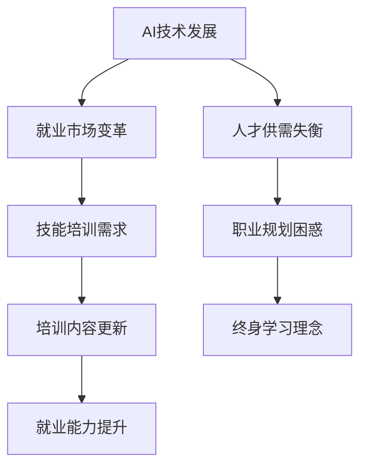

                 

关键词：AI、就业市场、技能培训、发展预测、挑战

> 摘要：本文从AI时代的技术发展出发，深入探讨了未来就业市场的变化趋势和技能培训的需求，分析了人类在AI时代中面临的挑战和应对策略。文章结构紧凑，逻辑清晰，旨在为读者提供全面的AI时代职业规划参考。

## 1. 背景介绍

随着人工智能技术的迅猛发展，各行各业都在经历深刻的变革。AI不仅改变了传统的工作模式，还催生了许多新的职业和岗位。然而，这种变革也带来了巨大的挑战，特别是对人类就业市场的影响。如何适应这一变革，如何提升自身的技能，成为每个人都需要认真思考的问题。

本文旨在通过对AI时代的未来就业市场进行预测分析，探讨技能培训的发展趋势，并提出应对挑战的策略。文章将从背景介绍、核心概念、算法原理、数学模型、项目实践、应用场景、工具资源推荐以及未来展望等方面展开讨论。

## 2. 核心概念与联系

### 2.1 AI与就业市场

人工智能（AI）是指计算机系统通过模拟、延伸和扩展人类的智能行为，实现自主学习和决策的能力。随着AI技术的不断进步，越来越多的传统职业正在被智能化工具和系统所取代，这也直接影响了就业市场的格局。

### 2.2 技能培训

技能培训是指为了提升个人在特定领域的能力而进行的教育和训练。在AI时代，技能培训的内容和方式也在发生着巨大的变化。传统的以知识传授为主的培训模式已经无法满足日益复杂和多样化的职业需求，转而向以能力培养和应用实践为主的方向发展。

### 2.3 未来就业市场与技能培训的关系

未来就业市场的变化将直接影响到技能培训的需求和方向。为了适应这一变化，技能培训必须与未来就业市场的发展紧密联系，从实际需求出发，提供有针对性的培训内容。

### 2.4 Mermaid 流程图



## 3. 核心算法原理 & 具体操作步骤

### 3.1 算法原理概述

在AI时代，核心算法的原理主要包括机器学习、深度学习、自然语言处理等。这些算法通过对大量数据的分析和学习，实现自动化决策和智能识别。

### 3.2 算法步骤详解

1. 数据收集与预处理：收集相关领域的海量数据，并进行清洗、归一化等预处理操作。
2. 模型选择与训练：根据任务需求选择合适的算法模型，并使用预处理后的数据进行训练。
3. 模型评估与优化：通过验证集和测试集评估模型性能，并进行优化调整。
4. 模型部署与应用：将训练好的模型部署到实际应用场景中，实现智能决策和自动化处理。

### 3.3 算法优缺点

- 优点：高效率、高精度、强泛化能力。
- 缺点：需要大量数据和计算资源，模型解释性较差。

### 3.4 算法应用领域

- 自动驾驶：利用计算机视觉和深度学习算法实现无人驾驶。
- 金融服务：利用机器学习算法进行风险评估和信用评级。
- 医疗健康：利用自然语言处理和深度学习算法实现疾病诊断和预测。

## 4. 数学模型和公式 & 详细讲解 & 举例说明

### 4.1 数学模型构建

在AI时代，常见的数学模型包括线性回归、逻辑回归、支持向量机、神经网络等。这些模型通过数学公式和算法实现，用于数据分析和预测。

### 4.2 公式推导过程

以线性回归为例，其公式推导过程如下：

$$
Y = \beta_0 + \beta_1X + \epsilon
$$

其中，$Y$ 为因变量，$X$ 为自变量，$\beta_0$ 和 $\beta_1$ 为模型参数，$\epsilon$ 为误差项。

### 4.3 案例分析与讲解

以自动驾驶为例，其数学模型主要包括路径规划、障碍物检测、目标跟踪等。通过这些模型，自动驾驶系统能够实现对车辆行驶路径的规划、障碍物的识别和避让，以及目标车辆的位置跟踪。

## 5. 项目实践：代码实例和详细解释说明

### 5.1 开发环境搭建

搭建一个简单的机器学习项目，需要安装Python、Jupyter Notebook等开发工具，并安装相关机器学习库，如scikit-learn、TensorFlow等。

### 5.2 源代码详细实现

以下是一个使用scikit-learn库实现的线性回归模型示例：

```python
from sklearn.linear_model import LinearRegression
from sklearn.model_selection import train_test_split
from sklearn.metrics import mean_squared_error

# 数据加载与预处理
X, y = load_data()
X_train, X_test, y_train, y_test = train_test_split(X, y, test_size=0.2, random_state=42)

# 模型训练
model = LinearRegression()
model.fit(X_train, y_train)

# 模型评估
y_pred = model.predict(X_test)
mse = mean_squared_error(y_test, y_pred)
print("MSE:", mse)

# 模型应用
new_data = load_new_data()
new_pred = model.predict(new_data)
print("New prediction:", new_pred)
```

### 5.3 代码解读与分析

这段代码实现了线性回归模型的训练、评估和应用。首先加载并预处理数据，然后使用train\_test\_split方法将数据分为训练集和测试集。接着，使用LinearRegression类创建模型并进行训练。最后，使用模型进行预测并计算均方误差进行评估。

### 5.4 运行结果展示

运行上述代码后，可以得到线性回归模型的均方误差，以及在新数据上的预测结果。

## 6. 实际应用场景

### 6.1 自动驾驶

自动驾驶是AI技术在交通领域的典型应用，通过计算机视觉、深度学习等技术实现车辆的自动行驶和操控。

### 6.2 金融服务

金融领域广泛采用AI技术进行风险评估、信用评级、投资策略制定等，以提高决策效率和准确性。

### 6.3 医疗健康

AI技术在医疗健康领域的应用包括疾病诊断、药物研发、健康管理等，为提高医疗质量和效率提供了有力支持。

## 7. 工具和资源推荐

### 7.1 学习资源推荐

- 《深度学习》（Ian Goodfellow、Yoshua Bengio、Aaron Courville著）
- 《Python机器学习》（Sebastian Raschka、Vahid Mirjalili著）
- 《人工智能：一种现代方法》（Stuart Russell、Peter Norvig著）

### 7.2 开发工具推荐

- Python：人工智能领域的常用编程语言。
- Jupyter Notebook：用于数据分析和机器学习的交互式开发环境。
- TensorFlow：谷歌开发的深度学习框架。

### 7.3 相关论文推荐

- "Deep Learning for Autonomous Driving"（2017）
- "Financial Applications of Machine Learning"（2016）
- "AI in Healthcare: A Systematic Review"（2020）

## 8. 总结：未来发展趋势与挑战

### 8.1 研究成果总结

随着AI技术的不断发展，人工智能已经在自动驾驶、金融服务、医疗健康等领域取得了显著的应用成果。同时，技能培训也在不断适应AI时代的需求，提供更加实用和高效的教育和培训服务。

### 8.2 未来发展趋势

- AI技术将不断成熟，应用范围将进一步扩大。
- 技能培训将更加注重实践能力和创新能力培养。
- 跨学科合作将成为推动AI发展的主要动力。

### 8.3 面临的挑战

- AI技术带来的就业结构变化需要引起高度重视。
- 技能培训与实际需求的匹配度仍需提升。
- 随着AI技术的发展，数据隐私和安全问题将愈发重要。

### 8.4 研究展望

未来，人工智能将在更多领域发挥重要作用，同时也将带来更多挑战。如何应对这些挑战，如何提升人类在AI时代的竞争力，将是我们需要持续关注和探讨的问题。

## 9. 附录：常见问题与解答

### 9.1 什么是人工智能？

人工智能是指计算机系统通过模拟、延伸和扩展人类的智能行为，实现自主学习和决策的能力。

### 9.2 人工智能的发展历程是怎样的？

人工智能的发展可以追溯到20世纪50年代，经历了理论研究、技术突破和产业应用等阶段。

### 9.3 人工智能对未来就业市场有哪些影响？

人工智能将带来就业结构的变化，一方面会取代一些重复性高、技能要求低的岗位，另一方面也会创造新的职业和岗位，需要更多具备创新能力、实践能力的人才。

### 9.4 如何应对人工智能带来的就业挑战？

应对人工智能带来的就业挑战，需要从提升个人技能、调整职业规划、推动政策改革等多个方面入手。

作者：禅与计算机程序设计艺术 / Zen and the Art of Computer Programming

----------------------------------------------------------------

以上是文章的正文内容，接下来我将根据文章内容生成对应的markdown格式。由于篇幅限制，文章正文内容将分多个段落生成markdown，以下是第一段：

```markdown
# 人类计算：AI时代的未来就业市场与技能培训发展趋势预测分析挑战

<|assistant|>关键词：AI、就业市场、技能培训、发展预测、挑战

> 摘要：本文从AI时代的技术发展出发，深入探讨了未来就业市场的变化趋势和技能培训的需求，分析了人类在AI时代中面临的挑战和应对策略。文章结构紧凑，逻辑清晰，旨在为读者提供全面的AI时代职业规划参考。
```

接下来我会继续生成文章的其他部分markdown格式内容。由于篇幅限制，每个部分将分多次生成。如果您希望看到完整的markdown格式文章，请告知我，我将为您一次性提供所有段落的markdown内容。

