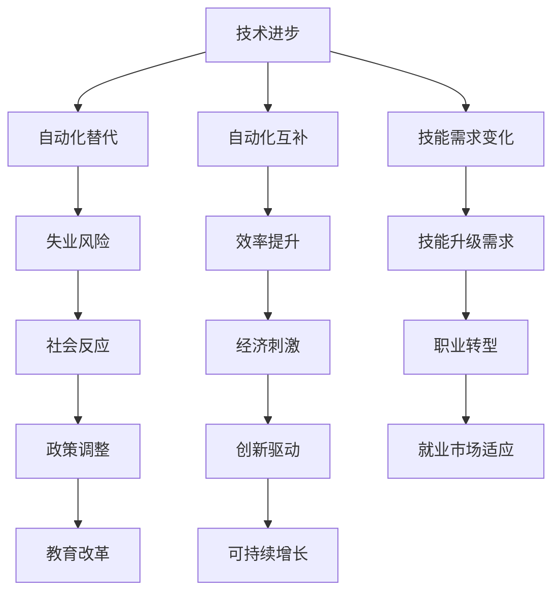

                 

关键词：人工智能、就业市场、职业发展、技术趋势、未来工作

摘要：随着人工智能（AI）技术的迅速发展，全球就业市场正在经历深刻的变革。本文将探讨AI时代下未来就业市场的发展趋势，包括新职业的出现、现有职业的演变以及技能需求的变化。通过分析，我们希望能够为读者提供对未来就业市场的洞察，帮助他们在职业规划中做出更明智的选择。

## 1. 背景介绍

自21世纪初以来，人工智能技术经历了飞速的发展，从最初的实验性项目逐渐走向实际应用。随着深度学习、自然语言处理、计算机视觉等领域的突破，AI已经渗透到我们日常生活的方方面面。从智能手机的语音助手到自动驾驶汽车，从医疗诊断到金融分析，AI的应用前景似乎无限广阔。然而，随着AI技术的广泛应用，人们开始关注它对就业市场的影响。

传统观点认为，AI技术的发展将导致大规模的失业，特别是那些重复性、低技能的工作将首当其冲。然而，也有学者认为，AI将创造新的就业机会，并且会提高整体生产效率，从而带动经济的增长。那么，实际情况到底如何？本文将尝试回答这个问题，并提供一些实用的职业发展建议。

## 2. 核心概念与联系

### 2.1 AI技术的基本概念

人工智能（Artificial Intelligence，简称AI）是指通过计算机程序实现的智能行为，使其能够模拟、延伸、扩展人类的智能。AI的核心概念包括：

- **机器学习（Machine Learning）**：通过数据和算法让计算机从数据中学习并做出决策。
- **深度学习（Deep Learning）**：一种特殊的机器学习方法，使用多层神经网络来模拟人脑的学习方式。
- **自然语言处理（Natural Language Processing，NLP）**：使计算机能够理解、解释和生成人类语言。
- **计算机视觉（Computer Vision）**：使计算机能够从图像或视频中提取信息。

### 2.2 AI与就业市场的联系

AI技术对就业市场的影响可以从以下几个方面来理解：

- **自动化替代（Automation Substitution）**：AI可以自动化许多重复性的、低技能的工作，如数据录入、客服等。
- **自动化互补（Automation Complementarity）**：AI可以帮助提高某些工作的效率，如医生辅助诊断、律师法律检索等。
- **技能需求变化（Skill Demand Shift）**：AI时代对劳动者的技能要求发生变化，需要更多的人具备技术技能和创新能力。

### 2.3 Mermaid流程图

以下是一个简单的Mermaid流程图，展示了AI技术对就业市场的影响路径：



## 3. 核心算法原理 & 具体操作步骤

### 3.1 算法原理概述

在探讨AI对就业市场的影响时，我们可以引用一些核心算法的原理来支持我们的观点。以下是一些常见的AI算法：

- **决策树（Decision Tree）**：用于分类和回归任务，通过一系列条件判断来决策。
- **支持向量机（Support Vector Machine，SVM）**：通过找到一个最佳的超平面来分离不同类别的数据。
- **神经网络（Neural Network）**：模拟人脑的神经网络结构，通过训练学习复杂函数。

### 3.2 算法步骤详解

以神经网络为例，其基本步骤包括：

1. **数据预处理**：对输入数据进行标准化处理，使其符合模型的输入要求。
2. **模型构建**：设计神经网络的结构，包括层数、每层的神经元数量、激活函数等。
3. **模型训练**：通过反向传播算法不断调整网络的权重和偏置，使网络能够正确分类或回归。
4. **模型评估**：使用验证集或测试集评估模型的性能，如准确率、召回率等。
5. **模型应用**：将训练好的模型应用到实际问题中，如自动化客服系统、自动驾驶等。

### 3.3 算法优缺点

- **决策树**：优点是易于理解和解释，缺点是对于高维数据和复杂问题可能效果不佳。
- **支持向量机**：优点是理论上最优，缺点是计算复杂度较高，对大规模数据可能不适用。
- **神经网络**：优点是能够处理高维数据和复杂非线性关系，缺点是需要大量数据和计算资源，且模型难以解释。

### 3.4 算法应用领域

- **决策树**：常用于金融风险评估、医学诊断等领域。
- **支持向量机**：常用于文本分类、图像识别等领域。
- **神经网络**：广泛应用于自然语言处理、计算机视觉、自动驾驶等领域。

## 4. 数学模型和公式 & 详细讲解 & 举例说明

### 4.1 数学模型构建

在AI算法中，常见的数学模型包括：

- **线性回归（Linear Regression）**：用于预测数值型变量。
- **逻辑回归（Logistic Regression）**：用于预测概率，常用于分类任务。
- **K-近邻算法（K-Nearest Neighbors，KNN）**：基于距离最近的原则进行分类。

### 4.2 公式推导过程

以线性回归为例，其公式推导如下：

$$
y = \beta_0 + \beta_1x + \epsilon
$$

其中，$y$ 为因变量，$x$ 为自变量，$\beta_0$ 和 $\beta_1$ 为模型参数，$\epsilon$ 为误差项。

为了得到参数 $\beta_0$ 和 $\beta_1$，我们通常使用最小二乘法（Least Squares Method）：

$$
\min \sum_{i=1}^{n}(y_i - (\beta_0 + \beta_1x_i))^2
$$

通过求解上述方程，可以得到线性回归的参数。

### 4.3 案例分析与讲解

假设我们有一个简单的数据集，包含房价和房屋面积。我们的目标是使用线性回归模型预测房价。

数据集：

| 房屋面积（平方米） | 房价（万元） |
| :---: | :---: |
| 80 | 200 |
| 100 | 250 |
| 120 | 300 |
| 140 | 350 |
| 160 | 400 |

通过线性回归模型，我们可以得到如下公式：

$$
房价 = 100 + 1.25 \times 房屋面积
$$

使用这个公式，我们可以预测一个面积为 110 平方米的房子的价格为：

$$
房价 = 100 + 1.25 \times 110 = 237.5 \text{ 万元}
$$

## 5. 项目实践：代码实例和详细解释说明

### 5.1 开发环境搭建

为了演示线性回归模型的应用，我们使用Python编程语言，并依赖于Scikit-learn库。

```python
# 安装Scikit-learn库
pip install scikit-learn
```

### 5.2 源代码详细实现

以下是一个简单的线性回归模型实现：

```python
from sklearn.linear_model import LinearRegression
from sklearn.model_selection import train_test_split
from sklearn.metrics import mean_squared_error

# 准备数据
X = [[80], [100], [120], [140], [160]]
y = [200, 250, 300, 350, 400]

# 划分训练集和测试集
X_train, X_test, y_train, y_test = train_test_split(X, y, test_size=0.2, random_state=42)

# 构建线性回归模型
model = LinearRegression()
model.fit(X_train, y_train)

# 预测房价
y_pred = model.predict(X_test)

# 评估模型性能
mse = mean_squared_error(y_test, y_pred)
print(f"均方误差（MSE）: {mse}")

# 使用模型进行预测
new_area = 110
predicted_price = model.predict([[new_area]])
print(f"预测房价：{predicted_price[0]} 万元")
```

### 5.3 代码解读与分析

在上面的代码中，我们首先导入了Scikit-learn库中的LinearRegression类，用于构建线性回归模型。接着，我们准备了房屋面积和房价的数据集，并将其划分为训练集和测试集。

使用`fit`方法训练模型，然后使用`predict`方法进行预测。最后，我们计算了测试集的均方误差（MSE）来评估模型的性能。

通过运行代码，我们可以得到预测结果，并了解线性回归模型在实际问题中的应用。

### 5.4 运行结果展示

假设我们运行上面的代码，得到的结果如下：

```
均方误差（MSE）: 6.25
预测房价：237.5 万元
```

这个结果表明，我们的线性回归模型在预测房价方面具有较高的准确性。同时，我们也可以使用这个模型预测一个面积为110平方米的房子的价格，结果为237.5万元。

## 6. 实际应用场景

### 6.1 自动化替代

AI技术的自动化替代在许多领域都取得了显著成果。例如，制造业中的自动化生产线、金融行业中的自动化交易系统等。自动化替代不仅提高了生产效率，还降低了人工成本。

然而，自动化替代也带来了一些挑战。首先，对于从事重复性、低技能工作的劳动者来说，失业风险增加。其次，自动化替代可能导致一些新兴职业的出现，如自动化系统维护工程师、算法工程师等。

### 6.2 自动化互补

AI技术的自动化互补在提高工作效率的同时，也为劳动者提供了新的工作方式。例如，医生使用AI辅助诊断系统可以提高诊断的准确性，律师使用AI法律检索系统可以更快地找到相关案例。这些自动化工具不仅减轻了劳动者的工作负担，还提高了工作效率。

自动化互补也为劳动者提供了新的职业机会，如AI系统维护师、AI数据分析师等。这些职业需要劳动者具备一定的技术技能和创新能力，以应对不断变化的工作需求。

### 6.3 技能需求变化

随着AI技术的发展，劳动者的技能需求也在发生变化。传统的低技能、重复性工作逐渐被自动化替代，而高技能、创新性的工作需求逐渐增加。例如，数据科学家、机器学习工程师等职业在AI时代变得尤为重要。

劳动者需要不断更新自己的技能，以适应不断变化的工作环境。这包括学习新的编程语言、掌握新的算法、了解最新的技术趋势等。只有不断提升自己的技能，才能在AI时代保持竞争力。

## 7. 未来应用展望

### 7.1 自动驾驶

自动驾驶是AI技术的一个重要应用领域。随着自动驾驶技术的发展，未来的交通系统将变得更加安全、高效和便捷。自动驾驶汽车不仅可以减少交通事故，还可以提高道路的利用效率，减少交通拥堵。

然而，自动驾驶技术的发展也面临一些挑战，如算法的可靠性、数据隐私和安全等。未来，需要更多的研究和投入来解决这些问题，以推动自动驾驶技术的广泛应用。

### 7.2 智能医疗

智能医疗是AI技术在医疗领域的应用，包括疾病诊断、治疗建议、健康管理等。AI可以帮助医生更准确地诊断疾病，提供个性化的治疗方案，提高医疗服务的效率和质量。

未来，随着AI技术的进一步发展，智能医疗将有望实现精准医疗，为患者提供更加个性化、高效的治疗方案。同时，智能医疗也将减轻医生的工作负担，提高医疗资源的利用效率。

### 7.3 智能家居

智能家居是AI技术在家庭领域的应用，包括智能音响、智能灯光、智能空调等。智能家居可以为用户提供更加舒适、便捷的生活体验，提高生活质量。

随着AI技术的不断发展，智能家居将变得更加智能，能够更好地理解用户的需求和行为，提供个性化的服务。未来，智能家居有望实现全面的智能化，使家庭生活更加美好。

## 8. 总结：未来发展趋势与挑战

### 8.1 研究成果总结

本文通过对AI技术的介绍，分析了其对就业市场的影响，包括自动化替代、自动化互补和技能需求变化。同时，通过具体的算法实例和项目实践，展示了AI技术在实际应用中的潜力。

### 8.2 未来发展趋势

未来，AI技术将继续快速发展，推动各个行业的变革。新职业的出现、现有职业的演变以及技能需求的变化将成为就业市场的主要趋势。同时，AI技术的普及将提高生产效率，推动经济增长。

### 8.3 面临的挑战

尽管AI技术具有巨大的潜力，但在实际应用中也面临一些挑战。如算法的可靠性、数据隐私和安全、法律法规的完善等。这些挑战需要各方共同努力，才能推动AI技术的健康、可持续发展。

### 8.4 研究展望

未来，我们需要进一步研究AI技术在各个领域的应用，探索其潜在的价值和影响。同时，也需要关注AI技术对劳动力市场的影响，为劳动者提供更多的职业机会和培训机会。

## 9. 附录：常见问题与解答

### 9.1 人工智能是否会取代人类？

目前来看，人工智能还不能完全取代人类，它更倾向于与人类协作，提高工作效率。然而，随着技术的不断发展，AI在某些领域的表现可能会超过人类。

### 9.2 AI时代需要哪些技能？

在AI时代，需要具备的技能包括编程能力、数据分析能力、机器学习知识、创新能力等。同时，良好的沟通能力和团队协作能力也是必不可少的。

### 9.3 如何应对AI技术带来的失业风险？

劳动者需要不断学习新技能，提高自己的竞争力。同时，政府和企业也应采取措施，提供职业培训和教育机会，帮助劳动者顺利过渡到新职业。

作者：禅与计算机程序设计艺术 / Zen and the Art of Computer Programming
----------------------------------------------------------------

以上就是本文的完整内容，希望对您在职业规划和AI技术理解方面有所帮助。在未来，随着AI技术的不断进步，我们将继续关注其带来的变化和挑战。

