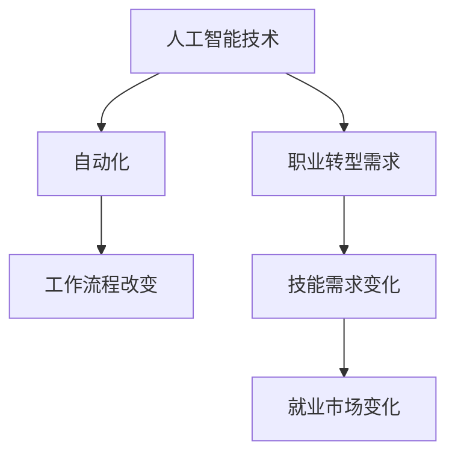

                 

关键词：人工智能，就业趋势，未来工作，职业转型，技能要求

> 摘要：本文旨在探讨人工智能（AI）时代下，未来就业市场将面临的变化和挑战。通过分析AI对传统职业的影响，预测未来职业需求，并提供职业转型的建议，帮助读者了解和适应AI时代的工作环境。

## 1. 背景介绍

随着科技的快速发展，人工智能已经成为当今世界的一个热门话题。AI技术在各个领域的应用日益广泛，从智能家居、自动驾驶到医疗诊断、金融分析，AI正在改变我们的生活方式和工作方式。与此同时，AI技术也对就业市场产生了深远的影响，传统的职业岗位逐渐被自动化取代，而新的职业需求也在不断涌现。

在这个背景下，如何适应AI时代的变化，把握职业发展的机遇，成为许多人关注的焦点。本文将通过对AI对就业市场的影响进行深入分析，预测未来就业趋势，并提供相应的职业转型建议，旨在帮助读者在这个快速变化的时代中找到自己的定位。

## 2. 核心概念与联系

为了更好地理解AI对就业市场的影响，我们首先需要了解一些核心概念。

### 2.1 人工智能

人工智能（Artificial Intelligence，简称AI）是指通过计算机模拟人类智能的技术。它包括机器学习、深度学习、自然语言处理等多个子领域。AI技术的目标是让计算机具备理解、学习和解决问题的能力。

### 2.2 自动化

自动化（Automation）是指通过计算机程序、机器和机器人等技术，实现某些任务的自动化处理。自动化技术可以大幅提高生产效率，减少人力成本。

### 2.3 职业转型

职业转型（Career Transition）是指个人根据市场需求和个人兴趣，调整自己的职业方向和岗位。职业转型可能是由于技术变革、市场变化等原因引起的。

### 2.4 技能需求

技能需求（Skill Requirements）是指某一职业或行业对从业人员所需具备的技能和能力的要求。随着技术的发展，技能需求也在不断变化。

#### Mermaid 流程图

下面是一个简化的Mermaid流程图，描述了AI技术对就业市场的影响：



## 3. 核心算法原理 & 具体操作步骤

### 3.1 算法原理概述

AI技术的核心在于其算法原理，主要包括以下几个关键环节：

1. **数据收集与处理**：收集大量的数据，对数据进行分析和处理，提取有用的信息。
2. **机器学习**：利用机器学习算法，让计算机从数据中学习，形成规律和模式。
3. **深度学习**：通过多层神经网络，实现更复杂的模型和预测。
4. **自然语言处理**：让计算机理解和处理自然语言，实现人机交互。

### 3.2 算法步骤详解

以下是AI技术应用的典型步骤：

1. **确定目标问题**：明确需要解决的问题，如自动化某一工作流程、预测市场趋势等。
2. **数据收集与预处理**：收集相关的数据，对数据进行清洗、去重和处理，确保数据的质量和准确性。
3. **模型选择与训练**：选择合适的机器学习或深度学习模型，使用训练数据进行训练，调整模型参数。
4. **模型评估与优化**：使用验证数据集评估模型性能，根据评估结果调整模型参数，优化模型。
5. **部署与应用**：将训练好的模型部署到实际应用中，如自动化系统、智能助手等。

### 3.3 算法优缺点

AI技术的优点包括：

1. **高效性**：AI技术可以处理大量数据，提高工作效率。
2. **准确性**：通过学习大量数据，AI技术可以做出更准确的预测和决策。
3. **创新性**：AI技术可以推动新领域和新产品的诞生。

然而，AI技术也存在一些缺点：

1. **数据依赖**：AI技术的发展依赖于大量高质量的数据，数据质量和数量直接影响模型性能。
2. **隐私问题**：AI技术需要处理大量个人信息，可能引发隐私泄露问题。
3. **算法偏见**：如果训练数据存在偏见，AI模型也可能会产生偏见，导致不公平的结果。

### 3.4 算法应用领域

AI技术在许多领域都有广泛应用，主要包括：

1. **工业自动化**：通过机器人、自动化生产线等技术，提高生产效率。
2. **医疗诊断**：利用AI技术进行疾病预测、诊断和治疗。
3. **金融分析**：利用AI技术进行风险评估、投资策略制定等。
4. **教育**：通过智能辅导、个性化学习等，提高教育质量。

## 4. 数学模型和公式 & 详细讲解 & 举例说明

### 4.1 数学模型构建

在AI技术中，常用的数学模型包括：

1. **线性回归**：用于预测连续值。
2. **逻辑回归**：用于预测离散值。
3. **神经网络**：用于复杂模式的识别和预测。

下面是一个简单的线性回归模型：

$$
y = wx + b
$$

其中，$y$ 是预测值，$x$ 是输入特征，$w$ 是权重，$b$ 是偏置。

### 4.2 公式推导过程

线性回归模型的推导过程如下：

1. **确定损失函数**：常用的损失函数是均方误差（MSE）：
$$
MSE = \frac{1}{n}\sum_{i=1}^{n}(y_i - wx_i - b)^2
$$

2. **求导与优化**：对损失函数关于权重 $w$ 和偏置 $b$ 求导，并令导数为零，得到：
$$
\frac{\partial MSE}{\partial w} = 2x(y - wx - b) = 0 \\
\frac{\partial MSE}{\partial b} = 2(y - wx - b) = 0
$$

3. **解方程组**：解上述方程组，得到权重和偏置的值。

### 4.3 案例分析与讲解

假设我们有一个数据集，包含房屋的面积（$x$）和售价（$y$），我们希望利用线性回归模型预测房屋的售价。

1. **数据收集与预处理**：收集房屋面积和售价的数据，对数据进行清洗和预处理，确保数据的质量和准确性。

2. **模型训练**：使用线性回归模型，对数据进行训练，得到权重和偏置的值。

3. **模型评估**：使用验证数据集评估模型性能，计算预测误差。

4. **模型优化**：根据评估结果，调整模型参数，优化模型。

5. **预测应用**：使用训练好的模型，对新的数据进行预测，如预测某房屋的售价。

## 5. 项目实践：代码实例和详细解释说明

### 5.1 开发环境搭建

1. **安装Python**：在计算机上安装Python，版本建议为3.8或更高。
2. **安装依赖库**：使用pip命令安装必要的依赖库，如numpy、matplotlib等。

```bash
pip install numpy matplotlib
```

### 5.2 源代码详细实现

以下是一个简单的线性回归模型实现：

```python
import numpy as np
import matplotlib.pyplot as plt

# 数据集
X = np.array([1, 2, 3, 4, 5])
y = np.array([2, 4, 5, 4, 5])

# 初始化权重和偏置
w = np.random.rand()
b = np.random.rand()

# 训练模型
n = len(X)
for i in range(1000):
    y_pred = w * X + b
    delta_w = 2/n * np.dot(X, (y - y_pred))
    delta_b = 2/n * (y - y_pred)
    w -= delta_w
    b -= delta_b

# 打印模型参数
print("权重：", w)
print("偏置：", b)

# 预测新数据
new_X = np.array([6])
new_y_pred = w * new_X + b
print("预测结果：", new_y_pred)

# 绘图
plt.scatter(X, y, label="真实值")
plt.plot(new_X, new_y_pred, color="red", label="预测值")
plt.xlabel("面积")
plt.ylabel("售价")
plt.legend()
plt.show()
```

### 5.3 代码解读与分析

1. **数据集**：我们使用一个简单的数据集，包含房屋的面积（$X$）和售价（$y$）。

2. **模型初始化**：初始化权重（$w$）和偏置（$b$）为随机值。

3. **模型训练**：使用梯度下降算法训练模型，通过迭代优化权重和偏置。

4. **模型参数**：打印训练得到的权重和偏置。

5. **预测新数据**：使用训练好的模型预测新的数据。

6. **绘图**：绘制真实值和预测值的散点图，直观展示模型的预测效果。

## 6. 实际应用场景

### 6.1 人力资源领域

AI技术在人力资源领域有着广泛的应用，如：

1. **招聘**：通过AI技术，可以自动化简历筛选、面试评估等环节，提高招聘效率。
2. **员工管理**：利用AI技术进行员工绩效评估、培训需求分析等，提高员工管理质量。
3. **人才预测**：通过分析员工数据，预测未来人才需求，提前进行人才储备。

### 6.2 金融领域

AI技术在金融领域同样有着重要的应用，如：

1. **风险管理**：通过AI技术，可以自动化风险识别、评估和预测，提高风险管理的准确性。
2. **投资策略**：利用AI技术分析市场数据，制定个性化的投资策略。
3. **客户服务**：通过智能客服系统，提供24小时不间断的客户服务。

### 6.3 医疗领域

AI技术在医疗领域也有着广泛的应用，如：

1. **疾病诊断**：利用AI技术进行疾病预测、诊断和治疗，提高医疗诊断的准确性。
2. **药物研发**：通过AI技术加速药物研发进程，提高药物研发的效率。
3. **健康管理**：利用AI技术进行健康数据分析和预测，提供个性化的健康管理方案。

## 6.4 未来应用展望

随着AI技术的不断发展，未来将会有更多的领域受益于AI技术。以下是一些未来的应用展望：

1. **智能制造**：通过AI技术，实现工厂自动化，提高生产效率。
2. **智慧城市**：利用AI技术进行城市交通管理、环境监测等，提高城市管理水平。
3. **智慧农业**：通过AI技术进行农作物生长监测、病虫害预测等，提高农业产出。

## 7. 工具和资源推荐

### 7.1 学习资源推荐

1. **《人工智能：一种现代方法》（Second Edition）**：作者是 Stuart J. Russell 和 Peter Norvig，这本书是人工智能领域的经典教材，适合初学者和进阶者。
2. **《深度学习》（Deep Learning）**：作者是 Ian Goodfellow、Yoshua Bengio 和 Aaron Courville，这本书详细介绍了深度学习的基本概念和技术。

### 7.2 开发工具推荐

1. **TensorFlow**：这是一个由Google开发的开源深度学习框架，适合进行深度学习和机器学习项目的开发。
2. **PyTorch**：这是一个由Facebook开发的开源深度学习框架，具有良好的灵活性和易用性。

### 7.3 相关论文推荐

1. **"Deep Learning"（2015）**：这是一篇综述性论文，详细介绍了深度学习的基本概念和发展趋势。
2. **"Robotics: Science and Systems XV"（2017）**：这是一篇关于机器人技术的论文，介绍了机器人技术的发展趋势和应用。

## 8. 总结：未来发展趋势与挑战

### 8.1 研究成果总结

本文通过对AI技术的分析，探讨了AI对就业市场的影响，并预测了未来职业需求。主要结论如下：

1. AI技术将推动自动化进程，传统职业岗位将被自动化取代，新的职业需求将不断涌现。
2. AI技术的发展对从业人员提出了新的技能要求，需要从业人员具备跨学科的知识和技能。
3. AI技术在各个领域都有广泛的应用前景，如人力资源、金融、医疗等。

### 8.2 未来发展趋势

1. **自动化与智能化**：AI技术将继续推动自动化和智能化进程，提高生产效率和服务质量。
2. **跨学科融合**：未来职业将更倾向于跨学科融合，需要从业人员具备多学科的知识和技能。
3. **个性化和定制化**：AI技术将帮助实现个性化和定制化服务，满足用户的多样化需求。

### 8.3 面临的挑战

1. **技术挑战**：AI技术的发展面临算法优化、数据隐私、算法偏见等技术挑战。
2. **社会挑战**：AI技术的发展对就业市场和社会结构产生深远影响，需要政策制定者和从业人员共同努力，应对挑战。
3. **伦理挑战**：AI技术的发展引发了一系列伦理问题，如算法偏见、隐私泄露等，需要制定相应的伦理规范。

### 8.4 研究展望

未来，我们需要进一步研究AI技术在不同领域的应用，探讨如何更好地利用AI技术解决实际问题。同时，也需要关注AI技术的发展趋势，为从业人员提供更多的职业发展机会。通过科技创新和社会治理的有机结合，共同迎接AI时代的到来。

## 9. 附录：常见问题与解答

### 9.1 AI技术是否会取代所有职业？

答：AI技术会改变许多职业，尤其是那些重复性、规则性较强的工作。然而，AI技术并不能完全取代所有职业，因为许多职业需要人类的创造力、判断力和情感理解能力。

### 9.2 如何应对AI时代的职业挑战？

答：为了应对AI时代的职业挑战，从业人员需要具备以下能力：

1. **跨学科知识**：掌握多个学科的知识，提高综合素质。
2. **持续学习**：保持对新知识、新技术的学习和探索。
3. **创新思维**：培养创新思维，敢于尝试新事物。

### 9.3 AI技术是否会加剧贫富差距？

答：AI技术的发展可能会加剧贫富差距，因为高技能岗位的需求将增加，而低技能岗位的需求将减少。然而，通过政策调节和教育改革，可以缓解这一问题。

---

### 9.4 AI技术的伦理问题有哪些？

答：AI技术的伦理问题主要包括：

1. **算法偏见**：算法可能基于偏见的数据，导致不公平的结果。
2. **隐私泄露**：AI技术可能侵犯用户的隐私权。
3. **就业冲击**：AI技术可能导致一些职业消失，对就业市场产生冲击。

---

以上就是对《人类计算：AI时代的未来就业趋势预测》这篇文章的详细撰写内容。希望这篇文章能够帮助读者了解AI时代下的职业发展趋势，并为自己的职业规划提供参考。作者：禅与计算机程序设计艺术 / Zen and the Art of Computer Programming。

