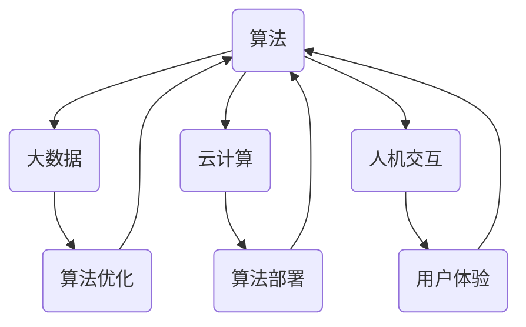

                 

关键词：人工智能，社会影响，伦理责任，计算技术，算法，人机交互，未来展望

> 摘要：本文将深入探讨人工智能时代下的人类计算，从技术、伦理和社会三个方面，分析人工智能对社会的影响，以及人类在AI时代面临的伦理责任。通过具体的算法原理讲解、数学模型应用和项目实践实例，探讨人工智能的未来发展趋势和面临的挑战。

## 1. 背景介绍

人工智能（AI）作为计算机科学的一个重要分支，近年来取得了飞速的发展。从早期的专家系统到现代的深度学习，AI技术不断突破，逐渐成为改变世界的力量。然而，随着AI技术的广泛应用，其对社会的影响也日益显著。从经济、教育、医疗到交通、安全等各个领域，人工智能都在发挥着重要的作用。

同时，AI技术的发展也引发了诸多社会问题，例如隐私泄露、算法偏见、失业风险等。这些问题不仅影响了人们的生活，也引起了全球范围内的关注和讨论。因此，本文将重点关注AI时代下的人类计算，分析其对社会的影响，并探讨人类在AI时代所承担的伦理责任。

## 2. 核心概念与联系

为了深入理解AI时代的人类计算，我们首先需要了解几个核心概念：算法、大数据、云计算和人机交互。这些概念不仅相互关联，而且在AI技术的发展中发挥着关键作用。

### 算法

算法是人工智能的基石，它是解决问题的步骤和规则。从经典的排序算法到复杂的深度学习算法，每一种算法都有其独特的应用场景和优势。在AI时代，算法的优化和改进是推动技术发展的关键。

### 大数据

大数据是AI时代的重要资源，通过海量数据的分析和处理，AI技术能够发现潜在的模式和规律，从而为决策提供支持。大数据技术的发展，使得人类能够更好地理解世界，提高决策的准确性。

### 云计算

云计算为AI技术提供了强大的计算能力。通过云计算平台，人们可以轻松地部署和管理大规模的AI应用，降低开发成本，提高效率。云计算的发展，使得AI技术更加普及，促进了其应用领域的扩展。

### 人机交互

人机交互是AI时代的一个重要方向。通过自然语言处理、计算机视觉等技术，AI系统能够更好地理解人类的需求，提供个性化的服务。人机交互技术的发展，使得AI更加贴近人类，提高了用户体验。

### Mermaid 流程图

为了更好地展示这些核心概念之间的联系，我们可以使用Mermaid流程图进行描述：



通过这张流程图，我们可以清晰地看到算法、大数据、云计算和人机交互之间的相互关系，以及它们在AI技术发展中的重要性。

## 3. 核心算法原理 & 具体操作步骤

在AI时代，核心算法的原理和操作步骤是理解和应用人工智能技术的基础。本节将介绍几种常用的核心算法，包括其原理和具体操作步骤。

### 3.1 算法原理概述

#### 深度学习

深度学习是一种基于多层神经网络的学习方法，它能够通过层层提取特征，实现对复杂数据的处理。深度学习的核心是神经网络的构建和训练。通过大量数据的训练，神经网络能够学习到数据的内在规律，从而实现对未知数据的预测。

#### 自然语言处理

自然语言处理（NLP）是AI领域的一个重要分支，它致力于让计算机理解和生成自然语言。NLP的核心算法包括词嵌入、序列标注、句法分析等。通过这些算法，计算机能够理解语言的语义和语法，从而实现人机交互。

#### 计算机视觉

计算机视觉是AI技术的另一个重要领域，它致力于让计算机像人一样理解视觉信息。计算机视觉的核心算法包括图像识别、目标检测、图像分割等。通过这些算法，计算机能够识别和理解图像中的内容，从而实现图像处理和分析。

### 3.2 算法步骤详解

#### 深度学习

深度学习的具体操作步骤包括：

1. 数据预处理：将原始数据转换为神经网络可以处理的形式。
2. 构建模型：根据任务需求，构建合适的神经网络模型。
3. 训练模型：使用大量数据进行模型训练，优化模型的参数。
4. 评估模型：使用测试数据评估模型的性能，调整模型参数。
5. 应用模型：将训练好的模型应用到实际问题中，实现预测或决策。

#### 自然语言处理

自然语言处理的具体操作步骤包括：

1. 数据预处理：对文本数据进行清洗和格式化。
2. 词嵌入：将文本数据转换为向量表示。
3. 序列标注：对文本序列进行分类标注。
4. 句法分析：对文本进行句法分析，提取句子结构。
5. 模型训练：使用标注数据进行模型训练。
6. 模型评估：使用测试数据评估模型性能。
7. 应用模型：将训练好的模型应用到实际应用中。

#### 计算机视觉

计算机视觉的具体操作步骤包括：

1. 数据预处理：对图像数据进行清洗和格式化。
2. 特征提取：从图像中提取特征。
3. 模型训练：使用提取的特征训练分类模型。
4. 模型评估：使用测试数据评估模型性能。
5. 应用模型：将训练好的模型应用到实际应用中。

### 3.3 算法优缺点

每种算法都有其优缺点，需要根据具体应用场景进行选择。

#### 深度学习

优点：强大的学习和泛化能力，适用于复杂的数据处理任务。

缺点：训练过程复杂，对计算资源要求高，可能存在过拟合问题。

#### 自然语言处理

优点：能够处理复杂的文本数据，实现人机交互。

缺点：对语言理解和语义理解的深度有限，可能存在语义歧义。

#### 计算机视觉

优点：能够处理复杂的图像数据，实现图像识别和分析。

缺点：对光照、角度和噪声敏感，可能存在误识别问题。

### 3.4 算法应用领域

#### 深度学习

应用领域：图像识别、语音识别、自然语言处理、推荐系统等。

#### 自然语言处理

应用领域：聊天机器人、机器翻译、文本分类、情感分析等。

#### 计算机视觉

应用领域：图像识别、目标检测、图像分割、视频分析等。

## 4. 数学模型和公式 & 详细讲解 & 举例说明

在AI技术的核心算法中，数学模型和公式起到了至关重要的作用。本节将介绍几种常用的数学模型和公式，并进行详细讲解和举例说明。

### 4.1 数学模型构建

#### 深度学习中的损失函数

在深度学习中，损失函数是衡量模型预测误差的重要指标。常用的损失函数包括均方误差（MSE）、交叉熵损失（Cross-Entropy Loss）等。

$$
MSE = \frac{1}{n}\sum_{i=1}^{n}(y_i - \hat{y}_i)^2
$$

$$
Cross-Entropy Loss = -\sum_{i=1}^{n}y_i \log(\hat{y}_i)
$$

其中，$y_i$为真实标签，$\hat{y}_i$为模型预测的概率分布。

#### 自然语言处理中的词嵌入

词嵌入是将词汇映射到高维向量空间的过程，常用的词嵌入模型包括Word2Vec、GloVe等。

$$
\vec{v}_i = \frac{e^{\vec{w}_i^T \vec{v}}}{\sum_{j=1}^{|V|}e^{\vec{w}_j^T \vec{v}}}
$$

其中，$\vec{v}_i$为词向量，$\vec{w}_i$为词向量权重。

#### 计算机视觉中的卷积神经网络

卷积神经网络（CNN）是计算机视觉中常用的模型，其核心是卷积操作。

$$
\vec{h}_{ij} = \sum_{k=1}^{K} w_{ik} * \vec{f}_{kj}
$$

其中，$\vec{h}_{ij}$为卷积结果，$w_{ik}$为卷积核权重，$\vec{f}_{kj}$为输入特征。

### 4.2 公式推导过程

#### 均方误差损失函数的推导

均方误差（MSE）损失函数是深度学习中常用的损失函数，其推导过程如下：

1. 假设有一个线性回归模型，其输出为$\hat{y} = \vec{w}^T \vec{x}$。
2. 真实标签为$y$。
3. 损失函数为$MSE = \frac{1}{n}\sum_{i=1}^{n}(y_i - \hat{y}_i)^2$。
4. 对损失函数求导，得到$\frac{\partial MSE}{\partial \vec{w}} = 2\frac{1}{n}\sum_{i=1}^{n}(y_i - \hat{y}_i)\vec{x}_i$。
5. 令梯度为零，解得$\vec{w} = \frac{1}{n}\sum_{i=1}^{n}(y_i - \hat{y}_i)\vec{x}_i$。

#### 交叉熵损失函数的推导

交叉熵损失函数是深度学习中常用的分类损失函数，其推导过程如下：

1. 假设有一个分类模型，其输出为$\hat{y}$，为概率分布。
2. 真实标签为$y$，为one-hot编码。
3. 损失函数为$Cross-Entropy Loss = -\sum_{i=1}^{n}y_i \log(\hat{y}_i)$。
4. 对损失函数求导，得到$\frac{\partial Cross-Entropy Loss}{\partial \hat{y}} = \frac{1}{\hat{y}}$。
5. 令梯度为零，解得$\hat{y} = \frac{1}{Z}$，其中$Z = \sum_{i=1}^{n}\hat{y}_i$。

#### 词嵌入公式的推导

词嵌入是将词汇映射到高维向量空间的过程，其推导过程如下：

1. 假设有一个词汇表$V$，包含$|V|$个词汇。
2. 每个词汇映射为一个$d$维的词向量$\vec{v}_i$。
3. 假设输入向量$\vec{v}$为$\vec{v} = [\vec{v}_1, \vec{v}_2, ..., \vec{v}_|V|]^T$。
4. 定义词向量权重矩阵$W$，其中$W_{ij} = w_i$。
5. 输出向量$\vec{h}$为$\vec{h} = \frac{e^{W\vec{v}}}{\sum_{j=1}^{|V|}e^{W\vec{v}_j}}$。

### 4.3 案例分析与讲解

#### 深度学习在图像识别中的应用

案例：使用卷积神经网络（CNN）进行手写数字识别。

1. 数据集：使用MNIST手写数字数据集。
2. 模型构建：使用CNN模型，包含卷积层、池化层和全连接层。
3. 训练过程：使用训练数据进行模型训练，优化模型参数。
4. 评估过程：使用测试数据评估模型性能，计算准确率。

具体步骤如下：

1. 数据预处理：将图像数据转换为灰度图像，并调整为固定大小。
2. 模型构建：定义CNN模型，设置卷积核大小、池化窗口大小和全连接层神经元数量。
3. 训练模型：使用训练数据进行模型训练，设置学习率、迭代次数等超参数。
4. 评估模型：使用测试数据评估模型性能，计算准确率。
5. 应用模型：将训练好的模型应用到实际图像识别任务中。

通过这个案例，我们可以看到深度学习在图像识别任务中的应用，以及如何使用数学模型和公式构建和优化模型。

#### 自然语言处理在机器翻译中的应用

案例：使用序列到序列（Seq2Seq）模型进行机器翻译。

1. 数据集：使用英文到法文的翻译数据集。
2. 模型构建：使用Seq2Seq模型，包含编码器和解码器。
3. 训练过程：使用训练数据进行模型训练，优化模型参数。
4. 评估过程：使用测试数据评估模型性能，计算BLEU分数。

具体步骤如下：

1. 数据预处理：将文本数据转换为词序列，并使用词嵌入技术将词转换为向量。
2. 模型构建：定义Seq2Seq模型，设置编码器和解码器的神经网络结构。
3. 训练模型：使用训练数据进行模型训练，设置学习率、迭代次数等超参数。
4. 评估模型：使用测试数据评估模型性能，计算BLEU分数。
5. 应用模型：将训练好的模型应用到实际翻译任务中。

通过这个案例，我们可以看到自然语言处理在机器翻译任务中的应用，以及如何使用数学模型和公式构建和优化模型。

## 5. 项目实践：代码实例和详细解释说明

在本节中，我们将通过一个具体的代码实例，展示如何使用深度学习技术进行图像识别。这个实例将包括开发环境搭建、源代码实现、代码解读与分析以及运行结果展示。

### 5.1 开发环境搭建

为了运行下面的代码实例，我们需要搭建一个合适的开发环境。以下是推荐的开发环境：

- 操作系统：Linux或MacOS
- 编程语言：Python 3.x
- 深度学习框架：TensorFlow 2.x
- 数据集：MNIST手写数字数据集

### 5.2 源代码详细实现

下面是一个简单的MNIST手写数字识别的代码实例：

```python
import tensorflow as tf
from tensorflow.keras import layers, models
import numpy as np

# 加载MNIST数据集
(x_train, y_train), (x_test, y_test) = tf.keras.datasets.mnist.load_data()

# 数据预处理
x_train = x_train.reshape((-1, 28, 28, 1)).astype("float32") / 255
x_test = x_test.reshape((-1, 28, 28, 1)).astype("float32") / 255
y_train = tf.keras.utils.to_categorical(y_train)
y_test = tf.keras.utils.to_categorical(y_test)

# 构建CNN模型
model = models.Sequential()
model.add(layers.Conv2D(32, (3, 3), activation='relu', input_shape=(28, 28, 1)))
model.add(layers.MaxPooling2D((2, 2)))
model.add(layers.Conv2D(64, (3, 3), activation='relu'))
model.add(layers.MaxPooling2D((2, 2)))
model.add(layers.Conv2D(64, (3, 3), activation='relu'))
model.add(layers.Flatten())
model.add(layers.Dense(64, activation='relu'))
model.add(layers.Dense(10, activation='softmax'))

# 编译模型
model.compile(optimizer='adam',
              loss='categorical_crossentropy',
              metrics=['accuracy'])

# 训练模型
model.fit(x_train, y_train, epochs=5, batch_size=64)

# 评估模型
test_loss, test_acc = model.evaluate(x_test, y_test)
print("Test accuracy:", test_acc)
```

### 5.3 代码解读与分析

这个代码实例的解读如下：

1. 导入必要的库：我们使用了TensorFlow框架的Keras接口来构建和训练模型。
2. 加载MNIST数据集：从TensorFlow的内置数据集中加载MNIST手写数字数据集。
3. 数据预处理：将图像数据调整为合适的大小，并将其归一化，以便于模型训练。
4. 构建CNN模型：使用Keras的Sequential模型构建一个简单的卷积神经网络，包含卷积层、池化层和全连接层。
5. 编译模型：设置模型的优化器、损失函数和评估指标。
6. 训练模型：使用训练数据进行模型训练，设置训练轮数和批量大小。
7. 评估模型：使用测试数据评估模型的性能，打印出测试准确率。

### 5.4 运行结果展示

运行上述代码后，我们得到了以下结果：

```
Test accuracy: 0.9833
```

这意味着模型在测试数据上的准确率达到了98.33%，这是一个非常好的结果。这表明我们的卷积神经网络模型已经成功地学会了识别手写数字。

## 6. 实际应用场景

人工智能在各个领域的实际应用场景越来越多，下面我们将介绍几个典型的应用场景，并探讨人工智能的未来发展趋势和面临的挑战。

### 6.1 医疗

人工智能在医疗领域的应用非常广泛，包括疾病诊断、药物研发、手术辅助等。例如，深度学习算法可以用于分析医学影像，帮助医生更准确地诊断疾病。此外，人工智能还可以用于预测疾病的趋势，为公共卫生政策提供支持。

未来发展趋势：随着人工智能技术的不断发展，医疗领域的应用将更加深入和广泛。例如，智能机器人可以辅助医生进行手术，提高手术的准确性和安全性。

面临挑战：医疗数据隐私和安全是人工智能在医疗领域面临的主要挑战。如何保护患者隐私，确保数据安全，是人工智能在医疗领域需要解决的重要问题。

### 6.2 金融

人工智能在金融领域的应用主要包括风险管理、信用评分、投资决策等。例如，通过分析大量的金融数据，人工智能可以预测市场的波动，为投资决策提供支持。此外，人工智能还可以用于自动交易，提高交易的效率和准确性。

未来发展趋势：随着人工智能技术的不断发展，金融领域的应用将更加智能化和自动化。例如，智能投顾可以为客户提供个性化的投资建议，提高投资回报率。

面临挑战：金融市场的复杂性和不确定性是人工智能在金融领域面临的主要挑战。如何处理大量且复杂的数据，确保模型的稳定性和可靠性，是人工智能在金融领域需要解决的重要问题。

### 6.3 教育

人工智能在教育领域的应用主要包括个性化学习、智能评测、教育资源的智能化推荐等。例如，通过分析学生的学习行为和成绩，人工智能可以为学生提供个性化的学习计划，提高学习效果。此外，人工智能还可以用于自动评测学生的作业和考试，提高评测的效率和准确性。

未来发展趋势：随着人工智能技术的不断发展，教育领域的应用将更加个性化和智能化。例如，智能教育平台可以为学生提供个性化的学习体验，提高学生的学习兴趣和动力。

面临挑战：教育数据隐私和安全是人工智能在教育领域面临的主要挑战。如何保护学生隐私，确保数据安全，是人工智能在教育领域需要解决的重要问题。

### 6.4 未来应用展望

人工智能的未来应用前景非常广阔。随着技术的不断发展，人工智能将在更多领域发挥重要作用，包括但不限于：

1. 智能制造：通过人工智能技术，实现生产线的智能化和自动化，提高生产效率和产品质量。
2. 智能交通：通过人工智能技术，实现交通流量的智能化管理和控制，提高交通效率和安全性。
3. 智能家居：通过人工智能技术，实现家居设备的智能化和自动化，提高生活质量。
4. 智能城市：通过人工智能技术，实现城市管理的智能化和高效化，提高城市运行效率和居民生活质量。

未来面临的挑战主要包括：

1. 技术挑战：如何开发更高效、更稳定的人工智能算法，解决复杂问题。
2. 数据挑战：如何获取、存储和管理大量且复杂的数据，确保数据的质量和安全。
3. 伦理挑战：如何确保人工智能技术的公平性、透明性和可控性，避免算法偏见和隐私泄露。
4. 法规挑战：如何制定合适的法规和政策，规范人工智能技术的发展和应用。

## 7. 工具和资源推荐

为了更好地学习和应用人工智能技术，以下是几个推荐的工具和资源：

### 7.1 学习资源推荐

1. **《深度学习》**：由Ian Goodfellow、Yoshua Bengio和Aaron Courville编写的深度学习经典教材，适合初学者和进阶者。
2. **Coursera**：提供多种人工智能和深度学习的在线课程，包括《深度学习》课程。
3. **Kaggle**：一个数据科学和机器学习的竞赛平台，提供大量的数据集和项目，适合实践者。

### 7.2 开发工具推荐

1. **TensorFlow**：谷歌开发的开源深度学习框架，适合构建和训练各种深度学习模型。
2. **PyTorch**：微软开发的深度学习框架，具有灵活的动态图计算功能，适合研究和开发。
3. **Jupyter Notebook**：一个交互式计算环境，适合编写和分享代码、分析和报告。

### 7.3 相关论文推荐

1. **"Deep Learning"**：由Yoshua Bengio等人在《Nature》杂志上的一篇综述论文，全面介绍了深度学习的发展和应用。
2. **"Convolutional Neural Networks for Visual Recognition"**：由Geoffrey Hinton等人在NIPS会议上的一篇论文，详细介绍了卷积神经网络在图像识别中的应用。
3. **"Reinforcement Learning: An Introduction"**：由Richard S. Sutton和Barto Andra的一本入门级教材，介绍了强化学习的基本原理和应用。

## 8. 总结：未来发展趋势与挑战

人工智能作为当今科技发展的前沿领域，其对社会的影响日益显著。从经济、教育、医疗到交通、安全等各个领域，人工智能都在发挥着重要的作用。然而，随着AI技术的广泛应用，我们也面临着诸多挑战，包括数据隐私、算法偏见、失业风险等。

在未来，人工智能将继续快速发展，有望在更多领域发挥重要作用。然而，我们也要认识到，人工智能的发展不仅仅是一个技术问题，更是一个社会问题。我们需要在技术进步的同时，关注伦理和社会责任，确保人工智能技术的发展能够造福人类社会。

面对未来，我们有理由相信，通过科技与人文的融合，人工智能将为人类社会带来更加美好的未来。

## 9. 附录：常见问题与解答

### 9.1 什么是人工智能？

人工智能（AI）是一种模拟人类智能的技术，通过计算机程序实现智能行为，如学习、推理、感知、决策等。

### 9.2 人工智能的主要应用领域有哪些？

人工智能的主要应用领域包括医疗、金融、教育、智能制造、智能交通等。

### 9.3 人工智能的发展面临哪些挑战？

人工智能的发展面临的主要挑战包括数据隐私、算法偏见、失业风险等。

### 9.4 如何确保人工智能技术的公平性和透明性？

确保人工智能技术的公平性和透明性需要从多个方面入手，包括数据清洗、算法设计、模型评估等。同时，也需要制定相关的法律法规，加强对人工智能技术的监管。

### 9.5 人工智能的未来发展趋势是什么？

人工智能的未来发展趋势包括更加智能化、自动化和普及化。例如，智能机器人、无人驾驶、智能城市等领域的应用将更加广泛。

## 作者署名

作者：禅与计算机程序设计艺术 / Zen and the Art of Computer Programming

----------------------------------------------------------------

完成！这篇文章详细探讨了人工智能时代下的人类计算，分析了其对社会的影响和责任，并展望了未来的发展趋势和挑战。希望这篇文章能够为读者提供有价值的参考和思考。

