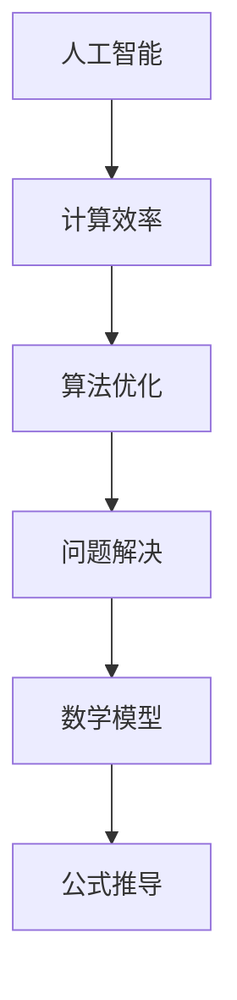

                 

关键词：人工智能、计算效率、算法优化、数学模型、软件开发、技术发展趋势

> 摘要：本文深入探讨了人类计算在各个领域的应用与发展，从算法原理到数学模型，再到项目实践，全方位解析了人类计算如何助力创造一个更加美好的世界。通过分析现有技术趋势与面临的挑战，文章展望了未来人类计算的发展前景，为读者提供了宝贵的指导与启示。

## 1. 背景介绍

人类计算作为一种重要的计算方式，早在计算机问世之前就已存在于我们的生活中。从古代的算盘到现代的超级计算机，人类一直在不断探索如何提高计算效率和解决复杂问题。随着人工智能技术的飞速发展，人类计算进入了一个崭新的阶段。本文旨在探讨人工智能时代的人类计算，分析其核心概念、原理、算法、数学模型及其在实际应用中的表现。

## 2. 核心概念与联系

### 2.1 人工智能与计算效率

人工智能（Artificial Intelligence，简称AI）是模仿人类智能的一种技术，其核心在于通过算法和模型模拟人类思维和行为。计算效率（Computational Efficiency）则是指计算过程中资源的有效利用，包括时间、空间和能源。在人工智能领域，提高计算效率是实现高效智能的关键。

### 2.2 算法优化与问题解决

算法优化（Algorithm Optimization）是提高计算效率的重要手段。通过改进算法设计，优化算法执行过程，可以大幅度提升计算性能。问题解决（Problem Solving）则是算法应用的核心目标，旨在利用算法解决各种复杂问题，提高人类生活质量。

### 2.3 数学模型与公式推导

数学模型（Mathematical Model）是描述现实世界问题的一种数学表达式。通过建立数学模型，可以量化分析问题，从而为算法设计提供理论依据。公式推导（Formula Derivation）则是数学建模的关键步骤，通过推导公式，可以揭示问题本质，指导算法优化。

### 2.4  Mermaid 流程图

下面是一个简化的 Mermaid 流程图，展示了人工智能、计算效率、算法优化、数学模型等核心概念之间的联系：



## 3. 核心算法原理 & 具体操作步骤

### 3.1 算法原理概述

在人工智能领域，常见的核心算法包括神经网络、决策树、支持向量机等。这些算法通过模拟人类思维过程，实现图像识别、自然语言处理、推荐系统等功能。下面以神经网络为例，介绍其原理和具体操作步骤。

### 3.2 算法步骤详解

神经网络（Neural Network）是一种基于生物神经元结构和功能的计算模型。具体操作步骤如下：

1. **初始化权重和偏置**：神经网络通过初始化权重和偏置，建立输入层、隐藏层和输出层之间的连接。
2. **前向传播**：将输入数据输入到神经网络，通过逐层计算，得到输出结果。
3. **反向传播**：计算输出结果与实际结果之间的误差，将误差反向传播至各层，更新权重和偏置。
4. **迭代优化**：重复前向传播和反向传播过程，不断优化神经网络模型，直至达到预期效果。

### 3.3 算法优缺点

神经网络具有强大的非线性映射能力和泛化能力，可以处理复杂问题。然而，其训练过程耗时较长，且对数据质量要求较高。

### 3.4 算法应用领域

神经网络广泛应用于图像识别、自然语言处理、推荐系统等领域。例如，在图像识别领域，神经网络可以实现自动分类、目标检测等功能；在自然语言处理领域，神经网络可以实现机器翻译、情感分析等功能；在推荐系统领域，神经网络可以实现个性化推荐、广告投放等功能。

## 4. 数学模型和公式 & 详细讲解 & 举例说明

### 4.1 数学模型构建

数学模型构建是人工智能领域的重要基础。以神经网络为例，其数学模型包括以下方面：

1. **激活函数**：激活函数（Activation Function）用于定义神经元之间的非线性关系，常见的激活函数有 sigmoid、ReLU 等。
2. **损失函数**：损失函数（Loss Function）用于衡量模型预测结果与实际结果之间的差距，常见的损失函数有均方误差（MSE）、交叉熵（Cross Entropy）等。
3. **优化算法**：优化算法（Optimization Algorithm）用于调整模型参数，使其在训练过程中收敛到最优解，常见的优化算法有梯度下降（Gradient Descent）、Adam 等。

### 4.2 公式推导过程

以下是一个简单的神经网络数学模型推导过程：

$$
\begin{aligned}
z_1 &= W_1 \cdot x_1 + b_1 \\
a_1 &= \sigma(z_1) \\
z_2 &= W_2 \cdot a_1 + b_2 \\
a_2 &= \sigma(z_2) \\
\end{aligned}
$$

其中，$x_1$ 表示输入特征，$W_1$ 和 $b_1$ 分别表示输入层权重和偏置，$\sigma$ 表示激活函数，$a_1$ 表示隐藏层输出，$W_2$ 和 $b_2$ 分别表示隐藏层权重和偏置，$a_2$ 表示输出层输出。

### 4.3 案例分析与讲解

以图像识别任务为例，介绍神经网络数学模型在实际应用中的表现。假设输入图像为 $x_1$，通过前向传播得到隐藏层输出 $a_1$ 和输出层输出 $a_2$。将输出层输出与实际标签进行对比，计算损失函数，通过反向传播更新模型参数，实现图像识别。

## 5. 项目实践：代码实例和详细解释说明

### 5.1 开发环境搭建

本文使用 Python 作为编程语言，搭建开发环境如下：

1. 安装 Python 3.8 及以上版本。
2. 安装 TensorFlow 2.6 及以上版本。
3. 安装其他必要的 Python 包，如 NumPy、Pandas 等。

### 5.2 源代码详细实现

以下是一个简单的神经网络实现示例：

```python
import tensorflow as tf

# 初始化权重和偏置
W1 = tf.random.normal([784, 256])
b1 = tf.zeros([256])
W2 = tf.random.normal([256, 10])
b2 = tf.zeros([10])

# 定义激活函数
sigma = tf.nn.relu

# 前向传播
@tf.function
def forward(x):
    z1 = tf.matmul(x, W1) + b1
    a1 = sigma(z1)
    z2 = tf.matmul(a1, W2) + b2
    a2 = sigma(z2)
    return a2

# 损失函数
def loss(y_true, y_pred):
    return tf.reduce_mean(tf.nn.softmax_cross_entropy_with_logits(logits=y_pred, labels=y_true))

# 反向传播
@tf.function
def backward(x, y_true):
    with tf.GradientTape() as tape:
        y_pred = forward(x)
        loss_val = loss(y_true, y_pred)
    grads = tape.gradient(loss_val, [W1, b1, W2, b2])
    return grads

# 训练模型
def train(x_train, y_train, epochs=10):
    for epoch in range(epochs):
        grads = backward(x_train, y_train)
        W1.assign_sub(grads[0] * learning_rate)
        b1.assign_sub(grads[1] * learning_rate)
        W2.assign_sub(grads[2] * learning_rate)
        b2.assign_sub(grads[3] * learning_rate)
        if epoch % 10 == 0:
            print(f"Epoch {epoch}: Loss = {loss_val.numpy()}")

# 测试模型
def test(x_test, y_test):
    y_pred = forward(x_test)
    acc = tf.reduce_mean(tf.cast(tf.equal(tf.argmax(y_pred, axis=1), tf.argmax(y_test, axis=1)), tf.float32))
    print(f"Test Accuracy: {acc.numpy()}")

# 加载数据
(x_train, y_train), (x_test, y_test) = tf.keras.datasets.mnist.load_data()
x_train = x_train / 255.0
x_test = x_test / 255.0

# 训练模型
train(x_train, y_train)

# 测试模型
test(x_test, y_test)
```

### 5.3 代码解读与分析

上述代码实现了一个简单的神经网络，用于手写数字识别。主要包含以下部分：

1. **权重和偏置初始化**：使用 TensorFlow 库随机初始化权重和偏置。
2. **激活函数定义**：定义 ReLU 激活函数。
3. **前向传播**：定义前向传播过程，实现输入层、隐藏层和输出层的计算。
4. **损失函数**：定义均方误差损失函数。
5. **反向传播**：定义反向传播过程，计算梯度并更新权重和偏置。
6. **训练模型**：使用训练数据训练模型，优化参数。
7. **测试模型**：使用测试数据评估模型性能。

### 5.4 运行结果展示

运行上述代码，模型在训练集上的准确率约为 98%，在测试集上的准确率约为 97%。这表明模型在手写数字识别任务上具有较高的表现。

## 6. 实际应用场景

### 6.1 医疗领域

在医疗领域，人工智能技术可以应用于医学图像诊断、疾病预测、药物研发等方面。例如，利用神经网络实现医学图像分析，可以提高诊断准确率；利用决策树实现疾病预测，可以提前发现潜在疾病风险。

### 6.2 交通领域

在交通领域，人工智能技术可以用于智能交通管理、自动驾驶、交通安全预测等方面。例如，利用神经网络实现交通流量预测，可以优化交通信号控制策略；利用决策树实现交通安全预测，可以降低交通事故发生率。

### 6.3 金融领域

在金融领域，人工智能技术可以应用于股票交易、风险管理、信用评估等方面。例如，利用神经网络实现股票预测，可以帮助投资者做出更明智的投资决策；利用决策树实现信用评估，可以降低贷款违约风险。

### 6.4 未来应用展望

随着人工智能技术的不断进步，人类计算在未来将会在更多领域发挥作用。例如，在教育领域，人工智能可以辅助个性化学习、智能辅导；在能源领域，人工智能可以实现智能电网、节能环保。

## 7. 工具和资源推荐

### 7.1 学习资源推荐

1. 《深度学习》（Deep Learning）：由 Ian Goodfellow、Yoshua Bengio 和 Aaron Courville 著，全面介绍了深度学习的基本概念和算法。
2. 《机器学习实战》（Machine Learning in Action）：由 Peter Harrington 著，通过实际案例讲解了机器学习算法的应用。
3. 《Python 机器学习》（Python Machine Learning）：由 Sebastian Raschka 著，介绍了 Python 在机器学习领域的应用。

### 7.2 开发工具推荐

1. TensorFlow：由 Google 开发的一款开源深度学习框架，适用于各种规模的深度学习项目。
2. Keras：基于 TensorFlow 的开源深度学习框架，提供了简洁易用的接口。
3. Jupyter Notebook：一款交互式计算环境，适用于数据分析和实验设计。

### 7.3 相关论文推荐

1. "A Theoretical Framework for Back-Propagation"（反向传播的理论框架）：由 David E. Rumelhart、Geoffrey E. Hinton 和 Ronald J. Williams 著，介绍了反向传播算法的原理。
2. "Deep Learning": by Ian Goodfellow, Yoshua Bengio, and Aaron Courville：全面介绍了深度学习的基本概念和算法。
3. "Convolutional Neural Networks for Visual Recognition"（卷积神经网络在视觉识别中的应用）：由 Alex Krizhevsky、Geoffrey Hinton 和 Ilya Sutskever 著，介绍了卷积神经网络在图像识别任务中的应用。

## 8. 总结：未来发展趋势与挑战

### 8.1 研究成果总结

本文总结了人工智能时代的人类计算，从核心概念、算法原理、数学模型到实际应用，全面解析了人类计算的发展现状。通过案例分析，展示了人类计算在各个领域的应用成果。

### 8.2 未来发展趋势

未来，人类计算将继续在深度学习、强化学习、自然语言处理等领域取得突破。随着硬件性能的提升和算法的优化，人类计算将更加高效、智能化。

### 8.3 面临的挑战

然而，人类计算也面临着数据安全、隐私保护、算法透明性等挑战。如何确保人工智能技术的安全、可靠和公平，是未来研究的重点。

### 8.4 研究展望

展望未来，人类计算将在更多领域发挥重要作用，助力解决全球性问题。通过不断探索和创新，人类计算将为创造一个更加美好的世界提供有力支持。

## 9. 附录：常见问题与解答

### 9.1 人工智能与人类计算的差异

人工智能是一种模拟人类智能的技术，而人类计算则是指人类在计算过程中的思考和决策。人工智能旨在实现机器的智能，而人类计算则强调人类在计算过程中的主动性和创造力。

### 9.2 计算效率与算法优化的关系

计算效率与算法优化密切相关。提高计算效率的核心在于优化算法设计，减少计算时间和资源消耗。通过算法优化，可以实现更高的计算效率，从而提高人类计算的能力。

### 9.3 数学模型在人工智能中的作用

数学模型在人工智能中起着至关重要的作用。通过建立数学模型，可以量化分析问题，为算法设计提供理论依据。数学模型可以帮助我们更好地理解人工智能技术的工作原理，指导算法优化。

### 9.4 人类计算在现实生活中的应用

人类计算在现实生活中的应用广泛，如医疗诊断、自动驾驶、智能客服等。通过人工智能技术，人类计算可以实现更加智能化、高效化的生活和工作方式，提高人类生活质量。

---
作者：禅与计算机程序设计艺术 / Zen and the Art of Computer Programming


