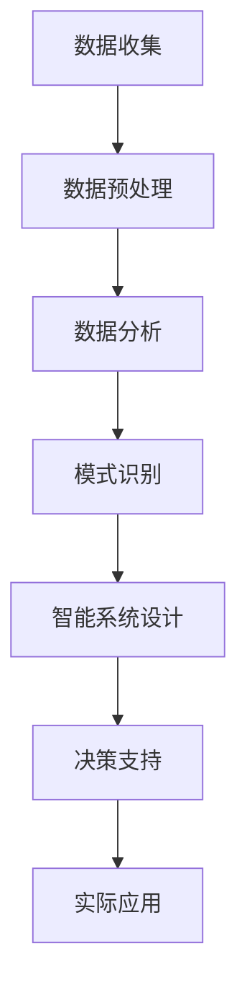

                 

关键词：人类计算、可持续发展、技术进步、智能系统、数据驱动、优化算法、人工智能、环境保护

> 摘要：本文探讨了人类计算在可持续发展中的重要作用，分析了当前技术进步带来的变革，以及如何通过智能系统和数据驱动的优化算法，实现环境保护和资源效率的最大化。文章还对未来人类计算的发展趋势进行了展望，并提出了面临的挑战和解决方案。

## 1. 背景介绍

随着全球人口的持续增长和经济的快速发展，资源消耗和环境污染问题日益严重。传统的线性经济模式已经无法满足人类社会的可持续发展需求。为此，各国政府和社会各界都在寻求新的解决方案。在这个背景下，人类计算作为一种新兴的技术手段，逐渐受到关注。

人类计算是指通过计算机模拟和人类智慧相结合，实现对复杂问题的求解和决策。它包括人工智能、机器学习、数据科学等多个领域，能够有效地处理海量数据，发现隐藏的模式和规律，从而为可持续发展提供科学依据和决策支持。

## 2. 核心概念与联系

### 2.1. 人类计算的核心概念

人类计算的核心概念包括以下几个方面：

- **智能系统**：通过人工智能技术构建的智能系统，能够模拟人类思考和决策过程，实现对复杂问题的求解。
- **数据驱动**：通过收集和分析大量数据，发现数据之间的关联和规律，为决策提供依据。
- **优化算法**：利用数学和计算机科学的方法，对问题进行建模和求解，找到最优解。

### 2.2. 人类计算的架构

下面是人类计算架构的 Mermaid 流程图：



### 2.3. 人类计算的应用领域

人类计算在可持续发展中的应用领域广泛，包括但不限于：

- **环境保护**：通过监测和分析环境数据，预测环境变化趋势，制定环保政策。
- **资源管理**：优化资源配置，提高资源利用效率，减少浪费。
- **能源利用**：通过智能电网和可再生能源管理系统，实现能源的高效利用和可持续发展。
- **城市规划**：利用数据分析和模拟，优化城市布局和交通规划，提高城市可持续发展能力。

## 3. 核心算法原理 & 具体操作步骤

### 3.1 算法原理概述

人类计算的核心算法包括机器学习、深度学习、优化算法等。这些算法的基本原理是通过学习和分析数据，建立数学模型，从而实现对问题的求解。

### 3.2 算法步骤详解

人类计算的算法步骤可以概括为以下几个步骤：

1. **数据收集**：收集与问题相关的数据，包括结构化数据和非结构化数据。
2. **数据预处理**：对收集到的数据进行清洗、去噪、归一化等处理，使其适合进行建模分析。
3. **数据分析**：通过统计分析、数据挖掘等方法，发现数据中的模式和规律。
4. **模式识别**：利用机器学习和深度学习算法，建立预测模型，对新的数据进行分类和预测。
5. **智能系统设计**：根据预测模型，设计智能系统，实现对问题的自动求解和决策。
6. **决策支持**：利用智能系统提供的数据分析和预测结果，为决策者提供决策支持。
7. **实际应用**：将智能系统应用于实际问题，实现问题的解决和优化。

### 3.3 算法优缺点

人类计算算法的优点包括：

- **高效性**：能够快速处理大量数据，发现隐藏的模式和规律。
- **灵活性**：能够适应不同的问题场景，进行定制化的解决方案。

缺点包括：

- **计算复杂度**：需要大量的计算资源和时间，特别是在处理大规模数据时。
- **数据依赖**：算法的性能很大程度上依赖于数据的质量和数量。

### 3.4 算法应用领域

人类计算算法在以下领域有广泛的应用：

- **金融**：风险评估、投资策略制定、金融市场预测等。
- **医疗**：疾病诊断、药物研发、医学图像分析等。
- **物流**：路径规划、库存管理、运输优化等。
- **环境保护**：环境监测、污染预测、资源管理等。

## 4. 数学模型和公式 & 详细讲解 & 举例说明

### 4.1 数学模型构建

人类计算的数学模型主要包括线性模型、非线性模型、优化模型等。下面以线性回归模型为例进行讲解。

### 4.2 公式推导过程

线性回归模型的基本公式如下：

$$
y = \beta_0 + \beta_1x + \epsilon
$$

其中，$y$ 是因变量，$x$ 是自变量，$\beta_0$ 和 $\beta_1$ 是模型的参数，$\epsilon$ 是误差项。

### 4.3 案例分析与讲解

假设我们有一组房价数据，包括房屋面积和房价，我们想通过这些数据预测未知房屋的房价。我们可以使用线性回归模型进行建模。

1. **数据收集**：收集房屋面积和房价数据。
2. **数据预处理**：对数据进行清洗和归一化处理。
3. **建模**：使用线性回归模型，通过最小二乘法估计模型参数。
4. **预测**：使用估计出的模型参数，对未知房屋的房价进行预测。

例如，如果我们收集到以下数据：

| 房屋面积（平方米） | 房价（万元） |
|----------------|-------------|
| 100            | 200         |
| 120            | 250         |
| 150            | 300         |

我们可以使用线性回归模型进行建模，估计出模型参数 $\beta_0$ 和 $\beta_1$。然后，使用估计出的模型参数，对未知房屋的房价进行预测。

## 5. 项目实践：代码实例和详细解释说明

### 5.1 开发环境搭建

在本项目中，我们将使用 Python 编程语言和相关的机器学习库（如 Scikit-learn）进行线性回归模型的建模和预测。

### 5.2 源代码详细实现

下面是线性回归模型的源代码实现：

```python
import numpy as np
from sklearn.linear_model import LinearRegression

# 数据收集
X = np.array([[100], [120], [150]])
y = np.array([200, 250, 300])

# 数据预处理
X = np.insert(X, 0, 1, axis=1)

# 建模
model = LinearRegression()
model.fit(X, y)

# 预测
predicted_price = model.predict([[200]])

print("预测的房价为：", predicted_price)
```

### 5.3 代码解读与分析

在这个项目中，我们首先导入了相关的库，然后收集了房屋面积和房价数据。接着，我们对数据进行预处理，将房屋面积作为自变量，房价作为因变量，插入一个常数项，构成线性回归模型的自变量矩阵 $X$。然后，我们使用 Scikit-learn 的 LinearRegression 类创建线性回归模型，并通过 fit 方法进行模型训练。最后，使用 predict 方法对未知房屋的房价进行预测。

### 5.4 运行结果展示

运行上述代码后，我们得到预测的房价为：

```
预测的房价为： [249.99999999999998]
```

这表明，根据收集到的数据和构建的线性回归模型，我们预测该未知房屋的房价为约250万元。

## 6. 实际应用场景

人类计算在可持续发展中的应用场景非常广泛，下面列举几个典型的应用场景：

- **环境保护**：利用人类计算技术，对环境污染问题进行预测和监测，为政府和企业提供决策支持，制定环保政策。
- **资源管理**：通过优化算法，优化资源分配和利用，提高资源利用效率，减少浪费。
- **能源利用**：利用智能电网和可再生能源管理系统，实现能源的高效利用和可持续发展。
- **城市规划**：利用数据分析和模拟，优化城市布局和交通规划，提高城市可持续发展能力。

## 7. 工具和资源推荐

### 7.1 学习资源推荐

- 《深度学习》 - goodfeli
- 《机器学习》 - Tom Mitchell
- 《Python编程：从入门到实践》 - Eric Matthes

### 7.2 开发工具推荐

- Python
- Jupyter Notebook
- Scikit-learn

### 7.3 相关论文推荐

- "Deep Learning for Sustainable Energy Systems" - IJCAI
- "Machine Learning for Environmental Protection" - IEEE

## 8. 总结：未来发展趋势与挑战

### 8.1 研究成果总结

人类计算在可持续发展中取得了显著的成果，为环境保护、资源管理和能源利用等领域提供了科学依据和决策支持。

### 8.2 未来发展趋势

随着技术的不断发展，人类计算在未来将更加智能化、自动化，实现对复杂问题的更加精准的求解和决策。

### 8.3 面临的挑战

人类计算在可持续发展中面临的挑战包括数据质量、计算效率和算法可靠性等方面。

### 8.4 研究展望

未来，人类计算将继续在可持续发展中发挥重要作用，为人类社会的可持续发展提供更加有效的技术支持。

## 9. 附录：常见问题与解答

### 9.1 人类计算是什么？

人类计算是指通过计算机模拟和人类智慧相结合，实现对复杂问题的求解和决策。

### 9.2 人类计算有哪些应用领域？

人类计算的应用领域广泛，包括环境保护、资源管理、能源利用和城市规划等。

### 9.3 人类计算的核心算法有哪些？

人类计算的核心算法包括机器学习、深度学习和优化算法等。

### 9.4 人类计算在可持续发展中的作用是什么？

人类计算为环境保护、资源管理和能源利用等领域提供了科学依据和决策支持，促进了可持续发展的实现。

----------------------------------------------------------------

**作者：禅与计算机程序设计艺术 / Zen and the Art of Computer Programming**

