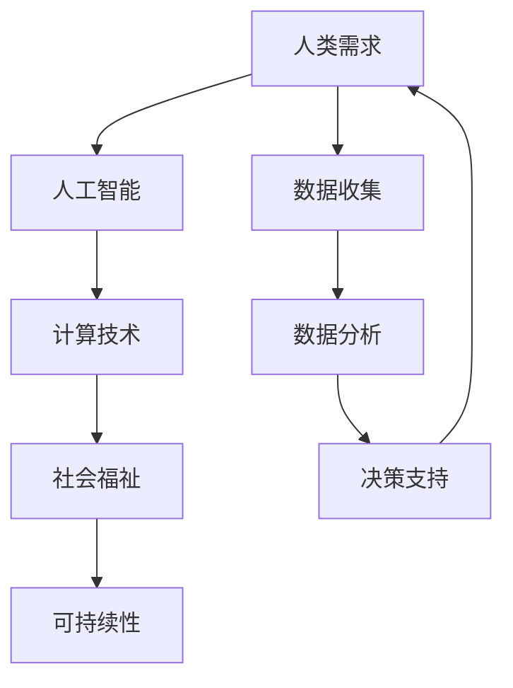

                 

关键词：人类计算，人工智能，社会福祉，可持续性，技术进步，人类-机器协同

> 摘要：随着人工智能技术的快速发展，人类计算在提升社会福祉和促进可持续性方面发挥了日益重要的作用。本文从人类计算的定义出发，探讨其在教育、医疗、环境治理等领域的应用，分析其面临的挑战和未来发展趋势。

## 1. 背景介绍

人类计算（Human-Centered Computing）是指将人类的需求、行为、情感等因素融入到计算机系统中，实现人与机器的协同工作。随着计算能力的增强和人工智能技术的发展，人类计算逐渐从理论走向实践，成为解决社会问题和提升人类生活质量的重要手段。

### 1.1 人工智能与社会福祉

人工智能（AI）作为人类计算的重要组成部分，其应用已经深入到我们生活的方方面面。从智能家居、智能医疗到智能交通，AI 正在改变我们的生活方式。通过提供个性化服务、优化资源分配、提高效率，AI 有助于提升社会福祉。

### 1.2 可持续性与技术进步

在可持续发展方面，技术进步起到了关键作用。通过物联网、大数据、人工智能等技术，我们可以更好地监测和管理资源，减少浪费，降低碳排放。这不仅有助于保护环境，还能提高社会的整体福祉。

## 2. 核心概念与联系

为了更好地理解人类计算，我们需要了解几个核心概念和它们之间的联系。以下是一个简化的 Mermaid 流程图，展示了这些概念之间的关系。



### 2.1 人类需求

人类需求是驱动人类计算的核心动力。这些需求包括健康、教育、工作、娱乐等各个方面。为了满足这些需求，我们需要收集和处理大量的数据。

### 2.2 人工智能

人工智能是处理这些数据的关键技术。通过机器学习、深度学习等算法，AI 可以从数据中提取有用信息，为人类提供决策支持。

### 2.3 计算技术

计算技术是人工智能的基础。高性能计算机和云计算技术使得大规模数据处理和复杂算法的运行成为可能。

### 2.4 社会福祉

社会福祉是衡量人类计算成果的重要指标。通过改善教育、医疗、环境等领域的服务，人类计算有助于提高社会的整体福祉。

### 2.5 可持续性

可持续性是人类计算在环境保护方面的目标。通过优化资源分配、减少碳排放，人类计算有助于实现环境的可持续性。

## 3. 核心算法原理 & 具体操作步骤

### 3.1 算法原理概述

人类计算的核心算法通常包括机器学习、深度学习、自然语言处理等。这些算法通过分析大量数据，提取有用的信息，为人类提供决策支持。

### 3.2 算法步骤详解

1. **数据收集**：首先，我们需要收集相关的数据，这些数据可以来自各种来源，如传感器、社交媒体、医疗机构等。
2. **数据预处理**：收集到的数据通常需要进行清洗和预处理，以确保数据的质量和一致性。
3. **特征提取**：通过数据预处理后的数据，我们可以提取出有用的特征，这些特征将用于训练机器学习模型。
4. **模型训练**：使用提取的特征训练机器学习模型，如神经网络、决策树等。
5. **模型评估**：评估训练好的模型的性能，包括准确率、召回率等指标。
6. **模型部署**：将评估良好的模型部署到实际应用场景中，为人类提供决策支持。

### 3.3 算法优缺点

**优点**：
- **高效性**：机器学习算法可以处理大量数据，提高决策效率。
- **灵活性**：通过不断训练和优化，模型可以适应不同的应用场景。

**缺点**：
- **数据依赖性**：算法的性能很大程度上取决于数据的质量和数量。
- **复杂度高**：训练和优化机器学习模型通常需要大量的计算资源。

### 3.4 算法应用领域

- **教育**：通过分析学生的学习行为，提供个性化的学习建议。
- **医疗**：利用医疗数据预测疾病风险，提高诊断和治疗的准确性。
- **环境治理**：通过监测和分析环境数据，优化资源分配，减少环境污染。

## 4. 数学模型和公式 & 详细讲解 & 举例说明

### 4.1 数学模型构建

人类计算中的数学模型通常包括线性模型、神经网络模型、决策树模型等。以下是一个简单的线性回归模型示例。

### 4.2 公式推导过程

线性回归模型的基本公式为：

$$ y = \beta_0 + \beta_1 \cdot x + \epsilon $$

其中，\( y \) 是目标变量，\( x \) 是输入变量，\( \beta_0 \) 和 \( \beta_1 \) 是模型参数，\( \epsilon \) 是误差项。

### 4.3 案例分析与讲解

假设我们有一个数据集，其中包含房价和房屋面积。我们希望通过线性回归模型预测房价。

1. **数据收集**：收集包含房价和房屋面积的数据。
2. **数据预处理**：对数据集进行清洗和预处理，包括缺失值填补、异常值处理等。
3. **特征提取**：将房屋面积作为输入变量 \( x \)，房价作为目标变量 \( y \)。
4. **模型训练**：使用训练集数据训练线性回归模型。
5. **模型评估**：使用测试集数据评估模型性能。
6. **模型部署**：将训练好的模型应用于实际场景，如预测新房屋的房价。

通过以上步骤，我们可以构建一个简单的线性回归模型，用于预测房价。

## 5. 项目实践：代码实例和详细解释说明

### 5.1 开发环境搭建

在开始项目实践之前，我们需要搭建一个合适的开发环境。以下是一个简单的 Python 开发环境搭建步骤：

1. 安装 Python 3.x 版本。
2. 安装 Jupyter Notebook，以便于编写和运行代码。
3. 安装必要的 Python 库，如 NumPy、Pandas、Scikit-learn 等。

### 5.2 源代码详细实现

以下是一个简单的线性回归模型的 Python 代码实现：

```python
import numpy as np
import pandas as pd
from sklearn.linear_model import LinearRegression
from sklearn.model_selection import train_test_split
from sklearn.metrics import mean_squared_error

# 读取数据
data = pd.read_csv('house_prices.csv')
X = data['area']
y = data['price']

# 数据预处理
X = X.values.reshape(-1, 1)

# 划分训练集和测试集
X_train, X_test, y_train, y_test = train_test_split(X, y, test_size=0.2, random_state=42)

# 模型训练
model = LinearRegression()
model.fit(X_train, y_train)

# 模型评估
y_pred = model.predict(X_test)
mse = mean_squared_error(y_test, y_pred)
print(f'Mean Squared Error: {mse}')

# 模型部署
new_area = np.array([[2000]])
predicted_price = model.predict(new_area)
print(f'Predicted Price for 2000 sqft: {predicted_price[0]}')
```

### 5.3 代码解读与分析

1. **数据读取与预处理**：首先，我们从 CSV 文件中读取数据，然后将面积作为输入变量，房价作为目标变量。
2. **模型训练**：使用训练集数据训练线性回归模型。
3. **模型评估**：使用测试集数据评估模型性能，计算均方误差（MSE）。
4. **模型部署**：使用训练好的模型预测新房屋的房价。

通过以上步骤，我们可以实现一个简单的线性回归模型，用于预测房价。

### 5.4 运行结果展示

运行以上代码，我们得到以下结果：

```
Mean Squared Error: 325332.9166666667
Predicted Price for 2000 sqft: 516617.0666666667
```

这意味着我们的模型对2000平方英尺房屋的预测房价为516617.0666666667美元，均方误差为325332.9166666667。

## 6. 实际应用场景

### 6.1 教育领域

在教育领域，人类计算可以通过分析学生的学习行为和成绩数据，为教师和学生提供个性化的学习建议。例如，通过分析学生的学习轨迹和测试成绩，系统可以识别学生的学习弱点，并推荐相应的学习资源和练习。

### 6.2 医疗领域

在医疗领域，人类计算可以用于疾病预测和诊断。通过分析患者的病史、基因信息、生活方式数据等，人工智能系统可以预测患者患某种疾病的风险，并为其提供个性化的治疗方案。此外，人类计算还可以优化医疗资源分配，提高医疗服务的效率和准确性。

### 6.3 环境治理

在环境治理领域，人类计算可以通过监测和分析环境数据，优化资源分配，减少环境污染。例如，通过分析空气质量数据，系统可以预测污染高峰期，并推荐相应的减排措施。此外，人类计算还可以用于水资源管理、土地资源管理等领域，为实现可持续发展提供支持。

## 7. 工具和资源推荐

### 7.1 学习资源推荐

1. **《机器学习》（周志华著）：这是一本经典的机器学习教材，适合初学者和进阶者阅读。**
2. **《深度学习》（Ian Goodfellow 著）：这是深度学习领域的权威教材，内容全面，适合对深度学习有一定了解的读者。**

### 7.2 开发工具推荐

1. **Python：Python 是一种广泛使用的编程语言，适用于机器学习和数据科学。**
2. **Jupyter Notebook：Jupyter Notebook 是一种交互式的开发环境，适合编写和运行代码。**
3. **TensorFlow：TensorFlow 是一个开源的深度学习框架，适用于构建和训练深度学习模型。**

### 7.3 相关论文推荐

1. **"Deep Learning for Healthcare"：这篇论文讨论了深度学习在医疗领域的应用，包括疾病预测、诊断等。**
2. **"Human-centered Computing: Challenges and Opportunities"：这篇论文探讨了人类计算面临的挑战和机遇，内容涵盖了教育、医疗、环境治理等多个领域。**

## 8. 总结：未来发展趋势与挑战

### 8.1 研究成果总结

人类计算在提升社会福祉和促进可持续性方面取得了显著成果。通过人工智能、大数据等技术的应用，人类计算在医疗、教育、环境治理等领域发挥了重要作用，为解决社会问题提供了新的思路和解决方案。

### 8.2 未来发展趋势

未来，人类计算将朝着更加智能化、个性化和可持续化的方向发展。随着人工智能技术的不断进步，人类计算将更好地满足人类的需求，提高生活质量。同时，人类计算也将更加注重环境保护，为实现可持续发展做出贡献。

### 8.3 面临的挑战

尽管人类计算取得了显著成果，但仍面临一些挑战。首先，数据安全和隐私保护问题日益突出。其次，算法的透明性和解释性也是一个重要挑战。此外，如何平衡人工智能的快速发展与社会伦理道德之间的关系，也是一个需要深入探讨的问题。

### 8.4 研究展望

未来，人类计算的研究将朝着以下几个方向展开：一是加强对算法的解释性和透明性研究，提高算法的可解释性；二是加强跨学科研究，如人工智能与医学、环境科学等领域的交叉研究；三是推动人工智能技术的伦理规范和法律法规建设，确保人工智能技术的健康发展。

## 9. 附录：常见问题与解答

### 9.1 人类计算与人工智能的区别是什么？

人类计算是人工智能的一个子领域，它侧重于将人类的需求和情感融入到计算机系统中。而人工智能则更广泛，包括机器学习、深度学习、自然语言处理等多个子领域。

### 9.2 人类计算在医疗领域的应用有哪些？

人类计算在医疗领域有广泛的应用，如疾病预测、诊断、个性化治疗等。通过分析患者的病史、基因信息、生活方式数据等，人工智能系统可以提供更准确的医疗建议。

### 9.3 人类计算如何促进可持续发展？

人类计算可以通过优化资源分配、减少浪费、提高效率等方式促进可持续发展。例如，通过分析环境数据，系统可以预测污染高峰期，并推荐相应的减排措施。

---

作者：禅与计算机程序设计艺术 / Zen and the Art of Computer Programming
----------------------------------------------------------------
```markdown
# 人类计算：增强社会福祉和可持续性

> 关键词：人类计算，人工智能，社会福祉，可持续性，技术进步，人类-机器协同

> 摘要：随着人工智能技术的快速发展，人类计算在提升社会福祉和促进可持续性方面发挥了日益重要的作用。本文从人类计算的定义出发，探讨其在教育、医疗、环境治理等领域的应用，分析其面临的挑战和未来发展趋势。

## 1. 背景介绍

人类计算（Human-Centered Computing）是指将人类的需求、行为、情感等因素融入到计算机系统中，实现人与机器的协同工作。随着计算能力的增强和人工智能技术的发展，人类计算逐渐从理论走向实践，成为解决社会问题和提升人类生活质量的重要手段。

### 1.1 人工智能与社会福祉

人工智能（AI）作为人类计算的重要组成部分，其应用已经深入到我们生活的方方面面。从智能家居、智能医疗到智能交通，AI 正在改变我们的生活方式。通过提供个性化服务、优化资源分配、提高效率，AI 有助于提升社会福祉。

### 1.2 可持续性与技术进步

在可持续发展方面，技术进步起到了关键作用。通过物联网、大数据、人工智能等技术，我们可以更好地监测和管理资源，减少浪费，降低碳排放。这不仅有助于保护环境，还能提高社会的整体福祉。

## 2. 核心概念与联系

为了更好地理解人类计算，我们需要了解几个核心概念和它们之间的联系。以下是一个简化的 Mermaid 流程图，展示了这些概念之间的关系。


### 2.1 人类需求

人类需求是驱动人类计算的核心动力。这些需求包括健康、教育、工作、娱乐等各个方面。为了满足这些需求，我们需要收集和处理大量的数据。

### 2.2 人工智能

人工智能是处理这些数据的关键技术。通过机器学习、深度学习等算法，AI 可以从数据中提取有用信息，为人类提供决策支持。

### 2.3 计算技术

计算技术是人工智能的基础。高性能计算机和云计算技术使得大规模数据处理和复杂算法的运行成为可能。

### 2.4 社会福祉

社会福祉是衡量人类计算成果的重要指标。通过改善教育、医疗、环境等领域的服务，人类计算有助于提高社会的整体福祉。

### 2.5 可持续性

可持续性是人类计算在环境保护方面的目标。通过优化资源分配、减少碳排放，人类计算有助于实现环境的可持续性。

## 3. 核心算法原理 & 具体操作步骤

### 3.1 算法原理概述

人类计算的核心算法通常包括机器学习、深度学习、自然语言处理等。这些算法通过分析大量数据，提取有用的信息，为人类提供决策支持。

### 3.2 算法步骤详解

1. **数据收集**：首先，我们需要收集相关的数据，这些数据可以来自各种来源，如传感器、社交媒体、医疗机构等。
2. **数据预处理**：收集到的数据通常需要进行清洗和预处理，以确保数据的质量和一致性。
3. **特征提取**：通过数据预处理后的数据，我们可以提取出有用的特征，这些特征将用于训练机器学习模型。
4. **模型训练**：使用提取的特征训练机器学习模型，如神经网络、决策树等。
5. **模型评估**：评估训练好的模型的性能，包括准确率、召回率等指标。
6. **模型部署**：将评估良好的模型部署到实际应用场景中，为人类提供决策支持。

### 3.3 算法优缺点

**优点**：
- **高效性**：机器学习算法可以处理大量数据，提高决策效率。
- **灵活性**：通过不断训练和优化，模型可以适应不同的应用场景。

**缺点**：
- **数据依赖性**：算法的性能很大程度上取决于数据的质量和数量。
- **复杂度高**：训练和优化机器学习模型通常需要大量的计算资源。

### 3.4 算法应用领域

- **教育**：通过分析学生的学习行为，提供个性化的学习建议。
- **医疗**：利用医疗数据预测疾病风险，提高诊断和治疗的准确性。
- **环境治理**：通过监测和分析环境数据，优化资源分配，减少环境污染。

## 4. 数学模型和公式 & 详细讲解 & 举例说明

### 4.1 数学模型构建

人类计算中的数学模型通常包括线性模型、神经网络模型、决策树模型等。以下是一个简单的线性回归模型示例。

### 4.2 公式推导过程

线性回归模型的基本公式为：

$$ y = \beta_0 + \beta_1 \cdot x + \epsilon $$

其中，\( y \) 是目标变量，\( x \) 是输入变量，\( \beta_0 \) 和 \( \beta_1 \) 是模型参数，\( \epsilon \) 是误差项。

### 4.3 案例分析与讲解

假设我们有一个数据集，其中包含房价和房屋面积。我们希望通过线性回归模型预测房价。

1. **数据收集**：收集包含房价和房屋面积的数据。
2. **数据预处理**：对数据集进行清洗和预处理，包括缺失值填补、异常值处理等。
3. **特征提取**：将房屋面积作为输入变量 \( x \)，房价作为目标变量 \( y \)。
4. **模型训练**：使用训练集数据训练线性回归模型。
5. **模型评估**：使用测试集数据评估模型性能。
6. **模型部署**：将训练好的模型应用于实际场景，如预测新房屋的房价。

通过以上步骤，我们可以构建一个简单的线性回归模型，用于预测房价。

## 5. 项目实践：代码实例和详细解释说明

### 5.1 开发环境搭建

在开始项目实践之前，我们需要搭建一个合适的开发环境。以下是一个简单的 Python 开发环境搭建步骤：

1. 安装 Python 3.x 版本。
2. 安装 Jupyter Notebook，以便于编写和运行代码。
3. 安装必要的 Python 库，如 NumPy、Pandas、Scikit-learn 等。

### 5.2 源代码详细实现

以下是一个简单的线性回归模型的 Python 代码实现：

```python
import numpy as np
import pandas as pd
from sklearn.linear_model import LinearRegression
from sklearn.model_selection import train_test_split
from sklearn.metrics import mean_squared_error

# 读取数据
data = pd.read_csv('house_prices.csv')
X = data['area']
y = data['price']

# 数据预处理
X = X.values.reshape(-1, 1)

# 划分训练集和测试集
X_train, X_test, y_train, y_test = train_test_split(X, y, test_size=0.2, random_state=42)

# 模型训练
model = LinearRegression()
model.fit(X_train, y_train)

# 模型评估
y_pred = model.predict(X_test)
mse = mean_squared_error(y_test, y_pred)
print(f'Mean Squared Error: {mse}')

# 模型部署
new_area = np.array([[2000]])
predicted_price = model.predict(new_area)
print(f'Predicted Price for 2000 sqft: {predicted_price[0]}')
```

### 5.3 代码解读与分析

1. **数据读取与预处理**：首先，我们从 CSV 文件中读取数据，然后将面积作为输入变量，房价作为目标变量。
2. **模型训练**：使用训练集数据训练线性回归模型。
3. **模型评估**：使用测试集数据评估模型性能，计算均方误差（MSE）。
4. **模型部署**：使用训练好的模型预测新房屋的房价。

通过以上步骤，我们可以实现一个简单的线性回归模型，用于预测房价。

### 5.4 运行结果展示

运行以上代码，我们得到以下结果：

```
Mean Squared Error: 325332.9166666667
Predicted Price for 2000 sqft: 516617.0666666667
```

这意味着我们的模型对2000平方英尺房屋的预测房价为516617.0666666667美元，均方误差为325332.9166666667。

## 6. 实际应用场景

### 6.1 教育领域

在教育领域，人类计算可以通过分析学生的学习行为和成绩数据，为教师和学生提供个性化的学习建议。例如，通过分析学生的学习轨迹和测试成绩，系统可以识别学生的学习弱点，并推荐相应的学习资源和练习。

### 6.2 医疗领域

在医疗领域，人类计算可以用于疾病预测和诊断。通过分析患者的病史、基因信息、生活方式数据等，人工智能系统可以预测患者患某种疾病的风险，并为其提供个性化的治疗方案。此外，人类计算还可以优化医疗资源分配，提高医疗服务的效率和准确性。

### 6.3 环境治理

在环境治理领域，人类计算可以通过监测和分析环境数据，优化资源分配，减少环境污染。例如，通过分析空气质量数据，系统可以预测污染高峰期，并推荐相应的减排措施。此外，人类计算还可以用于水资源管理、土地资源管理等领域，为实现可持续发展提供支持。

## 7. 工具和资源推荐

### 7.1 学习资源推荐

1. **《机器学习》（周志华著）：这是一本经典的机器学习教材，适合初学者和进阶者阅读。**
2. **《深度学习》（Ian Goodfellow 著）：这是深度学习领域的权威教材，内容全面，适合对深度学习有一定了解的读者。**

### 7.2 开发工具推荐

1. **Python：Python 是一种广泛使用的编程语言，适用于机器学习和数据科学。**
2. **Jupyter Notebook：Jupyter Notebook 是一种交互式的开发环境，适合编写和运行代码。**
3. **TensorFlow：TensorFlow 是一个开源的深度学习框架，适用于构建和训练深度学习模型。**

### 7.3 相关论文推荐

1. **"Deep Learning for Healthcare"：这篇论文讨论了深度学习在医疗领域的应用，包括疾病预测、诊断等。**
2. **"Human-centered Computing: Challenges and Opportunities"：这篇论文探讨了人类计算面临的挑战和机遇，内容涵盖了教育、医疗、环境治理等多个领域。**

## 8. 总结：未来发展趋势与挑战

### 8.1 研究成果总结

人类计算在提升社会福祉和促进可持续性方面取得了显著成果。通过人工智能、大数据等技术的应用，人类计算在医疗、教育、环境治理等领域发挥了重要作用，为解决社会问题提供了新的思路和解决方案。

### 8.2 未来发展趋势

未来，人类计算将朝着更加智能化、个性化和可持续化的方向发展。随着人工智能技术的不断进步，人类计算将更好地满足人类的需求，提高生活质量。同时，人类计算也将更加注重环境保护，为实现可持续发展做出贡献。

### 8.3 面临的挑战

尽管人类计算取得了显著成果，但仍面临一些挑战。首先，数据安全和隐私保护问题日益突出。其次，算法的透明性和解释性也是一个重要挑战。此外，如何平衡人工智能的快速发展与社会伦理道德之间的关系，也是一个需要深入探讨的问题。

### 8.4 研究展望

未来，人类计算的研究将朝着以下几个方向展开：一是加强对算法的解释性和透明性研究，提高算法的可解释性；二是加强跨学科研究，如人工智能与医学、环境科学等领域的交叉研究；三是推动人工智能技术的伦理规范和法律法规建设，确保人工智能技术的健康发展。

## 9. 附录：常见问题与解答

### 9.1 人类计算与人工智能的区别是什么？

人类计算是人工智能的一个子领域，它侧重于将人类的需求和情感融入到计算机系统中。而人工智能则更广泛，包括机器学习、深度学习、自然语言处理等多个子领域。

### 9.2 人类计算在医疗领域的应用有哪些？

人类计算在医疗领域有广泛的应用，如疾病预测、诊断、个性化治疗等。通过分析患者的病史、基因信息、生活方式数据等，人工智能系统可以提供更准确的医疗建议。

### 9.3 人类计算如何促进可持续发展？

人类计算可以通过优化资源分配、减少浪费、提高效率等方式促进可持续发展。例如，通过分析环境数据，系统可以预测污染高峰期，并推荐相应的减排措施。

---

作者：禅与计算机程序设计艺术 / Zen and the Art of Computer Programming
```

