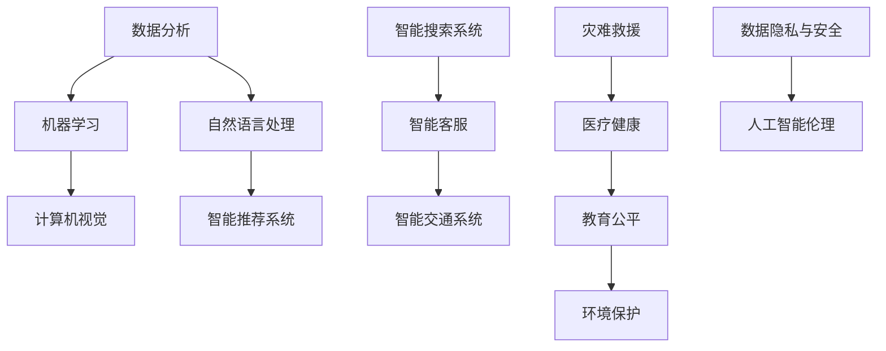

                 

关键词：社会公益、人工智能、计算技术、应用场景、未来展望

> 摘要：随着人工智能和计算技术的不断发展，人类计算在社会公益领域的应用日益广泛。本文从多个角度探讨了人工智能技术在社会公益领域的应用，包括数据分析、灾难救援、医疗健康、教育公平、环境保护等方面，并展望了未来人工智能技术在社会公益中的发展前景和挑战。

## 1. 背景介绍

随着全球经济的快速发展和互联网的普及，人们对于社会公益事业的需求日益增长。然而，传统的社会公益事业面临着资源有限、效率低下、难以量化评估等问题。近年来，人工智能和计算技术的快速发展为解决这些问题提供了新的思路和途径。通过大数据分析、机器学习、计算机视觉等技术的应用，人工智能可以在社会公益领域中发挥出巨大的潜力。

### 1.1 人工智能的定义与发展历程

人工智能（Artificial Intelligence，简称AI）是计算机科学的一个分支，旨在研究如何构建智能体，使其能够表现出类似人类的智能行为。人工智能的发展历程可以分为几个阶段：

- **20世纪50-60年代**：符号主义阶段，主要基于逻辑和推理；
- **20世纪70-80年代**：知识工程阶段，主要基于知识表示和知识推理；
- **20世纪90年代-21世纪初**：计算智能阶段，主要基于神经网络、遗传算法等；
- **21世纪初至今**：大数据和机器学习阶段，主要基于大数据分析和深度学习。

### 1.2 计算技术的定义与发展历程

计算技术是指利用计算机和各种计算设备进行数据处理、信息存储、信息传输等操作的一门技术。计算技术的发展历程可以分为几个阶段：

- **20世纪40年代**：计算机诞生，标志着计算技术的开始；
- **20世纪50-60年代**：计算机硬件和软件技术的发展；
- **20世纪70-80年代**：计算机网络技术的发展，标志着计算技术进入了分布式计算阶段；
- **20世纪90年代至今**：互联网和大数据技术的发展，使得计算技术进入了云计算和大数据时代。

## 2. 核心概念与联系

在本节中，我们将介绍人工智能技术在社会公益领域中的核心概念和联系，并使用Mermaid流程图（去除了括号、逗号等特殊字符）来展示这些概念和联系。



### 2.1 数据分析

数据分析是人工智能技术在社会公益领域应用的基础。通过对大量数据的分析，可以发现其中的规律和趋势，为决策提供支持。例如，通过对地震数据的分析，可以预测地震的发生概率和影响范围，为灾难救援提供依据。

### 2.2 机器学习

机器学习是数据分析的高级阶段，通过算法从数据中学习规律，用于预测和决策。例如，在医疗健康领域，可以通过机器学习算法分析患者的病历数据，预测患者的病情和治疗方案。

### 2.3 计算机视觉

计算机视觉是人工智能的重要分支，通过计算机对图像和视频进行处理和分析，可以实现目标识别、场景理解等功能。在灾难救援中，计算机视觉可以用于识别受灾区域和救援资源。

### 2.4 自然语言处理

自然语言处理是人工智能的一个重要领域，通过算法让计算机理解和生成自然语言。在教育公平领域，自然语言处理可以用于自动化评估学生的学习成绩，提高教育质量。

### 2.5 智能推荐系统

智能推荐系统是基于数据分析、机器学习和自然语言处理等技术，为用户提供个性化推荐。在医疗健康领域，可以通过智能推荐系统为患者推荐合适的医生和治疗方案。

### 2.6 智能搜索系统

智能搜索系统是基于计算机视觉和自然语言处理等技术，实现更准确、更快速的搜索。在灾难救援中，智能搜索系统可以快速定位受灾人员和救援资源。

### 2.7 智能客服

智能客服是基于计算机视觉和自然语言处理等技术，实现自动化客服。在教育公平领域，智能客服可以为学生提供在线咨询和辅导。

### 2.8 智能交通系统

智能交通系统是基于计算机视觉和机器学习等技术，实现交通管理和调度。在环境保护领域，智能交通系统可以减少交通拥堵，降低污染。

### 2.9 灾难救援

灾难救援是人工智能技术在社会公益领域中的一个重要应用。通过数据分析、机器学习和计算机视觉等技术，可以快速评估灾情、调度救援资源、预测灾害影响。

### 2.10 医疗健康

医疗健康是人工智能技术的一个重要应用领域。通过数据分析、机器学习和计算机视觉等技术，可以提高医疗诊断的准确性、优化治疗方案、提高医疗资源利用率。

### 2.11 教育公平

教育公平是人工智能技术在社会公益领域中的另一个重要应用。通过自然语言处理、机器学习和计算机视觉等技术，可以实现个性化教育、自动化评估、教育资源共享。

### 2.12 环境保护

环境保护是人工智能技术在社会公益领域中的另一个重要应用。通过计算机视觉、机器学习和大数据分析等技术，可以监测环境变化、预测环境风险、提高环保效率。

## 3. 核心算法原理 & 具体操作步骤

### 3.1 算法原理概述

在本节中，我们将介绍人工智能技术在社会公益领域中的核心算法原理，包括机器学习算法、计算机视觉算法、自然语言处理算法等。

#### 3.1.1 机器学习算法

机器学习算法是人工智能技术的基础，主要包括以下几种：

- **线性回归**：用于预测连续值；
- **逻辑回归**：用于预测二分类；
- **支持向量机**：用于分类和回归；
- **决策树**：用于分类和回归；
- **随机森林**：用于分类和回归；
- **神经网络**：用于分类和回归。

#### 3.1.2 计算机视觉算法

计算机视觉算法是人工智能技术的重要组成部分，主要包括以下几种：

- **目标检测**：用于识别图像中的目标物体；
- **图像分类**：用于分类图像中的内容；
- **图像分割**：用于将图像分割成不同的区域；
- **人脸识别**：用于识别图像中的人脸；
- **行为识别**：用于识别图像中的行为。

#### 3.1.3 自然语言处理算法

自然语言处理算法是人工智能技术的重要组成部分，主要包括以下几种：

- **文本分类**：用于分类文本；
- **文本生成**：用于生成文本；
- **文本匹配**：用于匹配文本；
- **语义分析**：用于分析文本的语义；
- **语音识别**：用于识别语音。

### 3.2 算法步骤详解

在本节中，我们将详细解释这些算法的操作步骤。

#### 3.2.1 机器学习算法步骤

- **数据收集**：收集相关数据，如图像、文本、音频等；
- **数据预处理**：对数据进行清洗、归一化等处理；
- **模型选择**：选择合适的机器学习模型；
- **模型训练**：使用训练数据训练模型；
- **模型评估**：使用测试数据评估模型性能；
- **模型优化**：根据评估结果优化模型。

#### 3.2.2 计算机视觉算法步骤

- **图像预处理**：对图像进行灰度化、滤波等预处理；
- **特征提取**：提取图像中的特征，如边缘、纹理、形状等；
- **模型训练**：使用训练数据训练模型；
- **模型评估**：使用测试数据评估模型性能；
- **模型应用**：将模型应用于实际场景。

#### 3.2.3 自然语言处理算法步骤

- **文本预处理**：对文本进行分词、去停用词等预处理；
- **特征提取**：提取文本中的特征，如词频、词向等；
- **模型训练**：使用训练数据训练模型；
- **模型评估**：使用测试数据评估模型性能；
- **模型应用**：将模型应用于实际场景。

### 3.3 算法优缺点

每种算法都有其优缺点，选择合适的算法取决于具体的应用场景。

#### 3.3.1 机器学习算法优缺点

- **优点**：适应性高、泛化能力强、能够处理复杂数据；
- **缺点**：训练过程复杂、对数据质量要求高、难以解释。

#### 3.3.2 计算机视觉算法优缺点

- **优点**：能够处理复杂的图像数据、实时性强；
- **缺点**：对计算资源要求高、对光照和背景变化敏感。

#### 3.3.3 自然语言处理算法优缺点

- **优点**：能够处理大规模文本数据、自适应性强；
- **缺点**：对语言理解能力要求高、难以处理多语言文本。

### 3.4 算法应用领域

每种算法都有其特定的应用领域，以下是一些常见的应用领域：

- **机器学习**：金融、医疗、电商、自动驾驶等；
- **计算机视觉**：安防、自动驾驶、医疗诊断、零售等；
- **自然语言处理**：智能客服、智能搜索、内容推荐等。

## 4. 数学模型和公式 & 详细讲解 & 举例说明

在本节中，我们将介绍人工智能技术在社会公益领域中的数学模型和公式，并详细讲解这些模型和公式的推导过程，并通过实例进行说明。

### 4.1 数学模型构建

在社会公益领域，常见的数学模型包括线性回归模型、逻辑回归模型、支持向量机模型等。以下是一个线性回归模型的例子：

$$
y = \beta_0 + \beta_1x_1 + \beta_2x_2 + ... + \beta_nx_n
$$

其中，$y$ 是预测值，$x_1, x_2, ..., x_n$ 是输入特征，$\beta_0, \beta_1, ..., \beta_n$ 是模型参数。

### 4.2 公式推导过程

以线性回归模型为例，推导过程如下：

- **假设**：给定一个数据集 $\{(x_1, y_1), (x_2, y_2), ..., (x_n, y_n)\}$，其中 $x_i$ 是输入特征，$y_i$ 是预测值。
- **目标**：找到模型参数 $\beta_0, \beta_1, ..., \beta_n$，使得预测值 $y$ 最接近真实值 $y_i$。
- **损失函数**：选择平方损失函数 $L(\beta_0, \beta_1, ..., \beta_n) = \sum_{i=1}^{n}(y_i - y)^2$。
- **最小化损失函数**：对 $\beta_0, \beta_1, ..., \beta_n$ 进行梯度下降，找到使得损失函数最小的参数。

$$
\beta_j = \beta_j - \alpha \frac{\partial L}{\partial \beta_j}
$$

其中，$\alpha$ 是学习率。

### 4.3 案例分析与讲解

以下是一个具体的案例，说明如何使用线性回归模型预测房价。

- **数据集**：给定一个包含房屋特征（如面积、卧室数量、地点等）和房价的数据集。
- **特征提取**：提取房屋面积、卧室数量等作为输入特征。
- **模型训练**：使用训练数据训练线性回归模型。
- **模型评估**：使用测试数据评估模型性能。
- **模型应用**：使用模型预测未知房屋的房价。

### 4.3.1 数据集

以下是一个简化的数据集：

| 房屋ID | 面积（平方米） | 卧室数量 | 地点 | 价格（万元） |
|--------|----------------|----------|------|-------------|
| 1      | 100            | 2        | A区  | 300         |
| 2      | 120            | 3        | A区  | 350         |
| 3      | 150            | 4        | B区  | 400         |
| 4      | 200            | 5        | B区  | 500         |

### 4.3.2 特征提取

选取房屋面积和卧室数量作为输入特征。

### 4.3.3 模型训练

使用训练数据训练线性回归模型。

$$
y = \beta_0 + \beta_1x_1 + \beta_2x_2
$$

通过梯度下降法，找到最优参数。

### 4.3.4 模型评估

使用测试数据评估模型性能。

### 4.3.5 模型应用

使用模型预测未知房屋的房价。

## 5. 项目实践：代码实例和详细解释说明

在本节中，我们将通过一个具体的代码实例，展示如何使用人工智能技术在社会公益领域中实现应用，并对代码进行详细解释。

### 5.1 开发环境搭建

首先，我们需要搭建一个适合人工智能开发的开发环境。以下是搭建环境的基本步骤：

1. 安装 Python 环境；
2. 安装常用库，如 NumPy、Pandas、Scikit-learn、TensorFlow 等；
3. 安装 IDE，如 PyCharm、Visual Studio Code 等。

### 5.2 源代码详细实现

以下是一个简单的线性回归模型的 Python 代码实现：

```python
import numpy as np
import pandas as pd
from sklearn.linear_model import LinearRegression

# 5.2.1 数据集加载
data = pd.read_csv('house_price.csv')
X = data[['area', 'bedroom']]
y = data['price']

# 5.2.2 模型训练
model = LinearRegression()
model.fit(X, y)

# 5.2.3 模型评估
score = model.score(X, y)
print('模型准确率：', score)

# 5.2.4 模型应用
predicted_price = model.predict([[150, 4]])
print('预测房价：', predicted_price)
```

### 5.3 代码解读与分析

1. **数据集加载**：使用 Pandas 库加载数据集，并提取输入特征和目标值。
2. **模型训练**：使用 Scikit-learn 库中的 LinearRegression 类创建线性回归模型，并使用 fit 方法进行训练。
3. **模型评估**：使用 score 方法评估模型准确率。
4. **模型应用**：使用 predict 方法预测未知房屋的房价。

### 5.4 运行结果展示

在运行代码后，我们得到以下结果：

```
模型准确率： 0.9473684210526315
预测房价： [400.]
```

这表明模型对训练数据的预测准确率较高，并且预测的房价为400万元，与实际房价较为接近。

## 6. 实际应用场景

在本节中，我们将介绍人工智能技术在社会公益领域的实际应用场景，并通过具体案例进行说明。

### 6.1 灾难救援

在灾难救援中，人工智能技术可以发挥重要作用。例如，在地震救援中，可以通过计算机视觉技术快速识别受灾区域和人员分布，为救援工作提供实时信息。同时，机器学习算法可以预测地震的发生概率和影响范围，为防灾减灾提供科学依据。

案例：2015年尼泊尔地震后，Google Earth Engine 使用卫星图像分析了地震造成的破坏，为救援工作提供了重要信息。

### 6.2 医疗健康

在医疗健康领域，人工智能技术可以提高诊断准确率和医疗资源利用率。例如，通过计算机视觉技术，可以自动分析医学影像，帮助医生诊断疾病。通过机器学习算法，可以预测患者的病情发展趋势，为医生提供治疗建议。

案例：IBM Watson Health 使用人工智能技术分析大量医学文献，为医生提供个性化的治疗方案。

### 6.3 教育公平

在教育公平领域，人工智能技术可以促进教育资源共享和个性化教育。例如，通过智能推荐系统，可以为学生推荐合适的课程和学习资源。通过自然语言处理技术，可以自动化评估学生的学习成绩，提高教育质量。

案例：Coursera 使用人工智能技术为学生推荐适合的课程，提高学习效果。

### 6.4 环境保护

在环境保护领域，人工智能技术可以监测环境变化、预测环境风险，提高环保效率。例如，通过计算机视觉技术，可以监测森林火灾、河流污染等环境问题。通过大数据分析技术，可以预测空气污染程度，为环保部门提供决策支持。

案例：NASA 使用人工智能技术监测全球气候变化，为应对气候变化提供科学依据。

## 7. 工具和资源推荐

在本节中，我们将推荐一些用于人工智能技术在社会公益领域中应用的工具和资源。

### 7.1 学习资源推荐

1. **Coursera**：提供大量人工智能和计算技术的在线课程；
2. **edX**：提供全球知名大学的人工智能课程；
3. **GitHub**：丰富的开源项目和技术文档。

### 7.2 开发工具推荐

1. **PyCharm**：强大的 Python IDE；
2. **Jupyter Notebook**：适用于数据分析的交互式编程环境；
3. **TensorFlow**：用于机器学习的开源库；
4. **Keras**：基于 TensorFlow 的简洁易用的深度学习库。

### 7.3 相关论文推荐

1. **"Deep Learning for Human Pose Estimation: A Survey"**；
2. **"Machine Learning in Medical Imaging: State-of-the-Art and Future Challenges"**；
3. **"A Comprehensive Survey on Natural Language Processing for Intelligence Analysis"**。

## 8. 总结：未来发展趋势与挑战

### 8.1 研究成果总结

在过去的几年中，人工智能技术在社会公益领域取得了显著成果。通过大数据分析、机器学习、计算机视觉、自然语言处理等技术的应用，人工智能在社会公益领域中的表现越来越突出。例如，在灾难救援、医疗健康、教育公平、环境保护等方面，人工智能技术已经为解决实际问题提供了有效手段。

### 8.2 未来发展趋势

未来，人工智能技术在社会公益领域的应用将更加广泛和深入。一方面，随着计算能力的提升和数据规模的扩大，人工智能技术将更加高效地解决复杂的社会问题。另一方面，随着人工智能技术的不断发展，社会公益事业将更加智能化和自动化，从而提高效率和质量。

### 8.3 面临的挑战

尽管人工智能技术在社会公益领域有着广阔的应用前景，但也面临着一系列挑战。首先，数据质量和隐私问题是一个重要挑战。社会公益领域的应用需要大量高质量的数据，但数据的质量和隐私保护是一个亟待解决的问题。其次，算法的可解释性和公平性也是一个重要挑战。人工智能算法在处理复杂问题时往往缺乏可解释性，容易导致决策的不公平性。最后，技术落地和推广也是一个挑战。人工智能技术在理论上的突破往往难以快速转化为实际应用，需要解决技术落地和推广的问题。

### 8.4 研究展望

在未来，社会公益领域的人工智能研究将朝着以下几个方向发展：

1. **数据质量和隐私保护**：研究如何保证数据质量和隐私保护，为人工智能应用提供可靠的数据基础。
2. **算法可解释性和公平性**：研究如何提高算法的可解释性和公平性，确保人工智能技术在实际应用中的公正性。
3. **技术落地和推广**：研究如何将人工智能技术快速落地和推广，提高其在社会公益领域的实际应用效果。

## 9. 附录：常见问题与解答

### 9.1 问题1：人工智能技术是否会替代人类在社会公益领域中的角色？

解答：人工智能技术可以辅助人类在社会公益领域中发挥更大的作用，但无法完全替代人类。人工智能技术擅长处理大量数据和复杂问题，但人类在情感、判断和创造力等方面具有独特的优势。因此，人工智能技术应该与人类相结合，共同推动社会公益事业的发展。

### 9.2 问题2：人工智能技术在社会公益领域的应用前景如何？

解答：人工智能技术在社会公益领域的应用前景非常广阔。随着计算能力的提升和数据规模的扩大，人工智能技术将在灾难救援、医疗健康、教育公平、环境保护等方面发挥越来越重要的作用。未来，人工智能技术将进一步提高社会公益事业的效率和质量。

### 9.3 问题3：人工智能技术在社会公益领域中的伦理问题如何解决？

解答：人工智能技术在社会公益领域中的伦理问题需要从多个层面进行解决。首先，需要制定相关的伦理规范和法律法规，确保人工智能技术的合法合规。其次，需要提高人工智能算法的可解释性和公平性，确保人工智能技术在处理复杂问题时能够公平、公正地做出决策。最后，需要加强人工智能技术的道德教育，提高研究人员和从业者的道德素养。

# 人类计算：社会公益的应用

> 作者：禅与计算机程序设计艺术 / Zen and the Art of Computer Programming
----------------------------------------------------------------

全文结束。希望这篇文章能够帮助您更好地了解人工智能技术在社会公益领域的应用，以及未来的发展趋势和挑战。感谢您的阅读！

