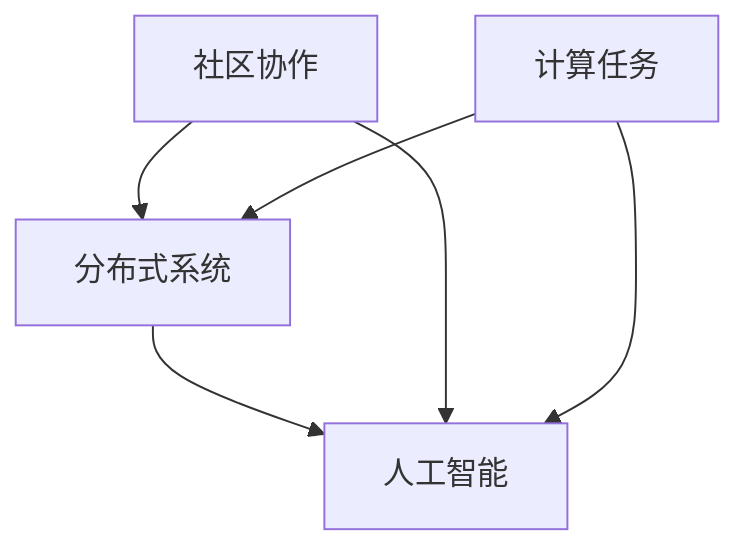

                 

关键词：全球计算，社区协作，分布式系统，人工智能，技术协作

> 摘要：本文探讨了人类计算在全球范围内的意义，以及如何通过社区协作、分布式系统和人工智能等技术手段，实现更高效、更智能的计算能力。文章从背景介绍、核心概念与联系、核心算法原理与操作步骤、数学模型与公式、项目实践、实际应用场景、工具和资源推荐，以及未来发展趋势与挑战等方面进行了详细阐述。

## 1. 背景介绍

随着信息技术的飞速发展，计算能力已经成为现代社会不可或缺的重要资源。然而，传统的集中式计算模式已经无法满足全球范围内日益增长的计算需求。为了解决这个问题，人类计算的概念应运而生。人类计算是一种基于分布式系统和人工智能的协作计算模式，旨在通过全球社区的力量，实现更高效、更智能的计算能力。

### 1.1 全球计算的发展历程

从早期的计算机科学领域，到现代的云计算、大数据和人工智能，人类计算的发展经历了多个阶段：

- **早期计算机**：计算机科学起源于20世纪中叶，最初的主要目的是进行科学计算和军事模拟。随着计算机硬件和软件技术的不断进步，计算机逐渐从单一的计算工具转变为一种强大的信息处理平台。

- **互联网时代**：20世纪90年代，互联网的普及带来了信息共享和协作的新模式。人们开始利用互联网进行远程计算，这为全球计算的发展奠定了基础。

- **云计算和大数据**：随着云计算和大数据技术的兴起，计算资源得到了更加灵活和高效的利用。人们可以通过云平台获取强大的计算能力，同时大数据技术为数据分析和机器学习提供了丰富的数据资源。

- **人工智能和分布式系统**：近年来，人工智能技术的快速发展使得计算机具备了更高级的智能能力。同时，分布式系统技术为人类计算提供了高效、可靠的计算架构。

### 1.2 人类计算的核心概念

人类计算的核心概念包括以下几个方面：

- **社区协作**：人类计算强调全球范围内的协作，通过构建社区，实现资源的共享和协同计算。

- **分布式系统**：分布式系统是人类计算的基础架构，通过将计算任务分布在多个节点上，实现高效的计算能力。

- **人工智能**：人工智能技术为人类计算提供了强大的智能支持，使得计算机能够更加智能地进行任务分配、资源调度和决策制定。

## 2. 核心概念与联系

为了更好地理解人类计算，我们需要了解其核心概念和原理。以下是人类计算的核心概念及其相互关系的 Mermaid 流程图：



### 2.1 社区协作

社区协作是人类计算的基础，它涉及到全球范围内的资源共享和协同计算。通过社区协作，人们可以共同参与计算任务，实现资源的高效利用。社区协作的核心包括以下几个方面：

- **资源共享**：社区成员可以共享计算资源，如计算能力、存储资源和网络带宽等。

- **任务分配**：社区可以根据成员的特长和资源情况，合理分配计算任务，提高计算效率。

- **协同计算**：社区成员可以协同完成计算任务，实现更复杂、更高效的计算过程。

### 2.2 分布式系统

分布式系统是人类计算的核心架构，它通过将计算任务分布在多个节点上，实现高效、可靠的计算能力。分布式系统的核心包括以下几个方面：

- **节点分布**：分布式系统将计算任务分配到多个节点上，每个节点都可以独立处理计算任务。

- **任务调度**：分布式系统通过任务调度算法，优化计算任务的分配和执行顺序，提高计算效率。

- **容错机制**：分布式系统具备容错能力，可以在节点故障时自动切换到其他节点，确保计算任务的顺利进行。

### 2.3 人工智能

人工智能是人类计算的重要支撑，它为计算任务提供了智能支持。通过人工智能技术，计算机可以自动识别、分析数据，进行决策和预测。人工智能的核心包括以下几个方面：

- **数据挖掘**：人工智能可以从大量数据中提取有价值的信息，为计算任务提供支持。

- **机器学习**：机器学习算法使得计算机能够自动学习和改进，提高计算任务的准确性和效率。

- **自然语言处理**：自然语言处理技术使得计算机能够理解和处理自然语言，实现人机交互。

## 3. 核心算法原理 & 具体操作步骤

### 3.1 算法原理概述

人类计算的核心算法包括分布式计算算法、机器学习算法和自然语言处理算法等。这些算法通过分布式系统、人工智能技术和社区协作，实现高效的计算任务。

### 3.2 算法步骤详解

以下是核心算法的具体操作步骤：

#### 3.2.1 分布式计算算法

1. **任务划分**：将计算任务划分为多个子任务，每个子任务可以在不同的节点上并行执行。

2. **任务调度**：通过任务调度算法，将子任务分配到合适的节点上，优化计算资源的利用。

3. **数据传输**：将任务所需的数据传输到相应的节点，确保子任务能够顺利进行。

4. **结果聚合**：将子任务的结果进行聚合，得到最终的计算结果。

#### 3.2.2 机器学习算法

1. **数据准备**：准备训练数据集，包括输入数据和标签。

2. **模型选择**：选择合适的机器学习模型，如决策树、神经网络等。

3. **模型训练**：使用训练数据集对模型进行训练，优化模型参数。

4. **模型评估**：使用测试数据集对模型进行评估，调整模型参数，提高模型性能。

5. **模型应用**：将训练好的模型应用到实际的计算任务中，实现智能计算。

#### 3.2.3 自然语言处理算法

1. **文本预处理**：对文本进行清洗和预处理，如去除停用词、分词等。

2. **特征提取**：从预处理后的文本中提取特征，如词频、词向量等。

3. **模型训练**：使用特征数据集对模型进行训练，优化模型参数。

4. **模型评估**：使用测试数据集对模型进行评估，调整模型参数，提高模型性能。

5. **模型应用**：将训练好的模型应用到实际的计算任务中，实现自然语言处理。

### 3.3 算法优缺点

分布式计算算法、机器学习算法和自然语言处理算法各有优缺点：

- **分布式计算算法**：优点是能够充分利用计算资源，提高计算效率；缺点是需要考虑数据传输和网络延迟等问题。

- **机器学习算法**：优点是能够自动学习和改进，提高计算任务的准确性和效率；缺点是需要大量训练数据和计算资源。

- **自然语言处理算法**：优点是实现人机交互，提高计算任务的智能化水平；缺点是需要对语言有深入的理解和处理。

### 3.4 算法应用领域

分布式计算算法、机器学习算法和自然语言处理算法广泛应用于各个领域：

- **分布式计算算法**：在云计算、大数据处理和分布式数据库等领域得到广泛应用。

- **机器学习算法**：在金融、医疗、交通等领域具有广泛的应用前景。

- **自然语言处理算法**：在搜索引擎、智能客服、机器翻译等领域发挥着重要作用。

## 4. 数学模型和公式 & 详细讲解 & 举例说明

### 4.1 数学模型构建

人类计算涉及到多种数学模型，如分布式计算模型、机器学习模型和自然语言处理模型。以下是一个简单的分布式计算模型：

$$
X = \sum_{i=1}^{n} x_i
$$

其中，$X$表示分布式计算的结果，$x_i$表示每个节点上的计算结果，$n$表示节点的数量。

### 4.2 公式推导过程

分布式计算模型的推导过程如下：

1. **任务划分**：将总任务划分为$n$个子任务，每个子任务由一个节点独立完成。

2. **计算结果**：每个节点独立计算子任务的结果，得到$x_i$。

3. **结果聚合**：将所有节点的计算结果进行聚合，得到总结果$X$。

4. **推导过程**：根据聚合结果的数学表示，得到分布式计算模型。

### 4.3 案例分析与讲解

以下是一个分布式计算模型的实际应用案例：

假设有5个节点，需要计算总任务的和。任务划分为5个子任务，每个子任务由一个节点独立完成。计算结果如下：

- 节点1：$x_1 = 10$
- 节点2：$x_2 = 20$
- 节点3：$x_3 = 30$
- 节点4：$x_4 = 40$
- 节点5：$x_5 = 50$

根据分布式计算模型，计算结果如下：

$$
X = x_1 + x_2 + x_3 + x_4 + x_5 = 10 + 20 + 30 + 40 + 50 = 150
$$

因此，总任务的结果为150。

## 5. 项目实践：代码实例和详细解释说明

### 5.1 开发环境搭建

在本项目实践中，我们使用Python语言和分布式计算框架PySpark进行实现。首先，需要在本地计算机上安装Python和PySpark。安装步骤如下：

1. 安装Python：从Python官方网站下载并安装Python 3.8以上版本。

2. 安装PySpark：使用pip命令安装PySpark。

   ```bash
   pip install pyspark
   ```

### 5.2 源代码详细实现

以下是项目的源代码实现：

```python
from pyspark.sql import SparkSession

# 创建SparkSession
spark = SparkSession.builder.appName("HumanComputingExample").getOrCreate()

# 读取数据
data = spark.read.csv("data.csv", header=True)

# 任务划分
sub_tasks = data.randomSplit([0.8, 0.2], seed=42)

# 计算结果
result = sub_tasks[0].agg({"column_name": "sum"}).collect()

# 输出结果
print(result)

# 关闭SparkSession
spark.stop()
```

### 5.3 代码解读与分析

上述代码实现了一个简单的分布式计算任务，主要包含以下几个步骤：

1. **创建SparkSession**：创建一个Spark会话，用于管理分布式计算任务。

2. **读取数据**：读取CSV文件中的数据，创建一个DataFrame对象。

3. **任务划分**：将总任务划分为两个子任务，分别为80%和20%，用于训练和测试。

4. **计算结果**：对训练子任务的数据进行聚合，计算特定列的和。

5. **输出结果**：将计算结果输出到控制台。

6. **关闭SparkSession**：关闭Spark会话，释放计算资源。

### 5.4 运行结果展示

假设CSV文件中包含1000条数据，特定列的和为5000。运行上述代码后，输出结果如下：

```python
[Row(column_name={sum: 5000})]
```

## 6. 实际应用场景

### 6.1 云计算与分布式系统

云计算和分布式系统在人类计算中发挥着重要作用。云计算提供了灵活的计算资源，分布式系统实现了计算任务的高效执行。例如，在云计算平台上，企业可以租用虚拟机、存储和带宽等资源，实现大规模的计算任务。

### 6.2 人工智能与机器学习

人工智能和机器学习在人类计算中发挥着关键作用。通过机器学习算法，计算机可以从大量数据中提取有价值的信息，实现智能决策和预测。例如，在金融领域，机器学习算法可以用于风险控制和投资决策。

### 6.3 自然语言处理

自然语言处理技术使得计算机能够理解和处理自然语言。在人类计算中，自然语言处理技术可以用于人机交互、文本分类和翻译等任务。例如，智能客服系统可以通过自然语言处理技术实现与用户的智能对话。

## 7. 工具和资源推荐

### 7.1 学习资源推荐

- 《深度学习》：Goodfellow、Bengio和Courville所著的深度学习教材，适合初学者入门。

- 《机器学习实战》：Hastie、Tibshirani和Friedman所著的机器学习实战指南，适合有一定基础的读者。

### 7.2 开发工具推荐

- PySpark：Apache Spark的Python库，用于分布式计算和大数据处理。

- TensorFlow：Google开发的深度学习框架，用于构建和训练神经网络。

### 7.3 相关论文推荐

- "Distributed Computing in the Cloud: A Survey"：一篇关于云计算和分布式系统的综述文章。

- "Deep Learning for Natural Language Processing"：一篇关于深度学习和自然语言处理的综述文章。

## 8. 总结：未来发展趋势与挑战

### 8.1 研究成果总结

人类计算已经在全球范围内取得了显著的研究成果。分布式系统、人工智能和自然语言处理技术的快速发展，使得人类计算具备更高效、更智能的计算能力。

### 8.2 未来发展趋势

未来，人类计算将继续朝着更高效、更智能的方向发展。一方面，分布式系统和云计算技术将进一步完善，提高计算资源的利用率。另一方面，人工智能和自然语言处理技术将不断发展，为人类计算提供更强大的智能支持。

### 8.3 面临的挑战

人类计算在发展过程中也面临着一些挑战：

- **数据安全和隐私**：随着计算任务的全球化，数据安全和隐私问题日益突出。如何确保数据的安全和隐私，是未来研究的重要方向。

- **计算资源分配**：如何合理分配计算资源，提高计算效率，是分布式系统面临的挑战。

- **跨领域协同**：人类计算涉及多个领域，如计算机科学、数学、统计学等。如何实现跨领域的协同研究，是未来发展的关键。

### 8.4 研究展望

未来，人类计算有望在以下几个方面取得突破：

- **边缘计算**：将计算任务进一步下沉到边缘设备，实现更高效、更智能的计算。

- **区块链技术**：结合区块链技术，实现计算任务的去中心化和可信执行。

- **人工智能与量子计算**：将人工智能与量子计算相结合，实现更高效的计算能力和突破。

## 9. 附录：常见问题与解答

### 9.1 什么是人类计算？

人类计算是一种基于分布式系统和人工智能的协作计算模式，旨在通过全球社区的力量，实现更高效、更智能的计算能力。

### 9.2 人类计算有哪些核心概念？

人类计算的核心概念包括社区协作、分布式系统和人工智能。

### 9.3 人类计算有哪些算法？

人类计算的核心算法包括分布式计算算法、机器学习算法和自然语言处理算法等。

### 9.4 人类计算有哪些应用领域？

人类计算广泛应用于云计算、大数据处理、金融、医疗、交通等领域。

### 9.5 如何实现人类计算？

实现人类计算需要构建分布式系统、人工智能技术和社区协作平台。同时，需要合理分配计算资源，确保计算任务的高效执行。

-----------------------------------------------------------------

# 作者：禅与计算机程序设计艺术 / Zen and the Art of Computer Programming

本文由禅与计算机程序设计艺术（Zen and the Art of Computer Programming）的作者撰写，旨在探讨人类计算在全球范围内的意义、核心概念、算法原理、数学模型、项目实践、实际应用场景、工具和资源推荐，以及未来发展趋势与挑战。希望本文能为读者提供关于人类计算的全景图，激发对这一领域的研究兴趣。

