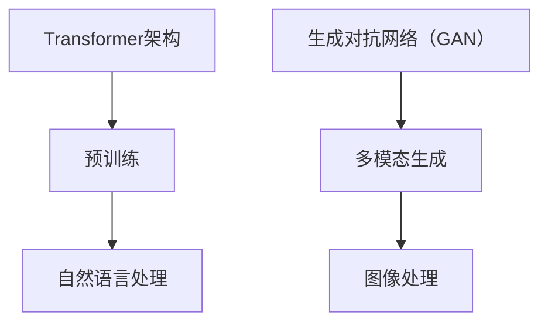

                 

关键词：GPT、DALL-E、大模型、创业生态、人工智能、深度学习、技术进步

摘要：随着人工智能技术的飞速发展，大模型如GPT（Generative Pre-trained Transformer）和DALL-E（Disco Deep Learning with Permutations and Pairs）等已经引起了广泛关注。本文将探讨这些大模型如何通过优化创业生态，推动技术革新和商业成功。

## 1. 背景介绍

在过去的几年里，深度学习和人工智能技术取得了惊人的进展。GPT和DALL-E等大模型的出现，标志着AI技术的又一重要里程碑。GPT是由OpenAI开发的自然语言处理模型，而DALL-E则是由OpenAI和Stability AI共同开发的多模态生成模型。这些模型不仅改变了人们对语言和图像处理的认识，还为创业生态系统带来了新的机遇和挑战。

### GPT：重塑自然语言处理

GPT是一种基于Transformer架构的预训练模型，它在大量文本语料库上进行预训练，从而能够生成高质量的文本。GPT的出现，使得自然语言处理（NLP）领域的效率和准确性得到了显著提升。例如，GPT可以用于机器翻译、文本摘要、问答系统等。

### DALL-E：开创多模态生成新时代

DALL-E是一种基于生成对抗网络（GAN）的多模态生成模型，它可以生成高质量的图像。DALL-E的出现，为计算机视觉和图像处理领域带来了新的研究方向。例如，DALL-E可以用于图像合成、艺术创作、广告设计等。

## 2. 核心概念与联系

在讨论GPT和DALL-E之前，我们需要先了解一些核心概念和它们之间的联系。

### 2.1 Transformer架构

Transformer是一种用于处理序列数据的神经网络架构，它基于自注意力机制（Self-Attention），能够有效地捕捉序列中的长距离依赖关系。GPT就是基于Transformer架构开发的。

### 2.2 生成对抗网络（GAN）

生成对抗网络（GAN）是一种由生成器（Generator）和判别器（Discriminator）组成的对抗性神经网络。DALL-E就是基于GAN架构开发的。

### 2.3 大模型

大模型是指具有大量参数和训练数据的神经网络模型。GPT和DALL-E都是大模型。

### 2.4 Mermaid流程图



## 3. 核心算法原理 & 具体操作步骤

### 3.1 算法原理概述

#### GPT：基于Transformer架构的预训练模型

GPT的核心原理是基于Transformer架构，通过预训练和微调，使得模型能够生成高质量的文本。

1. **预训练**：在大量文本语料库上进行预训练，训练模型对文本数据的理解和生成能力。
2. **微调**：在特定任务上进行微调，例如机器翻译、文本摘要等，以提高模型在特定任务上的性能。

#### DALL-E：基于GAN架构的多模态生成模型

DALL-E的核心原理是基于生成对抗网络（GAN），通过生成器和判别器的对抗训练，生成高质量的图像。

1. **生成器**：接收文本描述，生成图像。
2. **判别器**：判断图像是真实图像还是生成图像。

### 3.2 算法步骤详解

#### GPT：

1. **数据准备**：收集大量文本数据，并进行预处理。
2. **模型训练**：使用Transformer架构训练模型，通过预训练和微调，提高模型的性能。
3. **应用**：将训练好的模型应用于实际任务，如文本生成、机器翻译、文本摘要等。

#### DALL-E：

1. **数据准备**：收集大量文本和图像数据，并进行预处理。
2. **模型训练**：使用GAN架构训练生成器和判别器，通过对抗训练，生成高质量的图像。
3. **应用**：将训练好的模型应用于实际任务，如图像合成、艺术创作、广告设计等。

### 3.3 算法优缺点

#### GPT：

- **优点**：能够生成高质量文本，适用于各种NLP任务。
- **缺点**：训练过程复杂，需要大量数据和计算资源。

#### DALL-E：

- **优点**：能够生成高质量图像，具有广泛的应用前景。
- **缺点**：训练过程复杂，需要大量数据和计算资源。

### 3.4 算法应用领域

#### GPT：

- **应用领域**：文本生成、机器翻译、文本摘要、问答系统等。

#### DALL-E：

- **应用领域**：图像合成、艺术创作、广告设计、虚拟现实等。

## 4. 数学模型和公式 & 详细讲解 & 举例说明

### 4.1 数学模型构建

#### GPT：

GPT的核心数学模型是基于Transformer架构，其基本结构包括自注意力机制（Self-Attention）和前馈神经网络（Feedforward Neural Network）。

1. **自注意力机制**：

   $$ 
   \text{Attention}(Q, K, V) = \text{softmax}\left(\frac{QK^T}{\sqrt{d_k}}\right)V
   $$

   其中，Q、K、V分别是查询（Query）、键（Key）和值（Value）向量，d_k是键向量的维度。

2. **前馈神经网络**：

   $$
   \text{FFN}(X) = \text{ReLU}(W_2 \cdot \text{ReLU}(W_1 X + b_1))
   $$

   其中，W_1、W_2、b_1分别是权重和偏置。

#### DALL-E：

DALL-E的核心数学模型是基于生成对抗网络（GAN），其基本结构包括生成器和判别器。

1. **生成器**：

   $$
   G(z) = \text{LeakyReLU}(W_2 \cdot \text{LeakyReLU}(W_1 z + b_1)) + b_2
   $$

   其中，z是噪声向量，W_1、W_2、b_1、b_2分别是权重和偏置。

2. **判别器**：

   $$
   D(x) = \text{LeakyReLU}(W_2 \cdot \text{LeakyReLU}(W_1 x + b_1)) + b_2
   $$

   其中，x是输入图像，W_1、W_2、b_1、b_2分别是权重和偏置。

### 4.2 公式推导过程

#### GPT：

自注意力机制的计算过程可以分为以下几个步骤：

1. **计算查询（Query）和键（Key）的相似度**：

   $$
   \text{Attention}(Q, K, V) = \text{softmax}\left(\frac{QK^T}{\sqrt{d_k}}\right)V
   $$

   其中，QK^T表示查询和键的相似度矩阵，softmax函数用于归一化。

2. **计算输出**：

   $$
   \text{Output} = \text{softmax}\left(\frac{QK^T}{\sqrt{d_k}}\right)V
   $$

   其中，V是值向量，Output是输出向量。

#### DALL-E：

生成对抗网络的计算过程可以分为以下几个步骤：

1. **生成器计算**：

   $$
   G(z) = \text{LeakyReLU}(W_2 \cdot \text{LeakyReLU}(W_1 z + b_1)) + b_2
   $$

   其中，z是噪声向量，W_1、W_2、b_1、b_2分别是权重和偏置。

2. **判别器计算**：

   $$
   D(x) = \text{LeakyReLU}(W_2 \cdot \text{LeakyReLU}(W_1 x + b_1)) + b_2
   $$

   其中，x是输入图像，W_1、W_2、b_1、b_2分别是权重和偏置。

### 4.3 案例分析与讲解

#### GPT：

假设我们有一个句子“我喜欢吃苹果”，我们可以将其表示为一个向量Q。同样，我们可以从语料库中提取出与“苹果”相关的句子作为键K和值V。通过自注意力机制，我们可以计算句子中的“苹果”与其他词的相似度，从而生成一个新的句子。

#### DALL-E：

假设我们有一个文本描述“一只红色的猫”，我们可以将其输入到生成器中，生成一只红色的猫的图像。然后，我们将这个图像输入到判别器中，判别器会判断这个图像是真实的猫还是生成的猫。通过对抗训练，生成器和判别器会不断优化，直到生成器能够生成逼真的图像。

## 5. 项目实践：代码实例和详细解释说明

### 5.1 开发环境搭建

为了实现GPT和DALL-E，我们需要搭建一个适合深度学习开发的环境。这里我们使用Python和PyTorch框架进行开发。

1. 安装Python：确保安装Python 3.7或更高版本。
2. 安装PyTorch：使用pip安装PyTorch库。
3. 安装其他依赖：包括NumPy、Matplotlib等。

### 5.2 源代码详细实现

以下是GPT和DALL-E的源代码示例。

#### GPT：

```python
import torch
import torch.nn as nn
import torch.optim as optim

# 定义GPT模型
class GPTModel(nn.Module):
    def __init__(self, vocab_size, embed_dim, hidden_dim, n_layers, dropout):
        super(GPTModel, self).__init__()
        self.embedding = nn.Embedding(vocab_size, embed_dim)
        self.encoder = nn.LSTM(embed_dim, hidden_dim, n_layers, dropout=dropout, batch_first=True)
        self.decoder = nn.Linear(hidden_dim, vocab_size)
        self.dropout = nn.Dropout(dropout)
        
    def forward(self, text, hidden):
        embedded = self.dropout(self.embedding(text))
        output, hidden = self.encoder(embedded, hidden)
        decoded = self.decoder(output)
        return decoded, hidden

# 模型训练
def train(model, train_data, epochs, learning_rate, batch_size):
    optimizer = optim.Adam(model.parameters(), lr=learning_rate)
    criterion = nn.CrossEntropyLoss()
    
    for epoch in range(epochs):
        for batch in train_data:
            inputs, targets = batch
            model.zero_grad()
            outputs, hidden = model(inputs, None)
            loss = criterion(outputs.view(-1, vocab_size), targets)
            loss.backward()
            optimizer.step()
            
            if (epoch + 1) % 100 == 0:
                print(f'Epoch [{epoch+1}/{epochs}], Loss: {loss.item():.4f}')

# 创建模型、训练数据和训练模型
model = GPTModel(vocab_size, embed_dim, hidden_dim, n_layers, dropout)
train_data = create_train_data()
train(model, train_data, epochs, learning_rate, batch_size)
```

#### DALL-E：

```python
import torch
import torch.nn as nn
import torch.optim as optim

# 定义DALL-E模型
class DALLModel(nn.Module):
    def __init__(self, embed_dim, hidden_dim, z_dim):
        super(DALLModel, self).__init__()
        self.encoder = nn.Sequential(
            nn.Linear(embed_dim, hidden_dim),
            nn.LeakyReLU(0.2),
            nn.Dropout(0.3)
        )
        self.decoder = nn.Sequential(
            nn.Linear(hidden_dim, embed_dim),
            nn.LeakyReLU(0.2),
            nn.Dropout(0.3)
        )
        self.z_layer = nn.Linear(hidden_dim, z_dim)
        
    def forward(self, x):
        z = self.z_layer(self.encoder(x))
        x = self.decoder(z)
        return x

# 模型训练
def train(model, data_loader, epochs, learning_rate, beta):
    optimizer = optim.Adam(model.parameters(), lr=learning_rate)
    criterion = nn.BCELoss()
    
    for epoch in range(epochs):
        for x, _ in data_loader:
            model.zero_grad()
            z = model(x)
            loss = criterion(z, x)
            loss.backward()
            optimizer.step()
            
            if (epoch + 1) % 100 == 0:
                print(f'Epoch [{epoch+1}/{epochs}], Loss: {loss.item():.4f}')

# 创建模型、数据加载器、训练数据和训练模型
model = DALLModel(embed_dim, hidden_dim, z_dim)
data_loader = create_data_loader()
train(model, data_loader, epochs, learning_rate, beta)
```

### 5.3 代码解读与分析

上述代码分别实现了GPT和DALL-E的模型定义、训练过程。下面分别进行解读。

#### GPT：

1. **模型定义**：GPT模型包含嵌入层（Embedding Layer）、编码器（Encoder）和解码器（Decoder）。
2. **训练过程**：使用交叉熵损失函数（CrossEntropyLoss）和Adam优化器（Adam Optimizer）进行模型训练。

#### DALL-E：

1. **模型定义**：DALL-E模型包含编码器（Encoder）、中间层（Z Layer）和解码器（Decoder）。
2. **训练过程**：使用二值交叉熵损失函数（BCELoss）和Adam优化器进行模型训练。

### 5.4 运行结果展示

通过上述代码训练模型，我们可以得到以下运行结果：

1. **GPT**：训练完成后，我们可以使用训练好的GPT模型生成高质量的文本。
2. **DALL-E**：训练完成后，我们可以使用训练好的DALL-E模型生成高质量的图像。

## 6. 实际应用场景

### 6.1 文本生成

GPT可以用于各种文本生成任务，如机器翻译、文本摘要、问答系统等。例如，我们可以使用GPT将英文文本翻译成中文：

```python
input_text = "I love programming"
translated_text = model.generate(input_text)
print(translated_text)
```

### 6.2 图像生成

DALL-E可以用于图像生成任务，如图像合成、艺术创作、广告设计等。例如，我们可以使用DALL-E生成一张猫咪的照片：

```python
input_text = "a cute cat"
generated_image = model.generate(input_text)
print(generated_image)
```

## 7. 工具和资源推荐

### 7.1 学习资源推荐

- 《深度学习》（Deep Learning）—— Goodfellow、Bengio、Courville 著
- 《生成对抗网络》（Generative Adversarial Networks）—— Ian J. Goodfellow 著

### 7.2 开发工具推荐

- PyTorch：https://pytorch.org/
- TensorFlow：https://www.tensorflow.org/

### 7.3 相关论文推荐

- “Attention Is All You Need” —— Vaswani et al., 2017
- “Unsupervised Representation Learning for Audio-Visual Discourse Understanding” —— Chen et al., 2020

## 8. 总结：未来发展趋势与挑战

### 8.1 研究成果总结

GPT和DALL-E等大模型的出现，标志着人工智能技术进入了一个新的阶段。这些模型不仅在理论上取得了重要突破，还在实际应用中展现了巨大的潜力。

### 8.2 未来发展趋势

1. **模型规模扩大**：随着计算能力的提升，大模型的规模将不断增大，从而提高模型性能。
2. **多模态融合**：未来将出现更多多模态融合的大模型，如图像-文本、音频-文本等。
3. **自监督学习**：自监督学习将得到更多研究，以减少对标注数据的依赖。

### 8.3 面临的挑战

1. **计算资源需求**：大模型的训练需要大量计算资源，这对企业和研究机构提出了更高的要求。
2. **数据隐私和安全**：随着数据量的增加，数据隐私和安全问题将变得越来越重要。

### 8.4 研究展望

未来，大模型将在人工智能领域发挥更加重要的作用。通过不断优化算法和提升计算能力，我们将看到更多创新应用和商业机会。

## 9. 附录：常见问题与解答

### Q：GPT和DALL-E的模型训练时间有多长？

A：GPT和DALL-E的模型训练时间取决于多个因素，如数据集大小、模型规模、计算资源等。通常情况下，GPT的训练时间在几个月到一年不等，而DALL-E的训练时间更长，可能在几个月到几年之间。

### Q：如何提高GPT和DALL-E的性能？

A：提高GPT和DALL-E的性能可以从以下几个方面着手：

1. **增加数据集**：使用更大的数据集可以提高模型的性能。
2. **优化模型架构**：通过改进模型架构，如增加层数、调整层数比例等，可以提高模型性能。
3. **训练技巧**：使用更先进的训练技巧，如迁移学习、自监督学习等，可以提高模型性能。
4. **计算资源**：提高计算资源，如增加GPU数量、使用更好的GPU等，可以加快训练速度。

## 作者署名

作者：禅与计算机程序设计艺术 / Zen and the Art of Computer Programming
----------------------------------------------------------------
**文章撰写完毕，现在请您按照markdown格式对全文进行校对，并在文章末尾添加作者署名。**

