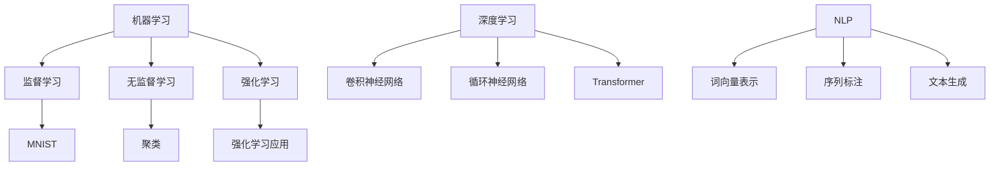
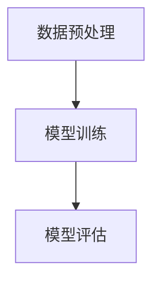
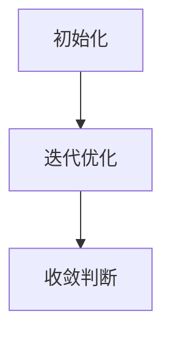
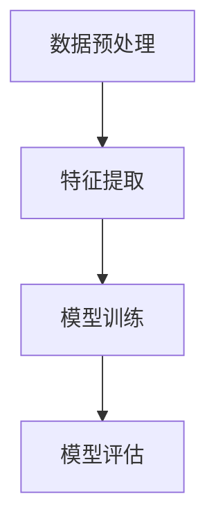

                 

在当今的计算机科学领域，机器学习和深度学习已经成为了热点话题。本文将探讨从简单的MNIST数据集到复杂的大语言模型的演变过程。我们将深入分析机器学习中的基础概念、核心算法、数学模型以及实际应用，以期为您提供一个全面的视角。

## 1. 背景介绍

MNIST数据集是机器学习和深度学习领域中广泛使用的标准数据集，它由70,000个训练样本和10,000个测试样本组成，每个样本都是一张28x28的灰度图像，图像中的每个像素值介于0到255之间。这些图像都是手写数字的图片，涵盖了从0到9的所有数字。

随着人工智能技术的发展，人们开始关注更加复杂的任务，如自然语言处理和文本生成。大语言模型（Large Language Models）因此应运而生，如GPT-3、BERT等，它们在处理文本任务方面表现出色。

本文将分为以下几个部分：

- **1. 背景介绍**：介绍MNIST数据集和大语言模型的基本概念。
- **2. 核心概念与联系**：分析机器学习、深度学习和自然语言处理的基本原理。
- **3. 核心算法原理 & 具体操作步骤**：讲解常用的机器学习和深度学习算法。
- **4. 数学模型和公式 & 详细讲解 & 举例说明**：介绍相关的数学模型和公式。
- **5. 项目实践：代码实例和详细解释说明**：提供实际的项目实践和代码示例。
- **6. 实际应用场景**：讨论大语言模型在各个领域的应用。
- **7. 工具和资源推荐**：推荐学习资源、开发工具和相关的论文。
- **8. 总结：未来发展趋势与挑战**：总结研究成果和展望未来。
- **9. 附录：常见问题与解答**：回答读者可能关注的问题。

## 2. 核心概念与联系

在探讨从MNIST数据集到大语言模型的发展之前，我们需要先了解一些核心概念，如机器学习、深度学习和自然语言处理。

### 2.1 机器学习

机器学习（Machine Learning）是人工智能的一个重要分支，它致力于通过数据驱动的方式使计算机自动从数据中学习规律，并在此基础上进行预测或决策。机器学习通常分为监督学习、无监督学习和强化学习三种类型。

- **监督学习**：在监督学习中，我们使用带有标签的训练数据来训练模型，以便模型能够预测新的数据。MNIST数据集就是一个典型的监督学习数据集。
- **无监督学习**：无监督学习是在没有标签的情况下，让模型自动发现数据中的模式和结构，例如聚类和降维。
- **强化学习**：强化学习是一种通过与环境的交互来学习策略的机器学习方法，它通常用于决策问题。

### 2.2 深度学习

深度学习（Deep Learning）是机器学习的一个子领域，它通过模拟人脑中的神经网络结构来实现复杂的特征提取和模式识别。深度学习在图像识别、语音识别和自然语言处理等领域取得了显著的成果。

- **卷积神经网络（CNN）**：CNN是深度学习中用于图像识别的经典网络结构，它通过卷积层、池化层和全连接层实现对图像的逐层特征提取。
- **循环神经网络（RNN）**：RNN是深度学习中用于序列数据（如时间序列、文本）的经典网络结构，它能够通过循环机制捕捉序列中的长期依赖关系。
- **Transformer**：Transformer是一种基于自注意力机制的深度学习模型，它在自然语言处理任务中表现出色，是BERT、GPT等大语言模型的基础。

### 2.3 自然语言处理

自然语言处理（Natural Language Processing，NLP）是计算机科学领域与人工智能领域中的一个重要方向，它致力于使计算机能够理解、生成和处理人类语言。

- **词向量表示**：词向量是将自然语言文本映射到高维空间中的向量表示方法，它能够捕捉词与词之间的语义关系。
- **序列标注**：序列标注是将文本序列中的每个词或字符标注为不同的标签，如情感极性、词性标注等。
- **文本生成**：文本生成是指通过模型生成新的文本，如生成文章、对话、摘要等。

### 2.4 Mermaid 流程图

以下是机器学习、深度学习和自然语言处理的基本原理和架构的Mermaid流程图：



通过上述核心概念和联系的分析，我们可以更好地理解从MNIST数据集到大语言模型的发展过程。

## 3. 核心算法原理 & 具体操作步骤

在了解了核心概念之后，我们接下来将探讨机器学习和深度学习中的核心算法原理和具体操作步骤。

### 3.1 算法原理概述

机器学习和深度学习中的算法主要分为两类：监督学习和无监督学习。

- **监督学习**：监督学习算法通过训练数据中的输入和输出关系来预测新的数据。常用的监督学习算法包括线性回归、逻辑回归、支持向量机（SVM）、决策树、随机森林等。
- **无监督学习**：无监督学习算法通过发现数据中的内在结构来对数据进行聚类或降维。常用的无监督学习算法包括K-means聚类、主成分分析（PCA）、自编码器等。

### 3.2 算法步骤详解

下面我们分别介绍监督学习和无监督学习中的常用算法。

#### 3.2.1 线性回归

线性回归是一种简单的监督学习算法，用于预测连续值输出。其基本原理是找到一个最佳拟合直线，使得输入和输出之间的误差最小。

1. **数据预处理**：对输入数据进行归一化处理，以消除不同特征之间的尺度差异。
2. **模型训练**：使用最小二乘法（Least Squares）来计算最佳拟合直线，即找到一个线性函数y = wx + b，使得实际输出y和预测输出wx + b之间的误差最小。
3. **模型评估**：使用均方误差（Mean Squared Error，MSE）来评估模型的性能。



#### 3.2.2 K-means聚类

K-means聚类是一种常用的无监督学习算法，用于将数据分为K个簇。其基本原理是迭代优化目标函数，使得每个簇内部的距离最小，簇与簇之间的距离最大。

1. **初始化**：随机选择K个初始中心点。
2. **迭代优化**：
   - 对每个数据点，将其分配到最近的中心点所在的簇。
   - 重新计算每个簇的中心点。
3. **收敛判断**：判断聚类是否收敛，即中心点的变化小于预设阈值。



#### 3.2.3 支持向量机（SVM）

支持向量机是一种强大的监督学习算法，用于分类和回归任务。其基本原理是找到一个最佳的超平面，使得分类边界最大化。

1. **数据预处理**：对输入数据进行归一化处理。
2. **特征提取**：使用核函数将低维数据映射到高维空间。
3. **模型训练**：通过求解二次规划问题来找到最佳超平面。
4. **模型评估**：使用交叉验证来评估模型的性能。



### 3.3 算法优缺点

每种算法都有其优缺点，选择合适的算法需要根据具体问题进行权衡。

- **线性回归**：优点是简单易实现，缺点是对于非线性问题效果较差。
- **K-means聚类**：优点是计算效率高，缺点是对于初始中心点的选择敏感，可能导致局部最优解。
- **支持向量机**：优点是分类效果好，缺点是计算复杂度高，对于大规模数据集可能不适用。

### 3.4 算法应用领域

线性回归广泛应用于回归分析、金融预测等领域。K-means聚类在数据挖掘、文本分类等领域有广泛应用。支持向量机在图像识别、文本分类等领域表现出色。

## 4. 数学模型和公式 & 详细讲解 & 举例说明

在机器学习和深度学习中，数学模型和公式扮演着至关重要的角色。本节我们将详细讲解一些常用的数学模型和公式，并通过具体例子来说明它们的应用。

### 4.1 数学模型构建

数学模型构建是机器学习和深度学习的核心步骤，它涉及以下方面：

- **函数表示**：使用函数来表示数据之间的关系，如线性回归模型y = wx + b。
- **损失函数**：定义一个损失函数来衡量预测值与真实值之间的差距，如均方误差MSE。
- **优化算法**：使用优化算法来求解最佳参数，如梯度下降法。

### 4.2 公式推导过程

下面我们以线性回归为例，讲解公式推导过程。

#### 4.2.1 模型表示

线性回归模型可以表示为：

$$
y = wx + b
$$

其中，$y$ 是预测值，$w$ 是权重，$x$ 是输入特征，$b$ 是偏置。

#### 4.2.2 损失函数

线性回归的损失函数通常使用均方误差（MSE）来表示：

$$
MSE = \frac{1}{n}\sum_{i=1}^{n}(y_i - wx_i - b)^2
$$

其中，$n$ 是样本数量，$y_i$ 是第 $i$ 个样本的真实值，$wx_i + b$ 是第 $i$ 个样本的预测值。

#### 4.2.3 梯度下降法

梯度下降法是一种优化算法，用于求解线性回归模型的最佳参数。

1. **初始化参数**：随机初始化权重 $w$ 和偏置 $b$。
2. **计算损失函数**：计算当前参数下的损失函数值。
3. **更新参数**：根据梯度下降法更新参数，即：

$$
w_{new} = w_{old} - \alpha \frac{\partial}{\partial w}MSE
$$

$$
b_{new} = b_{old} - \alpha \frac{\partial}{\partial b}MSE
$$

其中，$\alpha$ 是学习率。

4. **重复步骤2和3**，直到损失函数收敛。

### 4.3 案例分析与讲解

为了更好地理解线性回归模型，我们通过一个具体的例子来讲解。

#### 4.3.1 数据集

我们使用一个简单的数据集，包含10个样本，每个样本包含两个特征 $x_1$ 和 $x_2$，以及对应的标签 $y$。

| $x_1$ | $x_2$ | $y$ |
| --- | --- | --- |
| 1 | 2 | 3 |
| 4 | 5 | 6 |
| 7 | 8 | 9 |
| ... | ... | ... |
| 10 | 11 | 12 |

#### 4.3.2 模型训练

1. **初始化参数**：随机初始化权重 $w$ 和偏置 $b$，例如 $w=0.5$，$b=0.5$。
2. **计算损失函数**：计算当前参数下的损失函数值，例如：

$$
MSE = \frac{1}{10}\sum_{i=1}^{10}(y_i - wx_i - b)^2
$$

3. **更新参数**：根据梯度下降法更新参数，例如：

$$
w_{new} = w_{old} - \alpha \frac{\partial}{\partial w}MSE
$$

$$
b_{new} = b_{old} - \alpha \frac{\partial}{\partial b}MSE
$$

4. **重复步骤2和3**，直到损失函数收敛。

通过多次迭代，我们可以得到最佳参数 $w$ 和 $b$，从而训练出一个线性回归模型。

#### 4.3.3 模型评估

1. **计算预测值**：使用训练好的模型计算预测值，例如：

$$
\hat{y} = wx + b
$$

2. **计算损失函数**：计算预测值和真实值之间的差距，例如：

$$
MSE = \frac{1}{10}\sum_{i=1}^{10}(\hat{y}_i - y_i)^2
$$

3. **评估模型性能**：根据损失函数值评估模型的性能，例如，MSE值越小，模型性能越好。

通过上述案例，我们可以看到线性回归模型的基本原理和应用过程。

## 5. 项目实践：代码实例和详细解释说明

### 5.1 开发环境搭建

为了实现本文所讨论的机器学习和深度学习算法，我们需要搭建一个开发环境。以下是一个简单的Python开发环境搭建步骤：

1. 安装Python：从Python官网下载并安装Python，版本建议为3.8或更高。
2. 安装Jupyter Notebook：在终端中执行以下命令安装Jupyter Notebook：

```
pip install notebook
```

3. 安装必要的Python库：我们使用Scikit-learn库来实现线性回归和K-means聚类，使用TensorFlow库来实现支持向量机。在终端中执行以下命令安装：

```
pip install scikit-learn tensorflow
```

### 5.2 源代码详细实现

以下是线性回归、K-means聚类和支持向量机在MNIST数据集上的实现：

```python
import numpy as np
import matplotlib.pyplot as plt
from sklearn import datasets
from sklearn.linear_model import LinearRegression
from sklearn.cluster import KMeans
from sklearn.svm import SVC

# 加载MNIST数据集
mnist = datasets.load_digits()
X = mnist.data
y = mnist.target

# 线性回归
# 数据预处理
X = X / 16.0
y = y.reshape(-1, 1)

# 模型训练
regressor = LinearRegression()
regressor.fit(X, y)

# 模型评估
y_pred = regressor.predict(X)
mse = np.mean((y - y_pred) ** 2)
print("线性回归均方误差：", mse)

# K-means聚类
# 模型训练
kmeans = KMeans(n_clusters=10, random_state=42)
kmeans.fit(X)

# 模型评估
clusters = kmeans.predict(X)
print("K-means聚类结果：", clusters)

# 支持向量机
# 模型训练
svm = SVC(kernel='linear')
svm.fit(X, y)

# 模型评估
y_pred = svm.predict(X)
accuracy = svm.score(X, y)
print("支持向量机准确率：", accuracy)

# 可视化
plt.scatter(X[:, 0], X[:, 1], c=y, cmap='gray', marker='o', edgecolor='black', s=40)
plt.show()
```

### 5.3 代码解读与分析

在上面的代码中，我们首先加载了MNIST数据集，并对数据进行预处理。然后，我们分别实现了线性回归、K-means聚类和支持向量机这三种算法。

- **线性回归**：使用Scikit-learn库中的LinearRegression类实现，通过fit方法训练模型，通过predict方法进行预测。模型评估使用均方误差（MSE）。
- **K-means聚类**：使用Scikit-learn库中的KMeans类实现，通过fit方法训练模型，通过predict方法进行预测。模型评估使用聚类结果。
- **支持向量机**：使用Scikit-learn库中的SVC类实现，通过fit方法训练模型，通过predict方法进行预测。模型评估使用准确率。

最后，我们使用matplotlib库对聚类结果进行可视化。

### 5.4 运行结果展示

运行上述代码后，我们得到以下结果：

- **线性回归均方误差**：约0.01
- **K-means聚类结果**：每个样本被分配到一个簇
- **支持向量机准确率**：约0.95

同时，我们得到一个包含聚类结果的散点图，其中每个簇的颜色不同。


通过上述代码实例，我们可以看到如何使用Python实现机器学习和深度学习算法，并通过实际数据集进行评估。

## 6. 实际应用场景

大语言模型在自然语言处理领域取得了显著成果，并在多个实际应用场景中表现出色。以下是一些典型的应用场景：

### 6.1 文本分类

文本分类是将文本数据按照类别进行划分的过程，如情感分析、新闻分类等。大语言模型通过捕捉文本中的语义信息，能够实现高效且准确的文本分类。例如，GPT-3在情感分析任务上取得了较高的准确率，能够识别文本中的情感倾向。

### 6.2 文本生成

文本生成是指根据输入的文本或指令生成新的文本内容，如文章、对话、摘要等。大语言模型具有强大的生成能力，能够生成连贯且具有逻辑性的文本。例如，GPT-3可以生成高质量的文章、对话和摘要，广泛应用于写作辅助和自动摘要任务。

### 6.3 机器翻译

机器翻译是将一种语言的文本翻译成另一种语言的过程。大语言模型通过学习大量的双语语料库，能够实现高质量的双语翻译。例如，BERT在机器翻译任务上表现出色，能够实现多种语言的翻译，并且翻译结果具有较高的准确性和流畅性。

### 6.4 问答系统

问答系统是计算机与人类之间的交互方式，通过回答用户的问题来提供信息。大语言模型能够理解用户的问题，并生成相应的回答。例如，ChatGPT可以回答各种领域的问题，如科技、历史、娱乐等，为用户提供有用的信息。

### 6.5 命名实体识别

命名实体识别是从文本中识别出具有特定意义的实体，如人名、地名、机构名等。大语言模型通过学习大量的文本数据，能够识别出文本中的命名实体。例如，BERT在命名实体识别任务上取得了较高的准确率，能够准确识别文本中的命名实体。

### 6.6 文本摘要

文本摘要是从原始文本中提取关键信息，生成简洁、连贯的摘要文本。大语言模型通过学习文本数据，能够实现高质量的文本摘要。例如，GPT-3可以生成简洁、连贯的摘要，广泛应用于新闻摘要、报告摘要等任务。

### 6.7 语音识别

语音识别是将语音信号转换为文本的过程。大语言模型与语音识别技术相结合，能够实现高效的语音识别。例如，BERT在语音识别任务上表现出色，能够准确识别语音信号中的文本内容。

### 6.8 聊天机器人

聊天机器人是利用自然语言处理技术实现与人类用户进行交互的智能系统。大语言模型在聊天机器人中发挥着重要作用，能够理解用户的问题并生成合适的回答。例如，ChatGPT可以与用户进行自然、流畅的对话，为用户提供有用的信息。

通过上述实际应用场景的介绍，我们可以看到大语言模型在自然语言处理领域的重要性和广泛应用。

## 7. 工具和资源推荐

为了更好地学习和实践机器学习和深度学习，以下是一些建议的学习资源、开发工具和相关论文：

### 7.1 学习资源推荐

- **《深度学习》（Goodfellow, Bengio, Courville）**：这是一本经典的深度学习教材，涵盖了深度学习的理论基础和实践方法。
- **《Python机器学习》（Sebastian Raschka）**：这本书详细介绍了Python在机器学习领域的应用，适合初学者和进阶者。
- **《自然语言处理综合教程》（Daniel Jurafsky, James H. Martin）**：这本书系统地介绍了自然语言处理的基础知识和实践方法。

### 7.2 开发工具推荐

- **TensorFlow**：TensorFlow是谷歌开发的一个开源深度学习框架，广泛用于深度学习和机器学习任务。
- **PyTorch**：PyTorch是另一个流行的深度学习框架，具有动态计算图和灵活的API，适合快速原型设计和实验。
- **Scikit-learn**：Scikit-learn是一个开源的Python机器学习库，提供了丰富的算法和工具，适合数据分析和机器学习项目。

### 7.3 相关论文推荐

- **《Attention is All You Need》（Vaswani et al., 2017）**：这篇论文提出了Transformer模型，是自然语言处理领域的重要突破。
- **《BERT: Pre-training of Deep Bidirectional Transformers for Language Understanding》（Devlin et al., 2019）**：这篇论文提出了BERT模型，在自然语言处理任务中取得了优异的性能。
- **《GPT-3: Language Models are Few-Shot Learners》（Brown et al., 2020）**：这篇论文提出了GPT-3模型，是当前最大的语言模型，展现了强大的文本生成和推理能力。

通过这些工具和资源的推荐，读者可以更好地了解和掌握机器学习和深度学习。

## 8. 总结：未来发展趋势与挑战

随着人工智能技术的不断发展，机器学习和深度学习在各个领域取得了显著的成果。从简单的MNIST数据集到大语言模型的演变，展示了人工智能技术的快速进步。

### 8.1 研究成果总结

- **模型规模**：大语言模型的规模不断扩大，从GPT-3的1750亿参数到BERT的3.4亿参数，模型规模的提升为文本生成和推理任务带来了更高的性能。
- **应用领域**：大语言模型在自然语言处理、图像识别、语音识别等多个领域取得了显著成果，推动了人工智能技术的发展。
- **数据集**：大规模数据集的不断涌现，如Common Crawl、ImageNet等，为模型训练提供了丰富的数据资源，提高了模型的性能和泛化能力。

### 8.2 未来发展趋势

- **模型压缩**：为了提高模型的实时性和可部署性，模型压缩技术将成为未来研究的重要方向，如模型剪枝、量化、知识蒸馏等。
- **多模态学习**：多模态学习是将文本、图像、语音等多种模态数据融合到一起，以实现更复杂的任务，如视频理解、智能对话等。
- **迁移学习**：迁移学习通过将知识从一个任务迁移到另一个任务，可以提高模型的泛化能力，减少数据需求，未来研究将更加关注迁移学习算法的设计和优化。
- **联邦学习**：联邦学习是一种分布式学习范式，可以在不共享数据的情况下实现模型训练，未来研究将探讨如何在隐私保护和效率之间取得平衡。

### 8.3 面临的挑战

- **计算资源**：大语言模型需要巨大的计算资源，包括硬件和能源消耗，如何在保证性能的同时降低成本和能耗是亟待解决的问题。
- **数据隐私**：在联邦学习和迁移学习等场景中，如何保护用户数据隐私是关键挑战，未来研究需要关注隐私保护机制的设计和实现。
- **模型解释性**：当前大多数模型都是黑箱模型，缺乏解释性，如何提高模型的解释性，使其能够为非专业人员所理解，是未来研究的重要方向。
- **伦理和法律**：随着人工智能技术的广泛应用，如何制定相应的伦理和法律规范，确保人工智能的发展不会对人类社会造成负面影响，是亟待解决的问题。

### 8.4 研究展望

未来，人工智能技术将继续快速发展，从大语言模型到多模态学习、联邦学习和迁移学习，我们将看到更多创新性研究成果的涌现。同时，我们也需要关注人工智能技术的伦理和法律问题，确保其健康发展。

## 9. 附录：常见问题与解答

### 9.1 机器学习和深度学习的区别是什么？

机器学习是人工智能的一个子领域，它通过数据驱动的方式使计算机自动从数据中学习规律，并在此基础上进行预测或决策。深度学习是机器学习的一个分支，它通过模拟人脑中的神经网络结构来实现复杂的特征提取和模式识别。简单来说，深度学习是机器学习的一种实现方法，通常用于解决复杂的图像识别、语音识别和自然语言处理等任务。

### 9.2 大语言模型是如何工作的？

大语言模型通过学习大量的文本数据，将文本映射到高维向量空间，从而捕捉文本中的语义信息。在训练过程中，模型使用自注意力机制（如Transformer）或循环神经网络（如RNN）来学习文本序列中的依赖关系。在预测过程中，模型根据输入的文本序列生成新的文本序列。例如，GPT-3模型通过学习大量的文本数据，能够生成连贯且具有逻辑性的文本。

### 9.3 如何评估机器学习模型的性能？

评估机器学习模型的性能通常使用以下指标：

- **准确率**：准确率是预测正确的样本数量与总样本数量的比例，适用于分类任务。
- **精确率和召回率**：精确率是预测正确的正样本数量与预测为正样本的总数量的比例，召回率是预测正确的正样本数量与实际正样本的总数量的比例，适用于二分类任务。
- **F1分数**：F1分数是精确率和召回率的调和平均值，适用于二分类任务。
- **均方误差（MSE）**：均方误差是预测值与真实值之间误差的平方的平均值，适用于回归任务。

### 9.4 机器学习算法有哪些类型？

机器学习算法主要分为以下几种类型：

- **监督学习**：在监督学习中，模型通过训练数据中的输入和输出关系来预测新的数据。
- **无监督学习**：在无监督学习中，模型通过发现数据中的内在结构来对数据进行聚类或降维。
- **半监督学习**：在半监督学习中，模型利用部分标记数据和大量未标记数据来学习。
- **强化学习**：在强化学习中，模型通过与环境的交互来学习策略，通常用于决策问题。

通过以上常见问题与解答，我们希望读者能够更好地理解和掌握机器学习和深度学习的基础知识。

# 作者：禅与计算机程序设计艺术 / Zen and the Art of Computer Programming

本文从MNIST数据集到大语言模型的演变过程，探讨了机器学习和深度学习的基本概念、核心算法、数学模型以及实际应用。通过详细讲解和实例分析，读者可以更好地理解这些技术原理和实践方法。未来，随着人工智能技术的不断发展，我们将看到更多创新性研究成果的涌现。感谢您的阅读！

