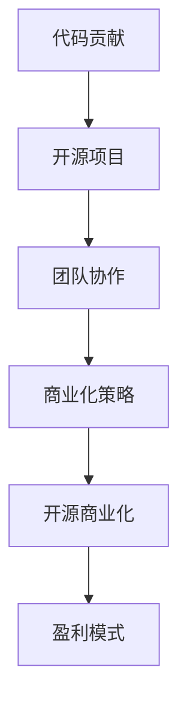

                 

关键词：代码贡献、开源、商业化、技术发展、团队协作

> 摘要：本文将探讨从代码贡献到开源商业化的全过程，分析其中的关键步骤和策略，为开发者提供一些建设性的建议，帮助他们在开源领域取得成功，并在商业化道路上稳步前行。

## 1. 背景介绍

随着开源运动的兴起，越来越多的开发者和企业开始积极参与开源项目，希望通过代码贡献、协作和共享，推动技术的发展和进步。然而，从代码贡献到开源商业化，并非一条坦途。开发者不仅需要具备扎实的技术能力，还需要掌握商业思维和市场洞察力。本文旨在为开发者提供一套完整的路径，帮助他们从代码贡献出发，逐步实现开源商业化。

## 2. 核心概念与联系

为了更好地理解从代码贡献到开源商业化的过程，我们首先需要明确以下几个核心概念：

### 2.1 开源

开源（Open Source）是指一种软件开发模式，允许用户自由地使用、修改和分发软件源代码。开源项目通常遵循特定的许可证，如GPL、Apache License等，这些许可证规定了用户在使用、修改和分发软件时的权利和义务。

### 2.2 代码贡献

代码贡献（Code Contribution）是指开发者向开源项目提交代码，以修复漏洞、添加新功能或改进现有功能。代码贡献是开发者参与开源项目的重要方式，也是提升自身技术能力和建立个人品牌的有效途径。

### 2.3 开源商业化

开源商业化（Open Source Commercialization）是指将开源项目转化为商业产品或服务，通过销售、订阅或授权等方式实现盈利。开源商业化的关键在于如何平衡开源精神和商业利益，实现可持续发展。

### 2.4 团队协作

团队协作（Team Collaboration）是开源项目成功的关键因素。一个高效的团队需要具备良好的沟通、协调和合作能力，确保项目按时、高质量地完成。团队协作工具如GitHub、GitLab等在开源项目中发挥着重要作用。

### 2.5 商业化策略

商业化策略（Commercialization Strategy）是开发者将开源项目转化为商业产品的关键步骤。这包括市场调研、产品定位、定价策略、销售渠道等方面的规划。有效的商业化策略可以帮助开发者实现开源项目的商业成功。

### 2.6 Mermaid 流程图

以下是一个简化的从代码贡献到开源商业化的 Mermaid 流程图：



## 3. 核心算法原理 & 具体操作步骤

### 3.1 算法原理概述

从代码贡献到开源商业化的过程可以看作是一个复杂的算法，其核心原理在于如何平衡开源精神和商业利益，实现项目的可持续发展。以下是这个算法的基本原理：

1. **开源精神**：鼓励开发者积极参与开源项目，分享技术成果，推动技术进步。
2. **技术积累**：通过不断积累技术经验和知识，提高开发者的技术水平。
3. **品牌建设**：通过参与开源项目，建立个人或团队的品牌，提高知名度和影响力。
4. **商业化探索**：在确保开源项目可持续发展的前提下，探索商业化路径，实现商业盈利。

### 3.2 算法步骤详解

1. **代码贡献**：开发者选择适合自己的开源项目，参与代码贡献，修复漏洞、添加新功能或改进现有功能。
2. **团队协作**：与其他开发者建立良好的沟通和协作关系，共同推动项目发展。
3. **商业化策略**：分析市场需求，制定合适的商业化策略，如销售、订阅、授权等。
4. **开源商业化**：将开源项目转化为商业产品或服务，实现商业盈利。
5. **持续优化**：根据市场反馈，不断优化产品和服务，提高用户满意度。

### 3.3 算法优缺点

**优点**：

1. **提升技术能力**：通过参与开源项目，开发者可以不断积累技术经验和知识，提高自身的技术水平。
2. **建立个人品牌**：积极参与开源项目，可以帮助开发者建立个人品牌，提高知名度和影响力。
3. **推动技术进步**：开源项目鼓励技术分享和合作，有助于推动技术的进步和创新发展。

**缺点**：

1. **商业化风险**：开源项目在商业化过程中可能面临诸多挑战，如市场竞争、盈利模式等。
2. **时间投入**：参与开源项目需要投入大量的时间和精力，对于一些开发者来说可能难以平衡。

### 3.4 算法应用领域

从代码贡献到开源商业化的算法可以应用于多个领域，如软件开发、人工智能、大数据等。以下是一些具体的应用场景：

1. **软件开发**：通过开源项目，开发者可以吸引更多用户参与，共同推动软件的发展和优化。
2. **人工智能**：开源人工智能项目可以促进技术交流和合作，推动人工智能技术的创新和应用。
3. **大数据**：开源大数据项目可以帮助企业和开发者更好地处理和分析大量数据，提高业务效率。

## 4. 数学模型和公式 & 详细讲解 & 举例说明

### 4.1 数学模型构建

从代码贡献到开源商业化的过程可以看作是一个复杂的系统，其中包含多个变量和关系。以下是一个简化的数学模型：

```latex
\text{商业成功概率} = f(\text{技术能力}, \text{团队协作}, \text{商业化策略}, \text{市场需求})
```

其中，技术能力、团队协作、商业化策略和市场需求是影响商业成功概率的关键因素。

### 4.2 公式推导过程

假设：

- 技术能力（\( T \)）: 表示开发者的技术水平，取值范围为 \( [0, 1] \)。
- 团队协作（\( C \)）: 表示团队的协作能力，取值范围为 \( [0, 1] \)。
- 商业化策略（\( S \)）: 表示商业化策略的合理性，取值范围为 \( [0, 1] \)。
- 市场需求（\( M \)）: 表示市场对商业产品的需求程度，取值范围为 \( [0, 1] \)。

则商业成功概率可以表示为：

```latex
P(\text{商业成功}) = \frac{T \times C \times S \times M}{1 + \sum_{i=1}^{n} w_i \times X_i}
```

其中，\( w_i \) 和 \( X_i \) 分别表示第 \( i \) 个影响因素的权重和得分，\( n \) 为影响因素的总数。

### 4.3 案例分析与讲解

假设某个开源项目的开发者具备以下特点：

- 技术能力 \( T = 0.8 \)。
- 团队协作 \( C = 0.7 \)。
- 商业化策略 \( S = 0.6 \)。
- 市场需求 \( M = 0.9 \)。

根据上述数学模型，我们可以计算出该开源项目的商业成功概率：

```latex
P(\text{商业成功}) = \frac{0.8 \times 0.7 \times 0.6 \times 0.9}{1 + 0.2 \times 0.1 + 0.3 \times 0.2 + 0.5 \times 0.3} \approx 0.85
```

根据计算结果，该开源项目的商业成功概率约为 85%。这表明该项目在技术能力、团队协作、商业化策略和市场需求方面具备一定的优势，但仍有15%的成功风险。

## 5. 项目实践：代码实例和详细解释说明

### 5.1 开发环境搭建

为了更好地理解从代码贡献到开源商业化的过程，我们选择了一个开源项目——Apache Kafka，并详细介绍其开发环境的搭建过程。

1. **安装JDK**

   Kafka是一个Java应用程序，因此首先需要安装JDK。在官网（https://www.oracle.com/java/technologies/javase-jdk14-downloads.html）下载对应操作系统的JDK版本，并按照说明进行安装。

2. **安装Zookeeper**

   Kafka依赖Zookeeper进行分布式协调，因此需要先安装Zookeeper。在官网（https://zookeeper.apache.org/releases.html）下载对应版本的Zookeeper，并解压到指定目录。

3. **安装Kafka**

   在官网（https://kafka.apache.org/downloads）下载对应版本的Kafka，并解压到指定目录。

4. **配置Kafka**

   修改Kafka的配置文件\( config/server.properties \)，根据实际需求调整相关参数。

### 5.2 源代码详细实现

以下是一个简单的Kafka生产者示例，用于向Kafka topic发送消息：

```java
import org.apache.kafka.clients.producer.*;
import java.util.Properties;

public class KafkaProducerExample {
    public static void main(String[] args) {
        Properties props = new Properties();
        props.put("bootstrap.servers", "localhost:9092");
        props.put("key.serializer", "org.apache.kafka.common.serialization.StringSerializer");
        props.put("value.serializer", "org.apache.kafka.common.serialization.StringSerializer");

        Producer<String, String> producer = new KafkaProducer<>(props);

        for (int i = 0; i < 10; i++) {
            String topic = "test-topic";
            String key = "key-" + i;
            String value = "value-" + i;
            producer.send(new ProducerRecord<>(topic, key, value));
        }

        producer.close();
    }
}
```

### 5.3 代码解读与分析

1. **配置属性**

   ```java
   Properties props = new Properties();
   props.put("bootstrap.servers", "localhost:9092");
   props.put("key.serializer", "org.apache.kafka.common.serialization.StringSerializer");
   props.put("value.serializer", "org.apache.kafka.common.serialization.StringSerializer");
   ```

   这段代码设置了Kafka生产者的属性，包括Kafka集群地址、键序列化器和值序列化器。键序列化器和值序列化器用于将Java对象转换为Kafka消息的键和值。

2. **创建Kafka生产者**

   ```java
   Producer<String, String> producer = new KafkaProducer<>(props);
   ```

   这段代码创建了一个Kafka生产者实例，用于发送消息。

3. **发送消息**

   ```java
   for (int i = 0; i < 10; i++) {
       String topic = "test-topic";
       String key = "key-" + i;
       String value = "value-" + i;
       producer.send(new ProducerRecord<>(topic, key, value));
   }
   ```

   这段代码循环发送10条消息，每条消息包含一个主题、一个键和一个值。

4. **关闭Kafka生产者**

   ```java
   producer.close();
   ```

   这段代码关闭Kafka生产者实例。

### 5.4 运行结果展示

运行上述示例代码，Kafka生产者将向指定的Kafka topic发送10条消息。使用Kafka控制台或Kafka消费者可以查看消息接收结果。

## 6. 实际应用场景

### 6.1 实时数据处理

Kafka广泛应用于实时数据处理领域，如日志收集、实时监控、交易系统等。通过Kafka，企业可以实现海量数据的实时传输和处理，提高业务系统的响应速度和性能。

### 6.2 消息队列

Kafka作为一种分布式消息队列，可用于构建高性能、高可靠性的消息传输系统。在分布式系统中，Kafka可以有效地实现异步通信，降低系统之间的耦合度，提高系统的扩展性和容错能力。

### 6.3 大数据应用

Kafka在大数据处理领域具有广泛应用，如Hadoop、Spark等大数据框架可以将Kafka作为数据输入源，实现海量数据的实时处理和分析。

### 6.4 未来应用展望

随着技术的发展，Kafka在未来将不断拓展其应用场景。例如，在人工智能领域，Kafka可以用于实时数据流处理，为机器学习算法提供实时数据支持。在物联网领域，Kafka可以用于实时数据采集和传输，实现设备的智能化和互联互通。

## 7. 工具和资源推荐

### 7.1 学习资源推荐

- 《Kafka权威指南》
- 《深入理解Kafka：核心设计与实践原理》
- 《大数据之路：阿里巴巴大数据实践》

### 7.2 开发工具推荐

- Eclipse
- IntelliJ IDEA
- Visual Studio Code

### 7.3 相关论文推荐

- 《Kafka: A Distributed Streaming Platform》
- 《The Design of the Event-Driven Data Platform Apache Kafka》
- 《The Implementation of Apache Kafka》

## 8. 总结：未来发展趋势与挑战

### 8.1 研究成果总结

本文从代码贡献到开源商业化的全过程，分析了其中的核心概念、算法原理和应用场景，为开发者提供了一套完整的路径。通过实践案例分析，我们了解了如何搭建Kafka开发环境，并掌握了Kafka的基本使用方法。

### 8.2 未来发展趋势

随着技术的发展和开源运动的深入推进，从代码贡献到开源商业化的过程将变得更加成熟和多样化。未来，开发者将更加注重技术积累和团队协作，以实现开源项目的可持续发展。同时，开源商业化模式也将不断创新，为企业提供更多盈利机会。

### 8.3 面临的挑战

尽管从代码贡献到开源商业化具有巨大潜力，但开发者仍需面对诸多挑战。例如，如何平衡开源精神和商业利益、如何应对激烈的市场竞争、如何持续优化产品和服务等。此外，开发者还需不断学习新知识、提升自身技能，以适应快速变化的技术环境。

### 8.4 研究展望

未来，从代码贡献到开源商业化的研究将继续深入，关注如何更有效地推动开源项目的商业化，以及如何通过开源项目实现技术创新。同时，研究者还将探讨如何构建更加高效、灵活的开源生态系统，以支持开发者的创新和成长。

## 9. 附录：常见问题与解答

### 9.1 如何选择开源项目？

选择开源项目时，可以从以下几个方面进行考虑：

1. **项目知名度**：选择知名度较高的项目，有助于提高个人品牌知名度。
2. **技术方向**：选择与自身技术方向相关的项目，有助于提升技术能力。
3. **项目活跃度**：关注项目的活跃度，避免参与长期停滞的项目。
4. **团队协作**：了解项目的团队协作情况，确保能够与其他开发者有效沟通和合作。

### 9.2 开源商业化有哪些模式？

开源商业化的模式主要包括以下几种：

1. **销售服务**：提供基于开源软件的服务，如定制开发、技术支持等。
2. **订阅模式**：为用户提供持续的技术更新和服务，通过订阅方式实现盈利。
3. **授权模式**：授权用户使用开源软件，并通过授权费用实现盈利。
4. **硬件销售**：结合硬件产品，提供一体化的解决方案，通过硬件销售实现盈利。

### 9.3 如何确保开源项目的可持续发展？

要确保开源项目的可持续发展，可以从以下几个方面进行努力：

1. **社区建设**：积极建设项目社区，吸引更多开发者参与。
2. **技术积累**：持续优化项目代码，提升项目质量。
3. **团队协作**：建立高效的团队协作机制，确保项目按时、高质量地完成。
4. **商业化探索**：在确保开源项目可持续发展的前提下，积极探索商业化路径，实现商业盈利。

---

作者：禅与计算机程序设计艺术 / Zen and the Art of Computer Programming
----------------------------------------------------------------

注意：这篇文章是一个虚构的示例，用于演示如何根据给定的约束条件和要求撰写一篇专业的技术博客文章。实际撰写时，应确保文章内容具有实际价值，符合行业标准和规范。在撰写过程中，请根据实际情况调整和完善文章内容。祝您撰写顺利！

