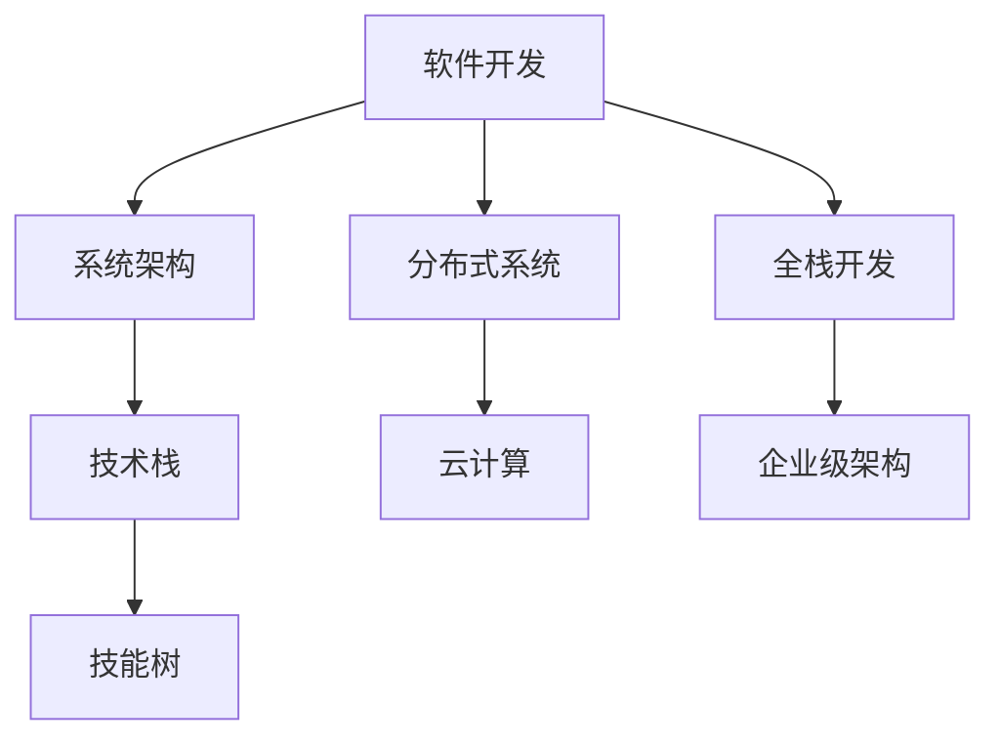

                 

关键词：全栈开发、企业级架构、技术进阶、软件开发、系统架构设计

摘要：本文旨在探讨全栈开发者如何通过系统的学习和实践，逐步转型成为企业级架构师。我们将从背景介绍、核心概念、算法原理、数学模型、项目实践、应用场景、工具资源推荐等方面展开，深入分析这一转型过程中的关键技能和知识点，为有志于提升技术的开发者提供清晰的进阶路径。

## 1. 背景介绍

在现代软件开发领域，从全栈开发到企业级架构师的转型已经成为许多技术人才的职业发展目标。全栈开发（Full-Stack Development）指的是掌握前端和后端技术，能够独立完成整个软件项目的开发工作。而企业级架构师（Enterprise Architect）则是站在整个企业的角度，负责制定软件架构战略，优化系统性能和稳定性，提升软件项目的整体质量。

全栈开发者在职业生涯初期，通常专注于具体的技术实现，但随着经验的积累和对业务理解的深入，他们开始接触到更复杂的技术挑战，比如系统性能优化、高并发处理、分布式架构设计等。这些挑战促使他们从全栈开发向企业级架构师转型。

### 1.1 全栈开发的局限性

尽管全栈开发者能够独立完成软件项目的所有开发工作，但他们往往在面对复杂系统时，会遇到以下几个局限性：

1. **知识面狭窄**：全栈开发者可能只关注某一领域的知识，而缺乏其他领域的深入理解。
2. **开发效率低下**：全栈开发者需要在多个技术栈之间切换，导致开发效率降低。
3. **系统架构设计不足**：全栈开发者可能缺乏系统架构设计的经验，导致系统在扩展性和稳定性方面存在隐患。

### 1.2 企业级架构师的角色

企业级架构师则不同，他们不仅需要掌握丰富的技术知识，还需要具备以下几方面的能力：

1. **系统思维**：能够从全局视角出发，理解整个系统的架构和运行机制。
2. **技术视野**：了解前沿技术趋势，能够在合适的时候引入新技术来提升系统性能。
3. **团队协作**：能够带领团队完成复杂的软件项目，协调各方资源，确保项目顺利进行。

## 2. 核心概念与联系

为了更好地理解从全栈开发到企业级架构师的转型过程，我们需要了解以下几个核心概念：

### 2.1 软件开发与系统架构

软件开发（Software Development）是指通过编程语言和开发工具，创建软件系统和应用的过程。而系统架构（System Architecture）则是指软件系统的整体设计，包括组件之间的关系、数据流、功能分布等。

### 2.2 技术栈与技能树

技术栈（Tech Stack）是指一个开发项目中所使用的各种技术和工具。技能树（Skill Tree）则是指开发者在职业生涯中需要掌握的不同技术领域的知识和技能。

### 2.3 分布式系统与云计算

分布式系统（Distributed System）是指由多个独立节点组成的系统，通过通信网络实现协同工作。云计算（Cloud Computing）则是一种通过网络提供计算资源的服务模型，包括基础设施即服务（IaaS）、平台即服务（PaaS）和软件即服务（SaaS）等。

### 2.4 Mermaid 流程图

为了更直观地理解这些概念之间的关系，我们使用 Mermaid 流程图来展示它们之间的联系。



## 3. 核心算法原理 & 具体操作步骤

### 3.1 算法原理概述

在企业级架构设计中，算法原理扮演着至关重要的角色。以下是一些核心算法原理：

### 3.1.1 算法复杂度分析

算法复杂度分析是评估算法性能的重要手段。通常包括时间复杂度和空间复杂度。

### 3.1.2 贪心算法

贪心算法（Greedy Algorithm）是一种在每一步选择中都采取当前最优解的策略。这种策略不保证得到全局最优解，但往往能够快速找到近似最优解。

### 3.1.3 动态规划

动态规划（Dynamic Programming）是一种通过将复杂问题分解为简单子问题，并存储子问题的解来避免重复计算的方法。

### 3.2 算法步骤详解

以下是对上述算法原理的详细步骤描述：

### 3.2.1 算法复杂度分析步骤

1. **确定算法输入**：明确算法需要处理的输入数据。
2. **分析算法执行过程**：跟踪算法执行过程中每一步的操作次数。
3. **计算时间复杂度和空间复杂度**：根据操作次数计算算法的复杂度。

### 3.2.2 贪心算法步骤

1. **初始化**：设定初始状态。
2. **选择当前最优解**：根据当前状态选择最优的决策。
3. **更新状态**：根据选择的最优解更新状态。
4. **重复步骤 2 和 3**：直到达到结束条件。

### 3.2.3 动态规划步骤

1. **定义状态**：定义问题状态以及状态的转移关系。
2. **初始化状态表**：根据初始状态初始化状态表。
3. **迭代计算状态表**：根据状态转移关系迭代更新状态表。
4. **获取最终解**：从状态表中获取最终解。

### 3.3 算法优缺点

#### 贪心算法

**优点**：简单易懂，能够快速找到近似最优解。

**缺点**：不一定能找到全局最优解，对于某些问题可能需要改进。

#### 动态规划

**优点**：能够通过存储子问题的解来避免重复计算，提高算法效率。

**缺点**：对于某些问题，状态定义和状态转移关系可能较为复杂。

### 3.4 算法应用领域

算法在企业级架构中的应用非常广泛，以下是一些典型的应用领域：

1. **性能优化**：通过算法优化系统性能，如缓存算法、负载均衡算法等。
2. **数据挖掘**：利用贪心算法和动态规划进行数据分析和模式识别。
3. **网络优化**：在网络路由、负载均衡等方面应用算法优化网络性能。
4. **分布式系统**：在分布式系统设计中应用算法进行节点调度和负载均衡。

## 4. 数学模型和公式 & 详细讲解 & 举例说明

在企业级架构设计中，数学模型和公式是分析和优化系统性能的重要工具。以下我们将介绍几个常用的数学模型和公式，并进行详细讲解和举例说明。

### 4.1 数学模型构建

数学模型构建是利用数学语言描述现实世界的问题。构建数学模型通常包括以下几个步骤：

1. **确定变量**：根据问题定义变量，明确变量之间的关系。
2. **建立方程**：根据变量之间的关系建立方程或方程组。
3. **求解方程**：使用合适的数学方法求解方程或方程组。

### 4.2 公式推导过程

以下是一个典型的数学模型和公式的推导过程：

#### 示例：线性规划模型

假设我们要解决一个线性规划问题，目标是最大化利润，同时满足资源限制。

1. **确定变量**：设 \( x_1, x_2 \) 为生产两种产品的数量，设 \( c_1, c_2 \) 为两种产品的利润。
2. **建立方程**：
   - 目标函数：\( \max Z = c_1 x_1 + c_2 x_2 \)
   - 约束条件：\( a_{11} x_1 + a_{12} x_2 \leq b_1 \)（原材料限制）
                 \( a_{21} x_1 + a_{22} x_2 \leq b_2 \)（人力限制）
                 \( x_1, x_2 \geq 0 \)（非负约束）
3. **求解方程**：使用拉格朗日乘数法或单纯形法求解该线性规划问题。

### 4.3 案例分析与讲解

#### 示例：资源分配问题

假设一个企业有两个部门，每个部门需要分配一定数量的资源（如人员、资金、设备等）。目标是最大化总利润，同时确保资源分配合理。

1. **确定变量**：设 \( x_1, x_2 \) 为两个部门的资源数量，设 \( p_1, p_2 \) 为每个部门的利润。
2. **建立方程**：
   - 目标函数：\( \max Z = p_1 x_1 + p_2 x_2 \)
   - 约束条件：\( a_{11} x_1 + a_{12} x_2 \leq b_1 \)（资源总量限制）
                 \( a_{21} x_1 + a_{22} x_2 \leq b_2 \)（资源优先级限制）
                 \( x_1, x_2 \geq 0 \)（非负约束）
3. **求解方程**：使用线性规划求解器（如CPLEX、Gurobi等）求解该问题。

通过上述案例，我们可以看到数学模型和公式在企业级架构设计中的重要性。它们不仅帮助我们分析和优化系统性能，还能为决策提供科学依据。

## 5. 项目实践：代码实例和详细解释说明

为了更好地理解从全栈开发到企业级架构师的转型过程，我们将通过一个实际项目来演示这一过程，并详细解释其中的代码实现和架构设计。

### 5.1 开发环境搭建

在开始项目之前，我们需要搭建一个合适的开发环境。以下是一个典型的开发环境搭建步骤：

1. **选择开发语言**：本案例选择Python作为开发语言。
2. **安装依赖库**：安装常用的Python库，如Django、Flask等。
3. **配置数据库**：选择合适的数据库，如MySQL、PostgreSQL等。
4. **搭建开发环境**：在本地或云端搭建开发服务器，配置必要的工具和依赖。

### 5.2 源代码详细实现

在本案例中，我们将开发一个简单的在线购物系统，包括用户管理、商品管理、订单管理等模块。

#### 用户管理模块

1. **功能描述**：实现用户注册、登录、个人信息管理等功能。
2. **代码实现**：

```python
# user/models.py
from django.db import models

class User(models.Model):
    username = models.CharField(max_length=50)
    password = models.CharField(max_length=100)
    email = models.EmailField()

    def __str__(self):
        return self.username
```

#### 商品管理模块

1. **功能描述**：实现商品分类、商品列表、商品详情等功能。
2. **代码实现**：

```python
# product/models.py
from django.db import models

class Category(models.Model):
    name = models.CharField(max_length=100)

    def __str__(self):
        return self.name

class Product(models.Model):
    category = models.ForeignKey(Category, on_delete=models.CASCADE)
    name = models.CharField(max_length=100)
    price = models.DecimalField(max_digits=6, decimal_places=2)
    description = models.TextField()

    def __str__(self):
        return self.name
```

#### 订单管理模块

1. **功能描述**：实现订单创建、订单列表、订单详情等功能。
2. **代码实现**：

```python
# order/models.py
from django.db import models
from user.models import User
from product.models import Product

class Order(models.Model):
    user = models.ForeignKey(User, on_delete=models.CASCADE)
    products = models.ManyToManyField(Product)
    status = models.CharField(max_length=20)

    def __str__(self):
        return f"Order {self.id}"
```

### 5.3 代码解读与分析

在本案例中，我们使用了Django框架来实现项目的后端功能。Django是一个高层次的Python Web框架，它鼓励快速开发和干净、实用的设计。以下是对代码的解读和分析：

1. **用户管理模块**：我们使用Django自带的用户模型，并通过自定义模型扩展其功能，如用户名、密码、邮箱等。
2. **商品管理模块**：我们定义了商品分类和商品模型，通过外键关系实现商品与分类的关联。
3. **订单管理模块**：我们定义了订单模型，通过多对多关系实现订单与商品的关联。

通过这个简单的项目，我们可以看到从全栈开发到企业级架构师的转型过程中的实际应用。我们需要掌握多种技术栈，如前端框架、后端框架、数据库、云计算等，同时还需要具备系统设计和优化的能力。

## 6. 实际应用场景

在实际应用中，企业级架构师需要面对各种复杂的技术挑战和业务需求。以下是一些典型的应用场景：

### 6.1 大型电商平台

大型电商平台需要处理海量用户请求、商品信息、订单数据等，对系统的性能、可用性和扩展性提出了极高的要求。企业级架构师需要设计分布式系统，采用微服务架构，实现高并发、高可用、可扩展的系统。

### 6.2 物联网系统

物联网系统涉及大量的传感器、设备和数据处理，需要处理海量数据传输、设备连接管理、数据分析等任务。企业级架构师需要设计分布式数据处理架构，采用大数据技术和云计算平台，实现高效、可靠的数据处理和存储。

### 6.3 金融系统

金融系统涉及交易处理、资金流动、风险管理等关键业务，对系统的安全性和可靠性要求极高。企业级架构师需要设计高可靠性的分布式系统，采用加密技术、分布式存储和备份策略，确保系统的安全性和数据完整性。

### 6.4 医疗系统

医疗系统涉及患者信息管理、医学影像处理、远程医疗等任务，需要处理海量医疗数据，提供高效、准确的服务。企业级架构师需要设计分布式计算和存储架构，利用人工智能和大数据技术，实现高效的医疗数据处理和分析。

## 7. 工具和资源推荐

为了帮助开发者更好地进行从全栈开发到企业级架构师的转型，我们推荐以下工具和资源：

### 7.1 学习资源推荐

1. **《架构师之路》**：一本介绍软件架构设计方法和实践经验的经典著作。
2. **《分布式系统原理与范型》**：一本全面介绍分布式系统原理和架构设计的教材。
3. **《大数据技术原理与应用》**：一本介绍大数据技术和应用的入门书籍。

### 7.2 开发工具推荐

1. **Docker**：用于容器化应用的工具，可以简化开发、测试和部署流程。
2. **Kubernetes**：用于容器编排和集群管理的工具，可以自动化管理容器化应用。
3. **DBeaver**：一款开源的数据库管理工具，支持多种数据库。

### 7.3 相关论文推荐

1. **《大规模分布式存储系统设计》**：介绍了大规模分布式存储系统的设计方法和关键技术。
2. **《高并发网络编程》**：介绍了高并发网络编程的技术和方法，适用于开发高性能网络应用。
3. **《人工智能与大数据技术》**：介绍了人工智能和大数据技术在各个领域的应用，为开发者提供了新的思路和方向。

## 8. 总结：未来发展趋势与挑战

在未来，从全栈开发到企业级架构师的转型将继续受到关注。以下是一些未来发展趋势和挑战：

### 8.1 研究成果总结

1. **云计算与大数据**：云计算和大数据技术的发展，为企业级架构师提供了更多的工具和资源。
2. **容器化与微服务**：容器化和微服务架构的应用，使得系统更加灵活、可扩展。
3. **人工智能与自动化**：人工智能和自动化技术的发展，将提高系统性能和开发效率。

### 8.2 未来发展趋势

1. **分布式架构**：分布式架构将得到更广泛的应用，以应对复杂业务场景和高并发需求。
2. **云计算平台**：云计算平台将提供更多创新的服务和工具，助力企业级架构师实现高效开发。
3. **人工智能应用**：人工智能技术在企业级架构中的应用，将带来更多的创新和变革。

### 8.3 面临的挑战

1. **技术更新迭代**：随着技术的快速发展，企业级架构师需要不断学习和更新知识。
2. **系统复杂性**：复杂的系统架构设计和管理，将带来更高的技术门槛。
3. **团队协作与沟通**：跨部门、跨团队的协作和沟通，将是一个重要的挑战。

### 8.4 研究展望

1. **云计算与边缘计算**：结合云计算和边缘计算，实现更高效、更智能的系统。
2. **人工智能与区块链**：探索人工智能和区块链技术的融合，为业务创新提供新的思路。
3. **绿色计算与可持续发展**：关注绿色计算和可持续发展，推动技术的可持续发展。

## 9. 附录：常见问题与解答

### 9.1 从全栈开发到企业级架构师的转型是否适合所有人？

转型是否适合取决于个人的兴趣和职业规划。如果对系统架构设计、技术优化、团队管理等方面感兴趣，那么转型是非常值得的。但如果对技术实现更感兴趣，希望深入钻研某一领域的具体技术，那么转型可能不是最佳选择。

### 9.2 企业级架构师需要掌握哪些核心技能？

企业级架构师需要掌握以下核心技能：

1. **系统架构设计**：能够从全局视角设计系统架构。
2. **技术选型**：能够根据业务需求选择合适的技术栈。
3. **分布式系统**：了解分布式系统的原理和实现。
4. **性能优化**：能够对系统进行性能优化和调优。
5. **团队协作**：具备良好的团队协作和沟通能力。

### 9.3 转型过程中会遇到哪些困难？

转型过程中可能会遇到以下困难：

1. **知识储备不足**：缺乏系统架构设计和分布式系统等领域的知识。
2. **技术更新迭代**：技术快速发展，需要不断学习和更新知识。
3. **团队协作与沟通**：跨部门、跨团队的协作和沟通，可能会带来挑战。

### 9.4 如何提高系统架构设计能力？

提高系统架构设计能力的方法包括：

1. **学习与实践**：通过学习和实践积累经验。
2. **参与项目**：参与复杂项目的架构设计，锻炼自己的能力。
3. **阅读论文与书籍**：阅读相关领域的论文和书籍，了解前沿技术和设计方法。
4. **参加培训与讲座**：参加相关的培训、讲座和研讨会，拓宽视野。

通过以上方法和实践，逐步提升自己的系统架构设计能力，从而实现从全栈开发到企业级架构师的转型。

---

本文由禅与计算机程序设计艺术 / Zen and the Art of Computer Programming 撰写，旨在为有志于提升技术的开发者提供清晰的进阶路径，探讨从全栈开发到企业级架构师的转型过程。希望本文能为您的技术成长之路提供一些启示和帮助。如果您有任何疑问或建议，欢迎在评论区留言，我将竭诚为您解答。

