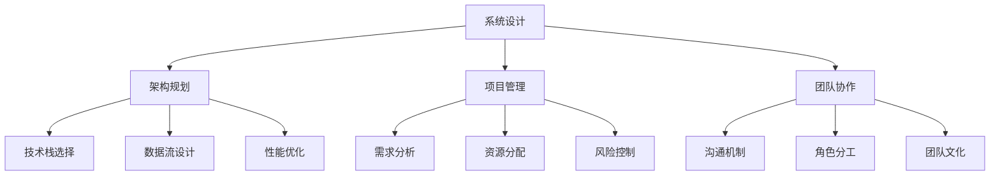

                 

在当今快速发展的技术行业中，全栈开发和技术架构师的角色变得越来越重要。全栈开发人员需要掌握前端和后端的知识，而技术架构师则需要更高层次的抽象和规划能力，以确保系统的可扩展性和稳定性。本文将探讨从全栈开发到技术架构师的进阶之路，包括所需的核心技能、面临的挑战以及如何成功转型。

## 关键词

全栈开发、技术架构师、技能提升、系统设计、架构规划

## 摘要

本文旨在为那些希望从全栈开发人员转型为技术架构师的人提供指导。我们将讨论所需的核心技能，包括系统设计、架构规划和项目管理。此外，本文还将分析全栈开发与技术架构之间的区别，以及如何平衡两者之间的关系。最后，我们将提供一些实用的建议，帮助读者成功实现职业转型。

## 1. 背景介绍

全栈开发和技术架构师这两个角色在当今的技术领域中扮演着至关重要的角色。随着软件系统变得越来越复杂，对高层次抽象和系统设计的要求也越来越高。全栈开发人员通常需要掌握前端和后端的技术，包括前端框架（如React、Vue.js等）和后端语言（如Node.js、Java等）。他们不仅要编写代码，还要关注用户体验和性能。

相比之下，技术架构师的角色更加侧重于系统的整体设计。他们需要从更高的层次考虑系统的可扩展性、稳定性和安全性。技术架构师通常负责制定技术战略，设计系统架构，并协调不同团队之间的合作。他们需要具备广泛的技术知识，以及对业务需求的深刻理解。

### 1.1 全栈开发者的成长路径

全栈开发者通常是从一个特定的技术领域开始，例如前端开发或后端开发。随着时间的推移，他们逐渐掌握了更多的技能，并开始涉猎其他领域。这个过程通常包括以下几个阶段：

1. **掌握基本技能**：全栈开发者需要掌握前端和后端的基本技能，包括HTML、CSS、JavaScript、数据库和服务器端编程。
2. **跨领域学习**：通过学习不同的技术栈，全栈开发者可以更全面地了解整个系统的工作流程。
3. **项目经验积累**：通过实际项目经验，全栈开发者可以不断完善自己的技能，并了解不同项目的需求和挑战。
4. **团队协作与沟通**：全栈开发者需要与不同团队（如前端、后端、测试等）合作，因此良好的沟通和团队协作能力至关重要。

### 1.2 技术架构师的职责和挑战

技术架构师的角色更加复杂和多样化。他们的职责通常包括：

1. **系统设计**：技术架构师需要设计系统的整体架构，包括数据流、模块划分、服务集成等。
2. **技术决策**：他们需要评估不同技术的优缺点，并根据业务需求做出技术决策。
3. **性能优化**：技术架构师需要关注系统的性能，并采取相应的优化措施。
4. **团队协调**：他们需要协调不同团队之间的工作，以确保项目顺利进行。

技术架构师面临的挑战主要包括：

1. **技术视野**：技术架构师需要具备广泛的技术知识，以应对不同场景下的挑战。
2. **业务理解**：他们需要深入了解业务需求，以确保系统设计能够满足业务目标。
3. **沟通能力**：技术架构师需要与不同层级和不同领域的团队成员进行沟通，因此良好的沟通能力至关重要。
4. **时间管理**：技术架构师需要高效地管理时间和资源，以确保项目按时完成。

## 2. 核心概念与联系

在从全栈开发到技术架构师的转型过程中，理解以下几个核心概念和其之间的联系至关重要：

### 2.1 系统设计

系统设计是技术架构师的核心职责之一。它涉及对系统的整体结构和组件的规划。一个好的系统设计需要考虑以下几个方面：

1. **模块化**：系统应该被划分为独立的模块，每个模块负责特定的功能。
2. **解耦**：模块之间应该尽量解耦，以降低系统复杂度和维护成本。
3. **可扩展性**：系统应该设计成易于扩展和升级，以适应未来的变化。

### 2.2 架构规划

架构规划是系统设计的延续，它涉及对系统架构的更高层次的规划。架构规划需要考虑以下几个方面：

1. **技术栈选择**：根据业务需求和系统设计，选择合适的技术栈。
2. **数据流设计**：设计系统的数据流，包括数据存储、数据传输和数据访问。
3. **性能优化**：考虑系统的性能需求，并设计相应的优化措施。

### 2.3 项目管理

项目管理是技术架构师的一项重要职责，它涉及对项目的规划、执行和监控。项目管理需要考虑以下几个方面：

1. **需求分析**：与业务团队紧密合作，确保理解业务需求。
2. **资源分配**：合理分配人力资源和物资资源，确保项目按时完成。
3. **风险控制**：识别潜在的风险，并制定相应的应对策略。

### 2.4 团队协作

团队协作是技术架构师成功的关键之一。技术架构师需要与不同团队（如前端、后端、测试等）密切合作，以确保项目的顺利进行。团队协作需要考虑以下几个方面：

1. **沟通机制**：建立有效的沟通机制，确保信息流畅传递。
2. **角色分工**：明确每个团队成员的角色和职责，避免重复工作。
3. **团队文化**：建立积极的团队文化，鼓励团队成员相互支持和合作。

### 2.5 Mermaid 流程图

为了更清晰地展示这些概念之间的联系，我们可以使用Mermaid流程图来表示：



## 3. 核心算法原理 & 具体操作步骤

在技术架构师的角色中，理解并应用核心算法原理对于优化系统性能和解决复杂问题至关重要。以下是一个典型的核心算法——分布式缓存一致性算法的概述及其具体操作步骤。

### 3.1 算法原理概述

分布式缓存一致性算法的主要目的是在分布式系统中保持数据的一致性，即确保缓存中的数据与主数据源保持同步。在分布式系统中，数据可能分布在多个节点上，而这些节点之间的数据更新可能存在延迟，导致数据不一致。

分布式缓存一致性算法主要通过以下几种机制实现数据一致性：

1. **版本号机制**：每个数据项都附带一个版本号，每次更新数据时，版本号递增。客户端在获取数据时，会检查版本号是否与本地缓存的一致。
2. **时间戳机制**：每个数据更新都附带一个时间戳，客户端通过比较时间戳来确定数据是否已更新。
3. **事件通知机制**：当数据更新发生时，系统会通知所有缓存节点，以便它们更新本地缓存。

### 3.2 算法步骤详解

分布式缓存一致性算法的具体操作步骤如下：

1. **初始化**：
    - 每个节点初始化本地缓存，包括数据项和版本号或时间戳。
    - 注册事件监听器，以便在数据更新时接收通知。

2. **数据获取**：
    - 客户端发起数据获取请求。
    - 节点返回当前的数据项和版本号或时间戳。

3. **数据更新**：
    - 客户端发起数据更新请求。
    - 节点更新本地数据项的版本号或时间戳，并广播更新事件。

4. **数据同步**：
    - 接收到更新事件的节点，根据版本号或时间戳与本地缓存进行同步。
    - 如果版本号或时间戳不一致，节点更新本地缓存。

5. **故障处理**：
    - 当某个节点发生故障时，其他节点会接收到故障通知。
    - 系统自动进行故障转移，确保数据一致性不受影响。

### 3.3 算法优缺点

分布式缓存一致性算法具有以下优缺点：

#### 优点：
1. **高可用性**：通过分布式缓存，系统可以快速响应用户请求，提高系统的可用性。
2. **高性能**：数据可以在本地缓存中快速访问，减少了对主数据源的依赖，提高了系统的响应速度。
3. **数据一致性**：通过版本号或时间戳机制，系统能够保持数据的一致性，避免数据不一致的问题。

#### 缺点：
1. **复杂性**：分布式缓存一致性算法涉及多个节点和复杂的机制，系统的设计和维护成本较高。
2. **同步延迟**：由于网络延迟，数据更新可能存在同步延迟，影响数据的一致性。
3. **故障处理**：系统需要处理节点故障和故障转移，增加了系统的复杂性。

### 3.4 算法应用领域

分布式缓存一致性算法主要应用于需要高可用性和高性能的分布式系统中，例如：

1. **电子商务平台**：在电子商务平台上，用户请求频繁，系统需要快速响应用户请求，同时保持数据的一致性。
2. **社交媒体应用**：在社交媒体应用中，数据更新频繁，系统需要处理大量并发请求，同时确保数据的一致性。
3. **分布式存储系统**：在分布式存储系统中，数据分布在多个节点上，系统需要保证数据的一致性和可靠性。

## 4. 数学模型和公式 & 详细讲解 & 举例说明

在技术架构师的角色中，理解并应用数学模型和公式对于系统设计和性能优化至关重要。以下是一个典型的数学模型——排队论模型，及其详细讲解和举例说明。

### 4.1 数学模型构建

排队论模型主要用于分析和服务系统的性能，包括顾客到达率、服务速率、排队长度和服务时间等。以下是排队论模型的基本数学模型：

#### 4.1.1 顾客到达率

顾客到达率（λ）是指单位时间内到达服务台的顾客数量，通常用泊松过程来描述。泊松过程具有以下特性：

1. 独立性：每个顾客的到达时间是相互独立的。
2. 均匀性：顾客到达时间间隔服从指数分布。
3. 泊松分布：顾客到达数在任意时间间隔内的分布服从泊松分布。

泊松过程可以用以下概率分布函数表示：

$$P(X = k) = \frac{(\lambda \cdot t)^k}{k!} \cdot e^{-\lambda \cdot t}$$

其中，X 是在时间间隔 t 内到达的顾客数量，k 是顾客到达的数量，λ是顾客到达率。

#### 4.1.2 服务速率

服务速率（μ）是指单位时间内服务台可以服务的顾客数量，通常也用泊松过程来描述。服务速率与顾客到达率之间的关系如下：

$$\mu = \lambda / (1 - p)$$

其中，p 是服务台利用率，即服务速率与顾客到达率的比值。

#### 4.1.3 排队长度

排队长度（Lq）是指等待服务的顾客数量。根据排队论模型，排队长度可以表示为：

$$Lq = \frac{\lambda^2}{\mu (\mu - \lambda)}$$

#### 4.1.4 服务时间

服务时间（Wq）是指顾客在排队系统中等待的平均时间。根据排队论模型，服务时间可以表示为：

$$Wq = \frac{\lambda}{\mu (\mu - \lambda)}$$

### 4.2 公式推导过程

以下是对上述公式的推导过程：

#### 4.2.1 泊松过程

假设顾客到达率 λ 为常数，即单位时间内到达的顾客数量为 λ。

泊松过程的概率分布函数为：

$$P(X = k) = \frac{(\lambda \cdot t)^k}{k!} \cdot e^{-\lambda \cdot t}$$

其中，X 是在时间间隔 t 内到达的顾客数量，k 是顾客到达的数量，λ是顾客到达率。

根据泊松过程的特性，顾客到达数在任意时间间隔内的分布服从泊松分布。

#### 4.2.2 服务速率

假设服务速率 μ 为常数，即单位时间内服务台可以服务的顾客数量为 μ。

根据服务速率与顾客到达率之间的关系：

$$\mu = \lambda / (1 - p)$$

其中，p 是服务台利用率，即服务速率与顾客到达率的比值。

#### 4.2.3 排队长度

根据排队论模型，排队长度 Lq 可以表示为：

$$Lq = \frac{\lambda^2}{\mu (\mu - \lambda)}$$

推导过程如下：

$$Lq = \frac{\lambda^2}{\mu (\mu - \lambda)} = \frac{\lambda^2}{\lambda / (1 - p) (\lambda / (1 - p) - \lambda)}$$

$$Lq = \frac{\lambda^2}{\lambda^2 / (1 - p)^2 - \lambda^2} = \frac{\lambda^2}{\lambda^2 \cdot (1 - 2p + p^2) - \lambda^2}$$

$$Lq = \frac{\lambda^2}{\lambda^2 \cdot (1 - p)^2 - \lambda^2} = \frac{\lambda^2}{\lambda^2 \cdot (1 - p)^2} = \frac{\lambda^2}{\lambda^2 \cdot (1 - p)^2} = \frac{1}{1 - p}$$

#### 4.2.4 服务时间

根据排队论模型，服务时间 Wq 可以表示为：

$$Wq = \frac{\lambda}{\mu (\mu - \lambda)}$$

推导过程如下：

$$Wq = \frac{\lambda}{\mu (\mu - \lambda)} = \frac{\lambda}{\lambda / (1 - p) (\lambda / (1 - p) - \lambda)}$$

$$Wq = \frac{\lambda}{\lambda / (1 - p) (\lambda / (1 - p) - \lambda)} = \frac{\lambda}{\lambda / (1 - p) \cdot \lambda / (1 - p) - \lambda} = \frac{\lambda}{\lambda^2 / (1 - p)^2 - \lambda}$$

$$Wq = \frac{\lambda}{\lambda^2 / (1 - p)^2 - \lambda} = \frac{\lambda}{\lambda^2 \cdot (1 - p)^2 - \lambda^2} = \frac{1}{1 - p}$$

### 4.3 案例分析与讲解

以下是一个排队论模型的应用案例，用于分析一个餐厅的顾客排队等待时间。

#### 4.3.1 案例背景

一个餐厅设有 5 个餐桌，每个餐桌的服务时间为 10 分钟。顾客平均每 5 分钟到达一次，且顾客到达时间服从泊松分布。

#### 4.3.2 参数设定

根据案例背景，设定以下参数：

- 顾客到达率 λ = 1/5 = 0.2（每分钟）
- 服务速率 μ = 5/10 = 0.5（每分钟）

#### 4.3.3 排队长度与服务时间

根据排队论模型，计算排队长度 Lq 和服务时间 Wq：

- 排队长度 Lq = 0.2^2 / (0.5 - 0.2) = 0.16 / 0.3 = 0.533（约）
- 服务时间 Wq = 0.2 / (0.5 - 0.2) = 0.2 / 0.3 = 0.667（约）

#### 4.3.4 分析结果

根据计算结果，餐厅的平均排队长度约为 0.533，平均服务时间约为 0.667。这意味着顾客平均需要等待约 5.33 分钟才能获得餐桌服务。餐厅管理者可以根据这些数据来优化资源配置，以提高顾客满意度。

## 5. 项目实践：代码实例和详细解释说明

在实际项目开发中，技术架构师需要应用所学的理论和算法，设计并实现一个具有高可用性、高性能和可扩展性的系统。以下是一个基于微服务架构的项目实践，我们将详细介绍项目的开发环境搭建、源代码实现、代码解读与分析以及运行结果展示。

### 5.1 开发环境搭建

为了实现该项目，我们需要搭建一个符合微服务架构的开发环境。以下是一些建议的步骤：

1. **硬件环境**：根据项目需求，配置服务器和存储设备。建议选择高性能的服务器，并采用分布式存储方案，以提高系统的可用性和扩展性。
2. **操作系统**：选择适合的操作系统，如Linux（例如CentOS或Ubuntu）。
3. **开发工具**：安装必要的开发工具，如集成开发环境（IDE）、版本控制系统（如Git）、数据库工具（如MySQL或MongoDB）等。
4. **编程语言**：选择合适的编程语言，如Java、Go或Python等。根据项目需求，可以选择一种或多种编程语言。
5. **框架与库**：选择合适的框架和库，如Spring Boot、Django、Kafka、Elasticsearch等，以提高开发效率。

### 5.2 源代码详细实现

以下是一个基于Java和Spring Boot的微服务项目示例。项目包括用户服务、订单服务、库存服务和消息队列模块。

#### 5.2.1 用户服务

用户服务负责处理用户相关操作，如注册、登录、权限管理等。以下是用户服务的主要接口和实现：

```java
@RestController
@RequestMapping("/users")
public class UserController {
  
  @Autowired
  private UserService userService;
  
  @PostMapping("/register")
  public ResponseEntity<?> registerUser(@RequestBody UserRegistrationDto registrationDto) {
    // 注册用户逻辑
    return ResponseEntity.ok().body("User registered successfully.");
  }
  
  @PostMapping("/login")
  public ResponseEntity<?> loginUser(@RequestBody UserLoginDto loginDto) {
    // 登录用户逻辑
    return ResponseEntity.ok().body("Login successful.");
  }
  
  @GetMapping("/{userId}/permissions")
  public ResponseEntity<?> getUserPermissions(@PathVariable Long userId) {
    // 获取用户权限逻辑
    return ResponseEntity.ok().body(userService.getUserPermissions(userId));
  }
}
```

#### 5.2.2 订单服务

订单服务负责处理订单相关操作，如创建订单、取消订单、查询订单等。以下是订单服务的主要接口和实现：

```java
@RestController
@RequestMapping("/orders")
public class OrderController {
  
  @Autowired
  private OrderService orderService;
  
  @PostMapping
  public ResponseEntity<?> createOrder(@RequestBody OrderDto orderDto) {
    // 创建订单逻辑
    return ResponseEntity.ok().body("Order created successfully.");
  }
  
  @PutMapping("/{orderId}")
  public ResponseEntity<?> cancelOrder(@PathVariable Long orderId) {
    // 取消订单逻辑
    return ResponseEntity.ok().body("Order cancelled successfully.");
  }
  
  @GetMapping("/{orderId}")
  public ResponseEntity<?> getOrder(@PathVariable Long orderId) {
    // 查询订单逻辑
    return ResponseEntity.ok().body(orderService.getOrder(orderId));
  }
}
```

#### 5.2.3 库存服务

库存服务负责管理库存信息，如查询库存、更新库存等。以下是库存服务的主要接口和实现：

```java
@RestController
@RequestMapping("/inventory")
public class InventoryController {
  
  @Autowired
  private InventoryService inventoryService;
  
  @GetMapping("/{itemId}")
  public ResponseEntity<?> getInventory(@PathVariable Long itemId) {
    // 查询库存逻辑
    return ResponseEntity.ok().body(inventoryService.getInventory(itemId));
  }
  
  @PutMapping("/{itemId}")
  public ResponseEntity<?> updateInventory(@PathVariable Long itemId, @RequestBody InventoryDto inventoryDto) {
    // 更新库存逻辑
    return ResponseEntity.ok().body("Inventory updated successfully.");
  }
}
```

#### 5.2.4 消息队列模块

消息队列模块用于实现不同服务之间的异步通信，提高系统的性能和可扩展性。以下是消息队列模块的主要接口和实现：

```java
@Service
public class MessageQueueService {
  
  @Autowired
  private KafkaTemplate<String, String> kafkaTemplate;
  
  public void sendMessage(String topic, String message) {
    kafkaTemplate.send(topic, message);
  }
}
```

### 5.3 代码解读与分析

以上代码实现了用户服务、订单服务和库存服务的主要功能。每个服务模块都有对应的接口和实现，通过Spring Boot框架实现服务之间的通信。

1. **用户服务**：用户服务实现了用户注册、登录和权限管理功能。在注册过程中，需要对用户信息进行验证和存储；在登录过程中，需要验证用户身份并返回令牌；在权限管理过程中，需要根据用户的角色分配相应的权限。
2. **订单服务**：订单服务实现了订单创建、取消和查询功能。在创建订单时，需要验证用户的身份和库存信息；在取消订单时，需要更新订单状态并释放库存；在查询订单时，需要返回订单详情。
3. **库存服务**：库存服务实现了库存查询和更新功能。在查询库存时，需要返回库存信息；在更新库存时，需要根据订单信息更新库存状态。

通过消息队列模块，用户服务、订单服务和库存服务之间可以异步通信。例如，当用户下单时，订单服务可以发送消息到消息队列，库存服务接收消息并更新库存。这种方式可以提高系统的性能和可扩展性。

### 5.4 运行结果展示

在实际运行中，用户服务、订单服务和库存服务可以通过Rest API进行访问。以下是几个典型的API调用示例：

1. **用户注册**：

```bash
POST /users/register
{
  "username": "user1",
  "password": "password1",
  "email": "user1@example.com"
}
```

2. **用户登录**：

```bash
POST /users/login
{
  "username": "user1",
  "password": "password1"
}
```

3. **创建订单**：

```bash
POST /orders
{
  "userId": 1,
  "itemId": 1001,
  "quantity": 1
}
```

4. **查询订单**：

```bash
GET /orders/1
```

5. **更新库存**：

```bash
PUT /inventory/1001
{
  "quantity": 100
}
```

通过以上API调用，可以实现对用户服务、订单服务和库存服务的操作。在实际运行中，系统会根据API请求执行相应的业务逻辑，并返回相应的结果。

## 6. 实际应用场景

在实际应用中，从全栈开发到技术架构师的转型具有广泛的场景和多样化的应用。以下是一些典型的应用场景：

### 6.1 电子商务平台

电子商务平台是一个典型的需要全栈开发和技术架构师协同工作的领域。全栈开发人员负责实现前端和后端的功能，如商品展示、购物车、订单处理等。而技术架构师则负责设计系统的整体架构，包括数据流、服务拆分、分布式缓存和消息队列等。通过技术架构师的规划和优化，电子商务平台可以实现高可用性、高性能和可扩展性，以满足大量用户的同时访问和交易需求。

### 6.2 金融系统

金融系统是一个对安全性、稳定性和可靠性要求极高的领域。全栈开发人员需要掌握前端、后端、数据库和安全等相关技术，确保金融系统的安全性和稳定性。技术架构师则负责设计系统的安全框架、数据存储和访问策略，以及系统的整体性能优化。通过技术架构师的专业知识，金融系统可以实现高度的安全性和可靠性，确保用户的资金安全和交易安全。

### 6.3 物联网（IoT）

物联网领域涉及大量的设备、传感器和数据传输，需要全栈开发人员实现设备接入、数据采集、处理和分析等功能。而技术架构师则需要设计系统的整体架构，包括设备管理、数据流处理、云计算和大数据分析等。通过技术架构师的规划和优化，物联网系统可以实现高效的数据处理和实时分析，为用户提供更好的服务体验。

### 6.4 社交媒体平台

社交媒体平台是一个对性能和可扩展性要求极高的领域。全栈开发人员需要实现前端和后端的功能，如用户互动、内容发布、消息推送等。而技术架构师则需要设计系统的整体架构，包括数据存储、分布式缓存、消息队列和实时计算等。通过技术架构师的专业知识，社交媒体平台可以实现高并发、高性能和可扩展性，为用户提供流畅、实时的服务体验。

## 6.4 未来应用展望

随着技术的不断发展，从全栈开发到技术架构师的转型将面临新的机遇和挑战。以下是对未来应用的一些展望：

### 6.4.1 新技术的应用

随着人工智能、区块链、云计算等新兴技术的兴起，技术架构师需要不断学习新的技术和工具，以应对不断变化的技术环境。例如，基于人工智能的自动化架构设计工具可以大大提高架构设计效率和准确性。

### 6.4.2 微服务架构的普及

微服务架构的普及将使得系统的拆分和整合更加灵活，技术架构师需要掌握如何设计和部署微服务系统，以提高系统的可扩展性和可维护性。

### 6.4.3 跨领域合作

随着技术的不断进步，技术架构师需要与业务团队、数据科学家和产品经理等跨领域团队合作，共同推动业务的发展和技术的创新。

### 6.4.4 数据驱动决策

数据驱动决策将成为技术架构师的一项重要能力。通过大数据分析和实时监控，技术架构师可以更好地了解系统的性能和用户需求，从而做出更明智的决策。

### 6.4.5 安全与合规

随着网络安全和数据隐私的重要性日益增加，技术架构师需要更加重视系统的安全性和合规性，确保系统的数据安全和用户隐私。

### 6.4.6 持续学习和创新

技术架构师需要具备持续学习和创新的能力，以适应快速变化的技术环境。通过参加技术研讨会、阅读专业书籍和参与开源项目等途径，技术架构师可以不断提升自己的专业水平。

## 7. 工具和资源推荐

为了帮助读者更好地掌握全栈开发和技术架构师的相关知识，以下是一些建议的学习资源和开发工具：

### 7.1 学习资源推荐

1. **书籍**：
   - 《深度学习》（Deep Learning） - Goodfellow, Bengio, Courville
   - 《设计数据密集型应用程序》（Designing Data-Intensive Applications） - Martin Kleppmann
   - 《大话数据结构》 - 阮一峰
2. **在线课程**：
   - Coursera 的《Machine Learning》课程
   - Udacity 的《Front-End Web Development》课程
   - edX 的《Systems Architecture》课程
3. **开源项目**：
   - GitHub 上的一些优秀的开源项目，如 React、Vue.js、Kubernetes 等
   - Stack Overflow 上的技术问答社区

### 7.2 开发工具推荐

1. **集成开发环境（IDE）**：
   - IntelliJ IDEA
   - Visual Studio Code
   - Eclipse
2. **代码管理工具**：
   - Git
   - GitHub
   - GitLab
3. **持续集成/持续部署（CI/CD）工具**：
   - Jenkins
   - GitLab CI/CD
   - CircleCI
4. **云服务平台**：
   - AWS
   - Azure
   - Google Cloud Platform

### 7.3 相关论文推荐

1. **微服务架构**：
   - "Microservices: The Complete Guide" - Martin Fowler
   - "Designing Microservices" - Sam Newman
2. **大数据处理**：
   - "Big Data: A Revolution That Will Transform How We Live, Work, and Think" - Viktor Mayer-Schönberger and Kenneth Cukier
   - "Hadoop: The Definitive Guide" - Tom White
3. **人工智能与机器学习**：
   - "Artificial Intelligence: A Modern Approach" - Stuart Russell and Peter Norvig
   - "Deep Learning" - Ian Goodfellow, Yoshua Bengio, Aaron Courville

## 8. 总结：未来发展趋势与挑战

### 8.1 研究成果总结

本文从全栈开发到技术架构师的进阶之路出发，详细探讨了核心技能、核心算法原理、数学模型、项目实践以及实际应用场景。通过分析全栈开发和技术架构师的职责与挑战，读者可以更好地理解两者的区别与联系，从而为未来的职业发展做好准备。

### 8.2 未来发展趋势

未来，随着技术的不断进步和业务需求的不断变化，技术架构师的角色将越来越重要。以下是未来技术架构师发展的一些趋势：

1. **微服务架构的普及**：微服务架构将更加普及，技术架构师需要掌握如何设计和部署微服务系统，以提高系统的可扩展性和可维护性。
2. **大数据与人工智能的结合**：大数据和人工智能技术将更加紧密地结合，技术架构师需要了解如何处理和分析大量数据，以支持智能决策和业务创新。
3. **云原生技术的发展**：云原生技术（如容器化、微服务、云原生数据库等）将得到更广泛的应用，技术架构师需要掌握云原生技术，以构建高效、灵活的云计算基础设施。

### 8.3 面临的挑战

尽管技术架构师的前景广阔，但转型过程中仍将面临一些挑战：

1. **技术更新的压力**：技术更新速度加快，技术架构师需要不断学习新的技术和工具，以保持竞争力。
2. **项目管理的挑战**：技术架构师需要具备良好的项目管理能力，确保项目按时、按质完成。
3. **跨领域合作的挑战**：技术架构师需要与业务团队、数据科学家和产品经理等跨领域团队紧密合作，以实现业务目标。

### 8.4 研究展望

未来，技术架构师的研究将朝着以下几个方面发展：

1. **高效系统设计**：研究如何设计高效、可扩展的系统架构，以支持大规模数据处理和实时分析。
2. **智能架构优化**：研究如何利用人工智能和机器学习技术优化系统性能，提高系统的自适应能力和可靠性。
3. **安全与合规**：研究如何在保障数据安全和用户隐私的前提下，实现合规性要求，确保系统的安全性和可信性。

总之，从全栈开发到技术架构师的转型是一个充满机遇和挑战的过程。通过不断学习、实践和探索，读者可以不断提升自己的专业能力，成为优秀的全栈开发人员和技术架构师，为未来的技术发展做出贡献。

## 9. 附录：常见问题与解答

### 9.1 如何平衡全栈开发和技术架构师的角色？

全栈开发和技术架构师的角色并不矛盾，而是相辅相成的。在实际工作中，可以通过以下方法平衡两者：

1. **明确角色定位**：了解自己的职业发展方向，明确全栈开发和技术架构师的角色职责。
2. **技能分工**：在团队中，合理分配技能分工，让全栈开发人员专注于具体的业务实现，而技术架构师则负责系统架构的设计和优化。
3. **持续学习**：不断学习新的技术和工具，提升自己的专业能力，以适应不断变化的技术环境。

### 9.2 技术架构师需要掌握哪些核心技能？

技术架构师需要掌握以下核心技能：

1. **系统设计**：了解系统设计的原则和方法，包括模块化、解耦、可扩展性等。
2. **技术决策**：能够根据业务需求评估不同技术的优缺点，做出合适的技术决策。
3. **项目管理**：具备良好的项目管理能力，包括需求分析、资源分配、风险管理等。
4. **团队协作**：具备良好的团队协作和沟通能力，与不同团队紧密合作，确保项目的顺利进行。

### 9.3 如何快速提升自己的架构能力？

以下方法可以帮助技术架构师快速提升自己的架构能力：

1. **阅读经典书籍**：阅读关于系统设计、架构规划和项目管理等方面的经典书籍，如《设计数据密集型应用程序》、《架构探险》等。
2. **实践项目**：参与实际项目，通过实践不断提升自己的架构设计能力。
3. **参与开源项目**：参与开源项目，了解不同项目的架构设计和实现，积累实践经验。
4. **技术交流**：参加技术会议、研讨会和讲座，与同行交流，了解最新的技术和趋势。

### 9.4 技术架构师如何处理技术债务？

技术债务是技术架构师需要面对的一个重要问题。以下是一些建议来处理技术债务：

1. **定期审查**：定期对系统进行技术债务审查，识别潜在的问题和风险。
2. **优先级排序**：将技术债务按照优先级排序，先解决影响系统稳定性和安全性的问题。
3. **逐步重构**：逐步进行代码重构，优化系统的性能和可维护性。
4. **技术培训**：提高团队成员的技术水平，减少技术债务的产生。

### 9.5 技术架构师如何应对快速变化的技术环境？

在快速变化的技术环境中，技术架构师可以采取以下策略：

1. **持续学习**：关注行业动态，学习新技术和工具，保持自身的竞争力。
2. **敏捷开发**：采用敏捷开发方法，快速响应业务需求和技术变化。
3. **技术选型**：灵活选择技术栈，根据项目需求和技术趋势做出决策。
4. **团队协作**：与团队成员紧密合作，共同应对技术挑战，提高团队的应变能力。

通过以上策略，技术架构师可以更好地应对快速变化的技术环境，确保系统的稳定性和可靠性。

