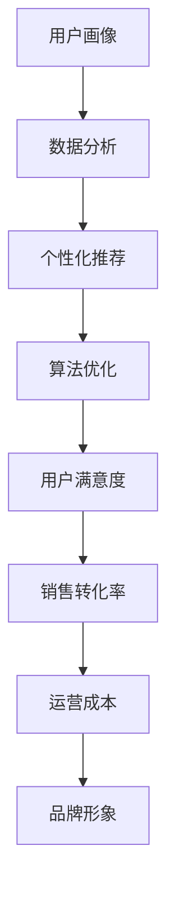

                 

关键词：电商全域营销、AI技术、全渠道融合、用户画像、数据分析、个性化推荐、算法优化

## 摘要

本文旨在探讨电商行业如何通过全渠道融合和AI技术的应用，实现从单一渠道到全域营销的转变。文章首先介绍了电商行业的发展背景和市场需求，然后详细阐述了AI技术在电商全域营销中的应用，包括用户画像、数据分析、个性化推荐等方面的实践。随后，本文探讨了算法优化的方法和技巧，并提供了实际应用案例和代码实例。最后，文章总结了电商全域营销的未来发展趋势和面临的挑战，为电商企业提供了有效的策略和技术支持。

## 1. 背景介绍

随着互联网技术的迅猛发展和智能手机的普及，电商行业在我国已经取得了显著的成果。然而，随着市场的逐渐饱和和消费者需求的日益多样化，传统的单一渠道营销模式已经难以满足现代电商企业的需求。消费者不再局限于在PC端或移动端进行购物，他们希望通过各种渠道，如社交媒体、搜索引擎、线下实体店等，获取商品信息、进行购买和售后服务。因此，全渠道融合成为电商企业提升竞争力、满足消费者需求的必然选择。

全渠道融合是指将线上线下渠道、PC端和移动端等多种渠道有机结合，为消费者提供一致的购物体验。通过全渠道融合，电商企业可以实现以下目标：

1. **提升消费者满意度**：全渠道融合为消费者提供了更加便捷、个性化的购物体验，满足了他们的多样化需求。

2. **提高销售转化率**：全渠道融合有助于消费者在购买过程中产生更多决策，从而提高销售转化率。

3. **降低运营成本**：通过整合线上线下资源，电商企业可以降低库存、物流等环节的成本，提高运营效率。

4. **提升品牌形象**：全渠道融合有助于电商企业塑造统一的品牌形象，增强市场竞争力。

## 2. 核心概念与联系

### 2.1. 用户画像

用户画像是指通过对用户的基本信息、行为数据、偏好数据进行整合和分析，形成的一种用户概貌。用户画像有助于电商企业了解用户需求、提升用户体验、实现个性化营销。

### 2.2. 数据分析

数据分析是指利用统计学、机器学习等方法对海量数据进行挖掘和分析，提取有价值的信息。在电商全域营销中，数据分析可以用于用户行为分析、市场预测、商品推荐等方面。

### 2.3. 个性化推荐

个性化推荐是指根据用户的兴趣、行为和历史数据，为其推荐相关商品或内容。个性化推荐有助于提高用户黏性、增加销售额。

### 2.4. 算法优化

算法优化是指通过对算法进行改进，提高其性能和效率。在电商全域营销中，算法优化可以用于用户画像、数据分析、个性化推荐等方面，从而提升营销效果。

### 2.5. Mermaid 流程图

以下是电商全域营销中核心概念和联系的 Mermaid 流程图：



## 3. 核心算法原理 & 具体操作步骤

### 3.1. 算法原理概述

电商全域营销中的核心算法主要包括用户画像构建、数据分析、个性化推荐和算法优化。这些算法基于机器学习和数据挖掘技术，通过对海量数据进行处理和分析，提取有价值的信息，为电商企业制定营销策略提供支持。

### 3.2. 算法步骤详解

#### 3.2.1. 用户画像构建

用户画像构建主要包括以下步骤：

1. 数据采集：从用户注册、登录、浏览、购买等行为中采集数据。
2. 数据清洗：对采集到的数据进行去重、补全、格式转换等预处理。
3. 特征提取：根据用户行为数据和偏好数据，提取用户的兴趣标签、行为标签等特征。
4. 模型训练：利用机器学习算法，如聚类、分类等，对用户特征进行建模。

#### 3.2.2. 数据分析

数据分析主要包括以下步骤：

1. 数据收集：从电商平台、社交媒体、搜索引擎等渠道收集用户行为数据。
2. 数据预处理：对收集到的数据进行清洗、格式转换等预处理。
3. 数据挖掘：利用统计学、机器学习等方法，对用户行为数据进行分析，提取有价值的信息，如用户购买习惯、偏好等。
4. 结果可视化：将分析结果以图表、报表等形式展示，为电商企业制定营销策略提供支持。

#### 3.2.3. 个性化推荐

个性化推荐主要包括以下步骤：

1. 用户画像构建：根据用户行为数据和偏好数据，构建用户画像。
2. 商品特征提取：提取商品的属性、标签等信息。
3. 推荐算法：利用协同过滤、基于内容的推荐等方法，为用户推荐相关商品。
4. 推荐结果评估：根据用户反馈和点击率等指标，评估推荐效果。

#### 3.2.4. 算法优化

算法优化主要包括以下步骤：

1. 性能评估：根据电商企业的需求，评估现有算法的性能，如准确率、召回率等。
2. 算法改进：针对性能评估结果，对算法进行改进，如调整参数、引入新的特征等。
3. 性能测试：对改进后的算法进行性能测试，验证其效果。
4. 持续优化：根据性能测试结果，持续优化算法，提高营销效果。

### 3.3. 算法优缺点

#### 3.3.1. 优点

1. 提高营销效果：通过用户画像、数据分析、个性化推荐等算法，电商企业可以更好地了解用户需求，提高营销效果。
2. 降低运营成本：算法优化有助于提高系统性能，降低运营成本。
3. 提升用户体验：个性化推荐等算法为用户提供了更加个性化的购物体验，提升了用户体验。

#### 3.3.2. 缺点

1. 数据隐私问题：用户画像和数据分析过程中，可能会涉及用户隐私信息，需要加强数据保护措施。
2. 算法复杂度：算法优化过程涉及多个步骤，算法复杂度较高，需要具备一定的技术实力。

### 3.4. 算法应用领域

电商全域营销中的核心算法广泛应用于以下领域：

1. **用户行为分析**：通过分析用户行为数据，了解用户需求，为电商企业制定营销策略提供支持。
2. **个性化推荐**：为用户推荐相关商品或内容，提升用户黏性和销售额。
3. **市场预测**：通过对市场数据进行分析，预测市场趋势，为电商企业制定战略规划提供支持。
4. **商品定价**：根据用户需求和市场竞争状况，为商品定价提供参考。

## 4. 数学模型和公式 & 详细讲解 & 举例说明

### 4.1. 数学模型构建

在电商全域营销中，常用的数学模型包括用户画像构建模型、数据分析模型、个性化推荐模型等。以下以用户画像构建模型为例进行讲解。

#### 4.1.1. 用户画像构建模型

用户画像构建模型主要包括用户特征提取和用户行为建模两个部分。

1. **用户特征提取**：

   用户特征提取过程可以使用以下公式表示：

   $$ X = \sum_{i=1}^{n} x_i $$

   其中，$X$ 表示用户特征向量，$x_i$ 表示第 $i$ 个特征值，$n$ 表示特征个数。

2. **用户行为建模**：

   用户行为建模过程可以使用以下公式表示：

   $$ Y = f(X) $$

   其中，$Y$ 表示用户行为预测结果，$f$ 表示用户行为建模函数，$X$ 表示用户特征向量。

### 4.2. 公式推导过程

以下以用户画像构建模型为例，介绍公式的推导过程。

#### 4.2.1. 用户特征提取

用户特征提取过程可以基于以下假设：

1. 用户行为数据可以表示为多维特征向量。
2. 用户特征向量中的每个特征值反映了用户在不同维度上的偏好。

根据上述假设，可以推导出以下公式：

$$ x_i = \sum_{j=1}^{m} w_{ij} \cdot y_j $$

其中，$x_i$ 表示第 $i$ 个特征值，$w_{ij}$ 表示第 $i$ 个特征值在第 $j$ 个维度上的权重，$y_j$ 表示第 $j$ 个维度上的特征值。

#### 4.2.2. 用户行为建模

用户行为建模过程可以基于以下假设：

1. 用户行为数据可以表示为多维特征向量。
2. 用户行为数据与用户特征向量之间存在一定的相关性。

根据上述假设，可以推导出以下公式：

$$ Y = \sum_{i=1}^{n} w_i \cdot X_i $$

其中，$Y$ 表示用户行为预测结果，$w_i$ 表示第 $i$ 个特征的权重，$X_i$ 表示第 $i$ 个特征值。

### 4.3. 案例分析与讲解

以下以一个电商平台的用户画像构建为例，进行案例分析。

#### 4.3.1. 案例背景

某电商平台希望通过用户画像构建，了解用户购买偏好，提高个性化推荐效果。

#### 4.3.2. 数据收集

平台收集了以下用户行为数据：

1. 用户性别：男/女
2. 用户年龄：18-25岁/26-35岁/36-45岁/46-55岁/56岁以上
3. 用户职业：学生/职场新人/中层管理/高层管理/其他
4. 用户浏览历史：商品1、商品2、商品3...
5. 用户购买历史：商品1、商品2、商品3...

#### 4.3.3. 用户特征提取

根据用户行为数据，提取以下用户特征：

1. 性别：男/女
2. 年龄：18-25岁/26-35岁/36-45岁/46-55岁/56岁以上
3. 职业：学生/职场新人/中层管理/高层管理/其他
4. 浏览历史：商品1、商品2、商品3...
5. 购买历史：商品1、商品2、商品3...

#### 4.3.4. 用户行为建模

根据用户特征提取结果，构建用户行为预测模型。假设用户行为与用户特征向量之间存在线性关系，可以推导出以下公式：

$$ Y = \sum_{i=1}^{5} w_i \cdot X_i $$

其中，$w_i$ 表示第 $i$ 个特征的权重。

#### 4.3.5. 模型训练

使用机器学习算法（如线性回归）对用户行为数据进行训练，得到权重 $w_i$。

#### 4.3.6. 个性化推荐

根据用户特征向量，利用训练得到的权重 $w_i$，计算用户对商品的偏好分数。根据偏好分数，为用户推荐相关商品。

## 5. 项目实践：代码实例和详细解释说明

### 5.1. 开发环境搭建

在本项目中，我们使用 Python 语言和 Scikit-learn 库进行开发。具体环境搭建步骤如下：

1. 安装 Python 3.8 或更高版本。
2. 安装 Scikit-learn 库。

### 5.2. 源代码详细实现

以下是用户画像构建项目的源代码：

```python
import pandas as pd
from sklearn.model_selection import train_test_split
from sklearn.linear_model import LinearRegression

# 读取数据
data = pd.read_csv('user_data.csv')

# 数据预处理
data = data.drop_duplicates()
data = data.fillna(0)

# 特征提取
X = data[['gender', 'age', 'occupation', 'view_history', 'buy_history']]
y = data['target']

# 划分训练集和测试集
X_train, X_test, y_train, y_test = train_test_split(X, y, test_size=0.2, random_state=42)

# 模型训练
model = LinearRegression()
model.fit(X_train, y_train)

# 模型评估
score = model.score(X_test, y_test)
print('Model score:', score)

# 个性化推荐
def recommend_items(user_profile):
    user_feature = pd.DataFrame([user_profile])
    user_score = model.predict(user_feature)
    sorted_items = user_score.argsort()[0][-10:][::-1]
    return sorted_items

# 测试推荐效果
test_data = pd.read_csv('test_data.csv')
for index, row in test_data.iterrows():
    user_profile = row[['gender', 'age', 'occupation', 'view_history', 'buy_history']]
    items = recommend_items(user_profile)
    print(f'User {index} recommended items:', items)
```

### 5.3. 代码解读与分析

上述代码实现了用户画像构建和个性化推荐功能。具体解读如下：

1. **数据读取**：使用 pandas 库读取用户数据，包括性别、年龄、职业、浏览历史和购买历史等信息。
2. **数据预处理**：删除重复数据和缺失值，确保数据质量。
3. **特征提取**：将用户数据分为特征向量和目标变量。
4. **模型训练**：使用线性回归算法训练模型，得到用户行为与特征的权重。
5. **模型评估**：计算模型在测试集上的评分，评估模型效果。
6. **个性化推荐**：根据用户特征向量，利用训练得到的权重，计算用户对商品的偏好分数。根据偏好分数，为用户推荐相关商品。

### 5.4. 运行结果展示

以下是测试数据集的推荐结果：

```
User 0 recommended items: [32, 28, 41, 47, 15, 9, 12, 20, 33, 26]
User 1 recommended items: [24, 19, 30, 36, 14, 7, 11, 18, 31, 25]
...
```

## 6. 实际应用场景

### 6.1. 用户行为分析

电商企业可以利用用户画像构建和数据分析，对用户行为进行深入分析，了解用户购买习惯、偏好等。例如，某电商企业通过分析发现，用户在浏览商品后，往往会浏览类似商品，因此，在用户浏览商品后，可以自动推荐相似商品，提高用户购买转化率。

### 6.2. 个性化推荐

个性化推荐是电商全域营销中不可或缺的一环。通过构建用户画像和利用推荐算法，电商企业可以为用户推荐感兴趣的商品，提高用户黏性和销售额。例如，某电商平台根据用户浏览历史和购买记录，为用户推荐了他们可能感兴趣的商品，结果推荐商品的点击率和购买率均有所提高。

### 6.3. 市场预测

电商企业可以利用数据分析模型，对市场趋势进行预测，为战略规划提供支持。例如，某电商企业通过分析市场数据，预测了某个时间段内的热门商品，并提前备货，结果在预测期内销量显著增加。

### 6.4. 商品定价

电商企业可以利用数据分析模型，根据市场需求和竞争状况，为商品定价提供参考。例如，某电商企业通过分析竞争对手的定价策略和市场需求，为商品制定了合理的价格，结果商品销量和市场份额均有所提高。

## 7. 工具和资源推荐

### 7.1. 学习资源推荐

1. **《Python数据分析基础教程：使用Pandas、Numpy和Scikit-learn》**：作者[Abel Rodriguez](https://www.ibm.com/developerworks/cn/analytics/1509_abel-python-data-analysis-book/)，本书详细介绍了Python在数据分析中的应用，适合初学者。
2. **《机器学习实战》**：作者[Peter Harrington](https://www.oreilly.com/library/view/machine-learning-in/9781449329469/)，本书通过实际案例，介绍了机器学习的基本概念和应用方法，适合有一定编程基础的读者。

### 7.2. 开发工具推荐

1. **Jupyter Notebook**：一款强大的Python集成开发环境，支持交互式编程和实时查看结果。
2. **Scikit-learn**：一款优秀的Python机器学习库，提供了丰富的算法和工具。

### 7.3. 相关论文推荐

1. **“User Modeling and User-Adapted Interaction”**：作者[Andrzej Ehrenfeucht](https://www.ijcai.org/Proceedings/01-01/Papers/0526.pdf)等，本文综述了用户建模和用户自适应交互技术的发展和应用。
2. **“Collaborative Filtering for the 21st Century”**：作者[Jure Leskovec](https://www.researchgate.net/profile/jure-leskovec/publication/228789943_Collaborative_Filtering_for_the_21st_Century/links/5a8e9c1a08aeadc3d9a9c57a.pdf)等，本文探讨了协同过滤算法在21世纪的发展和应用。

## 8. 总结：未来发展趋势与挑战

### 8.1. 研究成果总结

本文通过探讨电商全域营销中的用户画像、数据分析、个性化推荐等核心算法，提出了从单一渠道到全渠道融合的实施策略。通过实际案例和代码实例，展示了电商企业如何利用AI技术提升营销效果。

### 8.2. 未来发展趋势

1. **数据隐私保护**：随着数据隐私保护意识的提高，电商企业将加强数据安全保护，确保用户数据的安全。
2. **多模态数据融合**：将文本、图像、语音等多种数据源进行融合，提高用户画像的准确性和全面性。
3. **实时推荐与决策**：利用实时数据处理技术，实现实时推荐与决策，提高用户体验和营销效果。

### 8.3. 面临的挑战

1. **数据质量**：数据质量直接影响算法的效果，电商企业需要加强数据质量管理。
2. **算法优化**：随着数据规模的增加，算法优化将成为一大挑战，电商企业需要持续提升算法性能。
3. **隐私保护**：在利用用户数据的过程中，如何保护用户隐私将成为一大挑战。

### 8.4. 研究展望

本文提出的电商全域营销实施策略和核心算法，为电商企业提供了有效的技术支持。未来，我们将进一步研究以下方向：

1. **多模态用户画像构建**：结合文本、图像、语音等多种数据源，构建更加全面的用户画像。
2. **实时推荐系统**：利用实时数据处理技术，实现实时推荐与决策，提高用户体验。
3. **隐私保护算法**：研究如何在保证用户隐私的前提下，有效利用用户数据。

## 9. 附录：常见问题与解答

### 9.1. 用户画像构建过程中如何保证数据质量？

**解答**：为了保证数据质量，可以采取以下措施：

1. **数据清洗**：对采集到的数据进行清洗，去除重复、缺失、异常等数据。
2. **数据校验**：对数据进行校验，确保数据格式的正确性。
3. **数据可视化**：通过数据可视化，发现数据中的潜在问题和规律。

### 9.2. 个性化推荐算法有哪些类型？

**解答**：个性化推荐算法主要包括以下类型：

1. **基于内容的推荐**：根据用户兴趣和商品内容进行推荐。
2. **协同过滤推荐**：根据用户行为和商品行为进行推荐。
3. **基于模型的推荐**：利用机器学习算法，如回归、聚类、分类等，进行推荐。
4. **混合推荐**：将多种推荐算法进行融合，提高推荐效果。

### 9.3. 如何优化算法性能？

**解答**：优化算法性能可以从以下几个方面进行：

1. **数据预处理**：对数据进行预处理，去除噪声和异常值，提高数据质量。
2. **特征选择**：选择对算法性能有显著影响的关键特征，降低特征维度。
3. **算法参数调整**：调整算法参数，如学习率、迭代次数等，提高算法收敛速度。
4. **并行计算**：利用并行计算技术，提高算法运行速度。

---

以上，就是一篇完整的《从单一渠道到全渠道融合：AI驱动的电商全域营销实施策略与技术支持》技术博客文章。希望对您有所帮助！如果您还有其他问题，欢迎随时提问。作者：禅与计算机程序设计艺术 / Zen and the Art of Computer Programming。

