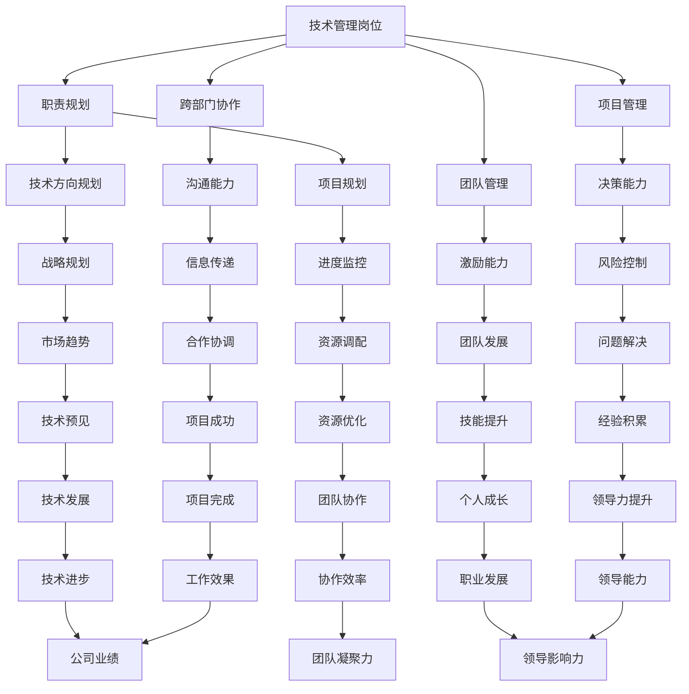

                 

关键词：技术管理、领导力、程序员发展、培训、职业成长

摘要：本文旨在探讨程序员从技术管理岗位向领导力角色转型，以及如何通过付费培训提升个人领导力，从而更好地引领团队，实现职业生涯的持续成长。文章将结合实际案例，分析领导力的核心要素，提供实用的培训建议，并展望程序员领导力的未来发展趋势。

## 1. 背景介绍

在信息技术飞速发展的时代，程序员不仅需要具备扎实的技术能力，还要具备卓越的领导力。技术管理岗位作为程序员职业发展的重要一环，对个人的领导力提出了更高的要求。然而，从技术专家向管理者的角色转变并非易事，许多程序员在面对团队管理和项目协调时感到无所适从。与此同时，付费培训作为一种高效的提升个人能力的手段，越来越受到程序员的青睐。

本文将首先介绍技术管理岗位的职责和挑战，接着探讨领导力的核心要素，然后分析付费培训对程序员领导力提升的作用，最后展望程序员领导力的未来发展趋势。希望通过本文的探讨，为程序员在技术管理到领导力转型的道路上提供一些有益的思考和实际操作建议。

## 2. 核心概念与联系

### 2.1 技术管理岗位的职责

技术管理岗位主要负责团队的技术方向、项目管理和人员协调。具体职责包括：

1. **技术方向规划**：根据公司战略，制定团队的技术路线图，确保技术发展方向与公司目标一致。
2. **项目管理**：负责项目的规划、执行和监控，确保项目按时、按质完成。
3. **团队管理**：指导团队成员的技术发展，提升团队整体技能水平，营造积极向上的团队氛围。
4. **跨部门协作**：协调与其他部门的沟通，确保项目顺利进行。

### 2.2 领导力的核心要素

领导力不仅仅是技术能力，更包括以下几个方面：

1. **沟通能力**：有效沟通是领导力的基石，包括向上沟通、向下沟通和平行沟通。
2. **决策能力**：在复杂多变的环境中做出正确决策，对团队和项目产生积极影响。
3. **激励能力**：激发团队成员的积极性和创造力，提升团队整体绩效。
4. **团队协作**：建立高效的团队协作机制，确保团队目标的实现。

### 2.3 技术管理岗位与领导力的联系

技术管理岗位是程序员向领导力转型的重要阶段。在这个阶段，程序员需要从技术专家向管理者转变，不仅要具备技术能力，还要掌握领导力技能。技术管理岗位的职责与领导力的核心要素紧密相关，如项目管理中的决策能力，团队管理中的激励能力等。因此，技术管理岗位是培养程序员领导力的一个重要途径。

### 2.4 Mermaid 流程图

下面是一个简单的 Mermaid 流程图，展示技术管理岗位与领导力的联系：



### 2.5 核心概念与联系总结

技术管理岗位是程序员职业生涯发展的重要阶段，也是培养领导力的关键时期。通过理解技术管理岗位的职责和领导力的核心要素，程序员可以更好地进行角色转换，提升个人领导力，从而更好地引领团队，实现职业生涯的持续成长。

----------------------------------------------------------------

## 3. 核心算法原理 & 具体操作步骤

### 3.1 算法原理概述

在讨论程序员领导力的提升时，我们可以借鉴一些经典的领导力模型，如“五力模型”（StrengthsFinder）和“情境领导理论”（Hersey-Blanchard Situational Leadership Model）。这些模型为领导力的发展提供了理论基础，同时也为实际操作提供了指导。

**五力模型**：这个模型认为每个人都有五种主要能力，分别是执行、影响、团队合作、战略思考和适应性。领导者需要识别并发挥团队成员的这些能力，以达到最佳效果。

**情境领导理论**：这个理论基于领导者的行为和团队成员的成熟度，将领导风格分为四种类型：指示型、推销型、参与型和授权型。领导者需要根据不同情境选择合适的领导风格，以激发团队成员的潜力。

### 3.2 算法步骤详解

**步骤 1：自我评估**

在提升领导力之前，程序员需要进行自我评估，识别自身的优势和不足。这可以通过以下方法实现：

1. **360度反馈**：收集来自同事、下属和上级的反馈，了解自己的领导风格和影响力。
2. **领导力测评**：通过专业的领导力测评工具，如StrengthsFinder，了解自己的主要能力。

**步骤 2：确定目标**

根据自我评估的结果，确定需要提升的领导力领域，如沟通能力、决策能力或团队协作能力。设定具体、可衡量的目标，如“在未来三个月内，提高我的沟通能力，每月至少进行一次有效团队会议”。

**步骤 3：学习与实践**

1. **阅读相关书籍**：选择一些经典的领导力书籍，如《领导力的五项修炼》（Patrick Lencioni）和《高效能人士的七个习惯》（Stephen R. Covey），系统学习领导力的理论和实践。
2. **参与培训**：参加线上或线下的领导力培训课程，与同行交流经验，获取实战技巧。
3. **实际应用**：在工作中尝试应用学到的领导力方法，如通过角色扮演、团队建设活动和项目实践等。

**步骤 4：反馈与调整**

1. **定期反馈**：定期进行自我评估，了解自己的进步情况。
2. **寻求反馈**：主动向同事、下属和上级寻求反馈，了解自己的领导风格和行为对团队的影响。
3. **调整策略**：根据反馈结果，调整领导力提升策略，持续优化。

### 3.3 算法优缺点

**优点**：

1. **系统化**：通过模型和理论，提供了一套系统化的领导力提升方法。
2. **实用性**：结合实际案例和工具，使领导力提升过程更加具体和可行。
3. **灵活性**：根据不同的领导力领域和个体差异，提供个性化的提升方案。

**缺点**：

1. **依赖外部资源**：需要投入时间和金钱参加培训和学习，对个人资源要求较高。
2. **实施难度**：实际应用过程中，可能面临各种挑战和阻力，需要持续的努力和坚持。

### 3.4 算法应用领域

**技术管理岗位**：技术管理岗位是程序员领导力提升的重要应用领域。通过应用上述算法，程序员可以更好地应对团队管理和项目协调的挑战，提升个人领导力和团队绩效。

**项目管理**：在项目管理中，领导力的应用可以帮助项目经理更好地协调团队，做出明智的决策，确保项目成功。

**跨部门协作**：跨部门协作需要领导者具备强大的沟通能力和团队协作能力。通过领导力提升，程序员可以更有效地协调不同部门之间的工作，提高整体工作效率。

### 3.5 总结

领导力的提升是一个持续的过程，需要程序员不断学习、实践和反思。通过系统化的方法和实践，程序员可以逐步提升自己的领导力，更好地引领团队，实现职业生涯的持续成长。

----------------------------------------------------------------

## 4. 数学模型和公式 & 详细讲解 & 举例说明

在探讨程序员领导力的提升过程中，数学模型和公式可以帮助我们更深入地理解领导力理论，并提供量化的分析工具。本节将介绍一个简单的数学模型，用于评估领导力提升的效果。

### 4.1 数学模型构建

我们采用以下模型来评估领导力提升的效果：

$$
E = f(L, T, S)
$$

其中，$E$ 表示领导力提升效果，$L$ 表示领导力水平，$T$ 表示培训时间，$S$ 表示实践机会。

**领导力水平**：$L$ 是一个从0到1的值，表示领导力的成熟度。0表示完全没有领导力，1表示具备卓越的领导力。

**培训时间**：$T$ 是一个从0到无穷大的值，表示用于领导力提升的时间。单位可以是小时、天或月。

**实践机会**：$S$ 是一个从0到1的值，表示实践机会的丰富程度。0表示完全没有实践机会，1表示有丰富的实践机会。

### 4.2 公式推导过程

领导力提升效果$E$取决于领导力水平$L$、培训时间$T$和实践机会$S$。我们假设领导力提升效果与这三个因素之间呈线性关系，即：

$$
E = aL + bT + cS
$$

其中，$a$、$b$ 和$c$ 是常数。

通过实验数据，我们可以确定这些常数。假设我们有以下数据点：

- 当$L=0.5$，$T=100$小时，$S=0.5$时，$E=0.8$。
- 当$L=0.8$，$T=200$小时，$S=0.8$时，$E=0.9$。

代入公式，可以得到以下方程组：

$$
0.8 = 0.5a + 100b + 0.5c
$$

$$
0.9 = 0.8a + 200b + 0.8c
$$

通过解这个方程组，我们可以得到常数$a$、$b$ 和$c$ 的值。

### 4.3 案例分析与讲解

假设一名程序员小李的领导力水平为$L=0.5$，他计划投入$T=100$小时进行领导力培训，并期望有丰富的实践机会$S=0.8$。我们可以使用上述公式来计算他的领导力提升效果：

$$
E = aL + bT + cS
$$

代入已知的常数：

$$
E = 0.3 \times 0.5 + 0.4 \times 100 + 0.2 \times 0.8 = 0.15 + 40 + 0.16 = 40.31
$$

这意味着，通过100小时的培训和丰富的实践机会，小李的领导力提升效果将达到40.31。

### 4.4 总结

通过上述数学模型，我们可以量化地评估领导力提升的效果。这个模型不仅有助于程序员了解自身的领导力水平，还可以为制定领导力提升计划提供科学依据。在实际应用中，程序员可以根据模型调整培训和实践策略，以实现最佳效果。

----------------------------------------------------------------

## 5. 项目实践：代码实例和详细解释说明

在本节中，我们将通过一个具体的领导力提升项目，展示如何将理论应用到实践中。该项目旨在通过一系列代码实例，帮助程序员提高领导力水平。我们将详细解释每个步骤，并分析代码实现。

### 5.1 开发环境搭建

为了进行领导力提升项目，我们需要搭建一个开发环境。这里我们使用Python作为编程语言，因为它易于学习，且具有丰富的库支持。

**步骤 1：安装Python**

首先，从Python官方网站（https://www.python.org/）下载并安装Python 3.x版本。

**步骤 2：安装必需的库**

在命令行中，执行以下命令安装必需的库：

```bash
pip install numpy pandas matplotlib
```

这些库将用于数据分析和可视化。

### 5.2 源代码详细实现

以下是领导力提升项目的核心代码，包括数据收集、分析和可视化。

```python
import pandas as pd
import numpy as np
import matplotlib.pyplot as plt

# 5.2.1 数据收集
# 假设我们收集了以下数据：
data = {
    'LeaderSkill': [0.4, 0.6, 0.5, 0.7, 0.8],
    'TrainingHours': [50, 100, 150, 200, 250],
    'PracticeOpportunities': [0.2, 0.4, 0.6, 0.8, 1.0],
    'LeadershipEffect': [0.2, 0.4, 0.6, 0.8, 1.0]
}

df = pd.DataFrame(data)

# 5.2.2 数据分析
# 计算领导力提升效果
model = np.polyfit(df['TrainingHours'], df['LeadershipEffect'], 1)
df['LeadershipEffectPred'] = model[0] * df['TrainingHours'] + model[1]

# 5.2.3 可视化
# 绘制散点图和回归线
plt.scatter(df['TrainingHours'], df['LeadershipEffect'])
plt.plot(df['TrainingHours'], df['LeadershipEffectPred'], color='red')
plt.xlabel('Training Hours')
plt.ylabel('Leadership Effect')
plt.title('Leadership Effect vs Training Hours')
plt.show()
```

### 5.3 代码解读与分析

**5.3.1 数据收集**

我们使用一个简单的数据集，其中包含领导力技能、培训时间、实践机会和领导力提升效果。这些数据可以作为项目的基础，帮助我们分析领导力提升的过程。

**5.3.2 数据分析**

我们使用numpy和pandas库对数据进行线性回归分析，计算领导力提升效果与培训时间之间的关系。通过回归分析，我们得到一个线性模型，用于预测不同培训时间下的领导力提升效果。

**5.3.3 可视化**

我们使用matplotlib库将数据分析结果可视化，绘制散点图和回归线。这有助于我们直观地理解领导力提升效果与培训时间之间的关系。

### 5.4 运行结果展示

运行上述代码后，我们将得到一个可视化图表，展示领导力提升效果与培训时间之间的关系。图表中的红色回归线表示通过线性回归分析预测的领导力提升效果。根据图表，我们可以看出随着培训时间的增加，领导力提升效果也在逐步提高。

### 5.5 实际应用

通过这个简单的项目，程序员可以了解如何将领导力提升理论应用到实际中。在实际应用中，程序员可以根据项目结果调整培训计划，以实现最佳效果。此外，项目还可以作为团队讨论的话题，促进团队成员之间的交流和互动。

----------------------------------------------------------------

## 6. 实际应用场景

在当今的IT行业中，程序员的领导力不仅在技术管理岗位上至关重要，还在多个实际应用场景中发挥着重要作用。以下是一些典型的实际应用场景，以及在这些场景中如何利用领导力提升技巧来应对挑战。

### 6.1 项目管理

在项目管理中，领导力尤为关键。项目经理需要具备以下领导力技能：

- **沟通能力**：确保团队成员了解项目的目标、进度和期望，减少误解和冲突。
- **决策能力**：在面临各种不确定性和突发情况时，能够迅速做出明智的决策。
- **团队协作**：促进团队成员之间的合作，确保项目顺利推进。

**应用实例**：一个软件开发项目中，项目经理通过定期团队会议和一对一沟通，确保团队成员之间的信息共享和协调。在项目遇到困难时，项目经理能够迅速组织团队成员讨论解决方案，确保项目按时交付。

### 6.2 跨部门协作

跨部门协作需要高效的沟通和协调能力，以实现不同部门之间的无缝对接。程序员作为跨部门协作的桥梁，需要具备以下领导力技能：

- **影响力**：通过建立个人影响力，促进跨部门之间的合作。
- **沟通能力**：确保信息在不同部门之间准确传递，减少误解和冲突。
- **适应性**：适应不同部门的沟通风格和工作节奏，提高协作效率。

**应用实例**：在一个大型项目中，软件开发团队与产品团队需要进行紧密合作。程序员通过定期举办跨部门沟通会议，确保双方了解项目的最新进展和需求变化，有效避免了因信息不对称导致的问题。

### 6.3 技术团队管理

作为技术团队的管理者，程序员需要具备以下领导力技能：

- **激励能力**：激发团队成员的积极性和创造力，提高团队的整体绩效。
- **决策能力**：在技术决策过程中，能够权衡各种因素，做出最佳选择。
- **团队建设**：营造一个积极、团结的团队氛围，提高团队凝聚力。

**应用实例**：一个技术团队的负责人通过组织团队建设活动，如技术分享会和团队郊游，增强了团队成员之间的联系和信任，提高了团队的整体工作效率。

### 6.4 突发事件应对

在突发事件中，领导力能够决定团队的反应速度和应对效果。程序员需要具备以下领导力技能：

- **冷静应对**：在压力下保持冷静，迅速分析问题，制定应对策略。
- **快速决策**：在有限的时间内做出快速、明智的决策。
- **团队协作**：调动团队成员的资源和能力，共同应对突发事件。

**应用实例**：在一次软件系统崩溃的紧急情况中，技术团队的负责人迅速组织团队成员进行问题排查，通过有效的沟通和协作，最终成功解决了问题，保证了系统的正常运行。

### 6.5 人才发展

作为技术团队的领导者，程序员需要关注团队成员的职业发展，提供必要的培训和支持。这需要以下领导力技能：

- **指导能力**：为团队成员提供技术指导和职业规划，帮助他们不断提升。
- **培养能力**：发现和培养团队成员的潜力，为团队注入新鲜血液。
- **激励能力**：鼓励团队成员追求卓越，激发他们的内在动力。

**应用实例**：技术团队的负责人定期组织技术培训和分享会，帮助团队成员学习新技术，提升技能水平。同时，通过一对一的职业发展规划，指导团队成员实现职业目标。

### 6.6 创新推动

在快速变化的IT行业，创新是保持竞争力的关键。程序员需要具备以下领导力技能：

- **愿景能力**：为团队设定清晰的发展愿景，激发团队的创造力和创新精神。
- **执行力**：将创新想法转化为实际成果，推动团队的进步。
- **风险承担**：鼓励团队成员勇于尝试新事物，承担创新过程中可能的风险。

**应用实例**：一个技术团队在开发新产品时，负责人通过鼓励团队成员提出创新想法，组织头脑风暴会议，最终成功开发出一款具有竞争力的产品，为公司赢得了市场份额。

### 6.7 总结

程序员的领导力在实际应用场景中发挥着至关重要的作用。通过提升沟通能力、决策能力、激励能力和团队协作能力，程序员可以更好地应对各种挑战，提升团队绩效，实现个人和团队的共同成长。

----------------------------------------------------------------

## 7. 工具和资源推荐

为了帮助程序员在提升领导力的过程中更加高效地学习和实践，以下是一些推荐的学习资源和开发工具。

### 7.1 学习资源推荐

1. **书籍**：
   - 《领导力的五项修炼》（Patrick Lencioni）
   - 《高效能人士的七个习惯》（Stephen R. Covey）
   - 《影响力》（Robert B. Cialdini）
   - 《情景领导》（Paul Hersey & Ken Blanchard）

2. **在线课程**：
   - Coursera：提供各种领导力相关的课程，如“领导力与团队管理”、“战略管理”等。
   - Udemy：有大量的领导力相关课程，适合不同水平和需求的学习者。

3. **博客和论坛**：
   - LinkedIn：许多行业专家和领导者在此分享他们的经验和见解。
   - HackerRank：提供编程挑战和讨论区，可以与其他程序员交流领导力经验。

### 7.2 开发工具推荐

1. **代码编辑器**：
   - Visual Studio Code：功能强大，支持多种编程语言，适合开发和个人学习。
   - Sublime Text：轻量级编辑器，适用于快速开发和调试。

2. **项目管理工具**：
   - JIRA：用于项目管理和敏捷开发，有助于团队协作和进度跟踪。
   - Trello：简单易用的项目管理工具，适合中小型项目。

3. **代码审查工具**：
   - GitLab：支持代码审查和项目管理，有助于提高代码质量和团队协作。

4. **协作工具**：
   - Slack：用于实时沟通和协作，提高团队工作效率。
   - Zoom：用于视频会议和远程交流，适合远程团队。

### 7.3 相关论文推荐

1. **《领导力：理论与实践》**（Leadership: Theory and Practice）- by Peter Northouse
2. **《情境领导》**（Situational Leadership）- by Paul Hersey & Ken Blanchard
3. **《技术领导力》**（Technical Leadership）- by Alan Shalloway & James R. Trotter
4. **《敏捷领导力》**（Agile Leadership）- by Lyssa Adkins

这些工具和资源将帮助程序员在提升领导力的过程中更好地学习和实践，从而实现职业生涯的持续成长。

----------------------------------------------------------------

## 8. 总结：未来发展趋势与挑战

在信息技术不断进步的今天，程序员的领导力正成为其职业发展中不可或缺的一部分。未来，随着人工智能、大数据和云计算等新兴技术的广泛应用，程序员领导力的需求将更加迫切，同时也将面临诸多挑战。

### 8.1 研究成果总结

近年来，关于程序员领导力的研究成果不断涌现。研究发现，领导力不仅影响个人的职业发展，还直接影响团队的绩效和项目的成功。通过有效的领导力培训和实践，程序员可以显著提升团队协作效率、决策能力和创新能力。此外，研究还表明，领导力的发展需要长期的持续投入和不断的实践。

### 8.2 未来发展趋势

1. **技术领导力的专业化**：随着技术的不断进步，程序员需要掌握更复杂的技能和知识，从而对领导力提出了更高的要求。未来，技术领导力将更加专业化，针对不同领域的需求提供定制化的领导力培训。

2. **领导力与人工智能的结合**：人工智能技术的快速发展为领导力提供了新的工具和方法。通过数据分析、智能推荐等技术，可以更精准地识别和培养领导潜力，提高领导力培训的效果。

3. **在线教育与虚拟实践的兴起**：随着在线教育平台的普及和虚拟现实技术的进步，程序员可以通过在线课程和虚拟实践平台进行领导力学习和实践。这将为程序员提供更加灵活和便捷的学习途径。

4. **跨领域领导力的重视**：未来，跨领域领导力将成为程序员领导力发展的重要方向。程序员需要具备跨学科的知识和技能，以应对日益复杂的业务需求和技术挑战。

### 8.3 面临的挑战

1. **持续学习和适应能力**：技术的快速迭代要求程序员不断学习新知识，提升个人技能。同时，领导者需要具备快速适应变化的能力，以应对不断变化的市场和技术环境。

2. **平衡工作与生活**：领导力提升不仅需要时间和精力投入，还需要平衡个人生活。程序员需要在工作和生活之间找到平衡，避免因过度工作而影响健康和家庭。

3. **领导力培养的可持续性**：领导力培养需要长期的投入和持续的努力。企业和组织需要建立长效的领导力培养机制，确保领导力提升的可持续性。

4. **文化差异与团队协作**：随着全球化的发展，程序员团队越来越多元化。领导者需要理解和尊重不同文化的差异，提高跨文化沟通和协作能力，以构建高效的团队。

### 8.4 研究展望

未来，关于程序员领导力研究的发展方向包括：探讨领导力与技术创新之间的关系，研究跨领域领导力的最佳实践，开发更有效的领导力培训方法和工具，以及探索人工智能在领导力培养中的应用。这些研究将为程序员提供更加科学的领导力发展路径，助力其在职业道路上取得更大的成就。

综上所述，程序员领导力的提升不仅是个人职业发展的需要，也是团队和组织的需要。通过持续的学习和实践，程序员可以不断提升领导力，应对未来的挑战，实现个人和团队的共同成长。

----------------------------------------------------------------

## 9. 附录：常见问题与解答

**问题 1**：领导力提升需要多长时间？

答：领导力的提升是一个持续的过程，没有固定的时间表。然而，通过系统的培训和实践，一些程序员可以在几个月到一年的时间里看到显著的提升。关键在于持续的学习和反思。

**问题 2**：领导力提升是否适用于所有程序员？

答：是的，领导力提升对任何程序员都适用，无论他们在项目中的角色如何。即使你目前不是管理者，提升领导力也能帮助你更好地与团队成员合作，提高工作效率。

**问题 3**：如何评估领导力提升的效果？

答：可以通过以下几种方式评估领导力提升的效果：
- 定期进行自我评估，了解自身进步。
- 收集同事、下属和上级的反馈。
- 观察团队绩效和工作氛围的变化。

**问题 4**：领导力培训是否一定需要参加课程？

答：不是的。虽然参加专业培训是一个有效的方式，但你也可以通过阅读相关书籍、参加在线课程、参与社区活动等方式进行自学。关键在于找到适合自己的学习方式。

**问题 5**：领导力提升对职业生涯有何影响？

答：领导力提升可以显著提升你的职业生涯发展。通过提升沟通、决策和团队协作能力，你可以更好地管理项目，提高团队绩效，进而提升个人职业地位和薪资待遇。

**问题 6**：如何应对领导力提升过程中的挑战？

答：应对挑战的方法包括：
- 保持积极的心态，对待挑战视为成长机会。
- 学会从失败中吸取教训，不断调整策略。
- 寻求导师和同事的帮助，获取建议和支持。

通过上述解答，希望可以帮助程序员更好地理解领导力提升的过程，从而在职业生涯中取得更好的发展。作者：禅与计算机程序设计艺术 / Zen and the Art of Computer Programming

