                 

关键词：技术领导、商业领导、成长路径、企业成功、组织变革、创新思维、管理能力、领导力、职业发展

## 摘要

本文旨在探讨从技术领导向商业领导转变的过程与路径。通过对技术领导角色与商业领导角色的分析，揭示两者的异同点，并探讨技术人才如何在保持技术专长的基础上，培养商业思维和管理能力，最终成为一名成功的商业领袖。文章将从个人成长、团队管理、企业战略和行业趋势等多个维度，提供实用的建议和策略，帮助技术人才在职业发展过程中实现转型和提升。

## 1. 背景介绍

在当今数字化时代，技术已成为推动企业发展和创新的重要动力。随着技术的发展，越来越多的技术人才走上了领导岗位，他们不仅需要掌握先进的技术，还需要具备领导能力和商业思维，以应对复杂多变的商业环境。然而，从技术专家到商业领袖的转变并非易事，它需要技术人才在保持技术专长的基础上，不断学习、成长和适应。

### 1.1 技术领导的现状

技术领导通常是指在技术领域拥有深厚专业知识和丰富经验，能够带领团队实现技术目标和项目成功的人。他们承担着技术开发、项目管理、团队建设等重要职责，是企业发展的重要支柱。然而，技术领导在管理过程中往往面临以下挑战：

1. **技术深度与广度的平衡**：技术领导需要不断更新自己的技术知识，同时要关注团队的技术能力提升。
2. **管理能力的提升**：技术领导在转变为管理角色后，需要学会如何有效管理团队，提高团队效率和绩效。
3. **跨部门协作**：技术领导需要与业务、市场、财务等多个部门进行紧密协作，以实现企业整体战略目标。

### 1.2 商业领导的现状

商业领导是指在商业领域拥有丰富经验和管理能力，能够制定和实施企业战略，推动企业持续增长的人。他们不仅关注企业的财务表现，还关注企业的长期发展和可持续发展。商业领导在管理过程中面临以下挑战：

1. **市场变化的应对**：商业领导需要敏锐捕捉市场变化，及时调整企业战略。
2. **团队领导力的培养**：商业领导需要培养和激励团队成员，发挥团队的最大潜力。
3. **创新思维的推动**：商业领导需要不断推动创新，引领企业在竞争激烈的市场中脱颖而出。

## 2. 核心概念与联系

为了更好地理解技术领导与商业领导的角色和关系，我们可以借助 Mermaid 流程图来展示两者的核心概念和联系。

```mermaid
graph TD
    A[技术领导] --> B(技术专长)
    A --> C(项目管理)
    A --> D(团队建设)
    B --> E(商业思维)
    B --> F(管理能力)
    C --> G(跨部门协作)
    C --> H(项目管理工具)
    D --> I(团队激励)
    D --> J(沟通技巧)
    E --> K(市场洞察)
    E --> L(战略规划)
    F --> M(财务知识)
    F --> N(组织变革)
    G --> O(业务目标)
    G --> P(协作效率)
    H --> Q(进度监控)
    H --> R(风险管理)
    I --> S(团队目标)
    I --> T(绩效评估)
    J --> U(问题解决)
    J --> V(冲突管理)
    K --> W(市场趋势)
    K --> X(客户需求)
    L --> Y(资源分配)
    L --> Z(风险评估)
    M --> AA(投资决策)
    M --> BB(预算管理)
    N --> CC(流程优化)
    N --> DD(组织文化)
    O --> EE(企业目标)
    O --> FF(运营效率)
    P --> GG(任务分配)
    P --> HH(资源调配)
    Q --> II(任务优先级)
    Q --> JJ(时间管理)
    R --> KK(风险应对)
    R --> LL(风险预防)
    S --> MM(团队动力)
    S --> NN(团队凝聚力)
    T --> OO(目标达成)
    T --> PP(个人发展)
    U --> QQ(决策制定)
    U --> RR(问题解决策略)
    V --> SS(沟通渠道)
    V --> TT(谈判技巧)
    W --> UU(竞争分析)
    W --> VV(合作伙伴关系)
    X --> WW(产品创新)
    X --> XX(服务优化)
    Y --> YY(资源优化)
    Y --> ZZ(业务增长)
    Z --> AAA(战略调整)
    Z --> BBB(业务扩展)
    AA --> CCC(投资机会)
    AA --> DDD(风险评估)
    BB --> EEE(预算控制)
    BB --> FFF(成本优化)
    CC --> GGG(流程改进)
    CC --> HHH(管理效率)
    DD --> III(员工满意度)
    DD --> JJJ(企业文化传承)
    EE --> KKK(长期发展)
    EE --> LLL(短期目标)
    FF --> MMM(运营绩效)
    FF --> NNN(市场反馈)
    GG --> OOO(资源利用)
    GG --> PPP(团队协作)
    HH --> QQQ(资源调配)
    HH --> RRR(资源分配)
    II --> SSS(任务进度)
    II --> TTT(项目管理)
    JJ --> UUU(时间管理)
    JJ --> VVV(任务优先级)
    KK --> WWW(风险分析)
    KK --> XXX(风险应对)
    LL --> YYY(风险预防)
    LL --> ZZZ(风险评估)
    MM --> AAAA(团队动力)
    MM --> BBBB(团队凝聚力)
    NN --> CCCD(个人发展)
    NN --> DDDC(职业规划)
    OO --> EEED(目标达成)
    OO --> FFEC(绩效评估)
    PP --> GGGD(个人成长)
    PP --> HHHF(职业素养)
    QQ --> IICC(决策分析)
    QQ --> JJJG(战略规划)
    RR --> KKKH(问题解决)
    RR --> LLLL(创新思维)
    SS --> MMMM(沟通技巧)
    SS --> NNNG(团队协作)
    TT --> UUUP(谈判策略)
    TT --> VVVH(人际沟通)
    UU --> WWWW(市场洞察)
    UU --> XXXX(客户需求)
    VV --> YYYY(合作伙伴关系)
    VV --> ZZZZ(市场拓展)
    WW --> AAAA(产品创新)
    WW --> BBBB(服务优化)
    XX --> CCCD(市场需求)
    XX --> DDDD(技术创新)
    YY --> EEED(资源优化)
    YY --> FFEC(业务增长)
    ZZ --> GGGD(战略规划)
    ZZ --> HHHF(创新思维)
    AAA --> CCC(投资决策)
    AAA --> DDD(市场分析)
    BBB --> EEE(预算管理)
    BBB --> FFF(风险管理)
    CCC --> GGG(流程优化)
    CCC --> HHH(组织变革)
    DDD --> III(业务目标)
    DDD --> JJJ(市场策略)
    EEE --> KKK(企业战略)
    EEE --> LLL(风险管理)
    FFF --> MMM(组织文化)
    FFF --> NNN(员工激励)
    GGG --> IIII(运营效率)
    GGG --> JJJJ(管理效率)
    HHH --> IIIII(员工满意度)
    HHH --> JJJJJ(企业文化)
    III --> KKKK(长期目标)
    III --> LLLL(短期目标)
    JJJ --> MMMM(市场反馈)
    JJJ --> NNNN(客户需求)
    IIII --> OOOO(运营绩效)
    JJJJ --> PPPP(团队协作)
    IIIII --> QQQQ(资源利用)
    JJJJJ --> RRRR(沟通效率)
    IIIII --> SSSS(项目管理)
    JJJJJ --> TTTT(风险管理)
    IIIII --> UUUU(决策效率)
    JJJJJ --> VVVV(任务分配)
    IIIII --> WWWW(团队动力)
    JJJJJ --> XXXX(团队凝聚力)
    IIII --> XXXXX(个人发展)
    JJJJ --> XXXXX(职业规划)
    IIII --> XXXXX(绩效评估)
    JJJJ --> XXXXX(职业素养)
    IIIII --> XXXXX(战略规划)
    JJJJ --> XXXXX(创新思维)
    IIIII --> XXXXX(沟通技巧)
    JJJJ --> XXXXX(团队协作)
    IIIII --> XXXXX(谈判策略)
    JJJJ --> XXXXX(人际沟通)
    IIIII --> XXXXX(市场洞察)
    JJJJ --> XXXXX(客户需求)
    IIIII --> XXXXX(合作伙伴关系)
    JJJJ --> XXXXX(市场拓展)
    IIIII --> XXXXX(产品创新)
    JJJJ --> XXXXX(服务优化)
    IIIII --> XXXXX(资源优化)
    JJJJ --> XXXXX(业务增长)
    IIIII --> XXXXX(战略规划)
    JJJJ --> XXXXX(创新思维)
```



## 3. 核心算法原理 & 具体操作步骤

### 3.1 算法原理概述

从技术领导到商业领导的转变，可以看作是一个复杂的多步骤优化过程。这个过程不仅涉及个人的成长和能力的提升，还需要在组织层面进行系统的规划和实施。以下是这个过程的算法原理概述：

1. **自我认知**：技术人才首先要进行自我评估，了解自己的技术专长、管理能力和商业思维水平。
2. **知识学习**：技术人才需要不断学习商业知识和管理理论，提高自身的综合素质。
3. **实践应用**：通过实际项目和管理实践，将理论知识转化为实际能力。
4. **反馈调整**：根据实践结果进行反馈和调整，不断优化自己的领导方式和战略思维。

### 3.2 算法步骤详解

#### 步骤1：自我认知

- **评估技术专长**：技术人才可以通过参加技术竞赛、研究项目等方式，了解自己的技术水平和潜力。
- **评估管理能力**：通过参与团队管理、项目管理等活动，了解自己的管理风格和效果。
- **评估商业思维**：通过学习商业案例、市场分析等，了解自己的商业洞察力和决策能力。

#### 步骤2：知识学习

- **商业知识**：学习财务管理、市场营销、战略管理等方面的知识，提高自己的商业素养。
- **管理理论**：学习管理学、领导学等方面的理论，提高自己的管理能力。
- **技能培训**：参加各种技能培训，如沟通技巧、团队建设、项目管理等，提高自己的综合素质。

#### 步骤3：实践应用

- **参与项目**：在实际项目中，应用所学知识和技能，解决实际问题和挑战。
- **团队管理**：通过担任项目经理、团队负责人等角色，实践管理能力和领导能力。
- **市场洞察**：通过市场调研、客户交流等方式，提高自己的商业洞察力。

#### 步骤4：反馈调整

- **反思与总结**：定期进行自我反思，总结自己的优点和不足，制定改进计划。
- **寻求反馈**：向同事、上级、客户等寻求反馈，了解自己的实际表现和改进方向。
- **调整与优化**：根据反馈进行自我调整和优化，不断改进自己的领导方式和战略思维。

### 3.3 算法优缺点

**优点**：

- **系统化**：算法提供了系统化的成长路径，使技术人才可以有条不紊地进行自我提升。
- **灵活性**：算法步骤可以根据个人情况进行调整，使每个技术人才都能找到适合自己的成长路径。
- **实用性**：算法中的实践应用步骤，使技术人才可以将理论知识转化为实际能力，提高自己的综合素质。

**缺点**：

- **时间成本**：算法中的学习和实践过程需要投入大量的时间和精力，对技术人才的时间管理能力有较高要求。
- **适应性**：算法中的步骤和策略可能需要根据具体情况进行调整，对技术人才的分析和判断能力有较高要求。

### 3.4 算法应用领域

- **企业管理**：算法可以应用于企业内部的技术人才培养和管理，帮助企业构建一支高素质的技术团队。
- **职业发展**：算法可以应用于技术人才的个人职业发展，帮助他们在技术领域和管理领域实现双重提升。
- **教育培训**：算法可以应用于教育培训领域，为技术人才提供系统化的成长路径和培训方案。

## 4. 数学模型和公式 & 详细讲解 & 举例说明

从技术领导到商业领导的过程中，数学模型和公式可以用来量化评估技术人才的能力提升和职业发展。以下是一个简单的数学模型，用于评估技术人才在商业领导能力方面的成长。

### 4.1 数学模型构建

假设技术人才在商业领导能力方面的成长可以由以下三个因素决定：自我认知（$S$）、知识学习（$L$）和实践应用（$P$）。则技术人才在商业领导能力方面的得分（$C$）可以用以下公式表示：

\[ C = S \times L \times P \]

其中：

- $S$：自我认知得分，取值范围为0到1，表示技术人才对自己的商业领导能力的认知程度。
- $L$：知识学习得分，取值范围为0到1，表示技术人才在商业知识和理论方面的学习程度。
- $P$：实践应用得分，取值范围为0到1，表示技术人才在实际项目中应用所学知识和技能的能力。

### 4.2 公式推导过程

1. **自我认知得分$S$**：

   自我认知得分$S$可以通过以下公式计算：

   \[ S = \frac{R_1 + R_2 + R_3}{3} \]

   其中：

   - $R_1$：技术人才对自身技术专长的评估得分。
   - $R_2$：技术人才对自身管理能力的评估得分。
   - $R_3$：技术人才对自身商业思维的评估得分。

2. **知识学习得分$L$**：

   知识学习得分$L$可以通过以下公式计算：

   \[ L = \frac{K_1 + K_2 + K_3}{3} \]

   其中：

   - $K_1$：技术人才在财务管理方面的学习程度。
   - $K_2$：技术人才在市场营销方面的学习程度。
   - $K_3$：技术人才在战略管理方面的学习程度。

3. **实践应用得分$P$**：

   实践应用得分$P$可以通过以下公式计算：

   \[ P = \frac{P_1 + P_2 + P_3}{3} \]

   其中：

   - $P_1$：技术人才在项目管理方面的实践应用得分。
   - $P_2$：技术人才在团队管理方面的实践应用得分。
   - $P_3$：技术人才在市场洞察方面的实践应用得分。

### 4.3 案例分析与讲解

假设有一位技术人才，他的自我认知得分$S=0.8$，知识学习得分$L=0.7$，实践应用得分$P=0.9$。则他在这位技术人才在商业领导能力方面的得分为：

\[ C = S \times L \times P = 0.8 \times 0.7 \times 0.9 = 0.504 \]

这位技术人才的商业领导能力得分为0.504，表示他在商业领导能力方面有一定的基础，但仍需在自我认知、知识学习和实践应用方面进一步提升。

### 4.4 模型的应用

这个数学模型可以应用于以下几个方面：

1. **能力评估**：技术人才可以使用这个模型来评估自己的商业领导能力，了解自己在各个方面的优势和不足。
2. **职业规划**：技术人才可以根据这个模型，制定自己的职业发展计划，明确在自我认知、知识学习和实践应用方面的提升目标。
3. **企业培训**：企业可以使用这个模型，评估技术人才在商业领导能力方面的提升情况，为技术人才提供有针对性的培训和发展机会。

## 5. 项目实践：代码实例和详细解释说明

### 5.1 开发环境搭建

为了实现技术人才从技术领导到商业领导的能力提升，我们选择使用Python编程语言，并结合Jupyter Notebook进行实验。首先，我们需要搭建Python的开发环境。

1. 安装Python：

   - 在命令行中输入`pip install python`进行安装。
   - 安装完成后，输入`python --version`确认Python版本。

2. 安装Jupyter Notebook：

   - 在命令行中输入`pip install jupyter`进行安装。
   - 安装完成后，输入`jupyter notebook`启动Jupyter Notebook。

### 5.2 源代码详细实现

以下是一个简单的Python代码实例，用于计算技术人才在商业领导能力方面的得分。

```python
import numpy as np

def calculate_business_leadership_score(self_awareness, knowledge, practice):
    """
    计算商业领导能力得分
    
    :param self_awareness: 自我认知得分，取值范围为0到1
    :param knowledge: 知识学习得分，取值范围为0到1
    :param practice: 实践应用得分，取值范围为0到1
    :return: 商业领导能力得分
    """
    business_leadership_score = self_awareness * knowledge * practice
    return business_leadership_score

# 自我认知得分
self_awareness = 0.8
# 知识学习得分
knowledge = 0.7
# 实践应用得分
practice = 0.9

# 计算商业领导能力得分
business_leadership_score = calculate_business_leadership_score(self_awareness, knowledge, practice)
print("商业领导能力得分：", business_leadership_score)
```

### 5.3 代码解读与分析

1. **导入库**：

   ```python
   import numpy as np
   ```

   在此代码段中，我们导入Python的NumPy库，用于进行科学计算。

2. **定义函数**：

   ```python
   def calculate_business_leadership_score(self_awareness, knowledge, practice):
       """
       计算商业领导能力得分
       
       :param self_awareness: 自我认知得分，取值范围为0到1
       :param knowledge: 知识学习得分，取值范围为0到1
       :param practice: 实践应用得分，取值范围为0到1
       :return: 商业领导能力得分
       """
       business_leadership_score = self_awareness * knowledge * practice
       return business_leadership_score
   ```

   在此代码段中，我们定义了一个名为`calculate_business_leadership_score`的函数，用于计算商业领导能力得分。函数的输入参数包括自我认知得分（`self_awareness`）、知识学习得分（`knowledge`）和实践应用得分（`practice`），输出参数为商业领导能力得分。

3. **设置变量**：

   ```python
   self_awareness = 0.8
   knowledge = 0.7
   practice = 0.9
   ```

   在此代码段中，我们设置了三个变量，分别表示自我认知得分、知识学习得分和实践应用得分。

4. **调用函数**：

   ```python
   business_leadership_score = calculate_business_leadership_score(self_awareness, knowledge, practice)
   print("商业领导能力得分：", business_leadership_score)
   ```

   在此代码段中，我们调用`calculate_business_leadership_score`函数，计算商业领导能力得分，并将结果输出。

### 5.4 运行结果展示

在运行上述代码后，我们将得到商业领导能力得分，如下所示：

```
商业领导能力得分： 0.504
```

这意味着该技术人才在商业领导能力方面的得分为0.504，表示他在这一方面有一定的基础，但仍需在自我认知、知识学习和实践应用方面进一步提升。

### 6. 实际应用场景

技术人才从技术领导向商业领导转变的过程，在不同的企业类型和行业中有着不同的表现和需求。以下是一些实际应用场景：

#### 6.1 科技公司

在科技公司，技术领导通常需要在技术创新和市场应用之间找到平衡。他们不仅要关注技术的前沿发展，还需要了解市场需求，推动技术产品的商业化。在这个过程中，技术人才可以通过以下方式实现转型：

- **技术领导力培养**：参与公司内部的技术领导力培训，提高团队管理和项目执行能力。
- **业务拓展**：参与市场调研，了解客户需求，推动产品创新和商业化。
- **跨部门协作**：与市场、销售、产品等部门紧密合作，确保技术成果能够快速转化为商业价值。

#### 6.2 传统行业

在传统行业，技术人才需要更多地关注企业的数字化转型和运营效率提升。他们需要了解业务流程，推动信息化和智能化改造。在这个过程中，技术人才可以通过以下方式实现转型：

- **业务理解**：深入了解行业特点和业务流程，提高业务理解能力。
- **项目管理**：参与企业信息化项目，负责项目的规划、执行和监督。
- **业务创新**：推动企业业务模式创新，提高企业竞争力和市场地位。

#### 6.3 创业公司

在创业公司，技术人才往往需要扮演多重角色，既要做技术专家，又要做管理者，甚至要参与市场拓展和融资谈判。在这个过程中，技术人才可以通过以下方式实现转型：

- **多技能培养**：学习市场、销售、财务等知识，提高自己的综合素质。
- **项目管理**：负责产品研发、团队建设和项目执行，确保公司目标的实现。
- **创业精神**：培养创业精神和创新思维，推动公司持续发展和成长。

### 6.4 未来应用展望

随着人工智能、大数据、区块链等新兴技术的不断发展，技术领导向商业领导的转变将变得更加重要。未来的商业领袖需要具备以下能力：

- **技术前瞻性**：对新兴技术有敏锐的洞察力，能够预见技术发展的趋势和方向。
- **商业创新**：具备创新思维，能够推动企业业务的模式创新和产品创新。
- **跨领域协作**：能够与不同领域的人才进行有效沟通和协作，推动企业的整体发展。
- **领导力**：具备强大的领导力，能够激发团队的潜力，实现企业的长期发展目标。

## 7. 工具和资源推荐

### 7.1 学习资源推荐

- **书籍**：
  - 《领导力五项修炼》：史蒂芬·柯维
  - 《创新者的窘境》：克里斯坦森
  - 《商业的本质》：张瑞敏

- **在线课程**：
  - Coursera上的《商业管理基础》
  - Udemy上的《项目管理基础》
  - edX上的《领导力与组织行为》

- **博客和论坛**：
  - Medium上的商业领导力专题
  - LinkedIn上的专业讨论群组
  - Quora上的商业领导力问答

### 7.2 开发工具推荐

- **集成开发环境（IDE）**：
  - PyCharm
  - Visual Studio Code
  - IntelliJ IDEA

- **项目管理工具**：
  - Jira
  - Trello
  - Asana

- **数据分析工具**：
  - Python的Pandas库
  - R语言
  - Tableau

### 7.3 相关论文推荐

- **《从技术领导到商业领导：技术人才的角色转变》**
- **《商业思维与技术创新的协同作用研究》**
- **《领导力与组织绩效的关系分析》**
- **《基于大数据的商业决策支持系统设计》**

## 8. 总结：未来发展趋势与挑战

### 8.1 研究成果总结

通过对技术领导向商业领导转变的研究，我们得出了以下主要结论：

- 技术领导与商业领导在角色、能力要求和职责方面存在显著差异。
- 技术人才需要通过自我认知、知识学习和实践应用，实现从技术领导到商业领导的转变。
- 数学模型和算法提供了量化评估技术人才商业领导能力的工具和方法。

### 8.2 未来发展趋势

随着技术的不断进步和商业环境的变化，未来技术人才向商业领导转变将呈现以下趋势：

- 技术与商业的深度融合，要求技术人才具备更全面的能力。
- 创新将成为企业发展的关键，技术人才需要培养创新思维。
- 跨领域协作将成为趋势，技术人才需要具备跨学科的知识和技能。

### 8.3 面临的挑战

在从技术领导向商业领导转变的过程中，技术人才将面临以下挑战：

- 技术深度与广度的平衡。
- 管理能力和商业思维的提升。
- 快速变化的市场环境和竞争压力。
- 跨部门协作和沟通的复杂性。

### 8.4 研究展望

未来的研究可以从以下几个方面展开：

- 深入分析不同行业和技术领域中的技术领导向商业领导的转变路径。
- 探索人工智能和大数据技术在评估和培养商业领导能力中的应用。
- 研究跨文化领导力和全球化背景下的商业领导能力培养。

## 9. 附录：常见问题与解答

### 9.1 问题1：如何平衡技术深度与广度？

**解答**：技术人才可以通过以下方式平衡技术深度与广度：

- 定期学习新技术和趋势，保持技术前沿的敏感性。
- 参与跨部门项目，了解业务流程和其他部门的需求。
- 适当分配时间和精力，在技术专长和综合素质之间找到平衡。

### 9.2 问题2：商业思维与管理能力的提升有哪些方法？

**解答**：提升商业思维与管理能力的方法包括：

- 学习商业管理相关的书籍和课程。
- 参与项目管理实践，提高团队管理和决策能力。
- 与同行和专家交流，分享经验和心得。
- 通过模拟商业环境和案例分析，提高实战能力。

### 9.3 问题3：如何培养创新思维？

**解答**：培养创新思维的方法包括：

- 阅读创新相关的书籍和文章，了解不同领域的创新案例。
- 参与团队讨论和头脑风暴，激发创意思维。
- 尝试新的方法和工具，勇于尝试和实践。
- 建立开放的心态，对不同的观点和想法持包容态度。

### 9.4 问题4：如何在快速变化的市场环境中保持竞争力？

**解答**：在快速变化的市场环境中保持竞争力，技术人才可以：

- 保持对市场趋势的敏锐洞察，及时调整战略。
- 建立灵活的团队和业务模式，快速响应市场变化。
- 加强与客户的沟通和互动，了解客户需求和反馈。
- 持续创新，推动产品和服务差异化。

### 9.5 问题5：跨部门协作和沟通的复杂性如何解决？

**解答**：解决跨部门协作和沟通的复杂性可以通过以下方式：

- 设立跨部门沟通机制，定期召开会议和分享经验。
- 建立共同的目标和价值观，提高团队协作意识。
- 使用项目管理工具和平台，提高协作效率和沟通透明度。
- 培养跨部门的合作精神和沟通能力，加强团队凝聚力。

