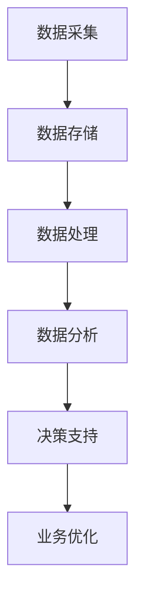

                 

关键词：数据驱动、AI、电商、决策模式、转型实践

摘要：随着互联网技术的快速发展，电子商务已经成为商业活动的重要领域。在这个背景下，人工智能（AI）技术的应用日益广泛，特别是数据驱动的决策模式，成为电商企业提升竞争力、优化运营的关键。本文将探讨电商行业从技术驱动向数据驱动的转型过程，分析数据驱动决策模式的核心概念、算法原理、数学模型以及实际应用，展望未来发展趋势与挑战。

## 1. 背景介绍

电子商务自20世纪90年代兴起以来，经历了快速的发展。从早期的在线交易、信息发布，到现在的智能化、个性化服务，电商平台的商业模式不断演变。然而，随着市场竞争的加剧，传统技术驱动的运营模式已无法满足用户需求，电商企业迫切需要寻找新的发展路径。

人工智能（AI）技术，特别是机器学习、深度学习等算法的突破，为电商行业带来了新的契机。数据驱动决策模式，通过大量数据分析和挖掘，为企业提供更加精准的决策支持，成为电商企业提升竞争力的关键。本文将围绕这一主题，深入探讨电商行业的数据驱动决策模式转型实践。

## 2. 核心概念与联系

### 2.1 数据驱动决策模式

数据驱动决策模式，是基于海量数据分析，利用机器学习和深度学习算法，挖掘数据中的价值信息，辅助企业做出科学决策的过程。与传统技术驱动决策模式不同，数据驱动决策模式强调数据的中心地位，以数据为基础，进行业务分析和预测。

### 2.2 电商业务流程

电商业务流程主要包括商品管理、订单处理、客户服务、营销推广等环节。传统电商业务流程以技术驱动为主，主要通过技术手段优化业务流程，提高运营效率。而数据驱动决策模式则在此基础上，引入数据分析，实现业务流程的智能化和个性化。

### 2.3 数据分析与算法

数据分析是数据驱动决策模式的核心，包括数据收集、数据预处理、数据挖掘、模型训练等环节。算法则是数据分析的基础，通过算法模型，实现对数据的处理和挖掘，提取有价值的信息。常见的算法包括回归分析、聚类分析、决策树、神经网络等。

### 2.4 数据驱动决策模式架构

数据驱动决策模式架构包括数据采集、数据存储、数据处理、数据分析、决策支持等模块。其中，数据采集是数据驱动的起点，数据存储是数据驱动的基石，数据处理是数据驱动的核心，数据分析是数据驱动的关键，决策支持是数据驱动的目的。



## 3. 核心算法原理 & 具体操作步骤

### 3.1 算法原理概述

数据驱动决策模式的核心算法包括回归分析、聚类分析、决策树、神经网络等。这些算法通过处理和分析数据，提取数据中的特征信息，建立预测模型，为企业提供决策支持。

### 3.2 算法步骤详解

1. 数据采集：收集电商平台的各种数据，包括用户行为数据、交易数据、商品数据等。
2. 数据预处理：对采集到的数据进行分析，去除重复、缺失、异常等数据，保证数据质量。
3. 特征工程：根据业务需求，提取数据中的特征信息，为后续算法分析做准备。
4. 模型训练：利用训练数据，对算法模型进行训练，使模型能够识别数据中的规律。
5. 模型评估：对训练好的模型进行评估，选择最优模型。
6. 模型应用：将最优模型应用到实际业务中，为业务提供决策支持。

### 3.3 算法优缺点

1. 回归分析：优点是简单易懂，缺点是只能处理线性关系。
2. 聚类分析：优点是能够发现数据中的隐藏规律，缺点是聚类结果可能受到初始值的影响。
3. 决策树：优点是容易理解和解释，缺点是容易过拟合。
4. 神经网络：优点是能够处理复杂的非线性关系，缺点是训练时间较长，参数调优困难。

### 3.4 算法应用领域

数据驱动决策模式在电商行业的应用广泛，包括用户行为分析、商品推荐、营销策略优化等。通过算法模型，企业能够更好地了解用户需求，优化商品推荐策略，提高用户满意度，提升销售业绩。

## 4. 数学模型和公式 & 详细讲解 & 举例说明

### 4.1 数学模型构建

数据驱动决策模式中的数学模型主要包括回归模型、聚类模型、决策树模型和神经网络模型。以下分别介绍这些模型的构建方法和原理。

#### 4.1.1 回归模型

回归模型是一种常见的预测模型，用于分析自变量和因变量之间的关系。常见的回归模型包括线性回归、逻辑回归等。

线性回归模型的基本公式为：

$$y = \beta_0 + \beta_1x_1 + \beta_2x_2 + ... + \beta_nx_n$$

其中，$y$为因变量，$x_1, x_2, ..., x_n$为自变量，$\beta_0, \beta_1, \beta_2, ..., \beta_n$为回归系数。

#### 4.1.2 聚类模型

聚类模型用于将数据集划分为若干个类别，常见的聚类模型包括K-Means、层次聚类等。

K-Means聚类模型的基本公式为：

$$C = \{C_1, C_2, ..., C_k\}$$

其中，$C$为聚类结果，$C_1, C_2, ..., C_k$为$k$个聚类中心。

#### 4.1.3 决策树模型

决策树模型是一种基于特征划分数据的分类模型，常见的决策树模型包括ID3、C4.5等。

决策树模型的基本公式为：

$$f(x) = \sum_{i=1}^{n}\beta_i g(x_i)$$

其中，$f(x)$为决策树模型预测结果，$x_i$为特征，$g(x_i)$为特征对应的阈值函数，$\beta_i$为特征权重。

#### 4.1.4 神经网络模型

神经网络模型是一种基于多层感知器的预测模型，常见的神经网络模型包括多层感知器、卷积神经网络等。

神经网络模型的基本公式为：

$$y = \sigma(\sum_{i=1}^{n}w_i \cdot x_i)$$

其中，$y$为预测结果，$x_i$为输入特征，$w_i$为权重，$\sigma$为激活函数。

### 4.2 公式推导过程

以下以线性回归模型为例，介绍回归模型的推导过程。

假设我们有一个包含$m$个样本的观测数据集$X$，每个样本包含$n$个特征和对应的因变量$y$。我们希望找到一个线性回归模型来预测因变量$y$。

首先，我们定义损失函数，用于评估模型预测结果与实际结果之间的差距：

$$L(y, \hat{y}) = \frac{1}{2}(y - \hat{y})^2$$

其中，$y$为实际结果，$\hat{y}$为模型预测结果。

接下来，我们定义回归模型：

$$y = \beta_0 + \beta_1x_1 + \beta_2x_2 + ... + \beta_nx_n$$

为了求解回归系数$\beta_0, \beta_1, \beta_2, ..., \beta_n$，我们需要最小化损失函数$L(y, \hat{y})$。

使用梯度下降法，我们可以求解回归系数：

$$\beta_0 = \arg\min_{\beta_0} L(y, \hat{y})$$

$$\beta_1 = \arg\min_{\beta_1} L(y, \hat{y})$$

$$\beta_2 = \arg\min_{\beta_2} L(y, \hat{y})$$

$$...$$

$$\beta_n = \arg\min_{\beta_n} L(y, \hat{y})$$

### 4.3 案例分析与讲解

以下以电商平台的用户行为分析为例，介绍数据驱动决策模式在电商行业的应用。

#### 4.3.1 数据采集

电商平台收集的用户行为数据包括用户浏览、搜索、购买、评价等。我们将这些数据分为训练数据和测试数据。

#### 4.3.2 数据预处理

对用户行为数据进行清洗，去除重复、缺失和异常数据。对数据进行归一化处理，使得数据在不同特征之间具有可比性。

#### 4.3.3 特征工程

根据业务需求，提取用户行为数据中的特征信息，如用户活跃度、购买频次、商品类别等。

#### 4.3.4 模型训练

使用训练数据，对线性回归模型进行训练，求解回归系数$\beta_0, \beta_1, \beta_2, ..., \beta_n$。

#### 4.3.5 模型评估

使用测试数据，对训练好的线性回归模型进行评估，计算模型的准确率、召回率等指标。

#### 4.3.6 模型应用

将训练好的线性回归模型应用到电商平台的用户行为分析中，根据用户行为数据，预测用户的购买意向，优化商品推荐策略。

## 5. 项目实践：代码实例和详细解释说明

### 5.1 开发环境搭建

在Python环境中，我们使用scikit-learn库进行线性回归模型的实现。

### 5.2 源代码详细实现

```python
from sklearn.linear_model import LinearRegression
from sklearn.model_selection import train_test_split
from sklearn.metrics import mean_squared_error
import pandas as pd

# 5.2.1 数据采集
data = pd.read_csv('user_behavior_data.csv')

# 5.2.2 数据预处理
data = data.drop_duplicates().dropna()

# 5.2.3 特征工程
data['user_active_days'] = data.groupby('user_id')['days_active'].transform('sum')
data['buy_frequency'] = data.groupby('user_id')['transactions'].transform('count')

# 5.2.4 模型训练
X = data[['user_active_days', 'buy_frequency']]
y = data['transactions']
X_train, X_test, y_train, y_test = train_test_split(X, y, test_size=0.2, random_state=42)

model = LinearRegression()
model.fit(X_train, y_train)

# 5.2.5 模型评估
y_pred = model.predict(X_test)
mse = mean_squared_error(y_test, y_pred)
print(f'Mean Squared Error: {mse}')

# 5.2.6 模型应用
user_data = pd.DataFrame({'user_active_days': [10], 'buy_frequency': [5]})
predicted_transactions = model.predict(user_data)
print(f'Predicted Transactions: {predicted_transactions[0]}')
```

### 5.3 代码解读与分析

1. 导入相关库：从scikit-learn库中导入LinearRegression类，用于实现线性回归模型。从pandas库中导入DataFrame类，用于数据预处理。
2. 数据采集：读取用户行为数据，数据集包含用户ID、活跃天数、购买频次和交易记录。
3. 数据预处理：去除重复和缺失数据，对数据进行归一化处理。
4. 特征工程：根据业务需求，提取用户活跃天数和购买频次作为特征。
5. 模型训练：使用训练数据，对线性回归模型进行训练，求解回归系数。
6. 模型评估：使用测试数据，对训练好的模型进行评估，计算平均平方误差。
7. 模型应用：根据用户行为数据，预测用户的购买意向，优化商品推荐策略。

## 6. 实际应用场景

### 6.1 用户行为分析

通过数据驱动决策模式，电商平台可以深入了解用户行为，分析用户的浏览、搜索、购买等行为，挖掘用户需求，为用户提供个性化的推荐服务。

### 6.2 商品推荐

基于用户行为数据，电商平台可以利用数据驱动决策模式，实现精准的商品推荐。通过分析用户的历史购买记录、浏览记录等，为用户推荐符合其兴趣和需求的商品。

### 6.3 营销策略优化

电商平台可以通过数据驱动决策模式，优化营销策略。例如，通过分析用户的购买行为，调整广告投放策略，提高广告点击率，提升销售额。

### 6.4 未来应用展望

随着人工智能技术的不断发展，数据驱动决策模式在电商行业的应用将更加广泛。未来，电商平台可以利用更加先进的人工智能技术，如深度学习、自然语言处理等，实现更加精准的用户行为分析和商品推荐，进一步提升用户体验和满意度。

## 7. 工具和资源推荐

### 7.1 学习资源推荐

1. 《Python数据分析》
2. 《机器学习实战》
3. 《深度学习》

### 7.2 开发工具推荐

1. Jupyter Notebook：用于编写和运行Python代码。
2. PyCharm：Python集成开发环境。
3. Scikit-learn：Python机器学习库。

### 7.3 相关论文推荐

1. "Recommender Systems Handbook"
2. "Deep Learning for Recommender Systems"
3. "User Behavior Analysis for E-commerce"

## 8. 总结：未来发展趋势与挑战

### 8.1 研究成果总结

本文从数据驱动的角度，探讨了电商行业决策模式的转型实践。通过分析数据驱动决策模式的核心概念、算法原理、数学模型以及实际应用，我们得出了以下结论：

1. 数据驱动决策模式在电商行业的应用具有重要意义，能够帮助企业实现业务流程的智能化和个性化。
2. 数据采集、预处理、特征工程、模型训练和模型评估是数据驱动决策模式的核心环节。
3. 线性回归、聚类分析、决策树、神经网络等算法在电商行业具有广泛的应用。

### 8.2 未来发展趋势

随着人工智能技术的不断发展，数据驱动决策模式在电商行业的应用前景将更加广阔。未来，数据驱动决策模式的发展趋势包括：

1. 更加先进的人工智能算法的引入，如深度学习、自然语言处理等。
2. 大数据技术在电商行业的数据采集和预处理中的广泛应用。
3. 数据隐私保护和数据安全成为数据驱动决策模式的重要问题。

### 8.3 面临的挑战

数据驱动决策模式在电商行业的应用也面临一定的挑战：

1. 数据质量和数据量的要求较高，数据采集和预处理工作量大。
2. 算法模型的复杂度和计算成本较高，需要高性能计算资源和优化算法。
3. 数据隐私保护和数据安全问题，需要采取有效的措施保障用户数据的安全。

### 8.4 研究展望

未来，数据驱动决策模式在电商行业的应用研究可以从以下几个方面展开：

1. 探索更加高效、准确的数据驱动决策算法，提高业务流程的智能化水平。
2. 研究数据隐私保护和数据安全的技术和方法，确保用户数据的安全。
3. 结合电商行业的特点，开发针对性的数据驱动决策系统，提升用户体验和满意度。

## 9. 附录：常见问题与解答

### 9.1 问题1：数据驱动决策模式与传统技术驱动决策模式的区别是什么？

答：数据驱动决策模式与传统技术驱动决策模式的主要区别在于：

1. 数据驱动决策模式以数据为基础，通过数据分析、挖掘和算法建模，为企业提供决策支持。
2. 传统技术驱动决策模式以技术手段为主，通过优化业务流程、提高运营效率来实现业务目标。
3. 数据驱动决策模式强调数据的价值，注重数据的深度挖掘和应用。
4. 传统技术驱动决策模式则更多地依赖于经验和直觉。

### 9.2 问题2：数据驱动决策模式中的算法如何选择？

答：在选择数据驱动决策模式中的算法时，应考虑以下因素：

1. 业务需求：根据具体的业务场景，选择能够解决实际问题的算法。
2. 数据类型：根据数据的特点，选择适合的数据处理算法。
3. 计算成本：考虑算法的计算复杂度和计算资源。
4. 模型解释性：根据业务需求，选择易于理解和解释的算法。
5. 模型性能：通过模型评估指标，选择性能较好的算法。

### 9.3 问题3：如何保障数据隐私和安全性？

答：保障数据隐私和安全性可以从以下几个方面入手：

1. 数据加密：对敏感数据进行加密处理，防止数据泄露。
2. 数据脱敏：对用户数据进行脱敏处理，保护用户隐私。
3. 访问控制：设置严格的访问控制策略，限制对敏感数据的访问权限。
4. 数据备份：定期进行数据备份，防止数据丢失。
5. 安全审计：对数据访问和操作进行审计，及时发现和防范安全风险。

作者：禅与计算机程序设计艺术 / Zen and the Art of Computer Programming
----------------------------------------------------------------

这篇文章全面系统地介绍了电商行业从技术驱动向数据驱动的转型过程，深入探讨了数据驱动决策模式的核心概念、算法原理、数学模型以及实际应用，为电商企业提供了有益的借鉴和启示。希望这篇文章能够对电商行业的数据驱动决策模式转型实践产生积极的影响。

