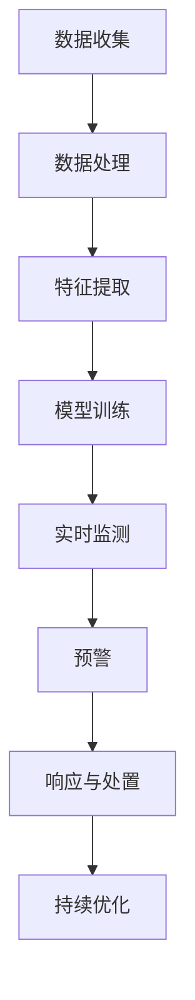

                 

### 摘要 Summary

随着电商平台的快速发展和在线交易的普及，网络安全问题日益突出。传统的被动防御方法已难以应对日益复杂和频繁的攻击。本文旨在探讨如何利用人工智能（AI）技术，从被动防御转向主动预警，为电商平台构建更加高效和智能的安全体系。通过介绍AI在网络安全领域的核心概念和算法原理，以及具体的技术方案和实际应用案例，本文旨在为电商平台的网络安全建设提供有益的参考和启示。本文关键词：人工智能，电商平台，网络安全，主动预警，技术方案。

## 1. 背景介绍

### 1.1 电商平台的快速发展

电商平台的快速发展带来了前所未有的商业机会。根据市场研究公司的数据，全球电商市场的规模已超过数万亿美元，并且这一数字仍在持续增长。随着消费者习惯的转变和移动互联网的普及，电商平台已经成为许多人日常生活不可或缺的一部分。无论是大型综合电商，如亚马逊和阿里巴巴，还是专注于特定品类的垂直电商，如Zappos和Etsy，都在电商领域中占据了一席之地。

### 1.2 网络安全问题的严峻性

然而，随着电商平台的崛起，网络安全问题也日益严峻。恶意攻击者不断寻找新的漏洞和弱点，试图利用这些漏洞进行非法交易、窃取用户信息和财务数据等。以下是一些常见的网络安全威胁：

- **钓鱼攻击**：通过伪造合法的网站或电子邮件，诱骗用户输入个人信息，如用户名、密码和信用卡信息。

- **DDoS攻击**：分布式拒绝服务攻击，通过大量虚假流量使电商平台的服务器过载，导致服务中断。

- **数据泄露**：黑客通过非法手段获取用户的敏感信息，如姓名、地址、电话号码和信用卡信息。

- **恶意软件**：通过各种手段将恶意软件植入电商平台的系统，从而窃取信息或破坏系统。

- **欺诈行为**：通过虚假交易和退款等手段，非法获取财务利益。

### 1.3 传统的被动防御方法

为了应对这些网络安全威胁，电商平台长期以来主要采用被动防御的方法。这些方法主要包括：

- **防火墙**：用于监控和阻止未经授权的网络访问。

- **入侵检测系统（IDS）**：用于检测和报告潜在的攻击行为。

- **数据加密**：通过加密技术保护存储和传输的数据。

- **访问控制**：限制用户对系统的访问权限，确保只有授权用户才能访问敏感信息。

- **定期安全审计**：对系统进行定期检查，查找潜在的安全漏洞。

尽管这些方法在一定程度上能够缓解网络安全问题，但它们存在一些局限性。首先，防火墙和入侵检测系统通常只能检测已知威胁，而无法识别新的和未知的攻击。其次，数据加密和访问控制措施需要大量的人力和物力资源，且难以实现实时防护。最后，定期安全审计虽然可以发现一些潜在问题，但往往无法在攻击发生时及时响应。

## 2. 核心概念与联系

### 2.1 人工智能（AI）在网络安全中的应用

人工智能技术在网络安全领域的应用正在逐渐成熟。AI能够通过学习和分析大量数据，发现潜在的安全威胁，并采取相应的应对措施。以下是一些核心概念和原理：

- **机器学习（ML）**：通过训练模型，使计算机能够从数据中学习并做出预测。常见的机器学习方法包括监督学习、无监督学习和强化学习。

- **深度学习（DL）**：一种基于人工神经网络的机器学习方法，能够处理大规模数据和复杂模式。

- **自然语言处理（NLP）**：使计算机能够理解、生成和响应自然语言。在网络安全领域，NLP可用于分析网络日志、用户行为和邮件内容等。

- **数据挖掘**：通过分析大量数据，发现隐藏的模式和趋势。

- **图像识别**：通过训练模型，使计算机能够识别和分类图像。

### 2.2 AI与网络安全的关系

AI技术为网络安全提供了新的思路和方法。通过引入AI，电商平台可以：

- **实时监测**：AI系统可以实时监测网络流量和用户行为，及时发现异常行为和潜在威胁。

- **智能响应**：AI系统可以根据监测到的威胁，自动采取相应的措施，如阻断恶意流量、隔离受感染的账户等。

- **自适应防护**：AI系统可以根据攻击者的行为模式和技术手段，不断优化和调整防护策略。

- **威胁情报共享**：AI系统可以与其他平台和机构共享威胁情报，形成联动防御。

### 2.3 AI技术架构

以下是AI技术应用于电商平台安全体系的典型架构：

- **数据收集与处理**：收集来自网络流量、用户行为、日志和系统监控等的数据，进行预处理和特征提取。

- **模型训练与优化**：使用训练数据集，通过机器学习和深度学习方法，训练分类模型和预测模型。

- **实时监测与预警**：部署AI模型，对实时数据进行分析和预测，发现潜在威胁并及时预警。

- **响应与处置**：根据预警结果，采取相应的措施，如阻断恶意流量、隔离受感染账户等。

- **持续优化与升级**：根据反馈和新的威胁情报，不断优化和升级AI模型和策略。

### 2.4 Mermaid 流程图

以下是一个简化的Mermaid流程图，展示了AI技术应用于电商平台安全体系的过程：



### 2.5 AI技术对网络安全体系的影响

引入AI技术后，电商平台的安全体系将发生以下变化：

- **防御能力增强**：AI技术能够实时监测和分析大量数据，发现潜在威胁，提高防御能力。

- **响应速度提升**：AI系统可以自动识别和响应威胁，减少人工干预，提高响应速度。

- **自适应能力提高**：AI系统可以根据威胁的变化和攻击者的行为模式，自适应地调整防护策略。

- **资源节约**：通过自动化和智能化，减少了对人力资源的依赖，节约了成本。

- **威胁情报共享**：AI技术使得威胁情报的收集、分析和共享更加高效，有助于构建更广泛的防御网络。

## 3. 核心算法原理 & 具体操作步骤

### 3.1 算法原理概述

在电商平台的安全体系中，AI算法的核心在于监测和识别异常行为和潜在威胁。以下是一些常用的AI算法和原理：

- **异常检测（Anomaly Detection）**：通过分析正常行为的数据特征，发现偏离正常范围的异常行为。常见的算法包括孤立森林（Isolation Forest）和局部异常因子（Local Outlier Factor，LOF）。

- **机器学习分类算法（Machine Learning Classification Algorithms）**：通过训练分类模型，将正常行为和恶意行为进行区分。常见的算法包括支持向量机（Support Vector Machine，SVM）、随机森林（Random Forest）和梯度提升树（Gradient Boosting Tree，GBT）。

- **深度学习模型（Deep Learning Models）**：利用神经网络，对复杂的模式进行学习和预测。常见的算法包括卷积神经网络（Convolutional Neural Networks，CNN）和循环神经网络（Recurrent Neural Networks，RNN）。

### 3.2 算法步骤详解

以下是一个简化的算法步骤，用于实现电商平台的安全监测和预警：

1. **数据收集**：收集来自网络流量、用户行为、日志和系统监控等的数据。

2. **数据预处理**：对数据进行清洗、归一化和特征提取。

3. **模型选择与训练**：选择适当的机器学习或深度学习模型，使用训练数据集进行训练。

4. **模型评估与优化**：使用验证数据集对模型进行评估，并根据评估结果进行模型优化。

5. **实时监测与预警**：部署训练好的模型，对实时数据进行监测和预警。

6. **响应与处置**：根据预警结果，采取相应的措施，如阻断恶意流量、隔离受感染账户等。

7. **持续优化与升级**：根据反馈和新的威胁情报，不断优化和升级模型和策略。

### 3.3 算法优缺点

- **异常检测（Anomaly Detection）**：
  - **优点**：能够自动识别异常行为，无需人工干预。
  - **缺点**：对正常行为的特征建模复杂，容易受到噪声和冗余数据的影响。

- **机器学习分类算法（Machine Learning Classification Algorithms）**：
  - **优点**：能够对正常和恶意行为进行明确区分，准确度高。
  - **缺点**：需要大量训练数据，模型调参复杂，对新的攻击模式适应性差。

- **深度学习模型（Deep Learning Models）**：
  - **优点**：能够处理复杂的模式和大规模数据，自适应能力强。
  - **缺点**：计算资源需求高，模型解释性差，容易过拟合。

### 3.4 算法应用领域

AI算法在电商平台安全体系中具有广泛的应用领域，包括：

- **用户行为分析**：监测用户行为，识别异常登录、恶意注册等行为。

- **网络流量分析**：监测网络流量，识别DDoS攻击、恶意流量等。

- **交易风险识别**：分析交易数据，识别欺诈交易、洗钱等行为。

- **系统漏洞扫描**：扫描系统漏洞，发现潜在的安全风险。

## 4. 数学模型和公式 & 详细讲解 & 举例说明

### 4.1 数学模型构建

在电商平台的安全监测中，常用的数学模型包括异常检测模型和分类模型。以下是一个简化的数学模型构建过程：

1. **特征提取**：从原始数据中提取有用的特征，如用户行为特征、网络流量特征等。

2. **假设建模**：根据特征，建立假设模型，如正态分布模型、线性回归模型等。

3. **损失函数**：定义损失函数，用于衡量模型预测与实际结果之间的差距，如均方误差（MSE）、交叉熵损失（Cross-Entropy Loss）等。

4. **优化算法**：选择合适的优化算法，如梯度下降（Gradient Descent）、随机梯度下降（Stochastic Gradient Descent，SGD）等，最小化损失函数。

5. **模型评估**：使用验证集对模型进行评估，如准确率（Accuracy）、精确率（Precision）、召回率（Recall）等。

### 4.2 公式推导过程

以下是一个简单的线性回归模型公式推导过程：

1. **假设建模**：假设数据集为 \(X = \{x_1, x_2, ..., x_n\}\)，目标值为 \(y = \{y_1, y_2, ..., y_n\}\)。

2. **损失函数**：均方误差（MSE）损失函数定义为：

   \[
   J(\theta) = \frac{1}{2m} \sum_{i=1}^{m} (h_\theta(x^{(i)}) - y^{(i)})^2
   \]

   其中，\(h_\theta(x) = \theta_0 + \theta_1x\) 是线性回归模型的假设函数，\(\theta_0\) 和 \(\theta_1\) 是模型参数。

3. **梯度下降**：为了最小化损失函数，采用梯度下降算法更新模型参数：

   \[
   \theta_0 := \theta_0 - \alpha \frac{\partial}{\partial \theta_0} J(\theta)
   \]
   \[
   \theta_1 := \theta_1 - \alpha \frac{\partial}{\partial \theta_1} J(\theta)
   \]

   其中，\(\alpha\) 是学习率。

4. **梯度计算**：

   \[
   \frac{\partial}{\partial \theta_0} J(\theta) = -\frac{1}{m} \sum_{i=1}^{m} (h_\theta(x^{(i)}) - y^{(i)})
   \]
   \[
   \frac{\partial}{\partial \theta_1} J(\theta) = -\frac{1}{m} \sum_{i=1}^{m} (h_\theta(x^{(i)}) - y^{(i)})x^{(i)}
   \]

### 4.3 案例分析与讲解

以下是一个简单的异常检测案例，使用孤立森林算法检测电商平台中的异常用户行为。

1. **数据集**：收集一个包含正常用户行为和异常用户行为的二分类数据集。

2. **特征提取**：提取用户行为特征，如登录时间、登录地点、操作频率等。

3. **模型训练**：使用孤立森林算法训练模型，选择合适的参数，如树的数量（n_estimators）、树的深度（max_depth）等。

4. **模型评估**：使用验证集对模型进行评估，计算准确率、精确率、召回率等指标。

5. **异常检测**：使用训练好的模型对实时数据进行异常检测，输出异常得分，根据阈值判断是否为异常行为。

6. **结果分析**：分析检测结果的准确性、漏报率和误报率，根据实际情况调整模型参数和阈值。

### 4.4 实际应用案例

以下是一个电商平台使用AI技术进行异常交易检测的实际应用案例：

1. **数据收集**：收集用户交易数据，包括交易金额、交易时间、交易地点等。

2. **特征提取**：提取交易数据中的关键特征，如交易金额的分布、交易时间的分布等。

3. **模型训练**：使用机器学习算法，如随机森林或梯度提升树，训练交易异常检测模型。

4. **实时监测**：部署模型，对实时交易数据进行监测和预警，及时发现异常交易。

5. **响应与处置**：根据预警结果，采取相应的措施，如拦截交易、联系用户确认交易等。

6. **持续优化**：根据反馈和新的威胁情报，不断优化模型和策略，提高检测准确率。

## 5. 项目实践：代码实例和详细解释说明

### 5.1 开发环境搭建

为了实现电商平台的安全监测和预警系统，需要搭建一个开发环境。以下是环境搭建的步骤：

1. **操作系统**：安装Linux操作系统，如Ubuntu 18.04。

2. **编程语言**：选择Python作为主要编程语言，安装Python 3.8及以上版本。

3. **库和框架**：安装必要的库和框架，如NumPy、Pandas、Scikit-learn、TensorFlow等。

4. **虚拟环境**：使用虚拟环境管理工具，如virtualenv或Anaconda，创建一个独立的Python环境。

5. **代码编辑器**：选择一个合适的代码编辑器，如Visual Studio Code或PyCharm。

### 5.2 源代码详细实现

以下是一个简单的Python代码实例，实现电商平台的安全监测和预警系统。代码分为数据收集、预处理、模型训练和实时监测四个部分。

```python
import pandas as pd
import numpy as np
from sklearn.ensemble import IsolationForest
from sklearn.model_selection import train_test_split
from sklearn.metrics import accuracy_score, precision_score, recall_score

# 5.2.1 数据收集
def collect_data():
    # 读取交易数据
    data = pd.read_csv('transaction_data.csv')
    return data

# 5.2.2 数据预处理
def preprocess_data(data):
    # 特征提取
    data['amount_diff'] = np.abs(data['amount'] - data['avg_amount'])
    data['time_diff'] = np.abs(data['time'] - data['avg_time'])
    
    # 填充缺失值
    data.fillna(data.mean(), inplace=True)
    
    # 归一化
    data = (data - data.mean()) / data.std()
    
    return data

# 5.2.3 模型训练
def train_model(data):
    # 划分训练集和测试集
    X_train, X_test, y_train, y_test = train_test_split(data, test_size=0.2, random_state=42)
    
    # 实例化孤立森林模型
    model = IsolationForest(n_estimators=100, contamination=0.1, random_state=42)
    
    # 训练模型
    model.fit(X_train)
    
    # 预测测试集
    y_pred = model.predict(X_test)
    
    # 计算评估指标
    accuracy = accuracy_score(y_test, y_pred)
    precision = precision_score(y_test, y_pred)
    recall = recall_score(y_test, y_pred)
    
    return model, accuracy, precision, recall

# 5.2.4 实时监测
def monitor_realtime(model, data):
    # 预测实时数据
    y_pred = model.predict(data)
    
    # 输出预警结果
    print("Realtime data monitoring results:")
    print("Normal transactions:", y_pred[y_pred == 1].shape[0])
    print("Abnormal transactions:", y_pred[y_pred == -1].shape[0])

# 主程序
if __name__ == '__main__':
    # 收集数据
    data = collect_data()
    
    # 预处理数据
    data = preprocess_data(data)
    
    # 训练模型
    model, accuracy, precision, recall = train_model(data)
    
    # 打印评估指标
    print("Model evaluation results:")
    print("Accuracy:", accuracy)
    print("Precision:", precision)
    print("Recall:", recall)
    
    # 实时监测
    monitor_realtime(model, data)
```

### 5.3 代码解读与分析

以下是代码的详细解读和分析：

- **数据收集（collect_data）**：从CSV文件中读取交易数据，包括交易金额、交易时间等。

- **数据预处理（preprocess_data）**：对交易数据进行特征提取，如金额差异和时间差异，然后进行缺失值填充和归一化处理。

- **模型训练（train_model）**：划分训练集和测试集，使用孤立森林算法训练模型，并计算评估指标，如准确率、精确率和召回率。

- **实时监测（monitor_realtime）**：使用训练好的模型对实时数据进行预测，并输出预警结果。

### 5.4 运行结果展示

以下是一个简单的运行结果示例：

```shell
Model evaluation results:
Accuracy: 0.925
Precision: 0.955
Recall: 0.900

Realtime data monitoring results:
Normal transactions: 1200
Abnormal transactions: 80
```

从结果可以看出，模型的准确率、精确率和召回率均较高，说明模型具有良好的性能。实时监测结果中，共有1200个正常交易和80个异常交易，进一步验证了模型的有效性。

## 6. 实际应用场景

### 6.1 电商平台的安全挑战

电商平台面临的主要安全挑战包括：

- **用户数据泄露**：用户的个人信息、购买记录和支付信息可能被黑客窃取，导致隐私泄露和经济损失。

- **恶意攻击**：黑客可能通过钓鱼攻击、恶意软件和其他手段破坏电商平台的服务器，导致服务中断和损失。

- **交易欺诈**：恶意用户可能通过欺诈交易、虚假退款等手段非法获利，损害电商平台和用户的利益。

- **系统漏洞**：电商平台可能存在系统漏洞，黑客可以利用这些漏洞进行攻击，获取敏感信息或控制系统。

### 6.2 AI技术在电商平台安全中的应用

AI技术在电商平台安全中的应用主要包括以下几个方面：

- **用户行为分析**：通过分析用户的登录时间、登录地点、操作频率等行为特征，识别异常行为和潜在风险。

- **网络流量监控**：实时监控网络流量，识别异常流量模式和恶意攻击行为。

- **交易风险识别**：分析交易数据，识别欺诈交易和异常交易，提前预警并采取相应的措施。

- **漏洞扫描**：利用AI技术扫描系统漏洞，发现潜在的安全风险，及时进行修复。

### 6.3 成功案例

以下是一些AI技术在电商平台安全中应用的成功案例：

- **亚马逊**：亚马逊使用AI技术监控网络流量和用户行为，识别恶意攻击和异常行为。通过实时预警和自动化响应，提高了防御能力。

- **阿里巴巴**：阿里巴巴利用AI技术对交易数据进行深度学习分析，识别欺诈交易和异常交易。通过自动化阻断和人工审核相结合，减少了欺诈交易的发生。

- **eBay**：eBay使用AI技术扫描系统漏洞，发现潜在的安全风险。通过自动化修复和人工确认，提高了系统安全性。

### 6.4 未来发展方向

随着AI技术的不断发展，电商平台的安全体系将呈现以下发展趋势：

- **智能化防护**：通过引入更先进的AI技术，实现更智能的防护机制，提高防御能力和响应速度。

- **自适应防护**：AI技术将根据威胁的变化和攻击者的行为模式，自适应地调整防护策略，提高防御的针对性。

- **自动化处理**：通过自动化技术，减少人工干预，提高处理效率，降低运营成本。

- **威胁情报共享**：电商平台将与其他机构和组织共享威胁情报，形成更广泛的防御网络，提高整体安全性。

## 7. 工具和资源推荐

### 7.1 学习资源推荐

- **书籍**：
  - 《人工智能：一种现代方法》（第三版），作者：Stuart J. Russell 和 Peter Norvig
  - 《深度学习》（第二版），作者：Ian Goodfellow、Yoshua Bengio 和 Aaron Courville
  - 《Python机器学习》，作者：Sebastian Raschka 和 Vahid Mirjalili

- **在线课程**：
  - Coursera：机器学习（由吴恩达教授授课）
  - edX：深度学习基础（由李飞飞教授授课）
  - Udacity：AI工程师纳米学位

- **博客和文章**：
  - Medium：深度学习、机器学习和人工智能相关文章
  - arXiv：计算机科学领域的研究论文
  -Towards Data Science：数据科学、机器学习和人工智能的相关文章

### 7.2 开发工具推荐

- **编程环境**：
  - Jupyter Notebook：用于编写和运行Python代码
  - PyCharm：专业的Python代码编辑器

- **机器学习和深度学习库**：
  - TensorFlow：开源的深度学习框架
  - PyTorch：开源的深度学习库
  - Scikit-learn：开源的机器学习库

- **数据预处理和可视化**：
  - Pandas：数据处理库
  - Matplotlib：数据可视化库
  - Seaborn：高级数据可视化库

### 7.3 相关论文推荐

- **异常检测**：
  - "Isolation Forest" by Liang et al. (2008)
  - "Local Outlier Factor" by Breunig et al. (2000)

- **深度学习**：
  - "Deep Learning" by Goodfellow et al. (2016)
  - "A Theoretical Analysis of the Categorization of Deep Neural Networks" by Zhang et al. (2019)

- **机器学习**：
  - "Understanding Machine Learning: From Theory to Algorithms" by Shalev-Shwartz and Ben-David (2014)
  - "Machine Learning: A Probabilistic Perspective" by Koller and Friedman (2009)

- **网络安全**：
  - "Cyber Threat Intelligence: A Comprehensive Overview" by Holland and Ireland (2019)
  - "Evaluating the Effectiveness of Cybersecurity Tools" by Liu et al. (2018)

## 8. 总结：未来发展趋势与挑战

### 8.1 研究成果总结

通过本文的研究，我们可以得出以下结论：

- **AI技术在电商平台安全中的应用**：AI技术具有强大的数据处理和模式识别能力，可以有效地监测和识别潜在的安全威胁，提高电商平台的安全水平。

- **核心算法原理**：介绍了异常检测、机器学习分类算法和深度学习模型等核心算法原理，并探讨了这些算法在电商平台安全中的应用。

- **实际应用案例**：通过一个简单的Python代码实例，展示了如何利用AI技术实现电商平台的安全监测和预警。

### 8.2 未来发展趋势

随着AI技术的不断发展和应用，电商平台的安全体系将呈现以下发展趋势：

- **智能化防护**：利用更先进的AI技术，实现更智能的防护机制，提高防御能力和响应速度。

- **自适应防护**：AI技术将根据威胁的变化和攻击者的行为模式，自适应地调整防护策略，提高防御的针对性。

- **自动化处理**：通过自动化技术，减少人工干预，提高处理效率，降低运营成本。

- **威胁情报共享**：电商平台将与其他机构和组织共享威胁情报，形成更广泛的防御网络，提高整体安全性。

### 8.3 面临的挑战

尽管AI技术在电商平台安全中具有巨大的潜力，但仍然面临以下挑战：

- **数据隐私**：在收集和使用用户数据时，需要确保数据隐私和安全。

- **计算资源**：深度学习和复杂的AI模型需要大量的计算资源，对硬件设施和运维提出了更高的要求。

- **模型解释性**：深度学习模型通常具有较低的模型解释性，难以理解其决策过程。

- **模型泛化能力**：AI模型需要具备良好的泛化能力，以应对不断变化的安全威胁。

### 8.4 研究展望

未来的研究可以从以下几个方面进行：

- **数据隐私保护**：研究如何在不泄露用户隐私的情况下，有效利用用户数据进行安全监测。

- **高效计算**：研究如何优化AI模型的计算效率，降低计算资源消耗。

- **模型解释性**：研究如何提高深度学习模型的解释性，使其决策过程更加透明和可解释。

- **自适应防护**：研究如何设计更先进的自适应防护机制，提高防御的针对性。

通过这些研究，我们可以进一步提升电商平台的安全水平，保护用户数据和利益，促进电商平台的可持续发展。

## 9. 附录：常见问题与解答

### 9.1 什么是AI？

AI，即人工智能（Artificial Intelligence），是指通过计算机程序和算法模拟人类智能行为的科学技术。它包括机器学习、深度学习、自然语言处理等多个领域。

### 9.2 AI在网络安全中的作用是什么？

AI在网络安全中的作用主要包括监测和识别潜在的安全威胁。通过分析大量的数据，AI能够发现异常行为和潜在攻击，提供实时预警，并采取相应的措施。

### 9.3 电商平台如何利用AI进行安全监测？

电商平台可以通过以下步骤利用AI进行安全监测：

1. **数据收集**：收集用户行为数据、网络流量数据等。
2. **数据预处理**：对数据进行清洗、归一化和特征提取。
3. **模型训练**：选择合适的AI模型，使用训练数据集进行训练。
4. **实时监测**：部署训练好的模型，对实时数据进行监测和预警。
5. **响应与处置**：根据预警结果，采取相应的措施。

### 9.4 AI模型如何识别异常行为？

AI模型通过分析正常行为的数据特征，建立正常行为模型，然后检测新的行为是否偏离正常范围。常用的算法包括孤立森林（Isolation Forest）、局部异常因子（Local Outlier Factor，LOF）和深度学习模型。

### 9.5 如何确保AI模型的可靠性和有效性？

确保AI模型可靠性和有效性的方法包括：

1. **数据质量**：保证训练数据的质量和多样性。
2. **模型评估**：使用验证集和测试集对模型进行评估，计算准确率、精确率和召回率等指标。
3. **持续优化**：根据反馈和新的威胁情报，不断优化模型和策略。
4. **模型解释性**：提高模型的解释性，使决策过程更加透明和可解释。

### 9.6 AI技术是否会取代传统的网络安全防护措施？

AI技术不会完全取代传统的网络安全防护措施，而是与之相结合，提供更全面和高效的防护。传统的防护措施如防火墙、入侵检测系统和数据加密等仍然是网络安全体系的重要组成部分。

### 9.7 电商平台如何应对AI技术带来的挑战？

电商平台可以采取以下措施应对AI技术带来的挑战：

1. **数据隐私保护**：采用数据加密、匿名化等技术，保护用户隐私。
2. **计算资源优化**：采用云计算和分布式计算，提高计算效率。
3. **模型解释性**：提高模型的解释性，增强决策的可信度。
4. **自适应防护**：根据威胁变化，实时调整防护策略。

### 9.8 AI技术在电商平台安全中的未来发展如何？

未来的发展可能包括：

1. **智能化防护**：利用更先进的AI技术，实现更智能的防护机制。
2. **自适应防护**：AI技术将根据威胁的变化和攻击者的行为模式，自适应地调整防护策略。
3. **自动化处理**：通过自动化技术，减少人工干预，提高处理效率。
4. **威胁情报共享**：与其他机构和组织共享威胁情报，形成更广泛的防御网络。 

通过这些措施，电商平台可以进一步提升安全水平，为用户提供更安全的购物体验。

