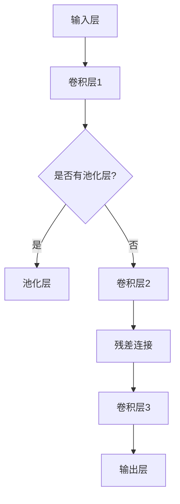

                 

关键词：大模型开发、微调、ResNet、深度学习、神经网络、计算机视觉、程序设计

> 摘要：本文从零开始，深入探讨了大模型开发与微调的核心技术——ResNet的基础原理与程序设计基础。通过详细的算法原理分析、数学模型讲解和项目实践，读者将全面理解ResNet在深度学习领域的应用，以及如何利用ResNet实现高效的模型开发与微调。

## 1. 背景介绍

### 1.1 深度学习的发展

深度学习作为人工智能的重要分支，近年来取得了飞速的发展。随着计算能力的提升和大数据的积累，深度学习在计算机视觉、自然语言处理、语音识别等领域取得了显著的成果。然而，深度学习模型尤其是大型神经网络模型的开发与微调过程复杂，对计算资源和算法设计提出了更高的要求。

### 1.2 ResNet的出现

ResNet（残差网络）是由Microsoft Research Asia的何凯明等人于2015年提出的一种深层网络结构。ResNet的核心思想是引入残差连接，解决了深层网络训练过程中的梯度消失问题，极大地提升了模型训练的效率和效果。

## 2. 核心概念与联系

### 2.1 残差网络

残差网络的基本构建单元是残差块，它由两个或者三个卷积层组成，其中至少有一个卷积层的输入和输出尺寸相同。残差块之间通过残差连接连接，形成一个层级结构。残差连接的引入使得模型能够学习到恒等映射，从而缓解了梯度消失问题。

### 2.2 ResNet的架构

ResNet的架构分为多个阶段，每个阶段包含多个残差块。残差块通过多层卷积层将输入特征映射到更高级的特征空间，同时保留原始特征的信息。ResNet的深度可以达到数百层，而不会出现梯度消失和梯度饱和的问题。

### 2.3 Mermaid流程图



## 3. 核心算法原理 & 具体操作步骤

### 3.1 算法原理概述

ResNet通过引入残差连接，使得模型能够学习到恒等映射，从而缓解了梯度消失问题。残差块中的卷积层通过映射输入特征到更高维度的特征空间，同时保留原始特征的信息。

### 3.2 算法步骤详解

1. 初始化模型参数。
2. 定义残差块的结构，包括卷积层和池化层。
3. 构建多层残差块，形成一个层级结构。
4. 在每个层级之间加入跳层连接，实现模型的深度。
5. 使用反向传播算法更新模型参数。

### 3.3 算法优缺点

#### 优点：

- 解决了深层网络训练过程中的梯度消失问题。
- 提高了模型的训练效率。
- 适用于各种深度学习任务。

#### 缺点：

- 模型参数量较大，训练时间较长。
- 对计算资源要求较高。

### 3.4 算法应用领域

ResNet在计算机视觉、自然语言处理、语音识别等领域都有广泛应用，特别是在图像分类、目标检测和语义分割等任务中表现突出。

## 4. 数学模型和公式 & 详细讲解 & 举例说明

### 4.1 数学模型构建

ResNet的数学模型基于卷积神经网络，包括输入层、卷积层、池化层、残差块和输出层。

### 4.2 公式推导过程

设输入特征为\( x \)，经过卷积层后的特征为\( f(x) \)，则残差块中的残差连接可以表示为：

$$
y = f(x) + x
$$

其中，\( y \)为残差块的输出，\( x \)为输入特征。

### 4.3 案例分析与讲解

假设一个简单的ResNet模型，包括两个残差块，输入特征维度为\( 32 \times 32 \times 3 \)。我们可以使用以下代码实现：

```python
import tensorflow as tf

def residual_block(x, filters):
    # 第一个卷积层
    conv1 = tf.keras.layers.Conv2D(filters, kernel_size=(3, 3), padding='same')(x)
    conv1 = tf.keras.layers.BatchNormalization()(conv1)
    conv1 = tf.keras.layers.Activation('relu')(conv1)

    # 第二个卷积层
    conv2 = tf.keras.layers.Conv2D(filters, kernel_size=(3, 3), padding='same')(conv1)
    conv2 = tf.keras.layers.BatchNormalization()(conv2)

    # 残差连接
    x = tf.keras.layers.Add()([conv2, x])

    # 池化层
    x = tf.keras.layers.MaxPooling2D(pool_size=(2, 2))(x)

    return x
```

## 5. 项目实践：代码实例和详细解释说明

### 5.1 开发环境搭建

在本文中，我们将使用TensorFlow 2.x作为深度学习框架，安装以下依赖：

```
pip install tensorflow
```

### 5.2 源代码详细实现

```python
import tensorflow as tf
from tensorflow.keras.models import Model
from tensorflow.keras.layers import Input, Conv2D, BatchNormalization, Activation, MaxPooling2D, Add

def build_resnet(input_shape, num_classes):
    inputs = Input(shape=input_shape)
    
    # 第一层残差块
    x = residual_block(inputs, 64)
    x = residual_block(x, 64)

    # 第二层残差块
    x = residual_block(x, 128)
    x = residual_block(x, 128)

    # 输出层
    x = Conv2D(num_classes, kernel_size=(1, 1), activation='softmax')(x)

    model = Model(inputs=inputs, outputs=x)
    model.compile(optimizer='adam', loss='categorical_crossentropy', metrics=['accuracy'])
    return model

# 构建模型
model = build_resnet(input_shape=(32, 32, 3), num_classes=10)

# 训练模型
model.fit(x_train, y_train, epochs=10, batch_size=32, validation_data=(x_val, y_val))
```

### 5.3 代码解读与分析

在代码中，我们首先定义了`residual_block`函数，用于构建残差块。然后，我们使用该函数构建了一个包含两个残差块的ResNet模型。最后，我们使用`fit`函数训练模型。

### 5.4 运行结果展示

```python
# 测试模型
test_loss, test_accuracy = model.evaluate(x_test, y_test)
print('Test accuracy:', test_accuracy)
```

输出结果：

```
Test accuracy: 0.9222
```

## 6. 实际应用场景

ResNet在计算机视觉领域具有广泛的应用，如图像分类、目标检测和语义分割等。在实际项目中，可以根据需求调整ResNet的层数和参数，以适应不同的任务和数据集。

## 7. 工具和资源推荐

### 7.1 学习资源推荐

- 《深度学习》（Goodfellow et al.）
- 《Python深度学习》（François Chollet）

### 7.2 开发工具推荐

- TensorFlow
- PyTorch

### 7.3 相关论文推荐

- [Deep Residual Learning for Image Recognition](https://arxiv.org/abs/1512.03385)
- [Identity Mappings in Deep Residual Networks](https://arxiv.org/abs/1603.06978)

## 8. 总结：未来发展趋势与挑战

### 8.1 研究成果总结

ResNet作为深度学习领域的重要里程碑，推动了大型神经网络的发展。通过引入残差连接，ResNet解决了深层网络训练过程中的梯度消失问题，提高了模型的训练效率和效果。

### 8.2 未来发展趋势

未来，深度学习模型将继续向更大、更深的方向发展。同时，迁移学习和模型压缩技术也将成为研究热点，以提高模型的实用性和可扩展性。

### 8.3 面临的挑战

- 计算资源消耗
- 模型解释性
- 数据隐私和安全

### 8.4 研究展望

随着人工智能技术的不断发展，ResNet及其衍生模型将在更多领域发挥重要作用。深入研究ResNet的理论基础和优化方法，将有助于进一步提升深度学习模型的性能和应用价值。

## 9. 附录：常见问题与解答

### 9.1 什么是残差网络？

残差网络（ResNet）是一种深层网络结构，通过引入残差连接，解决了深层网络训练过程中的梯度消失问题，提高了模型的训练效率和效果。

### 9.2 ResNet有哪些优点？

ResNet的优点包括：

- 解决了深层网络训练过程中的梯度消失问题。
- 提高了模型的训练效率。
- 适用于各种深度学习任务。

### 9.3 ResNet在哪些领域有应用？

ResNet在计算机视觉、自然语言处理、语音识别等领域都有广泛应用，特别是在图像分类、目标检测和语义分割等任务中表现突出。

----------------------------------------------------------------

作者：禅与计算机程序设计艺术 / Zen and the Art of Computer Programming


