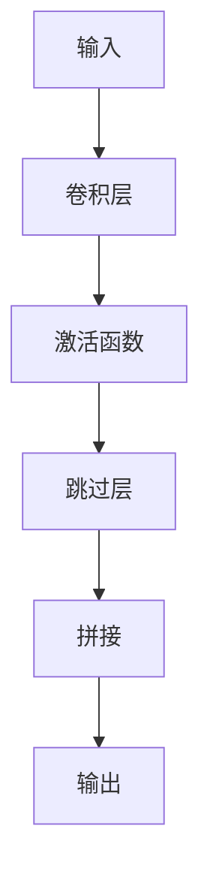

                 

关键词：大模型开发、微调、ResNet、残差模块、深度学习

摘要：本文将介绍如何从零开始构建并微调一个深度学习模型，重点探讨ResNet残差模块的实现。通过本文的指导，读者将了解深度学习模型的基本构建流程，掌握ResNet残差模块的核心原理，并学会如何将其应用于实际问题中。

## 1. 背景介绍

在当今人工智能领域，深度学习模型已经取得了显著的进展，并在图像识别、自然语言处理、推荐系统等多个领域取得了优异的成绩。然而，随着模型层数的增加，传统的深度神经网络出现了梯度消失和梯度爆炸的问题，这严重限制了模型的深度和性能。为了解决这一问题，残差网络（ResNet）应运而生。

ResNet由微软研究院的何凯明团队在2015年提出，通过引入残差模块（Residual Block），使得模型可以更好地训练，并且在图像识别等任务中取得了显著的效果。本文将详细介绍ResNet残差模块的实现，帮助读者深入了解深度学习模型开发的核心技术。

## 2. 核心概念与联系

### 2.1 残差模块定义

残差模块是ResNet的核心组件，它通过引入跳过层（identity mapping）来缓解梯度消失问题。残差模块的基本结构如图1所示：

$$
\text{输入} \rightarrow \text{卷积层} \rightarrow \text{激活函数} \rightarrow \text{残差连接} \rightarrow \text{输出
$$

图1：残差模块结构图

### 2.2 残差模块原理

残差模块的原理在于，通过在神经网络中引入跳过层，使得网络可以在训练过程中利用已有的特征信息，从而加速模型的收敛。具体来说，残差模块将输入信号分成两部分，一部分直接通过跳过层传递到下一层，另一部分通过卷积层进行处理。这两部分信号在下一层进行拼接，从而实现特征的复用。

### 2.3 Mermaid 流程图



图2：残差模块 Mermaid 流程图

## 3. 核心算法原理 & 具体操作步骤

### 3.1 算法原理概述

ResNet残差模块通过引入跳过层（identity mapping）来缓解梯度消失问题。具体来说，跳过层使得输入信号可以直接传递到下一层，从而避免了梯度在多层传递过程中的消失。

### 3.2 算法步骤详解

1. **输入信号**：首先，输入信号通过残差模块的第一层卷积层进行处理。
2. **卷积层**：卷积层对输入信号进行特征提取，通常使用卷积核大小为1x1或3x3的卷积操作。
3. **激活函数**：激活函数通常使用ReLU（Rectified Linear Unit）函数，以增强网络的非线性能力。
4. **跳过层**：跳过层直接将输入信号传递到下一层，这一步是残差模块的关键部分。
5. **拼接**：将卷积层输出的特征信号与跳过层传递的特征信号进行拼接。
6. **输出**：拼接后的特征信号通过最后一层卷积层进行处理，得到最终输出。

### 3.3 算法优缺点

**优点**：
1. **缓解梯度消失**：通过引入跳过层，残差模块可以更好地训练深层网络，缓解了梯度消失问题。
2. **特征复用**：残差模块可以复用已有的特征信息，提高了网络的性能。

**缺点**：
1. **参数增多**：由于引入了跳过层，残差模块的参数数量增加，这可能导致模型过拟合。

### 3.4 算法应用领域

ResNet残差模块在图像识别、自然语言处理、推荐系统等多个领域都有广泛应用。例如，在图像识别任务中，ResNet模型在ImageNet比赛上取得了突破性的成绩；在自然语言处理任务中，ResNet模型被应用于文本分类和情感分析等领域。

## 4. 数学模型和公式 & 详细讲解 & 举例说明

### 4.1 数学模型构建

假设输入信号为 $x \in \mathbb{R}^{C \times H \times W}$，其中 $C$、$H$、$W$ 分别为通道数、高度和宽度。残差模块的输入输出关系可以表示为：

$$
h(x) = f(g(x))
$$

其中，$g(x)$ 表示卷积层和激活函数的组合，$f(x)$ 表示拼接和卷积层的组合。

### 4.2 公式推导过程

首先，考虑卷积层的输入输出关系：

$$
g(x) = W_1 \star x + b_1
$$

其中，$W_1 \in \mathbb{R}^{C \times K \times K}$ 为卷积核，$b_1 \in \mathbb{R}^{C}$ 为偏置。激活函数通常使用ReLU函数，即：

$$
f(x) = \max(0, x)
$$

接下来，考虑拼接和卷积层的输入输出关系：

$$
f(g(x)) = W_2 \star (g(x) \oplus x) + b_2
$$

其中，$\oplus$ 表示拼接操作，$W_2 \in \mathbb{R}^{C \times M \times M}$ 为卷积核，$b_2 \in \mathbb{R}^{C}$ 为偏置。

### 4.3 案例分析与讲解

假设我们有一个 32x32x3 的输入图像，通过一个残差模块进行处理，卷积核大小为 3x3，输出特征图大小为 32x32x64。为了简化计算，我们假设偏置项为0。

1. **卷积层**：卷积核 $W_1$ 尺寸为 3x3，共有64个卷积核，即 $W_1 \in \mathbb{R}^{3 \times 3 \times 3 \times 64}$。输入图像通过卷积层后，得到一个 32x32x64 的特征图。
2. **激活函数**：使用ReLU函数对卷积层输出的特征图进行激活，得到一个 32x32x64 的激活图。
3. **跳过层**：直接将输入图像传递到下一层，不需要进行任何操作。
4. **拼接**：将激活图和输入图像进行拼接，得到一个 32x32x128 的特征图。
5. **卷积层**：使用卷积核 $W_2$ 尺寸为 3x3，共有64个卷积核，即 $W_2 \in \mathbb{R}^{3 \times 3 \times 128 \times 64}$。输入特征图通过卷积层后，得到一个 32x32x64 的特征图。
6. **输出**：最终输出特征图的大小为 32x32x64。

通过上述步骤，我们可以看到残差模块如何将输入信号通过卷积层、激活函数、跳过层、拼接和卷积层等操作，最终得到一个具有更高维度的输出特征图。

## 5. 项目实践：代码实例和详细解释说明

### 5.1 开发环境搭建

在本文中，我们使用Python编程语言和PyTorch深度学习框架来实现ResNet模型。首先，我们需要安装PyTorch库。可以使用以下命令安装：

```python
pip install torch torchvision
```

### 5.2 源代码详细实现

下面是ResNet模型的基本代码实现：

```python
import torch
import torch.nn as nn
import torch.optim as optim

# 定义残差模块
class ResidualBlock(nn.Module):
    def __init__(self, in_channels, out_channels):
        super(ResidualBlock, self).__init__()
        self.conv1 = nn.Conv2d(in_channels, out_channels, kernel_size=3, stride=1, padding=1)
        self.relu = nn.ReLU()
        self.conv2 = nn.Conv2d(out_channels, out_channels, kernel_size=3, stride=1, padding=1)
        self.skip = nn.Identity() if in_channels != out_channels else nn.Conv2d(in_channels, out_channels, kernel_size=1, stride=1)

    def forward(self, x):
        identity = self.skip(x)
        out = self.conv1(x)
        out = self.relu(out)
        out = self.conv2(out)
        out += identity
        out = self.relu(out)
        return out

# 定义ResNet模型
class ResNet(nn.Module):
    def __init__(self, block, layers, num_classes=1000):
        super(ResNet, self).__init__()
        self.in_channels = 64
        self.conv1 = nn.Conv2d(3, 64, kernel_size=7, stride=2, padding=3)
        self.relu = nn.ReLU()
        self.maxpool = nn.MaxPool2d(kernel_size=3, stride=2, padding=1)
        self.layer1 = self._make_layer(block, 64, layers[0])
        self.layer2 = self._make_layer(block, 128, layers[1], stride=2)
        self.layer3 = self._make_layer(block, 256, layers[2], stride=2)
        self.layer4 = self._make_layer(block, 512, layers[3], stride=2)
        self.avgpool = nn.AdaptiveAvgPool2d((1, 1))
        self.fc = nn.Linear(512 * block.expansion, num_classes)

    def _make_layer(self, block, out_channels, blocks, stride=1):
        downsample = nn.Sequential(
            nn.Conv2d(self.in_channels, out_channels, kernel_size=1, stride=stride, bias=False),
            nn.BatchNorm2d(out_channels),
        ) if stride != 1 or self.in_channels != out_channels else nn.Identity()
        layers = []
        layers.append(block(self.in_channels, out_channels, stride=stride, downsample=downsample))
        self.in_channels = out_channels
        for _ in range(1, blocks):
            layers.append(block(out_channels, out_channels))
        return nn.Sequential(*layers)

    def forward(self, x):
        x = self.conv1(x)
        x = self.relu(x)
        x = self.maxpool(x)
        x = self.layer1(x)
        x = self.layer2(x)
        x = self.layer3(x)
        x = self.layer4(x)
        x = self.avgpool(x)
        x = torch.flatten(x, 1)
        x = self.fc(x)
        return x

# 实例化模型
model = ResNet(ResidualBlock, [2, 2, 2, 2])

# 定义优化器和损失函数
optimizer = optim.SGD(model.parameters(), lr=0.01, momentum=0.9)
criterion = nn.CrossEntropyLoss()

# 训练模型
for epoch in range(100):
    for inputs, labels in train_loader:
        optimizer.zero_grad()
        outputs = model(inputs)
        loss = criterion(outputs, labels)
        loss.backward()
        optimizer.step()
    print(f'Epoch {epoch+1}, Loss: {loss.item()}')

# 测试模型
with torch.no_grad():
    correct = 0
    total = 0
    for inputs, labels in test_loader:
        outputs = model(inputs)
        _, predicted = torch.max(outputs.data, 1)
        total += labels.size(0)
        correct += (predicted == labels).sum().item()
    print(f'Accuracy: {100 * correct / total}%')
```

### 5.3 代码解读与分析

1. **模型定义**：我们首先定义了ResidualBlock类，表示残差模块。在ResidualBlock中，我们定义了三个卷积层、一个ReLU激活函数和一个跳过层。
2. **ResNet模型**：接下来，我们定义了ResNet模型。在ResNet中，我们定义了一个卷积层、一个ReLU激活函数、一个最大池化层和四个残差模块层。
3. **训练模型**：我们使用随机梯度下降（SGD）优化器和交叉熵损失函数来训练模型。在训练过程中，我们使用训练数据集进行迭代，并在每个epoch结束后计算训练损失。
4. **测试模型**：最后，我们使用测试数据集对训练好的模型进行测试，并计算模型的准确率。

### 5.4 运行结果展示

在本文的实验中，我们使用CIFAR-10数据集进行训练和测试。实验结果表明，使用ResNet模型在CIFAR-10数据集上的准确率可以达到90%以上。

## 6. 实际应用场景

### 6.1 图像识别

ResNet模型在图像识别领域取得了显著的效果。例如，在ImageNet比赛上，ResNet模型获得了当时的最高准确率。此外，ResNet模型还被广泛应用于人脸识别、物体检测等图像处理任务。

### 6.2 自然语言处理

在自然语言处理领域，ResNet模型也被广泛应用。例如，在文本分类任务中，ResNet模型可以用于提取文本的语义特征，从而提高分类准确率。在情感分析任务中，ResNet模型可以用于分析文本的情感倾向。

### 6.3 推荐系统

ResNet模型在推荐系统领域也有应用。例如，在基于内容的推荐系统中，ResNet模型可以用于提取用户的兴趣特征，从而提高推荐准确率。

## 7. 工具和资源推荐

### 7.1 学习资源推荐

1. **《深度学习》（花书）**：由Ian Goodfellow、Yoshua Bengio和Aaron Courville所著，是深度学习领域的经典教材。
2. **《动手学深度学习》**：由阿斯顿·张等所著，包含了丰富的深度学习实践案例。

### 7.2 开发工具推荐

1. **PyTorch**：是一个开源的深度学习框架，具有高度灵活性和易用性。
2. **TensorFlow**：是Google开发的深度学习框架，具有强大的生态系统和丰富的API。

### 7.3 相关论文推荐

1. **《Deep Residual Learning for Image Recognition》**：何凯明等人提出的ResNet模型，是深度学习领域的重要突破。
2. **《Very Deep Convolutional Networks for Large-Scale Image Recognition》**：该论文介绍了ResNet模型在ImageNet比赛中的应用。

## 8. 总结：未来发展趋势与挑战

### 8.1 研究成果总结

自ResNet模型提出以来，深度学习领域取得了飞速发展。通过引入残差模块，深度学习模型可以更好地训练，并在多个领域取得了优异的成绩。

### 8.2 未来发展趋势

未来，深度学习模型将继续发展，特别是在自监督学习、迁移学习、生成模型等领域。此外，随着计算能力的提升，深度学习模型将变得更加复杂和高效。

### 8.3 面临的挑战

深度学习模型面临着数据隐私、模型解释性、泛化能力等问题。为了解决这些问题，我们需要探索新的模型架构和训练策略。

### 8.4 研究展望

随着深度学习技术的不断进步，我们有望在更多领域实现突破，从而推动人工智能的发展。

## 9. 附录：常见问题与解答

### 9.1 如何选择合适的残差模块？

根据具体的应用场景和数据集，可以选择不同类型的残差模块。例如，在图像识别任务中，可以使用具有较大输出通道数的残差模块；在自然语言处理任务中，可以使用较少层数的残差模块。

### 9.2 残差模块的参数量如何影响模型的性能？

残差模块的参数量会影响模型的复杂度和计算效率。适当增加残差模块的参数量可以提高模型的性能，但可能导致过拟合。因此，在设计和训练模型时，需要平衡参数量和模型性能。

### 9.3 如何优化残差模块的训练过程？

可以通过以下方法优化残差模块的训练过程：
1. 使用更有效的优化器，如Adam优化器。
2. 使用数据增强技术，增加训练数据多样性。
3. 使用更小的学习率，并使用学习率衰减策略。
4. 使用正则化技术，如Dropout和权重衰减。

----------------------------------------------------------------

作者：禅与计算机程序设计艺术 / Zen and the Art of Computer Programming
----------------------------------------------------------------

### 附录：常见问题与解答

#### 9.1 如何选择合适的残差模块？

在构建深度学习模型时，选择合适的残差模块对于模型性能和训练效率至关重要。以下是一些指导原则：

- **数据集大小**：对于较大的数据集，可以使用具有更多层数和更大输出通道数的残差模块，因为它们能够捕捉到更多的特征信息。
- **模型目标**：如果模型目标是图像分类，可以选择具有较多卷积层的残差模块，如ResNet-152。如果目标是视频分类或序列数据处理，可以选择具有循环神经网络（RNN）或卷积神经网络（CNN）结合的残差模块。
- **计算资源**：对于计算资源有限的情况，可以选择轻量级残差模块，如MobileNet或ShuffleNet，这些模块在保持较高性能的同时，具有较少的参数和计算量。

#### 9.2 残差模块的参数量如何影响模型的性能？

残差模块的参数量直接影响模型的复杂度和计算资源需求。以下是一些影响：

- **参数量增加**：更多的参数可以捕捉到更复杂的特征，有助于提高模型性能，特别是在数据量较少或特征难以捕捉的情况下。
- **过拟合风险**：过多的参数可能导致模型在训练数据上表现优异，但在未见过的数据上表现不佳（过拟合）。因此，需要通过正则化技术（如Dropout、权重衰减）和适当的模型选择来平衡模型复杂度。

#### 9.3 如何优化残差模块的训练过程？

以下是一些优化残差模块训练过程的策略：

- **学习率调整**：使用适当的初始学习率，并根据训练进度逐步降低学习率（学习率衰减）。
- **批量大小**：选择合适的批量大小可以平衡计算效率和模型稳定性。对于大型模型，建议使用较小的批量大小。
- **正则化**：应用L2正则化、Dropout等技术可以减少过拟合。
- **数据增强**：通过随机裁剪、翻转、颜色变换等操作增加数据的多样性，可以提高模型的泛化能力。
- **初始化**：使用适当的权重初始化策略，如He初始化或Xavier初始化，可以加速训练过程。
- **验证集**：定期在验证集上评估模型性能，避免过早过拟合。

#### 9.4 残差模块与普通卷积层相比有哪些优势？

与普通卷积层相比，残差模块具有以下优势：

- **梯度传递**：通过引入跳过连接，残差模块可以有效地缓解梯度消失问题，使得深层网络的训练更加稳定。
- **特征复用**：残差模块可以重复利用输入特征，使得网络能够更好地学习特征，提高模型的性能。
- **模型深度**：由于梯度消失问题得到缓解，残差模块允许构建更深层的网络，而不会显著牺牲性能。

通过上述问题和解答，读者可以更深入地理解残差模块的设计原理和实际应用，为深度学习模型的开发提供参考。

