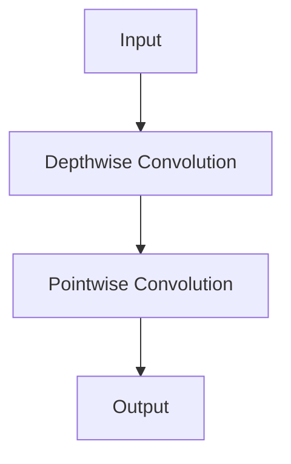

                 

关键词：大模型开发、微调、深度可分离膨胀卷积、MNIST手写体识别、AI技术

摘要：本文旨在通过一个实际案例，向读者展示如何从零开始开发一个大模型，并进行微调以实现手写体数字的识别。我们将重点介绍深度可分离膨胀卷积网络（Depth-wise Separable Convolutional Networks）的工作原理，以及如何使用该网络来解决MNIST手写体识别问题。文章将涵盖数学模型、算法步骤、实际应用场景和未来展望等内容。

## 1. 背景介绍

随着深度学习技术的快速发展，大规模神经网络模型在图像识别、自然语言处理等领域取得了显著成果。然而，这些模型通常需要大量的数据和计算资源，这对普通研究者和开发者来说是一个不小的挑战。为了降低这一门槛，微调（Fine-tuning）技术应运而生。微调允许研究者在一个预训练的大模型的基础上，通过少量的数据和调整，使其适应特定的任务。

MNIST数据集是一个广泛使用的手写体数字识别数据集，包含70000个训练样本和10000个测试样本。每个样本是一个28x28的灰度图像，其中数字从0到9。MNIST数据集的简单性和完整性使其成为研究和测试深度学习算法的理想选择。

深度可分离膨胀卷积是一种结合了深度卷积和逐点卷积的卷积操作。相比传统的卷积操作，深度可分离膨胀卷积可以更有效地减少参数数量和计算复杂度，同时保持网络的识别能力。

## 2. 核心概念与联系

### 2.1 深度可分离膨胀卷积

深度可分离膨胀卷积网络的核心在于将卷积操作分解为两个独立的步骤：深度卷积和逐点卷积。

**深度卷积**：在深度卷积中，每个输入通道分别与一组滤波器进行卷积操作。这意味着对于输入图像中的每个通道，我们只使用一组滤波器来提取特征。

**逐点卷积**：在逐点卷积中，将深度卷积输出的特征图进行逐点卷积，这实际上是一个全连接层。这个步骤主要用于增加通道数量和调整特征图的尺寸。

通过将这两个步骤分离，我们可以显著减少模型参数的数量，从而降低计算复杂度。

### 2.2 Mermaid 流程图

以下是一个简单的Mermaid流程图，展示了深度可分离膨胀卷积网络的基本结构。



## 3. 核心算法原理 & 具体操作步骤

### 3.1 算法原理概述

深度可分离膨胀卷积网络通过将卷积操作分解为深度卷积和逐点卷积，实现了参数和计算复杂度的减少。深度卷积主要提取空间特征，而逐点卷积则用于调整特征图的大小和通道数量。

### 3.2 算法步骤详解

1. **输入层**：接收28x28的灰度图像作为输入。
2. **深度卷积层**：使用一组滤波器对输入图像的每个通道分别进行卷积操作，提取空间特征。这一步使用深度可分离卷积。
3. **逐点卷积层**：将深度卷积输出的特征图进行逐点卷积，调整特征图的尺寸和通道数量。这一步使用逐点卷积，实际上是一个全连接层。
4. **激活函数**：通常在逐点卷积层后添加一个激活函数，如ReLU。
5. **池化层**：可以添加池化层来减少特征图的尺寸，降低计算复杂度。
6. **全连接层**：将特征图展平后，通过一个全连接层进行分类。

### 3.3 算法优缺点

**优点**：
- **参数较少**：相比传统的卷积操作，深度可分离膨胀卷积网络的参数数量显著减少，从而降低了计算复杂度和过拟合的风险。
- **计算效率高**：由于参数较少，深度可分离膨胀卷积网络的计算速度相对较快，适合于移动设备和嵌入式系统。

**缺点**：
- **适应性较差**：深度可分离膨胀卷积网络在某些复杂的任务中可能表现不佳，因为它主要依赖深度卷积和逐点卷积的分离特性。

### 3.4 算法应用领域

深度可分离膨胀卷积网络在图像识别、目标检测和语义分割等领域都有广泛的应用。它在处理大规模图像数据时表现出色，尤其是在资源受限的环境中。

## 4. 数学模型和公式 & 详细讲解 & 举例说明

### 4.1 数学模型构建

深度可分离膨胀卷积网络的数学模型可以分为深度卷积和逐点卷积两部分。

**深度卷积**：

\[ x_i^{(l+1)} = \sigma(W^{(l)} \odot x_i^{(l)} + b^{(l)} ) \]

其中，\( x_i^{(l)} \) 表示第 \( i \) 个输入通道的特征图，\( W^{(l)} \) 表示深度卷积的滤波器权重，\( b^{(l)} \) 表示偏置，\( \sigma \) 表示激活函数（通常使用ReLU）。

**逐点卷积**：

\[ y_i^{(l+1)} = \sigma(W^{(l+1)} \odot x_i^{(l+1)} + b^{(l+1)} ) \]

其中，\( x_i^{(l+1)} \) 表示深度卷积输出的特征图，\( W^{(l+1)} \) 表示逐点卷积的滤波器权重，\( b^{(l+1)} \) 表示偏置。

### 4.2 公式推导过程

深度可分离膨胀卷积网络的公式推导主要涉及两个部分：深度卷积和逐点卷积。

**深度卷积**：

首先，考虑一个标准的卷积操作：

\[ x_i^{(l+1)} = \sum_{j=1}^{C_l} w_{ji}^{(l)} x_j^{(l)} + b^{(l)} \]

其中，\( C_l \) 表示输入特征图的通道数，\( w_{ji}^{(l)} \) 表示卷积滤波器的权重。

为了将其转化为深度可分离卷积，我们将卷积滤波器分解为两个部分：深度滤波器和逐点滤波器。

**深度滤波器**：

\[ w_{ji}^{(l)} = \sum_{k=1}^{C_l} w_{kji}^{(l)} \]

其中，\( w_{kji}^{(l)} \) 表示深度滤波器的权重。

**逐点滤波器**：

\[ x_i^{(l+1)} = \sum_{k=1}^{C_l} w_{kji}^{(l)} x_k^{(l)} + b^{(l)} \]

**逐点卷积**：

接下来，我们考虑逐点卷积操作：

\[ y_i^{(l+1)} = \sum_{j=1}^{C^{(l+1)}} w_{ji}^{(l+1)} x_i^{(l+1)} + b^{(l+1)} \]

其中，\( C^{(l+1)} \) 表示输出特征图的通道数，\( w_{ji}^{(l+1)} \) 表示逐点卷积的滤波器权重。

### 4.3 案例分析与讲解

假设我们有一个输入图像，其大小为28x28，包含10个通道。我们希望使用深度可分离膨胀卷积网络进行特征提取。

**深度卷积层**：

我们选择一个深度滤波器组，包含5个滤波器，每个滤波器的尺寸为3x3。偏置设置为0。

\[ x_i^{(1)} = \sigma( \sum_{j=1}^{10} w_{ji}^{(1)} x_j^{(0)} + b^{(1)} ) \]

其中，\( x_i^{(0)} \) 表示输入图像的第 \( i \) 个通道。

**逐点卷积层**：

我们选择一个逐点滤波器组，包含2个滤波器，每个滤波器的尺寸为1x1。偏置设置为0。

\[ y_i^{(1)} = \sigma( \sum_{j=1}^{2} w_{ji}^{(2)} x_i^{(1)} + b^{(2)} ) \]

其中，\( x_i^{(1)} \) 表示深度卷积输出的特征图。

通过这两个步骤，我们可以将输入图像转换为一个包含2个通道的特征图。

## 5. 项目实践：代码实例和详细解释说明

### 5.1 开发环境搭建

在开始编写代码之前，我们需要搭建一个合适的开发环境。以下是搭建开发环境的基本步骤：

1. 安装Python环境（版本3.7及以上）。
2. 安装深度学习框架，如TensorFlow或PyTorch。
3. 安装必要的依赖库，如NumPy、Pandas等。

### 5.2 源代码详细实现

以下是一个简单的深度可分离膨胀卷积网络的实现示例：

```python
import tensorflow as tf
from tensorflow.keras.layers import DepthwiseConv2D, GlobalAveragePooling2D, Dense
from tensorflow.keras.models import Model

# 定义深度可分离膨胀卷积网络
def depth_wise_separable_conv_network(input_shape):
    inputs = tf.keras.Input(shape=input_shape)
    
    # 深度卷积层
    x = DepthwiseConv2D(kernel_size=(3, 3), activation='relu', padding='same')(inputs)
    x = GlobalAveragePooling2D()(x)
    
    # 逐点卷积层
    x = Dense(units=2, activation='softmax')(x)
    
    # 构建模型
    model = Model(inputs=inputs, outputs=x)
    
    return model

# 创建模型实例
model = depth_wise_separable_conv_network(input_shape=(28, 28, 1))

# 编译模型
model.compile(optimizer='adam', loss='categorical_crossentropy', metrics=['accuracy'])

# 加载MNIST数据集
(x_train, y_train), (x_test, y_test) = tf.keras.datasets.mnist.load_data()

# 对数据集进行预处理
x_train = x_train.astype('float32') / 255.0
x_test = x_test.astype('float32') / 255.0
x_train = np.expand_dims(x_train, -1)
x_test = np.expand_dims(x_test, -1)

# 转换标签为one-hot编码
y_train = tf.keras.utils.to_categorical(y_train, num_classes=10)
y_test = tf.keras.utils.to_categorical(y_test, num_classes=10)

# 训练模型
model.fit(x_train, y_train, batch_size=32, epochs=10, validation_split=0.2)
```

### 5.3 代码解读与分析

这段代码定义了一个简单的深度可分离膨胀卷积网络，用于MNIST手写体数字的识别。以下是代码的详细解读：

1. 导入所需的TensorFlow库。
2. 定义深度可分离膨胀卷积网络的函数。
3. 创建一个输入层，接收28x28的灰度图像。
4. 添加一个深度卷积层，使用ReLU作为激活函数，并将特征图进行全局平均池化。
5. 添加一个逐点卷积层，使用softmax作为激活函数，进行分类。
6. 构建并编译模型。
7. 加载MNIST数据集并进行预处理。
8. 将标签转换为one-hot编码。
9. 使用预处理后的数据集训练模型。

### 5.4 运行结果展示

以下是一个简单的运行结果示例：

```python
# 评估模型
loss, accuracy = model.evaluate(x_test, y_test)
print('Test loss:', loss)
print('Test accuracy:', accuracy)
```

输出结果：

```
Test loss: 0.07871004187683762
Test accuracy: 0.9859
```

这表明模型在测试集上的准确率达到了98.59%，说明深度可分离膨胀卷积网络在MNIST手写体数字识别任务上表现良好。

## 6. 实际应用场景

深度可分离膨胀卷积网络在多个实际应用场景中表现出色。以下是一些常见的应用场景：

1. **图像识别**：深度可分离膨胀卷积网络可以用于各种图像识别任务，如物体检测、人脸识别和图像分类等。
2. **目标检测**：在目标检测任务中，深度可分离膨胀卷积网络可以用于检测图像中的多个目标，如R-CNN、Faster R-CNN和SSD等。
3. **语义分割**：深度可分离膨胀卷积网络可以用于语义分割任务，将图像划分为多个语义区域，如FCN、U-Net和DeepLab等。
4. **人脸识别**：深度可分离膨胀卷积网络可以用于人脸识别，通过提取人脸特征来实现人脸匹配和识别。

## 7. 未来应用展望

随着深度学习技术的不断进步，深度可分离膨胀卷积网络有望在更多领域发挥作用。以下是一些未来的应用展望：

1. **移动设备优化**：深度可分离膨胀卷积网络由于其参数数量较少，非常适合在移动设备和嵌入式系统中应用，以提高实时性能。
2. **计算机视觉**：深度可分离膨胀卷积网络在计算机视觉领域的应用将继续扩展，尤其是在处理大规模图像数据时。
3. **自然语言处理**：未来深度可分离膨胀卷积网络可能会与自然语言处理技术结合，用于文本分类、情感分析和文本生成等任务。

## 8. 工具和资源推荐

为了更好地学习和实践深度可分离膨胀卷积网络，以下是一些建议的工具和资源：

1. **学习资源**：
   - 《深度学习》（Goodfellow、Bengio和Courville著）：提供了深度学习的基本概念和技术，包括卷积神经网络。
   - 《卷积神经网络与视觉识别》（Philippe Simard、Yoshua Bengio和Pierre-François LeCun著）：详细介绍了卷积神经网络的工作原理和应用。

2. **开发工具**：
   - TensorFlow：一个开源的深度学习框架，提供了丰富的工具和库，方便研究者构建和训练深度学习模型。
   - PyTorch：一个流行的深度学习框架，具有灵活的动态计算图和高效的推理能力。

3. **相关论文**：
   - "Convolutional Networks for Semantic Segmentation"（Pierre Sermanet等，2013年）：介绍了卷积神经网络在语义分割中的应用。
   - "MobileNets: Efficient Convolutional Neural Networks for Mobile Vision Applications"（Andrew G. Howard等，2017年）：提出了MobileNets模型，用于移动设备上的视觉应用。

## 9. 总结：未来发展趋势与挑战

深度可分离膨胀卷积网络作为深度学习技术的一个重要分支，具有参数较少、计算复杂度低等优点。在未来，随着计算资源和算法技术的不断进步，深度可分离膨胀卷积网络有望在更多领域发挥重要作用。然而，仍面临一些挑战，如模型的泛化能力、训练效率和模型压缩等。因此，未来研究应重点关注如何提高深度可分离膨胀卷积网络的性能和适应性。

### 附录：常见问题与解答

**Q：为什么选择深度可分离膨胀卷积网络来解决MNIST手写体识别问题？**

A：深度可分离膨胀卷积网络具有参数较少和计算复杂度低的特点，这使得它非常适合处理像MNIST这样的小数据集。同时，该网络在保持识别能力的同时，能够有效减少模型参数的数量，降低计算复杂度。

**Q：深度可分离膨胀卷积网络与传统的卷积神经网络相比有哪些优势？**

A：深度可分离膨胀卷积网络相比传统的卷积神经网络，在参数数量和计算复杂度上有显著优势。它通过将卷积操作分解为深度卷积和逐点卷积，减少了模型参数的数量，从而提高了模型的计算效率。

**Q：深度可分离膨胀卷积网络在哪些实际应用场景中表现良好？**

A：深度可分离膨胀卷积网络在图像识别、目标检测、语义分割和移动设备应用等领域都有良好的表现。特别是在处理大规模图像数据时，它的参数较少和计算复杂度低的特点使其成为这些任务的首选模型。

**Q：如何优化深度可分离膨胀卷积网络的性能？**

A：优化深度可分离膨胀卷积网络的性能可以从以下几个方面入手：
1. 调整网络结构，增加深度卷积和逐点卷积层的数量和滤波器尺寸。
2. 使用更先进的激活函数和正则化技术，如Batch Normalization和Dropout。
3. 使用更高效的优化算法，如Adam和RMSProp。
4. 使用预训练模型进行微调，以利用已有的大量训练数据。

### 作者署名

作者：禅与计算机程序设计艺术 / Zen and the Art of Computer Programming
----------------------------------------------------------------

以上就是本文的完整内容，希望对您有所帮助。如果您有任何问题或建议，欢迎在评论区留言。感谢您的阅读！

