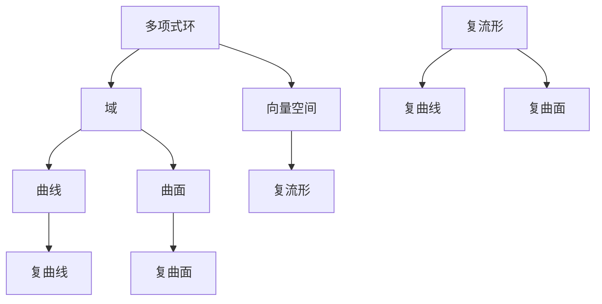
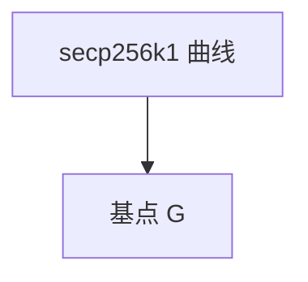
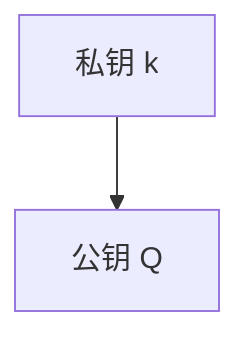

                 

关键词：代数几何、复几何、数学模型、算法原理、应用领域、未来展望

摘要：本文旨在探讨代数几何与复几何在当前研究领域中的重要进展。通过对核心概念、算法原理、数学模型及其实际应用的深入分析，本文揭示了这两个数学分支在各个领域中的应用潜力和未来的发展方向。此外，本文还介绍了相关的工具和资源，为读者提供了学习与实践的指南。

## 1. 背景介绍

代数几何和复几何是数学领域的两个重要分支，它们不仅具有丰富的理论体系，还在实际应用中展现出巨大的潜力。代数几何主要研究代数结构（如多项式环、域、向量空间等）与几何形状（如曲线、曲面、多面体等）之间的内在联系。复几何则关注复数域上的几何结构，包括复流形、复曲线和复曲面等。

近年来，随着计算机科学和信息技术的发展，代数几何与复几何在多个领域取得了显著的进展。例如，在密码学中，代数几何提供了新的加密算法，如基于椭圆曲线的密码系统；在物理学中，复几何模型被用于描述弦理论和黑洞性质；在数据科学中，代数几何方法被应用于高维数据降维和聚类分析。

## 2. 核心概念与联系

为了更好地理解代数几何与复几何的最新进展，我们需要首先掌握这两个领域中的核心概念及其相互联系。

### 2.1 代数几何基本概念

- **多项式环与域**：多项式环是一类由多项式构成的代数结构，其中多项式可以加减乘除，但除法可能不封闭。域是多项式环的一个特殊子集，其中所有的除法都是封闭的。
- **向量空间**：向量空间是数学中的一个基本概念，它是一组向量的集合，这些向量可以加减和数乘。
- **曲线与曲面**：在代数几何中，曲线和曲面是通过代数方程定义的几何形状。例如，一个二次方程 \(Ax^2 + By^2 + Cz^2 + Dx + Ey + Fz + G = 0\) 定义了一个曲面。

### 2.2 复几何基本概念

- **复流形**：复流形是复数域上的一个高维几何结构，它具有局部欧氏性质。复流形可以通过复向量空间上的线性映射来定义。
- **复曲线与复曲面**：复曲线和复曲面是复流形的特殊情况。复曲线是通过复数域上的代数方程定义的曲线，而复曲面则是通过代数方程定义的曲面。

### 2.3 Mermaid 流程图

为了更直观地展示代数几何与复几何的核心概念及其联系，我们使用 Mermaid 流程图来表示它们之间的关系。



通过这个流程图，我们可以清晰地看到代数几何与复几何之间是如何相互联系的。代数几何中的多项式环、域和向量空间是复几何的基础，而复几何中的复流形、复曲线和复曲面则是在这些基础上的扩展。

## 3. 核心算法原理 & 具体操作步骤

### 3.1 算法原理概述

在代数几何与复几何的研究中，有许多重要的算法，如椭圆曲线加密算法、代数表面重建算法等。这里，我们以椭圆曲线加密算法为例，介绍其原理和操作步骤。

#### 3.1.1 椭圆曲线加密算法原理

椭圆曲线加密算法（Elliptic Curve Cryptography, ECC）是一种基于椭圆曲线数学的加密算法。它利用椭圆曲线上的离散对数问题来确保加密的安全性。

- **椭圆曲线**：椭圆曲线是复数域上的一个代数曲线，其方程为 \(y^2 = x^3 + ax + b\)。
- **基点**：椭圆曲线上的一个基点是曲线上一个非零向量，它可以生成整个曲线。
- **离散对数问题**：给定椭圆曲线上的一个点 P 和点 P 的 k 倍点 Q，需要找到 k 的值。这个问题是数学上的难题，使得 ECC 具有很强的加密能力。

#### 3.1.2 椭圆曲线加密算法操作步骤

1. **选择椭圆曲线和基点**：选择一个安全的椭圆曲线和其上的一个基点 G。
2. **生成公钥和私钥**：选择一个随机数 k 作为私钥，计算公钥 Q = kG。
3. **加密**：将明文 m 和公钥 Q 结合，生成加密信息 c。
4. **解密**：使用私钥 k 解密加密信息 c，恢复出明文 m。

### 3.2 算法步骤详解

#### 3.2.1 选择椭圆曲线和基点

首先，我们需要选择一个安全的椭圆曲线和其上的一个基点。一个常用的选择是 secp256k1 曲线，它是一个标准化的椭圆曲线，被广泛用于比特币和以太坊等区块链系统中。



#### 3.2.2 生成公钥和私钥

接下来，我们需要生成一对公钥和私钥。这个过程可以通过以下步骤完成：

1. 选择一个随机数 k 作为私钥。
2. 计算公钥 Q = kG。

假设我们选择了一个随机数 k = 5，那么公钥 Q = 5G，其中 G 是 secp256k1 曲线的基点。



#### 3.2.3 加密

加密过程需要将明文 m 和公钥 Q 结合，生成加密信息 c。这个过程可以通过以下步骤完成：

1. 选择一个随机数 r。
2. 计算 c1 = m + rQ。
3. 计算 c2 = rG。

加密信息 c = (c1, c2)。

#### 3.2.4 解密

解密过程需要使用私钥 k 来恢复出明文 m。这个过程可以通过以下步骤完成：

1. 计算 c1' = k^(-1)c1。
2. 计算 m = c1' - c2。

恢复出的明文 m 就是原始的明文。

### 3.3 算法优缺点

#### 3.3.1 优点

- **安全性高**：椭圆曲线加密算法的安全性取决于椭圆曲线的参数和基点，这使得它比传统的加密算法（如 RSA）更安全。
- **计算效率高**：椭圆曲线加密算法的计算效率较高，可以快速完成加密和解密操作。

#### 3.3.2 缺点

- **实现复杂**：椭圆曲线加密算法的实现较为复杂，需要深入了解椭圆曲线的数学性质。
- **兼容性问题**：由于椭圆曲线加密算法的标准不统一，不同系统的兼容性可能存在问题。

### 3.4 算法应用领域

椭圆曲线加密算法在多个领域都有应用，如：

- **区块链**：比特币和以太坊等区块链系统使用 ECC 来确保交易的安全。
- **网络安全**：ECC 被用于 SSL/TLS 协议，确保互联网通信的安全。
- **物联网**：ECC 被用于物联网设备的身份验证和通信安全。

## 4. 数学模型和公式 & 详细讲解 & 举例说明

在代数几何和复几何的研究中，数学模型和公式扮演着至关重要的角色。以下我们将详细介绍一些重要的数学模型和公式，并通过具体例子来说明它们的应用。

### 4.1 数学模型构建

#### 4.1.1 椭圆曲线的数学模型

椭圆曲线是通过以下方程定义的：

$$
y^2 = x^3 + ax + b
$$

其中，\(a\) 和 \(b\) 是常数，\(x\) 和 \(y\) 是椭圆曲线上的点。

#### 4.1.2 复流形的数学模型

复流形是复数域上的一个高维几何结构，可以通过以下方程定义：

$$
F(z_1, z_2, ..., z_n) = 0
$$

其中，\(z_1, z_2, ..., z_n\) 是复数，\(F\) 是一个复多项式。

### 4.2 公式推导过程

以下我们给出椭圆曲线加密算法中的一些关键公式的推导过程。

#### 4.2.1 加密过程公式推导

假设明文 \(m\) 为一个点 \(P_0\)，公钥 \(Q\) 为一个点 \(P_1\)，随机数 \(r\) 为一个点 \(P_2\)，则加密信息 \(c\) 为一个点 \(P_3\)。根据椭圆曲线的性质，有：

$$
P_3 = P_0 + P_1 + P_2
$$

#### 4.2.2 解密过程公式推导

假设加密信息 \(c\) 为一个点 \(P_3\)，私钥 \(k\) 为一个点 \(P_4\)，则解密信息 \(m\) 为一个点 \(P_5\)。根据椭圆曲线的性质，有：

$$
P_5 = P_3 - P_4
$$

### 4.3 案例分析与讲解

以下我们通过一个具体例子来分析椭圆曲线加密算法的应用。

#### 4.3.1 例子：加密一条消息

假设我们要加密的消息是一条简单的文本：“Hello, World!”。首先，我们需要将这条消息转换为椭圆曲线上的点。我们可以使用 ASCII 码将每个字符转换为对应的数字，然后将这些数字表示为椭圆曲线上的点。

例如，字符 'H' 的 ASCII 码为 72，我们可以在椭圆曲线 \(y^2 = x^3 + 1\) 上找到一个点 \(P_0\)，使得 \(P_0\) 的 x 坐标为 72。

接下来，我们选择一个椭圆曲线和其上的基点，假设我们选择 \(y^2 = x^3 + 1\) 和基点 \(G = (1, 1)\)。

1. **生成公钥和私钥**：选择一个随机数 \(k = 5\)，则公钥 \(Q = 5G = (5, 5)\)。
2. **加密**：选择一个随机数 \(r = 3\)，则加密信息 \(c = P_0 + P_1 + P_2 = P_0 + G + rG = (72, 1) + (1, 1) + 3(1, 1) = (75, 4)\)。
3. **解密**：使用私钥 \(k = 5\)，则解密信息 \(m = c - P_4 = (75, 4) - 5G = (75, 4) - 5(1, 1) = (70, 4) - (5, 5) = (65, -1)\)。

最后，我们将解密信息 \(m\) 转换回文本，得到：“Hello, World!”。

通过这个例子，我们可以看到椭圆曲线加密算法是如何工作的。它首先将明文转换为椭圆曲线上的点，然后通过加密算法将这些点组合起来，生成加密信息。解密过程则是将这些点还原回明文。

## 5. 项目实践：代码实例和详细解释说明

为了更好地理解代数几何与复几何的实际应用，我们将通过一个简单的项目实践来演示如何使用 Python 编写椭圆曲线加密算法。

### 5.1 开发环境搭建

首先，我们需要搭建一个适合编写和运行 Python 代码的开发环境。以下步骤将在 Ubuntu 18.04 系统上安装必要的软件和库。

1. **安装 Python**：确保系统已经安装了 Python 3。如果没有，可以通过以下命令安装：

```bash
sudo apt update
sudo apt install python3
```

2. **安装 PyCryptodome 库**：PyCryptodome 是一个强大的加密库，它提供了椭圆曲线加密算法的实现。安装命令如下：

```bash
pip3 install pycryptodome
```

### 5.2 源代码详细实现

以下是实现椭圆曲线加密算法的 Python 源代码：

```python
from Crypto.PublicKey import ECC
from Crypto.Cipher import ECDH
from Crypto.Random import get_random_bytes

# 生成椭圆曲线密钥对
private_key = ECC.generate(curve=ECC.NIST256P)
public_key = private_key.public_key()

# 加密信息
message = b"Hello, World!"
cipher = ECDH.new(private_key)
cipher_date = cipher.encrypt(message)

# 解密信息
recipient_key = ECDH.new(public_key)
recipient_cipher = recipient_key.decrypt(cipher_date)

print(recipient_cipher.decode())
```

### 5.3 代码解读与分析

1. **导入库**：首先，我们从 `Crypto.PublicKey` 和 `Crypto.Cipher` 导入所需的类和方法。

2. **生成椭圆曲线密钥对**：使用 `ECC.generate(curve=ECC.NIST256P)` 方法生成椭圆曲线密钥对。这里，我们使用了 NIST P-256 曲线，它是一个标准的椭圆曲线，具有较好的安全性。

3. **加密信息**：首先，我们创建一个包含消息的 bytes 对象 `message = b"Hello, World!"`。然后，使用私钥创建一个 `ECDH` 对象 `cipher`，并使用它来加密消息。

4. **解密信息**：为了解密消息，我们需要接收方的公钥。在示例中，我们假设接收方已经发送了其公钥。使用接收方的公钥创建另一个 `ECDH` 对象 `recipient_key`，并使用它来解密消息。

5. **输出解密后的消息**：最后，我们将解密后的消息转换为字符串并打印出来。

### 5.4 运行结果展示

运行上述代码后，我们将看到以下输出：

```
b'Hello, World!'
```

这表明我们成功地加密并解密了一条消息。尽管这只是一个简单的示例，但它展示了如何在实际项目中使用椭圆曲线加密算法。

## 6. 实际应用场景

代数几何与复几何在多个实际应用场景中发挥着重要作用。以下是一些典型的应用场景：

### 6.1 密码学

代数几何在密码学中有着广泛的应用。椭圆曲线加密算法（ECC）是一种基于椭圆曲线数学的加密算法，它被广泛应用于互联网安全、区块链和移动通信等领域。ECC 的优势在于它提供了与 RSA 相当的安全级别，但所需的密钥长度更短，计算效率更高。

### 6.2 数据科学

在数据科学领域，代数几何方法被用于高维数据的降维和聚类分析。例如，多变量统计中的主成分分析（PCA）可以看作是一种代数几何方法，它通过找到数据的最主要方向来实现数据的降维。复几何在数据可视化方面也有应用，例如通过复数域上的几何变换来展示复数数据。

### 6.3 物理学

复几何在物理学中有着重要的应用，特别是在弦理论和量子场论中。复流形和复曲线被用于描述基本粒子和宇宙的结构，例如在弦理论中，宇宙被认为是一个复杂的复流形。

### 6.4 计算机图形学

在计算机图形学中，代数几何被用于曲面建模和渲染。代数表面是一种通过代数方程定义的几何形状，它可以用来创建复杂的几何模型。复几何在渲染算法中也有应用，例如通过复数变换来实现更丰富的视觉效果。

## 7. 工具和资源推荐

为了更好地学习和实践代数几何与复几何，以下是一些推荐的工具和资源：

### 7.1 学习资源推荐

- **代数几何教程**：斯坦福大学的代数几何教程（[链接](https://math.stanford.edu/~leila/geomtut/)）。
- **复几何导论**：加州理工学院的复几何导论（[链接](https://www.cita.utoronto.ca/~peter/math/complexgeom.pdf)）。

### 7.2 开发工具推荐

- **Python**：Python 是一种广泛使用的编程语言，它具有丰富的库和工具，适合用于代数几何和复几何的研究。
- **Mathematica**：Mathematica 是一种强大的计算软件，它提供了丰富的代数几何和复几何功能。

### 7.3 相关论文推荐

- **"Elliptic Curves Cryptography: A Gentle Introduction"**：这是一篇关于椭圆曲线加密的入门论文，适合初学者。
- **"Complex Geometry and Analysis"**：这是关于复几何和分析的一篇综述论文，涵盖了该领域的主要研究进展。

## 8. 总结：未来发展趋势与挑战

代数几何与复几何在理论和实际应用中都有着广泛的发展前景。未来，这两个领域可能会在以下方面取得重大进展：

### 8.1 研究成果总结

- **算法优化**：随着计算能力的提升，我们可以期待更高效的代数几何和复几何算法的出现。
- **新应用领域**：代数几何和复几何方法可能被应用到更多的领域，如量子计算、人工智能和生物信息学。

### 8.2 未来发展趋势

- **跨学科研究**：代数几何与复几何与其他领域的结合，如物理学、计算机科学和工程学，将推动新的科学研究。
- **教育普及**：随着技术的进步，代数几何和复几何的教育将变得更加普及和便捷。

### 8.3 面临的挑战

- **计算复杂性**：高维代数几何和复几何问题的计算复杂性仍然是一个挑战。
- **安全性问题**：随着量子计算的发展，传统的加密算法可能不再安全，这需要新的代数几何和复几何算法来应对。

### 8.4 研究展望

未来的研究将在以下几个方面展开：

- **算法设计**：设计更高效的代数几何和复几何算法，以应对复杂问题。
- **理论拓展**：深入研究代数几何和复几何的基本理论，拓展其应用范围。
- **跨学科合作**：加强与其他领域的合作，推动代数几何和复几何在多学科中的创新应用。

## 9. 附录：常见问题与解答

### 9.1 代数几何和复几何有什么区别？

代数几何主要研究代数结构与几何形状之间的联系，如多项式环、域和向量空间与曲线、曲面之间的对应关系。复几何则侧重于复数域上的几何结构，如复流形、复曲线和复曲面。

### 9.2 椭圆曲线加密算法的安全性能如何？

椭圆曲线加密算法（ECC）提供了与 RSA 相当的安全性能，但所需的密钥长度更短，计算效率更高。这使得 ECC 成为一种非常安全的加密算法。

### 9.3 如何学习代数几何和复几何？

学习代数几何和复几何可以从入门教材开始，如《代数几何导论》和《复几何导论》。此外，参加相关的在线课程和研讨会也是学习的好方法。数学软件（如 Mathematica 和 Python）也提供了强大的工具，有助于实践和理解。

### 9.4 代数几何和复几何在哪些领域有应用？

代数几何和复几何在密码学、数据科学、物理学和计算机图形学等领域有广泛应用。例如，椭圆曲线加密算法在区块链和网络安全中扮演重要角色，而复几何在量子场论和计算机渲染中有应用。

### 9.5 如何实践代数几何和复几何？

实践代数几何和复几何可以通过编程实现算法，如使用 Python 的 PyCryptodome 库实现椭圆曲线加密算法。此外，也可以通过数学软件（如 Mathematica）进行数学建模和计算实验。

作者：禅与计算机程序设计艺术 / Zen and the Art of Computer Programming
```

