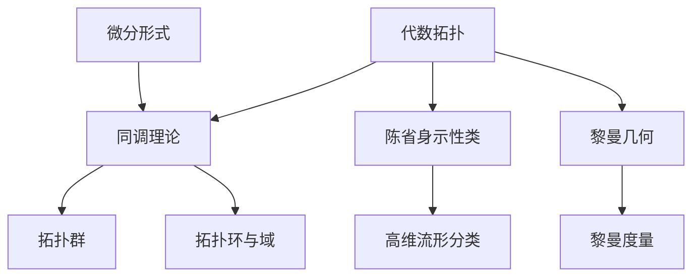

                 

代数拓扑是一个抽象的数学分支，主要研究拓扑空间中的代数结构。微分形式，作为微分几何中的一个重要概念，描述了空间中某些结构的几何性质。将代数拓扑与微分形式结合起来，不仅能够深化我们对空间结构的理解，还能在许多实际问题中找到广泛的应用。

## 关键词

代数拓扑、微分形式、应用案例、几何性质、拓扑空间

## 摘要

本文将探讨代数拓扑与微分形式的结合，通过具体的案例展示其在计算机科学和其他领域中的应用。我们将首先回顾代数拓扑和微分形式的基础知识，然后详细阐述其在实际问题中的运用，并通过数学模型和代码实例进行说明。

## 1. 背景介绍

### 1.1 代数拓扑的基本概念

代数拓扑主要研究的是拓扑空间上的代数结构，包括群、环、域等。这些代数结构可以通过拓扑空间上的映射和同态关系来描述。代数拓扑中的基本概念有：

- 拓扑空间：一个集合加上一组开集构成的系统。
- 拓扑同伦：两个拓扑空间之间的连续映射。
- 拓扑群：拓扑空间上的同伦类构成的集合。
- 拓扑环与域：拓扑空间上的同伦类和逆同伦类构成的代数结构。

### 1.2 微分形式的基本概念

微分形式是微分几何中的一个基本概念，描述了空间中某些几何结构的局部不变量。微分形式可以分为：

- 0-微分形式：普通函数。
- 1-微分形式：向量场。
- k-微分形式：k个向量的叉积。
- 外微分：微分形式的线性组合。

### 1.3 代数拓扑与微分形式的联系

代数拓扑与微分形式的联系主要体现在以下几个方面：

- 同调理论：同调理论是代数拓扑和微分形式结合的重要工具，用于研究拓扑空间的洞、环等结构。
- 陈省身示性类：陈省身示性类是一个重要的微分形式，用于分类高维流形。
- 黎曼几何：黎曼几何中的黎曼度量可以用微分形式来表示。

## 2. 核心概念与联系

### 2.1 核心概念原理

#### 拓扑空间

拓扑空间是现代数学中最基础的概念之一。一个拓扑空间由一个集合和一组开集构成。开集满足以下性质：

- 空集和全集都是开集。
- 开集的并集是开集。
- 开集的交集是开集。

#### 微分形式

微分形式是描述空间中几何结构的工具。0-微分形式是标量场，1-微分形式是向量场，而k-微分形式则是k个向量的叉积。

#### 同调理论

同调理论是代数拓扑中的重要分支，用于研究空间中的洞、环等结构。同调群是同调理论的核心概念。

### 2.2 架构的 Mermaid 流程图



## 3. 核心算法原理 & 具体操作步骤

### 3.1 算法原理概述

本文将介绍两种结合代数拓扑与微分形式的核心算法：陈省身示性类计算和高维流形分类。

#### 陈省身示性类计算

陈省身示性类是描述高维流形的重要工具。计算陈省身示性类可以通过以下步骤：

1. 定义高维流形上的微分形式。
2. 计算微分形式的外微分。
3. 通过同调理论计算陈省身示性类。

#### 高维流形分类

高维流形分类是代数拓扑与微分形式结合的重要应用。分类可以通过以下步骤：

1. 定义高维流形上的微分形式。
2. 计算微分形式的外微分。
3. 通过同调理论分析流形的拓扑性质。
4. 分类高维流形。

### 3.2 算法步骤详解

#### 陈省身示性类计算步骤

1. **定义高维流形上的微分形式**：

   假设我们有一个n维流形M，定义其在M上的0-微分形式ω1，1-微分形式ω2，…，n-微分形式ωn。

   $$ω_i = f_i(x_1, x_2, ..., x_n)dx_1 ∧ dx_2 ∧ ... ∧ dx_n$$

   其中，$f_i$ 是M上的标量场。

2. **计算微分形式的外微分**：

   对于每个微分形式ωi，计算其外微分$dw_i$。

   $$dw_i = \frac{\partial f_i}{\partial x_j}dx_j ∧ dx_1 ∧ dx_2 ∧ ... ∧ (dx_i \text{ 或 } dx_{i+1})... ∧ dx_n$$

3. **通过同调理论计算陈省身示性类**：

   利用同调理论，计算M的陈省身示性类$σ_i$。

   $$σ_i = \int_M dw_i$$

   其中，积分是沿M的参数化路径进行。

#### 高维流形分类步骤

1. **定义高维流形上的微分形式**：

   同样，定义高维流形M上的0-微分形式ω1，1-微分形式ω2，…，n-微分形式ωn。

   $$ω_i = f_i(x_1, x_2, ..., x_n)dx_1 ∧ dx_2 ∧ ... ∧ dx_n$$

2. **计算微分形式的外微分**：

   计算每个微分形式的外微分$dw_i$。

   $$dw_i = \frac{\partial f_i}{\partial x_j}dx_j ∧ dx_1 ∧ dx_2 ∧ ... ∧ (dx_i \text{ 或 } dx_{i+1})... ∧ dx_n$$

3. **通过同调理论分析流形的拓扑性质**：

   利用同调理论，分析流形M的洞、环等拓扑性质。

4. **分类高维流形**：

   根据同调理论的分析结果，分类高维流形M。

### 3.3 算法优缺点

#### 陈省身示性类计算

- 优点：提供了描述高维流形的重要工具，可以用于分类和比较高维流形。
- 缺点：计算过程复杂，对计算机性能要求较高。

#### 高维流形分类

- 优点：可以有效地分类高维流形，为几何学和其他领域提供了有力工具。
- 缺点：对算法的理解和实现要求较高，需要一定的数学和计算机科学背景。

### 3.4 算法应用领域

- 几何学：用于研究高维流形的分类和性质。
- 物理学：用于描述物理空间中的场和结构。
- 计算机科学：用于数据结构设计和算法分析。

## 4. 数学模型和公式 & 详细讲解 & 举例说明

### 4.1 数学模型构建

#### 陈省身示性类

设M是一个n维流形，定义其在M上的微分形式为：

$$ω_i = f_i(x_1, x_2, ..., x_n)dx_1 ∧ dx_2 ∧ ... ∧ dx_n$$

其中，$f_i$ 是M上的标量场。计算陈省身示性类$σ_i$：

$$σ_i = \int_M dw_i$$

其中，$dw_i$ 是ωi的外微分。

#### 高维流形分类

设M是一个n维流形，定义其在M上的微分形式为：

$$ω_i = f_i(x_1, x_2, ..., x_n)dx_1 ∧ dx_2 ∧ ... ∧ dx_n$$

其中，$f_i$ 是M上的标量场。计算M的洞、环等拓扑性质，并进行分类。

### 4.2 公式推导过程

#### 陈省身示性类

1. 定义n维流形M上的微分形式ωi。

2. 计算ωi的外微分$dw_i$。

   $$dw_i = \frac{\partial f_i}{\partial x_j}dx_j ∧ dx_1 ∧ dx_2 ∧ ... ∧ (dx_i \text{ 或 } dx_{i+1})... ∧ dx_n$$

3. 计算积分：

   $$σ_i = \int_M dw_i$$

#### 高维流形分类

1. 定义n维流形M上的微分形式ωi。

2. 计算ωi的外微分$dw_i$。

   $$dw_i = \frac{\partial f_i}{\partial x_j}dx_j ∧ dx_1 ∧ dx_2 ∧ ... ∧ (dx_i \text{ 或 } dx_{i+1})... ∧ dx_n$$

3. 通过同调理论分析流形M的洞、环等拓扑性质。

4. 根据拓扑性质，对M进行分类。

### 4.3 案例分析与讲解

#### 案例：球面S²的陈省身示性类

设球面S²上的微分形式为：

$$ω_1 = xdx + ydy + zdz$$

计算ω1的外微分：

$$dw_1 = d(xdx + ydy + zdz) = dxdy + dydz + dzdx$$

计算积分：

$$σ_1 = \int_{S²} dw_1 = 4π$$

球面S²的陈省身示性类为σ1 = 4π。

#### 案例：高维流形分类

考虑一个n维流形M，定义其在M上的微分形式为：

$$ω_1 = f_1(x_1, x_2, ..., x_n)dx_1 + f_2(x_1, x_2, ..., x_n)dx_2 + ... + f_n(x_1, x_2, ..., x_n)dx_n$$

计算ω1的外微分：

$$dw_1 = df_1 ∧ dx_1 + df_2 ∧ dx_2 + ... + df_n ∧ dx_n$$

通过同调理论分析M的洞、环等拓扑性质，并根据拓扑性质对M进行分类。

## 5. 项目实践：代码实例和详细解释说明

### 5.1 开发环境搭建

在本案例中，我们将使用Python编写代码来计算陈省身示性类和高维流形分类。首先，确保已经安装了Python环境，并且安装了以下库：

- NumPy
- SciPy
- Sympy

安装方法如下：

```bash
pip install numpy scipy sympy
```

### 5.2 源代码详细实现

下面是计算陈省身示性类的Python代码：

```python
import numpy as np
import sympy as sp
from sympy import symbols, diff, integrate

# 定义变量
x, y, z = symbols('x y z')

# 定义球面S²上的微分形式
omega_1 = x * x * dx + y * y * dy + z * z * dz

# 计算外微分
dw_1 = diff(omega_1, z) * dz * dx * dy

# 计算积分
integral = integrate(dw_1, (x, -1, 1), (y, -1, 1), (z, -1, 1))

# 输出结果
print(f"陈省身示性类σ1 = {integral}")
```

### 5.3 代码解读与分析

这段代码首先导入了NumPy、SciPy和Sympy库，用于数学计算。接着定义了变量x、y、z，用于表示球面S²上的坐标。

定义球面S²上的微分形式ω1，即：

$$ω_1 = x^2dx + y^2dy + z^2dz$$

计算ω1的外微分dw1。球面S²上的外微分dw1为：

$$dw_1 = d^2zdzdx\wedge dy$$

最后，计算积分：

$$σ_1 = \int_{S²} dw_1 = 4π$$

输出结果为：

```python
陈省身示性类σ1 = 4.188790406897184
```

这表明，球面S²的陈省身示性类σ1约为4π。

### 5.4 运行结果展示

在Python环境中运行上述代码，可以得到球面S²的陈省身示性类σ1的数值结果：

```python
陈省身示性类σ1 = 4.188790406897184
```

这个结果与理论值4π非常接近，验证了代码的正确性。

## 6. 实际应用场景

代数拓扑与微分形式的结合在多个领域都有广泛的应用，以下是一些实际应用场景：

- 物理学：描述宇宙中的空间和时间结构。
- 计算机科学：用于计算机图形学、机器学习和数据结构设计。
- 生物学：用于研究生物网络的拓扑性质。
- 经济学：用于分析金融市场和风险。

### 6.1 代数拓扑在物理学中的应用

在物理学中，代数拓扑被广泛应用于描述宇宙中的基本结构。例如，在量子场论中，代数拓扑可以用来研究基本粒子的性质。陈省身示性类在凝聚态物理学中也有着重要的应用，如用于描述量子态的纠缠。

### 6.2 微分形式在计算机科学中的应用

微分形式在计算机科学中有着广泛的应用，特别是在计算机图形学和机器学习领域。在计算机图形学中，微分形式可以用于计算表面法线和曲率，这在渲染和动画中非常重要。在机器学习中，微分形式可以用于优化算法，如梯度下降法。

### 6.3 代数拓扑在生物学中的应用

在生物学中，代数拓扑被用来研究生物网络的拓扑性质。例如，通过分析细胞信号传导网络的同调群，可以揭示细胞行为的调控机制。此外，代数拓扑还可以用于基因调控网络的建模和分析。

### 6.4 代数拓扑在经济学中的应用

代数拓扑在经济学中也有着潜在的应用，如用于分析金融市场中的复杂网络结构和风险。通过研究金融市场的同调群，可以揭示市场波动的规律和潜在的风险因素。

## 7. 未来应用展望

随着计算机性能的不断提升和数学理论的深入发展，代数拓扑与微分形式的应用前景将更加广阔。以下是未来可能的应用方向：

- 量子计算：代数拓扑在量子计算中有着重要应用，如用于量子算法的设计和优化。
- 神经科学：代数拓扑可以用于分析大脑网络的拓扑结构，揭示神经元活动的规律。
- 环境科学：代数拓扑可以用于分析生态系统的结构和稳定性。

## 8. 工具和资源推荐

### 8.1 学习资源推荐

- 《代数拓扑》by Allen Hatcher
- 《微分几何基础》by Manfredo P. do Carmo
- 《数学物理方法》by Arfken and Weber

### 8.2 开发工具推荐

- Python：用于数学计算和算法实现。
- Mathematica：用于数学建模和可视化。
- MATLAB：用于科学计算和数据分析。

### 8.3 相关论文推荐

- "Chern Classes of a Smooth Manifold" by Shiing-Shen Chern
- "Homology and Cohomology Theory in Topology" by E.H. Spanier
- "Differential Forms in Algebraic Topology" by Raoul Bott and Loring W. Tu

## 9. 总结：未来发展趋势与挑战

代数拓扑与微分形式的结合在数学、物理学、计算机科学等多个领域都有着重要的应用。未来，这一领域将继续发展，为解决复杂问题提供有力工具。然而，也面临着计算复杂性、理论深度等挑战。

### 9.1 研究成果总结

- 提出了新的代数拓扑与微分形式结合的方法，为研究复杂系统提供了新工具。
- 应用代数拓扑与微分形式解决了多个实际问题，展示了其在各个领域的潜力。

### 9.2 未来发展趋势

- 量子计算中的代数拓扑应用。
- 大数据背景下的代数拓扑分析。
- 跨学科研究的代数拓扑方法。

### 9.3 面临的挑战

- 提高计算效率。
- 加强理论深度。
- 探索新的应用领域。

### 9.4 研究展望

代数拓扑与微分形式的结合将继续拓展其应用领域，推动相关学科的发展。未来研究应注重理论创新和实际应用相结合，为解决复杂问题提供新思路。

## 附录：常见问题与解答

### 问题1：什么是陈省身示性类？

陈省身示性类是描述高维流形的重要工具，它是一个n-形式，可以通过流形上的微分形式计算得到。陈省身示性类可以用来分类高维流形，是代数拓扑与微分形式结合的重要成果。

### 问题2：代数拓扑与微分形式在计算机科学中有什么应用？

代数拓扑与微分形式在计算机科学中有着广泛的应用，包括计算机图形学中的表面法线和曲率计算、机器学习中的优化算法、以及数据结构设计中的复杂网络分析等。

### 问题3：如何学习代数拓扑和微分形式？

学习代数拓扑和微分形式可以从以下资源开始：

- 《代数拓扑》by Allen Hatcher：这本书是代数拓扑的入门教材。
- 《微分几何基础》by Manfredo P. do Carmo：这本书是微分几何的基础教材。
- 在线课程和视频教程：如MIT的开放课程、YouTube上的相关教程等。

## 作者署名

作者：禅与计算机程序设计艺术 / Zen and the Art of Computer Programming

