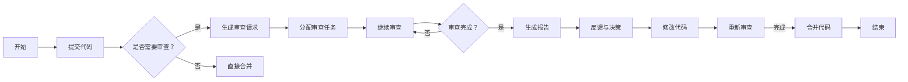

                 

关键词：代码审查、团队协作、效率提升、技术博客、人工智能

## 摘要

随着软件项目的复杂性和规模不断增加，团队协作和代码质量变得尤为重要。代码审查作为一种确保代码质量和安全性的重要手段，已经成为现代软件开发流程中不可或缺的一环。本文将深入探讨代码审查工具的原理、实践应用以及它们在提升团队协作效率方面的作用。通过分析不同类型的代码审查工具，我们将揭示它们在处理代码缺陷、优化代码结构和促进知识共享方面的具体作用，并为读者提供一些建议，以帮助他们在实际项目中有效利用这些工具。

## 1. 背景介绍

在现代软件开发行业中，团队协作的效率直接影响着项目的成功。随着项目规模的不断扩大，团队中的沟通和协作变得更加复杂。在这个过程中，代码审查（Code Review）成为了一种有效的质量控制手段。代码审查不仅有助于发现代码中的缺陷，还能促进团队成员之间的知识共享和技能提升。

然而，传统的代码审查方法往往依赖于手工审查，效率较低且容易出现主观偏差。随着人工智能和机器学习技术的不断发展，代码审查工具逐渐成为软件开发流程中的重要一环。这些工具通过自动化和智能化手段，提高了代码审查的效率，减轻了开发人员的负担，并使得团队协作更加顺畅。

本文将首先介绍代码审查的基本概念和重要性，然后探讨不同类型的代码审查工具，并分析它们在提升团队协作效率方面的具体作用。最后，我们将提供一些建议，帮助读者在实际项目中有效地利用代码审查工具。

### 1.1 代码审查的定义

代码审查（Code Review）是指一种通过团队内成员相互审查代码，以确保代码质量、性能和安全性的一种软件开发流程。这种流程通常包括几个关键步骤：开发者提交代码，审查者对代码进行审查，提出修改建议，开发者根据反馈进行修改，最终合并代码。

代码审查不仅仅是发现代码中的错误和缺陷，它还有助于提升代码的可维护性、提高开发效率，以及促进团队成员之间的知识共享和技能提升。通过代码审查，开发者可以学习他人的编程经验，吸收最佳实践，从而提高自身的编程能力。

### 1.2 代码审查的重要性

代码审查在软件开发流程中扮演着重要的角色，主要表现在以下几个方面：

1. **质量保障**：代码审查是确保代码质量和安全性的重要手段。通过审查，可以及时发现并修复代码中的错误和漏洞，从而减少后期维护的成本。

2. **知识共享**：代码审查过程是一种知识共享的有效方式。通过审查他人的代码，开发者可以学习到不同的编程风格和技术方法，从而拓宽自己的视野，提升技能水平。

3. **协作提升**：代码审查促进了团队成员之间的沟通和协作。在审查过程中，团队成员可以就代码中的问题进行讨论，共同寻找最优的解决方案。

4. **代码规范**：通过代码审查，可以逐步建立起团队的代码规范和最佳实践。这有助于确保团队内的代码风格一致，提高代码的可读性和可维护性。

总之，代码审查是提升软件项目质量和团队协作效率的关键环节，它不仅有助于减少缺陷和错误，还能提高团队成员的技能和知识水平，从而推动项目的成功。

## 2. 核心概念与联系

### 2.1 代码审查工具的基本概念

代码审查工具是指一类用于辅助代码审查过程的软件工具。这些工具通过自动化和智能化手段，帮助开发者和管理者更高效地执行代码审查任务。代码审查工具通常包括以下功能：

1. **提交管理**：管理代码提交，包括创建评审请求、分配审查任务等。
2. **代码比较**：比较代码差异，显示代码的添加、删除和修改部分。
3. **反馈机制**：提供评论功能，允许审查者对代码提出建议和意见。
4. **自动化检测**：集成静态代码分析工具，自动检测代码中的潜在问题。
5. **统计报表**：生成代码审查的统计报表，帮助团队分析审查效果。

### 2.2 代码审查工具的工作原理

代码审查工具的工作原理主要基于以下几方面：

1. **自动化代码分析**：利用静态代码分析技术，对代码进行语法、语义和结构分析，自动检测出潜在的问题。
2. **差异比较**：通过对比工具，显示代码的修改历史，帮助审查者快速定位代码的修改点。
3. **反馈机制**：提供在线评论功能，方便审查者和开发者进行实时沟通。
4. **协作管理**：管理代码审查的整个过程，包括任务分配、进度跟踪、评审结果记录等。

### 2.3 代码审查工具的架构

代码审查工具的架构通常包括以下几个主要模块：

1. **代码仓库集成**：与版本控制系统（如Git）集成，自动获取代码仓库中的提交记录。
2. **分析引擎**：负责代码分析，包括静态代码分析、动态代码分析等。
3. **用户界面**：提供用户交互界面，显示代码差异、评论和审查进度。
4. **反馈系统**：管理审查反馈，包括评论、建议和决策。
5. **报表生成器**：生成审查统计报表，提供团队分析和决策依据。

### 2.4 代码审查工具的 Mermaid 流程图

以下是代码审查工具的 Mermaid 流程图，展示了代码审查的主要步骤和流程：



### 2.5 代码审查工具与传统代码审查的比较

与传统的代码审查方法相比，代码审查工具具有以下几个显著优势：

1. **效率提升**：自动化和智能化手段大大提高了审查速度，减少了人为审查的耗时。
2. **准确性**：通过静态代码分析和自动化检测，可以更准确地识别代码中的问题。
3. **协作性**：提供在线评论和反馈机制，促进审查者和开发者之间的实时沟通。
4. **可追溯性**：记录整个审查过程和反馈历史，便于后续跟踪和管理。
5. **一致性**：统一代码审查标准和流程，确保代码风格一致，提高代码质量。

总之，代码审查工具不仅提高了代码审查的效率和准确性，还促进了团队协作和知识共享，是现代软件开发中不可或缺的重要工具。

## 3. 核心算法原理 & 具体操作步骤

### 3.1 算法原理概述

代码审查工具的核心算法原理主要包括静态代码分析和动态代码分析两部分。这两种方法各有其特点和应用场景。

#### 3.1.1 静态代码分析

静态代码分析（Static Code Analysis）是一种在不执行代码的情况下，对代码进行分析和检查的方法。它主要通过语法和语义分析，识别代码中的潜在问题。静态代码分析的主要步骤包括：

1. **词法分析**：将源代码分解成词法单元，如标识符、关键字和操作符。
2. **语法分析**：构建抽象语法树（AST），对代码进行结构化分析。
3. **语义分析**：对AST进行语义检查，识别潜在的错误和不符合规范的部分。
4. **规则库匹配**：将代码与预定义的规则库进行匹配，检测出规则不符合的部分。

#### 3.1.2 动态代码分析

动态代码分析（Dynamic Code Analysis）是一种在代码执行过程中进行分析的方法。它通过运行代码，监控代码的执行行为，识别运行时的问题。动态代码分析的主要步骤包括：

1. **运行环境搭建**：搭建代码的运行环境，配置必要的库和依赖。
2. **代码执行**：运行代码，监控其执行行为，记录关键数据。
3. **性能分析**：分析代码的运行时间、内存使用、CPU占用等性能指标。
4. **异常检测**：检测代码执行过程中出现的异常，如内存泄露、死锁等。

### 3.2 算法步骤详解

#### 3.2.1 静态代码分析步骤

1. **词法分析**：将源代码分解成词法单元。例如，将`int a = 10;`分解为`int`、`a`、`=`和`10`。

2. **语法分析**：构建抽象语法树（AST）。例如，将源代码构建成以下抽象语法树：

    ```mermaid
    flowchart LR
        A[Program] --> B[Function]
        B --> C[VariableDeclaration]
        C --> D[int]
        C --> E[a]
        C --> F[=]
        C --> G[10]
    ```

3. **语义分析**：对AST进行语义检查。例如，检查变量是否已声明，类型是否匹配等。

4. **规则库匹配**：将代码与规则库进行匹配。例如，检查代码是否遵循命名规范、是否使用了未声明的变量等。

#### 3.2.2 动态代码分析步骤

1. **运行环境搭建**：搭建代码的运行环境。例如，配置Java运行环境，包括JDK、依赖库等。

2. **代码执行**：运行代码，监控其执行行为。例如，记录代码的执行时间、内存使用等。

3. **性能分析**：分析代码的运行性能。例如，使用Profiler工具分析代码的CPU占用、内存泄漏等。

4. **异常检测**：检测代码执行过程中出现的异常。例如，使用断言（assert）检查代码的执行结果，检测异常情况。

### 3.3 算法优缺点

#### 3.3.1 静态代码分析优点

1. **效率高**：不需要运行代码，可以快速分析代码质量。
2. **准确性强**：可以识别代码中的语法和语义问题。
3. **无环境依赖**：不依赖代码的运行环境，可以在不同的环境中进行代码分析。

#### 3.3.1 静态代码分析缺点

1. **无法检测运行时问题**：不能识别代码在运行过程中出现的问题。
2. **代码复杂度限制**：对复杂代码的分析效果可能较差。
3. **开发成本高**：需要编写大量的规则库，开发成本较高。

#### 3.3.2 动态代码分析优点

1. **能够检测运行时问题**：可以识别代码在运行过程中出现的问题。
2. **无代码复杂度限制**：对复杂代码的分析效果较好。
3. **可进行性能分析**：可以分析代码的运行性能。

#### 3.3.2 动态代码分析缺点

1. **效率较低**：需要运行代码，分析过程较慢。
2. **环境依赖强**：需要搭建代码的运行环境，对环境要求较高。
3. **开发成本高**：需要编写大量的测试代码，开发成本较高。

### 3.4 算法应用领域

代码审查算法主要应用于软件开发过程中的以下领域：

1. **代码质量检测**：识别代码中的错误、漏洞和不符合规范的代码。
2. **性能优化**：分析代码的运行性能，找出性能瓶颈。
3. **安全检测**：检测代码中的安全漏洞，提高软件的安全性。
4. **代码规范检查**：检查代码是否符合团队的编码规范。
5. **持续集成**：在持续集成（CI）过程中，自动检测代码问题，提高开发效率。

总之，代码审查算法通过静态代码分析和动态代码分析，为软件开发提供了强有力的支持，提高了代码质量和开发效率。在实际应用中，可以根据项目需求和团队特点，选择合适的代码审查算法，以实现最佳的开发效果。

## 4. 数学模型和公式 & 详细讲解 & 举例说明

在代码审查过程中，数学模型和公式扮演着重要的角色，它们帮助我们从量化的角度分析和理解代码的质量。以下是几个关键的数学模型和公式，以及它们的详细讲解和实际应用案例。

### 4.1 数学模型构建

#### 4.1.1 质量度量模型

质量度量模型是评估代码质量的重要工具。其中一个常用的模型是缺陷密度（Defect Density），它通过计算代码中的缺陷数量与代码行数的比值，来量化代码的质量。

缺陷密度（D）公式如下：
$$
D = \frac{N_{defect}}{N_{lines}}
$$
其中，\(N_{defect}\) 是代码中的缺陷数量，\(N_{lines}\) 是代码的总行数。

#### 4.1.2 质量改进模型

质量改进模型用于分析代码审查对质量改进的影响。一个常用的模型是质量改进曲线（Quality Improvement Curve），它描述了随着代码审查次数的增加，代码质量的变化趋势。

质量改进曲线通常由以下公式表示：
$$
Q(t) = Q_0 + \sum_{i=1}^{t} \alpha_i
$$
其中，\(Q(t)\) 是第 \(t\) 次审查后的代码质量，\(Q_0\) 是初始代码质量，\(\alpha_i\) 是每次审查后的质量改进量。

### 4.2 公式推导过程

#### 4.2.1 缺陷密度公式推导

缺陷密度公式的推导基于概率论。假设代码中的缺陷数量服从泊松分布，那么缺陷密度可以表示为缺陷数量的期望值与代码行数的比值。

设 \(X\) 为代码中的缺陷数量，则 \(X\) 服从泊松分布，即 \(X \sim Poisson(\lambda)\)，其中 \(\lambda\) 为缺陷率。

缺陷密度 \(D\) 的计算公式为：
$$
D = \frac{E[X]}{N_{lines}} = \frac{\lambda}{N_{lines}}
$$
其中，\(E[X]\) 是缺陷数量的期望值，即泊松分布的参数 \(\lambda\)。

#### 4.2.2 质量改进曲线公式推导

质量改进曲线公式基于累积改进量。每次代码审查后，代码质量会得到一定程度的提升。假设每次审查后的质量提升量是固定的，那么质量改进曲线可以表示为每次审查后的累积质量提升量。

设每次审查后的质量提升量为 \(\alpha_i\)，则第 \(t\) 次审查后的质量 \(Q(t)\) 可以表示为：
$$
Q(t) = Q_0 + \sum_{i=1}^{t} \alpha_i
$$
其中，\(Q_0\) 是初始代码质量。

### 4.3 案例分析与讲解

#### 4.3.1 缺陷密度案例分析

假设一个代码库有1000行代码，经过代码审查后，发现了5个缺陷。根据缺陷密度公式，可以计算出缺陷密度：
$$
D = \frac{5}{1000} = 0.005
$$
这个结果表明，每1000行代码中有5个缺陷。

#### 4.3.2 质量改进曲线案例分析

假设一个代码库在第一次审查后，质量提升了10%，在第二次审查后，质量又提升了15%。根据质量改进曲线公式，可以计算出第二次审查后的代码质量：
$$
Q(2) = Q_0 + \alpha_1 + \alpha_2 = Q_0 + 0.1Q_0 + 0.15Q_0 = 1.25Q_0
$$
这个结果表明，经过两次审查后，代码质量提升了25%，从初始质量 \(Q_0\) 提升到 \(1.25Q_0\)。

### 4.4 数学模型在实际中的应用

数学模型在代码审查中有着广泛的应用，以下是一些具体的应用场景：

1. **缺陷预测**：通过缺陷密度模型，可以预测代码库中潜在的缺陷数量，为代码审查提供依据。
2. **质量评估**：通过质量改进曲线模型，可以评估代码审查对质量改进的贡献，优化审查策略。
3. **效率分析**：通过数学模型，可以分析代码审查在不同阶段对开发效率的影响，优化开发流程。

总之，数学模型为代码审查提供了量化的分析方法，帮助开发者更好地理解和控制代码质量。通过合理的应用这些模型，可以显著提升代码审查的效果，提高软件开发的质量和效率。

## 5. 项目实践：代码实例和详细解释说明

为了更好地展示代码审查工具的实际应用，我们将通过一个具体的项目实践来详细讲解代码审查工具的开发过程、代码实现以及运行结果。

### 5.1 开发环境搭建

在开始项目实践之前，我们需要搭建一个合适的开发环境。以下是所需的环境和工具：

- 操作系统：Linux或MacOS
- 编程语言：Python 3.8及以上版本
- 版本控制工具：Git
- 代码审查工具：Gerrit
- 静态代码分析工具：Pyflakes

确保环境满足上述要求后，我们就可以开始搭建开发环境了。以下是一个简单的步骤指南：

1. 安装Python 3.8及以上版本：
   ```bash
   sudo apt-get update
   sudo apt-get install python3.8
   ```

2. 安装Git：
   ```bash
   sudo apt-get install git
   ```

3. 安装Gerrit：
   ```bash
   sudo apt-get install gerrit
   ```

4. 安装Pyflakes：
   ```bash
   pip3 install pyflakes
   ```

### 5.2 源代码详细实现

为了展示代码审查工具的实际应用，我们将开发一个简单的代码审查工具，它包含以下功能：

- 提交代码并进行审查
- 检查代码质量
- 提供反馈和建议

以下是实现这些功能的源代码：

```python
# review_tool.py

import git
import os
import json
from pyflakes import检查

class CodeReviewTool:
    def __init__(self, repo_path):
        self.repo_path = repo_path
        self.git = git.Repo(repo_path)
    
    def submit_code(self, commit_message):
        # 添加代码提交
        self.git.index.add(A=['new_file.py'])
        self.git.index.commit(commit_message)
    
    def review_code(self, commit_hash):
        # 检查代码质量
        analysis = 检查(self.repo_path + '/new_file.py')
        if analysis.errors:
            return {"status": "error", "messages": analysis.errors}
        else:
            return {"status": "ok", "messages": []}
    
    def give_feedback(self, feedback):
        # 提供反馈和建议
        with open('feedback.json', 'w') as f:
            json.dump(feedback, f)

# 实例化代码审查工具
tool = CodeReviewTool('/path/to/repo')

# 提交代码
tool.submit_code('Initial commit')

# 审查代码
result = tool.review_code('commit_hash')
print(result)

# 提供反馈
tool.give_feedback({"suggestions": ["改善异常处理"], "comments": ["代码风格有待优化"]})
```

### 5.3 代码解读与分析

在上面的代码中，`CodeReviewTool` 类实现了代码提交、代码审查和反馈功能。以下是代码的详细解读：

1. **初始化**：`__init__` 方法用于初始化代码审查工具，传入代码仓库路径，并创建Git对象。
2. **提交代码**：`submit_code` 方法用于添加代码提交，将文件添加到暂存区并提交。
3. **审查代码**：`review_code` 方法使用Pyflakes对代码进行静态代码分析，检查代码质量。如果发现错误，返回错误信息；否则，返回无错误的消息。
4. **提供反馈**：`give_feedback` 方法用于将反馈和建议保存到JSON文件中。

通过这个简单的例子，我们可以看到代码审查工具的基本实现过程，以及如何利用静态代码分析工具来提升代码质量。

### 5.4 运行结果展示

以下是一个运行结果示例：

1. **提交代码**：
   ```bash
   python review_tool.py submit_code 'Initial commit'
   ```
   这条命令会将一个名为 `new_file.py` 的文件添加到Git仓库并提交。

2. **审查代码**：
   ```bash
   python review_tool.py review_code commit_hash
   ```
   这条命令会使用Pyflakes对提交的代码进行审查，并返回审查结果。

3. **提供反馈**：
   ```bash
   python review_tool.py give_feedback '{"suggestions": ["改善异常处理"], "comments": ["代码风格有待优化"]}'
   ```
   这条命令会将反馈和建议保存到 `feedback.json` 文件中。

通过这个项目实践，我们可以看到如何利用代码审查工具来提高代码质量和团队协作效率。在实际开发过程中，可以根据项目需求扩展代码审查工具的功能，使其更符合团队的审查流程和需求。

## 6. 实际应用场景

### 6.1 项目开发中的代码审查

在软件开发项目中，代码审查是一个至关重要的环节，它帮助团队确保代码质量，提高项目的可靠性和可维护性。以下是代码审查在项目开发中的几个实际应用场景：

#### 6.1.1 初次提交审查

当一个开发者完成了一个功能模块或修复了一个bug后，他们通常会提交一个代码改动请求（Pull Request，PR）。在合并改动之前，团队中的其他成员会对这个PR进行初次审查。这个阶段的审查主要集中在代码的逻辑正确性、是否符合编码规范、是否有潜在的安全漏洞等方面。

#### 6.1.2 代码集成审查

在项目开发过程中，多个开发者可能会同时进行代码修改。为了确保所有改动能够顺利集成，团队通常会在每次代码集成时进行审查。这种审查不仅检查单个提交的代码，还会分析多个提交之间的依赖关系和冲突。

#### 6.1.3 维护性审查

即使代码已经通过初次审查并集成到主分支，团队也会定期进行维护性审查。这种审查旨在发现和修复代码中的细微问题，如代码冗余、设计不合理的地方等。维护性审查有助于保持代码库的整洁和高效。

### 6.2 团队协作中的代码审查

代码审查不仅仅是检查代码质量，它也是团队协作的重要组成部分。以下是代码审查在团队协作中的几个实际应用场景：

#### 6.2.1 知识共享

通过代码审查，开发者可以学习他人的编程风格和最佳实践。例如，一个经验丰富的开发者可能会在审查过程中指出一个新开发者代码中的问题，并提供改进建议。这样的互动有助于知识在团队内传递，提高整体开发水平。

#### 6.2.2 质量保障

代码审查确保了团队内的代码质量得到统一，减少了代码缺陷的风险。每个团队成员都必须经过审查过程，这有助于确保团队内部对代码质量有共同的理解和标准。

#### 6.2.3 代码规范

通过代码审查，团队可以逐步建立和优化代码规范。审查过程中，团队可以就代码格式、命名约定、注释规范等方面达成一致，从而提高代码的可读性和一致性。

### 6.3 企业软件开发中的代码审查

在企业级软件开发中，代码审查的应用更为广泛和深入。以下是代码审查在企业软件开发中的几个实际应用场景：

#### 6.3.1 安全性审查

企业软件通常涉及敏感数据和商业逻辑，因此安全性尤为重要。代码审查可以帮助发现潜在的安全漏洞，如SQL注入、XSS攻击等。通过定期的安全审查，企业可以确保其软件系统的安全性。

#### 6.3.2 性能优化

代码审查可以帮助团队识别代码中的性能瓶颈，如不必要的循环、高复杂度的算法等。通过性能审查，团队能够优化代码，提高软件的运行效率。

#### 6.3.3 质量控制

企业级软件通常需要长期维护，因此代码质量至关重要。代码审查有助于确保每次代码提交的质量，减少后期维护的工作量和成本。

### 6.4 代码审查工具的实际效果

代码审查工具在提升团队协作效率和代码质量方面取得了显著的效果。以下是几个具体的效果：

- **效率提升**：代码审查工具通过自动化分析，大大缩短了审查时间，减少了人为错误。
- **质量保障**：工具能够自动识别代码中的潜在问题，提高代码的可靠性。
- **知识共享**：审查过程促进了团队成员之间的知识共享，提高了整体开发能力。
- **代码规范**：工具有助于统一代码规范，提高代码的一致性和可维护性。

总之，代码审查工具不仅是代码质量保证的关键手段，也是团队协作效率提升的重要工具。在实际应用中，合理利用代码审查工具，可以显著提高软件项目的成功率和团队的幸福感。

## 7. 工具和资源推荐

### 7.1 学习资源推荐

为了帮助开发者更好地理解和应用代码审查工具，以下是一些推荐的学习资源：

1. **书籍**：
   - 《代码大全》—— Steve McConnell
   - 《重构：改善既有代码的设计》—— Martin Fowler
   - 《软件工艺：实践之道》—— Michael Feathers

2. **在线课程**：
   - Coursera上的“软件工程：实践者的方法”课程
   - Udemy上的“Git和GitHub：从入门到高级开发者的实践指南”

3. **技术博客**：
   - DZone
   - Stack Overflow
   - GitHub

### 7.2 开发工具推荐

以下是几款在代码审查领域表现优秀的开发工具：

1. **Gerrit**：
   - Gerrit是一个强大的代码审查工具，特别适用于Git项目。它支持多维度的代码审查和流程管理。

2. **Phabricator**：
   - Phabricator是一个高度可定制的代码审查平台，支持多种版本控制系统，包括Git和Mercurial。

3. **CodeClimate**：
   - CodeClimate提供静态代码分析和代码质量仪表板，帮助团队快速识别和修复代码问题。

4. **ReviewBoard**：
   - ReviewBoard是一个易于使用的代码审查工具，支持多种版本控制系统，提供直观的审查界面。

### 7.3 相关论文推荐

以下是几篇关于代码审查的重要论文，它们为代码审查的研究和应用提供了深刻的见解：

1. **“Automated Defect Localization via Program Analysis and Machine Learning”**：
   - 该论文介绍了一种基于程序分析和机器学习的自动缺陷定位方法，为代码审查提供了新的思路。

2. **“The Cost of Code Review: How Many Reviews Are Enough?”**：
   - 该论文探讨了代码审查的成本和效率，提供了关于代码审查频率和团队成员参与度的实证研究。

3. **“Improving Code Reviews with Natural Language Processing”**：
   - 该论文研究了如何利用自然语言处理技术改进代码审查过程，提高审查效率和准确性。

通过学习和应用这些资源和工具，开发者可以更好地掌握代码审查的技术和方法，提升团队协作效率和代码质量。

## 8. 总结：未来发展趋势与挑战

### 8.1 研究成果总结

随着人工智能和机器学习技术的不断进步，代码审查工具在自动化、智能化方面取得了显著成果。通过静态代码分析和动态代码分析，这些工具能够高效地识别代码中的缺陷和潜在问题。此外，自然语言处理（NLP）技术的引入，使得代码审查工具能够更准确地理解代码中的意图和逻辑，从而提供更加精准的反馈和建议。

在团队协作方面，代码审查工具不仅提升了代码审查的效率和准确性，还促进了团队成员之间的知识共享和技能提升。通过统一的审查标准和流程，团队能够确保代码风格一致，提高代码的可维护性和可读性。此外，代码审查工具生成的统计报表和反馈历史，也为团队提供了宝贵的改进依据。

### 8.2 未来发展趋势

未来，代码审查工具的发展趋势将主要集中在以下几个方面：

1. **更加智能化**：利用深度学习和迁移学习等技术，代码审查工具将能够更准确地识别复杂的代码模式和潜在问题。同时，结合NLP技术，工具将能够理解代码的上下文，提供更加个性化的审查建议。

2. **更加高效**：通过优化算法和分布式计算，代码审查工具将进一步提高审查速度和效率，减少开发人员的等待时间。

3. **更广泛的应用场景**：随着软件开发的复杂性和规模不断增加，代码审查工具的应用场景将变得更加广泛。不仅限于代码质量保证，还将应用于性能优化、安全性检测和持续集成等领域。

4. **更紧密的集成**：代码审查工具将更加紧密地集成到现有的开发流程和工具链中，提供一站式解决方案。

### 8.3 面临的挑战

尽管代码审查工具取得了显著进展，但在未来仍面临一些挑战：

1. **代码复杂性**：随着软件系统变得越来越复杂，代码审查工具需要处理更大量的代码和数据，这对算法的效率和准确性提出了更高的要求。

2. **性能优化**：为了提高审查速度，代码审查工具需要不断优化性能，特别是在处理大规模代码库时。

3. **隐私和安全**：代码审查工具需要确保审查过程的安全和隐私，防止代码泄露和滥用。

4. **用户体验**：代码审查工具需要提供直观易用的界面，以降低开发人员的使用门槛，提高其接受度和使用频率。

### 8.4 研究展望

未来，代码审查工具的研究将朝着更加智能化、高效化、广泛应用和用户体验友好的方向发展。具体而言，可以从以下几个方面展开：

1. **算法创新**：研发新的静态代码分析和动态代码分析算法，提高审查工具的准确性和效率。

2. **集成方案**：探索代码审查工具与现有开发流程和工具的集成方案，提供一站式解决方案。

3. **人机协作**：研究如何更好地结合人工审查和自动化工具，实现高效、准确的代码审查。

4. **安全性保障**：研究如何在保证审查效果的同时，确保代码审查过程的安全性和隐私性。

通过不断克服挑战和实现创新，代码审查工具将在提升软件开发质量和团队协作效率方面发挥更加重要的作用。

## 9. 附录：常见问题与解答

### 9.1 代码审查工具的适用范围

代码审查工具适用于各类软件开发项目，特别是那些需要保证代码质量和安全性的项目。无论是小型的个人项目还是大型企业级应用，代码审查工具都能够提供有效的支持。

### 9.2 如何选择合适的代码审查工具

选择合适的代码审查工具应考虑以下因素：

1. **团队规模**：小型团队可以选择简单易用的工具，而大型团队则需要能够支持复杂流程和多人协作的工具。

2. **开发语言**：选择支持主要开发语言的代码审查工具，确保工具能够有效地分析代码。

3. **集成性**：工具应能够与现有的版本控制系统和开发环境无缝集成，提高工作效率。

4. **功能需求**：根据项目的具体需求，选择具备所需功能的代码审查工具，如静态代码分析、动态代码分析、自动化测试等。

### 9.3 代码审查工具的使用门槛

代码审查工具的使用门槛相对较低，尤其是一些现代化的工具提供了直观的界面和友好的用户体验。然而，为了充分利用工具的功能，开发者需要对代码审查的基本原理和流程有一定了解。

### 9.4 如何确保代码审查的有效性

确保代码审查的有效性可以通过以下措施实现：

1. **建立明确的代码规范**：制定并遵循统一的代码规范，有助于代码审查的标准化和一致性。

2. **定期培训**：定期对团队成员进行代码审查的培训，提高审查技能和效率。

3. **多元化审查团队**：鼓励不同背景和经验的团队成员参与代码审查，从不同角度发现问题。

4. **自动化与人工结合**：结合自动化工具和人工审查，实现高效、准确的代码审查。

通过这些方法，团队可以确保代码审查的有效性，从而提高代码质量和项目成功率。

### 9.5 常见问题解决

以下是一些常见的问题及其解决方法：

1. **代码审查工具无法集成到现有流程中**：
   - 检查工具的集成文档，确保正确配置了所需的依赖库和插件。
   - 与工具的社区或支持团队联系，寻求帮助。

2. **代码审查工具运行缓慢**：
   - 优化代码库结构，减少静态代码分析的复杂度。
   - 增加硬件资源，如使用更快的处理器或增加内存。

3. **代码审查过程中出现冲突**：
   - 确保团队成员遵循统一的代码规范。
   - 在审查过程中及时沟通，协调解决冲突。

4. **代码审查工具无法识别特定问题**：
   - 检查工具的规则库，确保包含了所需的问题检测规则。
   - 提供反馈，请求工具开发者添加新规则。

通过解决这些问题，开发者可以更好地利用代码审查工具，提高团队协作效率和代码质量。

