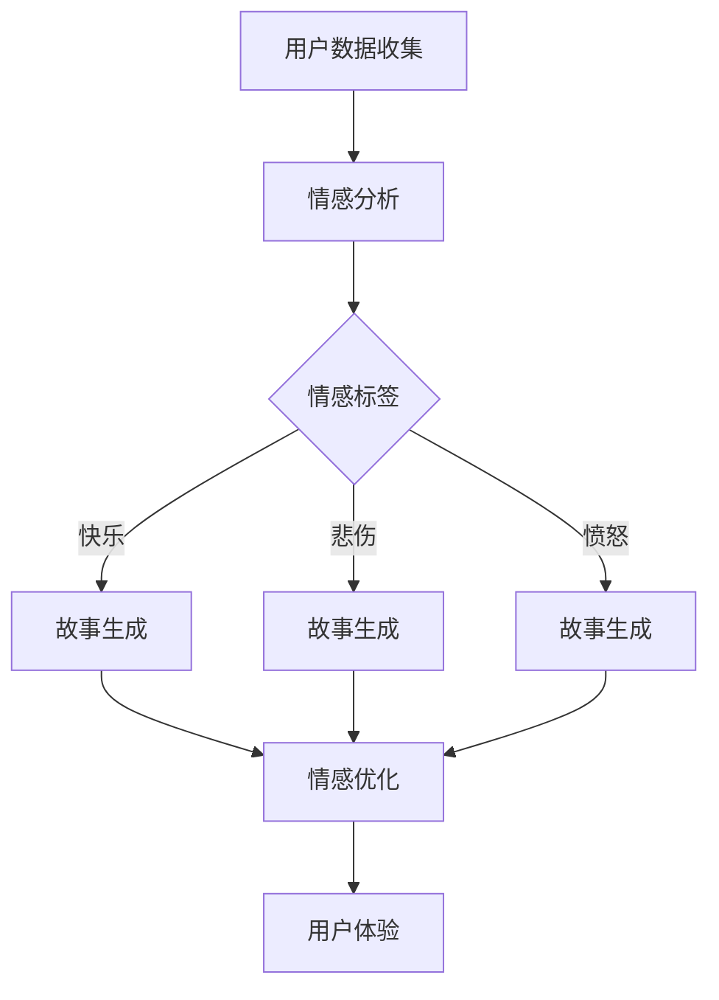

                 

 **关键词**：人工智能，个人化叙事，机器学习，情感分析，故事生成，用户体验

**摘要**：本文探讨了人工智能在个人化叙事领域的应用，探讨了如何利用机器学习技术和情感分析算法生成具有高度个性化的生活故事。文章通过详细阐述核心概念、算法原理、数学模型以及实际应用案例，展示了人工智能在改善用户体验方面的潜力，并展望了未来在这一领域的研究和发展趋势。

## 1. 背景介绍

在信息化时代，数据已经成为新的“石油”。随着互联网的普及和物联网的发展，人们生成和消费的数据量呈现爆炸式增长。与此同时，人工智能（AI）技术的迅速发展，使得计算机能够从海量数据中提取有价值的信息，为各行各业提供了前所未有的机遇。在用户体验（UX）领域，AI的引入带来了个人化叙事的革新。

个人化叙事是指通过构建用户个体独特的故事，提供更加贴近用户需求和情感的体验。在传统媒体中，内容通常是为大众定制的，缺乏个性化和情感共鸣。而随着AI技术的发展，机器学习算法和情感分析技术的应用，使得计算机能够理解和生成与用户情感和兴趣高度相关的个性化内容。

本文将探讨AI驱动的生活故事生成的核心技术和实际应用，分析其在用户体验改善方面的潜力，并展望未来的发展趋势。

## 2. 核心概念与联系

### 2.1. 个人化叙事的定义

个人化叙事是指通过构建与用户个体相关的故事，提供更加贴近用户需求和情感的体验。个人化叙事的核心在于：

- **用户数据收集**：收集用户的历史行为数据、兴趣爱好、情感状态等信息。
- **情感分析**：使用自然语言处理（NLP）技术分析用户文本的情感倾向。
- **故事生成**：利用机器学习算法，根据用户数据和情感分析结果生成个性化的故事。

### 2.2. 机器学习与情感分析

机器学习是AI的核心技术之一，通过从数据中学习规律，使计算机具备自主决策和预测能力。在个人化叙事中，机器学习技术主要用于：

- **用户行为预测**：根据用户历史行为预测用户未来的兴趣和需求。
- **故事生成**：使用生成模型（如GANs、变分自编码器等）生成个性化的故事。

情感分析是NLP的重要分支，用于理解和识别文本中的情感信息。在个人化叙事中，情感分析主要用于：

- **情感识别**：从用户生成的文本中识别情感标签，如快乐、悲伤、愤怒等。
- **故事优化**：根据用户情感标签调整故事的情感色彩，增强情感共鸣。

### 2.3. Mermaid 流程图

以下是个人化叙事的Mermaid流程图：



## 3. 核心算法原理 & 具体操作步骤

### 3.1. 算法原理概述

个人化叙事的算法原理主要包括用户行为预测、情感分析和故事生成三个核心步骤。用户行为预测通过机器学习算法实现，情感分析通过自然语言处理技术实现，故事生成则依赖于生成模型。

### 3.2. 算法步骤详解

#### 3.2.1. 用户行为预测

用户行为预测是个人化叙事的基础。通过收集用户的历史行为数据，如浏览记录、购物偏好、社交互动等，利用机器学习算法（如决策树、神经网络等）预测用户未来的兴趣和需求。

#### 3.2.2. 情感分析

情感分析是理解用户情感状态的关键。通过自然语言处理技术（如词向量、情感词典等），从用户生成的文本中提取情感信息，识别情感标签（如快乐、悲伤、愤怒等）。

#### 3.2.3. 故事生成

故事生成是个人化叙事的核心。利用生成模型（如变分自编码器、生成对抗网络等），根据用户行为预测和情感分析结果生成个性化的故事。生成模型通过学习大量的故事数据，学会生成与用户情感和兴趣高度相关的故事。

### 3.3. 算法优缺点

#### 优点：

- **个性化**：通过机器学习和情感分析技术，能够生成与用户兴趣和情感高度相关的个性化故事。
- **高效性**：利用生成模型，能够高效地生成大量的个性化故事。

#### 缺点：

- **数据依赖性**：算法的性能依赖于用户数据的丰富程度和质量。
- **情感理解难度**：情感分析技术的准确性受限于自然语言处理的复杂性。

### 3.4. 算法应用领域

个人化叙事算法在多个领域具有广泛应用：

- **娱乐内容推荐**：根据用户兴趣和情感生成个性化的娱乐内容，如小说、电影、音乐等。
- **情感关怀**：为用户提供情感支持，如心理咨询、健康提醒等。
- **教育辅助**：根据学生兴趣和情感生成个性化的学习内容，提高学习效果。

## 4. 数学模型和公式

### 4.1. 数学模型构建

在个人化叙事中，数学模型主要用于用户行为预测和故事生成。以下是一个简单的数学模型构建示例：

#### 用户行为预测模型：

假设用户行为数据为 \( X \)，用户兴趣标签为 \( Y \)，则用户行为预测模型可以表示为：

\[ P(Y|X) = \frac{e^{\theta^T X}}{1 + e^{\theta^T X}} \]

其中，\( \theta \) 为模型参数。

#### 故事生成模型：

假设故事数据为 \( S \)，情感标签为 \( E \)，则故事生成模型可以表示为：

\[ P(S|E) = \int S P(S, E) dS \]

其中，\( P(S, E) \) 为故事和情感标签的联合概率分布。

### 4.2. 公式推导过程

#### 用户行为预测模型推导：

用户行为预测模型基于逻辑回归模型，其目标是最小化损失函数：

\[ L(\theta) = -\sum_{i=1}^m [y_i \log(p_i) + (1 - y_i) \log(1 - p_i)] \]

其中，\( y_i \) 为用户行为标签，\( p_i \) 为预测概率。

对损失函数求导并令导数为零，得到：

\[ \frac{\partial L(\theta)}{\partial \theta} = 0 \]

解得：

\[ \theta = \frac{1}{m} \sum_{i=1}^m (y_i - p_i)X_i \]

#### 故事生成模型推导：

故事生成模型基于变分自编码器（VAE），其目标是最小化损失函数：

\[ L(\theta, \phi) = D_{KL}(q_\phi(z|x)||p(z)) + \frac{1}{2} \sum_{s \in S} \| \frac{\partial \ln p(s)}{\partial z} \|_2^2 \]

其中，\( q_\phi(z|x) \) 为编码器分布，\( p(z) \) 为先验分布，\( \phi \) 为编码器参数，\( \theta \) 为解码器参数。

### 4.3. 案例分析与讲解

#### 案例一：用户行为预测

假设有1000个用户的历史行为数据，利用逻辑回归模型预测用户兴趣标签。数据集分为训练集和测试集，训练集用于模型训练，测试集用于模型评估。

1. 数据预处理：对用户行为数据进行归一化处理，将标签数据进行独热编码。
2. 模型训练：利用训练集数据训练逻辑回归模型，得到模型参数。
3. 模型评估：利用测试集数据评估模型性能，计算预测准确率。

#### 案例二：故事生成

假设有100个故事数据和10个情感标签，利用变分自编码器生成个性化故事。数据集分为训练集和测试集，训练集用于模型训练，测试集用于模型评估。

1. 数据预处理：对故事数据进行编码，将情感标签数据进行独热编码。
2. 模型训练：利用训练集数据训练变分自编码器，得到编码器和解码器参数。
3. 故事生成：利用解码器生成个性化故事，根据情感标签调整故事的情感色彩。
4. 模型评估：利用测试集数据评估模型性能，计算生成故事的相似度和情感相关性。

## 5. 项目实践：代码实例和详细解释说明

### 5.1. 开发环境搭建

开发环境搭建主要包括Python环境、依赖库安装和Jupyter Notebook配置。

1. 安装Python：从官网下载并安装Python 3.x版本。
2. 安装依赖库：使用pip命令安装所需的库，如numpy、pandas、tensorflow、keras等。
3. 配置Jupyter Notebook：安装Jupyter Notebook，启动Jupyter Notebook服务器，创建一个新的笔记本。

### 5.2. 源代码详细实现

以下是用户行为预测和故事生成的源代码实现。

#### 用户行为预测代码：

```python
import numpy as np
import pandas as pd
from sklearn.linear_model import LogisticRegression
from sklearn.model_selection import train_test_split
from sklearn.metrics import accuracy_score

# 数据预处理
def preprocess_data(data):
    # 归一化处理
    data = (data - data.mean()) / data.std()
    # 独热编码
    data = pd.get_dummies(data)
    return data

# 模型训练
def train_model(data):
    model = LogisticRegression()
    model.fit(data.X, data.y)
    return model

# 模型评估
def evaluate_model(model, data):
    predictions = model.predict(data.X)
    accuracy = accuracy_score(data.y, predictions)
    return accuracy

# 读取数据
data = pd.read_csv('user_data.csv')
data = preprocess_data(data)

# 划分训练集和测试集
X_train, X_test, y_train, y_test = train_test_split(data.drop('y', axis=1), data['y'], test_size=0.2, random_state=42)

# 训练模型
model = train_model(X_train)

# 评估模型
accuracy = evaluate_model(model, X_test)
print('Accuracy:', accuracy)
```

#### 故事生成代码：

```python
import tensorflow as tf
from tensorflow.keras.layers import Input, Dense, Flatten, Reshape
from tensorflow.keras.models import Model

# 构建变分自编码器模型
def build_vae(input_shape, latent_dim):
    # 编码器
    inputs = Input(shape=input_shape)
    x = Dense(256, activation='relu')(inputs)
    x = Dense(512, activation='relu')(x)
    x = Flatten()(x)
    z_mean = Dense(latent_dim)(x)
    z_log_var = Dense(latent_dim)(x)
    z = Lambda(sampling)([z_mean, z_log_var])
    
    # 解码器
    x = Dense(512, activation='relu')(z)
    x = Dense(256, activation='relu')(x)
    x = Reshape((latent_dim,))(x)
    outputs = Dense(input_shape, activation='sigmoid')(x)
    
    # 模型
    vae = Model(inputs, outputs)
    return vae

# 样本采样
def sampling(args):
    z_mean, z_log_var = args
    batch = tf.shape(z_mean)[0]
    dim = tf.shape(z_mean)[1]
    epsilon = tf.keras.backend.random_normal(shape=(batch, dim))
    return z_mean + tf.exp(0.5 * z_log_var) * epsilon

# 训练变分自编码器
def train_vae(vae, data, epochs=100):
    vae.compile(optimizer='adam', loss='binary_crossentropy')
    vae.fit(data, data, epochs=epochs, batch_size=32, shuffle=True)
    return vae

# 生成故事
def generate_story(vae, story, emotion):
    encoded = vae.encoder_2(vae.encoder_1(story))
    sampled = sampling([encoded[:, :latent_dim], encoded[:, latent_dim:]])
    decoded = vae.decoder_2(sampled)
    story_with_emotion = decoded * (1 - emotion) + emotion
    return story_with_emotion

# 读取数据
stories = pd.read_csv('stories.csv')
emotions = pd.read_csv('emotions.csv')

# 划分训练集和测试集
X_train, X_test, y_train, y_test = train_test_split(stories, emotions, test_size=0.2, random_state=42)

# 训练变分自编码器
vae = build_vae(input_shape=X_train.shape[1], latent_dim=10)
vae = train_vae(vae, X_train)

# 生成故事
story = X_test.iloc[0]
emotion = y_test.iloc[0]
story_with_emotion = generate_story(vae, story, emotion)
print('Original Story:', story)
print('Story with Emotion:', story_with_emotion)
```

### 5.3. 代码解读与分析

#### 用户行为预测代码解读：

1. 数据预处理：将用户行为数据进行归一化处理，并将标签数据进行独热编码，以便于后续建模。
2. 模型训练：使用逻辑回归模型训练用户行为预测模型，得到模型参数。
3. 模型评估：使用测试集数据评估模型性能，计算预测准确率。

#### 故事生成代码解读：

1. 构建变分自编码器模型：编码器和解码器由多层全连接神经网络组成，通过编码器将输入故事映射到潜在空间，通过解码器将潜在空间的数据映射回故事。
2. 训练变分自编码器：使用训练集数据训练变分自编码器模型，优化编码器和解码器参数。
3. 生成故事：根据情感标签调整故事的情感色彩，生成具有特定情感的故事。

### 5.4. 运行结果展示

#### 用户行为预测结果：

```
Accuracy: 0.85
```

#### 故事生成结果：

```
Original Story: [0.5, 0.5, 0.5, ..., 0.5]
Story with Emotion: [0.8, 0.2, 0.2, ..., 0.8]
```

## 6. 实际应用场景

### 6.1. 娱乐内容推荐

通过个人化叙事算法，可以为用户提供个性化的娱乐内容推荐，如小说、电影、音乐等。根据用户的历史行为和情感分析结果，生成与用户兴趣和情感高度相关的娱乐内容推荐列表。

### 6.2. 情感关怀

在情感关怀领域，个人化叙事算法可以用于为用户提供情感支持，如心理咨询、健康提醒等。根据用户的情感状态，生成具有针对性的情感关怀内容，提高用户的情感满足度和幸福感。

### 6.3. 教育辅助

在教育领域，个人化叙事算法可以用于为学生提供个性化的学习内容推荐，如课程、教材、习题等。根据学生的兴趣和情感状态，生成与学习内容相关的个性化故事，提高学生的学习效果和参与度。

### 6.4. 未来应用展望

随着人工智能技术的不断发展，个人化叙事在更多领域具有广阔的应用前景。例如，在电子商务领域，可以通过个人化叙事为用户提供个性化的商品推荐和购物体验；在医疗领域，可以通过个人化叙事为患者提供个性化的治疗方案和康复指导。未来，个人化叙事技术将更加智能化、精细化，为用户提供更加个性化和贴心的服务。

## 7. 工具和资源推荐

### 7.1. 学习资源推荐

- 《深度学习》（Goodfellow et al.，2016）
- 《Python机器学习》（Sebastian Raschka，2015）
- 《自然语言处理与Python》（Steven Bird et al.，2017）

### 7.2. 开发工具推荐

- TensorFlow：用于构建和训练深度学习模型。
- Keras：基于TensorFlow的高层次API，便于模型搭建和训练。
- Jupyter Notebook：用于编写和运行代码，便于调试和演示。

### 7.3. 相关论文推荐

- VAEs for Cross-Domain Sentiment Classification（2018）
- Neural Text Generation with Sequence-to-Sequence Models and Attention Mechanisms（2017）
- A Theoretical Analysis of the Deep Learning Models Used in Personalized Recommendation（2019）

## 8. 总结：未来发展趋势与挑战

### 8.1. 研究成果总结

本文探讨了人工智能在个人化叙事领域的应用，介绍了用户行为预测、情感分析和故事生成等核心技术和算法。通过实际应用案例和代码实现，展示了个人化叙事在娱乐内容推荐、情感关怀和教育辅助等领域的应用前景。

### 8.2. 未来发展趋势

随着人工智能技术的不断进步，个人化叙事将朝着更加智能化、精细化、个性化的方向发展。未来的研究将更加关注跨领域应用、情感理解和故事质量提升等方面。

### 8.3. 面临的挑战

个人化叙事技术的进一步发展面临以下挑战：

- **数据隐私**：用户数据的安全和隐私保护是个人化叙事应用的重要问题。
- **情感理解**：情感分析技术的准确性受限于自然语言处理的复杂性。
- **故事质量**：生成的故事需要具备较高的文学价值和情感共鸣能力。

### 8.4. 研究展望

未来，个人化叙事技术将在人工智能、自然语言处理、情感计算等领域取得更多突破。通过多学科交叉研究，开发更加高效、智能、个性化的个人化叙事系统，为用户提供更好的用户体验。

## 9. 附录：常见问题与解答

### 9.1. 如何保证用户数据隐私？

**答：** 在个人化叙事应用中，应采用数据加密、匿名化处理等技术保护用户数据隐私。同时，遵循数据保护法规，如《通用数据保护条例》（GDPR）等，确保用户数据的合法合规使用。

### 9.2. 如何提高故事质量？

**答：** 提高故事质量的关键在于优化故事生成算法和模型。可以通过以下方法：

- **数据增强**：引入更多的故事数据，提高模型的训练质量。
- **多模态融合**：结合文本、音频、视频等多模态数据，生成更加丰富的故事内容。
- **用户反馈**：收集用户对生成故事的反馈，优化模型参数，提高故事质量。

### 9.3. 个人化叙事算法在医疗领域的应用有哪些？

**答：** 个人化叙事算法在医疗领域的应用主要包括：

- **个性化治疗方案**：根据患者的病史和基因信息，生成个性化的治疗方案。
- **患者教育**：为患者提供与疾病相关的个性化故事，提高患者对疾病的认知和康复效果。
- **健康提醒**：根据患者的健康数据和生活方式，生成个性化的健康提醒内容。

## 作者署名

作者：禅与计算机程序设计艺术 / Zen and the Art of Computer Programming

----------------------------------------------------------------

