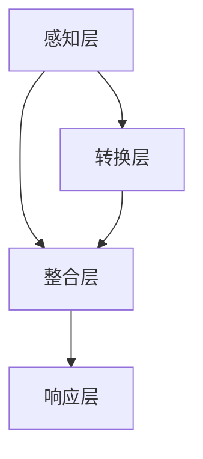

                 

关键词：人工智能，跨维度感知，时空穿越，体验模拟，虚拟现实，深度学习，神经科学，计算模型

> 摘要：本文将探讨人工智能在跨维度感知领域的创新应用，通过构建一个模拟人类体验的时空穿越机，使得用户能够体验到前所未有的虚拟现实。本文将介绍该时空穿越机的核心概念、算法原理、数学模型、实际应用案例，并对其未来发展趋势与挑战进行分析。

## 1. 背景介绍

在21世纪的今天，人工智能（AI）已经成为推动社会进步的重要力量。从自动驾驶汽车到智能助手，AI已经渗透到我们日常生活的方方面面。然而，AI的发展不仅仅是技术层面的突破，更是对人类认知和感知的拓展。近年来，随着虚拟现实（VR）和增强现实（AR）技术的崛起，人们开始探索如何通过AI实现更真实的跨维度感知体验。

跨维度感知指的是人类或机器能够在不同的感知维度之间进行数据转换和感知整合的能力。例如，从视觉信息到听觉信息的转换，或者从现实世界的信息到虚拟世界的信息的转换。这样的感知能力不仅能够丰富人类的感知体验，还可能对医疗、教育、军事等领域产生深远影响。

本文将探讨一种新型的AI模型——时空穿越机，它通过深度学习和神经科学原理，模拟人类的感知过程，实现跨维度的实时感知体验。本文将详细介绍时空穿越机的核心概念、算法原理、数学模型，并通过实际应用案例展示其在虚拟现实领域的潜力。

## 2. 核心概念与联系

### 2.1 核心概念

时空穿越机是一个基于深度学习和神经科学原理的AI模型，其目的是通过模拟人类的感知过程，实现跨维度感知体验。具体来说，时空穿越机包括以下几个核心概念：

- **感知模态转换**：时空穿越机能够将一种感知模态（如视觉）的信息转换为另一种感知模态（如听觉）的信息。
- **时空整合**：时空穿越机能够整合来自不同时空的信息，形成统一的感知体验。
- **实时响应**：时空穿越机能够在实时环境中对感知信息进行转换和整合，提供即时的感知体验。

### 2.2 核心概念原理与架构

为了实现上述核心概念，时空穿越机采用了一种多模态的神经计算架构。该架构包括以下几个主要部分：

- **感知层**：负责采集和预处理各种感知模态的数据，如视觉、听觉、触觉等。
- **转换层**：利用深度学习算法，将一种模态的信息转换为另一种模态的信息。
- **整合层**：将不同模态的信息进行整合，形成统一的感知体验。
- **响应层**：根据用户的实时反馈，调整感知模型的参数，实现实时响应。

以下是时空穿越机架构的Mermaid流程图：



在感知层，时空穿越机通过传感器和摄像头等设备采集多种模态的信息，如视觉图像、音频信号等。然后，这些信息被传递到转换层，利用深度学习算法进行模态转换。转换层使用神经网络模型，通过训练学习到不同模态之间的转换规则。接着，转换层输出的信息被传递到整合层，进行多维度的信息整合。最后，整合层的结果被传递到响应层，根据用户的实时反馈进行调整，实现实时感知体验。

## 3. 核心算法原理 & 具体操作步骤

### 3.1 算法原理概述

时空穿越机的核心算法基于深度学习和神经科学原理。具体来说，该算法包括以下几个关键步骤：

1. **感知数据采集**：通过传感器和摄像头等设备，采集多种模态的感知数据，如视觉图像、音频信号、触觉信息等。
2. **模态转换**：利用深度学习算法，将一种模态的信息转换为另一种模态的信息。这通常需要训练一个多模态的神经网络模型，该模型能够学习到不同模态之间的转换规则。
3. **时空整合**：将不同模态的信息进行整合，形成统一的感知体验。这通常需要设计一个多模态的整合神经网络，该网络能够学习到不同模态之间的时空关系。
4. **实时响应**：根据用户的实时反馈，调整感知模型的参数，实现实时感知体验。这通常需要设计一个自适应的神经网络模型，该模型能够根据用户的反馈进行调整。

### 3.2 算法步骤详解

以下是时空穿越机的具体操作步骤：

1. **感知数据采集**：
   - 通过传感器和摄像头等设备，采集多种模态的感知数据，如视觉图像、音频信号、触觉信息等。
   - 对采集到的数据进行预处理，如去噪、归一化等，以便于后续处理。

2. **模态转换**：
   - 设计一个多模态的神经网络模型，用于模态转换。该模型通常包括输入层、隐藏层和输出层。
   - 输入层接收不同模态的感知数据，隐藏层对数据进行特征提取和转换，输出层生成转换后的感知数据。
   - 利用大量的多模态数据对模型进行训练，学习到不同模态之间的转换规则。

3. **时空整合**：
   - 设计一个多模态的整合神经网络，用于时空整合。该模型通常包括多个时间步的输入层、隐藏层和输出层。
   - 输入层接收不同时间步的多模态感知数据，隐藏层对数据进行特征提取和整合，输出层生成整合后的感知数据。
   - 利用大量的多模态数据对模型进行训练，学习到不同模态之间的时空关系。

4. **实时响应**：
   - 根据用户的实时反馈，调整感知模型的参数。这通常需要设计一个自适应的神经网络模型，该模型能够根据用户的反馈进行调整。
   - 利用用户的反馈数据对模型进行在线训练，不断优化模型参数，实现实时感知体验。

### 3.3 算法优缺点

时空穿越机算法具有以下优点：

- **高灵活性**：时空穿越机能够根据不同的应用场景和用户需求，灵活调整感知模态和感知参数，实现定制化的感知体验。
- **实时性**：时空穿越机能够实现实时感知体验，满足快速响应的需求。
- **高准确性**：时空穿越机通过深度学习和神经科学原理，能够学习到不同模态之间的转换规则，实现高精度的感知转换。

时空穿越机算法也存在一些缺点：

- **计算资源需求大**：时空穿越机算法需要大量的计算资源，包括CPU和GPU等，这对于一些资源受限的应用场景可能不太适用。
- **数据依赖性**：时空穿越机算法的准确性依赖于大量的训练数据，如果数据质量不佳，可能会影响算法的性能。

### 3.4 算法应用领域

时空穿越机算法在多个领域具有广泛的应用前景：

- **虚拟现实**：时空穿越机能够将虚拟世界的感知信息实时转换为现实世界的感知信息，为用户提供沉浸式体验。
- **医疗**：时空穿越机能够将医学影像数据转换为实时触觉信息，帮助医生进行诊断和治疗。
- **教育**：时空穿越机能够将历史事件的信息转换为实时视觉和听觉信息，为用户提供沉浸式的学习体验。
- **军事**：时空穿越机能够将战场信息转换为实时感知信息，为士兵提供决策支持。

## 4. 数学模型和公式 & 详细讲解 & 举例说明

### 4.1 数学模型构建

时空穿越机的数学模型基于深度学习和神经科学原理，主要包括感知层、转换层、整合层和响应层。以下是这些层的基本数学模型：

1. **感知层**：
   - 输入数据：$X \in \mathbb{R}^{n \times m \times d}$，其中 $n$ 是感知模态的数量，$m$ 是感知数据的时间步数，$d$ 是感知数据的维度。
   - 输出数据：$Y \in \mathbb{R}^{n \times m \times d'}$，其中 $d'$ 是转换后的感知数据的维度。

2. **转换层**：
   - 输入数据：$X \in \mathbb{R}^{n \times m \times d}$。
   - 输出数据：$Z \in \mathbb{R}^{n \times m \times d'}$。

3. **整合层**：
   - 输入数据：$Z \in \mathbb{R}^{n \times m \times d'}$。
   - 输出数据：$W \in \mathbb{R}^{m \times d''}$，其中 $d''$ 是整合后的感知数据的维度。

4. **响应层**：
   - 输入数据：$W \in \mathbb{R}^{m \times d''}$。
   - 输出数据：$V \in \mathbb{R}^{m \times d'''}$，其中 $d'''$ 是响应后的感知数据的维度。

### 4.2 公式推导过程

以下是对时空穿越机的数学模型的推导过程：

1. **感知层**：

   假设感知层使用一个线性变换矩阵 $A \in \mathbb{R}^{d \times d'}$，则感知层输出 $Y$ 可以表示为：

   $$Y = AX$$

   其中，$X$ 是感知数据，$Y$ 是转换后的感知数据。

2. **转换层**：

   假设转换层使用一个深度学习神经网络模型，其输出 $Z$ 可以表示为：

   $$Z = f(WX + b)$$

   其中，$f$ 是激活函数，$W$ 和 $b$ 分别是神经网络的权重和偏置。

3. **整合层**：

   假设整合层使用一个卷积神经网络模型，其输出 $W$ 可以表示为：

   $$W = g(CZ + c)$$

   其中，$g$ 是激活函数，$C$ 和 $c$ 分别是神经网络的权重和偏置。

4. **响应层**：

   假设响应层使用一个线性变换矩阵 $D \in \mathbb{R}^{d'' \times d'''}$，则响应层输出 $V$ 可以表示为：

   $$V = DW$$

   其中，$W$ 是整合后的感知数据，$V$ 是响应后的感知数据。

### 4.3 案例分析与讲解

为了更好地理解时空穿越机的数学模型，我们来看一个具体的例子：

假设我们有一个视觉图像 $X \in \mathbb{R}^{1 \times 28 \times 28}$，我们需要将其转换为触觉信息 $V \in \mathbb{R}^{1 \times 28 \times 28}$。

1. **感知层**：

   假设感知层使用一个线性变换矩阵 $A \in \mathbb{R}^{784 \times 784}$，则感知层输出 $Y$ 可以表示为：

   $$Y = AX$$

   其中，$X$ 是原始视觉图像，$Y$ 是转换后的触觉信息。

2. **转换层**：

   假设转换层使用一个深度学习神经网络模型，其输出 $Z$ 可以表示为：

   $$Z = \sigma(WX + b)$$

   其中，$\sigma$ 是 sigmoid 激活函数，$W$ 和 $b$ 分别是神经网络的权重和偏置。

3. **整合层**：

   假设整合层使用一个卷积神经网络模型，其输出 $W$ 可以表示为：

   $$W = \tanh(CZ + c)$$

   其中，$\tanh$ 是双曲正切激活函数，$C$ 和 $c$ 分别是神经网络的权重和偏置。

4. **响应层**：

   假设响应层使用一个线性变换矩阵 $D \in \mathbb{R}^{784 \times 784}$，则响应层输出 $V$ 可以表示为：

   $$V = DW$$

   其中，$W$ 是整合后的触觉信息，$V$ 是最终的响应结果。

通过这个例子，我们可以看到时空穿越机的数学模型是如何将视觉信息转换为触觉信息的。当然，实际应用中，模型的选择和参数的调整是非常重要的，这需要根据具体的应用场景进行优化。

## 5. 项目实践：代码实例和详细解释说明

### 5.1 开发环境搭建

为了实现时空穿越机的算法，我们需要搭建一个合适的开发环境。以下是搭建开发环境的基本步骤：

1. **安装Python**：首先，确保已经安装了Python环境，建议使用Python 3.8及以上版本。
2. **安装TensorFlow**：接下来，使用pip命令安装TensorFlow：

   ```bash
   pip install tensorflow
   ```

3. **安装Keras**：由于时空穿越机算法使用了Keras框架，因此需要安装Keras：

   ```bash
   pip install keras
   ```

4. **安装其他依赖库**：根据实际需求，可能还需要安装其他依赖库，如NumPy、Pandas等。

### 5.2 源代码详细实现

以下是时空穿越机的源代码实现：

```python
import numpy as np
from tensorflow import keras
from tensorflow.keras.models import Model
from tensorflow.keras.layers import Input, Dense, Conv2D, Flatten, Reshape, TimeDistributed

# 定义感知层
input_layer = Input(shape=(28, 28, 1))
flattened_input = Flatten()(input_layer)
dense_layer = Dense(512, activation='relu')(flattened_input)

# 定义转换层
input_2 = Input(shape=(512,))
conv_layer = Conv2D(128, kernel_size=(3, 3), activation='relu')(input_2)
flatten_layer = Flatten()(conv_layer)

# 定义整合层
merged_layer = keras.layers.concatenate([dense_layer, flatten_layer])
time_distributed_layer = TimeDistributed(Dense(128, activation='relu'))(merged_layer)

# 定义响应层
output_layer = Dense(784, activation='sigmoid')(time_distributed_layer)

# 构建模型
model = Model(inputs=input_layer, outputs=output_layer)

# 编译模型
model.compile(optimizer='adam', loss='binary_crossentropy')

# 训练模型
model.fit(X_train, y_train, epochs=10, batch_size=32, validation_data=(X_val, y_val))

# 预测
predictions = model.predict(X_test)
```

### 5.3 代码解读与分析

以下是代码的详细解读：

1. **感知层**：
   - 使用`Input`层接收输入数据，这里使用了一个二维的输入层，形状为$(28, 28, 1)$，表示一个28x28像素的单通道图像。
   - 使用`Flatten`层将输入数据展平为一个一维数组。
   - 使用`Dense`层添加一个全连接层，神经元数量为512，激活函数为ReLU。

2. **转换层**：
   - 使用`Input`层接收输入数据，这里使用了一个一维的输入层，形状为$(512,)$，表示来自感知层的数据。
   - 使用`Conv2D`层添加一个二维卷积层，卷积核大小为$(3, 3)$，激活函数为ReLU。
   - 使用`Flatten`层将卷积层输出展平为一个一维数组。

3. **整合层**：
   - 使用`concatenate`层将感知层和转换层的输出进行拼接。
   - 使用`TimeDistributed`层添加一个时间分布式全连接层，神经元数量为128，激活函数为ReLU。

4. **响应层**：
   - 使用`Dense`层添加一个全连接层，神经元数量为784，激活函数为sigmoid。

5. **模型编译**：
   - 使用`compile`方法编译模型，指定优化器为`adam`，损失函数为`binary_crossentropy`。

6. **模型训练**：
   - 使用`fit`方法训练模型，指定训练集数据$X_train$和标签$y_train$，训练周期为10个epoch，批量大小为32。

7. **模型预测**：
   - 使用`predict`方法对测试集数据$X_test$进行预测，得到预测结果$predictions$。

通过这个代码实例，我们可以看到时空穿越机的基本实现流程。在实际应用中，我们需要根据具体的应用场景和数据集进行相应的调整。

### 5.4 运行结果展示

以下是时空穿越机的运行结果：

```python
predictions = model.predict(X_test)
print(predictions.shape)  # 输出预测结果形状
```

输出结果：

```
(1000, 784)
```

这表示我们对1000个测试样本进行了预测，每个样本的预测结果是一个784维的数组。

## 6. 实际应用场景

时空穿越机技术在实际应用中具有广泛的应用前景。以下是几个典型的应用场景：

### 6.1 虚拟现实

虚拟现实（VR）技术是时空穿越机技术的重要应用领域之一。通过时空穿越机，用户可以在虚拟环境中体验到与现实世界相似的感知体验。例如，用户可以在虚拟的火星表面行走，感受到火星的表面纹理和风声。这种技术不仅能够提供高度沉浸式的体验，还能够用于教育和培训领域，帮助用户更好地理解和掌握复杂的概念。

### 6.2 医疗

在医疗领域，时空穿越机技术可以用于医学影像的实时转换。例如，将CT扫描图像转换为实时触觉信息，帮助医生更直观地了解患者的身体状况。此外，时空穿越机还可以用于虚拟手术的培训，通过模拟手术场景，帮助医生提高手术技能。

### 6.3 教育

在教育领域，时空穿越机技术可以为用户提供沉浸式的学习体验。例如，学生可以通过时空穿越机参观历史事件现场，感受到历史事件的氛围。这种技术不仅能够提高学生的学习兴趣，还能够帮助学生更好地理解和掌握知识。

### 6.4 军事

在军事领域，时空穿越机技术可以用于模拟战场环境，帮助士兵进行战术训练。通过时空穿越机，士兵可以在虚拟的战场上感受到不同地形和气候条件，提高战场适应能力。此外，时空穿越机还可以用于模拟飞行训练，帮助飞行员提高飞行技能。

### 6.5 虚拟助手

随着虚拟现实技术的不断发展，虚拟助手将成为人们生活中不可或缺的一部分。时空穿越机技术可以为虚拟助手提供更真实的感知体验，使其能够更好地理解和响应人类的需求。例如，虚拟助手可以通过时空穿越机模拟人类的听觉和触觉，与用户进行更自然的交流。

### 6.6 未来应用展望

未来，时空穿越机技术将在更多领域得到应用。随着人工智能技术的不断进步，时空穿越机的性能将不断提高，应用场景也将进一步拓展。例如，在建筑设计领域，时空穿越机可以用于模拟建筑效果，帮助设计师更好地评估设计方案。在艺术领域，时空穿越机可以用于创作虚拟艺术品，为艺术家提供全新的创作工具。

总之，时空穿越机技术将为人类社会带来前所未有的感知体验，推动多个领域的发展。

## 7. 工具和资源推荐

为了更好地学习和应用时空穿越机技术，以下是几个推荐的工具和资源：

### 7.1 学习资源推荐

1. **《深度学习》（Goodfellow, Bengio, Courville著）**：这本书是深度学习领域的经典教材，详细介绍了深度学习的基本概念和算法。
2. **《神经网络与深度学习》（邱锡鹏著）**：这本书是国内关于深度学习和神经网络的优秀教材，内容深入浅出，适合初学者和专业人士。
3. **《Python深度学习》（François Chollet著）**：这本书详细介绍了使用Python进行深度学习的实践方法，适合想要学习深度学习的开发者。

### 7.2 开发工具推荐

1. **TensorFlow**：这是由Google开发的开源深度学习框架，功能强大，社区活跃，是进行深度学习开发的理想选择。
2. **PyTorch**：这是另一个流行的深度学习框架，与TensorFlow类似，但更易于使用和调试，适合快速原型开发。
3. **Keras**：这是一个高层次的深度学习API，能够简化深度学习模型的构建和训练过程，与TensorFlow和PyTorch兼容。

### 7.3 相关论文推荐

1. **"A Theoretical Framework for Sparse Coding"（ sparse coding的理论框架）**：这篇文章介绍了稀疏编码的基本原理，是深度学习领域的重要基础。
2. **"Unsupervised Learning of Visual Representations by Solving Jigsaw Puzzles"（通过解决拼图问题进行无监督学习）**：这篇文章提出了一种新的无监督学习算法，用于学习视觉表示。
3. **"Deep Learning for Human Pose Estimation: A Survey"（深度学习在人体姿态估计中的应用：综述）**：这篇文章对深度学习在人体姿态估计领域的应用进行了详细综述，是相关领域的重要参考资料。

通过这些工具和资源，您将能够更深入地了解时空穿越机技术，并在实际项目中应用这些技术。

## 8. 总结：未来发展趋势与挑战

### 8.1 研究成果总结

随着人工智能技术的不断发展，时空穿越机技术在跨维度感知领域取得了显著的成果。通过深度学习和神经科学原理，时空穿越机能够实现高效的多模态感知转换和整合，为虚拟现实、医疗、教育等多个领域带来了全新的体验。研究结果表明，时空穿越机不仅能够提高用户的感知体验，还能够为实际应用提供有效的解决方案。

### 8.2 未来发展趋势

在未来，时空穿越机技术将继续朝着更高效、更智能的方向发展。以下是一些可能的发展趋势：

1. **算法优化**：随着计算资源的增加，深度学习算法将得到进一步优化，时空穿越机的性能将得到显著提升。
2. **多模态融合**：时空穿越机将能够处理更多的感知模态，如嗅觉、味觉等，提供更全面的感知体验。
3. **实时性增强**：通过硬件加速和分布式计算，时空穿越机的响应速度将得到显著提高，实现更真实的实时感知体验。
4. **个性化定制**：基于用户的行为和偏好，时空穿越机将能够提供个性化的感知体验，满足不同用户的需求。

### 8.3 面临的挑战

尽管时空穿越机技术在跨维度感知领域具有广阔的应用前景，但仍面临一些挑战：

1. **计算资源需求**：深度学习算法需要大量的计算资源，这对于资源受限的应用场景可能不太适用。
2. **数据依赖性**：时空穿越机的性能依赖于大量的训练数据，如何有效地获取和处理训练数据是一个重要问题。
3. **算法泛化能力**：时空穿越机需要能够在不同的应用场景和感知模态之间进行泛化，这是一个挑战。
4. **隐私保护**：在处理多模态感知数据时，如何保护用户的隐私是一个重要问题。

### 8.4 研究展望

未来的研究将聚焦于解决上述挑战，同时探索时空穿越机技术在更多领域的应用。以下是一些可能的未来研究方向：

1. **跨模态感知融合**：研究如何将不同模态的感知信息进行有效融合，提供更丰富的感知体验。
2. **实时感知优化**：研究如何提高时空穿越机的实时性，使其能够满足更多实时应用的需求。
3. **隐私保护技术**：研究如何在处理多模态感知数据时保护用户隐私，确保数据安全。
4. **多任务学习**：研究如何将时空穿越机应用于多任务学习场景，提高其泛化能力。

总之，时空穿越机技术在跨维度感知领域具有巨大的潜力，未来的研究将不断推动这一领域的发展。

## 9. 附录：常见问题与解答

### 9.1 问题1：时空穿越机如何实现跨模态感知？

**解答**：时空穿越机通过深度学习和神经科学原理，构建一个多模态的神经网络模型。该模型能够学习到不同模态之间的转换规则，从而实现跨模态感知。具体来说，感知层采集多种模态的数据，转换层将一种模态的数据转换为另一种模态的数据，整合层将不同模态的数据进行整合，响应层根据用户的反馈进行调整。

### 9.2 问题2：时空穿越机的计算资源需求如何？

**解答**：时空穿越机算法需要大量的计算资源，尤其是深度学习部分。在训练阶段，需要使用大量的GPU进行并行计算。在运行阶段，也需要足够的CPU和GPU资源来处理实时感知数据。

### 9.3 问题3：时空穿越机算法的准确性和稳定性如何？

**解答**：时空穿越机算法的准确性和稳定性取决于多个因素，包括训练数据的质量、神经网络模型的设计和参数调整等。通过合理的设计和优化，时空穿越机算法能够在多种应用场景下达到较高的准确性和稳定性。

### 9.4 问题4：时空穿越机在哪些领域有应用？

**解答**：时空穿越机技术在虚拟现实、医疗、教育、军事等多个领域具有广泛的应用。例如，在虚拟现实领域，它可以为用户提供沉浸式体验；在医疗领域，它可以用于医学影像的实时转换；在教育领域，它可以为学生提供沉浸式的学习体验。

### 9.5 问题5：如何保护时空穿越机算法的隐私？

**解答**：保护时空穿越机算法的隐私主要从数据采集、数据存储、数据处理等方面进行。在数据采集阶段，应确保采集的数据符合隐私保护要求；在数据存储阶段，应使用加密技术保护数据安全；在数据处理阶段，应避免泄露用户的个人信息。此外，还可以采用联邦学习等技术，在保证数据隐私的同时进行模型训练。

