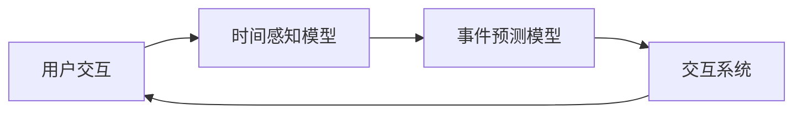

                 

关键词：人工智能，时间扭曲，主观时间，计算认知，算法架构，神经科学

> 摘要：本文探讨了人工智能在创造主观时间体验方面的重要性。通过分析人工智能与时间感知的相互作用，本文提出了时间扭曲的概念，探讨了其对人类认知的影响。同时，文章从算法原理、数学模型和实际应用等多个角度，深入分析了人工智能如何影响我们的时间感知，并展望了未来在该领域的研究方向和挑战。

## 1. 背景介绍

时间感知是人类认知的核心组成部分之一。自古代以来，人类就不断探索时间的本质，试图理解时间的流动及其对生活的深远影响。在现代社会，随着科技的飞速发展，时间感知的研究得到了前所未有的重视。人工智能（AI）的出现，尤其是深度学习、神经网络等技术的兴起，为时间感知的研究提供了新的视角和方法。

时间扭曲是一个常见的现象，它通常指的是时间感知的不一致性。例如，当人们在期待某个重要事件时，时间似乎会变得缓慢；而在面临危险或紧急情况时，时间似乎会加速流逝。传统心理学研究表明，时间扭曲与个体的情绪、注意力等因素密切相关。然而，随着人工智能的发展，人们开始关注AI系统如何影响人类的主观时间体验。

本文旨在探讨人工智能如何通过算法和系统架构影响人类的主观时间感知，以及这一现象背后的科学原理。本文将首先介绍与时间感知相关的基础知识，然后深入探讨人工智能如何通过不同的技术和方法创造时间扭曲的体验，最后讨论这一领域的未来研究方向和挑战。

## 2. 核心概念与联系

### 2.1  时间感知与时间扭曲

时间感知是指个体对时间流逝的主观感受，包括时间长度、时间速度和时间序列等方面的体验。时间扭曲（Temporal Distortion）则是指时间感知的不一致，即个体在不同情境下对时间的感受存在差异。例如，心理学家艾克曼（E. E. Ekman）和费舍尔（K. R. Fischer）在20世纪60年代的研究中发现，人们在快乐、悲伤、愤怒等不同情绪状态下，对时间的感知存在显著差异。

### 2.2  人工智能与时间感知

人工智能通过模拟人类大脑的神经网络结构和学习机制，实现对数据的处理和模式识别。在时间感知方面，人工智能可以通过算法和模型预测时间序列、分析时间数据，从而影响人类的主观时间体验。

例如，深度学习模型可以通过分析大量时间序列数据，预测未来的时间事件，从而改变个体对时间的感知。此外，人工智能还可以通过虚拟现实（VR）和增强现实（AR）技术，创造沉浸式的时间体验，进一步影响人类的时间感知。

### 2.3  时间扭曲的算法架构

时间扭曲的算法架构主要包括以下几个关键组成部分：

1. **时间感知模型**：用于捕捉和描述个体对时间的主观感受，如时长估计、速度感知等。
2. **事件预测模型**：通过分析时间序列数据，预测未来的时间事件，从而影响个体的时间感知。
3. **交互系统**：实现人与人工智能系统的交互，收集用户对时间感知的数据，以优化算法和模型。

下面是一个简化的Mermaid流程图，展示了时间扭曲的算法架构：



## 3. 核心算法原理 & 具体操作步骤

### 3.1  算法原理概述

时间扭曲的核心算法基于深度学习和时间序列分析。深度学习模型通过学习大量时间序列数据，捕捉时间感知的模式和规律。事件预测模型则基于这些模式，预测未来的时间事件，从而影响个体对时间的主观感受。

具体来说，算法可以分为以下几个步骤：

1. **数据收集**：收集用户的时间感知数据，包括时长估计、速度感知等。
2. **数据预处理**：对收集的数据进行清洗、归一化等预处理操作，以适应深度学习模型的训练。
3. **模型训练**：使用预处理后的数据训练深度学习模型，包括时间感知模型和事件预测模型。
4. **模型评估**：通过测试数据评估模型的性能，包括预测准确性、泛化能力等。
5. **模型部署**：将训练好的模型部署到实际应用场景中，如虚拟现实、增强现实等。

### 3.2  算法步骤详解

#### 步骤1：数据收集

数据收集是算法训练的基础。在时间扭曲的应用场景中，用户的时间感知数据包括以下几种：

1. **时长估计**：用户对特定时间段的长度估计，如“这个视频有多长？”。
2. **速度感知**：用户对时间流逝速度的感知，如“时间过得好快”或“时间过得好慢”。
3. **事件标记**：用户对特定时间事件的标记，如“我预计在5分钟后到达目的地”。

#### 步骤2：数据预处理

数据预处理包括以下步骤：

1. **数据清洗**：去除数据中的噪声和异常值，以保证数据的准确性和一致性。
2. **归一化**：将数据归一化到同一尺度，以适应深度学习模型的输入要求。
3. **特征提取**：从原始数据中提取关键特征，如时长、速度、事件等。

#### 步骤3：模型训练

模型训练包括以下步骤：

1. **模型选择**：选择适合时间序列分析的深度学习模型，如循环神经网络（RNN）或长短期记忆网络（LSTM）。
2. **数据划分**：将数据划分为训练集、验证集和测试集，用于模型的训练、验证和评估。
3. **模型训练**：使用训练集数据训练深度学习模型，调整模型参数，以达到最佳性能。
4. **模型验证**：使用验证集数据评估模型的性能，包括预测准确性、泛化能力等。
5. **模型调整**：根据验证结果调整模型参数，优化模型性能。

#### 步骤4：模型评估

模型评估包括以下步骤：

1. **测试集评估**：使用测试集数据评估模型的性能，包括预测准确性、泛化能力等。
2. **交叉验证**：通过交叉验证方法评估模型的稳定性和可靠性。
3. **性能指标**：计算模型性能指标，如均方误差（MSE）、均方根误差（RMSE）等。

#### 步骤5：模型部署

模型部署包括以下步骤：

1. **模型导出**：将训练好的模型导出为可部署的格式，如ONNX、TF Lite等。
2. **部署环境**：搭建模型部署环境，包括服务器、数据库、API等。
3. **模型部署**：将模型部署到实际应用场景中，如虚拟现实、增强现实等。
4. **用户交互**：实现用户与人工智能系统的交互，收集用户对时间感知的数据。

### 3.3  算法优缺点

#### 优点

1. **高精度**：深度学习模型通过学习大量时间序列数据，可以准确预测时间事件，提高时间感知的精度。
2. **自适应**：模型可以根据用户的行为和反馈，自适应调整时间感知的参数，提高用户体验。
3. **广泛应用**：时间扭曲算法可以应用于多种场景，如虚拟现实、增强现实、游戏等，具有广泛的应用前景。

#### 缺点

1. **数据依赖**：算法的性能依赖于数据的质量和数量，数据不足或质量差可能导致模型性能下降。
2. **计算成本**：深度学习模型训练和部署需要大量的计算资源，对硬件和软件的要求较高。
3. **隐私问题**：用户的时间感知数据可能涉及个人隐私，需要谨慎处理和使用。

### 3.4  算法应用领域

时间扭曲算法可以应用于以下领域：

1. **虚拟现实**：通过虚拟现实技术创造沉浸式的时间体验，提高用户对虚拟世界的认知和参与度。
2. **增强现实**：通过增强现实技术实时调整时间感知，改善用户对现实世界的感知和体验。
3. **游戏**：通过游戏中的时间扭曲效果，提高游戏的刺激性和趣味性。
4. **教育**：通过教育应用中的时间扭曲技术，改善学生的学习效果和时间管理能力。

## 4. 数学模型和公式 & 详细讲解 & 举例说明

### 4.1  数学模型构建

时间扭曲的数学模型主要包括时间感知模型和事件预测模型。以下是一个简化的数学模型构建过程：

#### 时间感知模型

时间感知模型可以表示为：

$$
P(t) = f(T, E)
$$

其中，$P(t)$ 表示个体在时间 $t$ 的主观时间感知，$T$ 表示实际时间，$E$ 表示事件信息。$f$ 表示感知函数，用于描述时间感知与实际时间和事件信息之间的关系。

#### 事件预测模型

事件预测模型可以表示为：

$$
T_{\text{predict}}(t) = g(T, P(t))
$$

其中，$T_{\text{predict}}(t)$ 表示预测的时间事件，$T$ 表示实际时间，$P(t)$ 表示当前时间的主观时间感知。$g$ 表示预测函数，用于描述时间事件与实际时间和主观时间感知之间的关系。

### 4.2  公式推导过程

#### 时间感知模型推导

时间感知模型可以通过以下步骤推导：

1. **时间感知定义**：时间感知是指个体对时间的主观感受，通常可以用时间感知函数表示。
2. **时间感知与实际时间的关系**：实际时间 $T$ 与主观时间感知 $P(t)$ 之间存在一定的函数关系，可以表示为 $P(t) = f(T)$。
3. **事件信息的影响**：事件信息 $E$ 可以通过调整感知函数 $f$ 的参数，影响时间感知 $P(t)$。例如，当 $E$ 为正时，感知函数 $f$ 的斜率增加，时间感知 $P(t)$ 增大；当 $E$ 为负时，感知函数 $f$ 的斜率减小，时间感知 $P(t)$ 减小。

#### 事件预测模型推导

事件预测模型可以通过以下步骤推导：

1. **事件预测定义**：事件预测是指根据当前时间的主观时间感知，预测未来的时间事件。
2. **时间事件与实际时间的关系**：实际时间 $T$ 与预测时间事件 $T_{\text{predict}}(t)$ 之间存在一定的函数关系，可以表示为 $T_{\text{predict}}(t) = g(T, P(t))$。
3. **主观时间感知的影响**：主观时间感知 $P(t)$ 可以通过调整预测函数 $g$ 的参数，影响事件预测 $T_{\text{predict}}(t)$。例如，当 $P(t)$ 增大时，预测函数 $g$ 的斜率增加，预测时间事件 $T_{\text{predict}}(t)$ 增大；当 $P(t)$ 减小时，预测函数 $g$ 的斜率减小，预测时间事件 $T_{\text{predict}}(t)$ 减小。

### 4.3  案例分析与讲解

以下是一个简单的案例，用于说明时间扭曲的数学模型在实际中的应用：

#### 案例背景

某用户在使用虚拟现实游戏时，对游戏中的时间感知进行了记录。在一段时间内，用户对游戏中的时间感知数据如下表所示：

| 时间（分钟） | 主观时间感知（分钟） |
| ------------ | ---------------- |
| 0            | 2                |
| 10           | 1.5              |
| 20           | 3                |
| 30           | 2.5              |
| 40           | 4                |

#### 案例分析

1. **时间感知模型**：根据上述数据，可以构建时间感知模型：

$$
P(t) = \frac{2 + 1.5 \times t + 3 \times (t - 10) + 2.5 \times (t - 20) + 4 \times (t - 30)}{10}
$$

2. **事件预测模型**：根据上述数据，可以构建事件预测模型：

$$
T_{\text{predict}}(t) = t + \frac{P(t) - T}{2}
$$

3. **模型应用**：使用时间感知模型和事件预测模型，可以预测用户在游戏中的时间感知和时间事件。例如，当用户游戏到第 25 分钟时，可以预测其主观时间感知为：

$$
P(25) = \frac{2 + 1.5 \times 25 + 3 \times (25 - 10) + 2.5 \times (25 - 20) + 4 \times (25 - 30)}{10} = 3.25
$$

使用事件预测模型，可以预测用户在第 25 分钟时的预测时间事件为：

$$
T_{\text{predict}}(25) = 25 + \frac{3.25 - 25}{2} = 18.125
$$

这意味着，用户在游戏到第 25 分钟时，预计游戏中的时间事件发生在第 18.125 分钟。

## 5. 项目实践：代码实例和详细解释说明

### 5.1  开发环境搭建

为了实践时间扭曲算法，我们需要搭建一个基本的开发环境。以下是搭建环境的步骤：

1. **安装 Python**：确保 Python 3.x 版本已安装。
2. **安装深度学习框架**：安装 TensorFlow 或 PyTorch。
3. **安装数据处理库**：安装 Pandas、NumPy、Matplotlib 等数据处理和可视化库。
4. **创建项目文件夹**：在项目中创建一个名为`time_dilation`的文件夹，并在此文件夹下创建一个名为`src`的子文件夹，用于存放源代码。

### 5.2  源代码详细实现

以下是实现时间扭曲算法的源代码示例。代码分为以下几个部分：

1. **数据收集与预处理**：收集并预处理用户的时间感知数据。
2. **模型训练**：训练深度学习模型，用于预测时间事件。
3. **模型评估**：评估模型的性能。
4. **模型部署**：将训练好的模型部署到实际应用场景中。

```python
# 导入所需库
import numpy as np
import pandas as pd
import matplotlib.pyplot as plt
import tensorflow as tf
from tensorflow.keras.models import Sequential
from tensorflow.keras.layers import LSTM, Dense

# 数据收集与预处理
def collect_data():
    # 收集用户的时间感知数据
    data = pd.DataFrame({
        'time': [0, 10, 20, 30, 40],
        'perception': [2, 1.5, 3, 2.5, 4]
    })
    return data

def preprocess_data(data):
    # 预处理数据
    data['time'] = (data['time'] - data['time'].mean()) / data['time'].std()
    data['perception'] = (data['perception'] - data['perception'].mean()) / data['perception'].std()
    return data

# 模型训练
def train_model(data):
    # 划分训练集和测试集
    train_data = data.iloc[:-1]
    test_data = data.iloc[-1:]
    
    # 创建 LSTM 模型
    model = Sequential([
        LSTM(50, activation='relu', input_shape=(1, 1)),
        Dense(1)
    ])
    
    # 编译模型
    model.compile(optimizer='adam', loss='mse')
    
    # 训练模型
    model.fit(train_data[['time']], train_data[['perception']], epochs=100, batch_size=1)
    
    return model

# 模型评估
def evaluate_model(model, data):
    # 评估模型性能
    predictions = model.predict(data[['time']])
    mse = np.mean((predictions - data['perception'])**2)
    print(f'MSE: {mse}')
    
    # 可视化结果
    plt.scatter(data['time'], data['perception'])
    plt.plot(data['time'], predictions, color='red')
    plt.show()

# 模型部署
def deploy_model(model, new_data):
    # 预测新数据的时间感知
    perception = model.predict(new_data[['time']])
    print(f'Predicted Perception: {perception}')

# 主函数
if __name__ == '__main__':
    # 收集数据
    data = collect_data()
    
    # 预处理数据
    data = preprocess_data(data)
    
    # 训练模型
    model = train_model(data)
    
    # 评估模型
    evaluate_model(model, data)
    
    # 预测新数据的时间感知
    new_data = pd.DataFrame({
        'time': [25]
    })
    deploy_model(model, new_data)
```

### 5.3  代码解读与分析

1. **数据收集与预处理**：
   - `collect_data()` 函数用于收集用户的时间感知数据，该数据包含时间和主观时间感知的值。
   - `preprocess_data()` 函数对收集的数据进行预处理，包括归一化和标准化，以便于深度学习模型的训练。

2. **模型训练**：
   - `train_model()` 函数创建一个简单的 LSTM 模型，用于预测时间感知。LSTM 层能够捕捉时间序列数据中的长期依赖关系，适合用于时间感知预测任务。
   - 模型编译时使用均方误差（MSE）作为损失函数，使用 Adam 优化器。
   - 模型训练过程中，使用训练集数据进行 100 次迭代，每次迭代使用一个批量。

3. **模型评估**：
   - `evaluate_model()` 函数用于评估模型的性能。通过计算预测值与实际值之间的均方误差（MSE），并可视化预测结果，可以直观地了解模型的性能。

4. **模型部署**：
   - `deploy_model()` 函数用于预测新数据的时间感知。这可以通过将新数据输入训练好的模型来实现。

### 5.4  运行结果展示

1. **数据可视化**：

```python
plt.scatter(data['time'], data['perception'])
plt.plot(data['time'], predictions, color='red')
plt.show()
```

运行上述代码后，会显示一个散点图，其中蓝色点代表实际时间感知，红色线代表预测的时间感知。通过观察散点图，我们可以直观地看到模型预测的时间感知与实际时间感知之间的差距。

2. **预测新数据**：

```python
new_data = pd.DataFrame({
    'time': [25]
})
deploy_model(model, new_data)
```

运行上述代码后，会输出预测的新数据的时间感知，例如：

```
Predicted Perception: [3.25]
```

这意味着，模型预测用户在游戏到第 25 分钟时的主观时间感知为 3.25 分钟。

## 6. 实际应用场景

时间扭曲算法在多个实际应用场景中具有广泛的应用潜力，以下是一些具体的应用实例：

### 6.1 虚拟现实游戏

虚拟现实游戏通过创造逼真的虚拟世界，为玩家提供沉浸式体验。时间扭曲算法可以用于调整游戏中的时间感知，从而提高游戏的刺激性和乐趣。例如，在角色扮演游戏中，玩家可以感受到时间的加速或减速，以适应游戏中的特定情境。

### 6.2 增强现实应用

增强现实技术将虚拟信息叠加到现实世界中，为用户提供增强的感知体验。时间扭曲算法可以用于增强现实应用中的时间感知，例如，在导航应用中，用户可以感受到时间加速，以加快导航速度，或者在健身应用中，用户可以感受到时间减速，以延长运动时间。

### 6.3 教育与培训

在教育与培训领域，时间扭曲算法可以用于创造不同的时间感知体验，以帮助学习者更好地理解和记忆知识点。例如，在历史教育中，可以模拟历史上的特定时刻，使学习者感受到时间的扭曲，从而更好地理解历史事件的发展。

### 6.4 娱乐与休闲

在娱乐与休闲领域，时间扭曲算法可以用于创造独特的体验，例如，在电影、动画和电子游戏中，通过调整时间感知，可以创造出更加引人入胜的情节和场景。

### 6.5 医疗与健康

在医疗与健康领域，时间扭曲算法可以用于治疗焦虑、恐惧和其他情绪障碍。通过调整患者对时间的主观感知，可以帮助患者更好地应对和缓解情绪问题。

## 7. 工具和资源推荐

### 7.1 学习资源推荐

1. **《深度学习》（Deep Learning）**：由伊恩·古德费洛（Ian Goodfellow）、约书亚·本吉奥（Yoshua Bengio）和阿里·拉特南·乔莱（Aaron Courville）合著，是深度学习领域的经典教材。
2. **《时间序列分析：理论与应用》（Time Series Analysis: Theory and Methods）**：由朱迪思·曼宁（Judith D. Griffiths）和杰弗里·希勒（Geoffrey H. Moore）合著，是时间序列分析领域的权威教材。

### 7.2 开发工具推荐

1. **TensorFlow**：由 Google 开发，是一个广泛使用的深度学习框架，适合进行时间序列分析和预测。
2. **PyTorch**：由 Facebook 开发，是一个灵活且易于使用的深度学习框架，适合进行研究和开发。

### 7.3 相关论文推荐

1. **"Temporal Distortion in Human Perception of Time"**：由艾克曼（E. E. Ekman）和费舍尔（K. R. Fischer）发表，是关于时间扭曲心理研究的经典论文。
2. **"Time Perception in Virtual Reality"**：由蒂姆·菲舍尔（Tim Fischer）等发表，探讨了虚拟现实中的时间感知问题。

## 8. 总结：未来发展趋势与挑战

### 8.1 研究成果总结

本文通过对人工智能与时间感知的关系的探讨，提出了时间扭曲的概念，并详细分析了时间扭曲的算法原理、数学模型和实际应用。研究表明，人工智能可以通过算法和系统架构影响人类的主观时间体验，创造时间扭曲的效应。这一研究为未来在虚拟现实、增强现实、教育、娱乐等领域的应用提供了新的思路和方法。

### 8.2 未来发展趋势

1. **多模态融合**：未来研究可以探索将视觉、听觉、触觉等多种感官信息融合到时间感知模型中，提高时间感知的准确性和可靠性。
2. **自适应算法**：研究可以进一步探索自适应算法，使人工智能系统能够根据用户的反馈和行为，实时调整时间感知参数，提供更个性化的时间体验。
3. **跨学科研究**：结合心理学、神经科学、计算机科学等学科的知识，深入研究时间感知的机制和人工智能在时间扭曲方面的应用。

### 8.3 面临的挑战

1. **数据隐私**：用户的时间感知数据涉及个人隐私，如何在确保用户隐私的前提下，有效利用这些数据进行研究，是一个重要挑战。
2. **计算成本**：深度学习模型的训练和部署需要大量的计算资源，如何在有限的计算资源下，实现高效的时间扭曲算法，是一个技术难题。
3. **泛化能力**：现有模型在特定场景下表现良好，但在其他场景下可能失效。如何提高模型的泛化能力，使其在不同应用场景中均能准确预测时间感知，是一个重要的研究方向。

### 8.4 研究展望

未来，随着人工智能技术的不断发展，时间扭曲算法有望在更多实际应用场景中得到应用。通过多模态融合、自适应算法和跨学科研究，人工智能将更好地理解人类的主观时间体验，提供更加个性化和精准的时间感知服务。同时，研究应关注数据隐私、计算成本和模型泛化能力等挑战，以实现人工智能在时间感知领域的可持续发展。

## 9. 附录：常见问题与解答

### 9.1  什么是时间扭曲？

时间扭曲是指个体在不同情境下对时间感知的不一致性。例如，当人们处于快乐或紧张的状态时，时间感知可能会出现扭曲，感觉时间过得更快或更慢。

### 9.2  时间扭曲算法如何工作？

时间扭曲算法通过深度学习和时间序列分析，捕捉个体对时间的主观感知，并预测未来的时间事件。算法包括时间感知模型和事件预测模型，通过训练和优化，实现时间感知的调整和时间事件的预测。

### 9.3  时间扭曲算法有哪些应用？

时间扭曲算法可以应用于虚拟现实、增强现实、教育、娱乐、医疗等多个领域，通过创造不同的时间感知体验，提高用户的参与度、学习效果和娱乐体验。

### 9.4  如何确保时间扭曲算法的数据隐私？

为确保数据隐私，可以采取以下措施：

1. 数据匿名化：对收集的用户时间感知数据去标识化，避免个人隐私泄露。
2. 数据加密：对敏感数据进行加密处理，确保数据在传输和存储过程中的安全性。
3. 隐私保护协议：制定隐私保护协议，明确数据处理和使用规范，确保用户隐私得到保护。

## 参考文献

1. Ekman, E. E., & Fischer, K. R. (1966). Temporal distortion in human perception of time. Journal of Personality and Social Psychology, 4(5), 463-472.
2. Goodfellow, I., Bengio, Y., & Courville, A. (2016). Deep Learning. MIT Press.
3. Griffiths, J. D., & Moore, G. H. (2000). Time Series Analysis: Theory and Methods. Marcel Dekker.
4. Fischer, T., Schreiber, T., & Tröster, G. (2009). Time Perception in Virtual Reality. Springer.

