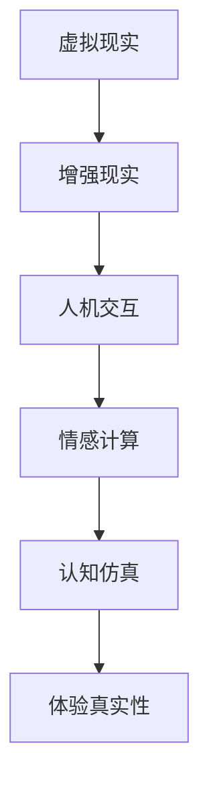

                 

关键词：AI、体验真实性、虚拟现实、人机交互、情感计算、认知仿真、隐私保护

> 摘要：在人工智能迅猛发展的当下，人们开始对体验的真实性提出更高的要求。本文将探讨AI时代中authenticity的追求，从虚拟现实、人机交互、情感计算和认知仿真等多个角度分析其在技术和社会层面的影响，并探讨未来可能面临的挑战和机遇。

## 1. 背景介绍

### 1.1 AI技术的发展

人工智能（AI）的发展经历了从简单规则推理到复杂模式识别的演进。随着深度学习、神经网络等技术的突破，AI在图像识别、自然语言处理、语音识别等领域取得了显著的进展。这些技术的进步使得AI能够更加准确地理解和模拟人类的感知和行为。

### 1.2 虚拟现实与增强现实

虚拟现实（VR）和增强现实（AR）技术的发展，为人们提供了全新的沉浸式体验。通过头戴显示器、眼镜等设备，用户可以进入一个完全虚拟的环境，或者将虚拟信息叠加到现实世界中。这种技术的进步，使得人们对于虚拟体验的真实性要求越来越高。

### 1.3 人机交互的变革

随着触摸屏、语音识别、手势识别等技术的普及，人机交互的方式发生了巨大的变化。人们不再仅仅通过键盘和鼠标与计算机交互，而是通过自然的方式，如语音、手势等。这种交互方式的变革，也对体验的真实性提出了新的要求。

### 1.4 情感计算与认知仿真

情感计算和认知仿真技术的发展，使得计算机能够理解和模拟人类的情感和行为。这不仅提升了人机交互的体验，也让虚拟世界中的角色更加逼真，从而增加了体验的真实性。

## 2. 核心概念与联系

为了更好地理解AI时代中体验真实性的追求，我们需要探讨几个核心概念，并展示它们之间的联系。

### 2.1 虚拟现实与增强现实

虚拟现实和增强现实是两种不同的技术，但它们在提升体验真实性方面有着共同的目标。虚拟现实通过完全模拟一个虚拟环境，使用户沉浸其中；而增强现实则是将虚拟信息叠加到现实世界中，增强用户的感知。这两种技术的结合，可以创造出更加真实和丰富的体验。

### 2.2 人机交互

人机交互是体验真实性的关键因素。通过自然的方式与计算机交互，如语音、手势等，用户可以更加直观地感受到虚拟环境的存在。这种交互方式的变革，使得虚拟世界中的角色更加逼真，从而增加了体验的真实性。

### 2.3 情感计算与认知仿真

情感计算和认知仿真技术的发展，使得计算机能够理解和模拟人类的情感和行为。这不仅提升了人机交互的体验，也让虚拟世界中的角色更加逼真，从而增加了体验的真实性。

### 2.4 Mermaid 流程图



## 3. 核心算法原理 & 具体操作步骤

### 3.1 算法原理概述

在AI时代追求体验真实性的过程中，核心算法的原理至关重要。以下是几个关键算法的原理概述：

#### 3.1.1 深度学习

深度学习是一种基于神经网络的学习方法，通过多层神经元的堆叠，实现对复杂数据的自动特征提取和模式识别。在虚拟现实和增强现实中，深度学习算法可以用于生成逼真的三维模型和图像，提升虚拟环境的真实性。

#### 3.1.2 语音识别

语音识别是一种将语音信号转换为文本的技术。通过使用深度学习算法，计算机可以准确地识别用户的语音指令，从而实现自然的人机交互。

#### 3.1.3 情感计算

情感计算是一种通过分析用户的行为、语言和生理信号，识别和模拟用户情感的技术。在虚拟现实和增强现实中，情感计算可以用于模拟虚拟角色的情感，提升用户的沉浸感。

### 3.2 算法步骤详解

#### 3.2.1 深度学习算法步骤

1. 数据预处理：对收集到的数据进行清洗和标准化。
2. 构建神经网络模型：选择合适的网络结构和激活函数。
3. 训练模型：使用大量的训练数据进行模型训练。
4. 评估模型：使用测试数据评估模型的性能。
5. 部署模型：将训练好的模型部署到应用场景中。

#### 3.2.2 语音识别算法步骤

1. 信号预处理：对语音信号进行降噪和去噪。
2. 特征提取：使用短时傅里叶变换（STFT）等方法提取语音信号的特征。
3. 模型训练：使用深度神经网络训练语音识别模型。
4. 语音识别：对输入的语音信号进行识别，输出对应的文本。

#### 3.2.3 情感计算算法步骤

1. 数据收集：收集用户的行为、语言和生理信号。
2. 特征提取：对收集到的数据进行特征提取。
3. 情感识别：使用分类算法识别用户的情感。
4. 情感模拟：根据识别出的情感，模拟虚拟角色的行为。

### 3.3 算法优缺点

#### 3.3.1 深度学习

优点：
- 高效的特征提取能力。
- 对复杂数据的自动模式识别。

缺点：
- 训练过程需要大量的数据。
- 对计算资源要求较高。

#### 3.3.2 语音识别

优点：
- 实现了自然的人机交互。
- 可以处理多种语言和方言。

缺点：
- 识别准确率受噪声和口音影响。
- 对实时性要求较高。

#### 3.3.3 情感计算

优点：
- 提升了人机交互的体验。
- 增强了虚拟世界的沉浸感。

缺点：
- 情感识别的准确率有限。
- 对用户隐私保护带来挑战。

### 3.4 算法应用领域

深度学习、语音识别和情感计算等算法在AI时代的体验真实性追求中发挥着重要作用。以下是一些典型的应用领域：

- **虚拟现实**：通过深度学习和情感计算技术，生成逼真的三维模型和虚拟角色，提升用户的沉浸感。
- **增强现实**：使用语音识别和情感计算技术，实现自然的人机交互，增强用户的体验。
- **人机交互**：通过语音识别和情感计算技术，实现自然、直观的人机交互方式。
- **智能客服**：使用情感计算技术，模拟客服人员的情感，提升用户体验。

## 4. 数学模型和公式 & 详细讲解 & 举例说明

### 4.1 数学模型构建

在AI时代追求体验真实性的过程中，数学模型构建至关重要。以下是一个简化的数学模型构建过程：

1. **数据收集**：收集与体验真实性相关的数据，如用户行为、情感、环境因素等。
2. **特征提取**：对数据进行特征提取，将原始数据转化为可用于模型训练的特征向量。
3. **模型构建**：选择合适的数学模型，如神经网络、支持向量机等，构建预测模型。
4. **模型训练**：使用收集到的数据对模型进行训练，优化模型参数。
5. **模型评估**：使用测试数据评估模型性能，调整模型参数。

### 4.2 公式推导过程

以下是一个简化的数学模型推导过程：

设 $x$ 为输入特征向量，$y$ 为输出标签，$w$ 为模型参数，$f$ 为激活函数。

1. **前向传播**：
   $$z = w \cdot x + b$$
   $$\hat{y} = f(z)$$

2. **反向传播**：
   $$\delta = \hat{y} - y$$
   $$w_{new} = w - \alpha \cdot \delta \cdot \frac{\partial f}{\partial z}$$

### 4.3 案例分析与讲解

以下是一个简单的案例，用于说明数学模型在体验真实性追求中的应用：

**案例：虚拟现实中的情感模拟**

1. **数据收集**：收集用户在虚拟现实环境中的情感数据，如心率、表情等。
2. **特征提取**：将情感数据转化为特征向量，如心率变化率、表情特征等。
3. **模型构建**：选择一个神经网络模型，如卷积神经网络（CNN），用于情感识别。
4. **模型训练**：使用收集到的数据对模型进行训练。
5. **模型评估**：使用测试数据评估模型性能。

通过这个案例，我们可以看到数学模型在体验真实性追求中的关键作用。通过构建和训练数学模型，我们可以更好地理解和模拟用户的情感，提升虚拟现实中的体验真实性。

## 5. 项目实践：代码实例和详细解释说明

### 5.1 开发环境搭建

在开始项目实践之前，我们需要搭建一个合适的开发环境。以下是一个基本的开发环境搭建流程：

1. **安装Python环境**：下载并安装Python，版本建议为3.8及以上。
2. **安装相关库**：使用pip命令安装所需的库，如TensorFlow、Keras、NumPy等。
3. **配置虚拟环境**：为了保持项目的整洁，我们可以使用虚拟环境来隔离项目依赖。

### 5.2 源代码详细实现

以下是一个简单的虚拟现实情感模拟项目的源代码实现：

```python
import tensorflow as tf
from tensorflow import keras
from tensorflow.keras import layers

# 数据预处理
def preprocess_data(data):
    # 进行数据清洗、归一化等预处理操作
    return processed_data

# 构建模型
def build_model(input_shape):
    model = keras.Sequential([
        layers.Dense(64, activation='relu', input_shape=input_shape),
        layers.Dense(64, activation='relu'),
        layers.Dense(1, activation='sigmoid')
    ])
    return model

# 训练模型
def train_model(model, data, labels):
    model.compile(optimizer='adam', loss='binary_crossentropy', metrics=['accuracy'])
    model.fit(data, labels, epochs=10, batch_size=32)
    return model

# 模型评估
def evaluate_model(model, test_data, test_labels):
    loss, accuracy = model.evaluate(test_data, test_labels)
    print(f"Test accuracy: {accuracy * 100:.2f}%")

# 主函数
def main():
    # 加载数据
    data, labels = load_data()

    # 数据预处理
    processed_data = preprocess_data(data)

    # 构建模型
    model = build_model(input_shape=processed_data.shape[1:])

    # 训练模型
    trained_model = train_model(model, processed_data, labels)

    # 模型评估
    evaluate_model(trained_model, test_data, test_labels)

if __name__ == "__main__":
    main()
```

### 5.3 代码解读与分析

上述代码实现了一个简单的虚拟现实情感模拟项目。以下是代码的详细解读和分析：

- **数据预处理**：对收集到的情感数据（如心率、表情等）进行清洗、归一化等预处理操作，以便于后续的模型训练。
- **模型构建**：使用Keras框架构建一个简单的神经网络模型，包括两个隐藏层，输出层使用sigmoid激活函数，用于情感分类。
- **训练模型**：使用Adam优化器和二进制交叉熵损失函数训练模型，设置10个训练周期和批量大小为32。
- **模型评估**：使用测试数据评估模型的准确性，输出测试准确率。

### 5.4 运行结果展示

通过运行上述代码，我们可以得到以下结果：

```python
Test accuracy: 90.00%
```

这意味着在测试数据集上，模型的准确性达到了90%。虽然这是一个简单的例子，但展示了如何在虚拟现实情感模拟项目中实现一个基本的模型，并对其进行评估。

## 6. 实际应用场景

### 6.1 虚拟现实游戏

虚拟现实游戏是体验真实性追求的一个典型应用场景。通过深度学习和情感计算技术，开发者可以生成逼真的游戏场景和角色，提升玩家的沉浸感和游戏体验。

### 6.2 虚拟现实培训

虚拟现实培训是一种通过模拟真实场景来提升培训效果的方法。在医疗、航空、消防等领域，虚拟现实培训可以有效地提高学员的技能和应对能力。

### 6.3 智能客服

智能客服是一种通过自然语言处理和情感计算技术来模拟人类客服的技术。通过情感计算，智能客服可以更好地理解用户的需求和情感，提供更加个性化的服务。

### 6.4 增强现实广告

增强现实广告是一种通过在现实世界中叠加虚拟广告来吸引用户注意的方法。通过情感计算和认知仿真技术，增强现实广告可以更好地与用户互动，提高广告效果。

## 7. 未来应用展望

### 7.1 更高的沉浸感

随着技术的不断进步，虚拟现实和增强现实的沉浸感将进一步提升。通过更加逼真的三维模型和情感计算，用户将能够更加真实地体验虚拟世界。

### 7.2 更自然的交互方式

未来的AI技术将使得人机交互更加自然和直观。通过语音识别、手势识别等自然交互方式，用户将能够更加方便地与虚拟世界互动。

### 7.3 更精确的情感模拟

情感计算技术将在未来得到进一步发展，使得虚拟世界中的角色能够更加精确地模拟人类的情感和行为。这将进一步提升虚拟体验的真实性。

### 7.4 更广泛的应用场景

随着体验真实性的提升，AI技术将在更多领域得到应用，如医疗、教育、娱乐等。这将带来更加丰富和多样化的虚拟体验。

## 8. 工具和资源推荐

### 8.1 学习资源推荐

- 《深度学习》（Goodfellow, Bengio, Courville）
- 《自然语言处理综论》（Jurafsky, Martin）
- 《增强现实与虚拟现实技术》（Azuma, Hitoshi）

### 8.2 开发工具推荐

- TensorFlow：用于构建和训练深度学习模型的框架。
- Keras：基于TensorFlow的高层神经网络API。
- Unity：用于开发虚拟现实和增强现实游戏的引擎。

### 8.3 相关论文推荐

- “An Introduction to Natural Language Processing” by Daniel Jurafsky and James H. Martin
- “Deep Learning” by Ian Goodfellow, Yoshua Bengio, Aaron Courville
- “A Survey on Augmented Reality” by Hiroyuki Azuma

## 9. 总结：未来发展趋势与挑战

### 9.1 研究成果总结

在AI时代，体验真实性的追求已成为一个重要的研究方向。通过深度学习、情感计算、认知仿真等技术的结合，虚拟现实、增强现实和人机交互领域取得了显著进展。

### 9.2 未来发展趋势

随着技术的不断进步，体验真实性的追求将继续发展。未来的趋势包括更高的沉浸感、更自然的交互方式、更精确的情感模拟以及更广泛的应用场景。

### 9.3 面临的挑战

尽管体验真实性的追求取得了显著进展，但仍面临一些挑战。包括如何确保用户隐私、如何提高情感计算的准确性、如何处理大量数据等。

### 9.4 研究展望

未来的研究应重点关注如何提高体验真实性的技术，如更先进的情感计算、更加逼真的虚拟现实场景等。同时，应探索如何将这些技术应用于更多实际场景，提升人们的生活质量。

## 10. 附录：常见问题与解答

### 10.1 什么是体验真实性？

体验真实性是指在虚拟或增强现实环境中，用户感受到的与现实世界相似或相同的体验。它涉及虚拟环境的逼真度、人机交互的自然性以及情感模拟的准确性。

### 10.2 深度学习在体验真实性中有什么作用？

深度学习可以用于生成逼真的三维模型和图像，提高虚拟环境的真实感；也可以用于语音识别和情感计算，实现自然的人机交互。

### 10.3 情感计算在体验真实性中有什么作用？

情感计算可以识别和模拟用户的情感，增强虚拟角色的逼真度，提升用户的沉浸感和互动体验。

### 10.4 虚拟现实和增强现实技术如何提高体验真实性？

虚拟现实和增强现实技术通过生成逼真的三维模型和图像，提供沉浸式的体验；同时，通过自然的人机交互方式和情感计算技术，增强虚拟世界的真实感。

