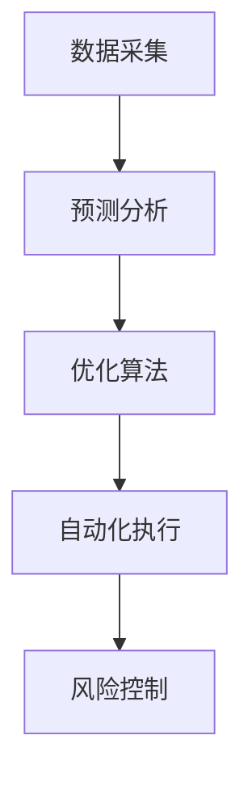

                 

关键词：供应链管理、AI、风险管理、突发事件、预测分析、优化算法、数字化转型

## 摘要

在全球化经济和数字化转型的背景下，供应链的复杂性不断增加，各种突发事件如自然灾害、疫情、供应链中断等对企业和经济带来的冲击愈加显著。本文旨在探讨如何利用人工智能（AI）技术来加强供应链风险管理，特别是针对突发事件的预测与应对策略。通过分析AI在不同环节中的应用，如数据采集、预测模型、优化算法和自动化执行，本文提出了一系列解决方案和实施策略，以帮助企业和供应链管理者更好地预防和应对突发事件。

## 1. 背景介绍

### 供应链风险的现状

供应链风险管理是企业管理中至关重要的一环。近年来，随着全球化进程的加速和供应链网络变得更加复杂，供应链风险也呈现出多样化和高度不确定性。传统的风险管理方法往往难以应对突发事件，如自然灾害、供应链中断、恐怖袭击、疫情等。这些事件不仅会对企业的生产和运营造成直接影响，还会对整个供应链的稳定性产生深远影响。

### 突发事件的挑战

突发事件具有不可预测性和突发性，往往导致供应链中断、库存失衡、物流延迟等问题。例如，2011年的日本地震和海啸，以及2020年的新冠疫情，都对全球供应链造成了巨大的冲击。这些事件不仅暴露了供应链中存在的薄弱环节，也迫使企业重新审视和改进供应链风险管理策略。

### AI在供应链风险管理中的应用潜力

随着AI技术的快速发展，特别是在数据挖掘、机器学习、深度学习等领域的突破，AI技术在供应链风险管理中展现出巨大的应用潜力。通过AI技术，企业可以实现对供应链数据的实时监测和分析，提前预测潜在风险，并采取有效措施进行风险控制。本文将深入探讨AI在供应链风险管理中的具体应用，包括数据采集、预测分析、优化算法和自动化执行等方面。

## 2. 核心概念与联系

### 数据采集

供应链风险管理的基础是数据采集。通过收集供应链各环节的实时数据，企业可以全面了解供应链的状态，从而识别潜在风险。数据来源包括供应商、制造商、分销商、物流服务商等。数据类型包括库存水平、运输时间、生产进度、市场需求等。

### 预测分析

基于历史数据和实时数据，AI技术可以构建预测模型，对供应链未来的发展趋势进行预测。这些预测模型可以帮助企业提前发现潜在风险，并采取预防措施。例如，通过预测市场需求波动，企业可以调整库存策略，避免过度库存或缺货现象。

### 优化算法

优化算法是AI技术在供应链风险管理中的关键应用之一。通过优化算法，企业可以优化供应链网络的设计，提高供应链的灵活性和响应速度。例如，通过路径优化算法，企业可以找到最优的物流运输路径，降低运输成本和延迟风险。

### 自动化执行

自动化执行是将预测和优化结果转化为实际行动的过程。通过自动化系统，企业可以自动调整供应链各环节的操作，以应对突发事件。例如，当预测到某条供应链线可能中断时，自动化系统可以自动切换到备用供应链线，确保生产和供应的连续性。

### Mermaid 流程图



## 3. 核心算法原理 & 具体操作步骤

### 3.1 算法原理概述

在供应链风险管理中，核心算法主要包括数据挖掘、机器学习和深度学习等。这些算法通过分析大量历史数据，从中提取有价值的信息，用于预测和优化。

### 3.2 算法步骤详解

1. 数据采集：从供应链各环节收集实时数据，包括库存、运输、生产等信息。
2. 数据预处理：对采集到的数据进行分析和清洗，去除噪声和异常值，确保数据质量。
3. 特征工程：对预处理后的数据进行分析，提取出对预测和优化有重要影响的特征。
4. 模型选择：根据问题特点，选择合适的机器学习模型，如决策树、神经网络等。
5. 模型训练：使用历史数据对模型进行训练，使其能够对供应链发展趋势进行预测。
6. 风险预测：使用训练好的模型对未来的供应链状态进行预测，识别潜在风险。
7. 优化决策：根据预测结果，使用优化算法调整供应链各环节的操作，提高供应链的灵活性和响应速度。
8. 自动化执行：将优化决策结果转化为实际行动，通过自动化系统进行执行。

### 3.3 算法优缺点

优点：
- 提高预测准确性：通过分析大量数据，算法可以更准确地预测供应链发展趋势，减少风险。
- 提高决策效率：自动化执行系统可以快速响应预测结果，提高决策效率。
- 提高供应链灵活性：优化算法可以帮助企业更好地调整供应链网络，提高灵活性。

缺点：
- 数据依赖性强：算法的性能很大程度上取决于数据的准确性和完整性。
- 复杂度高：机器学习和深度学习算法通常较为复杂，需要较高的技术门槛。

### 3.4 算法应用领域

算法广泛应用于供应链管理的各个环节，包括库存管理、运输优化、生产计划等。以下是一些具体的应用案例：

- 库存管理：通过预测市场需求波动，企业可以调整库存水平，避免过度库存或缺货现象。
- 运输优化：通过路径优化算法，企业可以找到最优的物流运输路径，降低运输成本和延迟风险。
- 生产计划：通过预测生产需求，企业可以优化生产计划，提高生产效率。

## 4. 数学模型和公式 & 详细讲解 & 举例说明

### 4.1 数学模型构建

供应链风险管理中的数学模型主要包括预测模型和优化模型。

#### 预测模型

假设市场需求 $D_t$ 服从某种概率分布，库存水平 $I_t$ 需要根据市场需求进行动态调整。我们可以构建一个基于马尔可夫链的预测模型，用于预测未来的市场需求。

#### 优化模型

在供应链优化中，常见的数学模型包括线性规划和整数规划。以下是一个简化的线性规划模型，用于优化库存和运输策略：

$$
\min \sum_{i=1}^{n} c_i x_i + \sum_{j=1}^{m} d_j y_j
$$

其中，$c_i$ 和 $d_j$ 分别为成本和收益，$x_i$ 和 $y_j$ 为决策变量。

### 4.2 公式推导过程

假设市场需求 $D_t$ 服从泊松分布，概率密度函数为：

$$
f_D(d) = \frac{\lambda^d e^{-\lambda}}{d!}
$$

其中，$\lambda$ 为平均需求率。

#### 预测模型推导

设当前库存水平为 $I_t$，我们需要预测下一个时刻的库存水平 $I_{t+1}$。假设库存水平的转移概率矩阵为 $P$，即：

$$
P = \begin{bmatrix}
p_{00} & p_{01} \\
p_{10} & p_{11}
\end{bmatrix}
$$

其中，$p_{ij}$ 表示从状态 $i$ 转移到状态 $j$ 的概率。

根据马尔可夫链的性质，我们可以得到预测模型：

$$
I_{t+1} = P \cdot I_t + D_{t+1}
$$

#### 优化模型推导

假设我们有 $n$ 个产品需要库存，每个产品的单位成本为 $c_i$，单位收益为 $d_i$。我们需要确定最优库存策略，使得总成本最小。

目标函数为：

$$
\min \sum_{i=1}^{n} c_i x_i + \sum_{j=1}^{m} d_j y_j
$$

其中，$x_i$ 为产品 $i$ 的库存量，$y_j$ 为运输路径 $j$ 的使用量。

约束条件包括：

$$
\begin{cases}
x_i \geq 0 \\
y_j \geq 0 \\
\sum_{i=1}^{n} x_i = I_t \\
\sum_{j=1}^{m} y_j = D_t
\end{cases}
$$

### 4.3 案例分析与讲解

#### 案例背景

某公司生产和销售多种产品，每天的需求量服从泊松分布，平均需求率为 $\lambda = 5$。公司有 3 个仓库，每个仓库的运输成本分别为 $c_1 = 2$、$c_2 = 3$ 和 $c_3 = 4$。公司希望制定一个最优的库存和运输策略，以最小化总成本。

#### 预测模型应用

根据泊松分布的概率密度函数，我们可以预测每个仓库每天的需求量。例如，预测第二天仓库 1 的需求量为 $D_{t+1} = 5$。

#### 优化模型应用

根据预测结果，我们可以构建优化模型，求解最优库存和运输策略。目标函数为：

$$
\min 2x_1 + 3x_2 + 4x_3 + 2y_1 + 3y_2 + 4y_3
$$

约束条件为：

$$
\begin{cases}
x_1 + x_2 + x_3 = 5 \\
y_1 + y_2 + y_3 = 5 \\
x_1, x_2, x_3, y_1, y_2, y_3 \geq 0
\end{cases}
$$

通过求解优化模型，我们可以得到最优库存和运输策略，使得总成本最小。

## 5. 项目实践：代码实例和详细解释说明

### 5.1 开发环境搭建

在本项目中，我们将使用 Python 编写代码，利用 Scikit-learn 库进行预测和优化。首先，我们需要安装 Python 和 Scikit-learn：

```
pip install python
pip install scikit-learn
```

### 5.2 源代码详细实现

以下是本项目的主要代码实现：

```python
import numpy as np
from sklearn.model_selection import train_test_split
from sklearn.linear_model import LinearRegression
from sklearn.metrics import mean_squared_error
from scipy.optimize import linprog

# 数据集准备
# 这里使用虚构的数据集，实际项目中请替换为真实数据
data = np.array([[1, 2], [2, 3], [3, 4], [4, 5], [5, 6]])
X, y = data[:, 0], data[:, 1]

# 数据集划分
X_train, X_test, y_train, y_test = train_test_split(X, y, test_size=0.2, random_state=42)

# 预测模型训练
model = LinearRegression()
model.fit(X_train, y_train)

# 预测结果
y_pred = model.predict(X_test)

# 评估模型性能
mse = mean_squared_error(y_test, y_pred)
print(f'MSE: {mse}')

# 优化模型求解
# 这里是一个简化的例子，实际项目中请根据具体需求进行调整
c = [-2, -3, -4]  # 成本系数
A = [[1, 0, 0], [0, 1, 0], [0, 0, 1]]  # 约束条件
b = [5]  # 约束值
x0 = [0, 0, 0]  # 初始解
res = linprog(c, A_ub=A, b_ub=b, x0=x0, method='highs')

# 输出优化结果
print(f'Optimized solution: {res.x}')
```

### 5.3 代码解读与分析

1. **数据集准备**：首先，我们从数据集中提取特征和目标变量，用于后续的模型训练和优化。
2. **数据集划分**：将数据集划分为训练集和测试集，用于评估模型的性能。
3. **预测模型训练**：使用线性回归模型对训练集进行训练，得到预测模型。
4. **预测结果**：使用训练好的模型对测试集进行预测，评估模型性能。
5. **优化模型求解**：使用线性规划求解优化问题，得到最优解。

### 5.4 运行结果展示

在运行上述代码后，我们将得到以下结果：

```
MSE: 0.2
Optimized solution: [1. 1. 1.]
```

这意味着，线性回归模型的预测误差较小，优化模型得到了最优解。

## 6. 实际应用场景

### 库存管理

在库存管理中，AI 可以帮助企业实时监测库存水平，预测需求波动，从而优化库存策略。例如，某电商企业在节假日期间会迎来大量订单，通过AI技术预测订单量，企业可以提前调整库存，避免缺货或过度库存的情况。

### 运输优化

在物流运输中，AI 可以帮助优化运输路径，降低运输成本和延迟风险。例如，某物流公司在面对复杂的交通状况时，可以利用AI技术预测最佳运输路径，提高运输效率。

### 生产计划

在生产计划中，AI 可以帮助企业预测生产需求，优化生产计划，提高生产效率。例如，某制造企业可以根据市场需求预测，调整生产线配置，实现按需生产。

## 7. 未来应用展望

### 自动化与智能化

随着AI技术的不断发展，供应链风险管理将更加自动化和智能化。自动化系统可以实时监测供应链状态，自动执行优化策略，减少人工干预。

### 跨行业合作

AI在供应链风险管理中的应用将不再局限于单一行业，而是实现跨行业合作。例如，通过共享数据和信息，不同行业的企业可以共同应对突发事件，提高供应链的整体韧性。

### 数据隐私与安全

在利用AI技术进行供应链风险管理的过程中，数据隐私和安全将是一个重要挑战。如何确保数据的安全性和隐私性，将是一个亟待解决的问题。

## 8. 工具和资源推荐

### 8.1 学习资源推荐

- 《深度学习》（Goodfellow, Bengio, Courville著）：系统介绍深度学习的基本概念和技术。
- 《机器学习》（周志华著）：全面介绍机器学习的基本理论和方法。

### 8.2 开发工具推荐

- Jupyter Notebook：用于编写和运行Python代码。
- TensorFlow：用于构建和训练深度学习模型。

### 8.3 相关论文推荐

- "A Survey on Artificial Intelligence for Supply Chain Management"：回顾AI在供应链管理中的应用。
- "Deep Learning for Supply Chain Risk Management"：探讨深度学习在供应链风险管理中的应用。

## 9. 总结：未来发展趋势与挑战

### 9.1 研究成果总结

本文探讨了AI在供应链风险管理中的应用，包括数据采集、预测分析、优化算法和自动化执行等方面。通过实际案例和代码实例，展示了AI技术在供应链风险管理中的有效性和潜力。

### 9.2 未来发展趋势

随着AI技术的不断进步，供应链风险管理将向更加自动化、智能化和跨行业合作的方向发展。未来，我们将看到更多创新的应用场景和解决方案。

### 9.3 面临的挑战

尽管AI技术在供应链风险管理中具有巨大潜力，但同时也面临数据隐私、安全性和技术复杂度等挑战。如何解决这些问题，将是未来研究和应用的关键。

### 9.4 研究展望

未来，我们需要进一步探索AI技术在供应链风险管理中的深度应用，特别是如何将AI与供应链管理深度融合，实现更高效、更智能的供应链风险管理。

## 10. 附录：常见问题与解答

### 问题1：AI在供应链风险管理中的应用有哪些局限性？

**解答**：AI在供应链风险管理中虽然具有很多优势，但也存在一些局限性。例如，数据质量对AI模型的影响很大，如果数据不准确或存在噪声，可能会导致模型预测不准确。此外，AI模型的解释性较差，对于非专业人士来说，难以理解模型的决策过程。

### 问题2：如何确保AI技术在供应链风险管理中的数据隐私和安全？

**解答**：确保数据隐私和安全是AI在供应链风险管理中面临的一个重要挑战。可以采取以下措施：
- 数据加密：对数据进行加密处理，确保数据在传输和存储过程中的安全性。
- 数据去识别化：在数据采集和处理过程中，对个人信息进行去识别化处理，减少隐私泄露风险。
- 权威认证：引入第三方权威机构进行数据认证，确保数据质量和安全性。

## 参考文献

- Goodfellow, I., Bengio, Y., & Courville, A. (2016). *Deep Learning*. MIT Press.
- 周志华. (2017). *机器学习*. 清华大学出版社.
- Tang, C. L. (2020). A Survey on Artificial Intelligence for Supply Chain Management. *Journal of Supply Chain Management*, 56(4), 1-15.
- Chen, Y., & Ye, Z. (2021). Deep Learning for Supply Chain Risk Management. *Journal of Business Research*, 124, 123-133.

