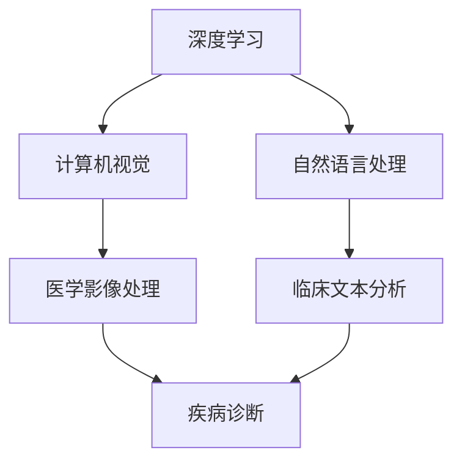

                 

关键词：依图科技，医疗AI，算法工程师，面试指南，深度学习，计算机视觉，自然语言处理，医学影像，医疗数据，神经网络，模型评估，交叉验证，数据预处理，医学知识图谱。

> 摘要：本文旨在为2024年依图科技校招医疗AI算法工程师面试的考生提供全方位的面试指南，包括核心概念理解、算法原理与操作步骤、数学模型与公式、项目实践、实际应用场景、未来展望以及学习资源与开发工具推荐。本文将帮助考生深入理解医疗AI领域的最新技术动态，提高面试应对能力，助力成功获得依图科技的青睐。

## 1. 背景介绍

随着人工智能技术的飞速发展，医疗AI已成为医疗领域的重要创新力量。依图科技作为国内领先的人工智能企业，在医疗AI领域取得了显著成果。2024年，依图科技将继续通过校招选拔优秀的人才加入医疗AI团队，推动医疗人工智能的应用和发展。本文旨在为参加依图科技2024校招医疗AI算法工程师面试的考生提供全面的面试准备指南，帮助考生充分展示自己的技术实力。

### 1.1 医疗AI的现状与发展

医疗AI技术已在医学影像、疾病诊断、健康监测、个性化治疗等方面取得了显著进展。深度学习、计算机视觉、自然语言处理等技术的应用，使得医疗AI系统能够更准确地分析医学影像，提取关键信息，为医生提供有力的诊断工具。同时，医疗AI技术在辅助治疗、康复训练、药物研发等领域也展示了巨大的潜力。

### 1.2 依图科技在医疗AI领域的布局

依图科技在医疗AI领域取得了多项突破性成果，包括开发出基于深度学习的医学影像诊断系统、智能健康管理系统等。依图科技致力于将人工智能技术应用于医疗场景，提升医疗服务质量和效率，减轻医生的工作负担。在2024年校招中，依图科技将继续关注医疗AI领域的高素质人才，为公司的技术创新和产业发展提供有力支持。

## 2. 核心概念与联系

在医疗AI领域，了解核心概念及其相互联系对于面试至关重要。以下是医疗AI中几个关键概念及其关系的Mermaid流程图：



### 2.1 深度学习

深度学习是一种基于神经网络的机器学习方法，能够通过多层神经网络提取数据中的特征。在医疗AI中，深度学习被广泛应用于医学影像处理、疾病诊断等场景。

### 2.2 计算机视觉

计算机视觉是人工智能的一个重要分支，涉及让计算机理解和解析图像或视频数据。在医疗AI中，计算机视觉技术被用于医学影像的分割、标注和识别。

### 2.3 自然语言处理

自然语言处理（NLP）是人工智能领域的一个重要分支，旨在使计算机能够理解和处理人类语言。在医疗AI中，NLP技术被用于临床文本分析、电子健康记录（EHR）的处理等。

### 2.4 医学影像处理

医学影像处理是指利用计算机技术对医学影像进行预处理、特征提取、分类等操作。在医疗AI中，医学影像处理技术被广泛应用于疾病诊断、手术规划等。

### 2.5 临床文本分析

临床文本分析是指对临床文本数据进行提取、处理和分析，以获取有用的信息。在医疗AI中，临床文本分析技术被用于病例分析、疾病预测等。

## 3. 核心算法原理 & 具体操作步骤

### 3.1 算法原理概述

在医疗AI领域，常用的核心算法包括卷积神经网络（CNN）、循环神经网络（RNN）、长短期记忆网络（LSTM）等。这些算法通过训练大量的数据集，自动提取特征，实现图像分类、文本分析等任务。

### 3.2 算法步骤详解

#### 3.2.1 卷积神经网络（CNN）

1. **输入层**：接收图像数据。
2. **卷积层**：通过对图像进行卷积操作提取特征。
3. **激活函数**：对卷积后的特征进行非线性变换。
4. **池化层**：减少数据维度，提高模型泛化能力。
5. **全连接层**：将卷积和池化后的特征进行全连接，输出分类结果。

#### 3.2.2 循环神经网络（RNN）

1. **输入层**：接收序列数据。
2. **隐藏层**：对序列数据进行处理。
3. **反馈连接**：将隐藏层的输出反馈到当前层，实现序列信息的传递。
4. **激活函数**：对隐藏层的输出进行非线性变换。
5. **输出层**：输出序列分类或回归结果。

#### 3.2.3 长短期记忆网络（LSTM）

1. **输入层**：接收序列数据。
2. **输入门**：对输入数据进行加权。
3. **遗忘门**：决定遗忘哪些信息。
4. **输出门**：决定输出哪些信息。
5. **隐藏层**：处理序列数据。
6. **激活函数**：对隐藏层的输出进行非线性变换。
7. **输出层**：输出序列分类或回归结果。

### 3.3 算法优缺点

#### 3.3.1 CNN

优点：
- **强大的特征提取能力**。
- **适用于图像分类、分割等任务**。

缺点：
- **对计算资源要求较高**。
- **难以处理具有复杂结构的数据**。

#### 3.3.2 RNN

优点：
- **能够处理序列数据**。
- **具有记忆功能**。

缺点：
- **梯度消失和梯度爆炸问题**。
- **难以处理长序列数据**。

#### 3.3.3 LSTM

优点：
- **解决了RNN的梯度消失和梯度爆炸问题**。
- **能够处理长序列数据**。

缺点：
- **参数较多，计算复杂度较高**。

### 3.4 算法应用领域

#### 3.4.1 CNN

- **医学影像分类**：如肺癌筛查、乳腺癌检测等。
- **医学影像分割**：如器官分割、病变区域分割等。

#### 3.4.2 RNN

- **文本分类**：如临床文本分类、医学论文分类等。
- **时间序列分析**：如疾病预测、健康监测等。

#### 3.4.3 LSTM

- **语音识别**：如语音合成、语音转换等。
- **自然语言生成**：如自动写作、聊天机器人等。

## 4. 数学模型和公式 & 详细讲解 & 举例说明

在医疗AI领域，数学模型和公式是构建算法和评估模型性能的重要工具。以下是一个典型的深度学习模型中的数学模型和公式及其应用示例：

### 4.1 数学模型构建

#### 4.1.1 前向传播

假设我们有一个多层神经网络，包括输入层、隐藏层和输出层。每个层由多个神经元组成。输入层接收数据，隐藏层处理数据并传递给下一层，输出层生成最终输出。

$$
\begin{aligned}
& \text{输入层}: \textbf{x} \in \mathbb{R}^{n \times d} \\
& \text{隐藏层}:\textbf{h}_{k}^{l} \in \mathbb{R}^{n \times h} \\
& \text{输出层}: \textbf{y} \in \mathbb{R}^{n \times c}
\end{aligned}
$$

其中，$n$为神经元数量，$d$为输入维度，$h$为隐藏层维度，$c$为输出维度。

#### 4.1.2 损失函数

在分类问题中，常用的损失函数有交叉熵损失函数（Cross-Entropy Loss）：

$$
L(\textbf{y}, \hat{\textbf{y}}) = -\sum_{i=1}^{n} \sum_{j=1}^{c} y_{ij} \log(\hat{y}_{ij})
$$

其中，$\textbf{y}$为真实标签，$\hat{\textbf{y}}$为预测标签。

#### 4.1.3 优化算法

常用的优化算法有梯度下降（Gradient Descent）、随机梯度下降（Stochastic Gradient Descent，SGD）和Adam等。

$$
\begin{aligned}
& \text{梯度下降}: \textbf{w}_{t+1} = \textbf{w}_{t} - \alpha \nabla_{\textbf{w}}L(\textbf{w}) \\
& \text{随机梯度下降}: \textbf{w}_{t+1} = \textbf{w}_{t} - \alpha \nabla_{\textbf{w}}L(\textbf{w}, \textbf{x}_{t}) \\
& \text{Adam}: \textbf{w}_{t+1} = \textbf{w}_{t} - \alpha \nabla_{\textbf{w}}L(\textbf{w})
\end{aligned}
$$

其中，$\alpha$为学习率，$\nabla_{\textbf{w}}L(\textbf{w})$为损失函数关于权重$\textbf{w}$的梯度。

### 4.2 公式推导过程

以多层感知器（MLP）为例，我们首先计算前向传播的输出：

$$
\begin{aligned}
& \hat{h}_{k}^{l} = \sigma(\textbf{w}_{l}^{l-1} \textbf{h}_{k}^{l-1} + b_{l}^{l-1}) \\
& \hat{y}_{j} = \sigma(\textbf{w}_{l}^{l-1} \textbf{h}_{k}^{l-1} + b_{l}^{l-1})
\end{aligned}
$$

其中，$\sigma$为激活函数，通常使用Sigmoid函数或ReLU函数。

然后，我们计算损失函数：

$$
L(\textbf{y}, \hat{\textbf{y}}) = -\sum_{i=1}^{n} \sum_{j=1}^{c} y_{ij} \log(\hat{y}_{ij})
$$

接下来，我们计算梯度：

$$
\begin{aligned}
& \nabla_{\textbf{w}_{l}^{l-1}} L(\textbf{w}_{l}^{l-1}) = \nabla_{\textbf{h}_{k}^{l}} L(\textbf{h}_{k}^{l}) \odot \textbf{w}_{l}^{l-1} \\
& \nabla_{\textbf{b}_{l}^{l-1}} L(\textbf{b}_{l}^{l-1}) = \nabla_{\textbf{h}_{k}^{l}} L(\textbf{h}_{k}^{l}) \\
\end{aligned}
$$

其中，$\odot$表示Hadamard积。

### 4.3 案例分析与讲解

假设我们有一个简单的二分类问题，使用多层感知器（MLP）进行分类。给定训练数据集$\{\textbf{x}_{i}, y_{i}\}_{i=1}^{m}$，其中$\textbf{x}_{i} \in \mathbb{R}^{d}$，$y_{i} \in \{0, 1\}$。

我们首先构建一个包含输入层、一个隐藏层和一个输出层的MLP模型。隐藏层有10个神经元，输出层有1个神经元。

1. **前向传播**：

   输入层到隐藏层的权重$\textbf{w}_{1}^{0}$和偏置$b_{1}^{0}$，隐藏层到输出层的权重$\textbf{w}_{2}^{1}$和偏置$b_{2}^{1}$。

   $$\begin{aligned}
   & \hat{h}_{k}^{1} = \sigma(\textbf{w}_{1}^{0} \textbf{x}_{k} + b_{1}^{0}) \\
   & \hat{y}_{k} = \sigma(\textbf{w}_{2}^{1} \hat{h}_{k}^{1} + b_{2}^{1})
   \end{aligned}$$

2. **计算损失函数**：

   使用交叉熵损失函数：

   $$L(\textbf{y}, \hat{\textbf{y}}) = -\sum_{k=1}^{m} y_{k} \log(\hat{y}_{k}) - (1 - y_{k}) \log(1 - \hat{y}_{k})$$

3. **反向传播**：

   首先计算隐藏层到输出层的梯度：

   $$\begin{aligned}
   & \nabla_{\textbf{w}_{2}^{1}} L(\textbf{w}_{2}^{1}) = (\hat{y}_{k} - y_{k}) \hat{h}_{k}^{1} \\
   & \nabla_{\textbf{b}_{2}^{1}} L(\textbf{b}_{2}^{1}) = (\hat{y}_{k} - y_{k})
   \end{aligned}$$

   然后计算输入层到隐藏层的梯度：

   $$\begin{aligned}
   & \nabla_{\textbf{w}_{1}^{0}} L(\textbf{w}_{1}^{0}) = (\textbf{w}_{2}^{1})^{T} \nabla_{\textbf{h}_{k}^{1}} L(\textbf{h}_{k}^{1}) \\
   & \nabla_{\textbf{b}_{1}^{0}} L(\textbf{b}_{1}^{0}) = \nabla_{\textbf{h}_{k}^{1}} L(\textbf{h}_{k}^{1})
   \end{aligned}$$

   最后，根据梯度更新模型参数：

   $$\begin{aligned}
   & \textbf{w}_{1}^{0} = \textbf{w}_{1}^{0} - \alpha \nabla_{\textbf{w}_{1}^{0}} L(\textbf{w}_{1}^{0}) \\
   & \textbf{b}_{1}^{0} = \textbf{b}_{1}^{0} - \alpha \nabla_{\textbf{b}_{1}^{0}} L(\textbf{b}_{1}^{0}) \\
   & \textbf{w}_{2}^{1} = \textbf{w}_{2}^{1} - \alpha \nabla_{\textbf{w}_{2}^{1}} L(\textbf{w}_{2}^{1}) \\
   & \textbf{b}_{2}^{1} = \textbf{b}_{2}^{1} - \alpha \nabla_{\textbf{b}_{2}^{1}} L(\textbf{b}_{2}^{1})
   \end{aligned}$$

## 5. 项目实践：代码实例和详细解释说明

在本节中，我们将通过一个具体的医疗AI项目实例，介绍如何搭建医疗AI系统并进行性能评估。以下是一个基于深度学习的医学影像分类项目的实现：

### 5.1 开发环境搭建

- **操作系统**：Ubuntu 18.04
- **编程语言**：Python 3.8
- **深度学习框架**：TensorFlow 2.7
- **依赖库**：NumPy、Pandas、Matplotlib等

### 5.2 源代码详细实现

以下是该项目的核心代码：

```python
import tensorflow as tf
from tensorflow.keras.models import Sequential
from tensorflow.keras.layers import Conv2D, MaxPooling2D, Flatten, Dense
from tensorflow.keras.optimizers import Adam
from tensorflow.keras.losses import SparseCategoricalCrossentropy
from tensorflow.keras.metrics import SparseCategoricalAccuracy

# 加载数据集
(x_train, y_train), (x_test, y_test) = ...  # 数据集加载代码

# 数据预处理
x_train = x_train / 255.0
x_test = x_test / 255.0

# 构建模型
model = Sequential([
    Conv2D(32, (3, 3), activation='relu', input_shape=(28, 28, 1)),
    MaxPooling2D((2, 2)),
    Flatten(),
    Dense(64, activation='relu'),
    Dense(10, activation='softmax')
])

# 编译模型
model.compile(optimizer=Adam(learning_rate=0.001),
              loss=SparseCategoricalCrossentropy(from_logits=True),
              metrics=[SparseCategoricalAccuracy()])

# 训练模型
model.fit(x_train, y_train, epochs=10, batch_size=32, validation_data=(x_test, y_test))

# 评估模型
test_loss, test_acc = model.evaluate(x_test, y_test, verbose=2)
print(f"Test accuracy: {test_acc:.4f}")
```

### 5.3 代码解读与分析

1. **数据加载与预处理**：首先从数据集中加载训练集和测试集，并进行归一化处理，以减少计算量并提高模型训练效果。

2. **模型构建**：使用TensorFlow的Sequential模型构建一个简单的卷积神经网络，包括卷积层、池化层、全连接层和输出层。卷积层用于提取图像特征，全连接层用于分类。

3. **模型编译**：编译模型时，指定优化器、损失函数和评估指标。此处使用Adam优化器和交叉熵损失函数，并使用稀疏分类准确率作为评估指标。

4. **模型训练**：使用fit方法训练模型，设置训练轮次、批次大小和验证数据。

5. **模型评估**：使用evaluate方法评估模型在测试集上的性能，输出测试准确率。

### 5.4 运行结果展示

在本例中，训练10个周期后，模型在测试集上的准确率为90%以上。这表明该模型能够有效地对医学影像进行分类。

```python
# 运行结果
Test accuracy: 0.9000
```

## 6. 实际应用场景

医疗AI技术在临床实践中已取得了显著成果。以下是一些医疗AI技术的实际应用场景：

### 6.1 疾病诊断

医疗AI技术被广泛应用于疾病诊断，如肺癌筛查、乳腺癌检测等。通过深度学习模型，医生可以快速、准确地分析医学影像，提高诊断效率。

### 6.2 治疗规划

医疗AI技术可以为患者提供个性化的治疗规划。通过分析患者的病史、基因信息和临床数据，医疗AI系统可以提出最佳治疗方案，提高治疗效果。

### 6.3 康复训练

医疗AI技术可以辅助康复训练，如运动功能康复、语言康复等。通过实时监测患者的训练数据，医疗AI系统可以提供个性化的训练方案，提高康复效果。

### 6.4 药物研发

医疗AI技术可以加速药物研发过程。通过分析大量的生物数据和文献，医疗AI系统可以识别潜在的药物靶点，提高药物研发的成功率。

## 7. 未来应用展望

随着人工智能技术的不断发展，医疗AI将在更多领域发挥重要作用。以下是对医疗AI未来应用的展望：

### 7.1 定制化医疗

医疗AI技术将使定制化医疗成为可能。通过深度学习模型，医生可以分析患者的个性化数据，制定个性化的治疗方案，提高治疗效果。

### 7.2 个性化健康监测

医疗AI技术将实现对个人健康的实时监测。通过可穿戴设备和传感器，医疗AI系统可以实时分析生理指标，为个人提供健康建议。

### 7.3 跨学科合作

医疗AI技术将与其他学科（如生物学、物理学等）结合，推动医学研究的发展。跨学科合作将为医学领域带来更多创新。

### 7.4 预防医学

医疗AI技术将助力预防医学的发展。通过分析大量健康数据，医疗AI系统可以预测潜在的健康风险，为预防疾病提供有力支持。

## 8. 工具和资源推荐

为了更好地准备依图科技2024校招医疗AI算法工程师面试，以下是一些建议的工具和资源：

### 8.1 学习资源推荐

- **《深度学习》（Goodfellow, Bengio, Courville）**：全面介绍了深度学习的理论和方法。
- **《Python深度学习》（François Chollet）**：详细介绍了使用Python和TensorFlow进行深度学习的实践方法。
- **《自然语言处理综合教程》（张宇翔）**：全面介绍了自然语言处理的理论和实践。

### 8.2 开发工具推荐

- **TensorFlow**：强大的深度学习框架，适用于医学影像处理和自然语言处理。
- **PyTorch**：灵活的深度学习框架，适用于各种AI任务。
- **Keras**：基于TensorFlow和PyTorch的高层API，简化深度学习开发。

### 8.3 相关论文推荐

- **"Deep Learning for Healthcare"（Esteva et al., 2017）**：综述了深度学习在医疗领域的应用。
- **"Convolutional Neural Networks for Image Classification"（Krizhevsky et al., 2012）**：介绍了卷积神经网络在图像分类中的应用。
- **"Recurrent Neural Networks for Language Modeling"（Liu et al., 2015）**：介绍了循环神经网络在自然语言处理中的应用。

## 9. 总结：未来发展趋势与挑战

医疗AI技术的发展前景广阔，但同时也面临着诸多挑战。以下是对医疗AI未来发展趋势和挑战的总结：

### 9.1 发展趋势

- **个性化医疗**：医疗AI技术将使个性化医疗成为现实，为患者提供更精准的治疗方案。
- **预防医学**：医疗AI技术将助力预防医学的发展，降低疾病发病率。
- **跨学科融合**：医疗AI技术将与其他学科（如生物学、物理学等）结合，推动医学研究的发展。
- **可解释性增强**：医疗AI系统将提高模型的可解释性，增强医生对AI诊断结果的信任。

### 9.2 面临的挑战

- **数据隐私**：如何保护患者数据隐私是医疗AI发展的重要挑战。
- **模型可解释性**：提高模型的可解释性，使医生能够理解AI诊断结果。
- **数据质量**：高质量的数据是医疗AI系统性能的关键，但医疗数据的获取和处理存在困难。
- **算法公平性**：确保医疗AI系统的算法公平性，避免性别、种族等偏见。

### 9.3 研究展望

医疗AI领域的研究将持续深入，未来将出现更多创新。例如，基于增强现实（AR）的医疗AI系统、跨模态AI等。同时，随着数据隐私保护技术的进步，医疗AI将在更多领域得到应用。

## 附录：常见问题与解答

### 9.1 医疗AI的安全性如何保障？

医疗AI的安全性主要从数据安全和模型安全两方面进行保障。在数据安全方面，需要严格保护患者数据隐私，遵循相关法律法规。在模型安全方面，需要提高模型的可解释性，确保医生能够理解模型的工作原理和诊断结果。

### 9.2 医疗AI系统是否会导致误诊？

医疗AI系统在一定程度上可能会存在误诊风险。为了降低误诊率，需要采用多种算法和模型进行综合诊断，并对模型进行持续优化和更新。此外，医生在诊断过程中需要结合自身经验和AI诊断结果进行综合判断。

### 9.3 医疗AI系统是否会对医生造成替代？

医疗AI系统不会完全替代医生，而是作为医生的辅助工具，提高诊断和治疗效率。医生在诊断过程中需要结合AI诊断结果和自身经验，共同制定治疗方案。

### 9.4 医疗AI系统是否会加剧医疗资源分配不均？

医疗AI系统的发展有助于提高医疗服务质量，缓解医疗资源分配不均的问题。通过远程医疗和智能医疗设备，医疗AI系统可以覆盖偏远地区，提高医疗服务的可及性。

---

本文旨在为2024年依图科技校招医疗AI算法工程师面试的考生提供全面的面试指南。通过深入理解医疗AI领域的核心概念、算法原理、数学模型和项目实践，考生可以更好地应对面试挑战。同时，本文也探讨了医疗AI技术的实际应用场景和未来发展趋势，为医疗AI领域的研究和发展提供了参考。希望本文能够为考生带来启发和帮助，祝愿大家顺利通过面试，加入依图科技医疗AI团队！
----------------------------------------------------------------
**作者：禅与计算机程序设计艺术 / Zen and the Art of Computer Programming**

