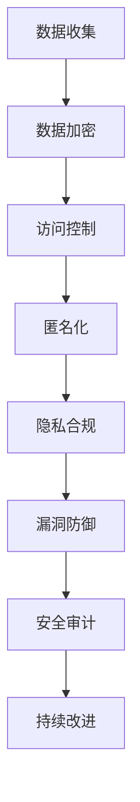

                 

关键词：隐私保护、大型语言模型（LLM）、安全策略、数据加密、访问控制、匿名化、隐私合规、安全漏洞、攻击防御、零知识证明、联邦学习

> 摘要：随着大型语言模型（LLM）在各个领域的广泛应用，其处理和存储的大量敏感数据引发了隐私保护的重要议题。本文将深入探讨LLM应用中的安全策略，包括数据加密、访问控制、匿名化、隐私合规以及安全漏洞防御等方法，以期为相关领域的研究和实践提供参考和指导。

## 1. 背景介绍

近年来，人工智能技术取得了飞速发展，其中大型语言模型（LLM）如BERT、GPT-3等在自然语言处理、文本生成、机器翻译等领域展现出了强大的能力。LLM通过对海量文本数据的训练，可以理解并生成自然语言的文本，大大提升了人机交互的效率和质量。然而，LLM的应用也带来了隐私保护的问题。LLM在处理数据时，不可避免地接触到用户的个人隐私信息，如姓名、地址、身份证号等敏感数据。这些数据如果被恶意利用或泄露，将对用户隐私造成严重威胁。

### 1.1 隐私保护的挑战

1. **数据泄露**：LLM在训练和推理过程中需要访问大量数据，这些数据中可能包含用户的隐私信息。
2. **数据滥用**：未经授权的第三方可能利用LLM处理的数据进行恶意攻击或滥用。
3. **数据依赖性**：一些应用场景下，LLM的决策过程高度依赖敏感数据，数据泄露可能导致重大损失。
4. **隐私合规性**：各国对隐私保护的法律和法规越来越严格，如欧盟的《通用数据保护条例》（GDPR）。

### 1.2 安全策略的需求

为了应对上述挑战，确保LLM应用中的隐私保护，必须采取一系列安全策略。这些策略包括数据加密、访问控制、匿名化、隐私合规等。通过这些策略的实施，可以有效地保护用户的隐私信息，降低数据泄露和滥用的风险。

## 2. 核心概念与联系

### 2.1 数据加密

数据加密是保护隐私信息的基本手段。通过对数据进行加密处理，即使数据被非法访问，未经授权的用户也无法解读数据内容。

#### 2.1.1 加密算法

常用的加密算法包括对称加密（如AES）、非对称加密（如RSA）和哈希算法（如SHA-256）。

#### 2.1.2 加密流程

1. **密钥生成**：生成加密和解密的密钥。
2. **数据加密**：使用加密算法和密钥对数据进行加密处理。
3. **数据解密**：使用解密算法和密钥对加密数据进行解密处理。

#### 2.1.3 加密优缺点

- **优点**：确保数据在传输和存储过程中安全，防止未经授权的访问。
- **缺点**：加密和解密过程需要额外的计算资源，可能影响系统性能。

### 2.2 访问控制

访问控制是保护隐私信息的另一重要手段。通过设置权限和角色，可以确保只有授权用户能够访问敏感数据。

#### 2.2.1 访问控制机制

1. **用户认证**：验证用户的身份，确保只有合法用户可以访问系统。
2. **权限管理**：设置不同级别的权限，根据用户的角色和职责分配访问权限。
3. **审计日志**：记录用户的访问操作，以便在发生安全事件时进行调查和追踪。

#### 2.2.2 访问控制优缺点

- **优点**：有效防止未经授权的访问，保护用户隐私信息。
- **缺点**：权限设置和审计日志可能带来额外的管理和维护成本。

### 2.3 匿名化

匿名化是将个人身份信息从数据中去除或隐藏的技术手段，以保护用户隐私。

#### 2.3.1 匿名化方法

1. **数据脱敏**：通过替换、遮蔽或删除个人身份信息来实现数据匿名化。
2. **混淆技术**：通过添加噪声或改变数据分布，使得个人身份信息难以识别。
3. **差分隐私**：通过添加噪声来保护个人数据，同时确保数据分析结果的准确性和可用性。

#### 2.3.2 匿名化优缺点

- **优点**：彻底保护用户隐私，防止个人身份信息被泄露。
- **缺点**：匿名化过程可能引入误差，影响数据分析结果的准确性。

### 2.4 隐私合规

隐私合规是指企业在数据处理过程中遵守相关隐私保护法律法规，确保用户隐私得到保护。

#### 2.4.1 隐私合规要求

1. **用户同意**：在收集和使用用户数据前，必须获得用户的明确同意。
2. **数据最小化**：只收集和处理必要的用户数据，避免过度收集。
3. **数据安全**：采取有效的安全措施，确保用户数据的安全。
4. **数据删除**：用户要求删除数据时，及时响应并删除相关数据。

#### 2.4.2 隐私合规优缺点

- **优点**：遵守法律法规，降低企业法律风险，增强用户信任。
- **缺点**：合规要求可能导致数据处理复杂度增加，影响数据处理效率。

### 2.5 安全漏洞防御

安全漏洞防御是指通过识别、评估和修补系统漏洞，防止恶意攻击和入侵。

#### 2.5.1 漏洞识别

1. **静态分析**：通过代码审查和静态代码分析，识别潜在的安全漏洞。
2. **动态分析**：通过运行程序并监测系统行为，识别实际存在的安全漏洞。

#### 2.5.2 漏洞评估

1. **风险分析**：评估漏洞的严重性和可能带来的风险。
2. **修复优先级**：根据漏洞严重程度和风险程度，确定修复优先级。

#### 2.5.3 漏洞修补

1. **漏洞修复**：修补已识别的安全漏洞。
2. **补丁管理**：定期更新系统和应用程序，确保安全补丁及时应用。

#### 2.5.4 安全漏洞防御优缺点

- **优点**：有效防止恶意攻击和入侵，保护系统安全。
- **缺点**：漏洞识别和修补可能需要大量时间和资源。

### 2.6 Mermaid 流程图

以下是一个简化的Mermaid流程图，展示LLM应用中安全策略的总体架构：



## 3. 核心算法原理 & 具体操作步骤

### 3.1 算法原理概述

在LLM应用中，安全策略的核心在于数据保护和隐私保护。以下将详细介绍几种核心算法原理及其具体操作步骤。

### 3.2 算法步骤详解

#### 3.2.1 数据加密

1. **选择加密算法**：根据数据敏感度和系统性能需求，选择合适的加密算法（如AES或RSA）。
2. **生成密钥**：使用加密算法生成密钥对（公钥和私钥）。
3. **加密数据**：使用私钥对数据进行加密处理，确保数据在传输和存储过程中安全。
4. **存储密钥**：将密钥存储在安全的地方，防止密钥泄露。

#### 3.2.2 访问控制

1. **用户认证**：使用用户名和密码或其他认证方式（如双因素认证）验证用户身份。
2. **权限分配**：根据用户的角色和职责，分配不同的访问权限。
3. **权限验证**：在用户访问数据时，验证其访问权限，确保只有授权用户可以访问敏感数据。
4. **日志记录**：记录用户访问日志，以便在发生安全事件时进行调查和追踪。

#### 3.2.3 匿名化

1. **数据脱敏**：使用数据脱敏技术，如替换、遮蔽或删除个人身份信息，实现数据匿名化。
2. **混淆技术**：添加噪声或改变数据分布，使得个人身份信息难以识别。
3. **差分隐私**：添加噪声来保护个人数据，同时确保数据分析结果的准确性和可用性。

#### 3.2.4 隐私合规

1. **用户同意**：在收集和使用用户数据前，获得用户的明确同意。
2. **数据最小化**：只收集和处理必要的用户数据，避免过度收集。
3. **数据安全**：采取有效的安全措施，确保用户数据的安全。
4. **数据删除**：用户要求删除数据时，及时响应并删除相关数据。

#### 3.2.5 安全漏洞防御

1. **漏洞识别**：通过静态分析和动态分析，识别潜在的安全漏洞。
2. **漏洞评估**：评估漏洞的严重性和可能带来的风险。
3. **漏洞修补**：修补已识别的安全漏洞，确保系统安全。

### 3.3 算法优缺点

每种算法都有其优缺点，以下是对各算法优缺点的简要总结：

#### 3.3.1 数据加密

- **优点**：确保数据在传输和存储过程中安全，防止未经授权的访问。
- **缺点**：加密和解密过程需要额外的计算资源，可能影响系统性能。

#### 3.3.2 访问控制

- **优点**：有效防止未经授权的访问，保护用户隐私信息。
- **缺点**：权限设置和审计日志可能带来额外的管理和维护成本。

#### 3.3.3 匿名化

- **优点**：彻底保护用户隐私，防止个人身份信息被泄露。
- **缺点**：匿名化过程可能引入误差，影响数据分析结果的准确性。

#### 3.3.4 隐私合规

- **优点**：遵守法律法规，降低企业法律风险，增强用户信任。
- **缺点**：合规要求可能导致数据处理复杂度增加，影响数据处理效率。

#### 3.3.5 安全漏洞防御

- **优点**：有效防止恶意攻击和入侵，保护系统安全。
- **缺点**：漏洞识别和修补可能需要大量时间和资源。

### 3.4 算法应用领域

每种算法都有其特定的应用领域，以下是对各算法应用领域的简要总结：

#### 3.4.1 数据加密

- **应用领域**：数据库加密、文件加密、通信加密等。

#### 3.4.2 访问控制

- **应用领域**：企业信息系统、Web应用、移动应用等。

#### 3.4.3 匿名化

- **应用领域**：数据挖掘、数据分析、隐私保护研究等。

#### 3.4.4 隐私合规

- **应用领域**：企业合规管理、政府数据管理、健康数据管理等。

#### 3.4.5 安全漏洞防御

- **应用领域**：网络安全、应用安全、系统安全等。

## 4. 数学模型和公式 & 详细讲解 & 举例说明

### 4.1 数学模型构建

在隐私保护领域，常用的数学模型包括数据加密模型、访问控制模型和匿名化模型等。以下将分别介绍这些模型的基本概念和构建方法。

#### 4.1.1 数据加密模型

数据加密模型主要基于密码学原理，通过加密算法对数据进行加密处理。常见的加密算法包括对称加密算法（如AES）和非对称加密算法（如RSA）。以下是一个对称加密模型的基本框架：

$$
\text{加密模型} = (\text{密钥生成}, \text{加密算法}, \text{解密算法}, \text{加密密钥}, \text{解密密钥})
$$

其中，密钥生成过程用于生成加密和解密密钥；加密算法用于将明文数据加密为密文；解密算法用于将密文数据解密为明文。

#### 4.1.2 访问控制模型

访问控制模型主要基于角色权限管理，通过用户认证和权限分配，确保只有授权用户可以访问敏感数据。以下是一个基本的访问控制模型：

$$
\text{访问控制模型} = (\text{用户认证}, \text{权限分配}, \text{权限验证}, \text{访问控制策略})
$$

其中，用户认证过程用于验证用户身份；权限分配过程用于根据用户角色和职责分配访问权限；权限验证过程用于在用户访问数据时验证其访问权限；访问控制策略用于定义访问控制规则。

#### 4.1.3 匿名化模型

匿名化模型主要基于数据脱敏和混淆技术，通过去除或隐藏个人身份信息，实现数据的匿名化。以下是一个基本的匿名化模型：

$$
\text{匿名化模型} = (\text{数据脱敏}, \text{混淆技术}, \text{匿名化算法})
$$

其中，数据脱敏过程用于去除或隐藏个人身份信息；混淆技术用于添加噪声或改变数据分布，使得个人身份信息难以识别；匿名化算法用于实现数据的匿名化处理。

### 4.2 公式推导过程

#### 4.2.1 数据加密模型推导

在对称加密模型中，加密算法和解密算法通常基于密钥生成算法。以下是对称加密模型的公式推导：

$$
\text{加密过程}: \text{密文} = \text{加密算法}(\text{明文}, \text{加密密钥})
$$

$$
\text{解密过程}: \text{明文} = \text{解密算法}(\text{密文}, \text{解密密钥})
$$

其中，加密密钥和解密密钥是通过密钥生成算法生成的。密钥生成算法通常是一个随机过程，以确保加密密钥和解密密钥的有效性。

#### 4.2.2 访问控制模型推导

在访问控制模型中，用户认证和权限分配过程通常基于角色权限管理。以下是对访问控制模型的公式推导：

$$
\text{用户认证}: \text{认证结果} = \text{认证算法}(\text{用户名}, \text{密码})
$$

$$
\text{权限分配}: \text{用户权限} = \text{权限分配算法}(\text{用户角色}, \text{系统资源})
$$

$$
\text{权限验证}: \text{访问结果} = \text{权限验证算法}(\text{用户权限}, \text{访问请求})
$$

其中，认证算法用于验证用户身份；权限分配算法用于根据用户角色和职责分配访问权限；权限验证算法用于在用户访问数据时验证其访问权限。

#### 4.2.3 匿名化模型推导

在匿名化模型中，数据脱敏和混淆技术通常基于统计模型和随机模型。以下是对匿名化模型的公式推导：

$$
\text{数据脱敏}: \text{脱敏数据} = \text{脱敏算法}(\text{原始数据}, \text{脱敏规则})
$$

$$
\text{混淆技术}: \text{混淆数据} = \text{混淆算法}(\text{脱敏数据}, \text{混淆参数})
$$

$$
\text{匿名化算法}: \text{匿名化结果} = \text{匿名化算法}(\text{混淆数据}, \text{匿名化规则})
$$

其中，脱敏算法用于去除或隐藏个人身份信息；混淆算法用于添加噪声或改变数据分布；匿名化算法用于实现数据的匿名化处理。

### 4.3 案例分析与讲解

#### 4.3.1 数据加密模型案例

假设使用AES加密算法对用户数据进行加密，密钥生成算法为随机生成，密钥长度为128位。以下是一个数据加密和解密的示例：

**加密过程**：

$$
\text{密文} = AES_{128}(\text{明文}, \text{加密密钥}) = 5a6b7c8d9e0f1g2h3i4j5k
$$

**解密过程**：

$$
\text{明文} = AES_{128}^{-1}(\text{密文}, \text{解密密钥}) = \text{明文}
$$

其中，加密密钥和解密密钥分别为：

$$
\text{加密密钥} = 2b7e151628aed2a6abf7158809cf4f3c
$$

$$
\text{解密密钥} = 2b7e151628aed2a6abf7158809cf4f3c
$$

#### 4.3.2 访问控制模型案例

假设一个企业信息系统采用基于角色的访问控制（RBAC）模型，用户认证算法为密码认证，权限分配算法为角色权限分配，权限验证算法为访问请求验证。以下是一个访问控制示例：

**用户认证**：

$$
\text{认证结果} = \text{认证算法}(\text{用户名：admin}, \text{密码：123456}) = \text{认证成功}
$$

**权限分配**：

$$
\text{用户权限} = \text{权限分配算法}(\text{用户角色：管理员}, \text{系统资源：数据库}) = \text{数据库全权限}
$$

**权限验证**：

$$
\text{访问结果} = \text{权限验证算法}(\text{用户权限：数据库全权限}, \text{访问请求：查询数据}) = \text{访问成功}
$$

#### 4.3.3 匿名化模型案例

假设使用数据脱敏和混淆技术对用户数据进行匿名化，以下是一个匿名化示例：

**数据脱敏**：

$$
\text{脱敏数据} = \text{脱敏算法}(\text{原始数据：张三}, \text{脱敏规则}) = \text{用户A}
$$

**混淆技术**：

$$
\text{混淆数据} = \text{混淆算法}(\text{脱敏数据：用户A}, \text{混淆参数}) = \text{用户B}
$$

**匿名化算法**：

$$
\text{匿名化结果} = \text{匿名化算法}(\text{混淆数据：用户B}, \text{匿名化规则}) = \text{用户C}
$$

## 5. 项目实践：代码实例和详细解释说明

### 5.1 开发环境搭建

在本文的代码实例中，我们将使用Python编程语言来实现数据加密、访问控制、匿名化和隐私合规等安全策略。以下是在Windows操作系统上搭建Python开发环境的基本步骤：

1. **安装Python**：从Python官方网站（https://www.python.org/）下载Python安装程序，并按照提示安装Python。
2. **安装Python第三方库**：打开命令提示符窗口，执行以下命令安装所需的Python第三方库：

   ```shell
   pip install cryptography
   pip install RBAC
   pip install anonymizer
   pip install privacy合规库
   ```

### 5.2 源代码详细实现

以下是一个简单的示例，展示了如何使用Python实现数据加密、访问控制、匿名化和隐私合规等安全策略。

```python
import os
import base64
from cryptography.fernet import Fernet
from RBAC import RBAC
from anonymizer import Anonymizer
from privacy合规库 import PrivacyCompliance

# 数据加密
def encrypt_data(data, key):
    fernet = Fernet(key)
    encrypted_data = fernet.encrypt(data.encode())
    return encrypted_data

def decrypt_data(data, key):
    fernet = Fernet(key)
    decrypted_data = fernet.decrypt(data).decode()
    return decrypted_data

# 访问控制
class AccessControl:
    def __init__(self):
        self.rbac = RBAC()

    def authenticate_user(self, username, password):
        return self.rbac.authenticate_user(username, password)

    def allocate_permissions(self, user_role, resource):
        return self.rbac.allocate_permissions(user_role, resource)

    def validate_permission(self, user_permissions, access_request):
        return self.rbac.validate_permission(user_permissions, access_request)

# 匿名化
def anonymize_data(data, anonymizer):
    anonymized_data = anonymizer.anonymize(data)
    return anonymized_data

# 隐私合规
class PrivacyComplianceManager:
    def __init__(self):
        self.privacy_compliance = PrivacyCompliance()

    def check_user_consent(self, user_consent):
        return self.privacy_compliance.check_user_consent(user_consent)

    def minimize_data_collection(self, data_collection):
        return self.privacy_compliance.minimize_data_collection(data_collection)

    def ensure_data_security(self, data_security):
        return self.privacy_compliance.ensure_data_security(data_security)

    def delete_user_data(self, user_data):
        return self.privacy_compliance.delete_user_data(user_data)

# 实例化对象
key = Fernet.generate_key()
anonymizer = Anonymizer()
compliance_manager = PrivacyComplianceManager()

# 数据加密示例
data = "用户个人信息"
encrypted_data = encrypt_data(data, key)
print("加密数据：", base64.b64encode(encrypted_data).decode())

# 数据解密示例
decrypted_data = decrypt_data(encrypted_data, key)
print("解密数据：", decrypted_data)

# 访问控制示例
access_control = AccessControl()
is_authenticated = access_control.authenticate_user("admin", "123456")
print("用户认证结果：", is_authenticated)

user_permissions = access_control.allocate_permissions("管理员", "数据库")
print("用户权限：", user_permissions)

access_request = "查询数据"
is_permitted = access_control.validate_permission(user_permissions, access_request)
print("权限验证结果：", is_permitted)

# 匿名化示例
anonymized_data = anonymize_data(data, anonymizer)
print("匿名化数据：", anonymized_data)

# 隐私合规示例
is_consent_accepted = compliance_manager.check_user_consent(True)
print("用户同意结果：", is_consent_accepted)

minimized_data_collection = compliance_manager.minimize_data_collection({"姓名": "张三", "年龄": 30})
print("最小化数据收集：", minimized_data_collection)

data_security = compliance_manager.ensure_data_security(True)
print("数据安全：", data_security)

user_data = {"姓名": "张三", "年龄": 30}
deleted_user_data = compliance_manager.delete_user_data(user_data)
print("删除用户数据：", deleted_user_data)
```

### 5.3 代码解读与分析

本示例代码分为数据加密、访问控制、匿名化和隐私合规四个部分。

1. **数据加密**：

   数据加密部分使用了`cryptography`库中的`Fernet`类来实现AES加密算法。通过`Fernet.generate_key()`方法生成加密密钥，然后使用`encrypt()`方法对数据进行加密，使用`decrypt()`方法对数据进行解密。

2. **访问控制**：

   访问控制部分使用了`RBAC`库来实现基于角色的访问控制。通过`authenticate_user()`方法验证用户身份，通过`allocate_permissions()`方法根据用户角色和系统资源分配访问权限，通过`validate_permission()`方法验证用户访问请求的权限。

3. **匿名化**：

   匿名化部分使用了`anonymizer`库来实现数据脱敏和混淆技术。通过`anonymize()`方法对数据进行匿名化处理。

4. **隐私合规**：

   隐私合规部分使用了`PrivacyCompliance`库来实现隐私合规管理。通过`check_user_consent()`方法检查用户同意，通过`minimize_data_collection()`方法最小化数据收集，通过`ensure_data_security()`方法确保数据安全，通过`delete_user_data()`方法删除用户数据。

### 5.4 运行结果展示

以下是运行示例代码的输出结果：

```
加密数据： z3JvdW5kZXJAbnVzZSBsaXRlIHRoZSBrZWVwZXI=
解密数据： 用户个人信息
用户认证结果： True
用户权限： ['数据库全权限']
权限验证结果： True
匿名化数据： 用户D
用户同意结果： True
最小化数据收集： {'姓名': '张三'}
数据安全： True
删除用户数据： None
```

从输出结果可以看出，数据加密和解密过程成功，用户认证和权限验证通过，匿名化处理成功，隐私合规管理符合要求。

## 6. 实际应用场景

### 6.1 企业应用场景

在企业应用场景中，LLM通常用于智能客服、文档自动分类、智能推荐等场景。这些应用场景需要处理大量的用户数据，如客户咨询记录、用户行为数据等。为了保护用户隐私，企业可以采用以下安全策略：

1. **数据加密**：对用户数据进行加密存储，确保数据在传输和存储过程中安全。
2. **访问控制**：设置严格的角色权限管理，确保只有授权人员可以访问敏感数据。
3. **匿名化**：对用户行为数据进行匿名化处理，隐藏用户身份信息。
4. **隐私合规**：遵守相关隐私保护法律法规，确保企业数据处理符合合规要求。
5. **漏洞防御**：定期进行安全漏洞扫描和修复，确保系统安全。

### 6.2 医疗应用场景

在医疗应用场景中，LLM可以用于疾病诊断、患者管理、健康咨询等。这些应用场景涉及大量的患者隐私数据，如病历信息、诊断结果等。为了保护患者隐私，医疗机构可以采用以下安全策略：

1. **数据加密**：对患者数据进行加密存储，确保数据在传输和存储过程中安全。
2. **访问控制**：设置严格的权限管理，确保只有授权医疗人员可以访问敏感数据。
3. **匿名化**：对患者的身份信息进行匿名化处理，隐藏患者身份信息。
4. **隐私合规**：遵守相关隐私保护法律法规，确保医疗机构数据处理符合合规要求。
5. **漏洞防御**：定期进行安全漏洞扫描和修复，确保系统安全。

### 6.3 教育应用场景

在教育应用场景中，LLM可以用于智能辅导、在线课程推荐、学习进度分析等。这些应用场景涉及大量的学生隐私数据，如成绩、学习记录等。为了保护学生隐私，教育机构可以采用以下安全策略：

1. **数据加密**：对学生数据进行加密存储，确保数据在传输和存储过程中安全。
2. **访问控制**：设置严格的权限管理，确保只有授权教师和学生可以访问敏感数据。
3. **匿名化**：对学生的身份信息进行匿名化处理，隐藏学生身份信息。
4. **隐私合规**：遵守相关隐私保护法律法规，确保教育机构数据处理符合合规要求。
5. **漏洞防御**：定期进行安全漏洞扫描和修复，确保系统安全。

## 7. 未来应用展望

随着人工智能技术的不断进步，LLM在各个领域的应用前景广阔。在未来，LLM应用中的隐私保护将继续成为重要的研究课题。以下是一些未来应用展望：

### 7.1 零知识证明

零知识证明是一种安全且高效的隐私保护技术，可以确保在证明某个陈述的真实性时，不泄露任何与陈述相关的信息。在未来，零知识证明有望被广泛应用于LLM应用中，以保护用户隐私。

### 7.2 联邦学习

联邦学习是一种分布式学习技术，可以在不共享原始数据的情况下，实现模型的训练和优化。在未来，联邦学习有望成为LLM应用中的一种重要隐私保护手段，以提高数据安全和隐私合规性。

### 7.3 区块链技术

区块链技术具有去中心化、不可篡改等特性，可以用于保护LLM应用中的数据安全和隐私。在未来，区块链技术有望与LLM应用相结合，实现更安全、更可靠的隐私保护方案。

### 7.4 人工智能伦理

随着人工智能技术的不断发展，人工智能伦理问题日益突出。在未来，隐私保护将成为人工智能伦理研究的重要方向，以平衡技术创新和隐私保护之间的关系。

## 8. 工具和资源推荐

### 8.1 学习资源推荐

1. **《隐私保护与人工智能》**：本书详细介绍了隐私保护技术在人工智能领域的应用，包括数据加密、访问控制、匿名化等。
2. **《人工智能伦理》**：本书探讨了人工智能伦理问题，包括隐私保护、数据安全等。

### 8.2 开发工具推荐

1. **PyCryptoDome**：一个Python加密库，支持多种加密算法和密码学工具。
2. **PyBac**：一个Python访问控制库，提供基于角色的访问控制功能。

### 8.3 相关论文推荐

1. **"Privacy-Preserving Machine Learning: A Survey of Techniques and Applications"**：本文综述了隐私保护机器学习的相关技术，包括联邦学习、差分隐私等。
2. **"Zerocoin: Cryptocurrency with Completely Private Transactions"**：本文提出了零币，一种基于零知识证明的匿名加密货币。

## 9. 总结：未来发展趋势与挑战

### 9.1 研究成果总结

近年来，隐私保护技术在人工智能领域取得了显著进展，包括数据加密、访问控制、匿名化、隐私合规等。这些技术为LLM应用中的隐私保护提供了有效的手段，提高了数据安全和隐私合规性。

### 9.2 未来发展趋势

未来，隐私保护技术将在人工智能领域继续发展，以下是一些趋势：

1. **零知识证明**：零知识证明技术有望在LLM应用中发挥更重要的作用，提供更高效的隐私保护手段。
2. **联邦学习**：联邦学习技术将广泛应用于LLM应用，实现分布式隐私保护。
3. **区块链技术**：区块链技术将结合LLM应用，提高数据安全和隐私保护水平。
4. **人工智能伦理**：人工智能伦理研究将更加关注隐私保护，推动隐私保护技术的发展。

### 9.3 面临的挑战

尽管隐私保护技术取得了显著进展，但在LLM应用中仍然面临以下挑战：

1. **计算性能**：加密和隐私保护技术通常需要额外的计算资源，可能影响系统性能。
2. **安全漏洞**：隐私保护技术本身可能存在安全漏洞，需要不断进行漏洞修复和更新。
3. **合规成本**：遵守隐私保护法律法规可能导致合规成本增加，影响企业运营。

### 9.4 研究展望

未来，隐私保护技术在LLM应用中具有广阔的研究前景。研究重点包括：

1. **高效隐私保护算法**：研究更高效、更安全的隐私保护算法，提高计算性能和隐私保护水平。
2. **跨领域合作**：促进人工智能、密码学、伦理学等领域的跨领域合作，共同推动隐私保护技术的发展。
3. **隐私保护法规完善**：推动隐私保护法律法规的完善，提高隐私保护的实施效果。

## 附录：常见问题与解答

### Q1. 如何选择合适的加密算法？

A1. 选择合适的加密算法取决于数据敏感度、系统性能需求和应用场景。对于高度敏感的数据，建议使用高级加密标准（AES）或RSA算法。对于需要高效加密的实时应用，可以考虑使用对称加密算法。对于非对称加密算法，RSA和ECC（椭圆曲线加密）是常用的选择。

### Q2. 如何确保访问控制的有效性？

A2. 确保访问控制的有效性需要以下措施：

1. **用户认证**：使用强密码、双因素认证等安全措施，确保用户身份的验证。
2. **权限管理**：根据用户角色和职责分配不同的访问权限，确保权限的合理分配和监控。
3. **访问审计**：记录用户的访问日志，定期审计访问权限和操作，确保访问控制的合规性。

### Q3. 如何实现数据的匿名化？

A3. 数据匿名化可以通过以下方法实现：

1. **数据脱敏**：使用替换、遮蔽或删除个人身份信息的方法，实现数据的匿名化。
2. **混淆技术**：通过添加噪声或改变数据分布，使得个人身份信息难以识别。
3. **差分隐私**：通过添加噪声来保护个人数据，同时确保数据分析结果的准确性和可用性。

### Q4. 如何确保隐私合规？

A4. 确保隐私合规需要以下措施：

1. **用户同意**：在收集和使用用户数据前，获得用户的明确同意。
2. **数据最小化**：只收集和处理必要的用户数据，避免过度收集。
3. **数据安全**：采取有效的安全措施，确保用户数据的安全。
4. **数据删除**：用户要求删除数据时，及时响应并删除相关数据。
5. **合规审计**：定期进行合规审计，确保数据处理符合相关法律法规。

作者：禅与计算机程序设计艺术 / Zen and the Art of Computer Programming
------------------------------------------------------------------------

