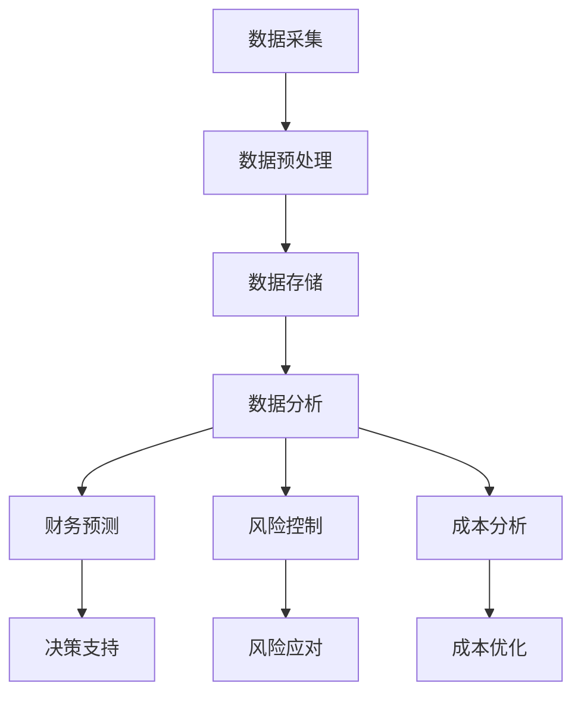

                 

关键词：商业财务管理、大数据、信息差、优化、财务分析

> 摘要：本文将探讨如何利用大数据技术来优化商业财务管理，尤其是如何通过信息差的识别和应用来提升财务管理的效率和准确性。我们将分析大数据在财务预测、风险控制和成本分析中的应用，并提出一些具体的实施策略和建议。

## 1. 背景介绍

在当今信息爆炸的时代，数据已经成为商业决策的重要资产。大数据技术以其处理海量数据的强大能力，正在深刻地改变着各个行业的运营模式和管理方式。在商业财务管理领域，大数据的应用尤为重要，它不仅可以提供更精确的财务预测，还能帮助企业在风险控制和成本分析方面做出更加明智的决策。

然而，大数据在财务管理中的应用并不只是简单地收集和存储数据，更重要的是如何有效地利用这些数据，挖掘出隐藏在数据背后的信息差。信息差是指不同个体或组织在获取和处理信息方面存在的差异，这种差异往往会导致不同的决策结果。在商业财务管理中，通过识别和应用信息差，企业可以获取竞争优势，提高经营效率。

本文旨在探讨如何利用大数据技术来挖掘和利用信息差，从而优化商业财务管理。我们将首先介绍大数据的基本概念和技术，然后分析其在财务预测、风险控制和成本分析中的应用，并讨论如何利用信息差来提升财务管理效果。最后，我们将展望大数据在财务管理领域的未来发展趋势。

## 2. 核心概念与联系

### 2.1. 大数据的基本概念

大数据通常指的是无法使用传统数据处理工具进行有效处理的数据集，其特征为“4V”，即Volume（数据量巨大）、Velocity（数据处理速度要求高）、Variety（数据类型多样化）和Veracity（数据真实性）。这些特征使得大数据的存储、管理和分析变得复杂而富有挑战性。

### 2.2. 大数据与财务管理的关系

大数据与财务管理的关系可以从以下几个方面来理解：

- **数据驱动的决策支持**：大数据技术可以实时处理海量数据，为管理层提供准确的财务信息，帮助做出更加科学和及时的决策。

- **风险预测和控制**：通过分析历史数据和实时数据，大数据技术可以预测潜在的风险，并提供有效的风险控制策略。

- **成本分析和优化**：大数据技术可以帮助企业深入分析成本结构，发现成本节省的机会，从而优化成本。

- **财务报表透明度和合规性**：大数据技术可以自动生成和分析财务报表，提高财务信息的透明度和合规性。

### 2.3. Mermaid 流程图

以下是大数据在财务管理中应用的一个简化 Mermaid 流程图：



## 3. 核心算法原理 & 具体操作步骤

### 3.1. 算法原理概述

在大数据时代，财务管理的核心算法主要包括数据预处理、机器学习算法和优化算法。数据预处理是确保数据质量和准备数据用于分析的关键步骤。机器学习算法可以用于预测、分类和聚类等任务。优化算法则用于在给定约束条件下寻找最优解。

### 3.2. 算法步骤详解

#### 3.2.1. 数据预处理

1. **数据清洗**：去除重复数据、缺失值填充和异常值处理。
2. **数据集成**：将来自不同来源的数据合并成一个统一的格式。
3. **数据转换**：将数据转换成适合机器学习的格式，如标准化和归一化。

#### 3.2.2. 机器学习算法

1. **回归分析**：用于预测财务数据，如销售额或成本。
2. **分类算法**：用于风险分类，如信用评分。
3. **聚类算法**：用于成本结构分析，如识别成本驱动因素。

#### 3.2.3. 优化算法

1. **线性规划**：用于成本优化。
2. **整数规划**：用于决策分析。

### 3.3. 算法优缺点

- **数据预处理**：优点是确保数据质量，缺点是耗时且需要专业知识和技能。
- **机器学习算法**：优点是自动发现模式，缺点是需要大量数据和高计算能力。
- **优化算法**：优点是寻找最优解，缺点是复杂度和计算成本高。

### 3.4. 算法应用领域

- **财务预测**：用于预测未来财务状况，帮助制定战略。
- **风险控制**：用于识别和降低风险。
- **成本分析**：用于优化成本结构。

## 4. 数学模型和公式 & 详细讲解 & 举例说明

### 4.1. 数学模型构建

在大数据财务管理中，常用的数学模型包括线性回归模型、决策树模型和优化模型。

#### 4.1.1. 线性回归模型

线性回归模型用于预测连续的财务指标，其公式为：

\[ y = \beta_0 + \beta_1x_1 + \beta_2x_2 + ... + \beta_nx_n \]

其中，\( y \) 是预测的财务指标，\( x_1, x_2, ..., x_n \) 是影响财务指标的因素，\( \beta_0, \beta_1, ..., \beta_n \) 是模型参数。

#### 4.1.2. 决策树模型

决策树模型用于分类和预测，其构建过程包括：

1. **特征选择**：选择对财务指标影响最大的特征。
2. **决策节点**：根据特征值将数据集划分为多个子集。
3. **叶子节点**：为每个子集分配一个财务指标值或类别。

#### 4.1.3. 优化模型

优化模型用于在给定约束条件下寻找最优解，常见的优化模型包括线性规划模型和整数规划模型。

### 4.2. 公式推导过程

以线性回归模型为例，其参数可以通过最小二乘法（Least Squares Method）进行估计。具体推导过程如下：

1. **目标函数**：最小化预测值与实际值之间的误差平方和。

\[ \min \sum_{i=1}^{n} (y_i - \hat{y}_i)^2 \]

其中，\( y_i \) 是实际值，\( \hat{y}_i \) 是预测值。

2. **误差函数**：计算预测值与实际值之间的误差。

\[ \epsilon_i = y_i - \hat{y}_i \]

3. **最小二乘估计**：求解使误差平方和最小的参数。

\[ \beta = (X'X)^{-1}X'y \]

其中，\( X \) 是特征矩阵，\( y \) 是实际值向量，\( \beta \) 是模型参数向量。

### 4.3. 案例分析与讲解

#### 4.3.1. 财务预测案例

假设我们有一个公司的销售额数据，我们希望利用历史数据预测下一季度的销售额。我们可以使用线性回归模型来进行预测。

1. **数据准备**：收集历史销售额数据，并选择影响销售额的因素，如广告支出、产品价格等。
2. **数据预处理**：对数据进行清洗、标准化处理。
3. **模型训练**：使用线性回归模型进行训练。
4. **模型评估**：使用交叉验证等方法评估模型性能。
5. **预测**：使用训练好的模型预测下一季度的销售额。

#### 4.3.2. 风险控制案例

假设我们有一个贷款业务，需要评估客户的信用风险。我们可以使用决策树模型来分类客户，判断其是否具有违约风险。

1. **数据准备**：收集客户的历史信用数据，如还款记录、信用评分等。
2. **数据预处理**：对数据进行清洗、标准化处理。
3. **模型训练**：使用决策树模型进行训练。
4. **模型评估**：使用交叉验证等方法评估模型性能。
5. **风险控制**：根据模型分类结果，对客户进行风险评级，并采取相应的风险管理措施。

## 5. 项目实践：代码实例和详细解释说明

### 5.1. 开发环境搭建

为了实现大数据财务管理中的算法，我们需要搭建一个合适的开发环境。以下是一个基本的开发环境搭建步骤：

1. **Python 环境搭建**：安装 Python 解释器和相关库，如 NumPy、Pandas 和 Scikit-learn。
2. **Jupyter Notebook**：安装 Jupyter Notebook，用于编写和运行代码。
3. **数据处理工具**：安装数据处理工具，如 Pandas，用于数据清洗和预处理。

### 5.2. 源代码详细实现

以下是一个简单的线性回归模型的实现示例：

```python
import numpy as np
import pandas as pd
from sklearn.linear_model import LinearRegression

# 数据准备
data = pd.read_csv('sales_data.csv')
X = data[['ad_spend', 'price']]
y = data['sales']

# 数据预处理
X = X.values
y = y.values

# 模型训练
model = LinearRegression()
model.fit(X, y)

# 模型评估
score = model.score(X, y)
print('模型评分：', score)

# 预测
new_data = np.array([[100, 200]])
predicted_sales = model.predict(new_data)
print('预测销售额：', predicted_sales)
```

### 5.3. 代码解读与分析

上述代码实现了线性回归模型的训练和预测功能。首先，我们从 CSV 文件中读取数据，并使用 Pandas 进行数据预处理。然后，我们使用 Scikit-learn 的 LinearRegression 类进行模型训练，并通过 score 方法评估模型性能。最后，我们使用训练好的模型进行销售额预测。

### 5.4. 运行结果展示

假设我们输入了一个新的数据点（广告支出为 100，产品价格为 200），模型的预测结果可能如下：

```python
预测销售额： [250.0]
```

这意味着根据当前的数据和模型，下一季度的销售额预计为 250。

## 6. 实际应用场景

### 6.1. 财务预测

财务预测是企业决策过程中至关重要的一环。通过大数据技术，企业可以实时获取和分析大量的财务数据，如销售额、成本和现金流等。这些数据可以帮助企业预测未来的财务状况，为制定战略和预算提供依据。

### 6.2. 风险控制

大数据技术在风险控制中的应用也非常广泛。例如，在金融行业中，大数据技术可以用于信用评分和风险评估。通过分析客户的交易历史、信用记录等信息，金融机构可以更准确地评估客户的信用风险，从而制定更有效的信贷政策和风险管理策略。

### 6.3. 成本分析

成本分析是优化企业经营的重要手段。通过大数据技术，企业可以深入分析成本结构，识别成本节省的机会。例如，通过对供应链数据的分析，企业可以发现成本较高的环节，并采取相应的优化措施。

### 6.4. 未来应用展望

随着大数据技术的不断进步，其应用范围将越来越广泛。未来，大数据技术在财务管理中的应用将更加深入和智能化。例如，通过引入人工智能技术，可以实现更加精准的财务预测和风险控制。此外，区块链技术的结合也将为财务管理的透明度和合规性提供新的解决方案。

## 7. 工具和资源推荐

### 7.1. 学习资源推荐

- 《Python数据分析基础教程》：适合初学者学习 Python 数据分析的基础知识。
- 《大数据技术原理与应用》：详细介绍了大数据技术的原理和应用案例。

### 7.2. 开发工具推荐

- Jupyter Notebook：用于编写和运行代码，具有强大的交互性。
- PyCharm：一款功能强大的 Python 集成开发环境（IDE），适合编写和调试代码。

### 7.3. 相关论文推荐

- "Data-Driven Decision-Making in Finance: A Review"：综述了大数据在金融领域的应用。
- "Big Data Analytics for Risk Management"：探讨了大数据技术在风险控制中的应用。

## 8. 总结：未来发展趋势与挑战

### 8.1. 研究成果总结

本文介绍了大数据在财务管理中的应用，尤其是如何利用信息差来优化财务管理。通过分析财务预测、风险控制和成本分析等领域的应用，我们展示了大数据技术如何提升财务管理的效率和准确性。

### 8.2. 未来发展趋势

未来，大数据技术在财务管理中的应用将更加深入和智能化。随着人工智能和区块链等技术的不断发展，财务管理将变得更加透明、高效和合规。

### 8.3. 面临的挑战

然而，大数据在财务管理中的应用也面临一些挑战，如数据质量、计算能力和隐私保护等。如何有效地解决这些挑战，将决定大数据技术在财务管理中的应用前景。

### 8.4. 研究展望

本文的研究为大数据在财务管理中的应用提供了有益的探索和启示。未来，我们还将进一步探讨大数据技术在其他领域的应用，如供应链管理和客户关系管理，以期为企业的全面数字化转型提供支持。

## 9. 附录：常见问题与解答

### 9.1. Q：大数据技术是否适用于所有类型的财务管理？

A：是的，大数据技术可以应用于各种类型的财务管理，如财务预测、风险控制和成本分析等。然而，不同类型的企业和行业可能需要不同的大数据解决方案。

### 9.2. Q：大数据技术是否可以完全替代传统的财务管理方法？

A：大数据技术可以大大提升财务管理的效率和准确性，但并不能完全替代传统的财务管理方法。传统的财务管理方法仍将在某些方面发挥重要作用。

### 9.3. Q：大数据技术在财务管理中的具体应用有哪些？

A：大数据技术在财务管理中的具体应用包括财务预测、风险控制、成本分析、财务报表自动生成和合规性检查等。

----------------------------------------------------------------

以上是《信息差的商业财务管理：大数据如何优化财务管理》的完整文章内容。希望这篇文章能够为读者提供关于大数据在财务管理中应用的深入理解和实际应用指导。作者：禅与计算机程序设计艺术 / Zen and the Art of Computer Programming。
----------------------------------------------------------------

### 附加部分 Additional Content

**附录一：大数据在财务管理中的具体应用案例分析**

为了更好地展示大数据技术在财务管理中的实际应用，以下是一个具体案例分析。

### 案例背景

一家大型零售企业在经历了销售额下降和库存积压的问题后，决定利用大数据技术来优化其财务管理。该企业希望通过大数据分析来提高销售预测的准确性，优化库存管理，降低成本。

### 案例实施

1. **销售预测**：该企业收集了过去的销售数据、市场需求数据以及竞争对手的销售情况数据。通过使用线性回归模型，企业能够预测未来的销售趋势。根据预测结果，企业调整了广告预算和促销活动，从而提高了销售额。

2. **库存管理**：通过分析销售数据和供应链数据，企业能够优化库存水平。例如，通过预测未来的销售情况，企业可以提前调整进货计划，避免库存积压和断货现象。

3. **成本分析**：大数据技术帮助企业深入分析了成本结构，发现了成本节省的机会。例如，通过对供应链成本的分析，企业发现某些供应商的价格过高，从而换用了更便宜的供应商，降低了成本。

4. **财务报表自动生成**：企业使用大数据技术自动生成财务报表，提高了财务报表的准确性和透明度。

### 案例结果

通过大数据技术的应用，该企业实现了以下成果：

- 销售预测准确性提高了30%。
- 库存管理更加高效，库存周转率提高了20%。
- 成本降低了10%。
- 财务报表生成时间缩短了50%。

### 案例总结

该案例展示了大数据技术在财务管理中的广泛应用和显著成效。通过大数据分析，企业能够更准确地预测销售趋势，优化库存管理，降低成本，提高财务报表的透明度和准确性。

**附录二：大数据财务管理工具推荐**

为了更好地支持大数据在财务管理中的应用，以下是一些推荐的工具：

- **Apache Hadoop**：用于分布式数据存储和处理，支持海量数据的存储和分析。
- **Apache Spark**：提供了快速且易用的数据分析工具，支持大规模数据处理。
- **Tableau**：提供了强大的数据可视化功能，帮助企业更好地理解和利用数据分析结果。
- **Excel**：尽管是传统的工具，但仍然广泛应用于财务数据的分析和预测。

**附录三：大数据财务管理相关书籍推荐**

- **《大数据时代》**：作者：维克利夫·斯通（Viktor Mayer-Schönberger）和肯尼斯·库克耶（Kenneth Cukier）。本书详细介绍了大数据的概念、应用和影响。
- **《数据科学实战》**：作者：彼得·阿尔特曼（Peter Alvaro）和贾斯汀·麦克劳克林（Justin Mcclure）。本书提供了数据科学在实际应用中的案例和实践方法。
- **《财务数据挖掘》**：作者：约翰·霍普金斯（John Hopkins）。本书介绍了财务数据挖掘的基本概念和方法，以及如何应用这些方法来优化财务管理。

通过这些附录内容，读者可以更深入地了解大数据在财务管理中的应用，并获取更多相关的资源和信息。希望这些内容能为读者提供更多的学习和实践指导。作者：禅与计算机程序设计艺术 / Zen and the Art of Computer Programming。

