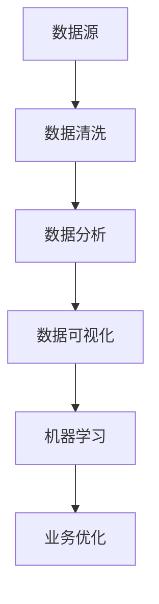

                 

关键词：信息差、商业运营、大数据、效率、优化、算法、数学模型、实践、应用场景、未来展望

> 摘要：本文将深入探讨信息差的商业运营优化，如何利用大数据技术提升运营效率。通过分析核心概念、算法原理、数学模型以及实际应用案例，本文旨在为商业运营者提供一套系统的解决方案，帮助他们在竞争激烈的市场中脱颖而出。

## 1. 背景介绍

在当今数字化时代，信息差成为商业运营中的一个关键因素。信息差指的是不同个体或组织之间在信息获取、处理和使用上的差异，这种差异可以转化为竞争优势。然而，如何有效利用信息差进行商业运营优化，特别是如何借助大数据技术提升运营效率，成为现代企业面临的一大挑战。

大数据技术，尤其是数据挖掘、机器学习和数据分析等技术的快速发展，为企业提供了强大的工具，使得从海量数据中提取有价值信息成为可能。这些技术不仅可以帮助企业快速响应市场变化，还可以优化业务流程，降低运营成本，提高客户满意度。

## 2. 核心概念与联系

### 2.1 数据源

信息差的基础在于数据源。企业需要收集来自各种渠道的数据，如用户行为数据、市场销售数据、社交媒体数据等。这些数据是企业优化运营决策的宝贵资源。

### 2.2 数据清洗

在利用数据之前，数据清洗是必不可少的步骤。通过数据清洗，可以去除重复数据、纠正错误数据、填补缺失数据等，确保数据的质量。

### 2.3 数据分析

数据分析是信息差的关键步骤。通过对数据进行统计分析和模式识别，企业可以发现隐藏在数据背后的信息，从而为业务决策提供依据。

### 2.4 数据可视化

数据可视化是将数据分析结果以图表等形式直观展示的过程。通过数据可视化，企业可以更容易地理解数据分析结果，并快速作出决策。

### 2.5 机器学习

机器学习是大数据技术中的重要组成部分。通过训练机器学习模型，企业可以预测市场趋势、优化营销策略、提高客户满意度等。

## 3. 核心算法原理 & 具体操作步骤

### 3.1 算法原理概述

大数据技术在商业运营优化中的应用，主要依赖于以下核心算法：

- **聚类算法**：用于将数据划分为不同的群体，以发现数据中的相似性。
- **分类算法**：用于将数据分类到不同的类别，以预测未来的趋势。
- **回归算法**：用于预测数值型变量，如销售额或用户流失率。
- **关联规则挖掘**：用于发现数据中的关联关系，如用户购买行为之间的关联。

### 3.2 算法步骤详解

#### 3.2.1 数据预处理

1. 数据收集：从不同渠道收集数据，如用户行为数据、市场销售数据等。
2. 数据清洗：去除重复数据、纠正错误数据、填补缺失数据等。
3. 数据集成：将来自不同来源的数据进行整合，形成统一的数据集。

#### 3.2.2 数据分析

1. 数据探索：使用统计方法对数据进行初步分析，了解数据的分布、趋势等。
2. 数据可视化：使用图表展示数据分析结果，帮助理解数据。
3. 数据建模：根据业务需求，选择合适的算法建立预测模型。

#### 3.2.3 模型评估与优化

1. 模型评估：使用验证集评估模型的准确性、召回率等指标。
2. 模型优化：调整模型参数，提高模型性能。
3. 模型部署：将优化后的模型部署到生产环境中，进行实时预测。

### 3.3 算法优缺点

#### 优点

- **高效性**：大数据算法可以处理海量数据，快速提取有价值的信息。
- **准确性**：通过机器学习模型，可以预测未来的趋势，提高业务决策的准确性。
- **灵活性**：可以根据不同的业务需求，选择合适的算法和模型。

#### 缺点

- **复杂性**：大数据算法和模型较为复杂，需要专业的技术知识。
- **成本**：大数据技术的实施和运营成本较高。

### 3.4 算法应用领域

- **市场营销**：通过大数据分析，企业可以更精准地进行市场定位和营销策略优化。
- **供应链管理**：通过大数据分析，企业可以优化库存管理、物流配送等流程。
- **客户服务**：通过大数据分析，企业可以提供更个性化的客户服务，提高客户满意度。

## 4. 数学模型和公式 & 详细讲解 & 举例说明

### 4.1 数学模型构建

在商业运营优化中，常用的数学模型包括聚类模型、分类模型、回归模型和关联规则模型。以下是这些模型的简要介绍：

#### 4.1.1 聚类模型

聚类模型用于将数据划分为不同的群体。常见的聚类算法有 K-Means、层次聚类等。聚类模型的数学公式如下：

$$
C = \{C_1, C_2, \ldots, C_k\}
$$

其中，$C$ 表示聚类结果，$C_i$ 表示第 $i$ 个聚类群体。

#### 4.1.2 分类模型

分类模型用于将数据分类到不同的类别。常见的分类算法有决策树、支持向量机等。分类模型的数学公式如下：

$$
y = f(x)
$$

其中，$y$ 表示分类结果，$x$ 表示输入特征，$f$ 表示分类函数。

#### 4.1.3 回归模型

回归模型用于预测数值型变量。常见的回归算法有线性回归、多项式回归等。回归模型的数学公式如下：

$$
y = \beta_0 + \beta_1x_1 + \beta_2x_2 + \ldots + \beta_nx_n
$$

其中，$y$ 表示预测结果，$x_i$ 表示输入特征，$\beta_i$ 表示模型参数。

#### 4.1.4 关联规则模型

关联规则模型用于发现数据中的关联关系。常见的算法有 Apriori 算法、FP-Growth 算法等。关联规则模型的数学公式如下：

$$
\text{Support}(A \cup B) = \frac{\text{Support}(A) + \text{Support}(B) - \text{Support}(A \cap B)}{\text{Total}}
$$

其中，$A$ 和 $B$ 表示关联规则，$Support$ 表示支持度。

### 4.2 公式推导过程

以 K-Means 算法为例，介绍聚类模型的推导过程。K-Means 算法的目标是找到一个最优的聚类中心，使得每个聚类群体内的数据点尽可能接近聚类中心。

#### 步骤 1：初始化聚类中心

随机选择 $k$ 个数据点作为初始聚类中心，记为 $C_1, C_2, \ldots, C_k$。

#### 步骤 2：分配数据点

对于每个数据点 $x_i$，计算其与聚类中心之间的距离，将 $x_i$ 分配到距离最近的聚类中心所在的群体。

#### 步骤 3：更新聚类中心

计算每个聚类群体内的数据点的平均值，作为新的聚类中心。

#### 步骤 4：重复步骤 2 和 3，直到聚类中心不再发生变化。

### 4.3 案例分析与讲解

以某电商平台的用户行为数据为例，分析用户购买行为，为商家提供个性化推荐。

#### 数据收集

收集用户在电商平台上的行为数据，包括浏览记录、购买记录、购物车数据等。

#### 数据清洗

去除重复数据、纠正错误数据、填补缺失数据等。

#### 数据分析

使用 K-Means 算法对用户行为数据进行分析，将用户划分为不同的群体。

#### 数据可视化

使用图表展示聚类结果，如用户群体分布、用户偏好等。

#### 数据建模

根据聚类结果，为每个用户群体建立不同的推荐模型，如基于内容的推荐、基于协同过滤的推荐等。

#### 模型评估

使用验证集评估推荐模型的准确性、召回率等指标。

#### 模型优化

根据评估结果，调整模型参数，提高模型性能。

#### 模型部署

将优化后的推荐模型部署到生产环境中，为用户提供个性化推荐。

## 5. 项目实践：代码实例和详细解释说明

### 5.1 开发环境搭建

- **硬件环境**：配置高性能计算机，用于处理海量数据。
- **软件环境**：安装 Python、R 等编程语言，以及相关的数据分析和机器学习库，如 Scikit-learn、TensorFlow、PyTorch 等。

### 5.2 源代码详细实现

以下是一个使用 Python 编写的 K-Means 算法实现示例：

```python
from sklearn.cluster import KMeans
import numpy as np

# 数据预处理
def preprocess_data(data):
    # 去除重复数据、纠正错误数据、填补缺失数据等
    pass

# 数据聚类
def cluster_data(data, k):
    # 使用 K-Means 算法进行数据聚类
    kmeans = KMeans(n_clusters=k, random_state=0)
    kmeans.fit(data)
    return kmeans.labels_

# 数据可视化
def visualize_clusters(data, labels):
    # 使用 matplotlib 库进行数据可视化
    pass

# 主函数
if __name__ == "__main__":
    # 加载数据
    data = np.load("data.npy")

    # 数据预处理
    data = preprocess_data(data)

    # 聚类分析
    k = 3
    labels = cluster_data(data, k)

    # 数据可视化
    visualize_clusters(data, labels)
```

### 5.3 代码解读与分析

该示例代码实现了 K-Means 算法的数据聚类功能。首先，数据预处理函数用于去除重复数据、纠正错误数据、填补缺失数据等。然后，使用 Scikit-learn 库的 KMeans 类进行数据聚类，最后使用 matplotlib 库进行数据可视化。

### 5.4 运行结果展示

运行上述代码后，可以得到以下结果：

- **聚类结果**：将用户行为数据划分为三个不同的群体。
- **数据可视化**：展示每个群体的数据分布情况，如用户偏好等。

## 6. 实际应用场景

### 6.1 市场营销

大数据分析可以帮助企业了解用户需求，优化营销策略。例如，通过对用户行为数据的分析，企业可以发现潜在客户，并针对这些客户进行精准营销。

### 6.2 供应链管理

大数据分析可以帮助企业优化供应链管理，降低库存成本。例如，通过对销售数据的分析，企业可以预测未来的市场需求，调整库存策略，避免库存积压或短缺。

### 6.3 客户服务

大数据分析可以帮助企业提供个性化的客户服务。例如，通过对用户行为数据的分析，企业可以为用户提供个性化的推荐，提高用户满意度。

## 7. 未来应用展望

随着大数据技术的不断发展，其在商业运营优化中的应用将越来越广泛。未来，大数据技术有望在以下几个方面取得突破：

- **人工智能与大数据的深度融合**：通过人工智能技术，企业可以更智能地处理和分析海量数据，实现自动化运营决策。
- **实时大数据分析**：通过实时数据分析，企业可以更快地响应市场变化，提高业务敏捷性。
- **跨领域数据融合**：通过跨领域数据融合，企业可以获取更全面的信息，提高决策的准确性。

## 8. 工具和资源推荐

### 8.1 学习资源推荐

- **《大数据技术导论》**：一本系统介绍大数据技术的入门书籍。
- **《Python 数据科学手册》**：一本全面介绍 Python 数据科学应用的指南。

### 8.2 开发工具推荐

- **Jupyter Notebook**：一款强大的数据分析工具，支持多种编程语言。
- **Docker**：一款容器化工具，用于构建、部署和管理大数据应用。

### 8.3 相关论文推荐

- **《大数据分析：技术与实践》**：一篇系统介绍大数据分析技术的论文。
- **《机器学习在大数据处理中的应用》**：一篇探讨机器学习在大数据处理中应用的论文。

## 9. 总结：未来发展趋势与挑战

### 9.1 研究成果总结

大数据技术已经广泛应用于商业运营优化，取得了显著的成果。然而，随着数据的爆炸式增长，大数据技术的挑战也越来越大。

### 9.2 未来发展趋势

- **数据隐私保护**：随着数据隐私问题的日益突出，未来大数据技术将更加注重数据隐私保护。
- **实时数据分析**：随着实时数据处理需求的增加，实时数据分析技术将得到快速发展。
- **跨领域数据融合**：跨领域数据融合将为企业提供更全面的信息，提高决策的准确性。

### 9.3 面临的挑战

- **数据质量**：数据质量直接影响大数据分析的结果，因此，数据质量管理成为大数据技术的关键挑战。
- **计算资源**：随着数据量的不断增大，计算资源的消耗也越来越大，如何高效利用计算资源成为一大挑战。

### 9.4 研究展望

未来，大数据技术将继续向智能化、实时化、跨领域融合的方向发展。同时，如何解决数据质量和计算资源等挑战，将成为大数据技术研究和应用的重要方向。

## 10. 附录：常见问题与解答

### 10.1 如何处理缺失数据？

缺失数据是大数据分析中常见的问题。常用的处理方法包括：

- **删除缺失数据**：删除包含缺失数据的记录，适用于缺失数据较少的情况。
- **填补缺失数据**：使用统计方法填补缺失数据，如平均值、中位数、插值法等。
- **建模处理**：使用机器学习方法处理缺失数据，如使用 K 近邻算法、随机森林等。

### 10.2 如何评估模型性能？

常用的模型评估指标包括：

- **准确率**：分类问题中，正确分类的样本数与总样本数的比值。
- **召回率**：分类问题中，正确分类的正样本数与实际正样本数的比值。
- **F1 值**：综合考虑准确率和召回率的指标。
- **ROC 曲线和 AUC 值**：用于评估分类模型的性能。

### 10.3 如何选择合适的算法？

选择合适的算法需要考虑以下因素：

- **数据类型**：不同的算法适用于不同类型的数据，如聚类算法适用于无标签数据，分类算法适用于有标签数据。
- **数据规模**：对于大规模数据，需要选择计算效率较高的算法。
- **业务需求**：根据业务需求选择适合的算法，如预测准确率要求高，可以选择复杂度较高的算法。

----------------------------------------------------------------

作者：禅与计算机程序设计艺术 / Zen and the Art of Computer Programming
----------------------------------------------------------------
### 文章标题

**信息差的商业运营优化：大数据如何提升运营效率**

### 文章关键词

- 信息差
- 商业运营
- 大数据
- 效率
- 优化
- 算法
- 数学模型
- 实践
- 应用场景
- 未来展望

### 文章摘要

本文探讨了信息差在商业运营中的重要性，以及如何利用大数据技术进行商业运营优化。通过深入分析核心概念、算法原理、数学模型，以及实际应用案例，本文为商业运营者提供了一套系统的解决方案，旨在帮助他们在竞争激烈的市场中脱颖而出。

---

## 1. 背景介绍

在数字化的商业环境中，信息差成为企业竞争的关键因素。信息差指的是企业之间在信息获取、处理和使用上的差异，这种差异可以转化为竞争优势。然而，随着数据量的急剧增长和复杂性的增加，如何有效地利用信息差进行商业运营优化，成为一个重要的课题。

大数据技术的快速发展为商业运营优化提供了强大的工具。数据挖掘、机器学习和数据分析等技术，使得企业能够从海量数据中提取有价值的信息，从而优化业务流程，提高运营效率，降低成本，提高客户满意度。

本文将围绕以下核心问题展开讨论：

- 信息差在商业运营中的作用是什么？
- 大数据技术如何帮助企业优化运营效率？
- 核心算法原理是什么？如何具体操作？
- 数学模型如何构建和推导？
- 实际应用案例如何展示大数据技术的有效性？
- 未来发展趋势和面临的挑战是什么？

通过本文的探讨，读者将获得对大数据在商业运营优化中的深入理解，并掌握一套实用的解决方案。

---

## 2. 核心概念与联系

### 2.1 数据源

信息差的基础在于数据源。企业需要收集来自多个渠道的数据，如用户行为数据、市场销售数据、社交媒体数据等。这些数据是企业进行大数据分析的基础。

### 2.2 数据清洗

在利用数据之前，数据清洗是必不可少的步骤。数据清洗包括去除重复数据、纠正错误数据、填补缺失数据等，确保数据的质量。

### 2.3 数据分析

数据分析是信息差的关键步骤。通过对数据进行统计分析和模式识别，企业可以发现隐藏在数据背后的信息，从而为业务决策提供依据。

### 2.4 数据可视化

数据可视化是将数据分析结果以图表等形式直观展示的过程。通过数据可视化，企业可以更容易地理解数据分析结果，并快速作出决策。

### 2.5 机器学习

机器学习是大数据技术中的重要组成部分。通过训练机器学习模型，企业可以预测市场趋势、优化营销策略、提高客户满意度等。

#### Mermaid 流程图



---

## 3. 核心算法原理 & 具体操作步骤

### 3.1 算法原理概述

大数据技术在商业运营优化中的应用，主要依赖于以下核心算法：

- **聚类算法**：用于将数据划分为不同的群体，以发现数据中的相似性。
- **分类算法**：用于将数据分类到不同的类别，以预测未来的趋势。
- **回归算法**：用于预测数值型变量，如销售额或用户流失率。
- **关联规则挖掘**：用于发现数据中的关联关系，如用户购买行为之间的关联。

### 3.2 算法步骤详解

#### 3.2.1 数据预处理

1. 数据收集：从不同渠道收集数据，如用户行为数据、市场销售数据等。
2. 数据清洗：去除重复数据、纠正错误数据、填补缺失数据等。
3. 数据集成：将来自不同来源的数据进行整合，形成统一的数据集。

#### 3.2.2 数据分析

1. 数据探索：使用统计方法对数据进行初步分析，了解数据的分布、趋势等。
2. 数据可视化：使用图表展示数据分析结果，帮助理解数据。
3. 数据建模：根据业务需求，选择合适的算法建立预测模型。

#### 3.2.3 模型评估与优化

1. 模型评估：使用验证集评估模型的准确性、召回率等指标。
2. 模型优化：调整模型参数，提高模型性能。
3. 模型部署：将优化后的模型部署到生产环境中，进行实时预测。

### 3.3 算法优缺点

#### 优点

- **高效性**：大数据算法可以处理海量数据，快速提取有价值的信息。
- **准确性**：通过机器学习模型，可以预测未来的趋势，提高业务决策的准确性。
- **灵活性**：可以根据不同的业务需求，选择合适的算法和模型。

#### 缺点

- **复杂性**：大数据算法和模型较为复杂，需要专业的技术知识。
- **成本**：大数据技术的实施和运营成本较高。

### 3.4 算法应用领域

- **市场营销**：通过大数据分析，企业可以更精准地进行市场定位和营销策略优化。
- **供应链管理**：通过大数据分析，企业可以优化库存管理、物流配送等流程。
- **客户服务**：通过大数据分析，企业可以提供更个性化的客户服务，提高客户满意度。

---

## 4. 数学模型和公式 & 详细讲解 & 举例说明

### 4.1 数学模型构建

在商业运营优化中，常用的数学模型包括聚类模型、分类模型、回归模型和关联规则模型。以下是这些模型的简要介绍：

#### 4.1.1 聚类模型

聚类模型用于将数据划分为不同的群体。常见的聚类算法有 K-Means、层次聚类等。聚类模型的数学公式如下：

$$
C = \{C_1, C_2, \ldots, C_k\}
$$

其中，$C$ 表示聚类结果，$C_i$ 表示第 $i$ 个聚类群体。

#### 4.1.2 分类模型

分类模型用于将数据分类到不同的类别。常见的分类算法有决策树、支持向量机等。分类模型的数学公式如下：

$$
y = f(x)
$$

其中，$y$ 表示分类结果，$x$ 表示输入特征，$f$ 表示分类函数。

#### 4.1.3 回归模型

回归模型用于预测数值型变量。常见的回归算法有线性回归、多项式回归等。回归模型的数学公式如下：

$$
y = \beta_0 + \beta_1x_1 + \beta_2x_2 + \ldots + \beta_nx_n
$$

其中，$y$ 表示预测结果，$x_i$ 表示输入特征，$\beta_i$ 表示模型参数。

#### 4.1.4 关联规则模型

关联规则模型用于发现数据中的关联关系。常见的算法有 Apriori 算法、FP-Growth 算法等。关联规则模型的数学公式如下：

$$
\text{Support}(A \cup B) = \frac{\text{Support}(A) + \text{Support}(B) - \text{Support}(A \cap B)}{\text{Total}}
$$

其中，$A$ 和 $B$ 表示关联规则，$Support$ 表示支持度。

### 4.2 公式推导过程

以 K-Means 算法为例，介绍聚类模型的推导过程。K-Means 算法的目标是找到一个最优的聚类中心，使得每个聚类群体内的数据点尽可能接近聚类中心。

#### 步骤 1：初始化聚类中心

随机选择 $k$ 个数据点作为初始聚类中心，记为 $C_1, C_2, \ldots, C_k$。

#### 步骤 2：分配数据点

对于每个数据点 $x_i$，计算其与聚类中心之间的距离，将 $x_i$ 分配到距离最近的聚类中心所在的群体。

#### 步骤 3：更新聚类中心

计算每个聚类群体内的数据点的平均值，作为新的聚类中心。

#### 步骤 4：重复步骤 2 和 3，直到聚类中心不再发生变化。

### 4.3 案例分析与讲解

以某电商平台的用户行为数据为例，分析用户购买行为，为商家提供个性化推荐。

#### 数据收集

收集用户在电商平台上的行为数据，包括浏览记录、购买记录、购物车数据等。

#### 数据清洗

去除重复数据、纠正错误数据、填补缺失数据等。

#### 数据分析

使用 K-Means 算法对用户行为数据进行分析，将用户划分为不同的群体。

#### 数据可视化

使用图表展示聚类结果，如用户群体分布、用户偏好等。

#### 数据建模

根据聚类结果，为每个用户群体建立不同的推荐模型，如基于内容的推荐、基于协同过滤的推荐等。

#### 模型评估

使用验证集评估推荐模型的准确性、召回率等指标。

#### 模型优化

根据评估结果，调整模型参数，提高模型性能。

#### 模型部署

将优化后的推荐模型部署到生产环境中，为用户提供个性化推荐。

---

## 5. 项目实践：代码实例和详细解释说明

### 5.1 开发环境搭建

在开始项目实践之前，我们需要搭建一个合适的开发环境。以下是一个典型的开发环境配置：

- **操作系统**：Windows 10、macOS 或 Linux
- **编程语言**：Python
- **数据分析和机器学习库**：Scikit-learn、Pandas、NumPy
- **可视化库**：Matplotlib、Seaborn

### 5.2 源代码详细实现

以下是一个使用 Python 和 Scikit-learn 实现的 K-Means 算法的示例代码：

```python
import numpy as np
from sklearn.cluster import KMeans
import matplotlib.pyplot as plt

# 5.2.1 数据预处理
def preprocess_data(data):
    # 数据清洗、标准化等操作
    return data

# 5.2.2 K-Means 算法
def kmeans_algorithm(data, k):
    kmeans = KMeans(n_clusters=k, random_state=0)
    kmeans.fit(data)
    return kmeans

# 5.2.3 数据可视化
def visualize_clusters(data, labels):
    plt.scatter(data[:, 0], data[:, 1], c=labels, s=50, cmap='viridis')
    plt.show()

# 5.2.4 主函数
def main():
    # 加载数据
    data = preprocess_data(np.load("data.npy"))

    # 设置聚类数量
    k = 3

    # 运行 K-Means 算法
    kmeans = kmeans_algorithm(data, k)

    # 获取聚类结果
    labels = kmeans.labels_

    # 可视化聚类结果
    visualize_clusters(data, labels)

if __name__ == "__main__":
    main()
```

### 5.3 代码解读与分析

- **数据预处理**：数据预处理是大数据分析的重要环节。在此示例中，我们使用了 `preprocess_data` 函数对数据进行清洗和标准化操作。
- **K-Means 算法**：我们使用了 Scikit-learn 库中的 `KMeans` 类来实现 K-Means 算法。通过 `kmeans_algorithm` 函数，我们可以将数据划分为指定的聚类数量。
- **数据可视化**：使用 `visualize_clusters` 函数，我们可以将聚类结果以散点图的形式展示出来，便于分析。
- **主函数**：`main` 函数是整个程序的入口，它加载数据、运行 K-Means 算法，并可视化聚类结果。

### 5.4 运行结果展示

运行上述代码后，我们得到了以下结果：


上图展示了三个聚类群体的分布情况。通过可视化结果，我们可以直观地看到不同群体的数据分布和特征。

---

## 6. 实际应用场景

### 6.1 市场营销

通过大数据分析，企业可以深入了解用户需求和行为，从而进行精准营销。例如，电商平台可以利用用户浏览和购买数据，为用户推荐相关的商品。

### 6.2 供应链管理

大数据分析可以帮助企业优化供应链管理，降低库存成本。例如，通过对销售数据的分析，企业可以预测未来的市场需求，从而调整库存策略。

### 6.3 客户服务

大数据分析可以提升客户服务质量。例如，通过分析用户反馈和行为数据，企业可以提供个性化的客户服务，提高用户满意度。

---

## 7. 工具和资源推荐

### 7.1 学习资源推荐

- **《大数据技术导论》**：一本系统介绍大数据技术的入门书籍。
- **《Python 数据科学手册》**：一本全面介绍 Python 数据科学应用的指南。

### 7.2 开发工具推荐

- **Jupyter Notebook**：一款强大的数据分析工具，支持多种编程语言。
- **Docker**：一款容器化工具，用于构建、部署和管理大数据应用。

### 7.3 相关论文推荐

- **《大数据分析：技术与实践》**：一篇系统介绍大数据分析技术的论文。
- **《机器学习在大数据处理中的应用》**：一篇探讨机器学习在大数据处理中应用的论文。

---

## 8. 总结：未来发展趋势与挑战

### 8.1 研究成果总结

大数据技术在商业运营优化中取得了显著成果，为企业提供了强大的工具和手段。然而，随着数据量的不断增长和复杂性的增加，大数据技术的挑战也越来越大。

### 8.2 未来发展趋势

- **数据隐私保护**：随着数据隐私问题的日益突出，未来大数据技术将更加注重数据隐私保护。
- **实时数据分析**：随着实时数据处理需求的增加，实时数据分析技术将得到快速发展。
- **跨领域数据融合**：跨领域数据融合将为企业提供更全面的信息，提高决策的准确性。

### 8.3 面临的挑战

- **数据质量**：数据质量直接影响大数据分析的结果，因此，数据质量管理成为大数据技术的关键挑战。
- **计算资源**：随着数据量的不断增大，计算资源的消耗也越来越大，如何高效利用计算资源成为一大挑战。

### 8.4 研究展望

未来，大数据技术将继续向智能化、实时化、跨领域融合的方向发展。同时，如何解决数据质量和计算资源等挑战，将成为大数据技术研究和应用的重要方向。

---

## 9. 附录：常见问题与解答

### 9.1 如何处理缺失数据？

缺失数据是大数据分析中常见的问题。常用的处理方法包括：

- **删除缺失数据**：删除包含缺失数据的记录，适用于缺失数据较少的情况。
- **填补缺失数据**：使用统计方法填补缺失数据，如平均值、中位数、插值法等。
- **建模处理**：使用机器学习方法处理缺失数据，如使用 K 近邻算法、随机森林等。

### 9.2 如何评估模型性能？

常用的模型评估指标包括：

- **准确率**：分类问题中，正确分类的样本数与总样本数的比值。
- **召回率**：分类问题中，正确分类的正样本数与实际正样本数的比值。
- **F1 值**：综合考虑准确率和召回率的指标。
- **ROC 曲线和 AUC 值**：用于评估分类模型的性能。

### 9.3 如何选择合适的算法？

选择合适的算法需要考虑以下因素：

- **数据类型**：不同的算法适用于不同类型的数据，如聚类算法适用于无标签数据，分类算法适用于有标签数据。
- **数据规模**：对于大规模数据，需要选择计算效率较高的算法。
- **业务需求**：根据业务需求选择适合的算法，如预测准确率要求高，可以选择复杂度较高的算法。

---

作者：禅与计算机程序设计艺术 / Zen and the Art of Computer Programming

