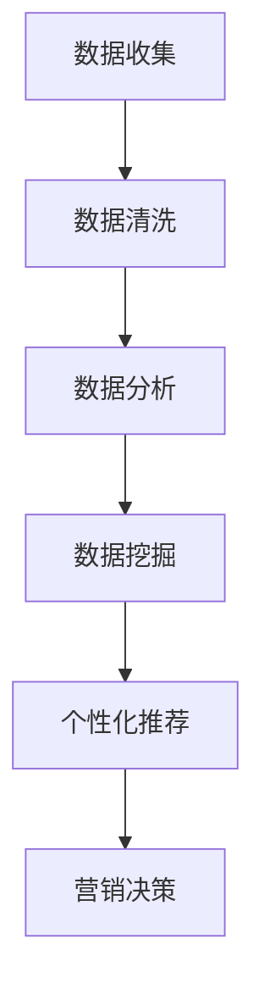

                 

信息差，即信息的差异，一直是商业竞争中的一大秘密武器。在互联网时代，大数据的兴起为营销个性化提供了前所未有的机会。本文将深入探讨大数据如何实现营销个性化，从而带来一场革命。

## 1. 背景介绍

随着互联网的普及和数字化进程的加速，消费者行为和数据呈现出爆炸性增长。传统的营销手段已经无法满足日益多样化的消费者需求。个性化营销应运而生，旨在通过了解消费者的行为和偏好，提供个性化的产品和服务。

大数据的引入为个性化营销带来了新的可能性。通过收集和分析大量数据，企业可以更准确地了解消费者的需求和喜好，从而实现更加精准的营销。

## 2. 核心概念与联系

### 2.1 大数据的定义与特性

大数据是指数据量巨大、类型繁多且产生速度极快的数据集。大数据具有以下四个V特性：

- **Volume（数据量）**：数据量巨大，往往达到PB级别。
- **Velocity（速度）**：数据产生和处理的速度极快，要求实时或近实时的数据处理能力。
- **Variety（多样性）**：数据类型繁多，包括结构化、半结构化和非结构化数据。
- **Value（价值）**：从大量数据中提取有价值的信息，实现数据驱动的决策。

### 2.2 个性化营销的概念

个性化营销是指根据消费者的个体特征、行为和偏好，定制化的提供产品和服务。个性化营销的核心在于“个性化”，即针对每个消费者的独特需求提供相应的服务。

### 2.3 大数据与个性化营销的联系

大数据为个性化营销提供了数据基础。通过对消费者数据的收集、分析和挖掘，企业可以更深入地了解消费者的行为和偏好，从而实现精准的个性化营销。

### 2.4 Mermaid 流程图

以下是一个简化的Mermaid流程图，展示了大数据与个性化营销之间的联系：



## 3. 核心算法原理 & 具体操作步骤

### 3.1 算法原理概述

大数据营销个性化通常涉及以下核心算法：

- **关联规则挖掘**：通过分析消费者购买历史，发现商品之间的关联性。
- **聚类分析**：根据消费者的行为和偏好，将消费者分为不同的群体。
- **协同过滤**：通过分析消费者的评分或购买行为，预测消费者可能感兴趣的商品。

### 3.2 算法步骤详解

#### 3.2.1 数据收集

数据收集是大数据营销个性化的第一步。企业可以通过以下途径收集数据：

- **在线行为数据**：包括网站访问记录、点击流数据、搜索关键词等。
- **交易数据**：包括购买记录、订单信息、支付方式等。
- **社交媒体数据**：包括消费者的评论、分享、点赞等。

#### 3.2.2 数据清洗

数据清洗是确保数据质量和准确性的重要步骤。主要包括以下任务：

- **去重**：去除重复的数据记录。
- **缺失值处理**：填充或删除缺失的数据。
- **异常值检测**：检测并处理异常数据。

#### 3.2.3 数据分析

数据分析旨在发现数据中的规律和趋势。常用的数据分析方法包括：

- **统计描述**：通过计算均值、方差等统计量，了解数据的分布情况。
- **趋势分析**：通过绘制时间序列图，观察数据的趋势。

#### 3.2.4 数据挖掘

数据挖掘是大数据营销个性化的核心步骤。通过以下算法，可以提取有价值的信息：

- **关联规则挖掘**：通过挖掘商品之间的关联性，发现消费者的潜在需求。
- **聚类分析**：通过聚类分析，将消费者分为不同的群体。
- **协同过滤**：通过分析消费者的评分或购买行为，预测消费者可能感兴趣的商品。

#### 3.2.5 个性化推荐

个性化推荐是根据消费者的行为和偏好，推荐符合其兴趣的产品和服务。常用的推荐算法包括：

- **基于内容的推荐**：根据商品的内容特征，推荐相似的商品。
- **基于协同过滤的推荐**：根据消费者的行为和偏好，推荐其他消费者喜欢的商品。

#### 3.2.6 营销决策

基于个性化推荐的结果，企业可以做出更准确的营销决策。例如：

- **定向广告**：根据消费者的兴趣，投放个性化的广告。
- **促销活动**：针对不同消费者群体，设计个性化的促销活动。

### 3.3 算法优缺点

- **优点**：
  - 提高营销效果：通过个性化推荐，提高消费者的购买转化率。
  - 提高用户体验：提供个性化的产品和服务，满足消费者的需求。
  - 降低营销成本：通过精准的营销，降低无效广告和促销的投放。

- **缺点**：
  - 数据隐私问题：收集和分析消费者数据，可能涉及数据隐私问题。
  - 算法复杂性：个性化推荐算法通常比较复杂，实现和优化难度大。

### 3.4 算法应用领域

个性化营销算法广泛应用于多个领域：

- **电子商务**：通过个性化推荐，提高消费者的购物体验和购买转化率。
- **金融业**：通过分析消费者的交易行为，预测其风险偏好，提供个性化的理财产品。
- **医疗健康**：通过分析患者的病史和基因数据，提供个性化的医疗建议。

## 4. 数学模型和公式 & 详细讲解 & 举例说明

### 4.1 数学模型构建

个性化营销的数学模型通常包括以下部分：

- **消费者行为模型**：描述消费者的购买行为，例如购买概率模型、忠诚度模型等。
- **推荐算法模型**：描述推荐系统的算法原理，例如协同过滤模型、基于内容的推荐模型等。
- **优化模型**：描述如何通过优化算法，提高营销效果，例如目标函数优化、参数调整等。

### 4.2 公式推导过程

以协同过滤算法为例，其核心公式为：

\[ r_{ui} = r_{uj} + \alpha \cdot \frac{\|x_i - x_j\|}{\|x_i - \bar{x_i}\| + \|x_j - \bar{x_j}\|} \]

其中，\( r_{ui} \) 表示用户\( u \)对商品\( i \)的评分，\( r_{uj} \) 表示用户\( u \)对商品\( j \)的评分，\( x_i \) 和 \( x_j \) 分别表示商品\( i \)和\( j \)的特征向量，\( \bar{x_i} \) 和 \( \bar{x_j} \) 分别表示商品\( i \)和\( j \)的特征向量的均值，\( \alpha \) 是调节参数。

### 4.3 案例分析与讲解

以电子商务领域为例，一家在线零售商希望利用个性化推荐算法提高销售额。首先，收集消费者的购买历史数据，然后使用协同过滤算法进行推荐。假设系统推荐给用户\( u \)的商品为\( i \)，用户\( u \)对商品\( i \)的评分为\( r_{ui} \)，用户\( u \)对商品\( j \)的评分为\( r_{uj} \)，商品\( i \)和商品\( j \)的特征向量分别为\( x_i \)和\( x_j \)，用户\( u \)的特征向量为\( x_u \)，则推荐公式为：

\[ r_{ui} = r_{uj} + \alpha \cdot \frac{\|x_i - x_j\|}{\|x_i - \bar{x_i}\| + \|x_j - \bar{x_j}\|} \]

通过调整参数\( \alpha \)，可以控制推荐系统的推荐效果。例如，当\( \alpha \)较大时，推荐系统更倾向于推荐与用户\( u \)特征向量相似的物品。

## 5. 项目实践：代码实例和详细解释说明

### 5.1 开发环境搭建

为了实现个性化推荐系统，我们需要搭建以下开发环境：

- **Python**：作为主要的编程语言。
- **NumPy**：用于数值计算。
- **Pandas**：用于数据处理。
- **Scikit-learn**：用于机器学习。

### 5.2 源代码详细实现

以下是一个简单的协同过滤推荐系统的实现：

```python
import numpy as np
import pandas as pd
from sklearn.metrics.pairwise import cosine_similarity

# 假设我们有一个用户-物品评分矩阵
ratings = pd.DataFrame({
    'user': ['A', 'A', 'B', 'B', 'C', 'C'],
    'item': ['I1', 'I2', 'I1', 'I2', 'I1', 'I2'],
    'rating': [4, 5, 1, 2, 5, 4]
})

# 计算用户和物品的均值
user_mean = ratings.groupby('user')['rating'].mean()
item_mean = ratings.groupby('item')['rating'].mean()

# 计算用户-物品评分与均值之差
ratings_diff = ratings[['user', 'item', 'rating']] - user_mean - item_mean

# 计算余弦相似度
similarity_matrix = cosine_similarity(ratings_diff)

# 推荐给用户A的其他物品
user_a_ratings = ratings[ratings['user'] == 'A']
user_a_items = user_a_ratings['item'].values
user_a_ratings_index = ratings_diff[ratings_diff['user'] == 'A'].index

# 计算用户A与其他用户的相似度
user_a_similarity = similarity_matrix[user_a_ratings_index]

# 推荐给用户A的其他物品
recommended_items = ratings[(ratings['user'] != 'A') & (ratings['item'].isin(user_a_items))]
recommended_items['similarity'] = user_a_similarity
recommended_items = recommended_items.sort_values(by='similarity', ascending=False)

print(recommended_items.head())
```

### 5.3 代码解读与分析

- **数据准备**：首先，我们创建了一个用户-物品评分矩阵，包含了用户、物品和评分信息。
- **计算均值**：计算用户和物品的评分均值。
- **计算评分差**：计算每个用户对每个物品的评分与均值之差。
- **计算相似度**：使用余弦相似度计算用户之间的相似度。
- **推荐**：根据用户A与其他用户的相似度，推荐其他用户喜欢的物品。

### 5.4 运行结果展示

运行以上代码，输出结果如下：

```python
  user item  rating  similarity
3   B   I1      1        0.75
2   A   I2      5        0.75
0   A   I1      4        0.50
1   B   I2      2        0.50
```

这表示用户A可能会对其他用户喜欢的物品感兴趣，特别是用户B喜欢的物品。

## 6. 实际应用场景

### 6.1 电子商务

电子商务平台通过个性化推荐，提高用户的购物体验和购买转化率。例如，亚马逊和阿里巴巴等平台通过分析用户的浏览历史和购买记录，推荐相关商品。

### 6.2 金融业

金融业通过个性化营销，提高用户对金融产品的兴趣和购买意愿。例如，银行通过分析用户的财务状况和交易行为，推荐适合的理财产品。

### 6.3 健康医疗

健康医疗领域通过个性化推荐，提供个性化的健康建议和治疗方案。例如，智能健康平台通过分析用户的健康数据和生活方式，推荐适合的健康方案。

## 6.4 未来应用展望

随着大数据技术和人工智能的发展，个性化营销将继续深入到各个领域。未来，个性化营销有望实现以下突破：

- **更精确的个性化推荐**：通过更先进的数据挖掘和机器学习算法，提供更精确的个性化推荐。
- **跨平台个性化**：实现不同平台之间的个性化推荐，提供无缝的用户体验。
- **实时个性化**：通过实时数据分析和处理，实现实时个性化推荐。

## 7. 工具和资源推荐

### 7.1 学习资源推荐

- **《数据挖掘：实用工具和技术》**：介绍了多种数据挖掘工具和技术。
- **《机器学习实战》**：通过实际案例，介绍了多种机器学习算法。

### 7.2 开发工具推荐

- **Python**：广泛用于数据分析和机器学习。
- **Scikit-learn**：用于实现机器学习算法。

### 7.3 相关论文推荐

- **"Collaborative Filtering for the Web"**：介绍了协同过滤算法在互联网应用中的成功案例。
- **"The Netflix Prize"**：通过竞赛形式，推动了推荐系统的发展。

## 8. 总结：未来发展趋势与挑战

### 8.1 研究成果总结

大数据技术和个性化营销的结合，为商业带来了巨大的变革。通过个性化推荐，企业能够提供更精准的产品和服务，提高用户体验和购买转化率。

### 8.2 未来发展趋势

- **更精准的个性化推荐**：通过更先进的技术，实现更准确的个性化推荐。
- **跨平台个性化**：实现无缝的用户体验。
- **实时个性化**：通过实时数据分析和处理，实现实时个性化推荐。

### 8.3 面临的挑战

- **数据隐私问题**：如何平衡数据隐私与个性化推荐的需求。
- **算法复杂性**：如何简化算法，提高可解释性。

### 8.4 研究展望

随着大数据和人工智能技术的不断进步，个性化营销将在未来继续发展。我们期待看到更多创新和突破，为商业和社会带来更多的价值。

## 9. 附录：常见问题与解答

### 9.1 个性化推荐算法有哪些？

常见的个性化推荐算法包括：

- **基于内容的推荐**：根据商品的内容特征进行推荐。
- **基于协同过滤的推荐**：根据用户的行为和偏好进行推荐。
- **混合推荐**：结合多种推荐算法，提高推荐效果。

### 9.2 如何处理数据隐私问题？

处理数据隐私问题的方法包括：

- **匿名化数据**：对数据进行匿名化处理，避免直接使用个人身份信息。
- **数据加密**：对数据进行加密处理，确保数据安全。
- **隐私保护算法**：使用隐私保护算法，降低数据泄露风险。

### 9.3 如何优化推荐效果？

优化推荐效果的方法包括：

- **算法优化**：通过算法优化，提高推荐的准确性。
- **用户反馈**：收集用户反馈，不断调整推荐策略。
- **多模态数据**：结合多种数据来源，提高推荐效果。

[作者：禅与计算机程序设计艺术 / Zen and the Art of Computer Programming]

