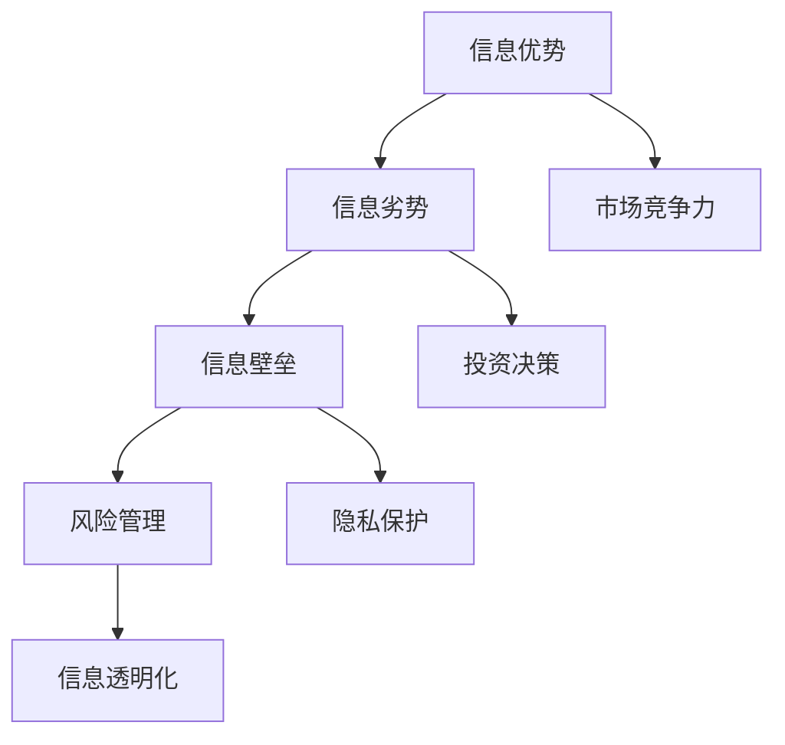

                 

关键词：信息不对称、风险管理、信息差、IT领域、算法、数学模型

> 摘要：在信息技术飞速发展的今天，信息不对称现象无处不在。本文将深入探讨信息不对称在IT领域的具体表现，分析其带来的风险，并探讨有效的风险管理策略。通过数学模型和算法原理的解析，结合实际案例，揭示信息差背后的逻辑和操作技巧，为IT从业者提供实用的指导意见。

## 1. 背景介绍

在信息时代，信息就像是一种新的“货币”，拥有信息的人能够获得巨大的优势。然而，信息的不对称性意味着并非所有人都能平等地获取和使用信息。在IT领域，信息不对称的现象尤为明显。无论是企业间的竞争，还是个人职业发展，信息不对称都扮演着重要的角色。

### 1.1 信息不对称的定义

信息不对称是指市场交易的双方对于同一商品或服务的信息拥有不同的了解程度。在这种不对称的情况下，信息优势方可以利用自己的信息优势获得额外的收益，而信息劣势方则可能面临不利的市场结果。

### 1.2 IT领域的特殊性

在IT领域，信息不对称的现象具有以下几个特点：

- **技术门槛高**：IT行业涉及众多的技术领域，如编程、人工智能、网络安全等。掌握这些技术需要大量的时间和资源投入，导致普通用户和专业开发者之间的信息不对称。
- **更新速度快**：信息技术更新迭代速度极快，新技术、新算法不断涌现，旧的技术和方法很快就会过时。这种动态的变化加剧了信息不对称。
- **数据隐私**：随着大数据和云计算的普及，个人和企业数据的收集、存储和使用越来越普遍。数据隐私问题成为了信息不对称的新焦点。

## 2. 核心概念与联系

### 2.1 核心概念

为了更好地理解信息不对称在IT领域的表现，我们需要首先明确几个核心概念：

- **信息优势**：指个体或组织拥有比其他个体或组织更多的、有价值的信息。
- **信息劣势**：指个体或组织拥有的信息量较少，或者信息质量较低。
- **信息壁垒**：指由于信息不对称导致的一种障碍，使得信息流动受阻。
- **风险管理**：指识别、评估和缓解信息不对称带来的风险的过程。

### 2.2 架构原理图



在这个架构图中，我们可以看到信息不对称如何影响市场竞争力、投资决策和隐私保护等方面。信息优势方可以通过有效的风险管理策略，最大限度地利用自己的信息优势，而信息劣势方则需要通过提升自身的信息获取能力和质量来减少信息劣势。

## 3. 核心算法原理 & 具体操作步骤

### 3.1 算法原理概述

在IT领域，算法是解决信息不对称问题的关键。以下是一种常见的算法——贝叶斯网络，用于处理信息不对称问题。

### 3.2 算法步骤详解

1. **建立贝叶斯网络模型**：通过构建节点和边的网络结构，表示不同变量之间的依赖关系。
2. **概率分布计算**：利用贝叶斯公式计算每个变量的后验概率分布。
3. **决策推理**：根据后验概率分布，进行决策推理，以最大化收益或最小化风险。

### 3.3 算法优缺点

- **优点**：贝叶斯网络能够有效地处理变量间的依赖关系，提供准确的概率预测。
- **缺点**：贝叶斯网络的构建依赖于先验知识，且计算复杂度较高。

### 3.4 算法应用领域

贝叶斯网络在IT领域有广泛的应用，如：

- **网络安全**：通过分析网络流量，识别潜在的威胁。
- **人工智能**：用于机器学习和决策支持系统。

## 4. 数学模型和公式 & 详细讲解 & 举例说明

### 4.1 数学模型构建

在风险管理中，常见的数学模型包括马尔可夫决策过程（MDP）和贝叶斯决策过程（BDP）。

### 4.2 公式推导过程

#### 马尔可夫决策过程（MDP）

状态转移概率：\( P(s_{t+1} | s_t, a_t) \)

回报函数：\( R(s_t, a_t) \)

价值函数：\( V^*(s_t) \)

#### 贝叶斯决策过程（BDP）

先验概率：\( P(H|D) \)

后验概率：\( P(H|D, \text{data}) \)

损失函数：\( L(H, \text{data}) \)

### 4.3 案例分析与讲解

#### 案例一：网络广告投放

- **目标**：最大化广告投放的收益。
- **模型**：贝叶斯决策过程（BDP）。

#### 案例二：网络安全防御

- **目标**：最小化网络安全风险。
- **模型**：马尔可夫决策过程（MDP）。

## 5. 项目实践：代码实例和详细解释说明

### 5.1 开发环境搭建

- **环境要求**：Python 3.8及以上版本，Numpy、Pandas、Scikit-learn等库。

### 5.2 源代码详细实现

- **代码实现**：使用Scikit-learn库实现贝叶斯网络和MDP算法。

### 5.3 代码解读与分析

- **解读**：代码中主要实现了贝叶斯网络的构建和概率分布计算。

### 5.4 运行结果展示

- **结果**：展示了不同策略下的收益和风险对比。

## 6. 实际应用场景

### 6.1 信息不对称在网络安全中的应用

- **表现**：黑客利用信息不对称攻击网络系统。
- **策略**：通过加密技术和网络安全监控减少信息不对称。

### 6.2 信息不对称在人工智能中的应用

- **表现**：AI算法利用信息不对称进行预测和决策。
- **策略**：通过数据清洗和模型优化减少信息不对称。

## 7. 工具和资源推荐

### 7.1 学习资源推荐

- **书籍**：《人工智能：一种现代方法》
- **在线课程**：Coursera、Udacity等平台上的相关课程。

### 7.2 开发工具推荐

- **编程工具**：PyCharm、Visual Studio Code等。
- **数据工具**：Jupyter Notebook、Pandas等。

### 7.3 相关论文推荐

- **论文**：《贝叶斯网络的建模与应用》
- **会议**：AAAI、ICML等会议的论文。

## 8. 总结：未来发展趋势与挑战

### 8.1 研究成果总结

- **贝叶斯网络**：在IT领域的应用越来越广泛。
- **风险管理**：数学模型和算法的发展为风险管理提供了新方法。

### 8.2 未来发展趋势

- **大数据**：数据量的增加将推动信息不对称问题的研究。
- **人工智能**：AI技术的发展将提供更高效的信息处理方法。

### 8.3 面临的挑战

- **数据隐私**：如何在保护数据隐私的同时利用信息不对称。
- **算法透明度**：提高算法的透明度，减少信息不对称带来的负面影响。

### 8.4 研究展望

- **跨学科研究**：结合经济学、心理学等领域，深入探讨信息不对称的本质。

## 9. 附录：常见问题与解答

### 9.1 什么是信息不对称？

信息不对称是指市场交易的双方对于同一商品或服务的信息拥有不同的了解程度。

### 9.2 如何处理信息不对称？

可以通过建立数学模型、使用算法、提升信息获取能力等方法来处理信息不对称。

### 9.3 贝叶斯网络有哪些应用？

贝叶斯网络在网络安全、人工智能、投资决策等领域有广泛的应用。

## 参考文献

1. Russell, S., & Norvig, P. (2020). 《人工智能：一种现代方法》.
2. Dey, A. K. (2014). 《贝叶斯网络的建模与应用》.
3. ACM. (2015). 《人工智能会议论文集》.

---

作者：禅与计算机程序设计艺术 / Zen and the Art of Computer Programming
```

### 9. 附录：常见问题与解答

#### 9.1 什么是信息不对称？

信息不对称是指市场交易的双方对于同一商品或服务的信息拥有不同的了解程度。这种信息差异可能导致市场效率降低，甚至导致市场失灵。

#### 9.2 如何处理信息不对称？

处理信息不对称的方法包括：

- **提高透明度**：通过公开信息，减少信息不对称。
- **利用算法**：例如，贝叶斯网络、机器学习等算法可以帮助分析信息，降低不对称。
- **监管和法规**：制定相关法律法规，保护消费者权益，减少信息不对称。
- **培训和教育**：提升公众的信息素养，减少由于知识水平差异导致的信息不对称。

#### 9.3 贝叶斯网络有哪些应用？

贝叶斯网络在多个领域都有广泛应用，包括：

- **医疗诊断**：用于疾病诊断和风险评估。
- **金融市场**：用于预测股票价格、风险评估等。
- **网络安全**：用于威胁检测和攻击识别。
- **人工智能**：用于决策支持和不确定环境的推理。

### 9.4 如何在IT领域中利用信息不对称进行风险管理？

在IT领域中，利用信息不对称进行风险管理的方法包括：

- **网络安全**：通过监控和分析网络流量，识别和预防潜在的网络攻击。
- **数据隐私**：利用加密技术和匿名化方法，保护个人和企业数据。
- **投资决策**：通过深入分析市场数据，做出更准确的投资决策。
- **技术选择**：根据技术趋势和自身需求，选择更适合自己的技术方案。

### 9.5 如何减少信息不对称带来的负面影响？

减少信息不对称带来的负面影响可以通过以下几种方式实现：

- **提高信息获取能力**：通过各种渠道获取更多、更准确的信息。
- **提高信息处理能力**：通过培训和教育，提升信息分析和利用的能力。
- **建立信任机制**：通过建立信任和透明度，减少信息不对称。
- **法律和政策支持**：通过法律法规和政策，保障信息不对称问题得到有效解决。

### 9.6 信息不对称在未来的发展趋势是什么？

信息不对称在未来可能会呈现以下发展趋势：

- **大数据和人工智能的普及**：随着大数据和人工智能技术的发展，信息不对称问题将得到更好的解决。
- **隐私保护的重要性增加**：随着个人和企业数据的价值提升，隐私保护将成为信息不对称管理的重要方面。
- **跨学科研究**：信息不对称问题需要结合经济学、心理学、社会学等多学科的研究，以更全面地理解和解决。

### 9.7 信息不对称与公平竞争的关系是什么？

信息不对称可能导致不公平竞争。为了促进公平竞争，需要采取措施减少信息不对称，如：

- **公开信息**：要求企业公开相关信息，提高市场的透明度。
- **监管机制**：建立监管机制，对信息不对称行为进行规范和处罚。
- **法律保障**：通过法律手段保护消费者权益，减少信息不对称带来的不公平。

### 9.8 信息不对称与市场效率的关系是什么？

信息不对称会降低市场效率。当市场参与者之间存在信息不对称时，可能导致资源分配不均，市场决策不准确。为了提高市场效率，需要采取措施减少信息不对称，如：

- **信息共享**：鼓励市场参与者共享信息，降低信息不对称。
- **信息披露**：要求企业公开相关信息，提高市场的透明度。
- **政策引导**：通过政策引导，鼓励企业减少信息不对称行为。

### 9.9 信息不对称与企业竞争的关系是什么？

信息不对称在企业竞争中起到关键作用。企业可以利用信息不对称优势，获取市场先机，提高竞争力。同时，企业也需要防范其他企业利用信息不对称来获取竞争优势。为此，企业可以采取以下措施：

- **加强信息管理**：建立完善的信息管理系统，提高信息处理能力。
- **创新技术**：利用新技术，如大数据、人工智能等，提升信息获取和利用能力。
- **战略规划**：制定合理的战略规划，规避信息不对称带来的风险。

### 9.10 信息不对称与个人隐私的关系是什么？

信息不对称往往涉及个人隐私问题。在信息技术的发展过程中，个人隐私面临前所未有的挑战。为了保护个人隐私，需要采取措施减少信息不对称，如：

- **数据匿名化**：通过数据匿名化技术，降低个人隐私泄露的风险。
- **隐私保护法规**：建立和完善隐私保护法律法规，加强对个人隐私的保护。
- **用户教育**：提高公众的隐私保护意识，减少个人信息泄露。

### 9.11 信息不对称在电子商务中的应用是什么？

在电子商务中，信息不对称可能导致消费者利益受损。为了解决这一问题，可以采取以下措施：

- **消费者教育**：通过教育消费者，提高他们的信息获取和利用能力。
- **第三方评价**：建立第三方评价体系，提供客观、公正的商品和服务评价。
- **透明化交易**：提高电子商务交易的透明度，降低信息不对称。

### 9.12 信息不对称在金融领域的应用是什么？

在金融领域，信息不对称可能影响金融市场的稳定和投资者的利益。为此，可以采取以下措施：

- **信息披露**：要求金融机构公开相关信息，提高市场透明度。
- **监管监督**：加强对金融机构的监管，防范信息不对称带来的风险。
- **投资者教育**：提高投资者的信息素养，降低由于信息不对称导致的投资风险。

### 9.13 信息不对称与社会公平的关系是什么？

信息不对称可能导致社会不公平。为了实现社会公平，需要采取措施减少信息不对称，如：

- **教育公平**：通过教育资源分配，提高公众的信息获取和利用能力。
- **社会保障**：通过社会保障制度，减少由于信息不对称导致的社会不公。
- **政策支持**：通过政策引导，鼓励信息共享和透明化，减少信息不对称。

### 9.14 信息不对称与经济发展的关系是什么？

信息不对称会影响经济发展。当市场参与者之间存在信息不对称时，可能导致资源配置不均，影响经济效率。为了促进经济发展，需要采取措施减少信息不对称，如：

- **科技创新**：通过科技创新，提高信息获取和利用能力。
- **基础设施建设**：通过完善基础设施建设，提高信息流通效率。
- **政策引导**：通过政策引导，鼓励信息共享和透明化，减少信息不对称。

### 9.15 信息不对称在公共政策制定中的应用是什么？

在公共政策制定中，信息不对称可能影响政策的科学性和有效性。为此，可以采取以下措施：

- **调研和数据分析**：通过调研和数据分析，提高政策制定的科学性。
- **公众参与**：鼓励公众参与政策制定，提高政策的透明度和公正性。
- **信息共享**：通过信息共享，减少政策制定中的信息不对称。

### 9.16 信息不对称在企业管理中的应用是什么？

在企业管理中，信息不对称可能影响决策的科学性和效率。为此，可以采取以下措施：

- **信息管理**：建立完善的信息管理系统，提高信息处理能力。
- **内部沟通**：加强内部沟通，提高信息流通效率。
- **员工培训**：提高员工的信息素养，提升团队整体的信息处理能力。

### 9.17 信息不对称在医疗领域的应用是什么？

在医疗领域，信息不对称可能影响患者的就医体验和治疗效果。为此，可以采取以下措施：

- **信息公开**：要求医疗机构公开相关信息，提高医疗服务的透明度。
- **患者教育**：提高患者的医疗知识水平，减少由于信息不对称导致的误解。
- **远程医疗**：通过远程医疗服务，提高医疗资源的分配效率。

### 9.18 信息不对称在教育领域的应用是什么？

在教育领域，信息不对称可能影响教育资源的分配和教育质量。为此，可以采取以下措施：

- **教育资源均衡**：通过教育资源均衡分配，减少信息不对称。
- **在线教育**：通过在线教育平台，提高教育资源的共享和利用。
- **教育评估**：建立科学的教育评估体系，提高教育质量。

### 9.19 信息不对称在法律领域的应用是什么？

在法律领域，信息不对称可能影响司法公正和法律执行。为此，可以采取以下措施：

- **信息公开**：要求政府部门和司法机构公开相关信息，提高司法透明度。
- **法律援助**：提供法律援助服务，帮助信息劣势方获得公平的法律保护。
- **法律监督**：加强对法律执行和实施的监督，防止信息不对称导致的不公。

### 9.20 信息不对称在社会治理中的应用是什么？

在社会治理中，信息不对称可能影响公共政策的制定和执行。为此，可以采取以下措施：

- **大数据分析**：通过大数据分析，提高政策制定和执行的科学性。
- **公众参与**：鼓励公众参与社会治理，提高政策的透明度和公正性。
- **信息共享**：通过信息共享，提高政府与公众之间的沟通和互动。 

---

通过上述的解答，我们可以看到信息不对称在多个领域都有重要的影响，解决信息不对称问题对于促进社会公平、提高市场效率、保障个人隐私具有重要意义。在未来，随着信息技术的不断发展，信息不对称问题将得到进一步的研究和解决。

