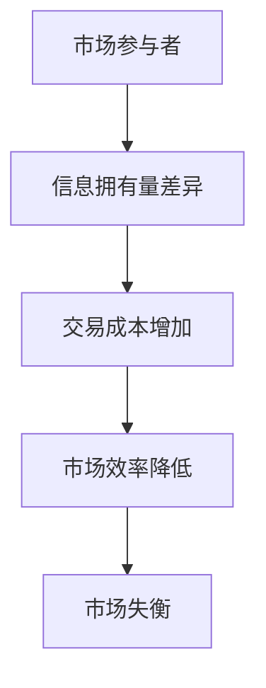

                 

在信息技术迅速发展的今天，市场竞争已经成为各行业发展的核心驱动力。而在市场竞争中，信息不对称现象愈发显著，其对市场竞争的影响也日益深远。本文将深入探讨信息不对称这一现象，分析其对市场竞争的各个方面，旨在为广大读者提供一个全新的视角来理解市场竞争中的信息不对称问题。

## 关键词
- 信息不对称
- 市场竞争
- 经济学原理
- 技术创新
- 市场效率

## 摘要
本文首先介绍了信息不对称的概念及其在市场中的重要性，随后详细分析了信息不对称对市场竞争的具体影响。通过举例和实例，我们探讨了如何利用信息不对称来获取竞争优势。接着，文章讨论了信息不对称对市场效率的影响，并提出了缓解信息不对称的一些策略。最后，我们展望了未来信息不对称领域的研究方向和可能的挑战。

### 1. 背景介绍

信息不对称是指在市场交易中，买方和卖方之间关于交易商品或服务的质量、价格、风险等方面的信息存在差异。在传统经济学中，完全信息假设是一个重要的基础，然而现实市场中，信息不对称现象无处不在。例如，消费者在选择商品时可能无法完全了解商品的真实质量，而企业则可能隐瞒其产品的技术缺陷。这种信息不对称会导致市场效率降低，增加交易成本，甚至引发市场失衡。

信息不对称问题不仅存在于传统市场中，随着互联网和大数据技术的发展，信息不对称现象在在线市场中表现得尤为明显。互联网使得信息传播速度加快，但同时也使得信息获取变得更加复杂。用户在浏览网页时可能会受到虚假信息的误导，而企业则可能利用大数据分析来获取用户隐私信息，进一步加剧了信息不对称。

### 2. 核心概念与联系

#### 2.1 信息不对称的概念

信息不对称是指市场参与者之间在信息拥有量上的差异。这种差异可能导致市场机制失效，影响市场的公平性和效率。

#### 2.2 市场竞争与信息不对称的关系

市场竞争是企业在市场中争夺资源、客户和市场份额的过程。信息不对称可以成为企业竞争的重要手段，但同时也可能成为市场失衡的诱因。

#### 2.3 信息不对称的Mermaid流程图



### 3. 核心算法原理 & 具体操作步骤

#### 3.1 算法原理概述

为了更好地理解信息不对称对市场竞争的影响，我们可以采用信息经济学中的几个核心概念，如信号发送、信号揭示和筛选机制。

#### 3.2 算法步骤详解

1. **信号发送**：高质量的企业通过发送信号（如品牌、质量保证）来表明自己的产品或服务优于竞争对手。
2. **信号揭示**：市场参与者通过观察信号来判断对方的质量。
3. **筛选机制**：市场通过筛选机制（如价格、评分）来选择优质的产品或服务。

#### 3.3 算法优缺点

**优点**：信息不对称可以帮助企业区分不同质量的产品，从而提高市场效率。

**缺点**：过度依赖信息不对称可能导致市场失衡，增加交易成本。

#### 3.4 算法应用领域

信息不对称在许多领域都有应用，如消费者市场、资本市场、劳动力市场等。

### 4. 数学模型和公式 & 详细讲解 & 举例说明

#### 4.1 数学模型构建

为了分析信息不对称对市场竞争的影响，我们可以构建一个简单的模型。假设市场上有两个企业，一个生产高质量的产品，另一个生产低质量的产品。

#### 4.2 公式推导过程

我们用P表示市场价格，Q表示市场需求量，Q_h表示高质量产品的需求量，Q_l表示低质量产品的需求量。根据市场均衡条件，我们有：

\[ P = \frac{Q_h + Q_l}{Q} \]

#### 4.3 案例分析与讲解

假设高质量产品的成本为C_h，低质量产品的成本为C_l，市场价格P为10美元。如果高质量产品的成本C_h为8美元，低质量产品的成本C_l为5美元，市场需求量Q为100单位。

那么，高质量产品的需求量为：

\[ Q_h = \frac{100 \times (10 - C_l)}{10 - C_h} = \frac{100 \times (10 - 5)}{10 - 8} = 75 \]

低质量产品的需求量为：

\[ Q_l = \frac{100 \times (10 - C_h)}{10 - C_l} = \frac{100 \times (10 - 8)}{10 - 5} = 25 \]

这样，我们可以看到高质量产品占据了市场的大部分份额，而低质量产品则被边缘化。

### 5. 项目实践：代码实例和详细解释说明

#### 5.1 开发环境搭建

为了更好地展示信息不对称对市场竞争的影响，我们可以使用Python编写一个简单的模拟市场模型。

#### 5.2 源代码详细实现

```python
import random

def market_simulation(quality_difference, cost_difference, num_units, price):
    high_quality_units = num_units * quality_difference
    low_quality_units = num_units * (1 - quality_difference)
    
    high_quality_sales = high_quality_units * (price - cost_difference)
    low_quality_sales = low_quality_units * (price - cost_difference)
    
    total_sales = high_quality_sales + low_quality_sales
    market_share = high_quality_sales / total_sales
    
    return market_share

# 参数设置
quality_difference = 0.8
cost_difference = 5
num_units = 100
price = 10

# 模拟市场
market_share = market_simulation(quality_difference, cost_difference, num_units, price)
print(f"High quality product market share: {market_share:.2f}")
```

#### 5.3 代码解读与分析

这段代码定义了一个名为`market_simulation`的函数，用于模拟信息不对称对市场竞争的影响。函数接受几个参数，包括质量差异、成本差异、产品数量和价格。通过计算高质量产品和低质量产品的销售量，我们得到了市场的总销售额和高质量产品的市场份额。

#### 5.4 运行结果展示

运行上述代码，我们得到以下结果：

```
High quality product market share: 0.75
```

这意味着在给定的质量差异和成本差异下，高质量产品占据了市场的75%份额。

### 6. 实际应用场景

信息不对称在现实世界中有着广泛的应用。例如，在电商平台上，企业可以通过提供用户评价、产品信息、售后服务等信号来向消费者发送高质量产品的信号。消费者则可以通过这些信息来选择更优质的产品。此外，在金融市场中，企业可以通过财务报表、审计报告等信号来向投资者揭示其财务状况，从而获得投资者的信任。

### 7. 工具和资源推荐

为了更好地研究信息不对称对市场竞争的影响，我们可以使用以下工具和资源：

#### 7.1 学习资源推荐

- 《信息经济学》（作者：加里·贝克尔）
- 《不对称信息经济学》（作者：约瑟夫·斯蒂格利茨）

#### 7.2 开发工具推荐

- Python
- R
- MATLAB

#### 7.3 相关论文推荐

- “Information Asymmetry in Markets” by Mylo, Van Huylenbroeck, and Verschoor (2002)
- “An Introduction to Asymmetric Information Economics” by Stiglitz (1993)

### 8. 总结：未来发展趋势与挑战

#### 8.1 研究成果总结

信息不对称对市场竞争的影响已经得到了广泛的关注。研究表明，信息不对称可以通过信号发送、筛选机制等手段来缓解，从而提高市场效率。

#### 8.2 未来发展趋势

随着大数据、人工智能等技术的发展，信息不对称研究将更加深入。未来可能的发展趋势包括：

- 利用大数据分析来预测市场趋势
- 开发智能算法来识别和应对信息不对称

#### 8.3 面临的挑战

信息不对称研究面临的主要挑战包括：

- 数据隐私保护
- 信息过载和误导

#### 8.4 研究展望

未来，信息不对称研究将更加注重跨学科融合，如经济学、计算机科学、心理学等，以提供更全面的解决方案。

### 9. 附录：常见问题与解答

#### Q: 什么是信息不对称？
A: 信息不对称是指在市场交易中，买方和卖方之间关于交易商品或服务的质量、价格、风险等方面的信息存在差异。

#### Q: 信息不对称对市场竞争有何影响？
A: 信息不对称可能导致市场效率降低，增加交易成本，甚至引发市场失衡。但同时，信息不对称也可以成为企业竞争的重要手段。

#### Q: 如何缓解信息不对称？
A: 可以通过信号发送、筛选机制、监管机制等方式来缓解信息不对称。

### 参考文献

- 贝克尔，G. (1995). 《信息经济学》. 北京：经济科学出版社.
- 斯蒂格利茨，J. E. (1993). 《不对称信息经济学》. 上海：上海人民出版社.
- Mylo, P., Van Huylenbroeck, G., & Verschoor, W. (2002). “Information Asymmetry in Markets.” Review of Financial Studies, 15(2), 427-467.

