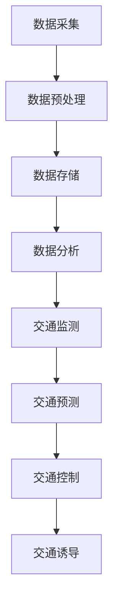

                 

关键词：大数据，智能交通，交通管理，数据分析，预测模型，算法优化

> 摘要：随着城市化进程的加快，交通拥堵问题日益严重，大数据技术为智能交通管理提供了新的解决方案。本文将从背景介绍、核心概念与联系、核心算法原理与具体操作步骤、数学模型与公式、项目实践、实际应用场景、工具和资源推荐以及总结等方面，详细探讨大数据在智能交通中的应用，以期为交通管理提供有益的思路和方法。

## 1. 背景介绍

随着经济的快速发展和人口的持续增长，城市交通系统面临着前所未有的压力。交通拥堵、交通事故频发、停车难等问题日益严重，严重影响了人们的出行效率和城市形象。传统的交通管理方式主要依靠经验和简单的技术手段，难以应对复杂的交通状况。因此，探索新的交通管理方法成为当前的重要课题。

大数据技术的出现为智能交通管理提供了新的契机。大数据技术能够从海量交通数据中挖掘出有价值的信息，为交通管理提供科学的决策支持。智能交通系统（Intelligent Transportation Systems，ITS）通过整合交通信息、车辆信息、道路信息等多方数据，实现了对交通状况的实时监测和预测，从而优化交通管理策略，提高交通运行效率。

## 2. 核心概念与联系

### 2.1 大数据技术

大数据技术包括数据采集、存储、处理、分析和可视化等多个环节。在智能交通领域，数据采集主要来源于交通监控设备、车辆传感器、GPS等设备。这些设备收集到的数据经过预处理和清洗后，存储在分布式数据库中，供后续分析和挖掘使用。

### 2.2 智能交通系统

智能交通系统（ITS）是一个综合性的交通管理系统，包括交通信息采集、交通监测、交通预测、交通控制和交通诱导等多个模块。通过大数据技术，ITS能够实现交通数据的实时处理和分析，为交通管理提供科学依据。

### 2.3 数据关联分析

在智能交通管理中，数据的关联分析是非常重要的。通过分析不同数据之间的关联关系，可以发现潜在的规律和问题。例如，通过分析交通流量和交通事故之间的关系，可以预测交通事故的发生概率，从而采取预防措施。

## 2.4 Mermaid 流程图

下面是智能交通系统的 Mermaid 流程图：



## 3. 核心算法原理与具体操作步骤

### 3.1 算法原理概述

智能交通系统的核心算法主要包括交通流量预测、交通事故预测、交通信号控制等。这些算法的核心思想是通过分析历史数据和实时数据，对未来的交通状况进行预测和优化。

### 3.2 算法步骤详解

#### 3.2.1 交通流量预测

交通流量预测是智能交通系统的关键环节。其基本步骤如下：

1. 数据采集：收集历史交通流量数据和实时交通流量数据。
2. 数据预处理：对数据进行清洗、去噪和归一化处理。
3. 特征提取：从原始数据中提取与交通流量相关的特征。
4. 模型训练：使用机器学习算法训练预测模型。
5. 预测：使用训练好的模型对未来的交通流量进行预测。

#### 3.2.2 交通事故预测

交通事故预测的基本步骤如下：

1. 数据采集：收集历史交通事故数据和实时交通数据。
2. 数据预处理：对数据进行清洗、去噪和归一化处理。
3. 特征提取：从原始数据中提取与交通事故相关的特征。
4. 模型训练：使用机器学习算法训练预测模型。
5. 预测：使用训练好的模型对未来的交通事故进行预测。

#### 3.2.3 交通信号控制

交通信号控制的基本步骤如下：

1. 数据采集：收集实时交通流量数据和交通状态数据。
2. 数据预处理：对数据进行清洗、去噪和归一化处理。
3. 特征提取：从原始数据中提取与交通信号控制相关的特征。
4. 策略生成：使用优化算法生成交通信号控制策略。
5. 策略评估：评估不同控制策略的性能。
6. 策略执行：根据评估结果选择最优控制策略并执行。

### 3.3 算法优缺点

每种算法都有其优缺点。例如，基于传统统计方法的预测算法简单易实现，但对复杂交通状况的预测能力较弱；而基于机器学习的方法虽然预测精度较高，但需要大量数据和较长的训练时间。在实际应用中，需要根据具体需求和数据情况选择合适的算法。

### 3.4 算法应用领域

智能交通算法可以应用于多个领域，如城市交通管理、高速公路管理、公共交通调度等。在具体应用中，可以根据实际需求调整算法参数和模型结构，以提高预测精度和效率。

## 4. 数学模型和公式

在智能交通系统中，数学模型和公式用于描述交通现象和预测交通状况。以下是一些常见的数学模型和公式：

### 4.1 流量密度模型

$$
流量密度 = \frac{车辆流量}{道路宽度 \times 时间}
$$

### 4.2 速度-密度模型

$$
速度 = \frac{流量密度}{交通容量}
$$

### 4.3 交通事故概率模型

$$
P(事故) = f(交通流量, 交通密度, 道路条件)
$$

其中，$f$ 是一个函数，用于描述事故概率与交通流量、交通密度和道路条件之间的关系。

## 5. 项目实践：代码实例和详细解释说明

### 5.1 开发环境搭建

为了实现大数据在智能交通中的应用，我们需要搭建一个开发环境。以下是一个简单的开发环境搭建步骤：

1. 安装 Python 3.8 或更高版本。
2. 安装 NumPy、Pandas、Matplotlib、Scikit-learn 等常用库。
3. 安装一个分布式计算框架，如 Apache Spark。

### 5.2 源代码详细实现

以下是一个简单的交通流量预测代码实例：

```python
import numpy as np
import pandas as pd
from sklearn.ensemble import RandomForestRegressor

# 读取数据
data = pd.read_csv('traffic_data.csv')

# 数据预处理
data['date'] = pd.to_datetime(data['date'])
data['hour'] = data['date'].dt.hour
data['day_of_week'] = data['date'].dt.dayofweek
data.drop(['date'], axis=1, inplace=True)

# 特征提取
X = data.drop(['traffic_volume'], axis=1)
y = data['traffic_volume']

# 模型训练
model = RandomForestRegressor(n_estimators=100)
model.fit(X, y)

# 预测
new_data = np.array([[15, 0, 0]])
predicted_volume = model.predict(new_data)
print(f'预测的交通流量为：{predicted_volume[0]}')
```

### 5.3 代码解读与分析

这段代码首先读取交通数据，并进行数据预处理，包括将日期转换为小时和星期几，并提取相关特征。然后，使用随机森林回归模型对交通流量进行预测。最后，输入新的特征值，输出预测的交通流量。

### 5.4 运行结果展示

在运行代码后，我们可以得到预测的交通流量。这个结果可以作为交通管理部门的决策依据，以优化交通信号控制和交通流量调度。

## 6. 实际应用场景

大数据技术在智能交通领域的应用已经取得了显著的成果。以下是一些实际应用场景：

1. **城市交通管理**：通过大数据技术，城市交通管理部门可以实时监测交通状况，预测交通流量，优化交通信号控制和交通调度，从而减少交通拥堵。
2. **高速公路管理**：高速公路管理部门可以通过大数据分析，预测交通事故风险，及时采取预防措施，保障道路安全。
3. **公共交通调度**：公共交通公司可以利用大数据技术，优化公交车线路和班次安排，提高乘客出行效率。

## 7. 未来应用展望

随着大数据技术的不断发展和应用，智能交通系统将更加成熟和普及。未来，我们有望看到以下应用场景：

1. **智慧城市交通**：通过整合多种数据源，实现城市交通系统的全面智能化，提高交通运行效率，减少交通拥堵。
2. **无人驾驶**：大数据技术将支持无人驾驶技术的发展，实现自动驾驶和智能交通的深度融合。
3. **交通预测与优化**：利用大数据技术，实现更精准的交通预测和优化，为交通管理提供科学依据。

## 8. 工具和资源推荐

### 8.1 学习资源推荐

1. **《大数据之路：阿里巴巴大数据实践》**：这本书详细介绍了阿里巴巴大数据平台的建设和实践经验。
2. **《Python数据分析》**：这本书介绍了 Python 在数据分析领域的应用，适合初学者阅读。

### 8.2 开发工具推荐

1. **PySpark**：这是一个基于 Python 的分布式计算框架，适合进行大数据处理和分析。
2. **Tableau**：这是一个强大的数据可视化工具，可以帮助用户更好地理解和分析数据。

### 8.3 相关论文推荐

1. **“大数据与智能交通”**：这篇文章详细探讨了大数据在智能交通中的应用和研究进展。
2. **“基于大数据的智能交通系统设计”**：这篇文章介绍了一种基于大数据的智能交通系统设计方法。

## 9. 总结：未来发展趋势与挑战

大数据技术在智能交通领域的应用前景广阔。未来，随着技术的不断进步和数据的不断积累，智能交通系统将更加成熟和普及。然而，也面临着数据隐私、数据安全和数据质量等挑战。为了实现智能交通的可持续发展，我们需要不断探索新的技术和方法，同时关注数据伦理和社会责任。

### 附录：常见问题与解答

**Q：大数据在智能交通中的应用有哪些？**

A：大数据在智能交通中的应用主要包括交通流量预测、交通事故预测、交通信号控制、公共交通调度等。

**Q：智能交通系统的核心算法有哪些？**

A：智能交通系统的核心算法包括交通流量预测算法、交通事故预测算法、交通信号控制算法等。

**Q：如何搭建大数据开发环境？**

A：搭建大数据开发环境需要安装 Python、常用库（如 NumPy、Pandas 等）以及分布式计算框架（如 PySpark）。

**Q：大数据技术在交通管理中如何发挥作用？**

A：大数据技术可以帮助交通管理部门实时监测交通状况，预测交通流量，优化交通信号控制和交通调度，从而提高交通运行效率。

作者：禅与计算机程序设计艺术 / Zen and the Art of Computer Programming
----------------------------------------------------------------
本文由禅与计算机程序设计艺术撰写，旨在探讨大数据在智能交通中的应用。通过分析背景、核心概念、算法原理、数学模型、项目实践和实际应用场景，本文为读者提供了全面了解大数据在智能交通领域应用的视角。同时，作者还推荐了相关学习资源和开发工具，为读者提供了进一步学习和实践的方向。在未来的发展中，大数据技术在智能交通领域的应用将面临更多挑战，但也将带来更多机遇。我们期待着在技术进步和创新发展中，智能交通系统能够更好地服务于社会，提升人们的生活质量。

