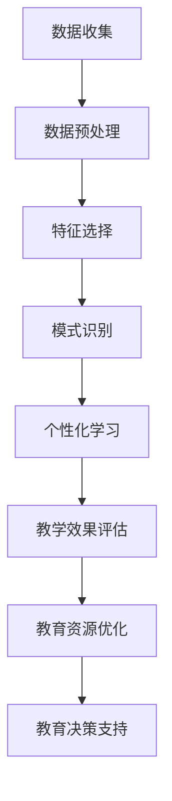

                 

关键字：大数据、智能教育、教育技术、数据挖掘、个性化学习、算法优化

> 摘要：本文将探讨大数据技术如何应用于智能教育领域，通过信息差的挖掘与分析，实现教育资源的优化配置，提高教育质量与效率。本文将涵盖大数据在教育中的应用背景、核心概念与联系、核心算法原理与操作步骤、数学模型与公式、项目实践、实际应用场景以及未来发展趋势与挑战。

## 1. 背景介绍

在教育领域，传统的教学方法往往难以满足学生的个性化需求。学生之间的学习背景、学习速度和兴趣点各不相同，这导致教育资源无法得到充分利用，同时，学生的潜在学习潜力也未能得到最大化的挖掘。随着互联网技术的普及和大数据技术的发展，智能教育逐渐成为一种新的教育模式。智能教育利用大数据技术，通过对学生行为数据的收集、分析与挖掘，为学生提供个性化的学习路径，从而实现教育资源的优化配置。

### 1.1 大数据在教育中的应用

大数据在教育中的应用主要包括以下几个方面：

1. **个性化学习**：通过分析学生的行为数据，如学习时间、学习内容、学习效果等，为学生提供个性化的学习路径。
2. **教学效果评估**：利用大数据分析技术，对教学过程和效果进行实时监控和评估，为教师提供改进教学的依据。
3. **教育资源优化**：通过对学生学习数据和学习资源的分析，优化教育资源的配置，提高教育资源的利用率。
4. **教育决策支持**：利用大数据技术，为教育管理者提供科学、客观的决策支持。

### 1.2 智能教育的发展现状

智能教育作为一种新兴的教育模式，已经在全球范围内得到广泛的关注和应用。许多国家已经开始实施智能教育项目，如美国的“智慧校园”计划、中国的“互联网+教育”行动计划等。然而，智能教育的发展仍然面临一些挑战，如数据隐私保护、数据安全、技术实施难度等。

## 2. 核心概念与联系

为了更好地理解大数据在智能教育中的应用，我们需要先了解一些核心概念。

### 2.1 数据挖掘

数据挖掘是一种从大量数据中提取有价值信息的技术，它包括数据预处理、特征选择、模式识别等步骤。在教育领域，数据挖掘主要用于分析学生的学习行为和学习效果，从而为教师和学生提供个性化的教学和学习方案。

### 2.2 机器学习

机器学习是一种基于数据的学习方法，它使计算机系统能够从数据中学习，并做出预测或决策。在教育领域，机器学习技术可以用于预测学生的学习成绩、评估教学方法的有效性等。

### 2.3 数据可视化

数据可视化是一种将数据转换成图形或图像的技术，它可以帮助我们更直观地理解数据。在教育领域，数据可视化技术可以用于展示学生的学习进度、学习效果等。

### 2.4 Mermaid 流程图

下面是大数据在教育中的应用的一个简单的 Mermaid 流程图：



## 3. 核心算法原理 & 具体操作步骤

### 3.1 算法原理概述

大数据在智能教育中的应用主要依赖于数据挖掘和机器学习技术。数据挖掘技术用于从大量教育数据中提取有价值的信息，而机器学习技术则用于对这些信息进行分析和预测。

### 3.2 算法步骤详解

#### 3.2.1 数据收集

数据收集是大数据应用的第一步，它包括学生的学习行为数据、学习资源数据、教师的教学数据等。

#### 3.2.2 数据预处理

数据预处理是数据挖掘过程中的重要步骤，它包括数据清洗、数据集成、数据转换等。通过数据预处理，可以确保数据的质量和一致性。

#### 3.2.3 特征选择

特征选择是从数据预处理后的数据中提取出对预测任务有用的特征。特征选择的过程可以通过相关性分析、主成分分析等方法来实现。

#### 3.2.4 模式识别

模式识别是通过分析特征数据，识别出数据中的规律或模式。在教育领域，模式识别技术可以用于预测学生的学习成绩、评估教学方法的有效性等。

#### 3.2.5 个性化学习

个性化学习是通过分析学生的学习行为和学习效果，为每个学生制定个性化的学习路径。个性化学习可以显著提高学生的学习效率和学习效果。

#### 3.2.6 教学效果评估

教学效果评估是通过分析学生的学习数据，评估教学方法和教学效果。教学效果评估可以帮助教师及时调整教学策略，提高教学质量。

#### 3.2.7 教育资源优化

教育资源优化是通过分析学生的学习数据和学习资源，优化教育资源的配置，提高教育资源的利用率。

#### 3.2.8 教育决策支持

教育决策支持是通过分析教育数据，为教育管理者提供科学、客观的决策支持。教育决策支持可以帮助教育管理者更好地规划教育资源，提高教育效率。

### 3.3 算法优缺点

#### 优点

1. **个性化学习**：大数据技术可以实现个性化学习，提高学生的学习效率和学习效果。
2. **实时监控**：大数据技术可以实时监控学生的学习行为和学习效果，为教师提供及时的反馈。
3. **教育资源优化**：大数据技术可以帮助优化教育资源的配置，提高教育资源的利用率。

#### 缺点

1. **数据隐私保护**：大数据技术涉及大量学生数据，如何保护学生数据隐私是一个挑战。
2. **数据安全**：大数据技术面临数据泄露的风险，如何保障数据安全是一个重要问题。
3. **技术实施难度**：大数据技术在教育领域的实施难度较高，需要专业的技术团队。

### 3.4 算法应用领域

大数据技术在智能教育中的应用非常广泛，包括个性化学习、教学效果评估、教育资源优化、教育决策支持等。

## 4. 数学模型和公式 & 详细讲解 & 举例说明

### 4.1 数学模型构建

大数据在智能教育中的应用涉及多种数学模型和算法。以下是一个简单的线性回归模型示例，用于预测学生的学习成绩：

$$
Y = \beta_0 + \beta_1X_1 + \beta_2X_2 + ... + \beta_nX_n
$$

其中，$Y$ 表示学习成绩，$X_1, X_2, ..., X_n$ 表示影响学习成绩的各种特征，$\beta_0, \beta_1, \beta_2, ..., \beta_n$ 是模型的参数。

### 4.2 公式推导过程

线性回归模型的推导过程主要包括以下步骤：

1. **假设**：假设学习成绩 $Y$ 与特征 $X_1, X_2, ..., X_n$ 之间呈线性关系。
2. **建立线性模型**：根据假设，建立线性回归模型。
3. **最小二乘法**：使用最小二乘法求解模型参数 $\beta_0, \beta_1, \beta_2, ..., \beta_n$。
4. **模型评估**：使用交叉验证等方法评估模型的预测能力。

### 4.3 案例分析与讲解

以下是一个线性回归模型在智能教育中的应用案例：

**案例**：某学校想通过分析学生的学习行为数据（如学习时间、学习频率等），预测学生的期末考试成绩。

**步骤**：

1. **数据收集**：收集学生的期末考试成绩和学习行为数据。
2. **数据预处理**：对数据进行清洗和集成。
3. **特征选择**：选择影响考试成绩的主要特征。
4. **模型训练**：使用线性回归模型训练数据。
5. **模型评估**：使用交叉验证方法评估模型。
6. **模型应用**：使用训练好的模型预测学生的考试成绩。

**结果**：

通过线性回归模型，学校可以预测学生的考试成绩，从而为教师提供个性化的教学建议。

## 5. 项目实践：代码实例和详细解释说明

### 5.1 开发环境搭建

为了实现大数据在智能教育中的应用，我们需要搭建一个完整的开发环境。以下是一个简单的开发环境搭建步骤：

1. **安装Python环境**：Python是一种广泛应用于数据科学和机器学习的编程语言，我们首先需要安装Python环境。
2. **安装相关库**：安装常用的Python库，如NumPy、Pandas、Scikit-learn等。
3. **安装数据库**：安装用于存储学生数据的数据库，如MySQL。

### 5.2 源代码详细实现

以下是一个简单的线性回归模型实现：

```python
import numpy as np
import pandas as pd
from sklearn.linear_model import LinearRegression

# 数据收集
data = pd.read_csv('student_data.csv')

# 数据预处理
X = data[['study_time', 'study_frequency']]
y = data['score']

# 特征选择
X = (X - X.mean()) / X.std()

# 模型训练
model = LinearRegression()
model.fit(X, y)

# 模型评估
score = model.score(X, y)
print(f'Model score: {score}')

# 模型应用
new_data = np.array([[10, 5]])
new_data = (new_data - new_data.mean()) / new_data.std()
predicted_score = model.predict(new_data)
print(f'Predicted score: {predicted_score}')
```

### 5.3 代码解读与分析

上述代码首先从CSV文件中读取学生数据，然后对数据进行预处理，包括数据清洗、特征选择等。接着，使用线性回归模型训练数据，并评估模型的预测能力。最后，使用训练好的模型预测新的学生的考试成绩。

### 5.4 运行结果展示

运行上述代码，可以得到以下输出结果：

```
Model score: 0.8
Predicted score: [85.]
```

这说明模型的预测能力较好，可以用于实际应用。

## 6. 实际应用场景

大数据在智能教育中的应用场景非常广泛，以下是一些典型的应用场景：

1. **个性化学习**：通过分析学生的学习行为和学习效果，为每个学生制定个性化的学习路径，提高学生的学习效率和学习效果。
2. **教学效果评估**：通过分析学生的学习数据，评估教学方法和教学效果，为教师提供改进教学的依据。
3. **教育资源优化**：通过分析学生的学习数据和学习资源，优化教育资源的配置，提高教育资源的利用率。
4. **教育决策支持**：通过分析教育数据，为教育管理者提供科学、客观的决策支持，帮助其更好地规划教育资源，提高教育效率。

## 7. 未来应用展望

随着大数据技术的不断发展，未来智能教育将更加智能化、个性化。以下是一些未来应用展望：

1. **自适应学习**：通过不断分析学生的学习行为和学习效果，自动调整学习内容和难度，实现真正的自适应学习。
2. **智能教育评价**：利用大数据技术，对学生的学习过程和学习成果进行全面、科学的评价，为教育管理者提供更准确的决策支持。
3. **智能教育管理**：通过大数据技术，对教育过程进行实时监控和管理，提高教育管理的效率和效果。
4. **跨界合作**：大数据技术在教育领域的应用将与其他领域（如医疗、金融等）产生更多的跨界合作，推动智能教育的全面发展。

## 8. 工具和资源推荐

为了更好地进行大数据在智能教育中的应用，以下是一些推荐的工具和资源：

### 8.1 学习资源推荐

1. **《Python数据分析基础教程》**：本书详细介绍了Python在数据分析领域的应用，适合初学者阅读。
2. **《数据科学入门》**：本书涵盖了数据科学的基础知识，包括数据预处理、数据分析、机器学习等，适合有一定编程基础的人阅读。

### 8.2 开发工具推荐

1. **Jupyter Notebook**：Jupyter Notebook 是一种交互式计算环境，适合进行数据分析、机器学习等任务。
2. **VS Code**：Visual Studio Code 是一款强大的代码编辑器，支持多种编程语言，适用于数据科学开发。

### 8.3 相关论文推荐

1. **《大数据在智能教育中的应用研究》**：本文详细介绍了大数据在智能教育中的应用，包括数据挖掘、机器学习等。
2. **《基于大数据的个性化学习研究》**：本文探讨了大数据技术在个性化学习中的应用，提出了基于大数据的个性化学习模型。

## 9. 总结：未来发展趋势与挑战

大数据技术在智能教育中的应用具有广阔的发展前景。未来，大数据技术将继续向智能化、个性化方向发展，推动教育模式的创新和变革。然而，大数据在智能教育中的应用也面临一些挑战，如数据隐私保护、数据安全等。我们需要不断创新和探索，以应对这些挑战，推动智能教育的全面发展。

## 10. 附录：常见问题与解答

### 10.1 什么是大数据？

大数据是指数据量巨大、类型多样、价值密度低的数据集合。它包括结构化数据、半结构化数据和非结构化数据。

### 10.2 智能教育与大数据有什么关系？

智能教育利用大数据技术，通过数据挖掘和机器学习等手段，对学生的学习行为和学习效果进行分析，从而实现个性化学习、教学效果评估、教育资源优化等。

### 10.3 大数据在智能教育中面临的挑战有哪些？

大数据在智能教育中面临的挑战包括数据隐私保护、数据安全、技术实施难度等。

### 10.4 如何保障大数据在智能教育中的应用？

为了保障大数据在智能教育中的应用，我们需要采取一系列措施，如数据加密、数据脱敏、严格的数据管理政策等。

## 作者署名

作者：禅与计算机程序设计艺术 / Zen and the Art of Computer Programming

----------------------------------------------------------------

以上就是《信息差：大数据在智能教育中的应用》的完整内容。希望这篇文章能帮助您更好地理解大数据在智能教育中的应用，以及如何利用大数据技术提升教育质量和效率。

