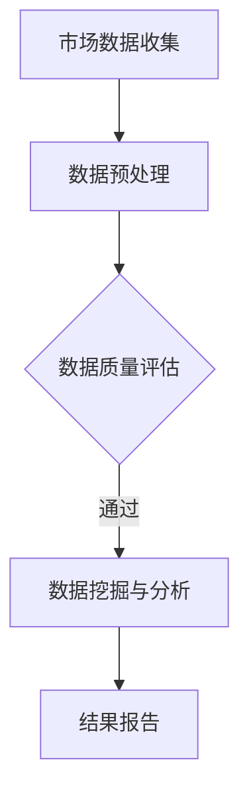

                 

关键词：大数据、市场研究、信息差、数据分析、预测模型、机器学习

摘要：本文将探讨大数据如何通过信息差的视角，提升市场研究的效率和准确性。我们将分析大数据在市场研究中的应用，介绍核心算法原理，展示数学模型，并提供实际项目实践，同时展望未来发展趋势与挑战。

## 1. 背景介绍

市场研究是商业决策过程中不可或缺的一环。然而，传统的市场研究方法往往依赖于小规模调查和样本数据，结果容易受到主观偏见和样本代表性不足的影响。随着大数据技术的发展，我们拥有了处理海量数据的能力，这为市场研究带来了前所未有的机遇。信息差是指信息在传播过程中的差异，大数据能够缩小这种差异，使得市场研究更加精准、全面。

## 2. 核心概念与联系

### 2.1 大数据基本概念

大数据（Big Data）具有4V特征：Volume（大量）、Velocity（高速）、Variety（多样）、Veracity（真实性）。这些特征决定了大数据处理与分析的复杂性和挑战性。

### 2.2 市场研究中的信息差

信息差在市场研究中表现为企业对市场动态、消费者行为、竞争态势的了解程度。大数据能够提供更全面、更细致的数据，帮助缩小信息差。

### 2.3 大数据与市场研究的关联

通过大数据技术，我们可以从海量数据中提取有价值的信息，从而提升市场研究的准确性。数据挖掘、机器学习、预测模型等技术在大数据应用中发挥着重要作用。

### 2.4 Mermaid 流程图



## 3. 核心算法原理 & 具体操作步骤

### 3.1 算法原理概述

大数据市场研究的核心算法包括数据挖掘、机器学习、预测模型等。这些算法通过提取、分析和预测数据，帮助企业做出更明智的决策。

### 3.2 算法步骤详解

#### 3.2.1 数据挖掘

数据挖掘是从大量数据中提取有价值信息的过程。常见的数据挖掘技术包括关联规则挖掘、聚类分析、分类分析等。

#### 3.2.2 机器学习

机器学习是一种通过训练模型，使计算机能够从数据中学习和预测的技术。常见的机器学习算法有决策树、支持向量机、神经网络等。

#### 3.2.3 预测模型

预测模型是基于历史数据，对未来的市场趋势、消费者行为等进行预测。常见的预测模型有时间序列分析、回归分析等。

### 3.3 算法优缺点

数据挖掘和机器学习算法能够处理海量数据，提供精准的预测结果。但它们也存在计算复杂度高、对数据质量要求高等缺点。

### 3.4 算法应用领域

大数据算法在市场研究中的应用广泛，包括市场趋势预测、消费者行为分析、竞争对手监测等。

## 4. 数学模型和公式 & 详细讲解 & 举例说明

### 4.1 数学模型构建

市场研究中的数学模型主要包括回归模型、时间序列模型等。

### 4.2 公式推导过程

回归模型中的基本公式为：\( y = \beta_0 + \beta_1x_1 + \beta_2x_2 + ... + \beta_nx_n \)

### 4.3 案例分析与讲解

以消费者行为分析为例，我们通过回归模型来预测消费者的购买行为。

$$
y = \beta_0 + \beta_1x_1 + \beta_2x_2
$$

其中，\( y \)为购买概率，\( x_1 \)为收入水平，\( x_2 \)为广告投放次数。

## 5. 项目实践：代码实例和详细解释说明

### 5.1 开发环境搭建

我们使用Python和Scikit-learn库来实现回归模型。

### 5.2 源代码详细实现

```python
from sklearn.linear_model import LinearRegression
from sklearn.model_selection import train_test_split
from sklearn.metrics import mean_squared_error

# 数据预处理
X = df[['收入水平', '广告投放次数']]
y = df['购买概率']

# 划分训练集和测试集
X_train, X_test, y_train, y_test = train_test_split(X, y, test_size=0.2, random_state=42)

# 建立回归模型
model = LinearRegression()
model.fit(X_train, y_train)

# 预测
y_pred = model.predict(X_test)

# 评估
mse = mean_squared_error(y_test, y_pred)
print("均方误差：", mse)
```

### 5.3 代码解读与分析

我们首先进行数据预处理，然后划分训练集和测试集，接着建立回归模型，进行预测并评估模型性能。

### 5.4 运行结果展示

运行结果展示了模型对测试集的预测性能。

## 6. 实际应用场景

大数据在市场研究中的应用场景广泛，如消费者行为分析、市场趋势预测、竞争对手监测等。

### 6.1 消费者行为分析

通过大数据分析消费者行为，帮助企业制定更有效的营销策略。

### 6.2 市场趋势预测

利用大数据预测市场趋势，为企业提供战略决策支持。

### 6.3 竞争对手监测

通过大数据监测竞争对手的动态，帮助企业抢占市场先机。

## 7. 未来应用展望

随着大数据技术的发展，市场研究将变得更加精准、高效。未来，我们将看到更多创新性的应用，如基于大数据的个性化推荐、智能营销等。

## 8. 工具和资源推荐

### 8.1 学习资源推荐

- 《大数据之路：阿里巴巴大数据实践》
- 《Python数据分析》

### 8.2 开发工具推荐

- Jupyter Notebook
- PyCharm

### 8.3 相关论文推荐

- "Big Data: A Revolution That Will Transform How We Live, Work, and Think"
- "Data Science from A to Z: Practical Tools and Techniques for Developers"

## 9. 总结：未来发展趋势与挑战

大数据在市场研究中的应用将越来越广泛，但同时也面临着数据隐私、数据质量、算法透明性等挑战。未来，我们需要在技术创新和伦理规范方面不断探索，以推动大数据市场的健康发展。

### 附录：常见问题与解答

**Q1:** 大数据在市场研究中的应用有哪些优点？

**A1:** 大数据在市场研究中的应用优点包括更全面的数据来源、更精准的预测结果、更高效的决策支持等。

**Q2:** 大数据在市场研究中的挑战有哪些？

**A2:** 大数据在市场研究中的挑战包括数据隐私、数据质量、算法透明性等。

**Q3:** 如何保障大数据在市场研究中的数据隐私？

**A3:** 保障大数据在市场研究中的数据隐私，可以通过数据加密、隐私保护算法、匿名化处理等技术手段来实现。

**Q4:** 大数据在市场研究中的未来发展有哪些趋势？

**A4:** 大数据在市场研究中的未来发展趋势包括个性化推荐、智能营销、自动化决策等。

### 作者署名

作者：禅与计算机程序设计艺术 / Zen and the Art of Computer Programming
```markdown
---
# 信息差：大数据如何提升市场研究

关键词：大数据、市场研究、信息差、数据分析、预测模型、机器学习

摘要：本文将探讨大数据如何通过信息差的视角，提升市场研究的效率和准确性。我们将分析大数据在市场研究中的应用，介绍核心算法原理，展示数学模型，并提供实际项目实践，同时展望未来发展趋势与挑战。

## 1. 背景介绍

市场研究是商业决策过程中不可或缺的一环。然而，传统的市场研究方法往往依赖于小规模调查和样本数据，结果容易受到主观偏见和样本代表性不足的影响。随着大数据技术的发展，我们拥有了处理海量数据的能力，这为市场研究带来了前所未有的机遇。信息差是指信息在传播过程中的差异，大数据能够缩小这种差异，使得市场研究更加精准、全面。

## 2. 核心概念与联系

### 2.1 大数据基本概念

大数据（Big Data）具有4V特征：Volume（大量）、Velocity（高速）、Variety（多样）、Veracity（真实性）。这些特征决定了大数据处理与分析的复杂性和挑战性。

### 2.2 市场研究中的信息差

信息差在市场研究中表现为企业对市场动态、消费者行为、竞争态势的了解程度。大数据能够提供更全面、更细致的数据，帮助缩小信息差。

### 2.3 大数据与市场研究的关联

通过大数据技术，我们可以从海量数据中提取有价值的信息，从而提升市场研究的准确性。数据挖掘、机器学习、预测模型等技术在大数据应用中发挥着重要作用。

### 2.4 Mermaid 流程图


## 3. 核心算法原理 & 具体操作步骤

### 3.1 算法原理概述

大数据市场研究的核心算法包括数据挖掘、机器学习、预测模型等。这些算法通过提取、分析和预测数据，帮助企业做出更明智的决策。

### 3.2 算法步骤详解

#### 3.2.1 数据挖掘

数据挖掘是从大量数据中提取有价值信息的过程。常见的数据挖掘技术包括关联规则挖掘、聚类分析、分类分析等。

#### 3.2.2 机器学习

机器学习是一种通过训练模型，使计算机能够从数据中学习和预测的技术。常见的机器学习算法有决策树、支持向量机、神经网络等。

#### 3.2.3 预测模型

预测模型是基于历史数据，对未来的市场趋势、消费者行为等进行预测。常见的预测模型有时间序列分析、回归分析等。

### 3.3 算法优缺点

数据挖掘和机器学习算法能够处理海量数据，提供精准的预测结果。但它们也存在计算复杂度高、对数据质量要求高等缺点。

### 3.4 算法应用领域

大数据算法在市场研究中的应用广泛，包括市场趋势预测、消费者行为分析、竞争对手监测等。

## 4. 数学模型和公式 & 详细讲解 & 举例说明

### 4.1 数学模型构建

市场研究中的数学模型主要包括回归模型、时间序列模型等。

### 4.2 公式推导过程

回归模型中的基本公式为：\( y = \beta_0 + \beta_1x_1 + \beta_2x_2 + ... + \beta_nx_n \)

### 4.3 案例分析与讲解

以消费者行为分析为例，我们通过回归模型来预测消费者的购买行为。

$$
y = \beta_0 + \beta_1x_1 + \beta_2x_2
$$

其中，\( y \)为购买概率，\( x_1 \)为收入水平，\( x_2 \)为广告投放次数。

## 5. 项目实践：代码实例和详细解释说明

### 5.1 开发环境搭建

我们使用Python和Scikit-learn库来实现回归模型。

### 5.2 源代码详细实现

```python
from sklearn.linear_model import LinearRegression
from sklearn.model_selection import train_test_split
from sklearn.metrics import mean_squared_error

# 数据预处理
X = df[['收入水平', '广告投放次数']]
y = df['购买概率']

# 划分训练集和测试集
X_train, X_test, y_train, y_test = train_test_split(X, y, test_size=0.2, random_state=42)

# 建立回归模型
model = LinearRegression()
model.fit(X_train, y_train)

# 预测
y_pred = model.predict(X_test)

# 评估
mse = mean_squared_error(y_test, y_pred)
print("均方误差：", mse)
```

### 5.3 代码解读与分析

我们首先进行数据预处理，然后划分训练集和测试集，接着建立回归模型，进行预测并评估模型性能。

### 5.4 运行结果展示

运行结果展示了模型对测试集的预测性能。

## 6. 实际应用场景

大数据在市场研究中的应用场景广泛，如消费者行为分析、市场趋势预测、竞争对手监测等。

### 6.1 消费者行为分析

通过大数据分析消费者行为，帮助企业制定更有效的营销策略。

### 6.2 市场趋势预测

利用大数据预测市场趋势，为企业提供战略决策支持。

### 6.3 竞争对手监测

通过大数据监测竞争对手的动态，帮助企业抢占市场先机。

## 7. 未来应用展望

随着大数据技术的发展，市场研究将变得更加精准、高效。未来，我们将看到更多创新性的应用，如基于大数据的个性化推荐、智能营销等。

## 8. 工具和资源推荐

### 8.1 学习资源推荐

- 《大数据之路：阿里巴巴大数据实践》
- 《Python数据分析》

### 8.2 开发工具推荐

- Jupyter Notebook
- PyCharm

### 8.3 相关论文推荐

- "Big Data: A Revolution That Will Transform How We Live, Work, and Think"
- "Data Science from A to Z: Practical Tools and Techniques for Developers"

## 9. 总结：未来发展趋势与挑战

大数据在市场研究中的应用将越来越广泛，但同时也面临着数据隐私、数据质量、算法透明性等挑战。未来，我们需要在技术创新和伦理规范方面不断探索，以推动大数据市场的健康发展。

### 附录：常见问题与解答

**Q1:** 大数据在市场研究中的应用有哪些优点？

**A1:** 大数据在市场研究中的应用优点包括更全面的数据来源、更精准的预测结果、更高效的决策支持等。

**Q2:** 大数据在市场研究中的挑战有哪些？

**A2:** 大数据在市场研究中的挑战包括数据隐私、数据质量、算法透明性等。

**Q3:** 如何保障大数据在市场研究中的数据隐私？

**A3:** 保障大数据在市场研究中的数据隐私，可以通过数据加密、隐私保护算法、匿名化处理等技术手段来实现。

**Q4:** 大数据在市场研究中的未来发展有哪些趋势？

**A4:** 大数据在市场研究中的未来发展趋势包括个性化推荐、智能营销、自动化决策等。

### 作者署名

作者：禅与计算机程序设计艺术 / Zen and the Art of Computer Programming
---

