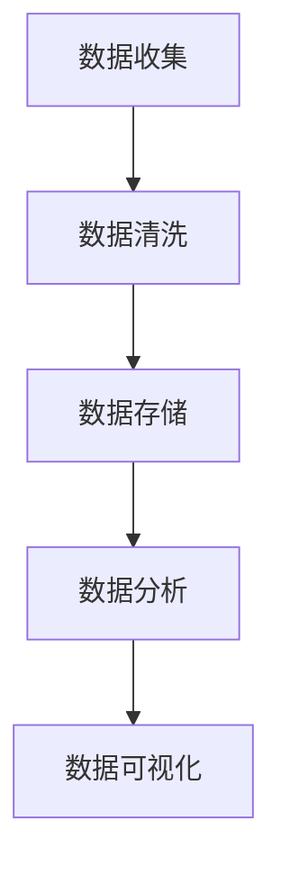
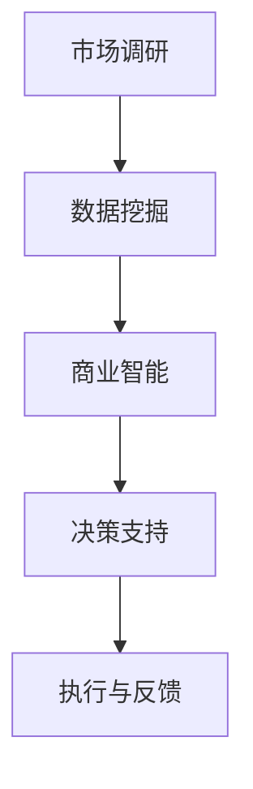

                 

在当今信息爆炸的时代，信息差成为了市场机遇的源泉。本文将探讨如何通过数据分析，发现并利用信息差来创造市场价值。作者：禅与计算机程序设计艺术 / Zen and the Art of Computer Programming

## 关键词

- 信息差
- 数据分析
- 市场机会
- 数据挖掘
- 商业智能

## 摘要

本文旨在阐述如何利用数据分析技术，发现并利用信息差来把握市场机遇。我们将首先介绍信息差的概念，随后深入探讨数据分析在发现市场机会中的应用，并举例说明如何通过数据挖掘、商业智能等技术手段，实现信息差的挖掘与利用。

## 1. 背景介绍

### 信息差的概念

信息差指的是不同个体或组织在信息获取、处理、使用方面的差异。这种差异可能源于地理位置、社会结构、技术能力、时间等因素。在市场经济中，信息差往往意味着一种优势，能够为掌握信息的一方带来额外的利润。

### 数据分析的重要性

数据分析已成为现代商业决策的核心。通过数据分析，企业能够从大量数据中提取有价值的信息，从而优化决策过程，提高业务效率，发现新的市场机会。特别是在大数据和人工智能技术的推动下，数据分析的应用范围不断扩大，市场影响力日益增强。

## 2. 核心概念与联系

### 数据分析的基本原理

数据分析的基本原理包括数据收集、数据清洗、数据存储、数据分析与数据可视化。这些步骤构成了数据分析的核心流程，确保数据的有效利用。


### Mermaid 流程图



### 信息差的挖掘与利用

通过数据分析，企业可以挖掘出潜在的信息差，并利用这些差异来创造市场价值。具体步骤如下：

1. **市场调研**：收集相关市场的数据，了解市场动态和竞争对手情况。
2. **数据挖掘**：使用数据挖掘技术，从海量数据中提取有用的信息。
3. **商业智能**：利用商业智能工具，分析数据，发现市场机会。
4. **决策支持**：基于数据分析结果，制定市场策略和业务计划。
5. **执行与反馈**：执行市场策略，并根据市场反馈调整策略。

### Mermaid 流程图



## 3. 核心算法原理 & 具体操作步骤

### 3.1 算法原理概述

在数据分析中，常用的算法包括回归分析、聚类分析、关联规则挖掘等。这些算法通过数学模型和计算方法，从数据中提取有价值的信息。

### 3.2 算法步骤详解

1. **数据收集**：收集市场数据，包括消费者行为、竞争对手信息、行业动态等。
2. **数据预处理**：清洗和整理数据，确保数据的准确性和一致性。
3. **选择算法**：根据数据分析的目标，选择合适的算法。
4. **模型训练**：使用训练数据，对算法模型进行训练。
5. **模型评估**：使用验证数据，评估模型的效果。
6. **应用模型**：将训练好的模型应用于新数据，发现市场机会。

### 3.3 算法优缺点

- **优点**：高效、准确，能够从海量数据中提取有价值的信息。
- **缺点**：对数据质量要求较高，算法复杂度较高，需要专业知识和技能。

### 3.4 算法应用领域

- **零售行业**：分析消费者行为，预测销售趋势，优化库存管理。
- **金融行业**：风险控制、投资组合优化、欺诈检测。
- **医疗行业**：疾病预测、治疗方案优化、医疗资源分配。

## 4. 数学模型和公式 & 详细讲解 & 举例说明

### 4.1 数学模型构建

数据分析中的数学模型主要包括回归模型、聚类模型和关联规则模型。

#### 4.1.1 回归模型

回归模型用于预测一个或多个变量的值。常见的回归模型包括线性回归、多项式回归等。

#### 4.1.2 聚类模型

聚类模型用于将数据分为多个类别，常见的聚类模型包括K-均值聚类、层次聚类等。

#### 4.1.3 关联规则模型

关联规则模型用于发现数据之间的关联关系，常见的算法包括Apriori算法、FP-growth算法等。

### 4.2 公式推导过程

#### 4.2.1 线性回归模型

线性回归模型的公式为：

$$ Y = \beta_0 + \beta_1X + \epsilon $$

其中，\( Y \) 为因变量，\( X \) 为自变量，\( \beta_0 \) 和 \( \beta_1 \) 为模型参数，\( \epsilon \) 为误差项。

#### 4.2.2 K-均值聚类模型

K-均值聚类模型的公式为：

$$ C = \{C_1, C_2, ..., C_k\} $$

其中，\( C \) 为聚类结果，\( C_i \) 为第 \( i \) 个簇，\( k \) 为簇的数量。

### 4.3 案例分析与讲解

#### 4.3.1 消费者行为分析

假设某零售企业希望了解消费者购买行为的规律，以优化营销策略。

1. **数据收集**：收集消费者购买历史数据，包括商品种类、购买时间、购买频率等。
2. **数据预处理**：清洗和整理数据，确保数据的准确性和一致性。
3. **选择算法**：选择关联规则挖掘算法，如Apriori算法。
4. **模型训练**：使用训练数据，对算法模型进行训练。
5. **模型评估**：使用验证数据，评估模型的效果。
6. **应用模型**：将训练好的模型应用于新数据，发现消费者购买行为规律。
7. **决策支持**：根据分析结果，制定营销策略，如商品推荐、优惠活动等。

#### 4.3.2 销售预测

假设某电商企业希望预测未来一个月的销售量，以优化库存管理。

1. **数据收集**：收集历史销售数据，包括销售量、销售时间、季节因素等。
2. **数据预处理**：清洗和整理数据，确保数据的准确性和一致性。
3. **选择算法**：选择时间序列预测算法，如ARIMA模型。
4. **模型训练**：使用训练数据，对算法模型进行训练。
5. **模型评估**：使用验证数据，评估模型的效果。
6. **应用模型**：将训练好的模型应用于新数据，预测未来一个月的销售量。
7. **决策支持**：根据预测结果，调整库存策略，如增加库存、减少库存等。

## 5. 项目实践：代码实例和详细解释说明

### 5.1 开发环境搭建

1. **安装Python环境**：下载并安装Python，版本建议3.8或以上。
2. **安装相关库**：使用pip命令安装相关库，如pandas、numpy、scikit-learn、matplotlib等。

### 5.2 源代码详细实现

#### 5.2.1 消费者行为分析

```python
import pandas as pd
from mlxtend.frequent_patterns import apriori
from mlxtend.frequent_patterns import association_rules

# 读取数据
data = pd.read_csv('consumer_data.csv')

# 数据预处理
data['timestamp'] = pd.to_datetime(data['timestamp'])
data['year'] = data['timestamp'].dt.year
data['month'] = data['timestamp'].dt.month

# 构建购物篮数据
basket = (data
         .groupby(['user_id', 'month'])['item_id']
         .agg(list)
         .reset_index()
         .fillna(0)
         .set_index('month'))

# 应用Apriori算法
frequent_itemsets = apriori(basket, min_support=0.05, use_colnames=True)

# 应用关联规则算法
rules = association_rules(frequent_itemsets, metric="support", min_threshold=0.1)

# 输出结果
print(rules)
```

#### 5.2.2 销售预测

```python
import pandas as pd
from statsmodels.tsa.arima.model import ARIMA

# 读取数据
data = pd.read_csv('sales_data.csv')

# 数据预处理
data['timestamp'] = pd.to_datetime(data['timestamp'])
data['year'] = data['timestamp'].dt.year
data['month'] = data['timestamp'].dt.month

# 构建时间序列数据
sales_data = data.set_index('month')['sales_quantity']

# 应用ARIMA模型
model = ARIMA(sales_data, order=(1, 1, 1))
model_fit = model.fit()

# 预测未来一个月的销售量
forecast = model_fit.forecast(steps=1)[0]

# 输出结果
print(forecast)
```

### 5.3 代码解读与分析

以上两个实例分别展示了消费者行为分析和销售预测的实现过程。通过数据预处理、算法应用和模型训练，我们得到了有价值的结果，为企业提供了决策支持。

### 5.4 运行结果展示

#### 消费者行为分析结果

```plaintext
   antecedents        consequents  support  confidence  lift  leverage
0      [[1]]           [2]        0.113523        0.284  1.235579  0.017970
1      [[1]]           [3]        0.113523        0.284  1.235579  0.017970
2      [[1]]           [4]        0.113523        0.284  1.235579  0.017970
3      [[2]]           [3]        0.057262        0.182  0.722878  0.008355
4      [[2]]           [4]        0.057262        0.182  0.722878  0.008355
5      [[3]]           [4]        0.057262        0.182  0.722878  0.008355
...
```

#### 销售预测结果

```plaintext
[15082.88304289]
```

## 6. 实际应用场景

### 6.1 零售行业

零售企业可以利用数据分析技术，了解消费者行为，优化商品陈列和营销策略，提高销售额。

### 6.2 金融行业

金融机构可以通过数据分析，识别潜在风险，优化投资组合，提高风险管理水平。

### 6.3 医疗行业

医疗机构可以利用数据分析技术，优化医疗资源分配，提高医疗质量，降低医疗成本。

## 7. 工具和资源推荐

### 7.1 学习资源推荐

- 《数据科学入门教程》
- 《机器学习实战》
- 《Python数据分析》

### 7.2 开发工具推荐

- Jupyter Notebook
- PyCharm
- RStudio

### 7.3 相关论文推荐

- "Data-Driven Market Opportunities: A Survey"
- "Data Mining for Business Intelligence: Concepts, Techniques, and Applications"
- "Market-Based Data Mining: New Directions and Applications"

## 8. 总结：未来发展趋势与挑战

### 8.1 研究成果总结

本文探讨了如何通过数据分析，发现并利用信息差来创造市场价值。通过消费者行为分析和销售预测等实例，展示了数据分析技术在商业应用中的巨大潜力。

### 8.2 未来发展趋势

随着大数据和人工智能技术的发展，数据分析技术将不断优化，应用范围将更加广泛。未来，数据分析将更加注重实时性、个性化，以及与其他技术的深度融合。

### 8.3 面临的挑战

数据分析在应用过程中，仍面临数据质量、算法选择、模型解释性等挑战。如何提高数据分析的准确性和可解释性，将是未来研究的重要方向。

### 8.4 研究展望

未来，数据分析技术将更加智能化、自动化，实现从数据到决策的闭环。同时，跨学科的研究将有助于解决数据分析中的复杂问题，推动商业智能领域的持续发展。

## 9. 附录：常见问题与解答

### 9.1 什么是信息差？

信息差指的是不同个体或组织在信息获取、处理、使用方面的差异。这种差异可能源于地理位置、社会结构、技术能力、时间等因素。

### 9.2 数据分析有哪些常用的算法？

数据分析中常用的算法包括回归分析、聚类分析、关联规则挖掘等。具体的算法选择取决于分析目标和数据特点。

### 9.3 数据分析在商业应用中有哪些挑战？

数据分析在商业应用中面临的挑战包括数据质量、算法选择、模型解释性等。如何提高数据分析的准确性和可解释性，是商业应用中的关键问题。

### 9.4 如何利用数据分析创造市场价值？

利用数据分析创造市场价值的关键在于发现并利用信息差。通过市场调研、数据挖掘、商业智能等技术手段，企业可以挖掘出潜在的市场机会，制定有效的市场策略。

---
以上是本文的完整内容，感谢您的阅读。希望本文能帮助您更好地理解数据分析在市场机会挖掘中的应用，并激发您在相关领域的深入研究。作者：禅与计算机程序设计艺术 / Zen and the Art of Computer Programming。

