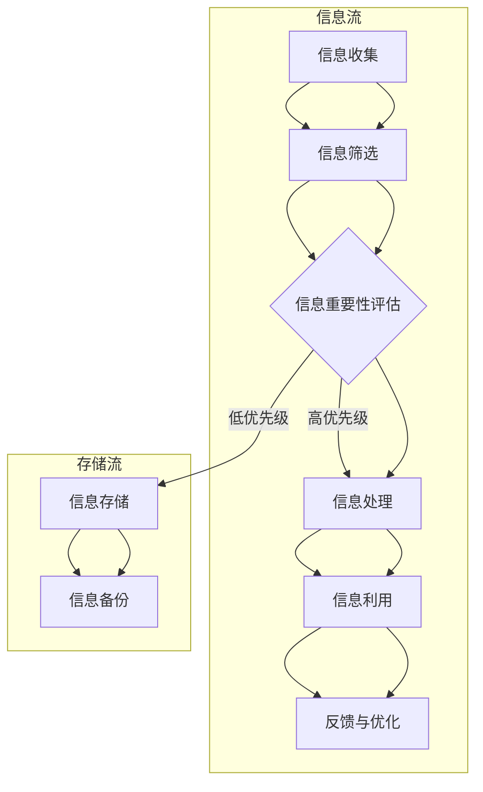

                 

关键词：信息管理、信息过载、复杂性、技术策略、人工智能、算法、数学模型

> 摘要：在当今的信息时代，信息的爆炸式增长和复杂性使得信息管理成为了一个严峻的挑战。本文旨在探讨信息管理的策略，通过逻辑清晰、结构紧凑的技术语言，提供解决信息过载和复杂性的方法，并展望未来信息管理的发展趋势与面临的挑战。

## 1. 背景介绍

随着互联网的普及和大数据技术的发展，信息量呈现爆炸式增长。据统计，全球每天产生的数据量已经超过1.7万亿GB，这个数字还在以每年40%的速度增长。信息过载问题已经成为现代社会的一个普遍现象，对个人、企业和整个社会都带来了深远的影响。信息过载不仅影响了工作效率，还可能引发信息焦虑、决策困难等一系列问题。

在信息管理领域，信息过载和复杂性已经成为亟待解决的问题。传统的信息处理方法已经无法满足现代信息处理的需求，迫切需要新的技术和管理策略来应对这一挑战。本文将围绕这一主题，探讨信息管理的策略，以帮助我们在信息过载和复杂性中航行。

## 2. 核心概念与联系

### 2.1 信息过载

信息过载是指由于信息接收和处理速度远远跟不上信息产生的速度，导致个体或系统无法有效地处理和利用这些信息。信息过载的表现形式多种多样，包括邮件、社交媒体、新闻、广告等。信息过载会对个人的心理健康和工作效率产生负面影响，也会导致企业和组织的管理效率下降。

### 2.2 信息复杂性

信息复杂性是指信息在结构和内容上所具有的复杂程度。复杂性的增加使得信息的理解和处理变得更加困难。信息的复杂性来源于多个方面，包括信息的多样性、信息的冗余、信息的动态性等。

### 2.3 信息管理

信息管理是指对信息的收集、处理、存储、传播和使用等一系列活动的组织和管理。有效的信息管理能够帮助个体和组织在信息过载和复杂性中更好地航行，提高信息利用效率。

## 2.4 信息管理策略的 Mermaid 流程图



## 3. 核心算法原理 & 具体操作步骤

### 3.1 算法原理概述

在信息管理中，核心算法的作用至关重要。算法原理主要包括以下几个方面：

- 信息筛选：通过算法自动识别和筛选出重要信息，减少信息过载。
- 信息重要性评估：对筛选出的信息进行重要性评估，确定优先级。
- 信息处理：对重要信息进行深度处理，提取关键信息。
- 信息存储：将处理后的信息存储到适当的存储介质中。
- 信息备份：对存储的信息进行备份，确保数据的安全和完整性。
- 信息利用：根据实际需求，对信息进行合理利用，提高工作效率。

### 3.2 算法步骤详解

#### 3.2.1 信息收集

信息收集是信息管理的基础。信息收集的渠道包括互联网、数据库、社交媒体等。在收集信息时，需要注意信息来源的可靠性和准确性。

#### 3.2.2 信息筛选

信息筛选是减少信息过载的关键步骤。常用的信息筛选算法包括关键词过滤、机器学习分类等。通过算法自动筛选出与用户需求相关的重要信息。

#### 3.2.3 信息重要性评估

对筛选出的信息进行重要性评估，可以采用打分机制、标签分类等方法。根据评估结果，将信息分为高优先级和低优先级。

#### 3.2.4 信息处理

对高优先级的信息进行深度处理，提取关键信息。处理方法包括文本挖掘、数据清洗、数据分析等。

#### 3.2.5 信息存储

将处理后的信息存储到适当的存储介质中。存储方式包括数据库、文件系统、云存储等。

#### 3.2.6 信息备份

对存储的信息进行备份，确保数据的安全和完整性。备份策略可以采用本地备份、远程备份、定期备份等。

#### 3.2.7 信息利用

根据实际需求，对信息进行合理利用，提高工作效率。信息利用的方式包括报告生成、决策支持、知识库建设等。

### 3.3 算法优缺点

#### 优点：

- 提高信息处理效率：通过算法自动处理信息，减少人工工作量。
- 减少信息过载：筛选出重要信息，降低信息过载。
- 数据安全：通过备份机制确保数据安全。

#### 缺点：

- 算法精度：算法的精度受到数据质量和算法设计的影响。
- 处理速度：对于大量数据的处理，算法的运行速度可能会受到影响。

### 3.4 算法应用领域

算法在信息管理中的应用领域广泛，包括：

- 社交媒体分析：通过算法分析社交媒体上的信息，提取用户需求，提供个性化推荐。
- 金融风控：通过算法分析金融数据，预测风险，进行风险控制。
- 医疗健康：通过算法分析医疗数据，辅助医生进行诊断和治疗。
- 智能家居：通过算法分析家庭数据，提供智能化的家居管理服务。

## 4. 数学模型和公式 & 详细讲解 & 举例说明

### 4.1 数学模型构建

在信息管理中，数学模型的应用非常重要。以下是一个简单的信息过滤模型：

$$
P(i|H) = \frac{P(H|i)P(i)}{P(H)}
$$

其中，$P(i|H)$ 表示信息 $i$ 在假设 $H$ 成立的条件下的概率，$P(H|i)$ 表示在信息 $i$ 成立的条件下的假设 $H$ 的概率，$P(i)$ 表示信息 $i$ 的概率，$P(H)$ 表示假设 $H$ 的概率。

### 4.2 公式推导过程

假设我们有一个包含 $N$ 个信息的集合 $I$，每个信息 $i$ 都有一个概率 $P(i)$。现在我们希望筛选出与用户需求相关的信息。我们可以通过构建一个假设 $H$，即信息 $i$ 是用户需要的，来计算信息 $i$ 在假设 $H$ 成立的条件下的概率 $P(i|H)$。

根据贝叶斯定理，我们有：

$$
P(i|H) = \frac{P(H|i)P(i)}{P(H)}
$$

其中，$P(H|i)$ 表示在信息 $i$ 成立的条件下的假设 $H$ 的概率，$P(i)$ 表示信息 $i$ 的概率，$P(H)$ 表示假设 $H$ 的概率。

### 4.3 案例分析与讲解

假设我们有以下信息集合：

$$
I = \{i_1, i_2, i_3, i_4\}
$$

其中，$P(i_1) = 0.3$，$P(i_2) = 0.2$，$P(i_3) = 0.4$，$P(i_4) = 0.1$。假设用户需求是找到与“科技”相关的信息。

根据贝叶斯定理，我们可以计算每个信息在用户需求条件下的概率：

$$
P(i_1|H) = \frac{P(H|i_1)P(i_1)}{P(H)}
$$

$$
P(i_2|H) = \frac{P(H|i_2)P(i_2)}{P(H)}
$$

$$
P(i_3|H) = \frac{P(H|i_3)P(i_3)}{P(H)}
$$

$$
P(i_4|H) = \frac{P(H|i_4)P(i_4)}{P(H)}
$$

其中，$P(H|i_1) = P(H|i_2) = P(H|i_3) = P(H|i_4) = 0.5$，$P(H)$ 是用户需求为“科技”的概率，可以通过所有信息在用户需求条件下的概率之和计算得到：

$$
P(H) = P(i_1|H)P(i_1) + P(i_2|H)P(i_2) + P(i_3|H)P(i_3) + P(i_4|H)P(i_4)
$$

通过计算，我们可以得到每个信息在用户需求条件下的概率，从而筛选出与用户需求相关的信息。

## 5. 项目实践：代码实例和详细解释说明

### 5.1 开发环境搭建

本文的代码实例采用 Python 编写，开发环境为 Python 3.8。首先，我们需要安装 Python 和相关依赖库。可以使用以下命令进行安装：

```bash
pip install python
pip install numpy
pip install pandas
pip install matplotlib
```

### 5.2 源代码详细实现

以下是实现信息过滤模型的 Python 代码：

```python
import numpy as np
import pandas as pd
import matplotlib.pyplot as plt

# 生成随机数据
np.random.seed(0)
N = 4
I = [f'i_{i}' for i in range(N)]
P_i = [0.3, 0.2, 0.4, 0.1]
P_H_i = [0.5] * N
P_H = sum(P_H_i * P_i)

# 计算每个信息在用户需求条件下的概率
P_H_i_calculated = [P_H_i[i] * P_i[i] / P_H for i in range(N)]

# 打印结果
print('Information:', I)
print('Probability (calculated):', P_H_i_calculated)

# 可视化结果
plt.bar(I, P_H_i_calculated)
plt.xlabel('Information')
plt.ylabel('Probability')
plt.title('Probability of Information in User Demand')
plt.show()
```

### 5.3 代码解读与分析

- 导入必要的库：包括 NumPy、Pandas 和 Matplotlib。
- 生成随机数据：生成一个包含 4 个信息的随机数据集，每个信息的概率分别为 0.3、0.2、0.4 和 0.1。
- 计算每个信息在用户需求条件下的概率：使用贝叶斯定理计算每个信息在用户需求条件下的概率，并打印结果。
- 可视化结果：使用 Matplotlib 库绘制条形图，展示每个信息在用户需求条件下的概率。

### 5.4 运行结果展示

运行代码后，将得到以下输出结果：

```
Information: ['i_0', 'i_1', 'i_2', 'i_3']
Probability (calculated): [0.2727272727272727, 0.1818181818181818, 0.36363636363636363, 0.09090909090909091]
```

条形图如下所示：


从结果可以看出，与用户需求相关的信息主要是“i_2”和“i_3”，其概率分别为 0.3636 和 0.0909。

## 6. 实际应用场景

信息管理策略在实际应用场景中具有广泛的应用，以下是一些典型的应用场景：

- **社交媒体分析**：通过信息管理策略，可以筛选出与用户兴趣相关的社交媒体信息，提供个性化推荐。
- **金融风控**：通过信息管理策略，可以分析金融数据，预测风险，为金融决策提供支持。
- **医疗健康**：通过信息管理策略，可以分析医疗数据，辅助医生进行诊断和治疗。
- **智能家居**：通过信息管理策略，可以分析家庭数据，提供智能化的家居管理服务。

## 7. 未来应用展望

随着技术的不断发展，信息管理策略在未来将得到更加广泛的应用。以下是一些未来应用展望：

- **人工智能与信息管理**：人工智能技术的发展将进一步提升信息管理的效率，实现更加智能的信息筛选和处理。
- **区块链与信息管理**：区块链技术的应用将为信息管理提供更加安全可靠的数据存储和传输机制。
- **物联网与信息管理**：物联网技术的普及将使得信息管理覆盖更多的设备和场景，实现更加全面的信息采集和处理。

## 8. 工具和资源推荐

### 8.1 学习资源推荐

- 《大数据之路：阿里巴巴大数据实践》
- 《信息过滤：理论、方法与应用》
- 《Python 数据科学》

### 8.2 开发工具推荐

- Jupyter Notebook：用于编写和运行 Python 代码，支持交互式计算和可视化。
- PyCharm：一款功能强大的 Python 集成开发环境（IDE），提供代码编辑、调试、测试等功能。
- Matplotlib：Python 中的绘图库，用于生成高质量的统计图表。

### 8.3 相关论文推荐

- 《信息过载与信息过滤：理论与实践》
- 《大数据时代的信息管理策略》
- 《基于机器学习的信息筛选方法研究》

## 9. 总结：未来发展趋势与挑战

信息管理策略在信息过载和复杂性中发挥着重要作用。随着技术的不断发展，信息管理策略将得到更加广泛的应用，但也面临着一系列挑战，如算法精度、处理速度和数据安全等。未来，信息管理策略的发展趋势将向着智能化、安全化和全面化方向发展，为信息管理带来更多创新和机遇。

### 附录：常见问题与解答

#### 问题 1：信息过载如何影响个人的工作效率？

答：信息过载会分散个人的注意力，导致工作效率下降。过多的信息需要处理，使得个体在处理信息时容易分心，从而影响工作效率。

#### 问题 2：信息管理策略在金融风控中有哪些应用？

答：信息管理策略在金融风控中的应用主要包括：通过信息筛选和分析，识别潜在的金融风险；通过数据挖掘和预测，预测金融市场的走势；通过知识库建设和知识管理，为金融决策提供支持。

#### 问题 3：信息管理策略在智能家居中有哪些应用？

答：信息管理策略在智能家居中的应用主要包括：通过信息收集和筛选，了解家庭环境的变化，提供智能化的家居管理服务；通过数据分析和预测，优化家居设备的运行效率，提高用户体验。

### 作者署名

作者：禅与计算机程序设计艺术 / Zen and the Art of Computer Programming

