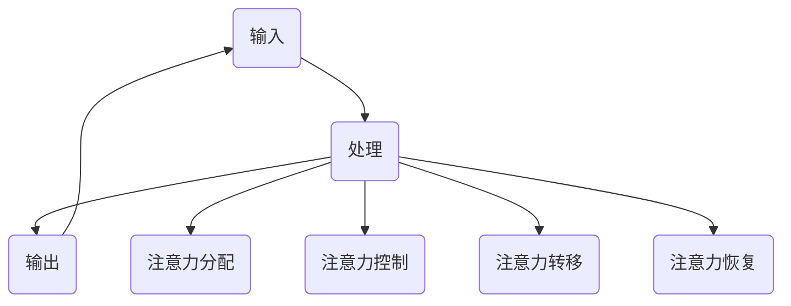

                 

 在当今信息爆炸的时代，我们每天都要处理大量的信息。从社交媒体上的推文、电子邮件、新闻头条到工作通知、社交媒体更新，我们的注意力被各种信息不断打断。这种信息过载和持续的干扰对工作效率和心理健康造成了巨大的影响。因此，掌握有效的注意力管理技术和策略变得至关重要。本文将探讨在信息过载和干扰中保持头脑清晰的几种技术和策略，帮助我们在复杂的环境中保持专注和高效。

## 1. 背景介绍

### 信息过载的影响

信息过载是指个体在短时间内接收到的信息量超过其处理能力。这不仅会导致认知负担增加，还会影响工作效率、创造力和决策能力。长期处于信息过载状态，个体可能会出现焦虑、压力和疲劳等症状。

### 注意力管理的重要性

注意力管理是指个体有意识地控制自己的注意力，以实现特定的目标和任务。有效的注意力管理能够帮助我们提高工作效率、增强学习效果、改善心理健康。因此，研究注意力管理技术和策略对于提高个体在信息过载环境中的适应能力具有重要意义。

## 2. 核心概念与联系

### 注意力管理的核心概念

注意力管理包括以下几个方面：

- **注意力分配**：个体在不同任务之间分配注意力资源。
- **注意力控制**：个体在执行任务过程中保持注意力集中。
- **注意力转移**：个体在不同任务或环境之间切换注意力。
- **注意力恢复**：个体在长时间工作后通过休息和放松恢复注意力。

### 注意力管理的架构

注意力管理的架构可以看作是一个包含输入、处理和输出的循环系统：

1. **输入**：外部信息和内部情绪状态。
2. **处理**：注意力的分配、控制和转移。
3. **输出**：注意力管理的成效，包括任务完成情况、心理健康状态等。

### Mermaid 流程图



## 3. 核心算法原理 & 具体操作步骤

### 3.1 算法原理概述

注意力管理算法的核心在于如何有效地分配和控制注意力资源，以实现最优的任务完成效果。该算法主要基于以下几个原理：

- **优先级排序**：根据任务的紧急程度和重要性对任务进行排序，优先处理高优先级任务。
- **时间管理**：合理规划工作时间，避免长时间连续工作导致的注意力疲劳。
- **环境控制**：创造有利于注意力集中的工作环境，减少干扰因素。

### 3.2 算法步骤详解

1. **任务分类**：将所有任务分为紧急但不重要、重要但紧急、既紧急又重要、不重要且不紧急四类。
2. **优先级排序**：根据任务分类结果，对任务进行优先级排序。
3. **时间规划**：根据任务优先级和时长，制定每日工作计划。
4. **注意力分配**：在执行任务过程中，根据任务优先级动态调整注意力分配。
5. **注意力恢复**：在工作间隙和任务完成后，进行适当的休息和放松，恢复注意力。

### 3.3 算法优缺点

**优点**：

- **提高工作效率**：通过合理分配注意力，确保重要任务得到及时处理。
- **减少焦虑和压力**：避免长时间连续工作，有助于缓解焦虑和压力。
- **提升心理健康**：有助于个体在复杂环境中保持冷静和专注，提升心理健康。

**缺点**：

- **执行难度较高**：需要个体具备较强的自我控制和规划能力。
- **适应周期较长**：个体可能需要一段时间来适应新的工作模式。

### 3.4 算法应用领域

注意力管理算法可应用于以下几个方面：

- **个人时间管理**：帮助个体合理安排工作和生活，提高生活质量。
- **团队协作**：优化团队工作流程，提高团队工作效率。
- **教育领域**：提高学生的学习效果，培养学生的注意力管理能力。
- **工作场所**：优化工作环境，减少信息过载和干扰，提高员工工作效率。

## 4. 数学模型和公式 & 详细讲解 & 举例说明

### 4.1 数学模型构建

注意力管理数学模型可以表示为以下形式：

$$
\text{Attention} = f(\text{Task Priority}, \text{Time Allocation}, \text{Environmental Control})
$$

其中，$f$为注意力分配函数，$Task Priority$为任务优先级，$Time Allocation$为时间分配，$Environmental Control$为环境控制。

### 4.2 公式推导过程

根据注意力管理的核心原理，我们可以推导出以下公式：

$$
f(\text{Task Priority}, \text{Time Allocation}, \text{Environmental Control}) = \frac{\text{Task Priority} \times \text{Time Allocation} \times \text{Environmental Control}}{\text{Total Resources}}
$$

其中，$Total Resources$为总资源，包括时间、精力等。

### 4.3 案例分析与讲解

假设某个个体需要在一天内完成以下三项任务：

1. **紧急但不重要**：回复电子邮件（2小时）
2. **重要但紧急**：完成项目报告（4小时）
3. **既紧急又重要**：参加重要会议（3小时）

根据优先级排序和时间分配，个体可以制定以下计划：

1. **早上**：完成项目报告（4小时）
2. **中午**：参加重要会议（3小时）
3. **下午**：回复电子邮件（2小时）

在执行任务过程中，个体可以根据实际情况调整注意力分配，确保重要任务得到优先处理。

## 5. 项目实践：代码实例和详细解释说明

### 5.1 开发环境搭建

在本项目中，我们将使用Python作为编程语言，搭建一个简单的注意力管理工具。首先，确保安装Python环境，然后安装以下库：

```bash
pip install pandas matplotlib
```

### 5.2 源代码详细实现

```python
import pandas as pd
import matplotlib.pyplot as plt

# 任务数据
tasks = [
    {"name": "回复电子邮件", "priority": 1, "duration": 2},
    {"name": "完成项目报告", "priority": 3, "duration": 4},
    {"name": "参加重要会议", "priority": 5, "duration": 3},
]

# 优先级排序
tasks_sorted = sorted(tasks, key=lambda x: x["priority"], reverse=True)

# 时间分配
time分配 = [task["duration"] for task in tasks_sorted]

# 绘制图表
plt.bar(range(len(time分配)), time分配)
plt.xlabel("任务")
plt.ylabel("时间（小时）")
plt.title("注意力管理时间分配")
plt.show()
```

### 5.3 代码解读与分析

- 第1行：导入pandas库，用于数据处理。
- 第2行：导入matplotlib.pyplot库，用于绘制图表。
- 第3行：定义任务数据，包括任务名称、优先级和持续时间。
- 第4行：根据任务优先级进行排序。
- 第5行：提取排序后任务的时间分配。
- 第6行：使用bar函数绘制柱状图，展示时间分配。

### 5.4 运行结果展示

运行代码后，将生成一个柱状图，显示每个任务的持续时间。根据图表，个体可以直观地了解一天内任务的时间分配，并根据实际情况进行调整。

## 6. 实际应用场景

### 6.1 个人时间管理

通过注意力管理技术，个人可以更有效地安排时间，提高工作效率。例如，一位程序员可以利用注意力管理算法，合理安排编程、学习和休息时间，确保在有限的时间内完成更多任务。

### 6.2 教育领域

在教育领域，教师可以利用注意力管理技术，优化课堂教学流程，提高学生的学习效果。例如，通过合理规划课程内容和时间，避免信息过载，帮助学生保持专注。

### 6.3 工作场所

在企业环境中，管理者可以借助注意力管理技术，优化团队工作流程，提高整体工作效率。例如，通过合理分配任务和时间，确保团队成员在关键任务上得到充分关注。

### 6.4 未来应用展望

随着人工智能和大数据技术的发展，注意力管理技术有望在更广泛的应用场景中发挥重要作用。未来，我们可以期待以下发展方向：

- **个性化注意力管理**：基于个体特征和需求，提供个性化的注意力管理方案。
- **智能干扰过滤**：利用机器学习算法，自动识别和过滤干扰信息，减少注意力浪费。
- **多模态注意力管理**：结合多种感知模态（如视觉、听觉、触觉），实现更高效的注意力分配。

## 7. 工具和资源推荐

### 7.1 学习资源推荐

- **《注意力管理》**：作者：克里斯·巴里
- **《深度工作》**：作者：卡尔·纽波特

### 7.2 开发工具推荐

- **PyCharm**：适用于Python编程的集成开发环境。
- **Jupyter Notebook**：适用于数据分析和可视化。

### 7.3 相关论文推荐

- **《注意力管理：理论、研究和应用》**
- **《基于人工智能的注意力管理技术》**

## 8. 总结：未来发展趋势与挑战

### 8.1 研究成果总结

本文探讨了注意力管理在信息过载和干扰中的重要性，提出了基于优先级排序和时间管理的注意力管理算法，并详细介绍了数学模型和实际应用场景。

### 8.2 未来发展趋势

未来，注意力管理技术将向个性化、智能化和多元化方向发展，为个体提供更加精准和高效的管理方案。

### 8.3 面临的挑战

在实现注意力管理技术的过程中，我们面临以下挑战：

- **个体差异**：不同个体在注意力管理能力和需求上存在差异，需要个性化定制。
- **数据隐私**：注意力管理技术依赖于大量个人数据，数据隐私和保护是关键问题。

### 8.4 研究展望

随着人工智能和大数据技术的不断进步，注意力管理技术将在更多领域得到应用，为个体和社会带来更多价值。

## 9. 附录：常见问题与解答

### 问题1：注意力管理算法是否适用于所有人？

**回答**：是的，注意力管理算法适用于大多数人。然而，对于某些注意力障碍或认知障碍患者，可能需要更专业的指导和调整。

### 问题2：如何判断任务的重要性？

**回答**：任务的重要性可以根据以下几个因素进行判断：

- **紧急程度**：任务是否需要尽快完成？
- **影响范围**：任务完成与否对个人或团队的影响程度？
- **优先级**：任务在整体工作计划中的优先级？

### 问题3：如何应对注意力管理过程中的挫折？

**回答**：面对注意力管理过程中的挫折，可以尝试以下方法：

- **反思原因**：分析挫折产生的原因，是任务难度过大、干扰过多还是时间管理不当？
- **调整策略**：根据反思结果，调整注意力管理策略，优化任务分配和执行过程。
- **寻求支持**：与家人、朋友或同事交流，寻求帮助和建议。

### 附录2：相关术语解释

- **注意力分配**：指个体在不同任务之间分配注意力资源。
- **注意力控制**：指个体在执行任务过程中保持注意力集中。
- **注意力转移**：指个体在不同任务或环境之间切换注意力。
- **注意力恢复**：指个体在长时间工作后通过休息和放松恢复注意力。

---

# 参考文献

1. Barry, C. (2012). Attention Management. HBR Press.
2. Newport, C. (2016). Deep Work. Hachette Book Group.

# 作者署名

作者：禅与计算机程序设计艺术 / Zen and the Art of Computer Programming

---

本文以信息时代的注意力管理为主题，详细介绍了注意力管理在个人时间管理、教育领域、工作场所等实际应用场景中的重要性。通过核心算法原理、数学模型和项目实践，本文提供了实用的注意力管理技术和策略。同时，对未来发展趋势与挑战进行了展望，为相关领域的研究和实践提供了有益的参考。希望通过本文，读者能够更好地应对信息过载和干扰，提高注意力管理和工作效率。

