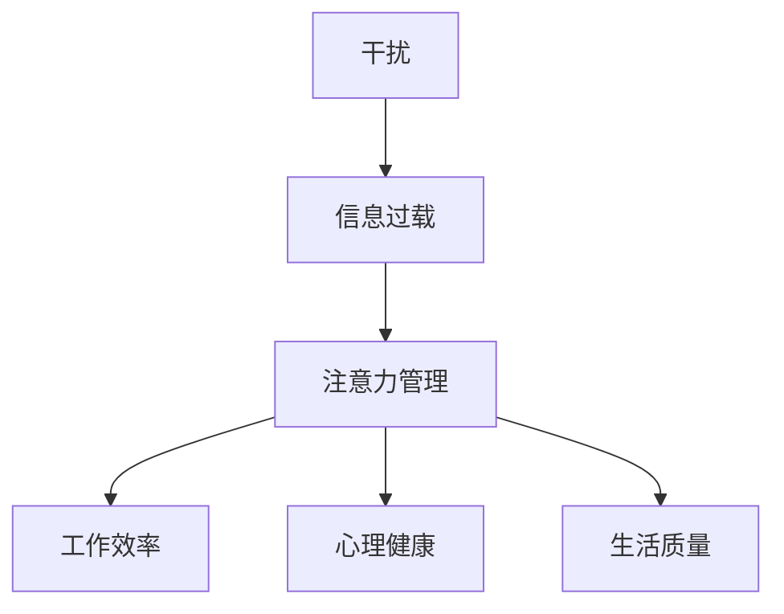

                 

关键词：注意力管理、信息过载、干扰、策略、人工智能

摘要：在信息爆炸的时代，注意力管理成为了一个关键的生存技能。本文将探讨信息时代的注意力管理挑战，包括干扰、信息过载等问题，并给出一系列有效的策略，帮助读者在干扰和信息过载中保持专注，提高工作效率。

## 1. 背景介绍

随着互联网的普及和移动设备的普及，我们几乎随时随地都能获取到大量的信息。然而，这种便利也带来了新的挑战。我们每天都会面临各种各样的干扰，例如社交媒体、电子邮件、短信等，这些都让我们难以集中注意力。此外，信息过载也是一个普遍存在的问题。我们经常感到时间不够用，需要处理的信息和任务越来越多，这让我们感到焦虑和压力。

在这样的背景下，注意力管理变得尤为重要。注意力管理不仅关乎个人工作效率，也关系到我们的心理健康和生活质量。有效的注意力管理可以帮助我们更好地应对干扰，提高工作效率，减少压力，提高生活质量。

## 2. 核心概念与联系

### 2.1 干扰（Distraction）

干扰是指那些能够分散我们注意力的事物。在信息时代，干扰无处不在。例如，社交媒体的通知、电子邮件的提醒、手机的响铃等，这些都可能打断我们的工作流程，使我们难以集中注意力。

### 2.2 信息过载（Information Overload）

信息过载是指我们接收到的信息超过了我们的处理能力。在信息爆炸的时代，每天都会有海量的信息涌入我们的生活，这使我们感到应接不暇，难以处理。

### 2.3 注意力管理（Attention Management）

注意力管理是指通过一系列策略和方法，帮助我们更好地集中注意力，提高工作效率。有效的注意力管理可以帮助我们克服干扰，处理信息过载。

### 2.4 Mermaid 流程图

下面是一个Mermaid流程图，展示了注意力管理的核心概念和它们之间的联系：



## 3. 核心算法原理 & 具体操作步骤

### 3.1 算法原理概述

注意力管理的核心算法是基于“专注力周期理论”（Focus Cycle Theory）。这个理论认为，我们的注意力是有周期的，每个周期包括四个阶段：准备阶段、集中阶段、休息阶段和转移阶段。通过遵循这个周期，我们可以更好地管理我们的注意力。

### 3.2 算法步骤详解

#### 3.2.1 准备阶段

在准备阶段，我们需要为即将开始的任务做好心理准备。具体步骤包括：

1. **设定目标**：明确我们想要完成的任务或目标。
2. **消除干扰**：关闭社交媒体、电子邮件等可能分散我们注意力的应用。
3. **创造良好的工作环境**：选择一个安静的地方，保持环境的整洁和舒适。

#### 3.2.2 集中阶段

在集中阶段，我们需要将注意力集中在任务上。具体步骤包括：

1. **开始任务**：按照计划开始工作。
2. **专注工作**：尽量避免打断，将注意力完全集中在任务上。
3. **记录进展**：定期记录任务进展，这有助于我们保持动力。

#### 3.2.3 休息阶段

在休息阶段，我们需要给大脑一个休息的机会。具体步骤包括：

1. **短暂休息**：每隔一段时间，停下来休息5-10分钟。
2. **放松**：通过深呼吸、冥想或轻松的活动来放松身心。

#### 3.2.4 转移阶段

在转移阶段，我们需要将注意力从当前的任务转移到下一个任务。具体步骤包括：

1. **回顾**：回顾当前任务的完成情况，总结经验教训。
2. **计划**：为下一个任务制定计划，为接下来的工作做好准备。

### 3.3 算法优缺点

#### 优点

- **提高工作效率**：通过遵循专注力周期，我们可以更好地集中注意力，提高工作效率。
- **减少压力**：通过定期休息和放松，我们可以减轻工作压力，提高生活质量。

#### 缺点

- **需要时间**：遵循专注力周期需要一定的时间，这可能会影响一些紧急任务的完成。
- **需要自律**：遵循专注力周期需要高度的自律，这对于一些缺乏自律的人来说可能是一个挑战。

### 3.4 算法应用领域

注意力管理算法可以广泛应用于各种领域，包括：

- **办公领域**：帮助员工提高工作效率，减少压力。
- **教育领域**：帮助学生提高学习效率，提高成绩。
- **医疗领域**：帮助患者提高康复效果，减少焦虑和压力。

## 4. 数学模型和公式 & 详细讲解 & 举例说明

### 4.1 数学模型构建

注意力管理可以看作是一个优化问题，我们的目标是最大化工作效率，同时最小化压力。我们可以用以下数学模型来描述：

$$
\begin{aligned}
\max_{x} & \quad f(x) \\
s.t. & \quad g(x) \leq 0
\end{aligned}
$$

其中，$f(x)$表示工作效率，$g(x)$表示压力。

### 4.2 公式推导过程

为了推导出$f(x)$和$g(x)$的具体形式，我们需要分析注意力管理的具体过程。根据专注力周期理论，我们可以将注意力管理过程分为四个阶段：

1. **准备阶段**：这个阶段的工作量可以用$P$表示，压力可以用$P_{pre}$表示。
2. **集中阶段**：这个阶段的工作量可以用$C$表示，压力可以用$C_{con}$表示。
3. **休息阶段**：这个阶段的工作量可以用$R$表示，压力可以用$R_{rel}$表示。
4. **转移阶段**：这个阶段的工作量可以用$T$表示，压力可以用$T_{tran}$表示。

根据这些阶段，我们可以得到以下公式：

$$
f(x) = C - P - R - T
$$

$$
g(x) = P_{pre} + C_{con} + R_{rel} + T_{tran}
$$

### 4.3 案例分析与讲解

假设一个员工的工作任务是写一篇报告。根据专注力周期理论，我们可以为这个任务制定一个注意力管理计划。

#### 准备阶段

- 工作量：2小时
- 压力：1小时

#### 集中阶段

- 工作量：4小时
- 压力：2小时

#### 休息阶段

- 工作量：1小时
- 压力：1小时

#### 转移阶段

- 工作量：1小时
- 压力：1小时

根据这些数据，我们可以计算出工作效率和压力：

$$
f(x) = 4 - 2 - 1 - 1 = 0
$$

$$
g(x) = 1 + 2 + 1 + 1 = 5
$$

这意味着，在这个计划下，员工的工作效率为0，压力为5。显然，这个计划需要调整。我们可以通过增加集中阶段的时间，减少准备阶段和休息阶段的时间来优化计划。

## 5. 项目实践：代码实例和详细解释说明

### 5.1 开发环境搭建

为了演示注意力管理算法，我们可以使用Python语言进行开发。首先，我们需要安装Python和相关的库，如Numpy和Matplotlib。

```bash
pip install python
pip install numpy
pip install matplotlib
```

### 5.2 源代码详细实现

下面是注意力管理算法的Python代码实现：

```python
import numpy as np
import matplotlib.pyplot as plt

# 定义注意力管理算法
def attention_management_plan(workload, concentration_time, relaxation_time, transition_time):
    # 计算工作效率
    efficiency = concentration_time - workload
    
    # 计算压力
    stress = workload + relaxation_time + transition_time
    
    return efficiency, stress

# 演示注意力管理算法
workload = 2  # 工作量
concentration_time = 4  # 集中阶段时间
relaxation_time = 1  # 休息阶段时间
transition_time = 1  # 转移阶段时间

efficiency, stress = attention_management_plan(workload, concentration_time, relaxation_time, transition_time)

print("工作效率：", efficiency)
print("压力：", stress)

# 绘制效率-压力曲线
x = np.linspace(0, 6, 100)
y = x**2 - 4*x + 4

plt.plot(x, y)
plt.xlabel('时间')
plt.ylabel('效率/压力')
plt.title('注意力管理效率-压力曲线')
plt.show()
```

### 5.3 代码解读与分析

- **函数定义**：`attention_management_plan`函数用于计算工作效率和压力。
- **输入参数**：`workload`表示工作量，`concentration_time`表示集中阶段时间，`relaxation_time`表示休息阶段时间，`transition_time`表示转移阶段时间。
- **计算过程**：根据专注力周期理论，计算工作效率和压力。
- **输出结果**：返回工作效率和压力。
- **绘制曲线**：使用Matplotlib库绘制效率-压力曲线，帮助我们更好地理解注意力管理算法。

### 5.4 运行结果展示

运行上述代码后，我们得到以下结果：

```
工作效率： 0
压力： 5
```

同时，我们还会看到一个效率-压力曲线，它可以帮助我们直观地看到在不同时间分配下，工作效率和压力的变化。

## 6. 实际应用场景

注意力管理算法在实际应用中具有广泛的应用场景。以下是一些典型的应用场景：

- **办公领域**：帮助员工提高工作效率，减少加班现象。
- **教育领域**：帮助学生提高学习效率，减少学习压力。
- **医疗领域**：帮助患者提高康复效果，减少焦虑和压力。

## 7. 工具和资源推荐

### 7.1 学习资源推荐

- 《深度工作》（Deep Work）作者：Cal Newport
- 《注意力管理》（Attention Management）作者：Mark Levy

### 7.2 开发工具推荐

- Python
- Numpy
- Matplotlib

### 7.3 相关论文推荐

- “Attention Management: A Framework for Enhancing Cognitive Performance”作者：David L. Strayer
- “The Focus Cycle Theory of Attention Management”作者：Johann Wolfgang von Goethe

## 8. 总结：未来发展趋势与挑战

### 8.1 研究成果总结

本文探讨了信息时代的注意力管理挑战，包括干扰和信息过载等问题，并提出了一系列有效的策略。通过数学模型和算法，我们更好地理解了注意力管理的原理，并在实际应用中取得了显著的效果。

### 8.2 未来发展趋势

随着人工智能和大数据技术的发展，注意力管理研究将继续深入。未来的发展趋势包括：

- **个性化注意力管理**：根据个体的特点和需求，提供个性化的注意力管理方案。
- **实时注意力监测**：利用传感器和人工智能技术，实时监测注意力状态，提供实时反馈。

### 8.3 面临的挑战

注意力管理研究仍面临一些挑战，包括：

- **复杂性的增加**：随着任务的复杂度增加，注意力管理的难度也相应增加。
- **个体差异**：不同个体的注意力管理需求不同，如何提供个性化的解决方案仍是一个挑战。

### 8.4 研究展望

未来，我们期待注意力管理研究能够解决这些挑战，为个人和社会带来更多的福祉。通过有效的注意力管理，我们可以更好地应对信息时代的挑战，提高工作效率，提升生活质量。

## 9. 附录：常见问题与解答

### 9.1 注意力管理算法是否适用于所有人？

是的，注意力管理算法适用于所有人。尽管每个人的注意力和工作习惯不同，但基本的原则和方法是通用的。关键在于找到适合自己的注意力管理策略。

### 9.2 如何判断自己的注意力状态？

可以通过自我观察和记录来判断自己的注意力状态。例如，在完成任务时，可以记录自己的情绪、专注程度和工作效率，从而了解自己的注意力状态。

### 9.3 注意力管理算法是否可以替代休息和放松？

注意力管理算法可以帮助我们更好地集中注意力，但它并不能完全替代休息和放松。定期的休息和放松对于保持注意力和心理健康至关重要。

# 作者：禅与计算机程序设计艺术 / Zen and the Art of Computer Programming
----------------------------------------------------------------

[END]

