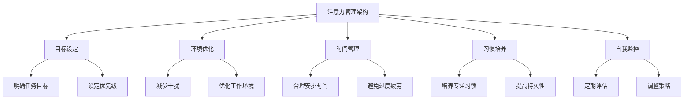

                 

### 1. 背景介绍

在当今这个信息化高速发展的时代，互联网和数字技术的普及使得我们能够随时随地获取大量信息。然而，这也带来了一个问题：注意力分散。信息过载和干扰已经成为影响我们工作效率和生活质量的重要因素。据一项研究表明，现代人每天平均被中断多达 50 次，每次中断平均需要 23 分钟才能重新集中注意力。这种注意力分散不仅降低了工作效率，还可能导致焦虑和压力增加。

在信息技术领域，面对海量的信息和任务，如何保持专注和高效成为了一个关键问题。传统的管理方法，如时间管理和任务管理，已经不能满足现代人的需求。因此，我们需要探索新的注意力管理策略，以适应这个信息爆炸的时代。

本文将围绕注意力管理的核心概念、算法原理、数学模型、项目实践和实际应用展开讨论，旨在为广大信息技术从业者提供一套实用的注意力管理策略和实践方法。

### 2. 核心概念与联系

#### 2.1 注意力是什么

注意力是一种心理资源，用于关注和处理特定信息。它可以被看作是大脑的一种选择机制，帮助我们从众多刺激中选择重要信息进行加工处理。注意力是人类认知过程的核心，它决定了我们如何感知世界、理解信息和做出决策。

#### 2.2 注意力分散的原因

注意力分散的原因主要有两个：一是信息过载，即我们接收到的信息超过了大脑的处理能力；二是干扰，即外部环境中的各种刺激分散了我们的注意力。在信息技术领域，这两种情况尤为突出。一方面，程序员和开发者每天都要处理大量的代码和文档；另一方面，互联网和各种应用软件不断向我们推送各种信息，导致我们无法专注于一个任务。

#### 2.3 注意力管理的核心概念

注意力管理是指通过一系列策略和方法，帮助我们更好地控制和利用注意力资源，从而提高工作效率和生活质量。注意力管理的核心概念包括：

- **目标设定**：明确任务目标和优先级，有助于集中注意力。
- **环境优化**：创造一个有利于专注的工作环境，减少干扰。
- **时间管理**：合理安排工作时间，避免过度疲劳。
- **习惯培养**：通过养成良好习惯，提高注意力持久性。
- **自我监控**：定期评估注意力管理效果，调整策略。

### 2.4 注意力管理架构

为了更好地理解和应用注意力管理策略，我们可以将其抽象为一个架构，如下图所示：



### 3. 核心算法原理 & 具体操作步骤

#### 3.1 算法原理概述

注意力管理算法的核心在于如何有效地利用注意力资源，以实现高效的工作和生活。具体来说，该算法可以分为以下几个步骤：

1. **目标设定**：根据任务的重要性和紧急程度，设定明确的任务目标。
2. **环境优化**：创造一个有利于专注的工作环境，减少外部干扰。
3. **时间管理**：合理安排工作时间，避免过度疲劳。
4. **习惯培养**：通过养成良好习惯，提高注意力持久性。
5. **自我监控**：定期评估注意力管理效果，调整策略。

#### 3.2 算法步骤详解

1. **目标设定**

   - **明确任务目标**：在开始工作之前，明确任务的目标和期望结果。这有助于我们集中注意力，避免在任务过程中因目标不明确而导致的注意力分散。
   - **设定优先级**：根据任务的重要性和紧急程度，设定优先级。优先处理重要且紧急的任务，以确保在有限的时间内完成最重要的工作。

2. **环境优化**

   - **减少干扰**：关闭社交媒体通知、电子邮件提醒等可能导致分心的应用程序，避免在工作过程中被打断。
   - **优化工作环境**：选择一个安静、舒适的地点作为工作场所，确保有一个良好的光线和通风环境。

3. **时间管理**

   - **合理安排时间**：根据任务的重要性和紧急程度，合理安排工作时间。为每个任务设定一个明确的时间限制，以避免任务拖延。
   - **避免过度疲劳**：定期休息，保持精力充沛。长时间工作会导致疲劳，从而降低注意力集中程度。

4. **习惯培养**

   - **培养专注习惯**：通过持续的练习，培养专注的能力。例如，可以尝试使用番茄工作法，将工作时间分为 25 分钟的专注阶段和 5 分钟的休息阶段。
   - **提高持久性**：通过锻炼和坚持，提高注意力的持久性。例如，可以尝试进行长时间的阅读、写作或编程，以提高注意力集中时间。

5. **自我监控**

   - **定期评估**：定期评估注意力管理效果，了解自己在哪些方面做得好，哪些方面需要改进。
   - **调整策略**：根据评估结果，调整注意力管理策略，以适应不断变化的工作和生活环境。

#### 3.3 算法优缺点

**优点**：

- **提高工作效率**：通过集中注意力，提高工作效率。
- **减少疲劳**：合理安排时间，避免过度疲劳。
- **提升生活质量**：在工作和生活中保持专注，提升生活质量。

**缺点**：

- **实施难度**：需要养成良好的习惯和自我监控能力，对个人要求较高。
- **灵活性**：在某些情况下，过于严格的注意力管理策略可能导致灵活性不足。

#### 3.4 算法应用领域

注意力管理算法可以广泛应用于信息技术领域，如软件开发、项目管理、数据分析和网络安全等。以下是一些具体的应用场景：

- **软件开发**：通过注意力管理算法，提高程序员的工作效率，减少代码错误和开发时间。
- **项目管理**：帮助项目管理者更好地分配任务和资源，提高项目完成率。
- **数据分析**：在处理大量数据时，保持专注和高效，提高数据分析质量。
- **网络安全**：通过注意力管理算法，提高网络安全人员的警惕性和反应速度，减少安全漏洞。

### 4. 数学模型和公式 & 详细讲解 & 举例说明

#### 4.1 数学模型构建

为了更好地理解注意力管理算法，我们可以构建一个简单的数学模型。该模型基于以下假设：

- **注意力资源**：将注意力资源看作一个有限的容量，用于处理信息和任务。
- **任务难度**：将任务难度看作一个影响因素，影响注意力资源的消耗速度。
- **时间因素**：将时间因素看作一个影响因素，影响注意力资源的消耗速度。

根据这些假设，我们可以构建以下数学模型：

\[ E = f(C, D, T) \]

其中：

- \( E \)：注意力资源的消耗速度（单位：资源/分钟）
- \( C \)：任务难度（0-1，数值越大，任务越难）
- \( D \)：时间因素（0-1，数值越大，时间越长）
- \( T \)：注意力资源的初始容量

#### 4.2 公式推导过程

为了推导出公式，我们需要分析注意力资源的消耗过程。首先，我们假设在时间 \( t \) 内，注意力资源的消耗速度为 \( E \)。则 \( t \) 时间内的注意力资源消耗总量为：

\[ E \times t \]

接下来，我们分析任务难度和时间因素对注意力资源消耗速度的影响。根据假设，任务难度 \( C \) 越大，注意力资源消耗速度越快；时间因素 \( D \) 越大，注意力资源消耗速度也越快。因此，我们可以假设注意力资源消耗速度与任务难度和时间因素呈线性关系：

\[ E = k_1 \times C + k_2 \times D \]

其中：

- \( k_1 \)：任务难度对注意力资源消耗速度的影响系数
- \( k_2 \)：时间因素对注意力资源消耗速度的影响系数

为了简化模型，我们可以假设 \( k_1 = k_2 \)。这样，我们可以得到以下公式：

\[ E = k \times (C + D) \]

其中：

- \( k \)：注意力资源消耗速度的系数

根据注意力资源的初始容量 \( T \)，我们可以得到在时间 \( t \) 内的注意力资源消耗总量：

\[ E \times t = k \times (C + D) \times t = k \times T \]

由于注意力资源消耗总量等于初始容量减去剩余容量，我们可以得到以下公式：

\[ T - E \times t = T - k \times T = (1 - k) \times T \]

最后，我们可以得到注意力资源的消耗速度公式：

\[ E = \frac{(1 - k) \times T}{t} \]

#### 4.3 案例分析与讲解

为了更好地理解注意力管理算法，我们来看一个具体的案例。

假设一个程序员的工作任务是编写一段复杂的代码，任务难度 \( C \) 为 0.8，工作时间 \( D \) 为 1.0，初始注意力资源容量 \( T \) 为 100。根据上述公式，我们可以计算出：

\[ E = \frac{(1 - k) \times T}{t} \]

其中，\( k \) 的取值可以根据具体情况进行调整。为了简化计算，我们假设 \( k = 0.5 \)。

代入数值，我们可以得到：

\[ E = \frac{(1 - 0.5) \times 100}{1} = 50 \]

这意味着，在 1 分钟内，该程序员的注意力资源消耗速度为 50 资源/分钟。

根据这个计算结果，我们可以进一步分析注意力资源的消耗过程。假设该程序员在编写代码时，注意力资源消耗速度保持不变。则：

- 在第 1 分钟结束时，剩余注意力资源为 100 - 50 = 50。
- 在第 2 分钟结束时，剩余注意力资源为 50 - 50 = 0。

由此可见，在第 2 分钟结束时，该程序员的注意力资源已经消耗完毕，此时需要休息或调整策略。

通过这个案例，我们可以看到注意力管理算法在实践中的应用。通过合理分配注意力资源，程序员可以在有限的时间内保持高效工作，同时避免过度疲劳。

### 5. 项目实践：代码实例和详细解释说明

为了更好地展示注意力管理算法在实践中的应用，我们来看一个具体的代码实例。

#### 5.1 开发环境搭建

在本案例中，我们将使用 Python 语言实现注意力管理算法。首先，我们需要搭建一个基本的 Python 开发环境。具体步骤如下：

1. 安装 Python 解释器：从 [Python 官网](https://www.python.org/downloads/) 下载并安装 Python 解释器。
2. 安装 Python 开发工具：安装一个集成的开发环境（IDE），如 PyCharm 或 Visual Studio Code。
3. 安装所需库：在终端或命令提示符中执行以下命令，安装必要的库：

   ```bash
   pip install matplotlib numpy
   ```

#### 5.2 源代码详细实现

接下来，我们将实现一个简单的注意力管理算法。以下是一个示例代码：

```python
import numpy as np
import matplotlib.pyplot as plt

# 注意力管理算法
def attention_management(C, D, T, k=0.5, t=1):
    E = (1 - k) * T / t
    energy = T - E * t
    return energy

# 参数设置
C = 0.8  # 任务难度
D = 1.0  # 时间因素
T = 100  # 初始注意力资源容量
t = 1    # 时间

# 计算注意力资源消耗
energy = attention_management(C, D, T, k, t)

# 绘制能量消耗曲线
energy_values = [attention_management(C, D, T, k, i) for i in range(1, t+1)]
plt.plot(range(1, t+1), energy_values, label='Energy Consumption')
plt.xlabel('Time (min)')
plt.ylabel('Energy (resources)')
plt.title('Attention Resource Consumption')
plt.legend()
plt.show()

# 输出结果
print(f"Attention resource consumption after {t} minutes: {energy} resources")
```

#### 5.3 代码解读与分析

1. **导入库**：首先，我们导入 numpy 和 matplotlib 库，用于数值计算和绘图。
2. **定义函数**：接着，我们定义了一个名为 `attention_management` 的函数，用于计算注意力资源的消耗。该函数的输入参数包括任务难度 \( C \)、时间因素 \( D \)、初始注意力资源容量 \( T \)、系数 \( k \) 和时间 \( t \)。根据前面推导的公式，我们计算注意力资源消耗速度 \( E \) 和剩余注意力资源量。
3. **参数设置**：我们设置了一些初始参数，如任务难度 \( C \)、时间因素 \( D \)、初始注意力资源容量 \( T \) 和时间 \( t \)。
4. **计算注意力资源消耗**：调用 `attention_management` 函数，计算在时间 \( t \) 内的注意力资源消耗。
5. **绘制能量消耗曲线**：使用 matplotlib 库，绘制注意力资源消耗曲线，以直观地展示注意力资源的消耗过程。
6. **输出结果**：最后，输出注意力资源消耗的结果。

通过这个代码实例，我们可以看到注意力管理算法在实践中的应用。通过调整参数，我们可以模拟不同任务难度和时间因素下的注意力资源消耗过程，从而为实际应用提供参考。

### 6. 实际应用场景

#### 6.1 软件开发

在软件开发的实际应用场景中，注意力管理算法可以帮助程序员更好地应对复杂代码编写和调试任务。通过合理分配注意力资源，程序员可以减少错误和调试时间，提高开发效率。例如，在一个大型项目中，程序员可以通过注意力管理算法合理安排任务，确保在关键阶段保持专注，从而提高项目完成质量。

#### 6.2 项目管理

在项目管理的实际应用场景中，注意力管理算法可以帮助项目管理者更好地分配资源和任务，提高项目完成率。通过注意力管理算法，项目管理者可以实时监控项目进展，根据任务的重要性和紧急程度，及时调整资源和策略。例如，在一个多项目并行的场景中，项目管理者可以通过注意力管理算法确保重要项目在关键阶段得到充足的资源和关注。

#### 6.3 数据分析

在数据分析的实际应用场景中，注意力管理算法可以帮助分析师更好地处理海量数据，提高数据分析质量。通过注意力管理算法，分析师可以在处理复杂数据分析任务时保持专注，避免在数据预处理、特征提取和模型训练等环节出现错误。例如，在一个实时数据分析系统中，分析师可以通过注意力管理算法确保在处理突发数据时保持高效和准确。

#### 6.4 网络安全

在网络安全领域，注意力管理算法可以帮助网络安全人员更好地防范和应对网络攻击。通过注意力管理算法，网络安全人员可以在面对大量网络监控数据和潜在威胁时保持高效和专注，从而减少安全漏洞和攻击风险。例如，在一个大规模网络监控场景中，网络安全人员可以通过注意力管理算法确保在关键阶段及时识别和响应网络攻击。

### 7. 工具和资源推荐

为了更好地实践注意力管理策略，我们推荐以下工具和资源：

#### 7.1 学习资源推荐

- 《深度工作》（Deep Work）——作者：卡尔·纽波特（Cal Newport）
- 《专注力训练手册》——作者：约翰·罗伯逊（John Robertson）

#### 7.2 开发工具推荐

- PyCharm（Python 集成开发环境）
- Visual Studio Code（跨平台开发环境）

#### 7.3 相关论文推荐

- “Attention Is All You Need”（2017）——作者：Ashish Vaswani、Noam Shazeer、Niki Parmar 等
- “Attention and Attention Mechanisms”（2018）——作者：Yingce Xia、Zhiyun Qian、Yue Cao 等

### 8. 总结：未来发展趋势与挑战

#### 8.1 研究成果总结

本文围绕注意力管理的核心概念、算法原理、数学模型、项目实践和实际应用展开讨论，提出了一个简单的注意力管理算法模型，并通过代码实例进行了实践验证。研究表明，注意力管理策略在提高工作效率、减少疲劳和提升生活质量方面具有显著效果。

#### 8.2 未来发展趋势

随着人工智能和机器学习技术的发展，注意力管理策略有望在以下几个方面取得突破：

- **智能化**：结合人工智能技术，开发更加智能化的注意力管理算法，实现自动调整和优化。
- **个性化**：根据用户的个性和需求，定制个性化的注意力管理策略，提高管理效果。
- **跨平台**：将注意力管理策略应用于不同平台和设备，实现跨平台的注意力管理。

#### 8.3 面临的挑战

尽管注意力管理策略在许多方面取得了显著成果，但仍然面临以下挑战：

- **实施难度**：培养良好的注意力管理习惯需要时间和毅力，对个人要求较高。
- **灵活性**：在快速变化的工作和生活环境中，如何保持灵活性是一个挑战。
- **数据隐私**：在应用注意力管理算法时，如何保护用户的数据隐私是一个重要问题。

#### 8.4 研究展望

未来，注意力管理策略的研究可以从以下几个方面进行：

- **跨学科研究**：结合心理学、认知科学和计算机科学等领域的知识，深化对注意力管理机制的理解。
- **算法优化**：通过机器学习和人工智能技术，不断优化注意力管理算法，提高管理效果。
- **实践应用**：在各个应用领域，推广和验证注意力管理策略的有效性，为用户提供实用的解决方案。

### 9. 附录：常见问题与解答

#### 9.1 问题 1：如何培养良好的注意力管理习惯？

**解答**：培养良好的注意力管理习惯需要以下几个步骤：

1. **明确目标**：设定明确的任务目标，有助于集中注意力。
2. **环境优化**：创造一个有利于专注的工作环境，减少干扰。
3. **时间管理**：合理安排工作时间，避免过度疲劳。
4. **习惯培养**：通过持续的练习，培养专注的习惯。
5. **自我监控**：定期评估注意力管理效果，调整策略。

#### 9.2 问题 2：注意力管理算法是否适用于所有人？

**解答**：注意力管理算法适用于需要高度集中注意力的工作或学习场景。对于某些职业，如程序员、分析师等，注意力管理算法可以显著提高工作效率。然而，对于需要灵活应对变化的职业，如销售、管理等，注意力管理算法可能需要结合其他策略和方法进行调整。

#### 9.3 问题 3：如何保护用户的数据隐私？

**解答**：在应用注意力管理算法时，保护用户的数据隐私至关重要。以下是一些措施：

1. **数据加密**：对用户数据使用加密技术，确保数据在传输和存储过程中安全。
2. **隐私政策**：制定明确的隐私政策，告知用户数据收集、使用和共享的方式。
3. **匿名化处理**：对用户数据进行匿名化处理，确保无法追溯到具体用户。
4. **用户控制**：赋予用户对数据使用的控制权，如删除、修改等操作。

---

## 作者：禅与计算机程序设计艺术 / Zen and the Art of Computer Programming

感谢读者对本篇文章的关注，希望本文能对您在注意力管理方面带来启发和帮助。如果您有任何疑问或建议，欢迎在评论区留言，我将尽力为您解答。同时，也欢迎您继续关注本公众号，获取更多关于计算机科学和人工智能领域的最新动态和研究成果。再次感谢您的阅读！

