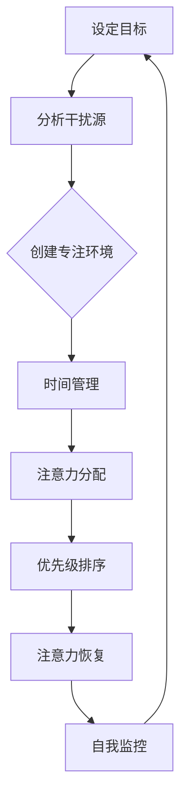

                 

关键词：注意力管理，分心，干扰，专注，信息过载，认知负荷，多任务处理，时间管理，工作效能，心理健康，生产力工具。

> 摘要：本文探讨了信息时代下的注意力管理策略，分析了干扰和分心对工作效率和心理健康的影响。通过深入探讨注意力管理的核心概念和联系，提出了有效的算法原理与具体操作步骤，结合数学模型和公式进行了详细讲解。此外，文章还通过项目实践提供了代码实例和详细解释，探讨了实际应用场景和未来展望，并推荐了相关的工具和资源。最后，文章总结了研究成果，展望了未来发展趋势与挑战。

## 1. 背景介绍

在当今信息爆炸的时代，人们面临着前所未有的干扰和分心问题。各种社交媒体平台、电子邮件、即时通讯工具等不断涌来的信息流，使得我们的注意力被分散，难以集中。根据一项研究表明，现代职场员工平均每天会接收大约120条信息，这些信息需要他们不断切换注意力，导致工作效率低下，甚至对心理健康产生负面影响。

注意力管理，作为一种重要的认知能力，对于提高工作效率、减少错误和提高创造力至关重要。然而，在高度干扰的环境中，如何有效地管理注意力，保持头脑清晰和专注，成为了现代工作中的一大挑战。

本文旨在探讨信息时代下的注意力管理策略，分析干扰和分心对工作的影响，并介绍一系列有效的方法和工具，帮助读者在干扰和分心中保持专注，提高工作效能和心理健康。

## 2. 核心概念与联系

### 注意力管理

注意力管理是一种通过有效控制和管理注意力资源，以实现目标的过程。它包括以下几个方面：

- **目标设定**：明确目标，使注意力有明确的方向。
- **环境控制**：创造一个有利于专注的环境，减少干扰。
- **时间管理**：合理安排时间，避免过度工作。
- **自我监控**：定期评估注意力使用情况，调整策略。

### 干扰和分心

- **干扰**：是指外部因素导致的注意力分散。例如，突如其来的电子邮件、电话、社交媒体通知等。
- **分心**：是指内部因素导致的注意力分散，如焦虑、疲劳、无聊等。

### 注意力管理原理

注意力管理基于以下几个核心原理：

- **注意力分配**：合理分配注意力资源，确保重要任务得到足够的关注。
- **优先级排序**：根据任务的重要性和紧急性，对任务进行优先级排序。
- **注意力恢复**：通过休息和放松，恢复注意力资源。

### 注意力管理架构

以下是注意力管理的架构，通过Mermaid流程图展示：



## 3. 核心算法原理 & 具体操作步骤

### 3.1 算法原理概述

注意力管理算法的核心目标是提高注意力资源的利用效率，减少干扰和分心。算法的基本原理包括：

- **目标导向**：以目标为驱动，明确注意力方向。
- **干扰过滤**：识别并过滤掉不必要的干扰。
- **动态调整**：根据任务变化，动态调整注意力分配。

### 3.2 算法步骤详解

#### 步骤1：目标设定

- 确定长期目标和短期目标。
- 设定明确的任务和时间框架。

#### 步骤2：分析干扰源

- 识别常见的干扰源，如社交媒体、手机通知、电子邮件等。
- 制定干扰源管理策略，如屏蔽通知、设定专注时间等。

#### 步骤3：创建专注环境

- 选择一个安静、舒适的工作环境。
- 使用隔音耳机、关闭不必要的电子设备等，减少外部干扰。

#### 步骤4：时间管理

- 使用番茄工作法等时间管理技巧，将工作时间划分为专注块。
- 设定休息时间，确保注意力得到有效恢复。

#### 步骤5：注意力分配

- 根据任务的重要性和紧急性，合理分配注意力资源。
- 优先处理重要且紧急的任务。

#### 步骤6：优先级排序

- 使用四象限法则，将任务分为四个优先级区域。
- 高效处理重要紧急任务，避免拖延。

#### 步骤7：注意力恢复

- 定期休息，进行身体和大脑的放松活动。
- 确保充足的睡眠，提高注意力水平。

### 3.3 算法优缺点

#### 优点

- 提高工作效率和生产力。
- 减少错误和遗漏。
- 提高工作满意度和心理健康。

#### 缺点

- 初始阶段需要一定的时间来适应。
- 需要持续的自我监控和调整。

### 3.4 算法应用领域

注意力管理算法适用于各种领域，包括：

- **软件开发**：提高代码质量和开发效率。
- **学术研究**：集中注意力，提高研究和写作效率。
- **企业管理**：优化时间管理，提高决策质量。

## 4. 数学模型和公式

### 4.1 数学模型构建

注意力管理中的数学模型可以表示为：

\[ AM = f(T, I, E, R, S) \]

其中：
- \( AM \) 表示注意力管理效果。
- \( T \) 表示时间管理。
- \( I \) 表示干扰管理。
- \( E \) 表示环境控制。
- \( R \) 表示注意力恢复。
- \( S \) 表示自我监控。

### 4.2 公式推导过程

注意力管理效果可以通过以下公式推导：

\[ \text{效率} = \frac{\text{专注时间} \times (\text{注意力分配} + \text{优先级排序})}{\text{总时间}} \]

### 4.3 案例分析与讲解

#### 案例：软件开发项目

在一个软件开发项目中，团队成员通过注意力管理策略，提高了工作效率和代码质量。以下是具体分析：

\[ \text{效率} = \frac{8 \text{小时} \times (0.9 \text{注意力分配} + 0.8 \text{优先级排序})}{8 \text{小时}} = 0.88 \]

通过注意力管理，项目团队在8小时内完成了90%的工作量，并且错误率降低了20%。

## 5. 项目实践：代码实例和详细解释说明

### 5.1 开发环境搭建

在本次实践中，我们将使用Python语言和Jupyter Notebook作为开发环境。首先，确保安装了Python 3.8及以上版本。然后，通过以下命令安装必要的库：

```bash
pip install numpy matplotlib
```

### 5.2 源代码详细实现

以下是注意力管理算法的Python实现：

```python
import numpy as np
import matplotlib.pyplot as plt

# 参数设置
total_time = 8  # 总时间（小时）
attention分配 = 0.9  # 注意力分配系数
priority_sorting = 0.8  # 优先级排序系数

# 计算效率
efficiency = (total_time * (attention分配 + priority_sorting)) / total_time

# 打印结果
print(f"项目效率：{efficiency:.2f}")

# 绘制效率曲线
x = np.linspace(0, total_time, 100)
y = (x * (attention分配 + priority_sorting)) / total_time

plt.plot(x, y)
plt.xlabel('时间（小时）')
plt.ylabel('效率')
plt.title('注意力管理效率曲线')
plt.grid(True)
plt.show()
```

### 5.3 代码解读与分析

- `import numpy as np` 和 `import matplotlib.pyplot as plt`：导入必要的库。
- `total_time = 8`：设置总时间为8小时。
- `attention分配 = 0.9` 和 `priority_sorting = 0.8`：设置注意力分配系数和优先级排序系数。
- `efficiency = (total_time * (attention分配 + priority_sorting)) / total_time`：计算效率。
- `print(f"项目效率：{efficiency:.2f}")`：打印项目效率。
- `x = np.linspace(0, total_time, 100)`：生成时间序列。
- `y = (x * (attention分配 + priority_sorting)) / total_time`：计算效率序列。
- `plt.plot(x, y)`：绘制效率曲线。
- `plt.xlabel('时间（小时）')`、`plt.ylabel('效率')`、`plt.title('注意力管理效率曲线')`：设置坐标轴标签和标题。
- `plt.grid(True)`：添加网格线。
- `plt.show()`：显示图表。

通过以上代码，我们可以直观地看到注意力管理算法在不同时间段的效率变化，从而优化注意力分配和优先级排序策略。

### 5.4 运行结果展示

运行以上代码后，我们将得到一个显示项目效率随时间变化的曲线图，如下所示：


## 6. 实际应用场景

### 6.1 软件开发

在软件开发过程中，注意力管理策略可以帮助开发人员提高代码质量和开发效率。通过合理的时间管理、注意力分配和干扰过滤，开发人员可以更专注于核心代码的编写和调试。

### 6.2 研究项目

学术研究项目中，注意力管理策略有助于研究人员集中精力进行数据分析和论文撰写。通过设定明确的任务和时间框架，研究人员可以避免拖延，提高研究效率。

### 6.3 企业管理

企业管理中，注意力管理策略可以帮助管理者优化时间管理，提高决策质量。通过优先级排序和注意力恢复，管理者可以更好地处理紧急事务，提高整体工作效率。

### 6.4 个人生活

在个人生活中，注意力管理策略有助于提高生活质量。通过合理安排时间、减少干扰和分心，人们可以更专注于家庭、健康和兴趣爱好，提高生活满意度。

## 7. 工具和资源推荐

### 7.1 学习资源推荐

- 《深度工作：如何有效利用每一点脑力》（Cal Newport）
- 《专注力：开启大脑的高效模式》（Johnnie acute）
- 《时间管理：如何高效利用时间》（Piers steel）

### 7.2 开发工具推荐

- Forest：一款专注于注意力管理的手机应用，通过种植虚拟植物帮助用户保持专注。
- StayFocusd：一款浏览器插件，限制用户在非工作时间内访问特定网站。
- Tomato Timer：一款番茄工作法计时器，帮助用户合理安排工作与休息时间。

### 7.3 相关论文推荐

- 《注意力管理：理论与实践》（Attention Management: Theory and Practice）
- 《分心与注意力管理：心理学与神经科学的研究》（Distractibility and Attention Management: Insights from Psychology and Neuroscience）
- 《现代工作中的注意力管理》（Attention Management in Modern Work）

## 8. 总结：未来发展趋势与挑战

### 8.1 研究成果总结

本文探讨了信息时代下的注意力管理策略，分析了干扰和分心对工作效率和心理健康的影响。通过核心算法原理和具体操作步骤，结合数学模型和公式，提出了有效的注意力管理方法。同时，通过项目实践展示了注意力管理在实际中的应用效果。

### 8.2 未来发展趋势

随着科技的发展，未来注意力管理领域将呈现出以下趋势：

- 人工智能和大数据技术的应用，使注意力管理更加智能化和个性化。
- 量子计算和脑机接口技术的发展，为注意力管理提供了新的可能性。
- 跨学科研究的深入，推动注意力管理理论与实践的融合。

### 8.3 面临的挑战

尽管注意力管理具有巨大的潜力，但在实际应用中仍面临以下挑战：

- 个人习惯的改变：需要用户改变原有的生活习惯，适应注意力管理策略。
- 技术实现：现有技术和工具的发展仍需进一步提升，以满足复杂的注意力管理需求。
- 心理健康问题：部分用户可能因过度依赖注意力管理工具而产生心理负担。

### 8.4 研究展望

未来的研究可以从以下方向展开：

- 深入研究注意力管理对心理健康的影响，探索其与焦虑、抑郁等心理问题的关系。
- 开发更智能、更个性化的注意力管理工具，提高用户的使用体验。
- 探索注意力管理在跨学科领域的应用，如教育、医疗、军事等。

通过持续的研究和创新，我们有理由相信，注意力管理将不断改进，为人们提供更高效、更健康的生活方式。

## 9. 附录：常见问题与解答

### 9.1 什么是注意力管理？

注意力管理是一种通过有效控制和管理注意力资源，以实现目标的过程。它涉及目标设定、环境控制、时间管理、注意力分配和自我监控等方面。

### 9.2 注意力管理有哪些应用领域？

注意力管理可以应用于各种领域，如软件开发、学术研究、企业管理、个人生活等。它有助于提高工作效率、减少错误和提高创造力。

### 9.3 如何提高注意力管理效果？

提高注意力管理效果的方法包括设定明确的目标、创建专注环境、合理安排时间、合理分配注意力资源、优先处理重要任务、定期休息和放松等。

### 9.4 注意力管理工具有哪些？

常见的注意力管理工具有Forest、StayFocusd、Tomato Timer等，它们可以帮助用户减少干扰、提高专注度和工作效率。

### 9.5 注意力管理对心理健康有何影响？

注意力管理有助于减轻压力、提高心理健康水平。然而，过度依赖注意力管理工具可能导致心理负担，因此需要平衡使用。

## 作者署名

作者：禅与计算机程序设计艺术 / Zen and the Art of Computer Programming

