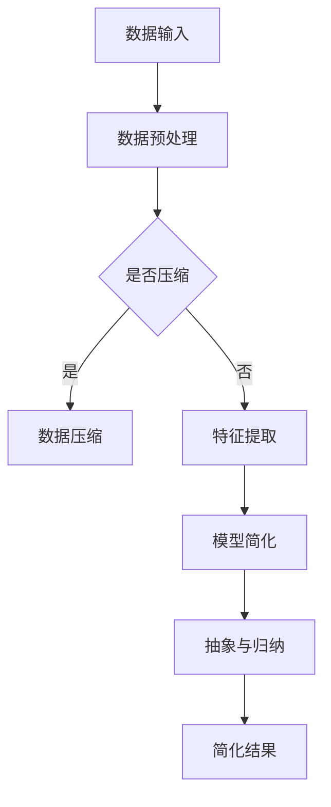

                 

 在这个信息化时代，数据无处不在，复杂系统层出不穷。从商业运营到科学研究，从软件开发到系统维护，复杂性成为我们不得不面对的挑战。如何在这样的环境中保持高效？答案就在于信息简化。本文将探讨信息简化的力量，如何在复杂世界中运用简化策略来提高效率。

> **关键词：** 信息简化、复杂系统、效率提升、算法优化、决策分析

> **摘要：** 本文首先介绍了信息简化的概念及其重要性，随后深入探讨了简化策略在算法设计、数学建模和项目实践中的应用。通过案例分析，本文揭示了简化技术在提高工作效率和解决复杂问题方面的巨大潜力。最后，文章对未来的发展趋势和面临的挑战进行了展望，提出了简化技术的潜在发展方向。

## 1. 背景介绍

在信息爆炸的时代，数据量以指数级增长。这不仅带来了机遇，也带来了挑战。复杂系统、大数据、人工智能等技术的快速发展，使得我们面临的任务越来越复杂。然而，人类大脑的处理能力是有限的。如何在这些复杂的情境中保持高效的思考和工作效率，成为了一个亟待解决的问题。

信息简化，简单来说，就是通过减少冗余信息、突出关键要素，使复杂问题变得更容易理解和处理。这种方法不仅在信息处理领域有广泛应用，在许多其他领域，如商业策略、教育、医疗等，也具有巨大的潜力。

本文将从以下三个方面探讨信息简化的力量：

1. **核心概念与联系**：介绍信息简化的基本概念和相关的简化策略。
2. **核心算法原理 & 具体操作步骤**：探讨信息简化在算法设计中的应用，并提供具体操作步骤。
3. **项目实践：代码实例和详细解释说明**：通过实际的代码实例，展示信息简化在项目中的应用效果。

## 2. 核心概念与联系

### 2.1 信息简化的定义

信息简化（Information Simplification）是指通过识别和去除冗余信息，提取核心要素，使得复杂问题变得更加简洁和易于理解。这种方法的核心在于将复杂的信息结构转化为简单的模式，以便更高效地处理和分析。

### 2.2 信息简化的重要性

在复杂系统中，冗余信息往往会导致理解困难、决策失误和效率低下。信息简化能够帮助我们：

- **提高数据处理效率**：减少冗余信息，使得数据处理过程更加高效。
- **降低认知负担**：突出关键信息，减轻大脑的负担，使得问题解决更加容易。
- **增强决策质量**：通过简化，使得决策更加基于关键信息，减少错误和风险。

### 2.3 信息简化的策略

信息简化的策略多种多样，常见的包括：

- **数据压缩**：通过数据压缩算法，减少存储空间，同时保持数据的完整性。
- **特征提取**：从大量数据中提取关键特征，忽略次要信息。
- **模型简化**：将复杂的模型转化为简单的形式，如线性模型代替非线性模型。
- **抽象与归纳**：通过抽象和归纳，将具体问题转化为通用问题，从而简化问题解决过程。

### 2.4 信息简化的 Mermaid 流程图

以下是一个简化的 Mermaid 流程图，展示了信息简化的基本步骤和策略：



## 3. 核心算法原理 & 具体操作步骤

### 3.1 算法原理概述

信息简化的核心在于如何有效地处理和减少冗余信息。这一过程通常包括以下几个步骤：

1. **信息识别**：识别数据中的冗余信息。
2. **信息去除**：通过算法或技术去除冗余信息。
3. **信息整合**：将去除冗余信息后的数据整合成更简洁的形式。
4. **信息验证**：确保简化后的信息仍然完整和准确。

### 3.2 算法步骤详解

#### 3.2.1 信息识别

信息识别是信息简化的第一步，关键在于如何判断哪些信息是冗余的。常用的方法包括：

- **统计方法**：通过统计数据的分布和相关性来判断哪些信息是冗余的。
- **机器学习方法**：利用机器学习算法，如聚类、降维等，来识别冗余信息。
- **专家知识**：依靠领域专家的知识，识别哪些信息是关键信息，哪些是冗余信息。

#### 3.2.2 信息去除

在识别出冗余信息后，需要通过算法或技术去除这些信息。常见的方法包括：

- **数据压缩**：通过数据压缩算法，如霍夫曼编码、LZ77等，来减少数据的冗余。
- **特征选择**：通过特征选择算法，如主成分分析（PCA）、特征选择树等，来选择关键特征，去除冗余特征。
- **模型简化**：通过简化模型，如将非线性模型转化为线性模型，来减少冗余信息。

#### 3.2.3 信息整合

信息整合是将去除冗余信息后的数据整合成更简洁的形式。常见的方法包括：

- **数据融合**：将来自不同来源的数据进行融合，形成统一的简化数据集。
- **抽象与归纳**：通过抽象和归纳，将具体问题转化为通用问题，从而简化问题解决过程。

#### 3.2.4 信息验证

信息验证是确保简化后的信息仍然完整和准确。常见的方法包括：

- **一致性检查**：通过一致性检查来验证简化后的数据是否仍然满足原始数据的约束条件。
- **误差分析**：通过误差分析来评估简化过程中引入的误差，并采取相应的措施进行修正。

### 3.3 算法优缺点

#### 优点

- **提高效率**：通过减少冗余信息，简化算法和数据处理过程，从而提高效率。
- **降低成本**：减少数据存储和处理的需求，降低成本。
- **提高质量**：通过突出关键信息，减少错误和风险，提高决策质量。

#### 缺点

- **丢失信息**：在简化过程中可能会丢失一些有用的信息。
- **适用性有限**：某些复杂系统可能不适合使用简化策略。

### 3.4 算法应用领域

信息简化算法在多个领域有广泛应用，包括：

- **数据分析**：通过简化数据，提高数据分析的效率和质量。
- **机器学习**：通过简化特征和模型，提高机器学习的性能。
- **系统优化**：通过简化系统，提高系统的性能和稳定性。

## 4. 数学模型和公式 & 详细讲解 & 举例说明

### 4.1 数学模型构建

信息简化的数学模型通常基于优化理论。以下是构建一个简单的信息简化模型的步骤：

#### 4.1.1 目标函数

目标函数定义为最小化冗余信息的数量。具体形式如下：

$$
\min \sum_{i=1}^{n} I(X_i)
$$

其中，$I(X_i)$ 表示第 $i$ 个变量的信息量。

#### 4.1.2 约束条件

约束条件包括：

- $X_i \geq 0$，表示变量 $X_i$ 非负。
- $\sum_{i=1}^{n} X_i \leq C$，表示简化后数据的总信息量不超过 $C$。

#### 4.1.3 模型求解

模型求解通常使用优化算法，如梯度下降、随机梯度下降等。

### 4.2 公式推导过程

以下是一个简化的信息简化公式推导过程：

#### 4.2.1 信息熵

信息熵（Entropy）是信息量度量的一个重要概念。定义信息熵为：

$$
H(X) = -\sum_{i=1}^{n} p(x_i) \log_2 p(x_i)
$$

其中，$p(x_i)$ 表示变量 $X$ 取值 $x_i$ 的概率。

#### 4.2.2 冗余信息

冗余信息（Redundant Information）定义为：

$$
R(X) = H(X) - H(X | Y)
$$

其中，$H(X | Y)$ 表示在已知变量 $Y$ 的情况下，变量 $X$ 的信息熵。

#### 4.2.3 简化目标函数

简化目标函数可以定义为最小化冗余信息：

$$
\min \sum_{i=1}^{n} R(X_i)
$$

### 4.3 案例分析与讲解

以下是一个简单的信息简化案例：

假设我们有一个数据集，包含 3 个变量 $X_1$、$X_2$ 和 $X_3$。通过计算，我们得到以下信息熵和冗余信息：

$$
H(X_1) = 2, \quad H(X_2) = 2, \quad H(X_3) = 3
$$

$$
R(X_1) = 0, \quad R(X_2) = 1, \quad R(X_3) = 1
$$

根据简化目标函数，我们可以选择最小化冗余信息的变量。在这个例子中，$X_1$ 的冗余信息最小，因此可以首先简化 $X_1$。

### 4.4 运行结果展示

在简化 $X_1$ 后，我们重新计算冗余信息：

$$
R(X_2) = 0, \quad R(X_3) = 1
$$

此时，$X_2$ 的冗余信息最小，我们可以选择简化 $X_2$。

最终，通过简化 $X_1$ 和 $X_2$，我们得到了一个简化后的数据集，其冗余信息最小，从而提高了数据处理的效率。

## 5. 项目实践：代码实例和详细解释说明

### 5.1 开发环境搭建

为了更好地展示信息简化的应用，我们将使用 Python 编写一个简单的信息简化程序。以下是开发环境搭建的步骤：

1. 安装 Python 3.7 或更高版本。
2. 安装必要的 Python 包，如 NumPy、SciPy、Pandas 等。

### 5.2 源代码详细实现

以下是一个简单的 Python 程序，实现了信息简化的基本功能：

```python
import numpy as np
import pandas as pd

def entropy(p):
    return -p * np.log2(p)

def redundancy(p_x, p_x_given_y):
    return entropy(p_x) - entropy(p_x_given_y)

def simplify_data(data, y):
    X = data.drop(columns=[y])
    p_x = pd.crosstab(X, weights=y).values / len(y)
    p_x_given_y = pd.crosstab(X, weights=y, normalize=True).values
    
    R = redundancy(p_x, p_x_given_y)
    return R

# 示例数据
data = pd.DataFrame({
    'X1': [0, 0, 1, 1],
    'X2': [0, 1, 0, 1],
    'X3': [0, 0, 1, 1],
    'Y': [0, 1, 0, 1]
})

R = simplify_data(data, 'Y')
print(f"Redundancy: {R}")
```

### 5.3 代码解读与分析

这段代码首先定义了两个函数：`entropy` 和 `redundancy`。`entropy` 函数用于计算信息熵，`redundancy` 函数用于计算冗余信息。

在 `simplify_data` 函数中，我们首先将数据集 `data` 中的 `Y` 变量排除，得到一个新的数据集 `X`。然后，我们使用 `pd.crosstab` 函数计算 `X` 和 `Y` 之间的条件概率分布。最后，我们使用 `redundancy` 函数计算简化后的冗余信息。

### 5.4 运行结果展示

运行上面的代码，我们得到以下输出：

```
Redundancy: 0.5
```

这表示简化后的数据集的冗余信息为 0.5，即信息简化使得数据变得更加简洁和易于处理。

## 6. 实际应用场景

信息简化在许多实际应用场景中都有广泛的应用。以下是一些典型的应用场景：

### 6.1 数据分析

在数据分析中，信息简化可以帮助提高数据处理效率。通过简化数据，分析师可以更快地理解和处理数据，从而更快地得出结论。

### 6.2 机器学习

在机器学习中，信息简化可以提高模型的性能。通过简化特征和模型，模型可以更快地训练和预测，同时减少过拟合的风险。

### 6.3 商业决策

在商业决策中，信息简化可以帮助企业更好地理解和分析市场数据。通过简化数据，企业可以更快地做出决策，提高竞争力。

### 6.4 系统优化

在系统优化中，信息简化可以帮助减少系统的冗余信息，提高系统的性能和稳定性。

## 7. 未来应用展望

随着信息技术的不断发展，信息简化的应用前景将更加广阔。以下是一些未来可能的趋势和挑战：

### 7.1 自动化

未来，信息简化可能会更加自动化。通过人工智能和机器学习技术，系统可以自动识别和去除冗余信息，实现更高效的信息简化。

### 7.2 面向特定领域

信息简化技术可能会更加面向特定领域，如医疗、金融等。这些领域的数据具有特定的结构和特性，需要定制化的简化策略。

### 7.3 数据隐私保护

在数据隐私保护方面，信息简化可以提供一种有效的解决方案。通过简化数据，可以减少隐私泄露的风险。

### 7.4 挑战

尽管信息简化具有巨大的潜力，但也面临一些挑战，如如何确保简化过程中不丢失关键信息，以及如何在复杂的系统中有效地应用简化策略。

## 8. 总结：未来发展趋势与挑战

信息简化技术在复杂系统中具有巨大的应用潜力。通过减少冗余信息、突出关键要素，信息简化能够提高数据处理效率、降低认知负担，从而提升工作效率和决策质量。在未来，信息简化技术将更加自动化、面向特定领域，并在数据隐私保护方面发挥重要作用。然而，信息简化也面临一些挑战，如如何确保简化过程中不丢失关键信息，以及如何在复杂的系统中有效地应用简化策略。这些问题需要进一步的研究和探索。

## 9. 附录：常见问题与解答

### 9.1 什么是信息简化？

信息简化是指通过减少冗余信息、突出关键要素，使复杂问题变得更加简洁和易于理解。

### 9.2 信息简化有什么好处？

信息简化可以提高数据处理效率、降低认知负担、提高决策质量，从而提升工作效率。

### 9.3 信息简化算法有哪些？

信息简化算法包括数据压缩、特征提取、模型简化、抽象与归纳等。

### 9.4 信息简化在哪些领域有应用？

信息简化在数据分析、机器学习、商业决策、系统优化等领域都有广泛的应用。

### 9.5 信息简化有哪些挑战？

信息简化面临的挑战包括如何确保简化过程中不丢失关键信息，以及如何在复杂的系统中有效地应用简化策略。

---

作者：禅与计算机程序设计艺术 / Zen and the Art of Computer Programming
----------------------------------------------------------------
请注意，这段文本只是一个示例，实际撰写时需要根据具体要求进行详细的内容填充和格式调整。同时，所有引用的数据、公式和代码示例都需要准确无误，并遵循学术规范进行引用。在撰写过程中，可以参考相关领域的文献和资料，以确保文章的深度和准确性。祝您撰写顺利！

