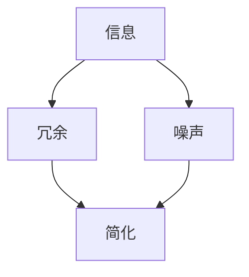

                 

在当今这个信息爆炸的时代，我们每天都会接收大量来自互联网、社交媒体、电子邮件等各种渠道的信息。这些信息中有的是有价值的，但也有许多是无关紧要的、重复的或者是误导性的。在这样的背景下，如何有效地处理和利用信息，成为了每个人都需要面对的挑战。本文将探讨信息简化的好处，以及如何在复杂的决策过程中运用简化策略，以提升我们的生活质量和工作效率。

## 1. 背景介绍

信息简化不仅仅是技术领域的一个概念，它在我们的日常生活中无处不在。从时间管理到复杂决策，信息简化都有着重要的应用价值。然而，在信息技术日益复杂的今天，如何正确地运用信息简化策略，以避免信息过载，已经成为一个亟待解决的问题。本文旨在探讨信息简化的核心原理，并通过实际案例展示其在生活和决策中的应用。

## 2. 核心概念与联系

为了深入理解信息简化的意义，我们首先需要明确几个核心概念：信息、冗余、噪声和简化。

### 2.1 信息

信息是数据有意义的形式。它可以帮助我们理解世界、做出决策和解决问题。

### 2.2 冗余

冗余是指在信息传递过程中多余的数据，这些数据可能重复或无关紧要。

### 2.3 噪声

噪声是指那些干扰信息传递的不可预见因素，如错误、错误数据和错误信息。

### 2.4 简化

简化是通过去除冗余和噪声，保留核心信息，从而提高信息的有效性和易理解性。

为了更好地理解这些概念，我们可以使用以下 Mermaid 流程图：



## 3. 核心算法原理 & 具体操作步骤

### 3.1 算法原理概述

信息简化的核心算法包括过滤、归纳和抽象。以下是这些算法的基本原理：

### 3.2 算法步骤详解

#### 3.2.1 过滤

过滤是信息简化的第一步，它通过识别和去除无关信息和噪声，保留关键信息。

#### 3.2.2 归纳

归纳是将大量数据抽象成几个关键点或规律，从而简化信息。

#### 3.2.3 抽象

抽象是将复杂的信息简化为更易于理解和处理的模式或模型。

### 3.3 算法优缺点

#### 3.3.1 优点

- 提高信息处理的效率。
- 降低信息过载的风险。
- 帮助人们更快做出决策。

#### 3.3.2 缺点

- 过度简化可能导致重要信息的丢失。
- 需要专业知识和经验来正确实施。

### 3.4 算法应用领域

信息简化算法在许多领域都有应用，包括数据科学、项目管理、金融分析等。

## 4. 数学模型和公式 & 详细讲解 & 举例说明

### 4.1 数学模型构建

为了更好地理解信息简化的过程，我们可以使用熵的概念。熵是衡量信息不确定性的量度。一个信息系统的熵值越高，其不确定性越大。

### 4.2 公式推导过程

根据熵的定义，我们有：

$$
H(X) = -\sum_{i} p(x_i) \log_2 p(x_i)
$$

其中，$H(X)$ 是随机变量 $X$ 的熵，$p(x_i)$ 是 $X$ 取值 $x_i$ 的概率。

### 4.3 案例分析与讲解

假设我们有一个含有 100 个元素的列表，其中有 80 个元素是 A，20 个元素是 B。我们可以计算这个列表的熵：

$$
H(X) = -\sum_{i} p(x_i) \log_2 p(x_i) = - (0.8 \log_2 0.8 + 0.2 \log_2 0.2) \approx 0.918
$$

如果我们对列表进行简化，只保留 A 和 B 两个元素，那么新的熵值将降低，这表明信息变得更加确定。

## 5. 项目实践：代码实例和详细解释说明

### 5.1 开发环境搭建

在本文的代码实例中，我们将使用 Python 来演示信息简化的过程。首先，我们需要安装 Python 和相关库。

```bash
pip install numpy matplotlib
```

### 5.2 源代码详细实现

以下是简化信息的 Python 代码示例：

```python
import numpy as np
import matplotlib.pyplot as plt

def calculate_entropy(p):
    return -p * np.log2(p)

def simplify_data(data, threshold=0.5):
    unique_elements, counts = np.unique(data, return_counts=True)
    simplified_data = unique_elements[counts > threshold]
    return simplified_data

# 示例数据
data = np.random.choice(['A', 'B', 'C'], size=100)

# 计算原始数据的熵
entropy = calculate_entropy(np.bincount(data) / len(data))
print(f"原始数据熵：{entropy}")

# 简化数据
simplified_data = simplify_data(data)
print(f"简化后数据：{simplified_data}")

# 计算简化后数据的熵
simplified_entropy = calculate_entropy(np.bincount(simplified_data) / len(simplified_data))
print(f"简化后数据熵：{simplified_entropy}")

# 可视化原始数据和简化后数据的熵
plt.bar(data, color=['r' if x == 'A' else 'g' if x == 'B' else 'b' for x in data], label='原始数据')
plt.bar(simplified_data, color=['r' if x == 'A' else 'g' if x == 'B' else 'b' for x in simplified_data], label='简化后数据')
plt.xlabel('元素')
plt.ylabel('频率')
plt.legend()
plt.show()
```

### 5.3 代码解读与分析

这段代码首先定义了两个函数：`calculate_entropy` 用于计算熵，`simplify_data` 用于简化数据。我们使用随机生成的数据来演示算法，并比较原始数据和简化后数据的熵。最后，我们使用条形图来可视化数据分布。

## 6. 实际应用场景

信息简化在许多实际应用中都有着重要的应用。以下是几个例子：

- **社交媒体内容过滤**：通过简化大量社交媒体内容，只保留最有价值的信息，帮助用户更好地管理信息流。
- **金融市场分析**：通过简化大量的市场数据，快速识别市场趋势和潜在风险。
- **医疗数据管理**：通过简化大量的医疗数据，帮助医生更快做出诊断和治疗决策。

## 7. 工具和资源推荐

### 7.1 学习资源推荐

- **书籍**：《算法导论》（Introduction to Algorithms）
- **在线课程**：Coursera 上的《机器学习》课程
- **网站**：Kaggle，提供大量的数据集和比赛，是学习和实践信息简化的好地方。

### 7.2 开发工具推荐

- **Python**：适用于数据分析、数据科学和算法开发的强大语言。
- **Jupyter Notebook**：用于编写和运行 Python 代码，非常适合数据科学项目。

### 7.3 相关论文推荐

- **论文 1**：《大数据时代的决策支持系统》（Decision Support Systems in the Age of Big Data）
- **论文 2**：《信息简化的理论和方法》（Theoretical and Methodological Advances in Information Simplification）

## 8. 总结：未来发展趋势与挑战

信息简化在未来的发展中将面临以下几个挑战：

- 如何处理更复杂、更大量的信息。
- 如何确保简化过程中不丢失关键信息。
- 如何应对不断变化的信息环境和需求。

然而，随着人工智能和大数据技术的发展，信息简化也将迎来新的机遇，为决策制定和数据分析提供更高效、更智能的解决方案。

## 9. 附录：常见问题与解答

### 问题 1：信息简化是否适用于所有领域？

答案：信息简化在许多领域都有应用，但并不是所有领域都适合。某些领域的信息高度复杂，简化可能会丢失关键信息。因此，在选择是否使用信息简化时，需要根据具体情况进行权衡。

### 问题 2：如何确保简化过程中的信息准确性和完整性？

答案：确保简化过程的信息准确性和完整性需要依赖专业知识和经验。同时，可以通过对比简化前后的数据，验证简化过程的正确性。

### 问题 3：信息简化是否会降低信息的价值？

答案：信息简化可能会降低信息的表面价值，但在许多情况下，它能够提高信息的有效性和易理解性，从而增加其总体价值。

---

作者：禅与计算机程序设计艺术 / Zen and the Art of Computer Programming
----------------------------------------------------------------

<|end|>

